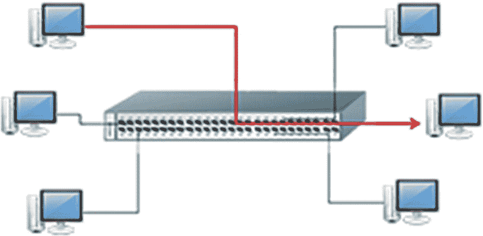
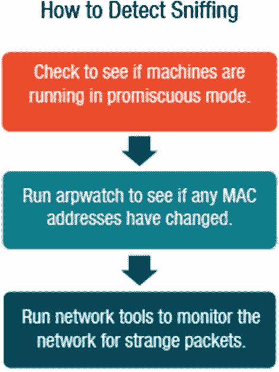
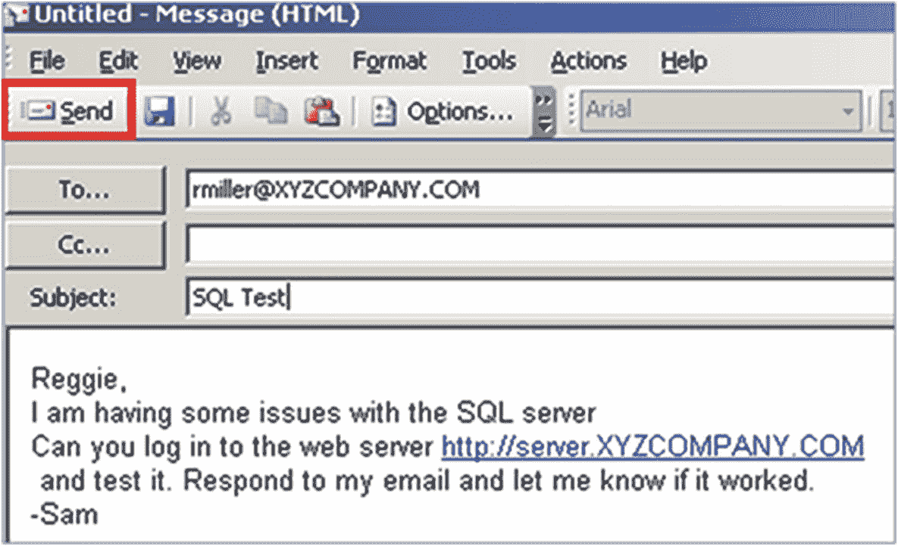
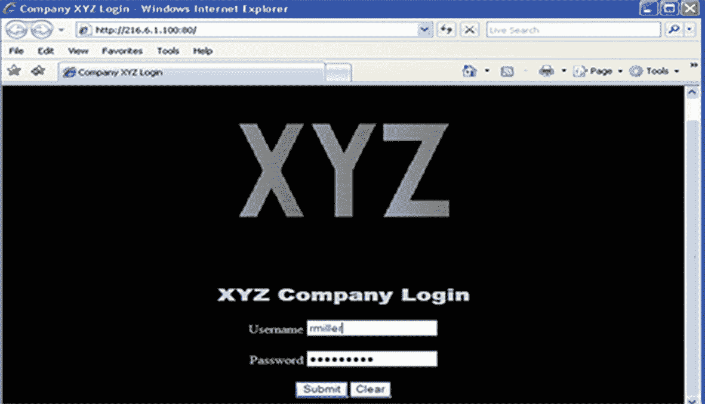
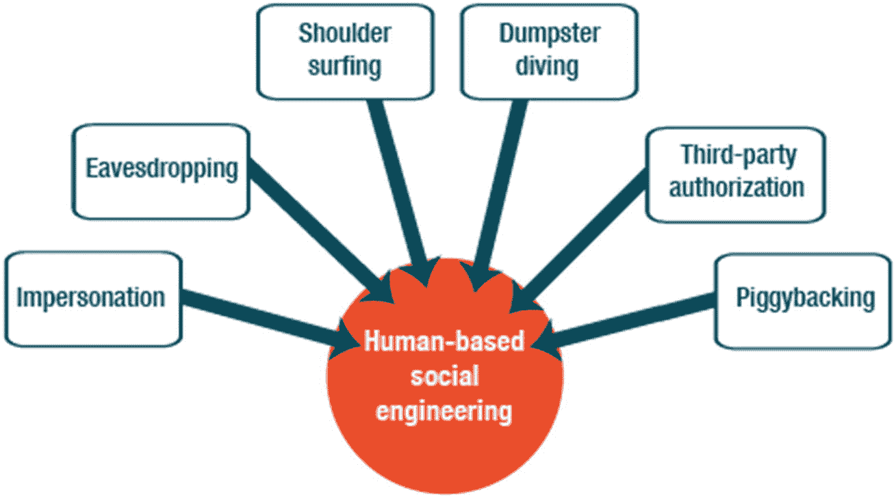
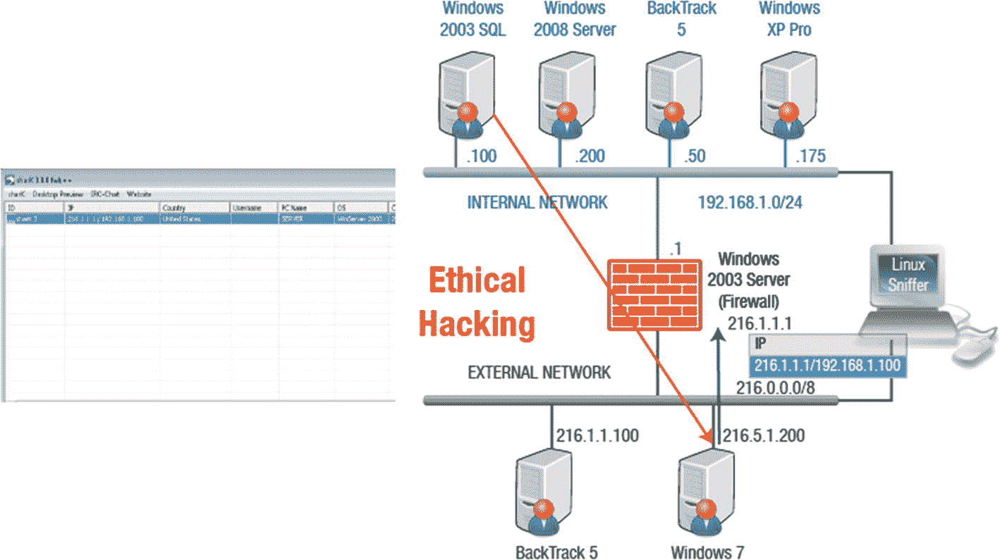

# 6.嗅探器和社会工程

在这一章中，你将学习嗅探以及如何使用这项技术。您将了解易受嗅探攻击的协议，以及如何检测嗅探攻击的类型。在本章中，还将向您介绍针对嗅探的对策。您还将了解不同类型的社会工程以及保护个人免受攻击的对策。

本章结束时，您将能够

1.  识别嗅探的类型和易受嗅探攻击的协议。

2.  识别嗅探攻击的类型。

3.  确定检测嗅探的方法。

4.  确定嗅探的对策。

5.  识别不同类型的社会工程和社会工程对策。

## 嗅探器

嗅探器是监控网络数据的程序。监控程序使用嗅探器来产生指标并用于分析，嗅探器不会拦截或更改数据。或者，嗅探被用来窃取网络上的密码、电子邮件和文件。

在这一章中，你将学习嗅探的基本概念，以及嗅探器在黑客攻击中是如何使用的。对于管理员来说，了解嗅探器并了解保护网络安全的各种工具和技术非常重要。

## 交换式以太网

在以太网上，有两种环境。首先，所有主机都可以连接到同一条总线上，它们在总线上竞争带宽。否则，主机会连接到交换机。当然，使用交换机更安全，因为交换机只将数据包发送到流量的目标计算机。交换网络更为常见。见图 [6-1](#Fig1) 。

图 6-1

交换网络

## 嗅探的类型

大多数嗅探器工具在基于集线器的环境中工作良好。攻击者可以通过危害组织的物理安全或使用特洛伊木马安装数据包嗅探器来访问网络并使用被动嗅探。嗅探可以分为被动和主动两种。

*   **被动嗅探:**在网络上使用交换机是对抗被动嗅探的一种对策。在交换网络上，如果有一个被动的嗅探器，它只能看到进出安装它的机器的数据。被动嗅探在具有集线器的网络上很常见，集线器从所有机器收集数据。主动嗅探交换机主动监控每个端口上的 MAC 地址，并将流量注入 LAN 以实现流量嗅探。

*   **主动嗅探:**主动嗅探交换机主动监控每个端口上的 MAC 地址，并将流量注入 LAN 以实现流量嗅探。主动嗅探器可分为地址解析协议(ARP)欺骗、MAC 泛洪和 MAC 复制。
    *   ARP 欺骗的结果是目标机器具有错误的网关条目，因此所有去往网关的流量现在都将通过攻击者系统。

    *   如果交换机被大量的 MAC 地址淹没，以至于无法继续工作，那么交换机将进入“无阻通信模式”,并像集线器一样开始向交换机上的所有端口广播数据包。

    *   当在网络中搜寻与交换机端口相关联的客户端的 MAC 地址并重用这些地址之一时，就会发生 MAC 复制。

## 易被嗅探的协议

通过网络以明文形式发送密码和数据的协议容易被监听。不要让用户名和密码的要求给你一种虚假的安全感。

容易被嗅探的协议包括

*   用于远程联接服务的标准协议或者实现此协议的软件(可为动词)

*   简单网络协议(SNMP)

*   网络新闻传输协议(NNTP)

*   邮局协议

*   超文本传输协议(HTTP)

*   文件传输协议

*   互联网消息访问协议(IMAP)

## 电子监视

有一个将嗅探作为合法工具的应用。例如，当司法行政命令授权时，电子监控使用窃听来利用目标的服务提供商收集数据。中介设备负责处理，使用的工具包括 Wireshark 和 Tcpdump。

## 如何检测嗅探

嗅探器不会留下痕迹，因为它不传输数据。有时执行嗅探的机器处于混杂模式。混杂模式允许网络设备拦截和读取每个传输的网络数据包。您可以运行`arpwatch`来查看是否有任何 MAC 地址发生了变化，并运行网络工具来监控网络中的奇怪数据包。见图 [6-2](#Fig2) 。

图 6-2

检测嗅探的过程

有几种方法可以用来检测嗅探。查看每种方法的详细信息。

*   **ping 方法** **:** 使用 Ping 方法的调查者在路由表中更改可疑计算机的 MAC 地址，然后使用 IP 地址和修改后的 MAC 地址发送 Ping。带有嗅探器的系统会对此 ping 做出响应。

*   **ARP 方法** **:** 响应非广播 IP 地址请求的系统被怀疑执行嗅探器。

*   **源路由方法** **:** 松散源路由列出了数据包到达目的机器所经过的系统的 IP 地址。如果在松散源路由中有 IP 地址的机器发生故障，数据包就无法到达目的地。如果调查者禁用了路径中的一台计算机，而数据包仍然到达目的地，则很可能目的地计算机正在运行嗅探器。

*   **诱饵方法** **:** 诱饵方法使用一个带有虚拟用户帐户的诱饵服务器和一个带有脚本的客户端来连接到服务器。借助入侵检测系统(IDS)，调查人员可以发现攻击者何时试图登录。

*   **反向 DNS 方法** **:** 一些嗅探器执行反向 DNS 查找，以确定链接到特定 IP 地址的域名。执行反向 DNS 查找的计算机对 ping 做出响应，并将其识别为具有嗅探器。

*   **延迟方法** **:** 通过延迟方法，调查人员可以计算 pings 的响应时间，以确定过载会影响哪个系统。运行嗅探器的计算机具有较长的响应时间，并且受较高负载的影响。

## Wget

攻击者通常会复制受害者的网站，并在以后执行鱼叉式网络钓鱼攻击时使用它。如果一个人每天都去同一个网站，他就不太可能仔细检查 URL。Wget 是一个可以用来复制网站的工具(图 [6-3](#Fig3) )。

图 6-3

Wget

## 鱼叉攻击

复制的网站存在于攻击者的机器上。攻击者现在使用鱼叉式网络钓鱼让内部用户访问网站并输入他们的凭据。

在本练习中，您将尝试鱼叉攻击，并说服受害者登录攻击者机器上复制的网站，而不是用户自己的内部网站。当受害者连接到您的攻击机器时，您也将利用受害者的浏览器。见图 [6-4](#Fig4) 。

图 6-4

鱼叉攻击

## 查看凭据

您现在有了受害者的用户名和密码。如果您在攻击者机器上测试该用户名和密码，您将得到一个“无法显示页面”错误。知道将会有什么样的反应是很重要的，因为如果在随后的鱼叉式网络钓鱼攻击中与受害者有进一步的通信，则可以使用该信息。见图 [6-5](#Fig5) 和 [6-6](#Fig6) 。

图 6-6

捕获的用户名和密码

图 6-5

网页登录

## 社会工程

社会工程是利用一个人的“口才”让另一个人放松警惕，也就是说，让他们泄露通常不会泄露的信息或采取通常不会采取的行动。

社会工程利用了大多数人在工作场所乐于助人的愿望。你知道有多少组织强调客户服务？获得的信息有时可以直接用于攻击，但大多数情况下是作为更复杂计划的一部分间接使用的。

社会工程可以分为两类。第一种是基于人类的，第二种是基于计算机的。有六种人类行为是对社会工程的积极回应:

1.  **回报:**被给予某物时被迫采取行动，比如收到免费样品后购买产品。

2.  一致性:行为模式是相同的，这可能发生在，例如，你问了一个问题，然后等待别人来填补这个停顿。

3.  **社会认可:**做别人都在做的事。一个例子是，如果你在拥挤的街道上抬头看，其他人也会抬头看。

4.  喜欢:倾向于对我们喜欢的人或有吸引力的人说好。广告中用模特来引起人们的兴趣。

5.  权威:听从那些处于权威地位的人的建议，比如广告上说五分之四的医生同意。

6.  稀缺:越少的东西越有吸引力，就像圣诞节流行的玩具一样。

## 社会工程循环

社会工程循环由四个不同的阶段组成:信息收集、关系发展、关系利用和实现目标的执行。见图 [6-7](#Fig7) 。

图 6-7

社会工程循环

## 技术

以人为基础的社会工程涉及人类互动，包括模仿、窃听、肩膀冲浪、翻垃圾箱、第三方授权和捎带等行为(图 [6-8](#Fig8) )。例如，攻击者可能冒充员工并给出虚假身份。攻击者甚至可以更进一步，冒充重要员工的身份，例如董事或高层管理人员。攻击者也可能伪装成技术支持人员。

与冒充雇员密切相关的是第三方授权。攻击者将自己伪装成由权威人士授权的代理，代表他们获取信息。

图 6-8

以人为基础的社会工程技术

## 基于计算机的社会工程

基于计算机的社会工程依靠软件来执行有针对性的行动。例如，特洛伊木马是一种恶意软件，它看起来是一个正常可用的程序，但实际上里面隐藏着病毒。后门可用于绕过系统上常用的身份验证方法。

下面列出了攻击者可以用来发起基于计算机的社会工程攻击的其他几种技术。只要一个心怀不满的员工通过破坏计算机系统来报复组织。

*   弹出窗口

*   邮件附件

*   网站

*   即时消息

*   网络钓鱼

*   内部攻击

## 鲨鱼

恶意的 Shark 远程管理工具负载编码有攻击机器的 IP 地址和监听端口。攻击者使用窃取的凭证来映射受害者的进程间份额。然后，内部攻击者使用 psexec 在远程系统上执行恶意负载。这是通过另一个用户的凭据完成的，如果检查网络流量，这可能会引起对该用户的注意。查看图 [6-9](#Fig9) 。

图 6-9

远程 shark 连接

## 预防建议

组织可以采取几个步骤来防止内部威胁。在不同的雇员之间划分职责，使得没有一个雇员拥有完全的控制权，这被称为职责分离。类似的概念是在不同的时间将单一的职责轮换给不同的员工。

还必须在整个组织中实施访问控制策略，以限制未经授权的访问。记录和审核访问是预防性措施，制定法律政策和归档关键数据也将有助于组织。

## 一般防御措施

有效的防御需要管理层的计划。

1.  管理层应该制定一套安全目标，并为这些目标指派工作人员。

2.  公司应该进行风险管理评估。

3.  在公司的安全策略中实施防御措施是至关重要的。员工需要了解如何通过政策和安全意识来处理社会工程威胁。

## 对策

组织可以实施的具体对策包括培训、密码策略、操作指南、物理安全策略、信息分类、访问权限、背景调查、事件响应系统以及策略和程序。不过，归根结底还是要对员工进行关于这些对策的充分培训。用户必须能够识别社会工程师可以使用什么样的信息。

## 摘要

你在这一章探索了嗅探器和社会工程。您了解攻击者如何使用嗅探来窃取组织和个人的密码、电子邮件和文件。您还可以描述两种类型的社会工程以及保护组织和个人免受攻击的对策。