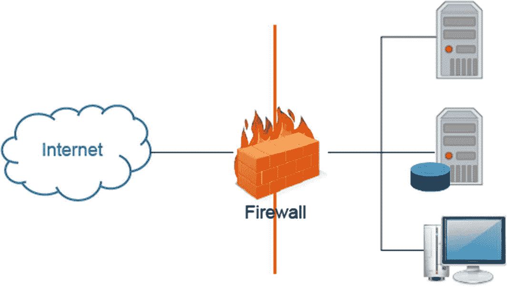

# 13.躲避入侵检测系统、防火墙和蜜罐

攻击者了解主要的对抗产品。对于攻击者来说，规避组织实施的对策以进行更精确的攻击是一个挑战。有道德的黑客需要了解部署这些技术所涉及的特性和安全问题。在本章中，您将了解管理员用来保护网络的技术。还将向您介绍入侵检测技术和系统、可用的防火墙类型以及如何识别内部网络上的攻击。

本章结束时，您将能够

1.  识别入侵检测系统和技术。

2.  识别防火墙的类别。

3.  定义一个蜜罐。

4.  使用入侵检测系统分析内部和外部网络流量。

## 入侵检测技术

入侵检测系统(IDS)收集并分析来自计算机或网络的信息，以识别入侵和误用。为了在网络安全中发挥有效的作用，IDS 需要持续的监控。入侵检测系统使用签名识别来识别可能指示系统滥用的事件。它在很大程度上依赖于一组预定义的攻击和流量模式，称为特征。

异常检测基于试探法或行为规则，可以称为基线。基线是在正常网络运行期间建立的，因为它监视活动并试图将其分类为“正常”或“异常”协议异常检测基于特定于协议的异常，并识别特定于 TCP/IP 协议的缺陷。如今，机器学习(ML)算法被用于异常检测。

## id 类型

IDS 可以以多种不同的形式实现，从独立的设备到交换机或路由器操作系统中内置的功能。它也可以基于主机，作为操作系统或数据库的应用程序或功能。在对入侵检测系统进行分类时，我们通常将它分为两种类型:基于主机的和基于网络的。为了检测可能的攻击或可疑行为，基于主机的系统会分析本机主机上的签名和异常。基于网络的 IDS (NIDS)驻留在边界路由器或设备上，用于识别异常网络流量或基于网络的攻击的特征。系统完整性验证程序(SIV)管理系统文件并跟踪主要系统对象的变化。日志文件监视器(LFM)监视网络服务创建的日志文件。

## IDS 放置

IDS 系统的位置对于其解释入侵的效率和能力至关重要。IDS 系统可以放置在防火墙的外部，作为 DMZ 或专用网络中的早期预警系统。当放置在防火墙之外时，它会生成大量警报。IDS 系统也可以驻留在网络中的任何主机上，这允许它查看和分析传入公司网络的流量。当放置在防火墙之后时，它导致较少的警报。通常，基于主机的 IDS 驻留在最关键的系统上，包括数据库服务器、关键应用服务器和网络管理系统。

## 入侵迹象

有一些迹象清楚地表明入侵者的存在。攻击者修改系统文件和配置来隐藏入侵的迹象。熟悉入侵的迹象非常重要。

*   **系统入侵:**系统入侵指标包括系统无法识别有效用户或新用户帐户、非工作时间登录以及审计文件或日志文件中的空白。

*   **文件系统入侵:**文件系统入侵指标包括系统上的新文件或程序、文件权限改变和文件丢失、文件大小的不明修改。

*   **网络入侵:**网络入侵指示器可能会通过带宽消耗的突然增加、远程登录的重复尝试以及系统可用服务的重复探测来显示。

## IDS 检测到攻击后

在入侵检测系统指出可能的攻击后，管理员应该执行几项操作:

*   配置防火墙以过滤掉入侵者的 IP 地址。

*   提醒管理员。

*   将事件记录在日志中。

*   保存攻击信息。

*   保存原始数据包的跟踪文件以供分析。

*   处理事件。

*   强制终止连接。

## IDS 攻击

有几种攻击可以对 IDS 发起。插入攻击通过强制 IDS 读取无效的数据包来混淆 IDS。当 IDS 丢弃一个数据包，但接收该数据包的主机却接受它时，就会发生规避攻击。许多类型的 DoS 攻击都可以用来攻击 IDS。去同步使用 SYN 数据包后连接和预连接。IDS 可能无法检测到通过混淆器运行的恶意程序，因为混淆器使程序更难理解。攻击者可以通过传递 IDS 来引导攻击。他们还可能使用分段方法或会话拼接，通过将一个字符串分割成几个数据包来逃避 IDS。

## 入侵防御系统

入侵防御系统可以配置为控制路由器操作、交换机操作、防火墙操作、VPN 建立和无线访问。根据对特征和异常的检测，IPS 可以采取纠正措施来阻止入侵或攻击。警告 IPS 也容易出现误报，因此操作员的知识和识别误报的能力对于防止 IPS 任意拒绝授权活动至关重要。

IPS 使用先发制人的方法来保护网络安全，是入侵检测的一种扩展。两种类型的 IP 包括基于主机的和基于网络的。

*   基于主机的 IPS 安装在受保护的系统上，监视和拦截系统调用，并可以监视数据流、文件位置和 web 服务器的注册表设置。

*   基于网络的入侵防御系统根据安全策略检查流量，管理基于内容的入侵防御系统，并检查网络数据包内容中的唯一序列，基于速率的入侵防御系统识别不同于普通流量的威胁。

## 信息流

IDS 和 IPS 中的信息流是相似的。该过程概述如下。

1.  原始数据包捕获

2.  过滤

3.  分组解码

4.  仓库

5.  碎片重组

6.  流组件

7.  TCP 会话的状态检查

8.  用作防火墙

## 防火墙

防火墙已经成为大多数组织的标准操作的一部分。防火墙可以是基于硬件或软件的，也可以是两者的结合。防火墙旨在检查流量，然后根据组织的策略允许或阻止该流量。

图 13-1

防火墙

## 防火墙的类型

有许多可供选择的防火墙。然而，防火墙有其局限性。例如，防火墙不能阻止拥有调制解调器的用户拨入或拨出网络。防火墙不能抵御社会工程。最后，防火墙不能防止隧道攻击。您可以使用的几种防火墙是硬件防火墙、软件防火墙、包过滤防火墙、电路级网关、应用程序级防火墙和状态多层检查防火墙。

## 防火墙识别

攻击者可以使用几种方法来识别防火墙。他们可以使用 Nmap 扫描端口。他们可以执行 firewalking，它有一个网络发现阶段和一个扫描阶段。攻击者还可能使用横幅抓取，即从网络服务发送消息。

## 穿越防火墙

当防火墙保护网络时，攻击者可以使用各种方法侵入网络。他们可以使用内部同谋，找到易受攻击的服务，访问易受攻击的外部服务器，劫持，绕过防火墙(HTTPTunnel)，通过防火墙放置后门(rwwwshell)，隐藏在隐蔽通道(Loki)后面，以及使用 ack 隧道。

## 蜜罐和蜜网

许多组织部署蜜罐和蜜网作为针对潜在攻击的早期预警系统。这两种系统都被放置在网络上，诱使潜在的攻击者将它们作为组织内容易受到攻击的目标。这些设备可能故意配置有已知的弱点和薄弱的安全性。这些设备被设计用来发送警报和信息，表明它们受到了攻击或破坏。这使网络管理员能够识别攻击的来源并关闭大门，以防止攻击扩散到组织专用网络中的关键设备和系统。

## 蜜罐的类型

蜜罐是用来吸引和诱捕攻击者的，有多种方法可以配置蜜罐来引诱攻击者。

*   低交互蜜罐模拟服务是如何配置的，并且被模拟的服务的活动被捕获和记录。

*   高交互蜜罐是一种控制和捕获所有活动的网络架构；它们也被称为蜜网。

*   中等交互蜜罐使用应用层虚拟化，并发送已知漏洞的预期响应，以欺骗漏洞发送有效载荷。

## 开源蜜罐

有许多蜜罐可作为商业产品或开源格式。一些商业上可用的蜜罐包括 KFSensor、NetBait、ManTrap 和 SPECTER。如果你想走开源路线，你有很多选择。

开源蜜罐包括

*   气泡胶 Proxypot

*   头奖

*   后勤人员友好

*   诱饵开关

*   大眼鲷

*   蜜网

*   欺骗工具包

*   迟到的工作台

*   蜂蜜

*   蜜网

*   Sendmail SPAN 陷阱

*   小蜜罐

## 应对攻击

不仅检测入侵很重要，组织还应该制定良好的防御策略。事件响应团队应该包括来自整个组织各个部门的成员。公司应该为这种事件准备好响应程序、通信、记录程序以及培训和演练。

## 入侵检测工具

有许多工具可用，包括入侵检测工具，如

*   小黑妞

*   RealSecure(安全)

*   网络飞行记录器

*   龙

*   网络徘徊者

*   SilentRunner

*   先锋执行者

*   思科安全 IDS

*   鼻息声

## 规避 IDS 的工具

管理员需要了解可用来帮助攻击者躲避 IDS 的工具。如果没有正确设置和配置，实时 IDS 系统可能会被愚弄。SideStep、Mendax、Stick、Fragrouter 和 ADMutate 是管理员应该知道的一些工具。

## 数据包生成器

有许多数据包生成器工具可供使用。查看以下列表，研究您想了解更多的工具:

*   Aicmpsend

*   附加

*   爆炸

*   伊特怪

*   Hping2

*   ICMPush

*   Ipsend

*   InternationalStandardIndustrialClassification 国际标准工业分类法

*   关于

*   多生成器工具集

*   净::rawip

*   网猫

*   Netsh

*   派克斯

*   发送 ICMP 讨厌的垃圾

*   Tcpreplay

*   包壳

*   USI++

*   Xipdump

## 突破防火墙的工具

有几种工具可以伪装两台服务器之间的通信并成功突破防火墙。其中有一些是 007 Shell、ICMP Shell (ISH)、AckCmd 和 Covert_TCP。

## 测试工具

有许多工具专门用于测试防火墙的过滤策略或配置:

*   约当全职人数

*   交通智商专业版

*   下一代入侵检测专家系统

*   安全主机

*   系统入侵分析和报告环境

*   TCP Opera

*   防火墙通知

*   Atelier 网络防火墙测试仪

## 摘要

在本章中，您了解了可以用来防范内部网络攻击的各种措施和过程。您回顾了入侵检测技术、各种类型的防火墙，以及如何通过监控识别攻击何时发生。