# 社会工程案例研究

如前所述，社会工程是一门使用特制的交流技术来操纵行为的艺术。社会工程师是使用大脑而不是技术计算机过程的黑客。社会工程师是黑客，他们利用几乎每个组织都有的弱点，即人的因素。通过使用各种技术和工具，社会工程师可以打电话和使用社交媒体或电子邮件服务来欺骗人们提供他们的敏感信息或凭据。网络罪犯使用社会工程策略，因为操纵个人的自然倾向通常比入侵计算机系统或软件更容易。

安全是关于知道谁和什么可以信任，以及知道什么时候，什么时候不相信一个人的话。

For more information on social engineering, please refer to the link *What is Social Engineering?*, *Webroot* at [http://bit.ly/2cdYuYZ](http://bit.ly/2cdYuYZ).

社会工程师主要利用这个基本现象——信任。因此，如今许多公司都希望将针对员工的社会工程测试(网络钓鱼和其他模拟)作为其整体信息安全计划的一部分。

网络钓鱼、欺诈、勒索软件和其他类型的社会工程攻击都是目标。任何网络安全的薄弱环节都是人的因素。因此，有时犯罪分子冒充第三方团体以便更有说服力，使人们毫无疑问地执行指令并取得成功，或者冒充警察或政府官员。

在整个研究中，社会工程攻击周期和已知的国际社会工程攻击案例被披露。此外，关于为什么社会工程攻击如此有效，以及社会工程师如何进行攻击的问题已经得到评估。此外，我们已经用现实生活中的场景证明了我们的假设，即成功的网络攻击是利用信任感的简单社会工程技术。

在本研究中，我们定义了社会工程攻击循环包括四个阶段，如下所示:

*   情报收集
*   发展关系
*   探索
*   执行

我们还揭示了社会工程之所以如此有效，是因为它利用了人性，参考了 2017 年黑帽调查的统计数据。

此外，我们还展示了一些社会工程案例，例如:

*   CEO 欺诈
*   金融网络钓鱼
*   社交媒体网络钓鱼
*   勒索软件网络钓鱼
*   比特币网络钓鱼

我们还进行了案例研究。为此，我们从 Keepnet 实验室的网络钓鱼模拟平台收集了数据。我们的案例研究是一项纵向研究，我们评估了 2017 年 1 月 1 日至 2018 年 1 月 1 日期间一年的全部网络钓鱼活动。我们在一年的时间里观察了相同的变量(公司、部门和用户/人)。

我们分析了在 Keepnet Labs 的网络钓鱼模拟平台上注册和使用的十大行业，并评论了哪些类型的企业面临的风险更大。为了回答这个问题，按行业划分的风险百分比是多少？，我们按行业衡量了风险百分比，并在图表中显示出来。此外，我们揭示了为什么风险在不同的行业以不同的形式出现。

此外，我们分析了 2017 年 1 月 1 日至 2018 年 1 月 1 日期间，一年内向 85 家公司的 86，448 名用户发送的电子邮件总数。调查了一年中打开假电子邮件(为模拟活动准备的网络钓鱼电子邮件)、点击电子邮件中的链接或在网络钓鱼模拟中不作回应的用户总数。据透露，近一半的用户对他们的公司构成威胁。

此外，我们调查了用户数量最多的前五家公司及其钓鱼模拟统计数据，以揭示用户被社会工程师操纵的简单动机是什么。为了匿名，我们将这些公司编码为数字 1、2、3、4 和 5。我们发现，导致用户打开假邮件的主要本能是信任假邮件发送者，换句话说，这种信任感被滥用了。此外，用户打开虚假电子邮件或点击电子邮件中的虚假链接的状态根据模拟选择的虚假电子邮件的主题而改变；如果用户对电子邮件的主题感兴趣，他们会感兴趣并轻率地犯错。

# 什么是社会工程？

工程学有许多定义，最终归结为使用特制的交流技术有意操纵行为的艺术。

For more information on social engineering, please refer to the following link: Watson, G. (2014). **Social Engineering Penetration Testing.** Elsevier. Paperback ISBN: 9780124201248\. p.2

例如，SANS 将其描述为用于攻击信息系统的非技术或低技术手段的委婉语，如谎言、假冒、诡计、贿赂、勒索和威胁，而社会工程师是使用大脑而不是计算机肌肉的黑客。黑客给数据中心打电话，假装是丢失了密码的客户，或者出现在网站上，然后简单地等待有人为他们开门。其他形式的社会工程并不那么明显。众所周知，黑客会创建虚假网站、抽奖或问卷，要求用户输入密码。

*Social Engineering: A Means To Violate A Computer System,* p. 4 available at [https://www.sans.org/reading-room/whitepapers/engineering/social-engineering-means-violate-computer-system-529](https://www.sans.org/reading-room/whitepapers/engineering/social-engineering-means-violate-computer-system-529), by *Sans Institute* (2007).

这些定义描述了通过撒谎和不道德行为来获取信息的多阶段互动。正如 SANS 研究所揭示的那样，社会工程攻击有一个共同的模式。这种模式被称为**周期**，由四个阶段组成(信息收集、关系发展、开发和执行)。每个社会工程攻击都是独特的，它可能涉及多个阶段/周期，甚至可能结合使用其他更传统的攻击技术来实现预期的最终结果。

*Social Engineering: A Means To Violate A Computer System,* p. 6 available at  [https://www.sans.org/reading-room/whitepapers/engineering/social-engineering-means-violate-computer-system-529](https://www.sans.org/reading-room/whitepapers/engineering/social-engineering-means-violate-computer-system-529), by [*Sans Institute* (2007).](https://www.sans.org/reading-room/whitepapers/engineering/social-engineering-means-violate-computer-system-529)

社会工程生命周期如下图所示:

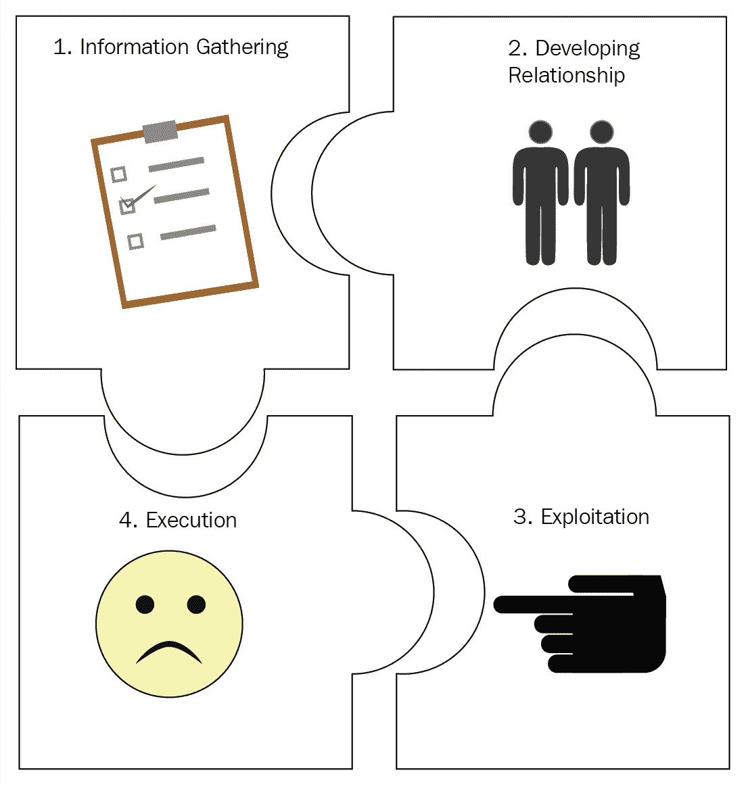Social engineering attack cycle# 情报收集

社会工程师可以使用许多技术来收集关于他们目标的信息。当他们收集信息时，他们可以利用这些信息与目标或对攻击成功至关重要的人进行交流。信息可以包括电话列表、出生日期、组织的组织结构图等等。

*Social Engineering: A Means To Violate A Computer System,* p. 6 available at  [https://www.sans.org/reading-room/whitepapers/engineering/social-engineering-means-violate-computer-system-529](https://www.sans.org/reading-room/whitepapers/engineering/social-engineering-means-violate-computer-system-529), by [*Sans Institute* (2007).](https://www.sans.org/reading-room/whitepapers/engineering/social-engineering-means-violate-computer-system-529)# 发展关系

社会工程师可以从目标的信任中受益，与他们建立密切和谐的关系。在发展这种关系时，社会工程师会以一种特殊的方式安排自己以获得信任，然后他会充分利用这种信任。

# 探索

然后，受信任的社会工程师可以操纵目标泄露密码、电子邮件凭证、银行信息等信息。这一行动可能是攻击的结束，也可能是下一阶段的开始。

*Social Engineering: A Means To Violate A Computer System,* p. 6 available at  [https://www.sans.org/reading-room/whitepapers/engineering/social-engineering-means-violate-computer-system-529](https://www.sans.org/reading-room/whitepapers/engineering/social-engineering-means-violate-computer-system-529), by [*Sans Institute* (2007).](https://www.sans.org/reading-room/whitepapers/engineering/social-engineering-means-violate-computer-system-529)# 执行

一旦目标完成了社会工程师要求的任务，循环就完成了。

# 为什么这么有效？

社会工程之所以有效，是因为它以人类为目标。安全链中最薄弱的环节一直是泄露重要数据的人员因素。在计算机和网络的数字时代，虚假的有说服力的电子邮件、信息和电话可以礼貌地为入侵者打开大门。尽管得到了复杂的 IT 安全系统的加强，但由于社会工程的各种技术，它很容易渗入现代工作场所的安全系统。企业已经意识到，其中一些风险已经全面评估了与当今社会工程相关的威胁。然而，许多人倾向于从技术角度考虑问题，认为只有黑客才是攻击和闯入系统的真正威胁，而忽略了对互联网的滥用，这种滥用确实有可能对组织的安全系统造成破坏，等等。由于通过物理或电子方式访问系统的任何部分，最终用户会面临严重的安全风险:

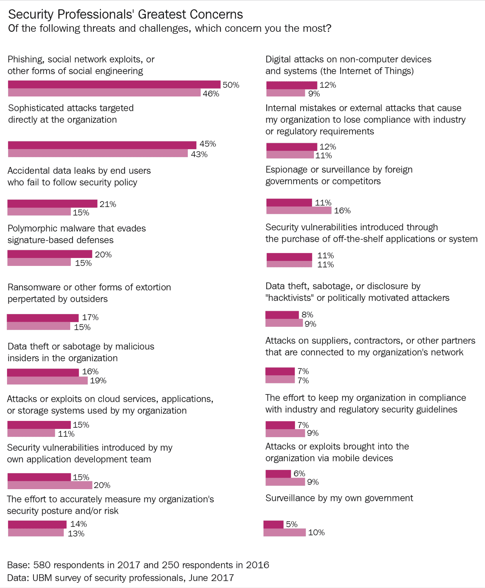Results from the official survey conducted with IT security attendees of the 2017 Black Hat conference

2017 年，50%的黑帽调查受访者提到了**网络钓鱼、社交网络利用或其他形式的社交工程**，高于 2016 年的 46%。45%的人提到了直接针对组织的**复杂攻击**，高于 2016 年的 43%。然而，除了这两类威胁，受访者的担忧也不尽相同——**意外数据泄露** (21%)排在第三位，高于 2016 年的 15%，而**多态恶意软件** (20%)排在第四位，高于去年的 15%。在调查中，受访者将复杂、有针对性的攻击列为第二大担忧。

*2017 Black Hat Attendee Survey Portrait of an Imminent Cyberthreat* available at [http://ubm.io/2viIk7g](http://ubm.io/2viIk7g), [*Black Hat* (2017).](http://ubm.io/2viIk7g)

这些关键发现表明，今天网络安全的主要问题之一主要源于人的因素。鉴于社会工程是让人们遵从意图或愿望的艺术，因此必须加强网络安全链中最薄弱的环节，即人的因素，以抵御各种社会工程攻击。

电子邮件可能包含恶意代码、链接或带有有趣主题的附件，会激起收件人的好奇心并诱使他们打开它们。这一系列案例是当今使用的简单的社会工程方法。尽管如此，在社会工程技术中，有许多方法可以用来引诱粗心的用户从在线视频中获取虚假的安全警告或建议。既然如此，对社会工程攻击的唯一保护或屏蔽就是彻底的意识和训练。通过采用常识性的网络安全感知方法，最终用户可以及早发现可能的安全问题。

社会工程之所以如此有效，是因为即使机构拥有强大的防火墙、恶意软件防护系统和所有保护其敏感信息的技术措施，一个关键的组成部分，即人的因素，也可能在任何安全架构中造成漏洞。这有一些原因:

*   最终用户在在线活动中通常会有一种错误的安全感
*   他们通常在网上冒险，而不是在现实生活中
*   网络犯罪分子使用精心设计的社会工程方法来控制最终用户，他们知道进入组织数据并获取凭据或敏感数据的最简单方法

# 社会工程案例研究

社会工程案例研究如下:

# CEO 欺诈

当社会工程师冒充公司高管并操纵其他员工转移未经授权的资金或信息时，就会发生 CEO 欺诈。根据美国联邦调查局的数据，自 2015 年 1 月以来，已确认的 CEO 欺诈受害者增加了 270 %，CEO 欺诈损失了 23 亿美元。

*FBI: $2.3 Billion Lost to CEO Email Scams* available at [http://bit.ly/1TE1jl6](http://bit.ly/1TE1jl6), [Krebs, B.(2016).](http://bit.ly/1TE1jl6)

CEO 欺诈攻击的一些例子如下:

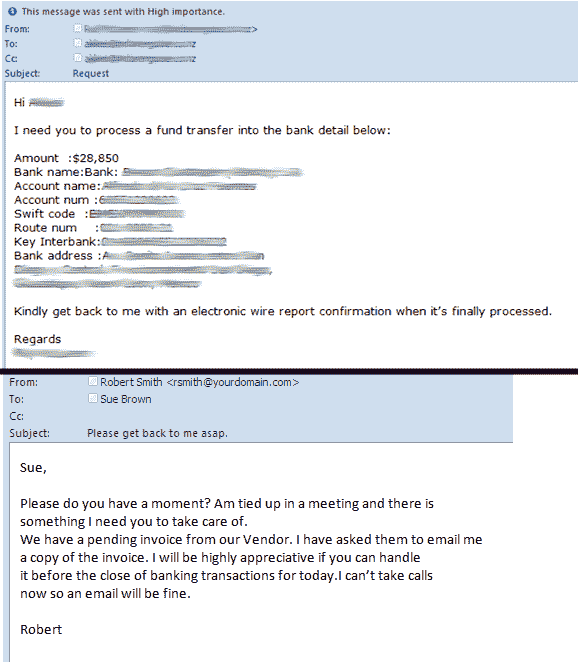Examples of CEO fraud attack

网络犯罪分子对一名高管进行网络钓鱼攻击，并获得对其收件箱的访问权限，或者从与目标公司的真实域名相差一两个字母的相似域名向员工发送电子邮件。与传统的网络钓鱼攻击不同，CEO 欺诈中使用的欺骗电子邮件很少是垃圾邮件，因为在 CEO 欺诈攻击中，社会工程师会花时间了解目标组织的关系、活动、兴趣、旅行和/或购买计划，并相应地制作他们的电子邮件。他们从目标网站上收集员工的电子邮件地址和其他信息，以帮助使信息更具说服力。一旦网络犯罪分子侵入了目标的收件箱，他们就会通过过滤单词来搜索电子邮件，这些单词可能会告诉他们该公司是否经常处理电汇，如发票、存款或总裁。联邦调查局估计，受到社交工程师利用 CEO 欺诈攻击的组织平均损失在 25，000 美元到 75，000 美元之间。然而，一些 CEO 欺诈事件造成了数百万美元的损失。

*FBI: $2.3 Billion Lost to CEO Email Scams* available at [http://bit.ly/1TE1jl6](http://bit.ly/1TE1jl6), [Krebs, B.(2016).](http://bit.ly/1TE1jl6)# 金融网络钓鱼

使用金融网络钓鱼方法，社会工程师已经瞄准了银行或他们的客户。如今，网上银行等新兴工具为网络犯罪分子打开了新的后门。根据联邦调查局的说法，社会工程师使用的最新趋势是通过使用垃圾邮件和钓鱼电子邮件、击键记录程序和远程访问木马来获取员工登录凭据。这些攻击技术出现在 2012 年 9 月，当时美国银行(Bank of America)和富国银行(Wells Fargo)也遭到了攻击。

*Banks likely to remain top cybercrime targets*, by *Executive Report: Financial Services* at [https://www.symantec.com/content/en/us/enterprise/other_resources/b_Financial_Attacks_Exec_Report.pdf](https://www.symantec.com/content/en/us/enterprise/other_resources/b_Financial_Attacks_Exec_Report.pdf).

如今，网络犯罪分子大多以金融机构为目标，几乎一半的网络钓鱼攻击都是为了获取经济利益。在所有类型的金融网络钓鱼中，银行网络钓鱼是绝对的领导者。

*Financial threats 2016: Every second phishing attack aims to steal your money* available at[http://bit.ly/2DgSnAP](http://bit.ly/2DgSnAP).

在线访问，以及让客户轻松访问他们的帐户，也为网络犯罪分子提供了进入我们的银行门户网站的途径。Carbanak 等案例是金融网络钓鱼的另一个例子。它发生在 2014 年底，是一次重大的银行网络抢劫，导致全球 100 家金融机构的账户被盗超过 10 亿美元。Carbanak 抢劫案是使用标准的电子邮件钓鱼技术进行的，这种技术安装了旨在窃取登录凭证和其他数据的恶意软件。

*Banking and Phishing: The Perfect Storm*, United Security Providers available at [http://bit.ly/2DyZi6s](http://bit.ly/2DyZi6s).

2014 年摩根大通违约事件是这种成功方法的又一个实例。摩根大通的违规事件是有史以来最大的银行违规事件之一，8300 万客户账户被黑。该攻击通过使用一种社会工程技术，即针对已知用户的鱼叉式网络钓鱼电子邮件，成功窃取了登录凭据。一旦凭据被盗，网络罪犯就会访问摩根大通的服务器及其客户账户数据。由于服务器仅使用用户名和密码来访问系统，网络罪犯更容易得手。如果实施了双因素身份认证，网络罪犯早就失败了。

*Banking and Phishing: The Perfect Storm*, United Security Providers available at [http://bit.ly/2DyZi6s](http://bit.ly/2DyZi6s).

德国邮政银行遭到大规模网络钓鱼攻击。在这种情况下，社会工程师精心制作的电子邮件和钓鱼网站看起来非常类似于合法的邮政银行网站，因此普通用户很难看出这实际上是一个网络钓鱼骗局。不知情的访问者被要求确认他们的登录凭证。一旦用户在虚假网站上提交了登录凭据，网络犯罪分子就会获取用户凭据来窃取他们的身份或出售他们的信息。

*Phishing attack on popular German bank* available at [http://bit.ly/2D5Y7Kw](http://bit.ly/2D5Y7Kw).Fake E-mail

无意中的电子邮件用户相信了这封假邮件，因为它包括一个合法的标志以及一个签名。一旦用户点击了电子邮件中的虚假链接，他们就会被重定向到以下虚假登录页面:

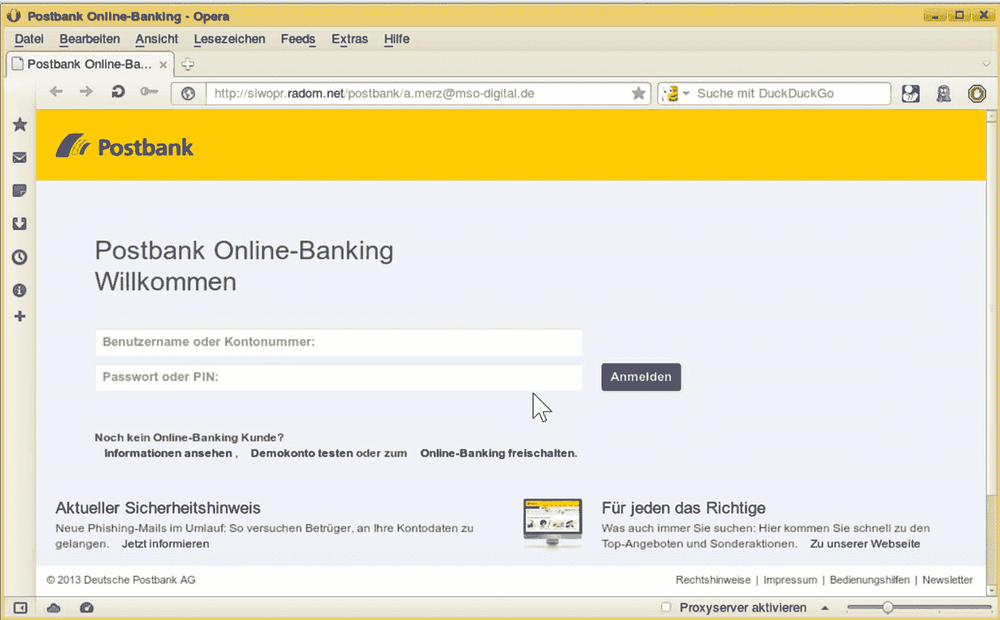Fake page

前面的屏幕截图显示了用户从其虚假电子邮件中的链接被重定向到的虚假登录页面。同样，这个假页面有一个标志和其他细节，就好像它是一个合法的页面。但是浏览器中的网址完全不同，没有挂锁图标，说明网站是安全的。许多粗心的用户因为试图登录他们的凭证而成为这个社会工程计划的受害者。

# 社交媒体网络钓鱼

网络钓鱼也是一种恶意的在线身份盗窃，通过假冒或盗窃的身份伪装成信誉良好的实体来获取登录凭据或帐户信息。因此，社交媒体用户已经成为社会工程师最容易攻击的目标之一。

他们可以使用虚假网站的链接，窃取登录和密码信息或其他个人信息，或者他们可以获得社交媒体上不经意分享的所谓不重要的个人信息。

*Phishing on Social Networks - Gathering information* available [http://bit.ly/2nu8BO5](http://bit.ly/2nu8BO5).

社交工程师使用虚假网站地址操纵用户输入他们的凭据:

A fake social media site

一旦其中一名员工遭到网络钓鱼攻击，组织的整个网络就会受到威胁，数据或知识产权被盗等等。此外，公司品牌也可能贬值，尤其是当网络罪犯使用社交媒体时。

# 勒索软件网络钓鱼

勒索软件是一种恶意软件，它锁定文件或限制用户访问他们的计算机系统，直到支付赎金(金钱)。今天的勒索软件攻击是非常复杂和复杂的威胁，社会工程师使用多种策略来传播勒索软件。最常见的方法包括垃圾邮件、广告媒体和漏洞工具包。

社会工程师成功地用勒索软件感染了好莱坞长老会医学中心的计算机系统。一旦一名员工打开了一份看起来像医院发票的文档(这是一个网络钓鱼骗局)，它就会迅速蔓延到系统中，并导致整个医院网络瘫痪。医院网络中断了一个多星期。

*Case Study Of Phishing For Data Theft/Ransom: Locky Ransomware,* by *Infosecinstitute* available at [http://bit.ly/2Df2OFX](http://bit.ly/2Df2OFX).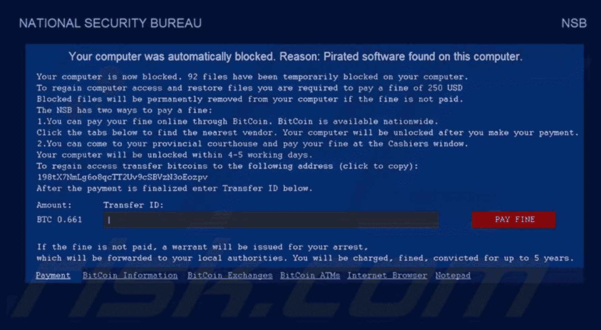VirLock Trojan Ransomware

前面的截图中给出了一个勒索病毒的例子，即 VirLock 勒索病毒，这可能是勒索病毒木马类别下最坏的恶意软件类型之一。它会锁定计算机，这样您就无法使用它。然后，需要付费才能解锁系统/文件。

For more information, please refer to *VirLock Trojan Ransomware - Description and Decryption* by *Bilboa, B*(2015), Sensorstechforum available at [http://bit.ly/2B62raS](http://bit.ly/2B62raS).# 比特币网络钓鱼

比特币等数字加密货币面临网络攻击的危险。严重的网络攻击正在对那些使用数字货币的人的账户进行组织，数字货币已经变得越来越流行。

加密货币已经成为当今谈论最多的投资工具之一。甚至普通人现在也在使用加密货币作为投资工具，而不是黄金、外汇和利息。尽管一些加密货币市场，如 Dash (Dash)、Ethereum (ETH)、Ripple (XRP)、Litecoin (LTC)和 IOTA (MIOTA)已经出现在市场上，但比特币一直处于顶端，并采用区块链技术开发。

比特币的价值有了显著的飞跃，一年内增加了 250-250%。但是这一飞跃引起了黑客们的兴趣。使用各种社会工程和网络钓鱼攻击方法的网络罪犯寻求物质利益。

# 社会工程案例研究- Keepnet 实验室网络钓鱼模拟

网络犯罪分子知道为许多其他类型的攻击或漏洞利用打开许多大门。因此，作为一种基于角色的安全意识教育方法，网络钓鱼模拟和培训对于任何组织都非常重要，它将成为整体安全意识教育和培训计划不可或缺的一部分。考虑到由于网络钓鱼，同事或员工已经成为网络安全链中的薄弱环节，网络钓鱼模拟可以帮助组织在正确的时间向正确的人提供正确的培训。

Keepnet 实验室的网络钓鱼模拟很重要，因为它基本上选择了人为因素作为基线。

Keepnet Labs is a cybersecurity awareness firm that has developed a suite of cybersecurity awareness and defense products. It comprises a holistic approach to people, processes, and technology in order to reduce cyber risks. It is specifically aimed at raising the awareness of user bout social engineering attacks by helping them to develop their skills and knowledge. For more information on Keepnet Labs, please refer to the following link: [www.keepnetlabs.com](http://www.keepnetlabs.com)

在这项纵向研究中，我们的案例来自 Keepnet 实验室的网络钓鱼模拟平台，其中有一百多家公司进行了网络钓鱼模拟。我们分三部分研究了这一部分:

*   十大行业分析
*   检查一年内发送的全部电子邮件
*   用户数量最多的五大公司的社会工程攻击评估

# 十大行业分析

我们分析了在 Keepnet Labs 的网络钓鱼模拟平台上注册和使用的十大行业，并评论了哪些类型的企业面临的风险更大。为了回答这个问题，按行业划分的风险百分比是多少？，我们按行业衡量了风险百分比，并以表格形式显示出来。此外，我们揭示了为什么风险在不同的行业以不同的形式出现。

钓鱼活动在 2017 年 1 月 1 日至 2018 年 1 月 1 日期间针对企业进行。我们在一年内观察了相同的变量(公司、部门和用户/人),并获得了我们的纵向数据。在这项研究中，我们跟踪了在 Keepnet 实验室的网络钓鱼模拟平台中注册的相同公司，并观察了社会工程攻击的不同阶段及其对用户的影响。作为所有这些的结果，我们为这些行业创建了一个风险图表，并揭示了哪些行业的风险更大:

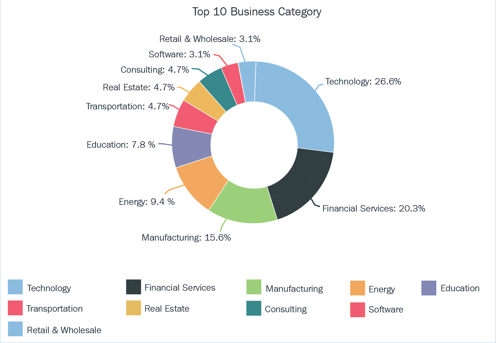Top 10 business category at risk

由于平台中有属于各个行业的公司，我们决定展示前十家面临风险的公司。十大风险行业分别是技术、金融服务、制造、能源、教育、交通、房地产、咨询和软件行业、零售和批发。

由于各种原因，技术公司面临更大的风险。一个显而易见的原因是，这些公司有非常有价值的信息可以窃取，以及技术组织本身的性质。技术公司的员工通常更好地采用新技术，他们也渴望看到新的软件或应用程序，因此他们特别容易受到攻击和利用。

尽管科技公司的员工对来自互联网的风险有更好的理解，但他们却是最容易被社会工程计划欺骗的人。与其他行业不同，这是因为技术公司的几乎所有员工都将计算机、系统和各种工具作为日常工作，将他们与互联网连接起来。由于繁重的互联网工作和工作性质，他们更容易受到影响。此外，与其他公司相比，社会工程师有更多的计划来操纵技术公司的员工。这也是科技公司名列榜首的另一个原因。

金融公司面临的风险几乎和科技公司一样大。尽管金融服务行业的许多员工非常清楚网络钓鱼或其他社会工程攻击，但根据一年内的模拟结果，他们仍然是第二大风险行业。因为就像科技公司的情况一样，银行或其他金融部门有太多的社会工程计划来操纵一名训练有素、头脑清醒的员工。如果网络钓鱼的目的是冒充高管，那么操纵员工就变得更容易了。

金融服务业面临风险的另一个原因是，它们有很多员工。例如，在 Keepnet 网络钓鱼模拟平台中注册的一家私人银行每天有超过 15，000 名员工在计算机上工作。一名员工的失误就可能导致整个系统的巨大灾难。

根据这些统计数据，当考虑到风险因素时，可以得出结论，金融服务是现实生活中风险最大的企业，因为网络犯罪分子主要喜欢攻击金融企业。尽管如此，在该平台上进行的模拟已经以有计划的方式每隔一定时间进行一次。在现实生活中，多名网络罪犯可能会针对同一家金融机构发动多种攻击，以获取经济利益。在任何情况下，当我们将网络犯罪因素纳入场景时，大多数风险行业都是金融服务。

至于制造业、能源、教育、交通、房地产、咨询和软件业，以及零售和批发业，它们都面临很大的风险；然而，与技术和金融服务相比，他们的地位更高，这部分源于他们的工作和日常经营的性质。

然而，当我们分析为期一年的网络钓鱼模拟过程时，顶级公司的响应视图揭示了真正的威胁。

# 检查一年内发送的全部电子邮件

在这个平台上，一百多家公司运行了网络钓鱼模拟；然而，我们在一年内分析了 126 家公司。这些邮件在 2017 年 1 月 1 日至 2018 年 1 月 1 日期间发送给了 126，000 名用户:

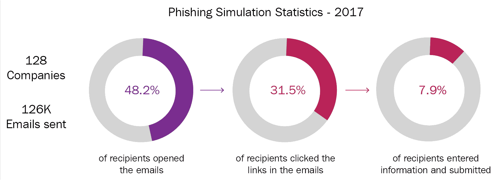Statistics of total emails sent within one year

打开假邮件(为模拟活动准备的钓鱼邮件)的用户比例为 48%。Keepnet 实验室钓鱼模拟一年注册用户总数的 2%。这些统计数据表明了公司可能面临的危险，因为超过一半的员工打开过钓鱼邮件。这些不良结果的原因是由于疏忽的错误，因为其用户故意响应网络钓鱼电子邮件，导致这种情况的操作可能是:

*   滑倒:一个不需要太多意识关注的频繁动作出错了
*   一个特定的动作被忽略了，因为它被遗忘了
*   **基于规则的错误**:遵循了常规，但是错误地使用了好的流程或者应用了坏的规则
*   **基于知识的错误**:没有可用的程序，应用知识和经验不足以安全地执行行动

*Human Errors in Cyber Security - A Swiss Cheese of Failures* by *ERLEND ANDREAS GJÆRE* (2017) available at [http://bit.ly/2COFmv9](http://bit.ly/2COFmv9).

然而，当考虑到社会工程的方法时，正是由于疏忽错误的后果，许多公司成为网络攻击的受害者。网络犯罪分子使用社会工程策略来利用人们的健忘或他们天生的人类忙乱倾向，以说服他们以冲动的方式行事。而且，在线运营中，员工普遍容易产生一种虚假的安全感。

此外，点击模拟电子邮件中链接的用户占 Keepnet Labs 钓鱼模拟平台注册用户总数的 31.5 %。这一统计显示，16.7 %的用户打开过假邮件，但他们没有点击链接，这是用户点击量高的另一个原因，根源在于钓鱼模板和钓鱼主题。公司的高管为他们的员工选择了网络钓鱼内容，因为他们知道员工缺乏网络安全最佳实践的知识，他们按照自己的意愿编辑了网络钓鱼电子邮件，使其更加真实，以社会工程师的方式思考。事实上，如今 91%的成功攻击都是鱼叉式网络钓鱼，这是指网络犯罪分子收集目标的信息，并伪造电子邮件来引诱他们。

*91% Of Cyber Attacks Start With A Phishing Email: Here's How To Protect Against Phishing* by *Guardian* (2017) [http://bit.ly/2mf56to](http://bit.ly/2mf56to).

根据这些发现，我们可以看到公司面临着巨大的风险。因为，在现实生活中，一个链接要么将用户带到一个看起来真实的虚假网站，并要求他们使用自己的用户名和密码登录，要么可能将员工带到一个用勒索软件或键盘记录器等恶意软件感染整个计算机系统的网站，或者它甚至可以直接下载病毒，而不进入网页。

另外，在网络钓鱼模拟中，点击电子邮件中的链接后提交表单的用户比例为 7.9%。用户总数的%。尽管有大量用户点击电子邮件中的链接，但当用户被重定向到另一个页面输入他们的凭据时，这一比例下降了。尽管如此 7.9 分。%的比率低于 31.5 %的点击量，但仍对公司构成巨大威胁。在现实生活中，即使只有一名员工提供了密码，网络罪犯也可能对所有系统造成威胁。他们可以冒充首席执行官或高级职员来操纵其他用户。雅虎！案例就是一个很好的例子。

*Siber Casuslar: Küresel Firmalara Yönelik Saldırılar* by *Sinara Labs* (2017).# 用户数量最多的前五家公司的社会工程攻击评估

我们分析了属于不同行业的用户数量最多的前五家公司，并根据打开的电子邮件、点击电子邮件中的链接、提交的表单、打开的附件、网络钓鱼报告者和无响应百分比来访问他们的网络钓鱼统计数据。

Keepnet Labs phishing reporter is a tool that enables the reporting and analysis of suspicious emails, placed on Microsoft Outlook's menu bar. This feature also supplies SOC teams the opportunity to identify the threats in a timely manner, and block user-based attacks against malicious emails. For more information, please refer to [www.keepnetlabs.com](http://www.keepnetlabs.com).

这些公司是根据它们的用户数量挑选出来的；因此，对用户数量最多的前五家公司进行了审查。我们对公司进行了编码，以便不明确给出它们的名称。因此，为了不特意指明它们，我们将它们编码为数字 1、2、3、4 和 5。

*   **Comp** **any Number 1** :当我们检查我们的第一家公司 Number 1 的网络钓鱼统计数据时，我们可以从下表中清楚地看到这一演变过程:

**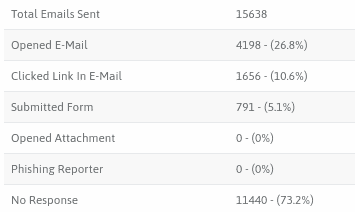**Phishing statistic for Number 1

打开的电子邮件、点击的电子邮件中的链接、提交的表单、打开的附件、网络钓鱼报告者以及没有响应的数量都表明系统员工易受社会工程威胁的攻击。尽管大多数用户都受过教育，是优秀的电脑用户，但总用户中有 4198 人开了一个名为**更改你的密码**的假电子邮件。正如我们在本研究开始时所述，社会工程师使用简单的方法。他们利用信任的感觉。在这个框架内，修改你的密码邮件并没有引起近 30%用户的怀疑。许多用户信任电子邮件的来源。此外，5.1%的用户(总共 791 个用户)甚至将他们的登录凭证提交给假冒的钓鱼网页。在这样的金融机构中，即使只有一个人给出他们的凭证，也可能导致严重的危机，因为社会工程师能够使用他们已经获得的信息，用简单的方法检索其他雇员的信息。

有趣的是，没有一个用户报告这封邮件是网络钓鱼。大多数用户宁愿不采取任何行动，也不愿报告网络钓鱼活动。这是另一个问题——一家非常大的金融公司缺乏良好的在线安全习惯。鉴于网络钓鱼举报人会让 SOC 团队及时识别威胁，并阻止针对恶意电子邮件的基于用户的攻击:

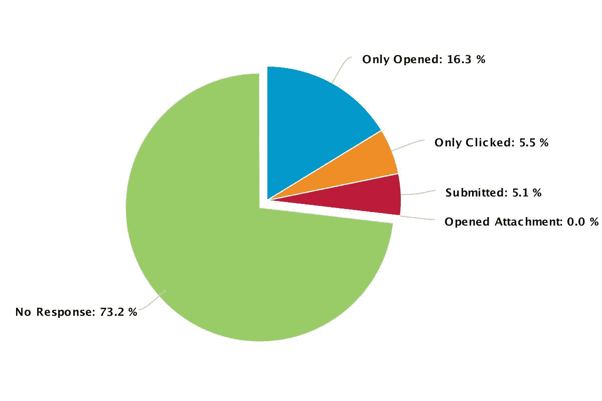Phishing percentages of number 1

*   第二家公司:至于第二家，一家使用 Keepnet 实验室的网络钓鱼模拟器的技术公司，它并没有展示出与前一家金融公司不同的案例情况，只是展示了不尽人意的结果。

我们在这项研究中的论点表明，社会工程师使用简单的方法，如信任感，这已经在这个案例中再次证明了自己。一封名为**切换到下一代 Outlook** 的钓鱼邮件发送给了排名第二的 1569 名用户。在这封假邮件中，用户被要求点击链接以下载 Outlook 的新版本。邮件发的好像是他们公司发的。机警且有意识的用户在检查链接时知道这是一封假邮件，1569 名用户中的 585 名用户(占总用户的 37.3 %)没有回答:

Phishing statistics for Number 2

最危险的情况是，大量用户在通过虚假邮件路由的虚假网站上输入了他们的用户名和密码凭证。点击电子邮件中链接的人数为 659 人，占总用户的 42 %，提交用户名和密码的人数为 598 人，占总用户的 38.1%。此外，仅打开电子邮件的人数为 324 人，占用户总数的 20.7%:

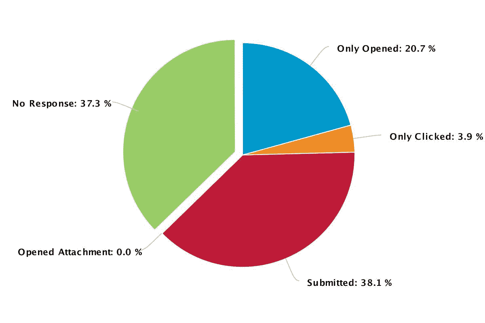Phishing percentages for Number 2

*   **3 号公司**:我们看到 3 号也有很大的风险。大多数用户在没有检查和验证的情况下相信并信任了邮件来源。排名第三的是另一家使用 Keepnet 实验室的网络钓鱼模拟器的技术公司。在模拟过程中，向 344 人发送了网络钓鱼电子邮件:

Phishing statistic for Number 3

钓鱼邮件主题是关于用户 WhatsApp 账户的，报告称他们的账户被从不同地点访问过，这让相当多的员工感到不安。尽管排名第三的公司是一家技术公司，其用户是知道如何应对网络攻击或社会工程攻击的个人，但仍有 1.2 %的用户提供了他们的凭据。

打开电子邮件的用户数量为 19 人，占用户总数的 5.5 %。点击电子邮件链接的用户数量为 12 人，占用户总数的 3.5 %。鉴于这些统计数据，社交工程师可能造成的麻烦已经暴露出来，甚至一家技术安全公司也可能成为社交工程师的受害者，这些工程师制作了带有徽标、案例和警报的虚假电子邮件内容，导致用户在不考虑情况的情况下采取行动。

此外，没有用户报告这封电子邮件是网络钓鱼。325 名用户(占用户总数的 94.5 %)宁愿什么都不做，也不愿点击 Keepnet Labs 网络钓鱼报告和分析工具。尽管与其他四家公司相比，第三家公司更好，但这些统计数据仍然对公司构成严重威胁，因为一家公司的强大取决于它最薄弱的部分。

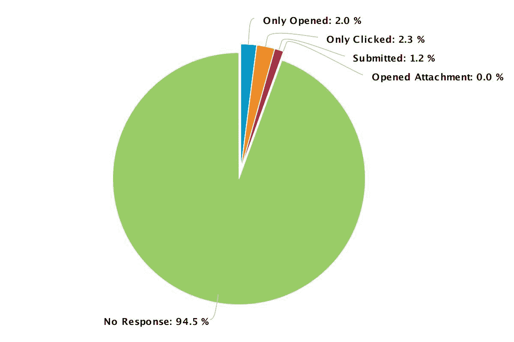Phishing percentages for Number 3

这种伪造的电子邮件使自然用户担心并紧急采取措施解决邮件中的问题成为可能，允许个人不加思考地采取行动并信任电子邮件的来源。尽管他们是有意识的个体，但他们中的大部分人很容易落入这个陷阱。这是另一个迹象，证明了我们的假设，即简单的社会工程策略之所以成功，是因为它们利用了信任感。

*   第四家公司:至于第四家公司，它是一所大学，已经使用 Keepnet Labs 的网络钓鱼模拟器来评估其员工针对网络钓鱼邮件的行动。他们使用预先存在的*假日活动*钓鱼电子邮件模板，向 1，286 名员工发送虚假电子邮件，包括学者、官员、会计等:

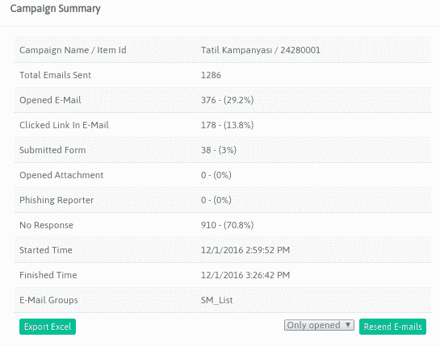Phishing statistics for umber 4 (Holiday campaign)

众所周知，社会工程攻击中哪怕 1%的失败都会造成巨大的麻烦和后果。排在第四位的用户也显示了不令人满意的结果，多达 38 名员工给出了他们的凭证，占用户总数的 3%。

376 个用户(占总用户的 29.2 %)打开过电子邮件，178 个用户(占总用户的 13.8%)点击过电子邮件中的钓鱼链接。同样，没有用户向网络钓鱼举报人举报可疑电子邮件:

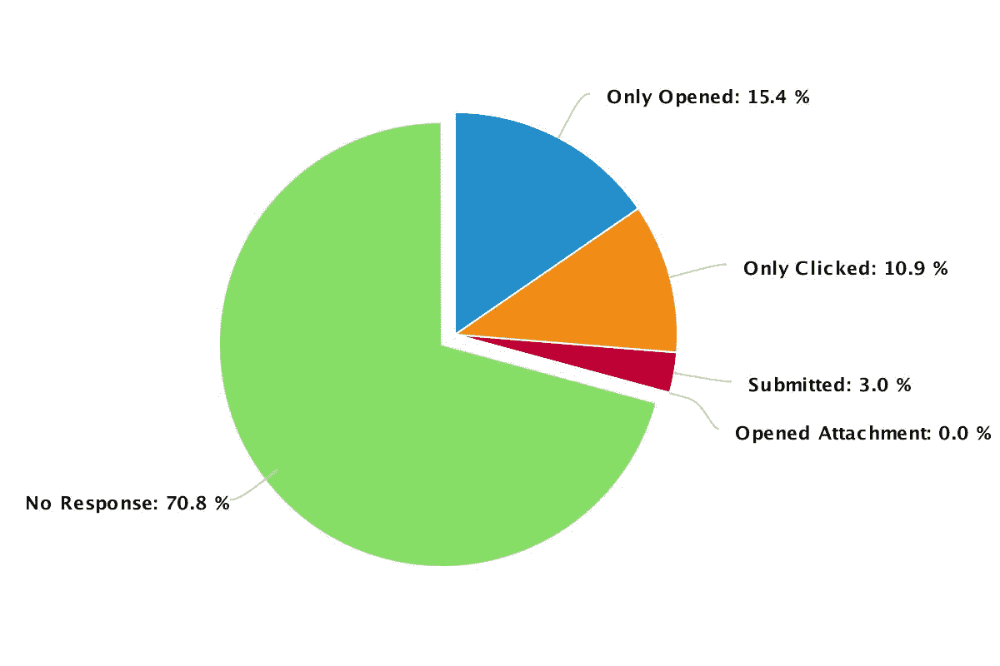Phishing percentages of number 4 (Holiday campaign)

没有回答的人数为 910 人(占用户总数的 70.8%)。我们在这项研究中发现，用户在网络安全方面的成败取决于社会工程师的方案，即他们对网络钓鱼主题的选择。当社会工程师赢得用户的信任时，他们就成功了。例如，我们向第 4 位用户发送了另一个网络钓鱼模拟，一周后，将网络钓鱼主题更改为**切换到下一代 Outlook** ，我们发现结果更加糟糕:

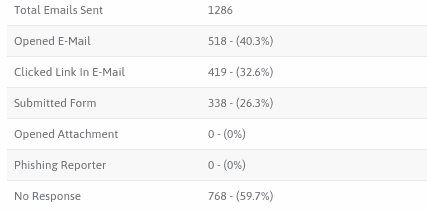Phishing statistics for Number 4 (New Generation Outlook)

这一次提交网络钓鱼表单的用户数量是 338 人，几乎是上一次模拟的 9 倍。518 名用户(占用户总数的 40.3 %)打开了电子邮件，419 名用户(占 32%)打开了电子邮件。6 %的用户点击了电子邮件中的网络钓鱼链接:

**** Phishing percentages for Number 4 (New generation Outlook)

没有回答的人数是 768 人，即 59 人。占用户总数的 7 %。同样，没有用户向网络钓鱼举报人举报可疑邮件。

当我们在一周后对同一批人进行不同的网络钓鱼模拟比较时，用户更重视第二次模拟，因为它模拟了经理或负责人。这种模拟在欺骗用户方面更为成功，因为他们本能地或毫无疑问地听从他们的上级，来自负责人员的要求，并信任他们的上级。对于前一个模拟，对假期感兴趣的用户变成了带着假邮件的生大虾。

*   第五家公司:我们的最后一个案例是第五家，一家重要的纺织公司，它的很大一部分销售来自互联网。针对 1，009 名用户发起了网络钓鱼活动:

Phishing statistics for Number 5

决策者在第五次切换到下一代 Outlook 邮件时选择了网络钓鱼主题，然而，与其他情况一样，结果并不令人满意，例如 50%的用户或 504 个人将他们的凭据提供给了虚假页面。

打开电子邮件的用户数量为 625 人，占用户总数的 69.1 %。点击电子邮件中链接的用户数量为 545 人，占用户总数的 54 %。鉴于这些统计数据，如果网络钓鱼模拟是真实的，其后果将会导致客户对公司的强烈反对，因为客户的信用卡信息可能会被网络罪犯窃取:

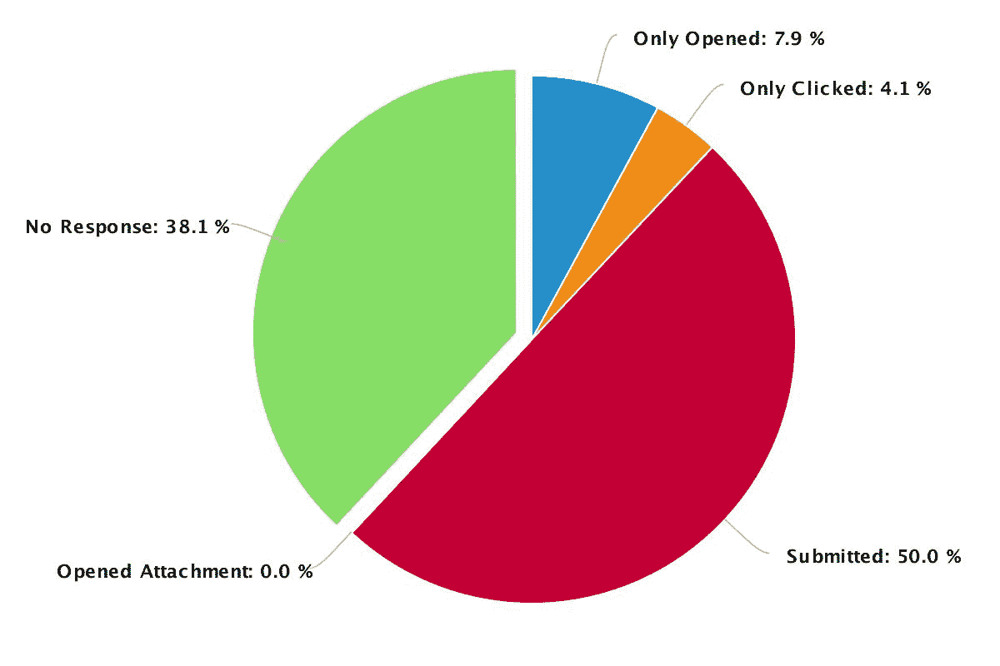Phishing percentages for Number 5

此外，没有一个用户像在其他四个案例中那样将此电子邮件报告为网络钓鱼。384 名用户(占用户总数的 38.1 %)宁愿什么都不做，也不愿报告网络钓鱼活动。

# 技巧

现实案例的提示如下:

*   本章涉及的所有案例都是真实的。所以这一章最好的提示是停止点击。
*   如果您认为自己是组织中可能的社会工程攻击的受害者，请尽快向组织中的相关人员报告，包括网络管理员。他们可以警惕任何可疑或不寻常的活动。
*   如果你认为你的财务账户已经被泄露，立即打电话给你的金融机构，关闭任何可能已经被泄露的账户，当然要密切关注你的报表。
*   如果你确实感觉到有人在打探他们不应该得到的信息，停止对话。

# 摘要

由于它是一种使用特制的通信技术操纵行为的艺术，社会工程利用了人类的弱点，欺骗人们传递他们的敏感信息。由于操纵个人比入侵计算机系统更容易，网络罪犯使用社会工程策略。

在这项研究中，我们定义了社会工程攻击周期如何由四个阶段组成——信息收集、发展关系、利用和执行。我们还揭示了社会工程之所以如此有效，是因为它利用了人性，参考了 2016 年黑帽调查中的统计数据。

此外，还调查了社交工程的案例研究，如 CEO 欺诈、金融网络钓鱼、社交媒体网络钓鱼、勒索软件网络钓鱼和比特币网络钓鱼。

此外，我们分析了在 Keepnet Labs 的网络钓鱼模拟平台上注册和使用的 10 大行业，并评论了哪些类型的企业面临的风险更大。要回答这个问题，*按行业划分的风险百分比是多少？*，我们按行业衡量了风险百分比，并以表格形式显示出来。此外，我们揭示了为什么风险在不同的行业以不同的形式出现。

此外，我们分析了 2017 年 1 月 1 日至 2018 年 1 月 1 日期间，一年内向 85 家公司的 86，448 名用户发送的电子邮件总数。我们调查了一年中打开虚假电子邮件(为模拟活动准备的网络钓鱼电子邮件)、点击电子邮件中的链接以及在网络钓鱼模拟中不作回应的用户总数，结果显示，近一半的用户对他们的公司构成了威胁。

最后，我们分析了属于不同行业的用户数量最多的前五家公司，并根据打开的电子邮件、点击电子邮件中的链接、提交的表单、打开的附件、钓鱼报告者和无响应百分比检查了他们的钓鱼统计数据。通过这样做，我们有机会以公司为单位检查网络钓鱼活动的影响。

最重要的是，我们用现实生活中的场景证明了我们的假设，即成功的网络攻击是滥用信任感的简单社会工程技术。

