第九章街亭

那些自助电子终端无处不在。他们坐在那里，自鸣得意，嘲笑没有技术含量的黑客，只求被玩弄。猜猜非技术黑客会做什么？大多数时候，他们只是看着它们。但是正如你已经知道的，黑客看事情的方式和正常人不一样。当黑客看到一个信息亭时，这个东西就打开了，暴露的信息比你想象的要多。但是当信息亭不仅仅是一个信息亭时会发生什么呢？当信息亭保存航空公司乘客信息时会发生什么？如果信息亭存有机密的患者信息怎么办？如果售货亭里有现金呢？非技术黑客处理这些设备有什么不同吗？可能不会。毕竟，无接触的方法大有帮助。但是如果一个没有技术含量的黑客真的决定接触这些东西，生活就会变得非常有趣。然后，他们可能会做一些非常邪恶的事情，比如按 SHIFT 键，然后破门而入。

# 了解信息亭黑客攻击

「互动资讯站是一种以电子方式提供资讯的电脑终端机。交互式信息亭有时类似于电话亭，但也可以坐在长凳或椅子上使用。*http://en.wikipedia.org/wiki/Internet_kiosk.*

如今，信息亭随处可见。没有人比黑客更能意识到这一点。虽然大多数人不认为交互式信息亭是一种安全威胁，但请记住，这些是联网的数据终端，连接到存储大量有趣数据的后端数据库:姓名、地址、电话号码、社会保险号、信用卡数据、银行信息甚至医疗数据。虽然大多数黑客只是因为这些设备有趣才戳它们，但恶意的非技术黑客可能会大笑不止。让我们从一个非技术黑客的角度来看看几个信息亭。

下一张照片展示了一个典型的机场自助检查亭。

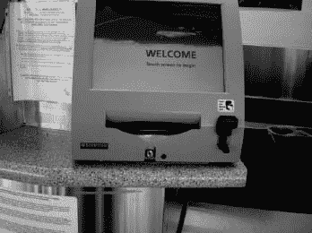

当我看到这样的机器时，我会问自己几个问题。我想知道这台机器运行的是什么操作系统。意识到这个东西是联网的，我想知道它使用的协议类型，如果它运行 TCP/IP，我想知道它使用什么地址和端口。十多年来，人们一直认为机器是网络上的地址，这是条件反射。用传统方法找到这些问题的答案需要相当多的工作。

首先，我需要找一个地方接入信息亭的网络。然后(假设我知道了机器使用的网络协议),我需要将一台机器连接到网络，并开始嗅探流量，看看我能看到什么。如果网络是安静的，我将不得不开始扫描网络，试图让机器响应。一旦 kiosk 与我交谈，我会分析结果来猜测操作系统。一旦我确定了所有这些信息，我就可以制定一个攻击计划。这将是一个无聊的(我的意思是典型的)方法。如果我想有更多的乐趣，我会攻击亭的投入。忽略屏幕上的键盘(这当然不允许我输入任何有趣的字符)，我会专注于信用卡刷卡。我可能会烧一些讨厌的单轨道、双轨道或三轨道“信用卡”,然后把它们全部刷过阅读器，试图让信息亭闭嘴。如果我感觉不舒服，我会制作自己的假护照，上面载有不良数据，然后刷过阅读器，试图破解它。为了确保万无一失，我想我可以带一大包伪造的卡和护照，让它们全部通过(同时抵挡住成群结队的美国运输安全管理局特工),因为我知道最终会有事情发生。然后我会在我的联邦拘留室里傻笑，因为我知道我离拥有一个机场电话亭已经*这么近了*。

或者，我可以选择不使用科技产品，在处理日常事务时睁大眼睛——而且完全合法。然后，只是可能，我会看到这样的东西。

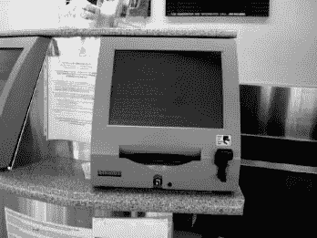

我会很随意地走上前去，照几张这样的照片:

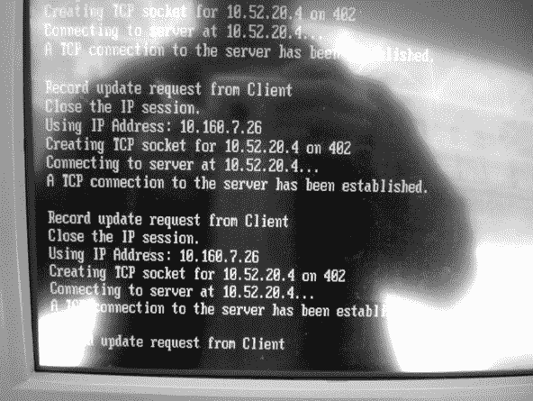

然后，我知道 kiosk 运行的是 Windows 的一些衍生版本，因为只有 DOS 使用那种难看的字体，而 DOS 的网络不是很好，所以这要么是命令外壳，要么是单用户模式。我知道它位于 TCP/IP 网络上，kiosk 使用的 IP 地址是 10.160.7.26。我知道这是一个专用网络，因为保留了“10”地址。我还知道 kiosk 连接到 10.52.20.4 的服务器，它试图连接到 402 端口，IANA 说这个端口被一个叫做 Altiris 的产品使用的 *Genie 协议和*所使用。我的朋友克里斯·伊格尔(Chris Eagle)让下一步的研究变得相当优雅——他建议“感觉幸运”地在谷歌上搜索*“在 402 上为”*创建 TCP 套接字，这确认了 kiosk 正在运行 Windows，它正在运行 Altiris 软件，错误消息来自 *DOS BootWorks。*我不需要接触机器或网络，也不需要冒任何法律不愉快的风险，就能知道所有这些。这就是非技术黑客的运作方式。

在下一张照片中，一个没有技术含量的黑客已经知道了公共网络电话的内幕。

一个没有技术含量的黑客会知道——只要注意一下——这个高科技手机运行了 *chkdisk* ,这暗示了它的 DOS 根源，它受到了坏硬盘的影响，以及在这个可怜的设备上哪些文件记录段是坏的。他或她会知道这一切，因为下一张照片证明了这个愚蠢的东西咳出了一个毛球。

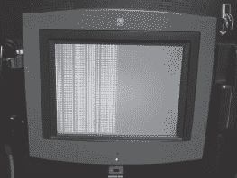

机场信息屏幕也很容易阅读，尤其是在显示错误的时候。下一张照片展示了一个 Windows 任务栏。

正如我们在第 3 章中讨论的，每个图标都有其含义。我们可以看出(除了其他方面),该终端运行的是 Windows，而机场依赖于 Symantec AntiVirus(左起第五个图标)。

正如下一张照片所示，登机牌同样容易被非技术黑客盯上。

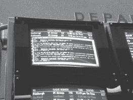

该屏幕显示了关于提取出发信息的数据库、使用的地址和协议的信息，甚至该应用程序是完全定制的，因为谷歌搜索各种诊断信息完全没有显示任何信息。

抛开机场航站楼不谈，让我们来看看一家典型的医院。即使在医院里，非科技黑客也保持着好奇心。看看下一张照片。

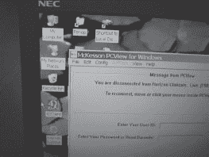

一眼就能看出一直受欢迎的 Windows 操作系统，以及几个有趣的应用程序:McKesson PCView(返回多达六个谷歌搜索结果)和 *4dClient* (带有强烈的 Novell 气味)。下一张照片有助于完成这幅画。

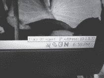

大的“N”*“*表示一个 Novell Netware 客户端，还有 McAfee antivirus 图标，以及 Numara 的 *Track-It* 帮助台和资产管理软件的图标。IP 地址也可见。我意识到这似乎是很少的信息，但请记住，这一切都是在不接触键盘和不利用任何高科技攻击的情况下捕获的。每一个微小的信息都是一个免费赠品，传统的攻击者必须为之努力。

医院的流动护士站甚至是更酷的目标。看看下一张照片。它是移动的，无线的，不可抗拒的。

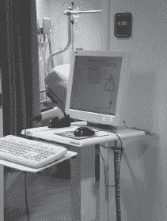

即使是远处的视图也能显示机器正在运行 Windows，并且启用了活动桌面。更近的视角变得更加有趣。

所以，看着图标，我可以知道这台机器是在无线网络上，而且它的音量没有静音。好玩。我可以看到机器使用 USB 或 PC 卡，时间是下午 6 点 51 分。我还知道 IP 地址是 10.1.150.166，真是见鬼！！！1!1!1!那是密码吗？！？是的，标签上有医院网络的用户名和密码。为了增加效果，让我用斜体打印出来。*医院网络的用户名和密码。*

“但是那上面不可能有病人的信息，”你可能会说。看下一张照片。

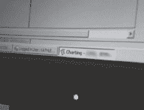

是的，我几乎模糊了整张照片，但那是文字*如数家珍，*是的，那是一张病人的图表，塞满了各种敏感的医疗信息。你能拼写 HIPAA 吗？我不确定这家医院能否。

站在那里看互动信息亭会变得非常无聊。最终，一个没有技术含量的黑客会想要与信息亭进行互动。大多数信息亭总共有五种击键组合，但我们只提到其中一种——一种很少被提及的组合。我的一个好朋友，CP，有一种让机器做疯狂事情的野性能力，正如下面这些照片所揭示的。CP 在自然环境中拍摄了下一张求职亭的照片。

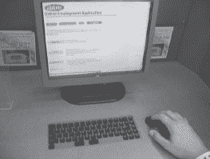

这台特殊机器的设计者相当聪明——他们移除了邪恶黑客(脚本小子)用来搞乱事情的大部分密钥。尽管如此， *SHIFT* 键仍然存在，CP 很好地利用了它。他敲了五下，由于 Windows *的粘滞键*功能，信息亭开始发出烦人的唧唧声。下一张照片中的弹出标志着乐趣的开始。

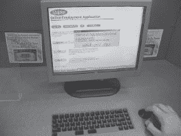

*粘滞键*弹出菜单使信息亭退出信息亭模式，进入 Windows 模式。这使得 CP 可以访问*开始*菜单和任务栏，在下一张照片中可见。

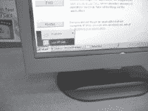

虽然 Windows 会话仍然非常有限，但任务栏揭示了很多东西。我们可以看到 kiosk 程序被称为*uni cru*(【www.kronos.com】T2)，谷歌搜索显示它是由 Lowe's、好莱坞视频、电路城、玩具反斗城、百思买、全食超市和百视达视频等公司运营的人力资源应用软件。这很有趣，因为它表明这种粘滞键“攻击”也将对他们的应用程序信息亭起作用。下一张照片显示了任务栏的右侧。

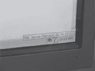

这张照片显示，这些信息亭在国防部网络信息中心拥有的地址上运行 VNC 服务器。我不确定这到底是什么意思。但是高露洁棕榄公司可能已经发现主要的零售连锁店实际上是在美国国防部的控制之下。这解释了一些收银员的教官态度。

高露洁棕榄也在其他售货亭进行了尝试。下一张照片展示了一家全国连锁书店使用的定制售货亭。与医院的信息亭不同，这是特意放在商店里供顾客互动的。在空闲时间，一个低技术含量的黑客可以闲逛几分钟而不引起怀疑。

轻击几下 *SHIFT* 键产生粘滞键配置，以及其他辅助选项，如下图所示。

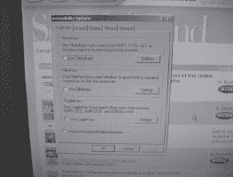

粘滞键“黑客”不会对每个信息亭都起作用，但它对其中的一些信息亭起作用，这是另一个简单的非技术黑客绕过现代安全限制的光辉例子。

# 真实世界:ATM 黑客

电子售票终端、就业信息亭、病历信息亭等都很有趣，但毫无疑问，信息亭的王者是自动柜员机(ATM)。我的意思是，这东西能装现金。它是各种攻击者的天然目标，无论是高科技攻击者还是非高科技攻击者。当我看到下一张照片中的场景时，我必须抓住一个镜头。

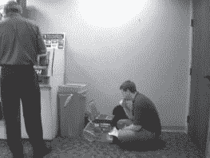

这两位技术人员如此专注于他们的工作，几乎没有注意到我。我又拍了几张照片，最终那个穿蓝衬衫的技术人员接到了他手机上的一个电话，然后走开了。尽管他一直呆在自己的岗位上，但我知道他正在处理多项任务，他会忘记周围的世界。我趁机靠近了一些。我站在机器旁边，刚好在另一边笔记本电脑操作员的视线之外。我低头拍下了下一张照片。

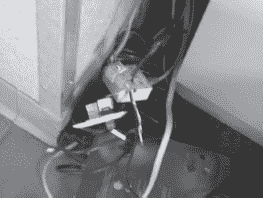

杂乱的电线很有趣。我认出它们是标准的网线。我认出了照片底部的灰色设备，并拍了一张更好的照片。

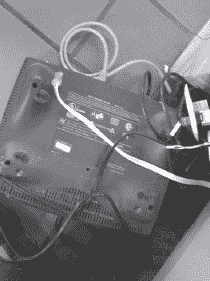

思科 1700 系列路由器看起来明显很旧，但至少它是可以辨认的。我没有对 ATM 机做过太多的研究，但我一直认为它们是非常古怪的机器，依赖于奇怪的硬件和专有协议。网络电缆表明使用了一种通用协议(如 TCP/IP ),而 Cisco 路由器强化了这一点。往 ATM 机后面看，看到机器后面拖着网线，不知道是不是一直从机器里伸出来。这也让我想知道我是否可以稍后回来，连接我自己的集线器或路由器，摆弄机器。当蓝衬衫打完电话回到他的岗位时，我从机器旁退了出来。我知道我再也不会回来验证我关于网线的理论了。我知道那条路通向哪里，我不想因为好奇而被关起来。我穿过大厅，盯着技术人员。蓝衬衫打开了柜子的前面，他的手机又响了。他走开了，我拍了一张 ATM 机内部的大照片。

在机器内部，侧放着一个看起来像标准个人电脑桌面的东西。我知道我可以通过谷歌搜索 ATM 机的名称并翻出手册来获得更多信息(是的，这很有用)，但这更有趣。我是大楼里的一名访客(我有没有提到我被安排做一个关于非技术黑客的演讲？)尽管车流不断，而且我明显没有游客证，但我还是在这里偷偷摸摸地给 ATM 技术人员拍照。谷歌只是不会一样。我拍了一张蓝衫的笔记本电脑的照片，单独放在机器上面。

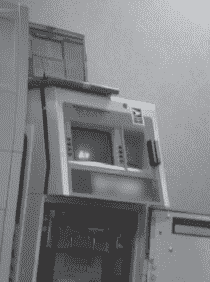

我不能过多谈论我在那个屏幕上看到的东西，或者他电脑侧面那个看起来像天线的小东西是什么，或者 ATM 机技术人员用它做什么，因为那是不负责任的。我也无法确认或否认我可能掌握的关于技术人员如何(或是否)与机器内部的保险箱互动的任何信息，以及当他拨弄(或没有拨弄)保险箱时，他是否可能(或可能没有)容易受到肩部冲浪的影响。此外，我的目标是另一个人——他看起来像真正的技术人员。我转向右边，站在他身后，拍了一张照片。

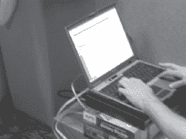

我(可能)也捕捉到了视频，并且(可能)非常熟悉他用来(或可能没有用来)与 ATM 机交互的工具、协议和流程。如果我是一个坏人，我可能已经很顺利地完成了我的第一次 ATM 抢劫，多亏了一次很好的非技术黑客会议。不，我再也没去过那台提款机。我也不打算这么做。