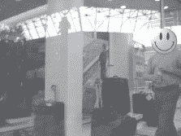
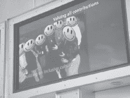
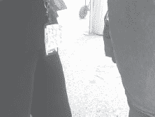
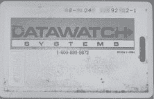
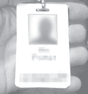
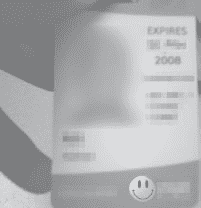
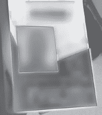
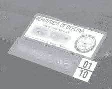
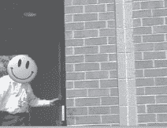
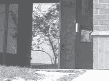

第十一章徽章监视

# 你的徽章在哪里？

我喜欢当电话员溜进大楼。这是我最喜欢的装扮，因为我有装备、行话和行头。但是如果没有看起来正式的徽章，我只是一个带着一包小玩意和一件傻里傻气的衬衫的傻瓜。徽章造就了外表，而外表让我成了打电话的人。但是徽章不就是一层纸吗？不，真的不止这些。在安全行话中，它是一个*认证令牌。*当我把它展示给某人时，他们会看着它，并对我是谁做出结论。视觉识别导致弱身份验证，但这就是它在我的大多数目标建筑中的工作方式，所以我利用了这个致命的安全缺陷。我知道一个没有技术含量的黑客可以在偷偷看一眼后很容易地复制一个徽章，我对我每周在户外发现的数百个徽章感到非常惊讶。

尽管我经常在户外看到这些愚蠢的东西，但当我看到新的东西时，我仍然会头晕，因为我毫无疑问地知道，我可以用它来进入那家公司。即使他们使用了某种电子系统来验证卡——我们将在本章的后面详细讨论这些系统——我也可能使用徽章跟踪或社会工程进入。我知道，对网站徽章感到眼花缭乱很奇怪，但我已经接受了我不正常的事实。所以这些天我一路走来。无论我去哪里，我都带着相机去捕捉我在野外发现的徽章，就像下一张照片中的那个，我在当地的一个商场里发现了它。

很多时候，徽章是成包出现的，就像下一张照片揭示的那样。

当我在一座大型企业大楼的大厅里等候时(当然是为了正当的生意)，我被一个企业啦啦队幻灯片的嗡嗡声吸引住了，这个幻灯片是从壁挂式平板屏幕上播放出来的。就在我陷入一阵无聊的无意识状态之前，我看到了下一张照片中的屏幕。为了及时拿出相机，我差点摔倒在扶手椅上。

这张幻灯片展示了处于不同公司关系阶段的员工群体，他们都佩戴着徽章。我没有真正的兴趣在弹出这个建筑，但在大厅两分钟后，我有足够的信息来伪造一个层压纸访问令牌，并试图有我的方式与建设。

政府机构多年前就知道，员工离开工作场所时应该摘下胸卡。更隐秘的机构在执行这项政策时非常积极主动。我并不惊讶地发现，在更为隐秘的政府大楼周围，露天徽章如此之少。这里的关键词是*少。*在华盛顿走廊逗留期间，我偶然发现了一家办公室租赁公司提供的户外烧烤。该活动旨在对各种企业租户表示感谢，其中一些租户与政府有关。当我在大型餐饮帐篷里闲逛时，我对我发现的徽章数量感到惊讶。我忙着给人们拍照，几乎忘了吃免费食物。

虽然我看到了属于几个不同公司的徽章，但有些比其他的更令人惊讶，比如这里的机场徽章。

我很确定我不能带着一个看起来很像的徽章大摇大摆地走进机场，但考虑到它是在远离机场的地方拍摄的，这张照片还是很有趣的。在这一点上，我将拒绝提及最近关于美国运输安全管理局错放数百套制服的新闻报道。我也不能确认或否认，当穿着(或不穿着)美国运输安全管理局制服时，是否有可能未经授权进入任何机场财产。

当我继续在餐饮帐篷周围转来转去时，两个排队的女人引起了我的注意(不是那种方式)。两人中较高的那个看上去非常重要。她穿着漂亮的黑色西装，正在黑莓手机上进行一场听起来很重要的对话。吸引我眼球的不是那部极客风格的手机，而是她挂绳上悬挂的过多徽章和随身用品。在科技圈里旅行，我见过我的挂绳杂乱，但这位女士获得了最具女性颈部天赋奖。

当我走近时，我意识到她的徽章明显是政府的。我拍了几张照片——他们似乎都没注意到——检查完之后，我意识到我在更有趣的徽章上有一个可怕的角度。当她继续对着电话聊天时，我转到她的另一边，尽可能地靠近她，而不触发她的跟踪者探测系统(当然是受损的)。在离她不到一英尺的地方，我拍下了下一张照片。

这个特殊的徽章是发给驻扎在五角大楼的政府雇员的。便利贴提醒她“带一份昨天的《全员行动》去 DSS 总部”。当然，五角大楼的安全措施是首屈一指的。我从个人经历中知道，驻扎在五角大楼的警卫是认真的。他们可不是好惹的。我也知道五角大楼的徽章视觉识别毫无意义。所有徽章都经过电子验证，这一电子过程的安全性是世界一流的。我也很确定警卫们那些看起来很邪恶的自动步枪是真的。

尽管如此，我认为五角大楼的安全小组如果知道他们的员工带着徽章是多么随意，他们会发疯的。我不是在指责五角大楼，但我认为有必要提一下，即使是最顽固的政府机构也会雇佣有时粗心大意的人。五角大楼制定的*政策*确保粗心行为不会对设施的安全态势产生负面影响，公司安全官员应该牢记这一教训。员工徽章的视觉识别不是一种安全的身份验证机制。不允许任何社会工程师的途径。建立安全的访问机制，并以员工理解并必须遵守的合理、可执行的政策作为支持。员工应该明白，安全不是别人的问题。

## 电子徽章认证

我想我已经成功地证明了视觉徽章识别是一种不安全的安全程序。电子验证是一种更安全的认证方法，但这些系统也有安全问题，对它们的非技术攻击非常有趣。正如下一张照片所示，在平面图中看到接近型卡片并不少见。

高科技徽章攻击

在*刷卡*卡和*接近式*或*非接触式*卡之间存在许多技术差异，但它们可以被以类似的方式攻击。两者都可以被复制，但是多亏了 Jonathan Westhues 开发的设备(详见 http://cq.cx/prox.pl ),非接触式卡即使放在口袋或钱包里也可以被远距离复制。为了防止这种类型的攻击，可以考虑将访问卡与 PIN 识别方案结合起来，或者部署一个依赖于加密、挑战响应系统或读卡器访问列表的系统，如 HiD 的 *iClass* 系列。

这两人执行了良好的常识，并删除了他们的网站徽章。然而，他们的门禁卡仍然清晰可见。尽管克隆卡的可能性是存在的，但本着非技术黑客的精神，另一种攻击也是可能的。对手可以简单地通过看卡片来了解更多的信息。考虑下一张照片中显示的典型的 *Datawatch* 卡。

卡上的免费号码会响遍 Datawatch 系统。对手所要做的就是打电话给代表(或温和的社会工程师)，读出最上面一行的号码，不仅知道卡片上的地址和建筑号码，在某些情况下还知道套房或房间号码。

大多数人绝不会考虑在额头上贴一张便利贴来显示他们的工作地址，但令人惊讶的是，有多少人在众目睽睽之下佩戴这些电子卡片，它们显示的基本上是相同的内容。离开工作区时，应取下类似的出入卡。

## 真实世界徽章监控

CP 给我发来了这个关于他的电话修理工徽章的美丽社会工程的伟大故事。CP 的风格让这个故事更加有趣，所以我把它收录在他自己的话里。

*“一名[电信]员工来到我的工作岗位修理我们的 DSL2 线路，当他在工作时，我在一些[电信]政策上绊倒了他，并暗示他实际上可能不是来自[电信](某个没有技术侵入我的人)，我需要他的徽章照片作为“安全参考”。然后他问我为什么需要这个，我告诉他这只是一个个人政策，他真的不需要遵守，但他递给我他的徽章挂绳，继续工作，而我给他的[三家公司]徽章拍照。当我用手机相机拍照时，他似乎有点紧张，但后来我给他一杯雪碧和一张我们坐在办公室里拍的*帕特龙*的照片。他谢绝了酒，但拿了汽水。这似乎让他放松了一些。”-CP*

接下来的三张(高度剪辑过的照片)就是 CP 成功的证明。

照片由 CP 提供

这次攻击的目的很简单，但却非常优雅。通过将他的好奇心称为“个人政策”，并为技术人员提供一个轻松的出路，他使自己看起来不那么具有威胁性(CP 毕竟是好人之一)。通过给那人提供一杯饮料，他让技术人员放心了，很可能他从未报告过这一事件。如果 CP 是坏人之一，现在你的办公室里很可能会有一个没有技术含量的电信“修理工”。

下一个真实世界的黑客将几种技术结合成一次成功的攻击。一天，当我开车四处转悠时，我发现一只非常独特的政府蓝獾在午餐时间出来散步。当我开车经过一个看起来很普通的办公园区时，一个 govie 徽章的出现让我大吃一惊。等我调转车头去拍照的时候，我已经跟不上 govie 了。我把车停在众多停车场中的一个，开车四处转悠，试图找出哪栋大楼属于政府。所有的建筑看起来都一样，而且很多都没有标记，这让我的工作更加困难。我想看看一些垃圾箱里面，但是因为这不是一场有报酬的演出，我想了想——没有一张*出狱自由卡，演出会很快变坏。相反，我继续在停车场巡逻，寻找更多的徽章。然后我发现了一张熟悉的停车证。我走到车前，拍下了下一张照片。*

当我环顾停车场时，我意识到在一栋特定建筑周围的每辆车都挂着国防部的停车许可证。毫无疑问，我知道我已经找到了政府大楼。我跳上我的车，开始绕着大楼慢慢跑，观察员工。跑了几圈后，我看到下一张图中的家伙从大楼里出来了。你看到我看到的了吗？

蓝色徽章在未经修改的图像中非常清晰，我立即认出它属于一个非常有趣的政府机构。当我开车经过拍摄窗外的时候，照片中的那个家伙直勾勾地看着我，但他似乎没有注意到。他正忙着用手机聊天。我决定停好车，步行绕着大楼走一圈。当我绕过大楼时，我走过几名员工，发现很难在走路时谨慎地拍摄徽章照片，所以我放弃了谨慎，像正常人一样开始拍摄。随着相机上升到眼睛的高度，我捕捉到了下一个静止的视频剪辑。

如果照片中的女人注意到了我，她也没有对我说什么。我也没有向她打招呼——我正忙着拿相机。接下来，我决定在一个侧门外扎营。我把相机放在路边，镜头对着门，让它开始拍摄。我站在相机旁边，时不时地弯下腰拨弄我鞋子上的鞋带(那天我没有穿我那双特制的 Velcro 运动鞋)。这当然让我看起来不像一个多疑的露营者。我抓拍了很多很棒的剧照，如下图所示。

虽然看到我站在路边看起来一定很奇怪，但没有人问任何问题，所以我多呆了一会儿。这次野营旅行产生了我在尾行部分使用的镜头，它从下一张照片中的雇员进入大楼开始。

她进门十秒钟后，门只关了一半。

门花了整整 15 秒才关上，这是我亲眼目睹的关门最慢的一次。这当然会让坏人有足够的时间神不知鬼不觉地通过。虽然我以这个政府设施为例，但我见过数百座企业大楼的安全措施甚至比这还要松懈。这里的要点是，尽管出现了先进的安全系统，但它们中的大多数都依赖于*人、*人，而这些人往往懒惰、不知情或者两者兼而有之。非技术黑客意识到了这一点，并会以创造性的、通常是有效的方式利用这一安全弱点。在这本书里，你已经看到了人们注意到我不仅监视他们，而且记录他们和他们的环境的例子。为什么他们不阻止我或者警告别人？也许他们中的一些人不在乎。但大多数情况下，人们没有反应是因为不知道该怎么办。如果您希望您组织中的人员挑战入侵者或报告奇怪的事件，您需要做好两件事:

1) Provide incentives for reporting suspicious activities. This doesn’t have to mean money. Recognition and praise at company gatherings sends the signal that “alert = good” and proactive people will be rewarded.2) Make your desired response both well known and easy to do.

老实说…如果你看到我在你办公室外面放大你的电脑并抓拍照片，你知道你应该通知谁吗？你的同事知道吗？如果没有人知道“入侵响应策略”是什么，光有它是不够的。定期反复地宣传它，排练它，谁知道呢——也许在接下来的几个月里，你会发现一些非技术黑客！