# 一、简介

本章涵盖了

*   什么是密码学
*   理论与现实世界的密码学
*   在这次冒险中你会学到什么

问候，旅人；坐着别动。你即将进入一个充满惊奇和神秘的世界——密码学的世界。*密码学*是一门古老的学科，旨在保护受到恶意角色困扰的环境。这本书包括我们需要抵御恶意的咒语。许多人试图学习这门手艺，但很少有人能在掌握这门技艺的道路上幸存下来。激动人心的冒险等待着我们，真的！

在这本书里，我们将揭示密码算法如何保护我们的信件，识别我们的盟友，保护我们的财富不受敌人侵犯。在加密的海洋中航行不会是一帆风顺的旅程，因为加密是我们世界所有安全和隐私的基础——最轻微的错误都可能是致命的。

注意如果你发现自己迷路了，记得继续前进。这一切最终都会变得有意义。

## 1.1 加密是关于保护协议的

我们的旅程从介绍密码学开始，这门科学旨在保护协议免受破坏者的破坏。但是首先，什么是*协议*？简而言之，这是一个(或多个人)为了实现某个目标而必须遵循的一系列步骤。例如，想象以下前提:你想让你的魔剑无人看管几个小时，这样你就可以小睡一会儿。实现这一点的一个协议可能如下:

1.  把武器放在地上

2.  在树下小睡片刻

3.  从地上收回武器

当然，这不是一个很好的协议，因为任何人都可以在你打盹的时候偷走你的剑。。。因此，密码学就是要考虑那些想利用你的对手。

在古代，当统治者和将军们忙于相互背叛和策划政变时，他们最大的问题之一是找到一种方法*与他们信任的人*分享机密信息。从这里，密码学的思想诞生了。经过几个世纪的艰苦努力，密码学才成为今天这样严肃的学科。现在，面对我们混乱和不利的世界，它在我们周围被用来提供最基本的服务。

这本书的故事是关于密码学的实践。它将带领您在计算世界中进行一次探险，以涵盖当今使用的加密协议；它还向您展示了它们是由哪些部件组成的，以及所有部件是如何组合在一起的。虽然一本典型的密码学书籍通常从密码学的发现开始，并带你了解它的历史，但我认为对我来说，以这种方式开始没有什么意义。我想告诉你一些实际的。我想告诉你我自己目睹的事情，作为顾问为大公司审查密码应用程序，或者我作为该领域的工程师利用自己的密码学。

(几乎)不会有可怕的数学公式。这本书的目的是揭开密码学的神秘面纱，调查如今什么被认为是有用的，并提供关于你周围的事物是如何构建的直觉。这本书是为好奇的人、感兴趣的工程师、爱冒险的开发者和好奇的研究人员准备的。第一章，这一章，开始了一个密码学世界的旅程。我们将发现不同类型的加密技术，哪些对我们很重要，以及世界是如何同意使用这些技术的。

## 1.2 对称加密:什么是对称加密？

密码学的基本概念之一是*对称加密*。这本书的大部分密码算法中都用到它，因此它非常重要。我在这里通过我们的第一个协议引入这个新概念。

让我们想象一下，爱丽丝王后需要给住在几个城堡之外的鲍勃勋爵送一封信。她要求她忠诚的信使骑上他信任的战马，穿过前方危险的土地，为鲍勃勋爵传递珍贵的信息。然而，她是可疑的；尽管她忠诚的信使已经为她服务了很多年，她还是希望传递中的信息对所有被动的观察者保持机密，包括信使！你看，这封信很可能包含了一些关于即将到来的王国的有争议的流言蜚语。

爱丽丝王后需要的是一个协议，模仿没有中间人的情况下把消息交给鲍勃勋爵本人。这是一个在实践中很难解决的问题，除非我们将密码术(或隐形传态)引入等式中。这就是我们几年前通过发明一种新型密码算法——称为*对称加密算法*(也被称为*密码*)最终完成的工作。

注顺便说一下，一种加密算法通常被称为*原语*。你可以把原语看作是密码学中最小、最有用的结构，它经常和其他原语一起使用来构建协议。它主要是一个术语，没有特别重要的意义，尽管它在文献中经常出现，知道它是有好处的。

让我们看看如何使用加密原语对信使隐藏爱丽丝王后的信息。现在想象一下，原语是一个黑盒(我们看不到里面有什么，也看不到它在内部做什么)，它提供两个功能:

*   加密

*   解密

第一个函数，ENCRYPT，通过获取一个*密钥*(通常是一个大数字)和一个*消息*来工作。然后，它输出一系列看起来随机的数字，如果你愿意，也可以是一些嘈杂的数据。我们将该输出称为加密消息。我在图 1.1 中对此进行了说明。

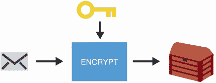

图 1.1 ENCRYPT 函数接收一条消息和一个密钥，并输出加密的消息——一长串看起来像随机噪声的数字。

第二个函数 DECRYPT 是第一个函数的逆函数。它使用相同的密钥和第一个函数的随机输出(加密的消息)，然后找到原始消息。我在图 1.2 中说明了这一点。

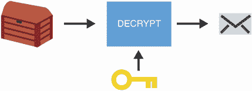

图 1.2 解密函数接收加密的消息和密钥，并返回原始消息。

为了使用这个新的原语，爱丽丝王后和鲍勃勋爵必须首先在现实生活中见面，并决定使用什么密钥。稍后，Alice 女王可以使用提供的加密功能，在密钥的帮助下保护消息。然后，她将加密的信息传递给她的信使，信使最终将信息传递给鲍勃勋爵。然后，Bob 勋爵使用相同的密钥对加密的消息使用解密函数来恢复原始消息。图 1.3 显示了这个过程。

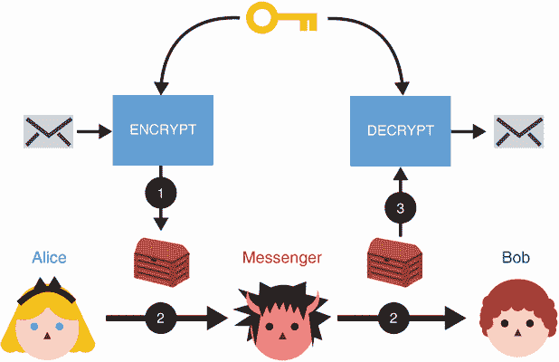

图 1.3 (1) Alice 使用带有密钥的加密函数将她的消息转换成噪音。(2)然后，她将加密的消息传递给她的信使，信使将不会了解任何关于潜在消息的信息。(3)一旦 Bob 接收到加密的消息，他可以通过使用与 Alice 使用的相同的机密密钥使用解密函数来恢复原始内容。

在这种交流中，信息传递者所拥有的只是一些看起来随机的东西，对隐藏信息的内容没有提供有意义的洞察。由于密码学的帮助，我们有效地将不安全的协议扩充为安全的协议。新的协议使得爱丽丝王后可以在任何人(除了鲍勃勋爵)都不知道信件内容的情况下向鲍勃勋爵传递一封机密信件。

使用机密密钥将事物置于噪声中，使其无法与随机数据区分开来的过程，是保护加密协议的一种常用方法。在接下来的章节中，当你学习更多的加密算法时，你会看到更多。

顺便说一下，对称加密是更大类别的加密算法的一部分，称为*对称加密*或*密钥加密*。这是由于由密码原语展示的不同函数使用相同的密钥。稍后您将会看到，有时不止有一个键。

## 1.3 克霍夫原则:只有密钥是保密的

设计一个密码算法(就像我们的加密原语)是一件容易的事情，但是设计一个*安全的*密码算法并不适合胆小的人。虽然我们在本书中回避创建这样的算法，但我们*确实*学会了如何识别好的算法。这可能是困难的，因为有比一个人要求的任务更多的选择。可以从密码学历史上的一次次失败中找到线索，也可以从社区从中吸取教训。当我们回顾过去时，我们将抓住是什么把一个加密算法变成一个可信的安全算法。

数百年过去了，许多女王和贵族被埋葬。从那以后，纸张已经不再是我们主要的交流方式，取而代之的是更好更实用的技术。今天，我们可以使用功能强大的电脑和互联网。更实际，当然，但这也意味着我们以前的恶意信使变得更加强大。他现在无处不在:你坐的星巴克咖啡馆里的 Wi-Fi，组成互联网和转发你的信息的不同服务器，甚至在运行我们算法的机器里。我们的敌人现在能够观察到更多的信息，因为你对网站的每个请求都可能通过错误的线路，在几纳秒内被更改或复制，而没有人注意到。

在我们面前，我们可以看到最近的历史包含许多加密算法崩溃的例子，被机密国家组织或独立研究人员破解，未能保护他们的信息或实现他们的主张。学到了很多经验，我们慢慢明白了如何产生好的密码学。

注一个密码算法可以用很多方式被认为*破解*。对于一个加密算法，你可以想象几种攻击算法的方法:密钥可以泄露给攻击者，不需要密钥的帮助就可以解密消息，仅仅通过查看加密的消息就可以泄露消息的一些信息，等等。任何以某种方式削弱我们对算法的假设的东西都可以被认为是一个突破。

密码学经历了漫长的试错过程，由此产生了一个强烈的想法:为了获得对加密原语所做的安全声明的信任，该原语必须由专家公开分析。如果做不到这一点，你就要依靠通过默默无闻的来保证*的安全，这在历史上并不成功。这就是为什么*密码学家*(建造的人)通常使用*密码分析师*(破解的人)的帮助来分析一个建筑的安全性。(尽管密码学家本身通常也是密码分析师，反之亦然。)*

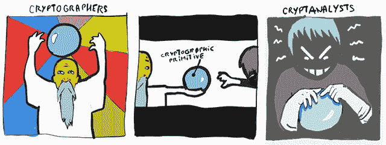

我们以高级加密标准(AES)加密算法为例。AES 是由国家标准和技术研究所(NIST)组织的国际竞赛的产物。

注 NIST 是美国的一个机构，其职责是为政府相关职能部门以及其他公共或私人组织定义标准和制定指南。像 AES 一样，它已经标准化了许多广泛使用的密码原语。

AES 竞赛持续了几年，在此期间，来自世界各地的许多志愿密码分析者聚集在一起，尝试破解各种候选结构。几年后，一旦通过该过程建立了足够的信心，一个竞争的加密算法被提名成为高级加密标准本身。现在，大多数人相信 AES 是一种可靠的加密算法，它被广泛用于加密几乎任何东西。例如，你每天浏览网页时都会用到它。

建立开放的加密标准的想法与一个经常被称为*克尔克霍夫原理*的概念有关，它可以被理解为这样的东西:依靠我们的敌人不发现我们使用的算法是愚蠢的，因为他们很可能会发现我们使用的算法。相反，让我们对他们开诚布公。

如果爱丽丝王后和鲍勃勋爵的敌人确切地知道他们是如何加密信息的，那么他们的加密算法是如何安全的呢？答案是*秘钥*！使协议安全的是密钥的保密，而不是算法本身的保密。这是本书的一个共同主题:我们将学习的所有加密算法和在现实世界中使用的算法通常都是免费学习和使用的。只有用作这些算法的输入的密钥是保密的。让·罗伯特·杜·卡莱在 1644 年说:“艺术的机密，即使对大师来说也是如此。”。在下一节中，我将讨论一种完全不同的加密原语。现在，让我们用图 1.4 来组织我们到目前为止学到的东西。

图 1.4 目前为止你所学的密码算法。AES 是对称加密算法的实例，对称加密算法是一种加密原语，是更广泛的对称加密算法类别的一部分。

## 1.4 非对称加密:两把钥匙比一把好

在我们关于对称加密的讨论中，我们说过爱丽丝王后和鲍勃勋爵第一次见面是为了决定一个对称密钥。这是一个看似合理的场景，许多协议实际上都是这样工作的。尽管如此，这在有许多参与者的协议中很快变得不太实际:在安全地连接到这些网站之前，我们需要我们的网络浏览器与谷歌、脸书、亚马逊和其他数十亿网站会面吗？

这个问题通常被称为*密钥分发*，在相当长的一段时间内一直是一个难以解决的问题，至少在 20 世纪 70 年代末发现了另一个大型且有用的加密算法类别，称为*非对称加密*或*公钥加密*。非对称加密通常针对不同的功能使用不同的密钥(与对称加密中使用的单个密钥相反),或者为不同的参与者提供不同的观点。为了说明这意味着什么以及公钥加密如何帮助建立人们之间的信任，我将在这一节中介绍一些非对称原语。请注意，这只是你将在本书中学到的一瞥，因为我将在后续章节中更详细地讨论这些加密原语。

### 1.4.1 密钥交换或如何获得共享机密

我们要看的第一个非对称加密原语是*密钥交换*。发现并发表的第一个公钥算法是以其作者 Diffie-Hellman (DH)命名的密钥交换算法。DH 密钥交换算法的主要目的是在双方之间建立一个共同的机密。然后，这个公共机密可以用于不同的目的(例如，作为对称加密原语的密钥)。

在第 5 章中，我将解释 Diffie-Hellman 是如何工作的，但是对于这个介绍，让我们使用一个简单的类比来理解密钥交换提供了什么。像密码学中的许多算法一样，密钥交换必须从参与者使用一组公共参数开始。在我们的类比中，我们将简单地让爱丽丝王后和鲍勃勋爵同意使用正方形( ■ )。下一步是让他们选择自己的随机形状。两人都去了各自的机密地点，在看不见的地方，爱丽丝王后选择了一个三角形( ▲ )，鲍勃勋爵选择了一个星星( ★ )。他们选择的对象需要不惜一切代价保密！这些对象代表它们的*私钥*(见图 1.5)。

图 1.5 DH(Diffie-Hellman)密钥交换的第一步是让双方生成一个私钥。在我们的类比中，爱丽丝王后选择一个三角形作为她的私钥，而鲍勃勋爵选择一个星星作为他的私钥。

一旦他们选择了他们的私人钥匙，他们都单独地将他们的机密形状与他们最初同意使用的公共形状(正方形)结合起来。这些组合产生了代表他们的*公钥*的独特形状。爱丽丝女王和鲍勃勋爵现在可以交换他们的公钥(因此得名*密钥交换*)，因为公钥被认为是公共信息。我在图 1.6 中说明了这一点。

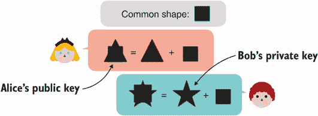

图 1.6 The 密钥交换的第二步，参与者双方交换他们的公钥。参与者通过将他们的私钥与一个公共形状组合来导出他们的公钥。

我们现在开始了解为什么这种算法被称为公钥算法。这是因为它需要一个由私钥和公钥组成的*密钥对*。DH 密钥交换算法的最后一步非常简单:Alice 女王获取 Bob 勋爵的公钥，并将其与她的私钥相结合。Bob 勋爵用 Alice 女王的公钥做同样的事情，并把它与他自己的私钥结合起来。现在，每一侧的结果应该是相同的；在我们的例子中，一个由星形、正方形和三角形组合而成的形状(见图 1.7)。

图 1.7 The 密钥交换的最后一步，其中双方产生相同的共享机密。为此，爱丽丝王后将她的私钥与鲍勃勋爵的公钥相结合，鲍勃勋爵将他的私钥与爱丽丝王后的公钥相结合。仅通过观察公钥无法获得共享机密。

现在由协议的参与者来使用这个共享机密。您将在本书中看到几个这样的例子，但是最明显的场景是在需要共享机密的算法中使用它。例如，Alice 女王和 Bob 勋爵现在可以使用共享的机密作为密钥，通过对称加密原语进一步加密消息。概括一下

1.  爱丽丝和鲍勃交换他们的公钥，这掩盖了他们各自的私钥。

2.  利用其他参与者的公钥和他们各自的私钥，他们可以计算共享机密。

3.  观察公钥交换的对手没有足够的信息来计算共享机密。

注意在我们的例子中，最后一点很容易绕过。事实上，在不知道任何私钥的情况下，我们可以将公钥组合在一起产生共享机密。幸运的是，这只是我们类比的一个局限，但是它足够好地让我们理解密钥交换是做什么的。

在实践中，DH 密钥交换是相当不安全的。你能花几秒钟找出原因吗？

因为 Alice 女王接受她收到的任何公钥作为 Bob 勋爵的公钥，所以我可以截取交换并用我的替换它，这将允许我向 Alice 女王冒充 Bob 勋爵(对 Bob 勋爵也可以这样做)。我们说一个*中间人* (MITM)攻击者可以成功攻击协议。我们如何解决这个问题？我们将在后面的章节中看到，我们要么需要用另一个密码原语来扩充这个协议，要么我们需要预先知道 Bob 勋爵的公钥是什么。但是，我们不是又回到起点了吗？

以前，爱丽丝王后和鲍勃勋爵需要知道一个共享的机密；现在爱丽丝王后和鲍勃勋爵需要知道他们各自的公钥。他们是怎么知道的？这又是一个先有鸡还是先有蛋的问题吗？嗯，算是吧。正如我们将看到的，在实践中，公钥密码学并没有解决信任的问题，但它简化了信任的建立(尤其是当参与者的数量很大时)。

让我们在这里停下来，继续下一部分，因为您将在第 5 章中了解更多关于密钥交换的内容。我们还有几个非对称加密原语要揭示(见图 1.8)，以完成我们的真实世界加密之旅。

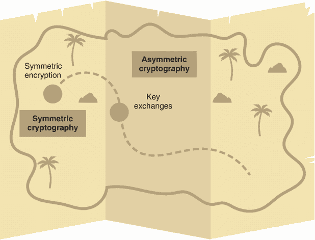

图 1.8 目前为止我们所学的密码算法。两大类加密算法是对称加密(使用对称加密)和非对称加密(使用密钥交换)。

### 1.4.2 非对称加密，不像对称加密

DH 密钥交换算法的发明紧接着是 *RSA 算法*的发明，以罗恩·里维斯特、阿迪·萨莫尔和伦纳德·阿德曼的名字命名。RSA 包含两种不同的原语:公钥加密算法(或非对称加密)和(数字)签名方案。这两种原语都是被称为*非对称加密*的加密算法大类的一部分。在这一节中，我们将解释这些原语做什么以及它们如何有用。

第一种，非对称加密，其目的与我们之前讨论的对称加密算法相似:它允许加密消息以获得保密性。然而，与对称加密不同，对称加密要求两个参与者使用相同的对称密钥加密和解密消息，而非对称加密则完全不同:

*   它使用两种不同的密钥:一个公钥和一个私钥。

*   它提供了一个非对称的观点:任何人都可以用公钥加密，但只有私钥的所有者可以解密消息。

现在让我们用一个简单的类比来解释如何使用非对称加密。我们再次从我们的朋友 Queen Alice 开始，她持有一个私钥(及其相关的公钥)。让我们把她的公钥想象成一个公开的箱子，她把它公开给任何人使用(见图 1.9)。

图 1.9 要使用非对称加密，Alice 女王需要首先发布她的公钥(此处表示为一个空框)。现在，任何人都可以用公钥给她加密信息。并且她应该能够使用相关联的私钥来解密它们。

现在，你、我和任何人都可以用她的公钥给她加密信息。在我们的类比中，想象你将你的信息插入打开的箱子，然后关上它。一旦箱子被关上，除了爱丽丝王后没有人能打开它。这个盒子有效地保护了消息的保密性，防止被观察者发现。然后，可以将封闭的盒子(或加密的内容)发送给爱丽丝王后，她可以使用自己的私钥(记住，只有她自己知道)对其进行解密(见图 1.10)。

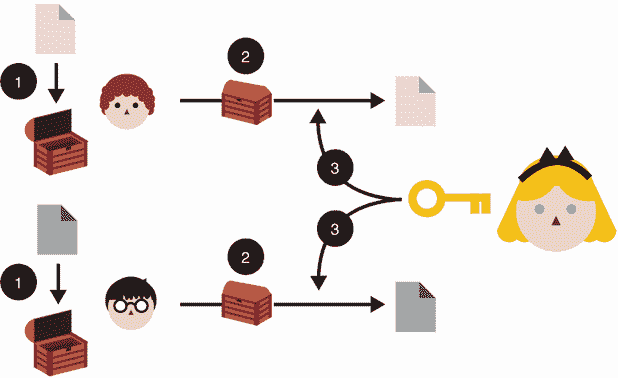

图 1.10 非对称加密:(1)任何人都可以用爱丽丝王后的公钥给她加密消息。(2)在接收到它们之后，(3)她可以使用她的相关私钥解密内容。没有人能够观察到发送给爱丽丝王后的信息。

让我们在图 1.11 中总结一下到目前为止我们学到的密码原语。我们只差一个就可以完成我们的真实世界加密之旅了！

图 1.11 目前为止我们所学的密码算法:密码算法的两大类是对称密码(带对称加密)和非对称密码(带密钥交换和非对称加密)。

### 1.4.3 数字签名，就像你的纸笔签名一样

我们看到 RSA 提供了一种非对称加密算法，但是我们前面提到过，它还提供了一种*数字签名*算法。这种数字签名加密原语的发明极大地有助于在我们世界的生命和 bob 之间建立信任。它类似于真实的签名；你知道，比如说，当你想租一套公寓的时候，你需要在合同上签字。

“如果他们伪造我的签名怎么办？”您可能会问，实际上，真实的签名在现实世界中并不能提供多少安全性。另一方面，加密签名可以以同样的方式使用，但是提供一个有你名字的加密证书。你的加密签名是*不可伪造的*，很容易被其他人验证。与你过去写在支票上的古老签名相比，这非常有用！

在图 1.12 中，我们可以想象一个协议，爱丽丝王后想要向大卫勋爵表明她信任鲍勃勋爵。这是一个典型的例子，说明了如何在多参与方环境中建立信任，以及非对称加密如何有所帮助。通过在一张写有“我，爱丽丝王后，信任鲍勃勋爵”的纸上签名，爱丽丝王后可以表明立场并通知大卫勋爵鲍勃勋爵是值得信任的。如果大卫勋爵已经信任爱丽丝王后和她的签名算法，那么他可以选择信任鲍勃勋爵作为回报。

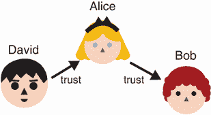

图 1.12 大卫勋爵已经信任爱丽丝王后。因为爱丽丝王后信任鲍勃勋爵，大卫勋爵也能安全地信任鲍勃勋爵吗？

更详细地说，爱丽丝王后可以使用 RSA 签名方案和她的私钥来签署消息“我，爱丽丝王后，信任鲍勃勋爵。”这会产生一个看起来像随机噪声的签名(见图 1.13)。

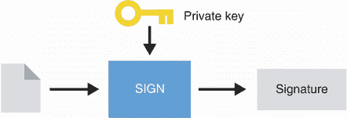

图 1.13 为了签署消息，爱丽丝王后使用她的私钥并生成签名。

任何人都可以通过结合以下内容来验证签名:

*   爱丽丝的公钥

*   被签名的消息

*   签名

结果不是*真*(签名有效)就是*假*(签名无效)，如图 1.14 所示。

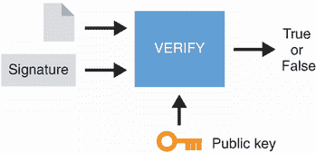

图 1.14 为了验证爱丽丝王后的签名，还需要签名的消息和爱丽丝王后的公钥。结果要么验证签名，要么使其无效。

我们现在已经了解了三种不同的不对称原语:

*   与 Diffie-Hellman 的密钥交换

*   非对称加密

*   使用 RSA 的数字签名

这三种密码算法是不对称密码中最广为人知和最常用的原语。它们如何帮助解决现实世界的问题可能不太明显，但请放心，它们每天都被许多应用程序用来保护它们周围的东西。是时候用我们到目前为止学到的所有加密算法来完成我们的图片了(见图 1.15)。T5】

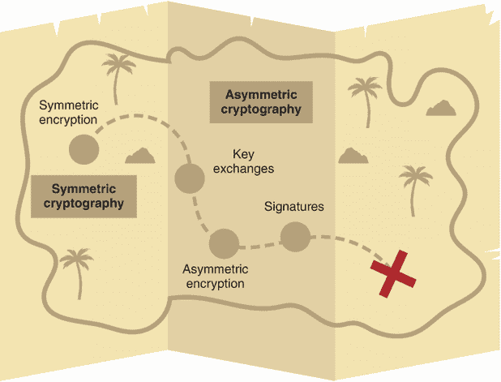

图 1.15 到目前为止我们所学的对称和非对称算法

## 1.5 分类和抽象密码术

在上一节中，我们调查了两大类算法:

*   *对称加密(或密钥加密)——使用单一机密。如果几个参与者都知道这个机密，它被称为*共享的*机密。*

**   *【非对称加密(或公钥加密)*——参与者对机密的看法是不对称的。例如，有些人知道公钥，而有些人知道公钥和私钥。* 

 *对称加密和非对称加密并不是密码学中仅有的两类原语，而且很难对不同的子领域进行分类。但是，正如你将意识到的，我们书的大部分是关于(并利用)对称和非对称原语的。这是因为当今密码学中有用的大部分内容都包含在这些子领域中。划分加密的另一种方式可以是

*   *基于数学的构造*——这些依赖于像因式分解数字这样的数学问题。(数字签名和非对称加密的 RSA 算法就是这种结构的一个例子。)

*   *基于启发式的构造*——这些依赖于密码分析人员的观察和统计分析。(用于对称加密的 AES 就是这种结构的一个例子。)

这种分类还有一个速度因素，因为基于数学的构建通常比基于启发式的构建要慢得多。给你一个想法，对称结构通常是基于启发式的(看起来是有效的)，而大多数不对称结构是基于数学问题的(被认为是困难的)。

我们很难对加密技术提供的所有功能进行严格分类。的确，每本书或每门课程都给出了不同的定义和分类。最终，这些区别对我们来说并不太有用，因为我们会将大多数密码原语视为独特的工具，使成为独特的*安全声明*。反过来，我们可以使用这些工具作为构建模块来创建协议。因此，为了理解它们如何保护我们周围的协议，有必要了解这些工具是如何工作的，以及它们提供了什么样的安全声明。因此，本书的第一部分将介绍最有用的加密原语及其安全属性。

这本书里的许多概念第一次看起来可能会很复杂。但是就像一切事物一样，我们读得越多，在上下文中看到的越多，它们就变得越自然，我们就越能抽象它们。这本书的作用是帮助你创建抽象概念，让你创建一个这些结构做什么的心理模型，并理解如何将它们组合在一起产生安全协议。我将经常谈论构造的接口，并给出实际应用和组合的例子。

过去，密码学的定义很简单:爱丽丝王后和鲍勃勋爵想要交换机密信息。现在不再是了。当今的密码学很难描述，它是围绕着发现、突破和实际需求有机发展的。说到底，加密技术有助于增强协议，使其能够在敌对环境中工作。

为了准确理解加密技术如何发挥作用，这些协议旨在实现的一系列目标对我们来说很重要。这是有用的部分。我们将在本书中了解的大多数加密原语和协议都提供了以下一两个属性:

*   *保密性*—它是关于屏蔽和保护一些信息不被错误的眼睛看到。例如，加密掩盖了传输中的消息。

*   *认证*—这是关于识别我们正在交谈的人。例如，这有助于确定我们收到的信息确实来自爱丽丝王后。

当然，这仍然是对密码术所能提供的东西的一个很大的简化。在大多数情况下，细节在原语的安全声明中。根据我们如何在协议中使用加密原语，它将实现不同的安全属性。

在本书中，我们将学习新的密码原语，以及如何将它们结合起来，以揭示保密性和认证等安全属性。现在，要意识到这样一个事实，即密码学是为敌对环境中的协议提供保险。虽然“对手”没有明确定义，但我们可以想象他们是那些试图打破我们协议的人:参与者、观察者、中间的人。它们反映了现实生活中的对手。因为最终，密码学是一个实用的领域，用来防御有血有肉的坏人。

## 1.6 理论密码术与现实世界密码术

1993 年，Bruce Schneier 发布了*应用密码学* (Wiley)，这本书的目标读者是那些想要构建涉及密码学的应用程序的开发人员和工程师。大约在 2012 年，Kenny Paterson 和 Nigel Smart 召开了一个名为 Real World Crypto 的年度会议，目标人群相同。但是应用密码学和现实世界密码学指的是什么呢？是否有一种以上的加密技术？

为了回答这些问题，我们必须从定义*理论密码学*，密码学家和密码分析学家研究的密码学开始。这些加密人员大多来自学术界，在大学工作，但有时来自行业或政府的特定部门。他们研究密码学中的一切。研究成果通过在期刊和会议上发表和介绍在国际上共享。然而，并不是他们做的每件事都明显有用或实用。通常，不会发布“概念证明”或代码。这无论如何都没有意义，因为没有一台电脑强大到足以运行他们的研究。话虽如此，理论密码学有时变得如此有用和实用，以至于它走到了另一边。

另一边是*应用密码学*或者*现实世界密码学*的世界。它是您周围所有应用程序的安全基础。虽然它经常看起来不在那里，几乎是透明的，但当你在互联网上登录你的银行账户时，它就在那里；当你给朋友发信息时，它就在你身边；它有助于在您丢失手机时保护您。它无处不在，因为不幸的是，攻击者无处不在，并积极尝试观察和损害我们的系统。从业者通常来自行业，但有时会在学术界的帮助下审查算法和设计协议。结果通常通过会议、博客和开源软件共享。

现实世界的密码术通常非常关心现实世界的考虑事项:算法提供的确切安全级别是什么？运行算法需要多长时间？原语所需的输入和输出的大小是多少？正如你可能已经猜到的，真实世界的密码学是这本书的主题。虽然理论密码学是其他书的主题，但我们仍然会在本书的最后几章中一窥究竟。做好惊讶的准备，因为你可能会瞥见明天真实世界的密码学。

现在你可能想知道:开发人员和工程师如何为他们的实际应用选择加密技术？

## 1.7 从理论到实践:选择自己的冒险

坐在最上面的是密码分析师，他们提出并解决数学难题。。。]最底层是软件工程师，他们想加密一些数据。

—Thai Duong("所以你想推出自己的密码？," 2020)

在我学习和研究密码学的这些年里，我从未注意到一个密码原语最终被用于现实应用的单一模式。事情相当混乱。在一个理论上的原型被采用之前，有一长串的人可以处理这个原型，并将其塑造成可消费的东西，有时对公众来说更安全。我该怎么向你解释呢？

你听说过*选择自己的冒险*吗？这是一个旧的系列丛书，你可以选择你想如何一步一步地阅读这个故事。原则很简单:你读这本书的第一部分；在这一部分的最后，这本书通过给你不同的选择，让你决定前进的道路。每个选项都与不同的章节号相关联，如果您愿意，可以直接跳到该章节号。所以，我在这里也是这样做的！从阅读下一段开始，按照它给你的指示去做。

* * *

*一切开始的地方。*你是谁？你是密码学家爱丽丝吗？你是大卫吗，在私营企业工作，需要解决你的问题？或者你是 Eve，在政府部门工作，全神贯注于密码学？

*   你是爱丽丝，请进入第一步。

*   你是大卫，请进入第二步。

*   如果你是 Eve，请执行第 3 步。

*第一步:研究人员要研究。*你是一名研究人员，在大学工作，或者在私人公司或非盈利组织的研究团队工作，或者在 NIST 或国家安全局等政府研究机构工作。因此，你的资金可以来自不同的地方，并可能激励你研究不同的东西。

*   你发明了一个新的原语，转到步骤 4。

*   你发明了一个新的结构，转到第 5 步。

*   你开始了一场公开比赛，转到第 6 步。

*第二步:行业有需求。*作为你工作的一部分，出现了一些事情，你需要一个新的标准。例如，Wi-Fi 联盟是一个由感兴趣的公司资助的非营利组织，旨在围绕 Wi-Fi 协议制定一套标准。另一个例子是银行联合制定了支付卡行业数据安全标准(PCI-DSS ),该标准强制执行在处理信用卡号码时使用的算法和协议。

*   如果你决定资助一些急需的研究，请执行第 1 步。

*   如果您决定标准化一个新的原语或协议，请转到步骤 5。

*   你开始了一场公开比赛，转到第 6 步。

*第三步:一个政府有需求。*你在为你国家的政府工作，你需要推出一些新的密码。例如，NIST 的任务是发布*联邦信息处理标准* (FIPS)，该标准要求与美国政府打交道的公司可以使用哪些加密算法。虽然这些标准中有许多是成功的故事，人们往往对政府机构推行的标准非常信任，但(不幸的是)有很多关于失败的说法。

2013 年，爱德华·斯诺登爆料后，人们发现 NSA 有目的地成功推动在标准中加入后门算法(见 Bernstein 等人的“双重 EC:标准化后门”)，其中包括一个隐藏的开关，允许 NSA，也只有 NSA，预测你的机密。这些*后门*可以被认为是神奇的密码，允许政府(据说只有它)破坏你的加密。随后，加密社区对来自政府机构的标准和建议失去了很多信心。最近，在 2019 年，发现俄罗斯标准 GOST 已经是同样待遇的受害者。

长期以来，密码专家一直怀疑该机构在美国国家标准与技术研究所(National Institute of Standards and Technology)2006 年采用的一项标准中植入了漏洞，该标准后来被拥有 163 个成员国的国际标准化组织(International Organization for Standards)采用。国家安全局的机密备忘录似乎证实，由两名微软密码专家在 2007 年发现的致命弱点，是由该机构策划的。国家安全局制定了标准，并积极地将其推给国际组织，私下里称这一努力是“策略上的挑战”。

— *《纽约时报》*(“美国国家安全局能够挫败网络隐私的基本保障”，2013 年)

*   你资助了一些研究，请执行步骤 1。

*   你组织了一场公开比赛，转到第 6 步。

*   如果你想让你正在使用的原语或协议标准化，请转到第 7 步。

*第四步:提出新概念。*作为一名研究人员，你设法完成不可能的事情；你发明了一个新概念。当然，有人已经想到了加密，但是每年仍有新的原语在密码学中被提出。其中一些将被证明是不可能实现的，而一些最终将是可以解决的。也许你有一个实际的结构作为你的提案的一部分，或者也许你必须等待，看看是否有人可以提出一些工作。

*   你的原语实现后，转到第 5 步。

*   你的原语最终无法实现，回到起点。

*第五步:提出新的构造或协议。*一个密码学家或者一个密码学家团队提出一个新的算法来实例化一个概念。例如，AES 是加密方案的一个实例。(AES 最初是由文森特·里门和琼·代蒙提出的，他们将他们的构造命名为他们的名字 Rijndael 的缩写。)接下来呢？

*   有人在你的基础上构建，转到第 5 步。

*   你参加了一场公开比赛并获胜！转到步骤 6。

*   你的工作有很多宣传；你得到了一个标准！转到步骤 7。

*   如果您决定申请专利，请转到第 8 步。

*   你或其他人认为实施你的计划会很有趣。转到步骤 9。

*第六步:一个算法赢得一场比赛。*密码学家最喜欢的过程是公开竞争！例如，AES 是一个邀请世界各地的研究人员参加的竞赛。经过几十次提交和几轮分析以及密码分析专家的帮助(这可能需要几年时间)，名单被缩减到几个候选人(在 AES 的情况下，只有一个)，然后变得标准化。

*   你很幸运，经过多年的竞争，你的建筑赢了！转到步骤 7。

*   很不幸，你输了。回到起点。

*第七步:一个算法或协议被标准化。*标准通常由政府或标准化机构发布。目的是确保每个人都在同一页面上，以便最大化互操作性。例如，NIST 定期发布加密标准。密码学中一个众所周知的标准化团体是互联网工程任务组(IETF ),它是互联网上许多标准(如 TCP、UDP、TLS 等等)的幕后推手，你会在本书中听到很多。IETF 中的标准被称为*征求意见稿* (RFC)，任何想写标准的人都可以写。

*为了强调我们不投票，我们还采用了"哼歌"的传统:例如，当我们举行面对面的会议，工作组主席想要"感受一下会议室的气氛"，而不是举手表决时，有时主席会要求每一方就某个问题哼歌，要么"赞成"，要么"反对"*。

—RFC 7282(“关于 IETF 中的共识和哼唱”，2014 年)

有时，一个公司会直接发布一个标准。例如，RSA Security LLC(由 RSA 算法的创造者资助)发布了一系列 15 个文档，称为*公钥加密标准* (PKCS)，以使该公司当时使用的算法和技术合法化。现在，这种情况很少见了，很多公司通过 IETF 将他们的协议或算法标准化为 RFC，而不是自定义文档。

*   您的算法或协议得到实施，转到步骤 9。

*   没人在乎你的标准，回到起点。

*第八步:专利到期。*密码学专利通常意味着没人会使用这种算法。一旦专利到期，人们对原始人的兴趣会重新燃起。最受欢迎的例子可能是 Schnorr 签名，它是成为最受欢迎的签名方案的第一个竞争者，直到 Schnorr 自己在 1989 年为该算法申请了专利。这导致 NIST 标准化了一种更差的算法，称为数字签名算法(DSA ),这在当时成为最常用的签名方案，但现在没有多少用武之地。Schnorr 签名的专利于 2008 年到期，此后该算法开始重新流行起来。

*   太久了，你的算法会被永远遗忘。回到开始。

*   你的建筑激发了更多的建筑在它的基础上被发明出来，转到第 5 步。

*   现在人们想使用你的结构，但是在它真正标准化之前。转到步骤 7。

*   有些开发者正在实现你的算法！转到步骤 9。

*步骤 9:实现一个结构或协议。*实现者有一项艰巨的任务，不仅要破译一篇论文或一个标准(尽管标准被*假定*为目标实现者)，而且他们还必须使他们的实现易于使用和安全使用。这并不总是一项简单的任务，因为在使用加密技术的过程中会出现许多毁灭性的错误。

*   有人认为是时候用标准来支持这些实现了。没有一个很尴尬。转到步骤 7。

*   大肆宣传你的密码库！转到步骤 10。

*第十步:开发者在应用中使用协议或原语。*一个开发者有一个需求，而你的密码库似乎可以解决它——很容易！

*   原始人解决了需要，但是没有标准。不太好。转到步骤 7。

*   我希望这是用我的编程语言写的。转到步骤 9。

*   我误用了图书馆，或者建筑坏了。游戏结束。

* * *

你猜对了！有很多方法可以让原始人进入现实世界。最好的方法包括多年的分析、对实现者友好的标准以及好的库。一种更糟糕的方法涉及到一个糟糕的算法和一个糟糕的实现。在图 1.16 中，我说明了首选路径。

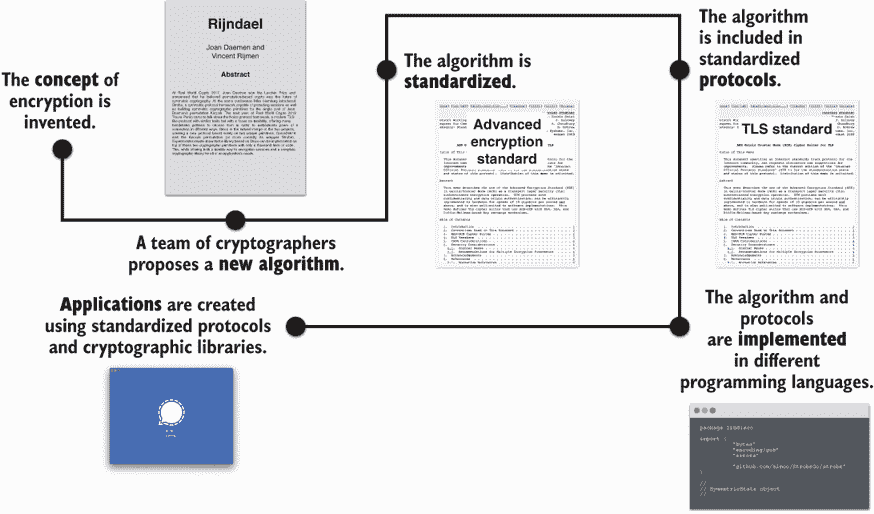

图 1.16 当密码学家在白皮书中实例化一个概念时，密码算法的理想生命周期就开始了。例如，AES 是对称加密概念的一个实例(还有很多对称加密算法)。然后，一个构造可以被标准化:每个人都同意以某种方式实现它，以最大化互操作性。然后通过用不同的语言实现标准来创建支持。

## 1.8 一句警告

*任何人，从最无能的业余爱好者到最好的密码学家，都可以创造出一个他自己都无法破解的算法*。

布鲁斯·施奈尔(《给业余密码设计者的备忘录》，1998 年)

我必须警告你，密码学的艺术很难掌握。假设你看完这本书后就可以构建复杂的加密协议是不明智的。这个旅程应该启发你，向你展示什么是可能的，并向你展示事情是如何工作的，但它不会使你成为密码学大师。

这本书不是圣杯。事实上，这本书的最后几页将带你了解最重要的一课——不要独自去进行真正的冒险。龙可以杀人，你需要一些支持来陪伴你才能打败他们。换句话说，密码学是复杂的，这本书本身并不允许你滥用你所学到的东西。要建立复杂的系统，需要研究他们行业多年的专家。相反，您将学习的是识别何时应该使用加密技术，或者，如果有些事情看起来可疑，可以使用哪些加密原语和协议来解决您面临的问题，以及所有这些加密算法在表面下是如何工作的。现在你已经被警告了，进入下一章。

## 总结

*   协议是一个循序渐进的秘籍，多个参与者试图达成类似交换机密信息的目标。

*   密码学是关于增强协议，以确保它们在敌对环境中的安全。这通常需要机密。

*   加密原语是一种加密算法。例如，对称加密是一种加密原语，而 AES 是一种特定的对称加密算法。

*   对不同的密码原语进行分类的一种方法是将它们分成两种类型:对称密码和非对称密码。对称加密使用单个密钥(正如您看到的对称加密)，而非对称加密使用不同的密钥(正如您看到的密钥交换、非对称加密和数字签名)。

*   加密属性很难分类，但它们通常旨在提供以下两种属性之一:身份验证或机密性。认证是关于验证某事或某人的真实性，而保密是关于数据或身份的隐私。

*   现实世界的密码学很重要，因为它在技术应用中无处不在，而理论密码学在实践中往往用处不大。

*   本书中包含的大多数密码原语都是经过长期的标准化过程后达成一致的。

*   密码学很复杂，实现或使用密码原语存在很多危险。*