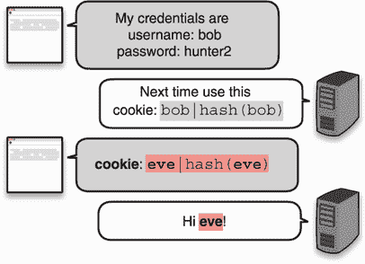
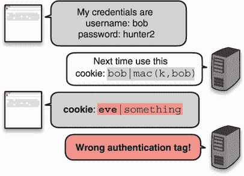
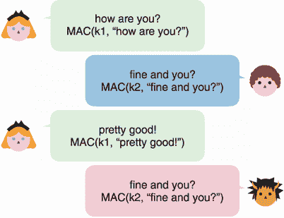
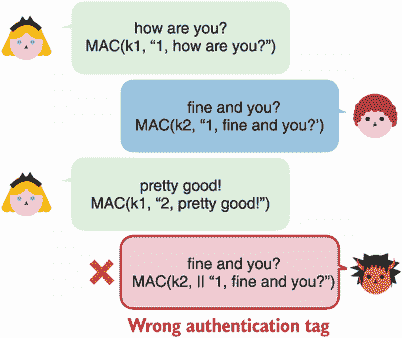
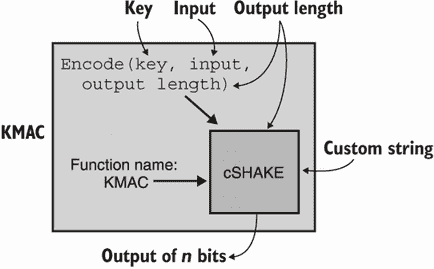
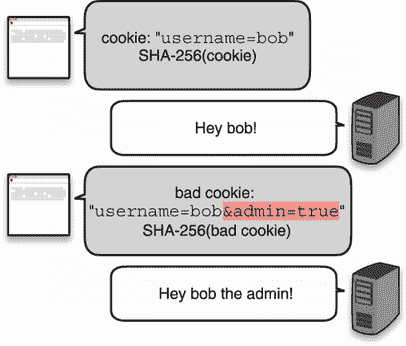
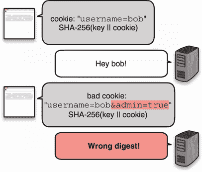
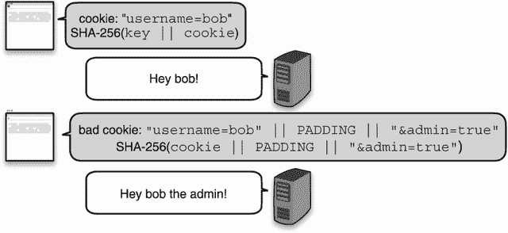

# 三、消息认证码

本章涵盖了

*   消息认证码(MAC)
*   MAC 的安全属性和陷阱
*   广泛采用的 MAC 标准

将一个哈希函数与一个机密密钥混合，你就获得了一种叫做*消息认证码* (MAC)的东西，这是一种保护数据完整性的密码原语。添加密钥是任何类型安全性的基础:没有密钥就没有保密性，也就没有身份验证。虽然哈希函数可以为任意数据提供身份验证或完整性，但这要归功于一个额外的不可篡改的可信通道。在这一章中，你将看到如何使用 MAC 来创建这样一个可信的通道，以及它还能做什么。

注意对于本章，你需要阅读第二章关于哈希函数的内容。

## 3.1 无状态 cookies，一个激励 MAC 的例子

让我们设想以下场景:你是一个网页。你很聪明，充满色彩，最重要的是，你为服务于一个忠诚的用户群体而自豪。要与您互动，访问者必须首先通过向您发送他们的凭据来登录，然后您必须验证这些凭据。如果凭证与用户第一次注册时使用的相匹配，那么您已经成功地*认证了*用户。

当然，网络浏览体验不仅仅由一个请求组成，而是由许多请求组成。为了避免用户在每次请求时都要重新验证身份，您可以让他们的浏览器存储用户凭据，并在每次请求中自动重新发送它们。浏览器有一个专门的功能——*cookie*！Cookies】不仅仅是为了凭证。他们可以在每个请求中存储你想让用户发给你的任何东西。

虽然这种幼稚的方法很有效，但通常你不希望在浏览器中以明文形式存储用户密码等敏感信息。相反，会话 cookie 通常携带一个随机字符串，在用户登录后立即生成。web 服务器将随机字符串存储在用户昵称下的临时数据库中。如果浏览器以某种方式发布了会话 cookie，则不会泄露任何有关用户密码的信息(尽管它可以用来模拟用户)。web 服务器也有可能通过删除他们这边的 cookie 来终止会话，这很好。


这种方法没有错，但在某些情况下，它可能无法很好地扩展。如果您有许多服务器，让所有服务器共享您的用户和随机字符串之间的关联可能会很烦人。相反，你可以在浏览器端存储更多的信息。让我们看看我们如何能做到这一点。

天真地，你可以让 cookie 包含用户名而不是随机字符串，但这显然是一个问题，因为我现在可以通过手动修改 cookie 中包含的用户名来模拟任何用户。也许你在第二章学到的哈希函数可以帮助我们。花几分钟时间想一想哈希函数可以防止用户篡改他们自己的 cookies 的方法。

第二种简单的方法是不仅存储用户名，还在 cookie 中存储用户名的摘要。您可以使用 SHA-3 这样的哈希函数来哈希用户名。我在图 3.1 中说明了这一点。你觉得这能行吗？


图 3.1 为了验证对浏览器的请求，web 服务器要求浏览器存储用户名和该用户名的哈希，并在每个后续请求中发送该信息。

这种方法有一个大问题。请记住，哈希函数是一种公共算法，恶意用户可以对新数据进行重新计算。如果您不信任哈希的来源，它就不能提供数据完整性！事实上，图 3.2 显示，如果恶意用户修改了 cookie 中的用户名，他们也可以简单地重新计算 cookie 的摘要部分。



图 3.2 恶意用户可以修改其 cookies 中包含的信息。如果 cookie 包含用户名和哈希，则可以修改这两者来模拟不同的用户。

尽管如此，使用哈希并不是一个愚蠢的想法。我们还能做什么？事实证明，有一个类似于哈希函数的原语，MAC，将完全满足我们的需要。

MAC 是一种机密密钥算法，它接受输入，就像哈希函数一样，但它也接受机密密钥(谁预见到了？)然后它产生一个名为*认证标签*的独特输出。这个过程是确定性的；给定相同的密钥和相同的消息，MAC 产生相同的认证标签。我在图 3.3 中说明了这一点。


图 3.3 消息认证码(MAC)界面。该算法采用密钥和消息，并确定性地产生唯一的认证标签。没有密钥，应该不可能复制该认证标签。

为了确保用户不能篡改他们的 cookie，现在让我们利用这个新的原语。当用户第一次登录时，您用您的密钥和他们的用户名生成一个认证标签，并让他们将用户名和认证标签存储在一个 *cookie* 中。因为他们不知道密钥，所以他们无法为不同的用户名伪造有效的身份验证标记。

要验证他们的 cookie，您需要做同样的事情:根据您的密钥和 cookie 中包含的用户名生成一个身份验证标记，并检查它是否与 cookie 中包含的身份验证标记匹配。如果匹配，它一定是来自您，因为您是唯一能够产生有效认证标签的人(在您的机密密钥下)。我在图 3.4 中说明了这一点。



图 3.4 恶意用户篡改了他的 cookie，但无法为新的 cookie 伪造有效的认证标签。随后，网页无法验证 cookie 的真实性和完整性，因此丢弃该请求。

MAC 就像一个私有的哈希函数，只有你能计算，因为你知道密钥。在某种意义上，你可以用一个键来个性化一个哈希函数。与哈希函数的关系不止于此。你将在本章后面看到，MAC 通常是由哈希函数构成的。接下来，让我们看一个使用真实代码的不同示例。

## 3.2 代码示例

迄今为止，你是唯一一个使用 MAC 的人。让我们增加参与者的数量，并以此为动力来编写一些代码，看看 MAC 在实践中是如何使用的。想象一下，你想和别人交流，你不在乎别人看你的信息。然而，您真正关心的是消息的完整性:它们不能被修改！一个解决办法是让你和你的通信者在 MAC 上使用同一个密钥来保护你们通信的完整性。

对于这个例子，我们将使用最流行的 MAC 函数之一——*基于哈希的消息认证码*(HMAC)——和 Rust 编程语言。HMAC 是一种消息认证码，其核心使用哈希函数。它与不同的哈希函数兼容，但通常与 SHA-2 结合使用。如下面的清单所示，发送方只是接受一个密钥和一条消息，并返回一个身份验证标记。

清单 3.1 在 Rust 中发送经过认证的消息

```
use sha2::Sha256;
use hmac::{Hmac, Mac, NewMac};

fn send_message(key: &[u8], message: &[u8]) -> Vec<u8> {
    let mut mac = Hmac::<Sha256>::new(key.into());          ❶

    mac.update(message);                                    ❷

    mac.finalize().into_bytes().to_vec()                    ❸
}
```

❶ 用一个机密密钥和 SHA-256 哈希函数实例化 HMAC

❷ 为 HMAC 缓冲更多输入

❸ 返回认证标签

在另一边，过程是相似的。在收到消息和认证标记后，您的朋友可以用相同的密钥生成他们自己的标记，然后对它们进行比较。与加密类似，双方需要共享相同的密钥来实现加密。下面的清单显示了这是如何工作的。

清单 3.2 在 Rust 中接收经过认证的消息

```
use sha2::Sha256;
use hmac::{Hmac, Mac, NewMac};

fn receive_message(key: &[u8], message: &[u8],
  authentication_tag: &[u8]) -> bool {
    let mut mac = Hmac::<Sha256>::new(key);         ❶
    mac.update(message);                            ❷

    mac.verify(&authentication_tag).is_ok()
}
```

❶ 接收者需要从相同的密钥和消息中重新创建认证标签。

❷ 检查再现的认证标签是否与接收的认证标签匹配

注意，这个协议并不完美:它允许重放。如果一条消息及其身份验证标记在以后的某个时间点被重放，它们仍然是可信的，但是您无法检测到这是一条重新发送给您的旧消息。在本章的后面，我将告诉你一个解决方案。现在你知道了 MAC 可以用来做什么，我将在下一节谈论一些 MAC 的“陷阱”。

## 3.3 MAC 的安全属性

MAC 就像所有的密码原语一样，有其奇怪之处和缺陷。在继续之前，我将提供一些关于 MAC 提供什么安全属性以及如何正确使用它们的解释。你将学会(按此顺序)

*   MAC 可以抵抗认证标签的伪造。

*   为了安全起见，认证标签需要具有最小长度。

*   如果未经验证，消息可以重放。

*   验证认证标签容易出现错误。

### 3.3.1 伪造认证标签

MAC 的一般安全目标是防止新消息上的*认证标签伪造*。这意味着在不知道密钥 *k* 的情况下，人们无法计算他们选择的消息 *m* 上的认证标签*t*=*MAC*(*k*， *m* )。这听起来很公平，对吧？如果我们缺少一个参数，我们就不能计算一个函数。

然而，苹果电脑提供的保证远不止这些。现实世界中的应用程序经常让攻击者在一些受约束的消息上获得身份验证标记。例如，在我们的简介场景中就是这种情况，用户可以通过注册一个可用的昵称来获得几乎任意的身份验证标记。因此，即使面对这些更强大的攻击者，MAC 也必须是安全的。MAC 通常带有一个证明，即即使攻击者可以要求您为大量任意消息生成认证标签，攻击者仍然不能自己在从未见过的消息上伪造认证标签。

人们可能想知道证明这样一个极端性质有什么用。如果攻击者可以直接请求任意消息上的身份验证标记，那么还剩下什么需要保护呢？但这就是密码学中安全证明的工作方式:他们找到最强大的攻击者，并表明即使这样，攻击者也是无可救药的。在实践中，攻击者通常没有那么强大，因此，我们有信心，如果一个强大的攻击者不能做坏事，那么一个不太强大的攻击者就更没有追索权。

因此，只要 MAC 使用的密钥保密，你就应该被保护免受这种伪造*。这意味着密钥必须足够随机(更多信息在第 8 章)和足够大(通常是 16 字节)。此外，MAC 容易受到我们在第二章中看到的同样类型的模糊攻击。如果您试图认证结构，请确保在用 MAC 认证它们之前序列化它们；否则，伪造可能是微不足道的。*

### 3.3.2 认证标签的长度

另一种针对 MAC 使用的可能攻击是*碰撞*。请记住，查找哈希函数的冲突意味着查找两个不同的输入 *X* 和 *Y* ，使得*哈希* ( *X* ) = *哈希* ( *Y* )。我们可以通过定义当 *MAC* ( *k* ，*X*)=*MAC*(*k*， *Y* )为输入 *X* 和 *Y* 时的冲突来将这个定义扩展到 MAC。

正如我们在第 2 章中所学的生日界限，如果我们的算法的输出长度很小，那么冲突很有可能被发现。例如，对于 MAC，能够访问生成 64 位身份验证标签的服务的攻击者可以通过请求数量少得多(232)的标签，以很高的概率发现冲突。这种碰撞在实践中很少被利用，但是存在一些碰撞阻力很重要的情况。出于这个原因，我们需要一个能够限制这种攻击的认证标签大小。通常，使用 128 位认证标签，因为它们提供了足够的抵抗力。

*【请求 2 <sup class="fm-superscript">64</sup> 认证标签】在连续 1Gbps 的链路中需要 250，000 年，并且在此期间不改变密钥 K*。

—RFC 2104(“HMAC:用于消息认证的键控哈希法”，1997 年)

使用 128 位认证标签可能看起来违反直觉，因为我们想要哈希函数的 256 位输出。但是哈希函数是公共算法，人们可以离线计算*，这使得攻击者能够大量优化和并行化攻击。使用像 MAC 这样的键控功能，攻击者无法有效地离线优化攻击，被迫直接向您请求身份验证标签，这通常会使攻击速度慢得多。128 位认证标签需要来自攻击者的 2 次 <sup class="fm-superscript">64 次</sup>T5 次在线查询，以便有 50%的机会发现冲突，这被认为是足够大的。尽管如此，人们可能仍然希望将身份验证标记增加到 256 位，这也是可能的。*

 *### 3.3.3 重放攻击

有一点我还没提到的是*重播攻击*。让我们看一个容易受到这种攻击的场景。假设 Alice 和 Bob 使用不安全的连接在户外进行通信。为了保护消息不被篡改，他们给每条消息附加一个认证标签。更具体地说，它们都使用两个不同的密钥来保护连接的不同方面(按照最佳实践)。我在图 3.5 中说明了这一点。



图 3.5 共享两个密钥`k1`和`k2`的两个用户交换带有认证标签的消息。这些标签是根据消息的方向从`k1`或`k2`计算出来的。一个恶意的观察者向用户重播其中一条消息。

在这种情况下，没有什么可以阻止恶意观察者向其接收者重播其中一条消息。依赖于 MAC 的协议必须意识到这一点，并针对这一点建立保护。一种方法是在 MAC 的输入端增加一个递增计数器，如图 3.6 所示。



图 3.6 共享两个密钥`k1`和`k2`的两个用户交换带有认证标签的消息。这些标签是根据消息的方向从`k1`或`k2`计算出来的。一个恶意的观察者向用户重播其中一条消息。因为受害者已经增加了他的计数器，标签将在`2,`T5 上被计算，并且将不会与攻击者发送的标签相匹配。这允许受害者成功拒绝重放的消息。

在实践中，计数器通常是固定的 64 位长度。这允许一个人在填满计数器之前发送 2 条 <sup class="fm-superscript">64 条</sup>消息(冒着它绕回并重复自己的风险)。当然，如果共享机密被频繁地轮换(意味着在 *X* 消息之后，参与者同意使用新的共享机密)，那么在一次密钥轮换之后，计数器的大小可以被减小并重置为 0。(你应该说服自己，用两个不同的键重用同一个计数器是可以的。)同样，由于不明确的攻击，计数器*从不变长*。

运动

你能找出可变长度计数器是如何让攻击者伪造认证标签的吗？

### 3.3.4 恒定时间验证认证标签

最后一个问题对我来说很重要，因为我在审计的应用程序中多次发现这个漏洞。验证认证标签时，收到的认证标签和您计算的认证标签之间的比较必须在*恒定时间*内完成。这意味着比较应该总是花费相同的时间，假设接收到的是正确的大小。如果比较两个身份验证标签所花费的时间不是常数，可能是因为它返回了两个标签不同的时刻。这通常提供了足够的信息来启动攻击，攻击可以通过测量完成验证需要多长时间来逐字节地重新创建有效的认证标签。我在下面的漫画中解释了这一点。我们将这些类型的攻击称为*定时攻击*。

对我们来说幸运的是，实现 MAC 的密码库也提供了方便的函数来在恒定时间内验证认证标签。如果您想知道这是如何实现的，清单 3.3 展示了 Golang 如何在常量时间代码中实现认证标签比较。


清单 3.3 Golang 中的常数时间比较

```
for i := 0; i < len(x); i++ {
    v |= x[i] ^ y[i]
}
```

诀窍在于永远不要拿走树枝。这究竟是如何工作的，留给读者去练习。

## 现实世界中的 3.4 MAC

既然我已经介绍了什么是 MAC，它们提供了哪些安全属性，那么我们就来看看人们在真实设置中是如何使用它们的。以下部分将解决这个问题。

### 3.4.1 消息认证

MAC 用在很多地方是为了保证两台机器或者两个用户之间的通信不被篡改。这在明文通信和加密通信两种情况下都是必要的。我已经解释了当通信以明文传输时这是如何发生的，在第四章中，我将解释当通信被加密时这是如何做到的。

### 3.4.2 导出密钥

MAC 的一个特殊性是，它们通常被设计成产生看起来随机的字节(像哈希函数)。您可以使用此属性实现单个密钥来生成随机数或生成更多密钥。在关于机密和随机性的第八章中，我将介绍基于 HMAC 的密钥派生函数(HKDF ),它通过使用 HMAC(我们将在本章中讨论的 MAC 算法之一)来实现。

伪随机函数(PRF)

想象所有函数的集合，这些函数接受可变长度的输入并产生固定大小的随机输出。如果我们可以从这个集合中随机选择一个函数，并将其用作 MAC(没有密钥)，那将会非常棒。我们只需要就哪个功能达成一致(有点像就一个键达成一致)。不幸的是，我们不能有这样一个集合，因为它太大了，但我们可以通过设计足够接近的东西来模拟选择这样一个随机函数:我们称这样的构造为*伪随机函数(PRFs)* 。HMAC 和大多数实用的苹果电脑都是这种构造。相反，它们被一个关键参数随机化。选择不同的键就像选择一个随机函数。

运动

注意:并非所有 MAC 都是 PRF。你能看出为什么吗？

### 3.4.3 饼干的完整性

要跟踪用户的浏览器会话，您可以向他们发送一个随机字符串(与他们的元数据相关联)或直接向他们发送元数据，附带一个身份验证标签，这样他们就不能修改它。这是我在介绍例子中解释的。

### 3.4.4 哈希表

编程语言通常公开被称为*哈希表*(也称为哈希映射、字典、关联数组等等)的数据结构，这些数据结构使用非加密哈希函数。如果一个服务以一种非加密哈希函数的输入可以被攻击者控制的方式公开这个数据结构，这可能导致*拒绝服务* (DoS) *攻击*，这意味着攻击者可以使服务不可用。为了避免这种情况，非加密哈希函数通常在程序开始时被随机化。

许多主要应用程序使用带有随机密钥的 MAC 来代替非加密哈希函数。许多编程语言(如 Rust、Python 和 Ruby)或主要应用程序(如 Linux 内核)都是如此。他们都使用了 *SipHash* ，这是一个名不副实的 MAC，针对短认证标签进行了优化，在程序开始时会生成一个随机密钥。

## 3.5 消息认证码(MAC)在实践中的应用

您了解到 MAC 是一种加密算法，可以在一方或多方之间使用，以保护信息的完整性和真实性。由于广泛使用的 MAC 也表现出良好的随机性，MAC 也经常用于在不同类型的算法中确定性地产生随机数(例如，您将在第 11 章学习的基于时间的一次性密码[TOTP]算法)。在这一节中，我们将研究目前可以使用的两种标准化 MAC 算法——HMAC 和 KMAC。

### 3.5.1 HMAC，一种基于哈希的 MAC

最广泛使用的 MAC 是 HMAC(用于*基于哈希的 MAC* )，由 M. Bellare、R. Canetti 和 h .科劳兹克于 1996 年发明，并在 RFC 2104、FIPS 出版物 198 和 ANSI X9.71 中指定。HMAC，正如其名称所示，是一种使用哈希函数和密钥的方法。使用哈希函数来构建 MAC 是一个流行的概念，因为哈希函数具有广泛可用的实现，在软件中速度很快，并且还受益于大多数系统上的硬件支持。记得我在第 2 章提到过，由于*长度扩展攻击*，SHA-2 不应该被直接用于哈希机密(在本章末尾会有更多关于那个)。人们如何知道如何将哈希函数转换成键控函数？这就是 HMAC 为我们解决的问题。在引擎盖下，HMAC 遵循这些步骤，我在图 3.7 中直观地说明了这些步骤:

1.  它首先从主键创建两个键:*k*1 =*k*⊕*ipad*和*k*2 =*k*⊕*opad*，其中 *ipad* (内部填充)和 *opad* (外部填充)为常量

2.  然后，它将密钥`k1`与消息连接起来，并对其进行哈希处理。

3.  结果与关键字`k2`连接，并再次哈希。

4.  这产生了最终的认证标签。


图 3.7 HMAC 的工作原理是对一个键的串联(`||`)、`k1`和输入消息进行哈希运算，然后对一个键的串联、`k2`和第一次运算的输出进行哈希运算。`k1`和`k2`都是确定性地从密钥`k`中导出的。

由于 HMAC 是可定制的，其认证标签的大小由所使用的哈希函数决定。例如，HMAC-SHA256 利用 SHA-256 并生成 256 位的身份验证标记，HMAC-SHA512 生成 512 位的身份验证标记，等等。

警告 虽然我们可以截断 HMAC 的输出以减小其大小，但正如我们前面谈到的，认证标签至少应该是 128 位。这并不总是被遵守，并且由于显式地处理有限数量的查询，一些应用程序将低至 64 位。这种方法也有利弊，再次强调，在做一些不标准的事情之前阅读细则是很重要的。

为了便于证明，HMAC 是这样建造的。在几篇论文中，HMAC 被证明是安全的，只要下面的哈希函数具有一些好的特性，所有密码安全哈希函数都应该具有这些特性。因此，我们可以将 HMAC 与大量哈希函数结合使用。今天，HMAC 主要和 SHA-2 一起使用。

### 3.5.2 KMAC，基于 cSHAKE 的 MAC

由于 SHA-3 不容易受到长度扩展攻击(这实际上是 SHA-3 竞赛的一个要求)，因此将 SHA-3 与 HMAC 一起使用而不是像`SHA-3-256(key` `||` `message)`这样在实践中工作良好的东西几乎没有意义。这正是 KMAC 所做的。

KMAC 使用了 cSHAKE，这是你在第二章看到的可扩展输出功能(XOF)的定制版本。KMAC 明确地编码 MAC 密钥、输入和请求的输出长度(KMAC 是某种可扩展的输出 MAC ),并将其作为输入提供给 cSHAKE 进行吸收(见图 3.8)。KMAC 还使用“KMAC”作为函数名(来定制 cSHAKE ),此外，还可以使用用户定义的定制字符串。



图 3.8 KMAC 只是切克的一个包装。为了使用密钥，它(以明确的方式)将密钥、输入和输出长度编码为 cSHAKE 的输入。

有趣的是，因为 KMAC 也吸收了请求的输出长度，几个不同输出长度的调用提供了完全不同的结果，这在一般的 XOFs 中很少出现。这使得 KMAC 在实践中具有相当多的功能。

## 3.6 SHA-2 和长度扩展攻击

我们已经多次提到，不应该与 SHA-2 哈希机密，因为它不能抵抗*长度扩展攻击*。在本节中，我们旨在对此攻击提供一个简单的解释。

让我们回到我们的介绍场景，回到我们尝试简单地使用 SHA-2 来保护 cookie 的完整性的那一步。请记住，这还不够好，因为用户可以篡改 cookie(例如，通过添加一个`admin=true`字段)并在 cookie 上重新计算哈希。事实上，SHA-2 是一个公共函数，没有什么可以阻止用户这样做。图 3.9 说明了这一点。



图 3.9 网页向用户发送一个 cookie，后跟该 cookie 的哈希。然后，要求用户在每个后续请求中发送 cookie 来验证自己。不幸的是，恶意用户可以篡改 cookie 并重新计算哈希，破坏完整性检查。该 cookie 随后被网页接受为有效。

下一个最好的主意是在我们哈希的内容中添加一个密钥。这样，用户无法重新计算摘要，因为需要密钥，这与 MAC 非常相似。收到被篡改的 cookie 后，页面计算`SHA-256(key` `||` `tampered_cookie)`，其中`||`表示两个值的连接，并获得与恶意用户可能发送的内容不匹配的内容。图 3.10 说明了这种方法。



图 3.10 通过在计算 cookie 的哈希值时使用一个密钥，人们可能会认为想要篡改他们自己的 cookie 的恶意用户将无法通过新的 cookie 计算出正确的摘要。我们稍后会看到，SHA-256 的情况并非如此。

不幸的是，SHA-2 有一个令人讨厌的特性:从一个输入的摘要中，我们可以计算出一个输入的摘要等等。这是什么意思？让我们看一下图 3.11，其中一个用 SHA-256 作为`SHA-256(secret` `||` `input1)`。


图 3.11 SHA-256 哈希一个与 cookie 连接的机密(这里命名为`input1`)。请记住，SHA-256 的工作方式是使用 Merkle–damg rd 结构，从初始化向量(IV)开始，对输入块迭代调用压缩函数。

图 3.11 是高度简化的，但是假设`input1`是字符串`user=bob`。请注意，此时获得的摘要实际上是哈希函数的完整中间状态。没有什么可以阻止人们假装`padding`部分是输入的部分，继续 Merkle-damg rd 舞蹈。在图 3.12 中，我们说明了这种攻击，其中一个人将获取摘要并计算`input1` `||` `padding` `||` `input2`的哈希。在我们的例子中，`input2`就是`&admin=true`。


图 3.12 cookie 的 SHA-256 哈希(中间摘要)的输出用于将哈希扩展到更多数据，创建与`input1`、第一个填充字节和`input2`连接的机密哈希(正确摘要)。

此漏洞允许用户从给定的摘要继续哈希，就像操作没有完成一样。这打破了我们以前的协议，如图 3.13 所示。



图 3.13 攻击者成功利用长度扩展攻击篡改他们的 cookie，并使用之前的哈希计算出正确的哈希。

第一个填充现在需要成为输入的一部分，这一事实可能会阻止某些协议被利用。尽管如此，最小的变化也可能重新引入漏洞。由于这个原因，一个人不应该和 SHA-2 分享机密。当然，还有其他几种正确的做法(比如`SHA-256(k` `||` `message` `||` `k)`作品)，这就是 HMAC 提供的。因此，如果您想使用 SHA-2，请使用 HMAC；如果您喜欢 SHA-3，请使用 KMAC。

## 总结

*   消息认证码(MAC)是对称加密算法，允许共享同一密钥的一方或多方验证消息的完整性和真实性。

    *   为了验证消息及其相关认证标签的真实性，可以重新计算消息的认证标签和密钥，然后匹配这两个认证标签。如果它们不同，则消息已被篡改。
    *   总是在恒定时间内将接收到的认证标签与计算出的认证标签进行比较。
*   虽然 MAC 在默认情况下保护消息的完整性，但它们不会检测消息何时被重放。

*   标准化且广为接受的 MAC 是 HMAC 和 KMAC 标准。

*   人们可以将 HMAC 与不同的哈希函数一起使用。实际上，HMAC 经常与 SHA-2 哈希函数一起使用。

*   认证标签的最小长度应为 128 位，以防止认证标签的冲突和伪造。

*   不要直接使用 SHA-256 来构建 MAC，因为这样做可能会出错。总是使用像 HMAC 这样的函数来做这件事。*