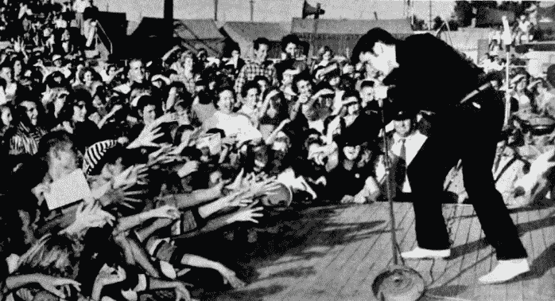
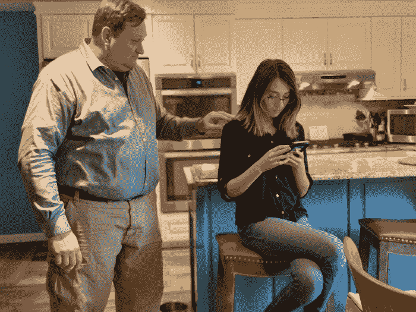
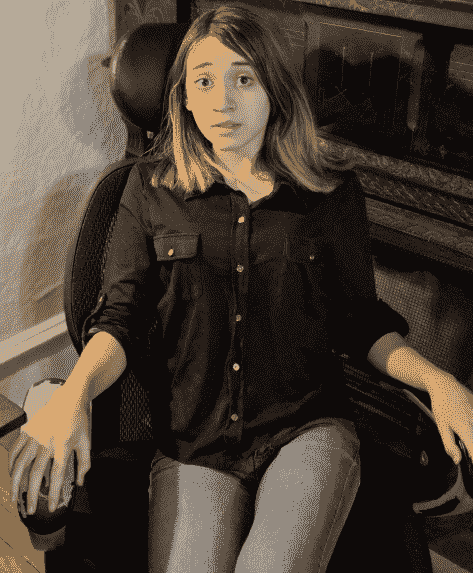

# 8
T5】我能看出你没说什么

> 学会变得有情商是我们的责任。这些都是技能，它们并不容易，大自然并没有给我们这些技能——我们必须学习它们。
> 
> -你好。保罗·艾克曼

当我写我的第一本书时，*社会工程:人类黑客的艺术* (Wiley，2010 年)，我对非语言的世界还比较陌生。但我已经和保罗·艾克曼博士建立了关系，并作为我的导师向他学习。保罗·艾克曼博士在 20 世纪 50 年代末开始了他了解非语言的旅程，在过去的 60 多年里，他一直领导着非语言交流的研究领域。

埃克曼博士不仅帮助我完善了我的工作，还帮助我改进了沟通方式。这引发了我的第二本书，《揭开社会工程师的面纱:安全的人类元素》(Wiley，2014)，该书深入研究了面部表情、肢体语言、手势和非语言的各个方面。我甚至涵盖了你看不到的非语言交流部分:杏仁核劫持。

如果你以前关注、阅读或听过我的任何作品，可能不难相信，当谈到埃克曼博士时，当我在他身边时，我的反应很像你在图 8-1 中看到的那样。

<figure>

<figcaption>

[**图 8-1**](#R_c08-fig-0001) 大多数人想象我见到艾克曼医生时的样子(离真相不远)。

图片来源:`[https://commons.wikimedia.org/wiki/File:Elvis_Presley_-_TV_Radio_Mirror,_March_1957_01.jpg](https://commons.wikimedia.org/wiki/File:Elvis_Presley_-_TV_Radio_Mirror,_March_1957_01.jpg)`

</figcaption>

</figure>

这一章我有几个目标。首先，我想确保我坚持埃克曼博士的高标准，确保我所说的一切都有研究支持。第二，我不想只是复制我以前的任何一本书，尤其是如果你已经读过其中一本或两本。在这本书里，我展示了一个关键领域的非语言，作为一名社会工程师，它可以真正改变你的生活:理解舒适和不舒适之间的基线变化。

在这一章中，我打破了你对某些肢体语言的任何先入为主的错误观念，并向你展示作为一名社会工程专业人员，你到底需要什么。 ## 非语言是必不可少的

在我开始本章的实质性内容之前，让我来帮你理解为什么理解非语言交流很重要。当然，最好的方法是讲一个故事。

当我与埃克曼博士合作*揭露这位社会工程师的时候，*他的职责是确保我所说的在科学上是准确的，有意义的，合乎逻辑的，并且通过他几十年的研究得到认可。

我写了一章关于镜像神经元的研究。这项研究基本上表明，研究人员认为大脑中有一组神经元的作用是反映他们从其他人那里看到的非语言。

根据埃克曼博士的研究，我们知道当我们感受到一种情绪时，我们会有一种不自觉的反应，这种反应通过微表情表现出来。此外，当我们做面部表情时，我们创造了附加在表情上的情感。

我认为，如果镜像神经元让我们反映某人的表情——伴随着情绪——我们就可以控制目标的情绪内容。

当我在写*揭露社会工程师*的时候，一场关于镜像神经元及其背后的研究的科学辩论正在进行。因此，埃克曼博士给我写了一封非常友好的电子邮件，他在邮件中说，“如果这项研究被撤销，你希望你的书中有过时或被推翻的研究吗？”

我回答说，“但是，但是，但是……我已经写了大概 40 页了。这一章五天后就要交了。”我希望埃克曼医生基本上会回答，“好吧，这很酷。”

相反，他说，“好吧，那么我想你有五天时间来阅读这个关于杏仁核的研究，并就此写一章。”就这样，我有了大约 60 页的信息，这些信息是我很难去研究、理解和写的。

当然，埃克曼医生给了我很大的帮助，但这也给我上了一三课。

*   如果我要真正帮助我的客户，了解事情是如何运作的是很重要的。
*   适应新的研究并随着新的研究成长是很重要的。
*   睡眠真的被低估了。

在写关于杏仁核劫持的那一章时，我再次看到了植入情感内容和控制目标反应之间的联系。如果杏仁核在大脑有机会“开启”之前处理情绪刺激，我可以让目标感到轻微的悲伤或恐惧，那么我就可以利用他们的移情反应。

换句话说，掌握借口的使用可以帮助我在我的主题中引出我想要的情绪；我能让他们感受到我想要的感觉。现在我们终于谈到了为什么理解非语言如此重要的问题。

当我要作为工作的一部分闯入一个地方，或者我要做一些观察时，我会感到一些非常强烈的恐惧:害怕失败，害怕被抓住，害怕搞砸。让我们检查一下我感受到的情绪。

恐惧在生理上是如何影响我的？

*   我的眼睛睁得大大的，眼睑紧绷。
*   我的嘴向后拉成“eek”的形状，我深呼吸。
*   当我准备战斗或逃跑时，我的肌肉会紧张并经常冻结。
*   我的心率加快了。
*   我的排汗量增加了。

现在，让我们讨论一下我的生理状态应该是怎样的，才能从我的目标那里引出想要的情绪反应(正如我前面提到的，要引起共鸣，应该是轻微的悲伤:

*   我的眼神很柔和，不紧张。
*   我的嘴唇在拐角处向下弯。
*   我低下头。
*   我的肌肉不紧张。
*   我的呼吸变得更浅。

你看出区别了吗？如果我的借口是使用悲伤的情绪，但我的身体语言显示恐惧，目标会发生什么？我猜大多数人永远不会想，“哇，这个人用了一个悲伤的故事，但却表现出恐惧。那是不协调的情感内容，让我感到不安。”然而，我们都有内在的雷达，它会告诉我们何时感觉(或应该感觉)想要举起盾牌，变得更有防御性。如果我表现出恐惧，但试图引起悲伤和同情，我的目标的雷达会抛出这个盾牌。

一项名为“同种情绪压力的化学感觉线索激活人类杏仁核”(`[www.ncbi.nlm.nih.gov/pmc/articles/PMC2713432](http://www.ncbi.nlm.nih.gov/pmc/articles/PMC2713432)`)的真正非凡的研究以一种……嗯……有趣的方式证明了这一点。

研究人员从锻炼过的人那里收集了汗垫。然后，他们从一群在 13，000 英尺高空进行双人跳伞的人身上收集了汗垫。然后，研究人员测试了一组受试者，将功能性核磁共振成像仪贴在他们的头上，让他们嗅每一个汗垫。(很恶心，但是真的。)

当这个测试组嗅从飞机上跳下来的那组人身上的汗垫时，受试者的恐惧中心，即杏仁核，被触发了。当受试者嗅运动组的垫子时，没有恐惧被触发。所以，古老的谚语“你能闻到恐惧”实际上是正确的。

既然我们知道其他人能感觉到我们的恐惧，让我们想想当我准备接近一个目标时我需要做什么。我有两个选择:

*   学会控制我的恐惧，这样我就能表现出适当的情绪。
*   如果这是不可能的，那就用我的自然情感找一个借口。

<aside>

* * *

## 想想这个

在 DEF CON 25 上，我们邀请了蒂姆·拉金作为我们的嘉宾参加我们的社会工程师播客的现场直播。蒂姆讲述了一个关于一名穆斯林妇女走向一群年轻男子的故事。男人们没有对女人说什么，但他们身上的某种东西让她感到不安。所以，她做了聪明的事，转身开始向另一个方向走去。

然而，她把耳塞留在了手机里，因此失去了优势。其中一个年轻人跑到她身后，冷不防从背后捅了她一下，把她打昏了。

这是一个悲伤而怪诞的故事，但它说明了我们的内部雷达是如何工作的，即使我们有时试图平息警告信号。我总是说*不要*忽视那个雷达——倾听它，因为它能拯救你的生命。 * * * </aside>

作为一名专业的社会工程师，理解这一点可以帮助你更好地把握你的情绪，知道你在展示什么，并学会如何使用、阅读情绪和这些情绪的非语言产品，然后做出适当的反应。

在我进入非语言的细节之前，你首先需要了解如何解释情感基线。 ## 你所有的基线都属于我们

能够读懂一个人的情感内容，才能真正提升你的沟通能力。我想关注观察基线的变化如何帮助专业的社会工程师。

让我首先定义一个基线。简单来说，就是你开始观察的那一瞬间，你看到被展示的情感内容。你没有去了解他们一生的底线。所以，深呼吸——我不是要你在每次测试前跟踪你的目标几个月或几年。

看[图 8-2](#c08-fig-0002) 。阿玛亚做了一些不太好的事情，她妈妈让她知道了。

<figure>

<figcaption>

[**图 8-2**](#R_c08-fig-0002) 这里你看到了什么基线？

</figcaption>

</figure>

你观察到了什么？在[图 8-2](#c08-fig-0002) 中，我的妻子 Areesa 的情感内容是什么？你看到紧绷的下巴了吗？尖手指和简洁的嘴唇？她在发出愤怒的信号。

阿玛亚呢？她的双臂交叉，下巴翘在空中，脸上流露出恼怒。她被封闭起来，没有真正倾听的心情。

现在请看图 8-3 来看看“讨论”结束，阿蕾莎和阿玛娅分道扬镳后的阿玛娅是什么样子。

 <figure>

<figcaption>

[**图 8-3**](#R_c08-fig-0003) 你在这里看到了什么变化？

</figcaption>

</figure>

阿玛亚看起来有点难过，自我安慰。也许她甚至在反思这场争论。

现在看[图 8-4](#c08-fig-0004) 。Amaya 和 Areesa 刚刚享受了一杯好茶，谈论了他们一天的购物乐趣。

<figure>

<figcaption>

[**图 8-4**](#R_c08-fig-0004) 这一条你看到了什么基线？

</figcaption>

</figure>

这里存在什么基线？两个人看起来都很开心。他们靠在一起，享受着交谈。

这三张照片展示了同一个人在不同环境下的不同基线。这是一个非常有价值的教训。基线不是一个人的性格定义。这不是心理侧写。它没有涵盖长期。基线仅仅是在特定时刻显示的情感内容。

作为一名社会工程师，在你接近一个人的时候，能够读懂他的情绪状态是至关重要的。如果你想成功，你接近目标的方法从[图 8-2](#c08-fig-0002) 到[图 8-4](#c08-fig-0004) 会有很大的不同。

很多次，我听人们说，他们可以被教会在几秒钟内分辨谎言和真相。

David Matsumoto 博士、Hyi Sung Hwang 博士、莉萨·斯金纳博士和 Mark Frank 博士写了一篇题为“评估真实性和检测欺骗”()的文章，其中他们提出了一个非常重要的观点:“不仅仅是行为的存在或不存在，如厌恶凝视或坐立不安，表明撒谎。相反，它是这些非语言线索如何随着时间的推移从一个人的基线发生变化，以及它们如何与个人的话语相结合。而且，当只考虑来自这些来源的行为线索时，它们可以准确地区分说谎和说真话。”

你清楚地理解他们的断言吗？没有什么神秘的说法总是表明谎言或真理。一个人的暗示如何随着时间的推移而变化，这表明了情绪的内容以及我们应该解读它的方式。

### 小心误解

人们经常对某些身体语言“告诉”持有一些先入为主的误解，在你走上这条路之前，你需要理解并消除这些误解。如果你不这样做，你最终会做出一些不好的假设。

下面我们一起来分析几个例子。看[图 8-5](#c08-fig-0005) 。你看到了什么？

 <figure>

<figcaption>

[**图 8-5**](#R_c08-fig-0005) 阿玛亚到底安不安？

</figcaption>

</figure>

多年来，人们一直被告知双臂交叉是封闭的明显标志。那不一定是真的。如果有人在我靠近的时候从打开的姿势变成关闭的姿势，那*可能*是真的，但是有些人习惯性地坐着或站着，就像双臂交叉，因为这样很舒服，而不是因为他们被关闭了。在[图 8-5](#c08-fig-0005) 的两侧，阿玛亚双臂交叉，但她的面部表情和头部位置表明了她感受到了哪种情绪。

现在看[图 8-6](#c08-fig-0006) 。

 <figure>

<figcaption>

[**图 8-6**](#R_c08-fig-0006)

</figcaption>

</figure>

在这张静止的照片中你看不到它，但是阿玛亚的腿以每分钟 500 次的速度跳动。这是欺骗即将发生的征兆吗？或者也许她不舒服？很难说。有的人就是腿忙或者动的多。同样，注意像这样的运动何时开始，观察它开始或停止的频率，以弄清楚它意味着什么。请看[图 8-6](#c08-fig-0006) 中的全图:阿玛亚的体位，她的腿弹起，她的手放在脖子后面。当你考虑所有因素时，你可能会认为阿玛亚看起来不舒服。

我儿子科林的腿就像一台永动机。我一直在想，如果我们能把它连接到发电机上，我们就能为我们的家发电了。他不是骗人的；他只是经常搬家。以下是我如何运用关于科林习惯的知识的一个例子:

我说，“嘿，科林，那天晚上的派对怎么样？玩得开心吗？”

科林用他的腿在地上钻了一个洞，他会说，“是的，还好。没什么过分的。”

现在，在这种情况下，我知道有一个与斯图尔特的斗争，我想得到细节。我会说，“哦，酷。谁又在那里？”

科林列出了那里所有的人，但他漏掉了斯图尔特。嗯。我回答说:“哦，那么斯图尔特不在那里？我以为他要走了。”

现在科林的腿突然停了下来，“是的，他也在那儿，”他说，这时他的腿又开始动了。

“哦。斯图尔特一切都好吗？”我问。

科林的腿已经牢牢地扎在了地上，他说:“是的，很好。”这一次，在科林再次开始移动他的腿之前有一个停顿。

出现问题的标志不是科林的腿在动，而是它停了下来。从那时起，几秒钟后我就知道了整个故事。

<aside>

* * *

# 亲提示

不要写你让你的孩子说话的方法，直到他们长大，或者你不再使用这些策略。在我们家，这就像一场持续的斗智斗勇，看谁会赢。到目前为止，我遥遥领先。如果要计分的话，我会说现在是父母:5981387 对孩子:5。

**附:我女儿不同意这个分数，说数字颠倒了。**

* * *

</aside>

现在看一下[图 8-7](#c08-fig-0007) ，看看你能解读出什么。

<figure>

<figcaption>

[**图 8-7**](#R_c08-fig-0007) 这是舒适还是不适？

</figcaption>

</figure>

搓脸、抓挠或其他类型的操作可能是不舒服的迹象，但有时人们只是脸上发痒。注意它开始的时间和原因。

我也可以用我的儿子科林来举这个例子。他患有哮喘和过敏症。有很多次他全身皮肤发痒。花粉季节的时候，科林总是在摸或挠他的脸。在这种情况下，坐立不安不是因为科林说谎，而是因为他的过敏。

如果我们陷入这些误解，我们可能会陷入一个陷阱，在不存在的地方赋予情感内容。这可能很危险，因为你可能会开始对不存在的情绪做出反应。你不希望当某人只是冷的时候就把他当成是封闭的，或者当他的行为是过敏的结果时，就认为他是在骗人。

克服这一错误的最好方法是不使用先入为主的判断来处理每一种情况，即使你正在处理一个你以前接触过的目标。把你的判断留到最初的 15 到 20 秒后。

当谈到身体语言时，我试着关注基线的变化，然后寻找表明舒适与不适的变化。在*揭开社会工程师的面纱中，*我写了大量关于面部表情和肢体语言的内容，所以如果你想了解更多关于这个主题的内容，你可以去看看那本书。

对于这本书，我想给你一些理解舒适和不舒适之间区别的基础知识。一旦你清楚地掌握了这些指标的样子，你就会有一张地图，告诉你要寻找什么，以及如何解读你所看到的。 ### 了解基本规则

这一部分包括了四条你在阅读肢体语言时要记住的好规则。如果你运用这些方法，你会发现在阅读和理解肢体语言上有很大的不同。

这些规则并不意味着你必须做 1 + 2 + 3 + 4 这种意义上的“数学”，但如果你想掌握非语言阅读，它们都必须做。

#### 规则 1:关注“是什么”——而不是*为什么*

这条规则很简单:在没有所有信息的情况下，不要在“是什么”和“为什么”之间建立联系。

我经常以帮助学生记住一件事来开始我的非语言训练日:“仅仅因为你能看到*什么*并不意味着你知道*为什么*

想想这个:当我对着全班同学说话的时候，当我和你目光接触的时候，我说了些什么。我注意到你双臂交叉，眉毛下垂，眼睛睁着，下巴绷紧。我注意到你的手臂和手很紧张。所有这些迹象都指向愤怒或不适。

我可以假设你对我或我说的话感到生气或不舒服。然而，也许你只是对去年手术后的疼痛有所反应。或者你的胃抽筋让你生气了。或者也许你根本没有注意，你想到了让你生气的事情。

不管你身体语言的原因是什么，我如何把*什么*和*为什么*联系起来？正如我在[第 7 章](07.html)“构建你的艺术作品”中讨论的，这都是关于问题的。在课堂上，我停下我的课来询问你为什么看起来很生气是不合适的。 #### *规则 2:检查集群*

当你开始练习与目标接触时，很容易看到一个特定的肢体语言动作或面部表情，并认为你可以理解正在交流的内容。然而，专注于一个线索是危险的。你需要上下文和其他肢体语言暗示来表明真正在说什么。寻找匹配的非语言群，这些非语言群表明了所表达的情感。

考虑这个场景:你正在和你的配偶谈话，告诉他们你不同意一个决定。当你陈述你的观点时，你的配偶双臂交叉。这是否自动意味着他们被关闭，生气，或不喜欢他们听到的？

扩展一下你的视野。你在配偶的脸上看到愤怒了吗？你是否看到他们的臀部和脚的位置发生了变化，所以他们现在指向远离你的方向？还有哪些情感“群”可以帮助你确定抱臂是一个孤立的动作还是一个更大的情感信号的一部分？ #### 规则 3:寻找一致性

寻找语言和非语言交流的一致性。如果有人摇头*否*但是说*是*，这两个指标告诉你事情并不全等。

当你发现你对某人的信息缺乏一致性时，依靠非语言信息来表明真正在说什么。检查非言语交际群，寻找非言语交际和言语交际之间缺乏一致性的地方。将帮助你非常接近准确地阅读目标告诉你什么。 #### 规则 4:注意上下文

比方说，我从办公室的窗户往外看，看到我的女儿坐在外面。她把自己变小了，几乎坐在一个球里。她的双臂交叉在胸前，下巴向下。她的头低低地藏在双臂中。所有这些都是悲伤和不适的迹象。

我没有告诉你的是，外面只有华氏 35 度，而且她没有穿合适的夹克。

在上下文中，你理解阿玛亚是冷的。没有关于温度的上下文细节，她看起来很悲伤和不舒服。为了避免误读非语言，你必须了解你的目标所处的情境。

除了这四条规则之外，在我详细介绍每种情绪之前，你还需要知道一些基本的肢体语言。 ## 了解非语言的基本知识

当你开始走非语言的道路时，你应该明白一些基本的事情。这些基本特征适用于所有人，并不局限于特定的文化、性别、种族或宗教。理解这些基础知识将有助于你理解我们的身体是如何准确传达我们的感受的，而不管我们试图展示什么。

外部刺激通过我们的五个模态进入我们的大脑，假设其中一个没有受损:视觉、嗅觉、味觉、触觉和听觉。这些刺激由我们的大脑处理，刺激可以引发七种基本情绪之一:愤怒、恐惧、惊讶、厌恶、蔑视、悲伤或快乐。被触发的情绪会在我们的面部和身体上产生生理反应。

例如，根据研究人员 R. S. Minvaleev、A. D. Nozdrachev、V. V. Kir'yanova 和 A. I. Ivanov 题为“姿势对健康受试者激素水平的影响”的研究，当一个人自信时，他们会让自己变得更大，这提高了血液中的睾酮水平，降低了皮质醇水平。([https://link . springer . com/article/10.1023/B:hump . 0000036341.80214 . 28](https://link.springer.com/article/10.1023/B:HUMP.0000036341.80214.28))。研究人员想测试某些瑜伽姿势是否会增加或减少皮质醇、睾酮、脱氢表雄酮(DHEA)和醛固酮。出于我们的目的，让我们把注意力集中在皮质醇和睾丸激素上。

研究人员发现，仅仅通过保持与自信行为相关的特定姿势，一个人的睾丸激素就增加了 16%以上，皮质醇下降了 11%。巧合的是，已知睾丸激素会增加自信者的行为。因此，几乎作为一个自我实现的预言，看起来保持自信的姿势会释放化学物质，帮助你感觉和行动更加自信。

<aside>

* * *

# 注意

皮质醇是一种调节体内多种过程的激素，包括新陈代谢和免疫反应。皮质醇通常被称为“压力荷尔蒙”，因为它与身体对压力的反应有关。研究人员发现，高水平的皮质醇与焦虑和抑郁有关。

 * * * </aside>

本质上，对你来说，重要的是要理解:基于舒适的非语言似乎有助于产生快乐、自信和强烈的化学和生理反应，而基于不适的非语言会产生压力、焦虑和基于负面情绪的反应。

理解某些非语言如何影响你和你的目标是很重要的。作为一名专业的社会工程师，你正在影响或操纵你的目标的情感内容。不要掉以轻心。

因为你的借口对目标的影响可能是短期的，也可能是长期的，所以仔细计划你的借口是很重要的。记住这句格言:让他们因为遇见你而感觉更好。只要有可能，试着使用那些不会对你的目标产生长期破坏性影响的借口。

你如何确定你选择的借口是否会产生长期的负面影响？试着确定你的借口是基于什么样的情绪。恐惧、愤怒、厌恶和蔑视是如此强烈的负面情绪，以至于你冒着更大的风险，让目标因为遇见你而受到伤害。

例如，在一个网络钓鱼网站中有一个区别，它说:“感谢您最近订购了这台 55 英寸的电视，”另一个说:“您的帐户已被黑客攻击，您的银行帐户已被清空。”

理解非语言和情绪可以深刻地影响目标，这将帮助你决定如何在你的社会工程演出中使用这些情绪。为此，我从埃克曼博士那里学到的最深刻的一课是，情绪不仅会引发非语言的反应，而且如果你把非语言强加给自己，你也会引发情绪。这一概念得到了众多研究人员的支持，包括一项名为“抑制和促进人类微笑的条件:面部反馈假说的非侵入性测试”(`[www.ncbi.nlm.nih.gov/pubmed/3379579](http://www.ncbi.nlm.nih.gov/pubmed/3379579)`)的研究。研究人员斯特拉克、马丁和斯蒂芬测试了埃克曼博士在 20 世纪 70 年代和 80 年代提出的假设，结果表明，如果你创造了表情，你就能引发情绪。他们通过要求受试者将一支笔放在嘴里来触发肌肉的运动来模拟微笑。他们能够证明埃克曼博士在他的研究中陈述的同一件事:创造面部表情(即使是通过暴力)会创造与之相关的情感。

要记住的关键点是，如果你创造了一种情绪，或者你让目标表达了这种情绪，你就可以让目标感受到这种情绪。使用这种超能力时，你必须小心谨慎。 ## 舒适与不适

学会如何有效地交流是很重要的，而交流的一部分是非语言的。有一些研究人员开发了关于我们所说的有多少是非语言的统计数据。我听过 80%，85%，甚至 90%，但我从埃克曼博士那里学到的一件事是，尽管我们都同意很大一部分沟通是非语言的，但沟通的方法(口语，书面，面对面)会影响非语言的使用方式。

在正常交流中，我们的身体和面部所表现出来的东西可能会让那些能够识别出所表现出的情绪的人不知所措。在正常的交流中，一个人的身体和面部会表现出无数的情绪，试图解释这些情绪会让人不知所措。出于这个原因，当你第一次开始做社会工程师时，最好把注意力放在最容易解释的非语言上:舒适和不舒适。

为了这本书，我尝试了一些我在其他书中没有尝试过的东西。我从情绪的角度来讨论这个话题，然后讨论你，作为一个社会工程师，是否想要在你的目标中引发这种情绪。我解释了如何寻找能表明与那种情绪相关的舒适或不舒适表现的迹象。我把这一部分按每种情绪来划分，并描述了面部和身体中的一些情绪指标。这并不意味着是每一个动作的详尽清单，但它为你提供了一个基础，当你练习并开始掌握这项技能时，你可以在此基础上更进一步。

除了学习这一部分来了解如何阅读他人的肢体语言，你还应该利用这些信息来了解你的肢体语言如何影响你的目标。如果你表现出我在这一节中描述的情绪，那么你就可以在其他人身上引发这些情绪。决定你想要引发什么样的情绪，然后练习这些情绪的非语言表达。也要学会识别你不想在别人身上引发的情绪和触发因素。

### 愤怒

愤怒是一种强烈的情绪，被称为门户情绪。这意味着，很多时候，愤怒会导致其他情绪、感觉或行为。这些行为可能包括使用咒骂或愤怒的语言，并逐步升级到表现出暴力行为。

从生理上来说，愤怒让我们紧张，紧绷，准备战斗或防御。肌肉紧张，下巴绷紧，这个人可能会握紧拳头——所有这些都是为战斗或防御做准备。随着这个人越来越接近采取暴力行动，你甚至可以看到他们的下巴更低，以保护脖子。

尽管事情很紧张，你可能会注意到一个正在经历愤怒的人试图让自己变大。例如，一个愤怒的人可能会扩胸、挺胸、展姿。此外，他们的呼吸加深，心率加快。

生气的人有以下面部特征:

*   眉头会皱，但眼睛不会斜视。他们睁得大大的。
*   下巴绷紧。
*   牙齿紧咬，或者，如果嘴张开，这个人通常不会说令人愉快的事情。

你可以在[图 8-8](#c08-fig-0008) 中看到所有这些。

<figure>

<figcaption>

[**图 8-8**](#R_c08-fig-0008) 愤怒的脸

</figcaption>

</figure>

愤怒也可以表现在身体的其他部位。[图 8-9](#c08-fig-0009) 显示了我紧咬的下巴和紧握的拳头。此外，我的胸部是膨化的，让我看起来更大。所有这些都指向愤怒。(仅供参考:我会把这张照片交给任何对阿玛亚感兴趣的男孩。)如果你在接近一个人时注意到这些迹象，最好避开那个人。

<figure>

<figcaption>

[**图 8-9**](#R_c08-fig-0009) 体内的愤怒

</figcaption>

</figure>

图 8-10 显示了愤怒的另一个版本，其中阿玛亚表现出微妙的愤怒。她怒目而视、紧咬的下巴和微微皱起的眉头都是愤怒的迹象。

<figure>

<figcaption>

[**图 8-10**](#R_c08-fig-0010) 微妙的愤怒

</figcaption>

</figure>

最有可能的是，你会发现愤怒是一种不舒服的非言语行为。这是我特别不喜欢在我的目标中引出的一点。因此，我留意这种情绪的迹象，并尽量不在我的约会中使用它。

很多时候，如果我的方法过于激进，或者我的借口过于消极，我就能捕捉到愤怒的迹象。这是一个很好的警告信号，让我的声音或肢体语言变得柔和，以减轻目标的愤怒情绪。 ### 厌恶

厌恶也是一种非常强烈的情绪。对一个人、一个地方或一件事感到厌恶。通常，一些让我们产生强烈厌恶反应的东西会在我们接触后很长一段时间内一直伴随着我们。

当我还是个小男孩的时候，我的父母养鸡。我很想跑到鸡舍，抓几个新鲜鸡蛋，做我聪明地称之为“鸡蛋面包”它只是一片放在平底锅里的涂了黄油的面包，中间放一个鸡蛋。

一天，我抓起我的鸡蛋，在我超热的铸铁锅里敲开了它。出来的不是新鲜的鸡蛋而是半成型的小鸡。当它碰到锅的时候，它开始扑腾着死去。这景象和气味让我呕吐到水池里。因为我太恶心了，我忘了关炉子，所以这个可怜的东西烤着吃，烤鸡的味道充满了厨房。

所引发的厌恶情绪是如此强烈，以至于即使在十年后，一个煮蛋的味道也会让我瞬间感到恶心。最终，我确实克服了这一点，但厌恶是如此强烈的情绪，如果你在你的目标中触发了它，你可能无法恢复。

想一想那些会在你的目标身上引发厌恶情绪的事情:体味、身体机能、你脸上或牙齿上的食物、脏话、用词等等。在你接近之前，仔细分析你的方法和你自己是很重要的，这样你就不会让你的目标感到厌恶。

厌恶有几种不同的表现方式。在脸上，是双侧表情，意思是脸的两侧表现出相同的表情，如图[图 8-11](#c08-fig-0011) 所示。

<figure>

<figcaption>

[**图 8-11**](#R_c08-fig-0011) 厌恶

</figcaption>

</figure>

当我们在为拍照做准备时，我的狗在客厅里做了一些令人讨厌的事情。我不能错过这个机会，我抓拍到了 Areesa 打扫卫生的照片。注意她的鼻子两侧是如何凸起的，这阻碍了嗅觉和视线。本质上，她在生理上阻挡了引起她厌恶的事物。

在身体上，一个人通过阻挡或远离你来表现厌恶。寻找缺乏兴趣或排斥的迹象。

注意图 8-12 中[Amaya 的腿部位置。她的兴趣在哪里？肯定不是她爸爸的(虽然这让我很难过)。虽然她没有表现出真正厌恶的强烈迹象，但她的肢体语言显示出不适和不感兴趣的迹象。](#c08-fig-0012)

<figure>

<figcaption>

[**图 8-12**](#R_c08-fig-0012) 无兴趣

</figcaption>

</figure>

因为厌恶是一种如此强烈的负面情绪，我倾向于在约会中不使用它。然而，有人问我，用它来创造一个对同一件事感到厌恶的人的部落。虽然这可以工作，而且非常强大，但如果处理不当，也会导致一些危险的结果。 ### 轻蔑

鄙视是一种独特的情绪。《牛津英语词典》对轻蔑的定义是，“觉得一个人毫无价值的感觉。”埃克曼博士给出了一个更简单的定义，他说蔑视是一种道德优越感。

根据埃克曼博士对蔑视的定义，它只能对一个人产生，而且是唯一的单边表达，这意味着它只表现在脸的一侧。起初，蔑视可能表现为假笑，甚至是微笑的开始，如图 8-13 所示。

 <figure>

<figcaption>

[**图 8-13**](#R_c08-fig-0013) 轻蔑可以和幸福混为一谈。

</figcaption>

</figure>

轻蔑的特征是脸的一侧抬高——例如，嘴角只向一侧抬高，如图[图 8-13](#c08-fig-0013) 。这种伴随着下巴抬高的现象并不少见，即使只是轻微的。

因为蔑视是一种比另一个人优越的感觉，而且常常是愤怒的来源，你可能会看到以下几种蔑视的肢体语言:

*   感觉比另一个人优越会让人感到自信。自信的感觉可以通过多种方式表现出来，但通常，这个人会通过让自己变大来占据更多的空间。
*   如果轻蔑导致了愤怒，你可能会看到和我在上一节描述的一样的肢体语言。然而，在这些愤怒的非语言表达完全展现出来之前，你可能会注意到下巴收紧，以及更具攻击性的姿势。

在我看来，蔑视在专业的社会工程参与中几乎没有用处。我可以看到一个民族国家可能如何利用它，我也看到恐怖组织如何利用它来招募人员，然后让人们转向他们的事业，但对于大多数标准的社会工程参与来说，它不会导致理想的结果。

<aside>

* * *

# 注意

恐怖组织通常会利用人们对政府或某些意识形态的愤怒，并通过助长这种愤怒而将其转化为蔑视。一旦目标对愤怒的对象感到蔑视，或者在道德上高人一等，恐怖组织就会给他们提供可以采取的“解决方案”或“行动”。这是令人难以置信的分裂，但它的效果惊人地好。

* * *

</aside> ### 害怕

恐惧有很多目的，比如它提醒我们注意危险，但是当被控制时，它也能令人兴奋和愉快。有些人甚至喜欢害怕或感到恐惧。

对失望的恐惧，对失败的恐惧，或者对做出错误决定的恐惧对一个专业的社会工程师来说是有用的，但是我通常会避开恐惧的更强的用途。真正威胁或恐吓一个人的借口——比如那些导致他们担心自己的工作、生活或家庭的借口——会引发如此强烈的情绪，以至于当他们发现自己被测试时，他们可能会感到厌恶或蔑视，然后是愤怒。

恐惧有一些明显的生理特征:

*   眼睛睁得大大的，可以看到整个场景。
*   身体紧张，通常会听到喘息声。
*   嘴是张开的，嘴唇向后拉向耳朵，好像这个人在说“eek”

你可以在[图 8-14](#c08-fig-0014) 中看到这些特征。

<figure>

<figcaption>

[**图 8-14**](#R_c08-fig-0014) 经典的恐惧表情

</figcaption>

</figure>

在身体里，恐惧有类似于面部表情的表现。身体向后拉，紧张，冻结，准备战斗或逃跑。如果你惊吓了你的目标，你可能会看到这个人的反应如图 8-15 所示。

 <figure>

<figcaption>

[**图 8-15**](#R_c08-fig-0015) 惊惧于肢体语言

</figcaption>

</figure>

注意阿玛亚是如何全身紧张地向后摇晃的。她的嘴处于“eek”的位置。这种类型的恐惧可能会很强烈，因为她没有逃离的物理方法。她被困在椅子里。

[图 8-16](#c08-fig-0016) 显示了女性展示时我们在恐惧中看到的另一个方面——遮盖胸骨上切迹。

<figure>

<figcaption>

[**图 8-16**](#R_c08-fig-0016) 遮住胸骨上切迹表示恐惧。

</figcaption>

</figure>

观察微妙的肢体语言迹象，它可以提示你目标可能的感受。如果你看到了恐惧的迹象，你就可以决定这种恐惧是否恰当，以及你愿意在多大程度上使用它。正如我之前提到的，作为一名专业的社会工程师，我使用恐惧，但我避开了那种会让目标感到受到威胁或处于危险之中的恐惧。 ### 惊喜

惊讶经常与恐惧混淆，因为它们看起来非常相似。惊讶地睁大眼睛，就像害怕一样。身体通常会冻结，嘴也会张开。但是嘴巴张开的形状不像“eek ”,而更像“OHHHHH”。在[图 8-17](#c08-fig-0017) 中可以看到这一点。

<figure>

<figcaption>

[**图 8-17**](#R_c08-fig-0017) 惊喜，这往往会被误解为恐惧

</figcaption>

</figure>

惊讶对于专业的社会工程师来说是有用的，但是，正如我提到的其他一些情绪一样，这取决于你如何使用它。我不建议躲在壁橱里，然后跳出来给你的目标一个惊喜，但是一次突击检查、访问或奖励可能会引起正确的反应。在一次约会中，这仅仅是一次视觉上的约会，我使用了一个惊喜奖励来获得一些惊人的结果。电话是这样的:

| **目标:** | 你好，我是贝丝。我怎么帮你？ |
| **我:** | 贝丝，我是人力资源部的保罗。我有好消息。你可能没听说，我们让你的部门参加了一个全新 iPhone 的抽奖，你的名字被选中了！ |
| **目标:** | 来啊！你开玩笑吧！太神奇了！ |
| **我:** | 我知道。我喜欢这些电话。我们要捐出 10 英镑，这些电话非常有趣。 |
| **目标:** | 是啊，我从来没赢过任何东西。太神奇了！ |
| **我:** | 如你所知，我们在 XYZ 这里有几个贝丝，所以我需要和你核实一些细节，以确保我有正确的贝丝。你能为我拼写你的全名吗？ |
| **目标:** | *E-l-I-z-a-b-E-t-h S-m-a-r-S-t-o-n*。 |
| **我:** | 太好了。我需要你的员工 ID 来输入系统。 |
| **目标:** | T238712P。 |
| **我:** | 好吧，你是正确的贝丝。现在我需要你去一个网站，在那里你会被要求用你的域名证书登录，你会告诉网站你想把手机运到哪里，等等。去 iphone.company-website.com。*【这是一个我们建立的网站，什么也没做；所有的按钮都不起作用。]* |
| **目标:** | 好了，网站出现了。我看到了我们的徽标，但是当我单击 Enter 按钮时，没有任何反应。我该怎么办？ |
| **我:** | 嗯，我现在就去办。当你点击进入，它不去另一个屏幕？我现在看到另一个屏幕。 |
| **目标:** | 不。我正在尝试不同的浏览器。尝试了她所有的浏览器。] 数字；我赢得了一些东西，但却不能去认领。 |
| **我:** | 不，我们不会容忍的。听着，我会帮你认领的。你想要我输入你的信息吗？ |
| **目标:** | 真的吗？你会这么做吗？ |
| **我:** | 当然，我会的。*【心虚如蛇。它在问你的全名，我有…"*【我一边说每个字母，一边假装打字。]* 好了，下一个击球。它需要您的员工 ID—您已经给了我，所以我现在就输入。* |
| **目标:** | 非常感谢。这太酷了。 |
| **我:** | 好吧。它想要你的域名登录，我假设只是 E.Smarston？ |
| **目标:** | 不，实际上我把它命名为贝斯·斯马斯顿 |
| **我:** | 好极了。现在我最不需要的就是你的密码。 |
| **目标** | *【没有停顿一秒】*:我对长密码很在行。是“JustinandBeth99”！ |
| **我:** | 太好了，成功了。它说，你会在 24 小时内收到一封电子邮件，进一步说明如何认领手机。恭喜你，贝丝！ |
| **目标:** | 非常感谢！ |

至此，我们对网络有了一个全面的妥协。是的——对于所有正在准备你的恐吓信的人来说——这是一种操纵，是一种借口，当目标后来发现这件事时，她会感到有点不安。但是，记住，我没有威胁她；我没有为难她；我没有伤害她。我用一个惊喜来引发一种基于快乐的情绪，这导致她不假思索地给我各种信息。

从肢体语言的角度来看，你可能会注意到一些表示惊讶的事情。如图 8-18 和图 8-19 中的[所示。](#c08-fig-0018)

 <figure>

<figcaption>

[**图 8-18**](#R_c08-fig-0018) 惊喜可能会使人身体后倾，面部表情凸起。

</figcaption>

</figure>

<figure>

<figcaption>

[**图 8-19**](#R_c08-fig-0019) 震惊，一种惊讶的形式，可能是由一个人捂着嘴表示的。

</figcaption>

</figure>

在我看来，对于一个专业的社会工程师来说，惊讶是一种很好的情绪。通过适当的计划和执行，它可以为你带来巨大的胜利。 ### 悲哀

悲伤是一种非常复杂的情绪。它也有很大的范围，因为它可以从轻微的忧郁到彻底的绝望。作为一名社会工程师，有几种方法可以利用悲伤:

*   注意到目标的悲伤，然后用这种情绪引发反应
*   创造一个最有可能让目标感到悲伤的情境，让他们按照你希望的方式做出反应
*   用你自己的非语言表达悲伤，以引起共鸣

这些方法中的一些采用了比其他方法更具操作性的方法。这完全取决于你如何利用这些情绪，以及你利用这些情绪的人的最终情绪状态。

悲伤有几个面部指标，在[图 8-20](#c08-fig-0020) 中演示。

<figure>

<figcaption>

[**图 8-20**](#R_c08-fig-0020) 悲伤的五官

</figcaption>

</figure>

在脸上，悲伤表现为

*   嘴角向下弯
*   眼睑下垂
*   眉毛的角聚在一起并向上翘

在一些悲伤的极端情况下，你可以从脸的一部分读出情绪。

悲伤也可以通过一个人的身体来传达。悲伤让我们想要保护，安慰，变得更渺小——这是自信的相反反应。

图 8-21 、[图 8-22](#c08-fig-0022) 和[图 8-23](#c08-fig-0023) 中显示了一些自我安慰的非语言展示的例子。

<figure>

<figcaption>

[**图 8-21**](#R_c08-fig-0021) 自我安慰拥抱

</figcaption>

</figure>

<figure>

<figcaption>

[**图 8-22**](#R_c08-fig-0022) 目堵

</figcaption>

</figure>

<figure>

<figcaption>

[**图 8-23**](#R_c08-fig-0023) 瘫身语

</figcaption>

</figure>

这是一个简短的列表，但你得到的想法。这些非语言可以帮助你看出这个人确实感到不舒服。

悲伤，就其复杂性而言，对社会工程师来说非常有用——无论是在学习如何解读它还是展示它的过程中。然而，我警告你如何使用这种情绪，以及在你的借口中使用到什么程度。

我从来不想让我的目标带着巨大的悲伤或悲痛离开，但是使用适当程度的悲伤可以引起强烈的共鸣。在豪尔赫·a·巴拉扎和保罗·j·扎克进行的一项题为“对陌生人的移情引发催产素释放和随后的慷慨”的研究中，研究人员表明，当移情被触发时，催产素释放增加了 47%，即使是在完全陌生的人之间，而悲伤会导致大脑中缺乏血清素、多巴胺和催产素。作为一名专业人士，我试图坚持悲伤的同理心一面，而不是焦虑、悲伤或抑郁的一面。

想想这种策略在市场营销和慈善活动中使用了多少次。从无家可归的孩子到受虐待的动物，目标是引发同情的反应，鼓励你更容易地决定放弃你的钱。这并不意味着这些组织不诚实或具有操纵性——他们只是知道我们的大脑是如何工作的，这有助于他们实现目标。 ### 快乐

我们都同意，快乐是一种对所有人类交往都非常有用的情感。当我们感到快乐、满足、平静或放松时，我们更容易做出利他的决定。我们倾向于喜欢让我们产生这种情绪的人、地方或事物。

由于这个原因，很容易看出，作为一名社会工程师，快乐是一种你想通过阅读和激发来掌握的情绪。第一件能真正帮助你发现你是否做得很好并创造了快乐的事情是学会辨别真实微笑和假笑的区别。区分真笑和假笑的一点是眼轮匝肌的激活。当被触发时，这块肌肉会抬高你的脸颊，在眼睛周围形成我们所说的“鱼尾纹”。

19 世纪中期，一位名叫纪尧姆·杜兴的法国研究人员提出，真正的微笑是可以伪装的。他当时正在研究神经科学，使用了一种侵入性很强的电击疗法。他实施电击来刺激肌肉运动。

由于涉及到疼痛，杜兴没有在这项研究中走得太远，但他对情绪如何通过面部表情表现出来的研究表明，面部是情绪的路线图。大约在 1855 年，他开发了一种使用电击刺激来触发肌肉反应的方法，他在《人类生理学杂志》上写下了他的发现。结果就是你在[图 8-24](#c08-fig-0024) 中看到的。

 <figure>

<figcaption>

[**图 8-24**](#R_c08-fig-0024) 一个假真实的笑容

图片来源`[HTTPS://PUBLICDOMAINREVIEW.ORG/COLLECTIONS/THE-MECHANISM-OF-HUMAN-PHYSIOGNOMY](https://publicdomainreview.org/collections/the-mechanism-of-human-physiognomy)`来自人体生理机制

</figcaption>

</figure>

阅读这项研究可以帮助你理解为什么快乐会产生被称为微笑的面部表情。但作为一名专业的社会工程师，你需要学会识别其他快乐的身体语言指标。

一个人的肢体语言是如何表现快乐的情绪的？如果快乐释放强烈的神经化学物质，创造自信的环境，那么我们也可以期待看到某些身体表情。寻找如图[图 8-25](#c08-fig-0025) 、[图 8-26](#c08-fig-0026) 和[图 8-27](#c08-fig-0027) 所示的身体姿势。

 <figure>

<figcaption>

[**图 8-25**](#R_c08-fig-0025) 注意张开、自信的手臂姿势。

</figcaption>

</figure>

<figure>

<figcaption>

[**图 8-26**](#R_c08-fig-0026) 打开腹侧显示器表示信任和幸福。

</figcaption>

</figure>

<figure>

<figcaption>

[**图 8-27**](#R_c08-fig-0027)

</figcaption>

</figure>

<aside>

* * *

# 注意

腹侧是动物的下侧——或易受攻击的一侧。对人类来说，这意味着我们的手腕、颈静脉和我们身体上自然会保护免受攻击的部位。

* * *

</aside>

在面部，除了嘴巴形成闭合或张开的微笑之外，我们还寻找眼睛参与微笑(见[图 8-28](#c08-fig-0028) )。很多时候，感到快乐的人也倾向于他们快乐的对象。

<figure>

<figcaption>

[**图 8-28**](#R_c08-fig-0028)

</figcaption>

</figure>

快乐的其他标志可能包括像抬起脚趾或在脚掌上弹跳这样的事情。当人们感觉自信或良好时，他们往往会让自己变得更大或更有活力。

作为一名职业社会工程师，快乐是我经常使用的情绪之一。迎合一个人的自我是创造快乐的一个好方法，这可以导致一个情绪化的决定。然而，要做到这一点，自我诉求必须是现实的、可信的，并且与你当时建立的融洽程度相称。

我发现，如果这符合我的借口，带着开放的腹部展示和温暖的微笑以及适当的头部倾斜接近目标，可以让目标对我感到舒服。

在你的社会工程借口中寻找创造快乐环境的方法，你会得到好结果的回报。 ## 摘要

非语言是一个复杂而庞大的话题，我意识到在相对较短的一章中无法涵盖。正如我在开始时提到的，我希望通过对这些信息的高层次概述，您可以带着一些不同的东西离开您的军火库。理解情绪是如何运作的，会让你受益匪浅。你对某人不用语言说的话了解得越多，就能帮助你更清楚地理解他们的交流。以下是我希望你能从本章中学到的主要观点:

*   **基础工具**作为起点，本章可以帮助你了解在每种情绪的面部和身体中寻找什么微妙的东西。
*   我希望你能更好地了解哪些情绪会对你有用，以及如何不仅在别人身上看到这些情绪，而且在自己身上表现出来。
*   **防御**理解情绪是如何通过面部表情和肢体语言传达的，作为一种防御机制，也会对你很有帮助。意识到这些情绪是如何被利用的，会让你更清楚它们是如何被用来对付你的。
*   作为一名专业的社会工程师，不断学习和提高自己的技能是非常重要的。

我想再告诉你一个关于社会工程的故事，它可能有助于巩固本章的观点。在一次 DEF CON 中，我与一名员工进行了互动，这让我明白了时刻注意非语言行为是多么重要。

对我和我的团队来说，会议总是很忙。我觉得在那五天里，我很少有休息的时间，甚至很少有几分钟属于自己的时间。我只是打开开关，让它留在那里，让我从人群中汲取能量和积极的情绪。

这对我很强大，但也能让我意识不到别人的感受。我跑来跑去，大声下达命令，确保事情得到处理。在一次会议上，我给一些员工下了几个命令，让他们收拾东西。这是我们的最后一天，我们匆忙地把一切都整理好，这样我们就可以出去在我们最喜欢的寿司店吃最后一顿团队晚餐。

事情进展顺利；一切都运行得 100%完美。我们需要做闭幕式，然后我们终于可以减压了。我试图更多地意识到别人的情绪，我注意到一个人的脸上不仅显示出疲劳，还显示出彻底的疲惫。另一个人表达了一些严重的痛苦。

对第一个人，我说，“嘿，如果你真的累了，你知道你可以要求退出这一部分——你不需要来结束。”

“什么？*真的*？我可以选择退出？”他十分惊讶地问道。

“是啊，兄弟——我只是觉得这是理所当然的。抱歉之前没提。”

“我不知道我们可以选择退出。我认为这是强制性的，”他说。

“嗯，这只对米歇尔是强制性的。其余的——你可以选择退出。”

然后，我的员工大大松了一口气。

当我接近下一个人的时候，我需要小心翼翼。我不能叫她出来而不在别人面前制造问题。我在她身上读到的情绪是悲伤、愤怒和恐惧的混合。

我私下接近她，把她从人群中拉开，问她是否还好。我不会详细描述互动，但有很多眼泪。她感到有压力，因为她觉得事情被忽略了。由于没有休息时间，她压力很大。

因此，我学到了新的一课。在会议的最后一天，我特别注意观察和关注我团队的情绪。然而，我意识到我应该在整个五天的会议中使用这种技能，在我们达到那种压力水平之前就注意到问题。

让我把这个故事应用到社会工程中:要善于观察，但不仅仅是在参与过程中。寻找“标志”，但也要在所有沟通过程中保持观察。观察基线的变化和情绪的泄露，这可以帮助你了解一个人在互动之前、之中甚至之后的感受。

能够读懂非语言是一项强大的技能。当你增加了使用非语言来引发你的目标的情绪的能力，你几乎已经达到了超级英雄的水平。

这是我概述作为一名专业社会工程师的大部分技能的章节的结论。在下一章，你将学习如何将这些技能应用到社会工程渗透测试中。这些技能可以应用于哪些载体？这正是下一章的主题。 