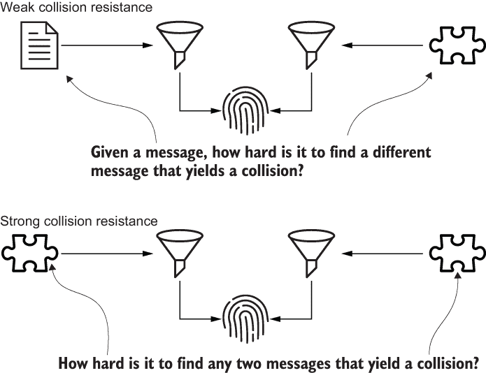
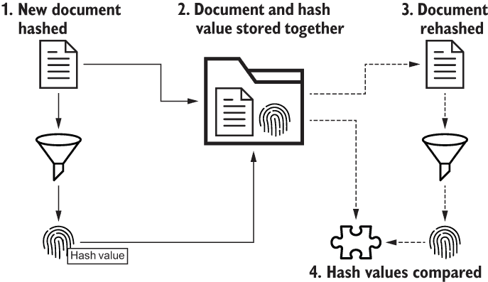

# 二、哈希

本章涵盖

*   定义哈希函数
*   引入安全原型
*   使用哈希验证数据完整性
*   选择加密哈希函数
*   使用 `hashlib` 模块进行加密哈希

在这一章中，你将学习使用哈希函数来确保数据完整性，这是安全系统设计的基础。您还将学习如何区分安全和不安全的哈希函数。在此过程中，我将向您介绍 Alice、Bob 和其他几个原型角色。我在整本书中使用这些角色来说明安全概念。最后，您将学习如何使用 `hashlib` 模块哈希数据。

## 2.1 什么是哈希函数？

每个 *哈希函数*都有输入和输出。哈希函数的输入被称为*消息*。消息可以是任何形式的数据。葛底斯堡演说、一只猫的图像和一个 Python 包都是潜在消息的例子。哈希函数的输出是一个非常大的数字。这个数字有许多名字:*哈希值*、*哈希值*、*哈希码*、*摘要*和*消息摘要* 。

在本书中，我使用术语*哈希值*。哈希值通常表示为字母数字字符串。哈希函数将一组消息映射到一组哈希值。图 2.1 说明了消息、哈希函数和哈希值之间的关系。


图 2.1 哈希函数将称为消息的输入映射到称为哈希值的输出。

在本书中，我将每个哈希函数描绘成一个漏斗。哈希函数和漏斗都接受可变大小的输入，并产生固定大小的输出。我将每个哈希值描述为一个指纹。哈希值和指纹分别唯一地标识消息或人。

哈希函数互不相同。这些差异通常可以归结为本节中定义的属性。为了说明前几个属性，我们将使用一个内置的 Python 函数，方便地命名为 `hash` 。Python 使用这个函数来管理字典和集合，您和我将使用它来进行教学。

内置的 `hash` 函数是介绍基础知识的好方法，因为它比本章后面讨论的哈希函数简单得多。内置的 `hash` 函数接受一个参数，即消息，并返回一个哈希值:

```py
$ python
>>> message = 'message'   ❶
>>> hash(message)
2010551929503284934       ❷
```

消息输入

❷ 哈希值输出

哈希函数有三个基本特性:

*   确定性行为

*   固定长度的哈希值

*   雪崩效应

确定性行为

每一个 哈希函数都是*确定性的*:对于给定的输入，一个哈希函数总是产生相同的输出。换句话说，哈希函数的行为是可重复的，而不是随机的。在 Python 流程中，内置的 `hash` 函数总是为给定的消息值返回相同的哈希值。在交互式 Python shell 中运行下面两行代码。您的哈希值将匹配，但将与我的不同:

```py
>>> hash('same message')
1116605938627321843        ❶
>>> hash('same message')
1116605938627321843        ❶
```

❶ 相同的哈希值

我在本章后面讨论的哈希函数是普遍确定的。无论如何或在何处调用 ，这些函数的行为都是一样的。

固定长度的哈希值

消息 长度任意；对于特定的哈希函数，哈希值具有固定的长度。如果一个函数不具备这一特性，它就不能称为哈希函数。消息的长度不影响哈希值的长度。给内置的 `hash` 函数传递不同的消息会给你不同的哈希值，但是每个哈希值永远是一个 整数。

雪崩效应

当 消息之间的小差异导致哈希值之间的大差异时，哈希函数被认为表现出*雪崩效应*。理想情况下，每个输出位都依赖于每个输入位:如果两条消息相差一位，那么平均只有一半的输出位匹配。判断一个哈希函数的标准是它与理想值的接近程度。

看看下面的代码。字符串和整数对象的哈希值都有固定的长度，但只有字符串对象的哈希值表现出雪崩效应:

```py
>>> bin(hash('a'))
'0b100100110110010110110010001110011110011111011101010000111100010'
>>> bin(hash('b'))
'0b101111011111110110110010100110000001010000011110100010111001110'
>>> 
>>> bin(hash(0))
'0b0'
>>> bin(hash(1))
'0b1'
```

内置的 `hash` 函数是一个很好的指导工具，但它不能被认为是一个加密哈希函数。下一节概述了这是 真实的三个原因。

### 2.1.1 密码哈希函数属性

一个 *密码哈希函数*必须满足三个附加标准:

*   单向函数属性

*   抗碰撞能力弱

*   抗碰撞能力强

这些属性的学术术语分别是*原像抗性* 、*第二原像抗性* 、*碰撞抗性* 。出于讨论的目的，我避免使用学术术语，无意冒犯学者。

单向函数

哈希 用于密码目的的函数，无一例外，必须是*单向函数*。如果一个函数易于调用且难以逆向工程，那么它就是单向的。换句话说，如果你有输出，它一定很难识别输入。如果攻击者获得了一个哈希值，我们希望他们很难弄清楚消息是什么。

有多难？我们通常使用不可行的 T2 这个词。这意味着*非常困难*——如此困难，以至于攻击者只有一个选择，如果他们想逆向工程的信息:蛮力。

什么叫*蛮力*T3？每个攻击者，甚至是不老练的攻击者，都能够编写一个简单的程序来生成大量的消息，哈希每个消息，并将每个计算出的哈希值与给定的哈希值进行比较。这是暴力攻击的一个例子。攻击者必须有大量的时间和资源，而不是智力。

多少时间和资源？嗯，这是主观的。答案并不是一成不变的。例如，对本章后面讨论的一些哈希函数的理论上的暴力攻击将会以数百万年和数十亿美元来衡量。一个理性的安全专家会认为这是不可行的。这并不意味着这是不可能的。我们认识到不存在完美的哈希函数，因为暴力攻击永远是攻击者的一种选择。

不可行性是一个移动的目标。几十年前被认为不可行的暴力攻击在今天或明天可能是可行的。随着计算机硬件成本的持续下降，暴力攻击的成本也在下降。不幸的是，加密强度会随着时间而减弱。尽量不要把这理解为每个系统最终都是脆弱的。相反，要明白每个系统最终都必须使用更强的哈希函数。本章将帮助您做出明智的决定，决定使用哪些哈希函数 。

碰撞阻力

哈希 用于密码目的的函数，无一例外，必须具备*抗碰撞能力*。什么是碰撞？尽管不同消息的哈希值具有相同的长度，但它们几乎从不具有相同的值。。。差不多了。当两个消息哈希到相同的哈希值时，这被称为*冲突*。碰撞是不好的。哈希函数旨在最大限度地减少冲突。我们根据哈希函数避免冲突的能力来判断它；有些人比其他人更好。

一个哈希函数具有*弱的抗冲突性* 如果给定一个消息，不可能识别哈希到相同哈希值的第二个消息。换句话说，如果攻击者有一个输入，那么他就不可能找到另一个能够产生相同输出的输入。

如果找不到任何冲突，哈希函数具有*很强的抗冲突性* 。弱抗撞性和强抗撞性的区别很微妙。弱冲突抵抗性被绑定到特定的给定消息；强抗冲突性适用于任何一对消息。图 2.2 说明了这种差异。



图 2.2 弱碰撞阻力与强碰撞阻力的对比

耐碰撞性强意味着耐碰撞性弱，而不是相反。任何抗碰撞能力强的哈希函数，抗碰撞能力也很弱；抗碰撞能力弱的哈希函数不一定具有强的抗碰撞能力。因此，强大的抗碰撞能力是一个更大的挑战；这通常是攻击者或研究人员破坏加密哈希函数时丢失的第一个属性。在这一章的后面，我将向你展示一个真实世界中的例子。

再次，关键词是*不可行*。尽管确定一个无冲突的哈希函数有多好，但我们永远也找不到，因为它不存在。想想吧。消息可以有任意长度；哈希值只能有一个长度。因此，所有可能消息的集合将总是大于所有可能哈希值的集合。这就是所谓的*鸽笼原理*T5。

在本节中，您学习了什么是哈希函数。现在是时候了解哈希如何确保数据完整性了。但首先，我会给你介绍几个原型人物。我在整本书中使用这些角色来说明安全概念，从 这一章 中的 开始。

## 2.2 原型人物

我 用五个原型人物来说明本书中的安全概念(见图 2.3)。相信我，这些角色让这本书读起来(和写起来)更容易。本书中的解决方案围绕着爱丽丝和鲍勃所面临的问题。如果你看过其他的安全书籍，你可能已经见过这两个角色了。Alice 和 Bob 就像您一样，他们希望安全地创建和共享信息。偶尔，他们的朋友查理会出现。本书中每个例子的数据倾向于在 Alice、Bob 和 Charlie 之间流动；记住 A、B 和 c。爱丽丝、鲍勃和查理是好角色。当你读这本书时，请随意认同这些角色。


图 2.3 有光环的原型人物好；攻击者被指定有角。

夏娃和马洛里是坏人。记住夏娃是邪恶的。记得马洛里是恶意的。这些角色通过试图窃取或修改 Alice 和 Bob 的数据和身份来攻击他们。夏娃是被动的攻击者；她是一个偷听者。她倾向于被攻击面的网络部分吸引。马洛里是一个积极的攻击者；她更老练。她倾向于使用系统或用户作为切入点。

记住这些字；你会再见到他们的。爱丽丝、鲍勃和查理有光环；夏娃和马洛里有角。在下一节中，Alice 将使用哈希来确保数据 的完整性。

## 2.3 数据完整性

*数据* *完整性*，有时也称为*消息完整性* ，是数据不被无意修改的保证。它回答了这个问题，“数据有变化吗？”假设 Alice 在一个文档管理系统上工作。目前，该系统为每份文件储存两份副本，以确保数据的完整性。为了验证文档的完整性，系统会逐字节比较两份副本。如果副本不匹配，则认为文档已损坏。Alice 对系统占用的存储空间不满意。成本正在失去控制，随着系统容纳更多的文档，问题变得越来越严重。

Alice 意识到她有一个共同的问题，并决定用一个共同的解决方案——加密哈希函数来解决它。创建每个文档时，系统会计算并存储它的哈希值。为了验证每个文档的完整性，系统首先重新哈希它。然后将新哈希值与存储中的旧哈希值进行比较。如果哈希值不匹配，则认为文档已损坏。

图 2.4 用四个步骤说明了这一过程。拼图块描述了两个哈希值的比较。



图 2.4 Alice 通过比较哈希值而不是文档来保证数据完整性。

你能明白为什么抗碰撞很重要吗？假设 Alice 要使用一个缺乏抗冲突性的哈希函数。如果文件的原始版本与损坏的版本冲突，系统将没有绝对的方法来检测数据损坏。

本节演示了哈希的一个重要应用:数据完整性。在下一节中，您将学习如何选择一个实际的哈希函数来执行 操作。

## 2.4 选择加密哈希函数

Python 原生支持密码哈希。不需要第三方框架或库。Python 附带了一个 `hashlib` 模块，该模块公开了大多数程序员加密哈希所需的一切。 `algorithms_guaranteed` 集合包含保证可用于所有平台的每个哈希函数。此集合中的哈希函数代表您的选项。很少有 Python 程序员会需要甚至看到这个集合之外的哈希函数:

```py
>>> import hashlib
>>> sorted(hashlib.algorithms_guaranteed)
['blake2b', 'blake2s', 'md5', 'sha1', 'sha224', 'sha256', 'sha384', 
'sha3_224', 'sha3_256', 'sha3_384', 'sha3_512', 'sha512', 'shake_128',
 'shake_256']
```

面对如此多的选择，感到不知所措是很自然的。在选择哈希函数之前，我们必须将我们的选项分为安全和不安全的选项。

### 2.4.1 哪些哈希函数是安全的？

`algorithms_guaranteed`的安全保密哈希函数属于以下哈希算法家族:

*   SHA-2

*   沙-3

*   刹车 2

SHA-2

*SHA-2*哈希函数家族由 NSA 于 2001 年公布。这个家族由沙-224、SHA-256、SHA-384 和 SHA-512 组成。SHA-256 和 SHA-512 是这个家庭的核心。不要费心去记住所有四个函数的名称；现在只关注 SHA-256。你会在这本书里看到很多。

您应该将 SHA-256 用于通用加密哈希。这是一个简单的决定，因为我们工作的每个系统都在使用它。我们部署应用程序所使用的操作系统和网络协议依赖于 SHA-256，因此我们别无选择。你必须非常努力才能不使用 SHA-256。它是安全的、可靠的、受到良好支持的，并且可以在任何地方使用。

SHA-2 家族中每个函数的名字都方便地记录了它的哈希值长度。哈希函数通常根据其哈希值的长度来分类、判断和命名。例如，SHA-256 是一个哈希函数，它产生——你猜对了——256 位长的哈希值。较长的哈希值更有可能是唯一的，不太可能发生冲突。更长的是 更好。

SHA-3

*SHA-3*哈希函数族由 SHA3-224、SHA3-256、SHA3-384、SHA3-512、SHAKE128 和 SHAKE256 组成。SHA-3 安全可靠，被许多人认为是 SHA-2 的天然继任者。不幸的是，在撰写本文时，SHA-3 的采用还没有形成势头。如果你在高安全性的环境中工作，你应该考虑使用像 SHA3-256 这样的阿沙-3 功能。请注意，你可能找不到与 SHA-2 相同水平的支持。

布莱克 2

*BLAKE2* 不像 SHA-2 或 SHA-3 那样受欢迎，但确实有一个很大的优势:BLAKE2 利用现代 CPU 架构以极高的速度哈希。因此，如果需要哈希大量数据，应该考虑使用 BLAKE2。BLAKE2 有两种口味:BLAKE2b 和 BLAKE2s。BLAKE2b 针对 64 位平台进行了优化。BLAKE2s 针对 8 到 32 位平台进行了优化。

既然你已经学会了如何识别和选择一个安全的哈希函数，你就准备好学习如何识别和避免那些 不安全的 哈希函数。

### 2.4.2 哪些哈希函数不安全？

`algorithms_guaranteed`中的 哈希函数比较流行，跨平台。这并不意味着它们中的每一个都是密码安全的。为了保持向后兼容性，Python 中保留了不安全的哈希函数。理解这些功能是值得的，因为您可能会在遗留系统中遇到它们。 `algorithms_guaranteed` 的不安全哈希函数如下:

*   MD5

*   SHA-1

MD5

*MD5* 是 90 年代初开发的一种过时的 128 位哈希函数。这是有史以来最常用的哈希函数之一。不幸的是，MD5 仍然在使用，即使研究人员早在 2004 年就已经证明了 MD5 冲突。今天，密码分析专家可以在不到 小时的时间内在商用硬件上生成 MD5 冲突。

SHA-1

*【SHA-1】*是一种过时的 160 位哈希函数，由 NSA 在 20 世纪 90 年代中期开发。像 MD5 一样，这种哈希函数一度很流行，但它不再被认为是安全的。SHA-1 的第一次碰撞是在 2017 年由谷歌和荷兰研究机构 Centrum Wiskunde & Informatica 合作宣布的。从理论上来说，这项努力剥夺了 SHA-1 强大的碰撞阻力，而不是微弱的碰撞阻力。

许多程序员都熟悉 SHA-1，因为它被用于在版本控制系统(如 Git 和 Mercurial)中验证数据完整性。这两种工具都使用阿沙-1 哈希值来识别和确保每次提交的完整性。Git 的创始人 Linus Torvalds 在 2007 年的一次谷歌技术会议上说，“就 Git 而言，SHA-1 甚至不是一个安全特性。这纯粹是一致性检查。”

警告创建新系统时，出于安全考虑，不得使用 MD5 或 SHA-1。任何出于安全目的使用这两种功能的遗留系统都应该被重构为安全的替代方案。这两种功能都很受欢迎，但 SHA-256 更受欢迎，也更安全。两者都很快，但 BLAKE2 更快更安全。

这里总结了选择哈希函数的注意事项:

*   将 SHA-256 用于通用加密哈希。

*   在高安全性环境中使用 SHA3-256，但期望得到比 SHA-256 更少的支持。

*   使用 BLAKE2 哈希大型消息。

*   出于安全考虑，切勿使用 MD5 或 SHA1。

既然你已经学会了如何选择一个安全的加密哈希函数，那么让我们在 Python 中应用这个 选择 。

## 2.5 Python 中的密码哈希

`hashlib`模块为 `hashlib.algorithms_guaranteed` 中的每个哈希函数都提供了一个命名的构造函数。或者，每个哈希函数都可以用一个名为 `new` 的通用构造函数动态访问。该构造函数接受 `algorithms_guaranteed` 中的任意字符串。命名构造函数比泛型构造函数更快，也更受青睐。下面的代码演示如何用两种构造函数类型构造 SHA-256 的实例:

```py
import hashlib

named = hashlib.sha256()           ❶
generic = hashlib.new('sha256')    ❷
```

❶ 命名构造函数

❷ 通用构造函数

一个哈希函数实例可以用消息初始化，也可以不用消息初始化。以下代码用一条消息初始化阿沙-256 函数。与内置的 `hash` 函数不同， `hashlib` 中的哈希函数要求消息的类型为 bytes:

```py
>>> from hashlib import sha256
>>> 
>>> message = b'message'
>>> hash_function = sha256(message)
```

每个哈希函数实例，不管是如何创建的，都有相同的 API。阿沙-256 实例的公共方法类似于 MD5 实例的公共方法。 `digest` 和 `hexdigest` 方法分别以字节和十六进制文本的形式返回哈希值:

```py
>>> hash_function.digest()        ❶
b'\xabS\n\x13\xe4Y\x14\x98+y\xf9\xb7\xe3\xfb\xa9\x94\xcf\xd1\xf3\xfb"\xf7\x
1c\xea\x1a\xfb\xf0+F\x0cm\x1d'
>>> 
>>> hash_function.hexdigest()     ❷
'ab530a13e45914982b79f9b7e3fba994cfd1f3fb22f71cea1afbf02b460c6d1d'
```

❶ 以字节为单位返回哈希值

❷ 以字符串形式返回哈希值

下面的代码使用 `digest` 方法来演示 MD5 冲突。这两条消息只有几个不同的字符(粗体):

```py
>>> from hashlib import md5
>>> 
>>> x = bytearray.fromhex(
...    
'd131dd02c5e6eec4693d9a0698aff95c2fcab58712467eab4004583eb8fb7f8955ad340609
f4b30283e488832571415a085125e8f7cdc99fd91dbdf280373c5bd8823e3156348f5bae6da
cd436c919c6dd53e2b487da03fd02396306d248cda0e99f33420f577ee8ce54b67080a80d1e
c69821bcb6a8839396f9652b6ff72a70')
>>> 
>>> y = bytearray.fromhex(
...     
'd131dd02c5e6eec4693d9a0698aff95c2fcab50712467eab4004583eb8fb7f8955ad340609
f4b30283e4888325f1415a085125e8f7cdc99fd91dbd7280373c5bd8823e3156348f5bae6da
cd436c919c6dd53e23487da03fd02396306d248cda0e99f33420f577ee8ce54b67080280d1e
c69821bcb6a8839396f965ab6ff72a70')
>>> 
>>> x == y                               ❶
False                                    ❶
>>> 
>>> md5(x).digest() == md5(y).digest()   ❷
True                                     ❷
```

❶ 不同的消息

❷ 哈希值相同，碰撞

消息也可以用 `update` 方法哈希，如下面代码中的粗体所示。当哈希函数需要单独创建和使用时，这很有用。哈希值不受消息如何提供给函数的影响:

```py
>>> message = b'message'
>>> 
>>> hash_function = hashlib.sha256()                             ❶
>>> hash_function.update(message)                                ❷
>>> 
>>> hash_function.digest() == hashlib.sha256(message).digest()   ❸
True                                                             ❸
```

❶ 构造的哈希函数没有消息

❷ 消息以更新方式传递

❸ 相同的哈希值

通过重复调用 `update` 方法，可以将一条消息分成多个块并进行迭代哈希，如下面的代码中粗体所示。每次调用 `update` 方法都会更新哈希值，而不会复制或存储对消息字节的引用。因此，当无法一次将大量消息加载到内存中时，此功能非常有用。哈希值对消息的处理方式不敏感。

```py
>>> from hashlib import sha256
>>> 
>>> once = sha256()
>>> once.update(b'message')            ❶
>>> 
>>> many = sha256()
>>> many.update(b'm')                  ❷
>>> many.update(b'e') ❷
>>> many.update(b's') ❷
>>> many.update(b's') ❷
>>> many.update(b'a') ❷
>>> many.update(b'g')                  ❷
>>> many.update(b'e')                  ❷
>>> 
>>> once.digest() == many.digest()     ❸
True
```

❶ 哈希函数用消息初始化

❷哈希函数给定消息中的组块

❸ 相同的哈希值

`digest_size`属性以字节为单位公开哈希值的长度。回想一下，顾名思义，SHA-256 是一个 256 位哈希函数:

```py
>>> hash_function = hashlib.sha256(b'message')
>>> hash_function.digest_size
32
>>> len(hash_function.digest()) * 8
256
```

根据定义，加密哈希函数是普遍确定的。它们自然是跨平台的。本章示例中的输入将在任何计算机上以任何编程语言通过任何 API 产生相同的输出。下面两个命令使用 Python 和 Ruby 演示了这种保证。如果同一个加密哈希函数的两个实现产生不同的哈希值，您知道其中至少有一个被破坏:

```py
$ python -c 'import hashlib; print(hashlib.sha256(b"m").hexdigest())'
62c66a7a5dd70c3146618063c344e531e6d4b59e379808443ce962b3abd63c5a

$ ruby -e 'require "digest"; puts Digest::SHA256.hexdigest "m"'
62c66a7a5dd70c3146618063c344e531e6d4b59e379808443ce962b3abd63c5a
```

另一方面，默认情况下，内置的 `hash` 函数只在特定的 Python 进程中具有确定性。以下两个命令演示了两个*不同的* Python 进程将相同的消息哈希到不同的哈希值:

```py
$ python -c 'print(hash("message"))'
8865927434942197212
$ python -c 'print(hash("message"))'    ❶
3834503375419022338                     ❷
```

❶ 同样的消息

❷ 不同的哈希值

警告内置的 `hash` 函数不得用于加密目的。这个功能非常快，但它不具备足够的碰撞阻力，无法与 SHA-256 相提并论。

到现在为止，你可能还在想，“哈希值不就是校验和吗？”答案是否定的，下一节解释 为什么。

## 2.6 校验和功能

哈希 函数和校验和函数有一些共同之处。*哈希函数*接受数据并产生哈希值；*校验和功能*接受数据并产生校验和。哈希值和校验和都是数字。这些数字用于检测不需要的数据修改，通常是在数据静止或传输时。

Python 原生支持 `zlib` 模块中的循环冗余校验(CRC )和 Adler-32 等校验和函数。以下代码演示了 CRC 的一个常见用例。这段代码压缩和解压缩重复的数据块。在此转换之前和之后，会计算数据的校验和(以粗体显示)。最后，通过比较校验和来执行错误检测:

```py
>>> import zlib
>>> 
>>> message = b'this is repetitious' * 42         ❶
>>> checksum = zlib.crc32(message)                ❶
>>> 
>>> compressed = zlib.compress(message)           ❷
>>> decompressed = zlib.decompress(compressed)    ❷
>>> 
>>> zlib.crc32(decompressed) == checksum          ❸
True                                              ❸
```

❶ 消息校验和

❷ 压缩和解压缩消息

❸ 通过比较校验和没有检测到错误

尽管哈希函数和校验和函数有相似之处，但它们不应相互混淆。哈希函数和校验和函数之间的权衡归结为加密强度与速度。换句话说，加密哈希函数的抗碰撞能力更强，而校验和函数的速度更快。例如，CRC 和 Adler-32 比 SHA-256 快得多，但都不具备足够的抗碰撞能力。下面两行代码演示了无数次 CRC 冲突中的一次:

```py
>>> zlib.crc32(b'gnu')
1774765869
>>> zlib.crc32(b'codding')
1774765869
```

如果你能识别出这种与 SHA-256 的冲突，这将在网络安全领域引发冲击波。将校验和功能与数据完整性联系起来有点牵强。用*错误检测* 而不是数据完整性来表征校验和功能更准确。

警告校验和功能不得用于安全目的。可以用加密哈希函数代替校验和函数，但性能代价很大。

在本节中，您学会了使用 `hashlib` 模块，而不是 `zlib` 模块来进行加密哈希。下一章继续讨论哈希法。您将学习如何使用 `hmac` 模块进行键控哈希，这是数据 认证的常见解决方案。

## 总结

*   哈希函数确定性地将消息映射到固定长度的哈希值。

*   您使用加密哈希函数来确保数据完整性。

*   您应该将 SHA-256 用于通用加密哈希。

*   出于安全目的使用 MD5 或 SHA1 的代码易受攻击。

*   你在 Python 中使用 `hashlib` 模块进行加密哈希。

*   校验和函数不适用于加密哈希。

*   爱丽丝、鲍勃和查理都很好。

*   伊芙和马洛里是坏人。