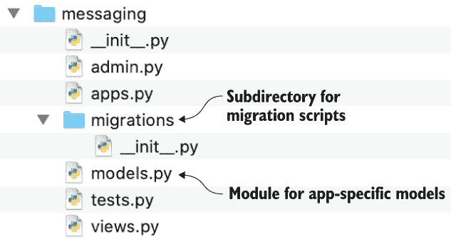
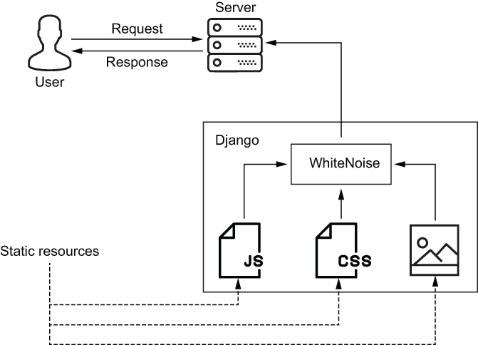
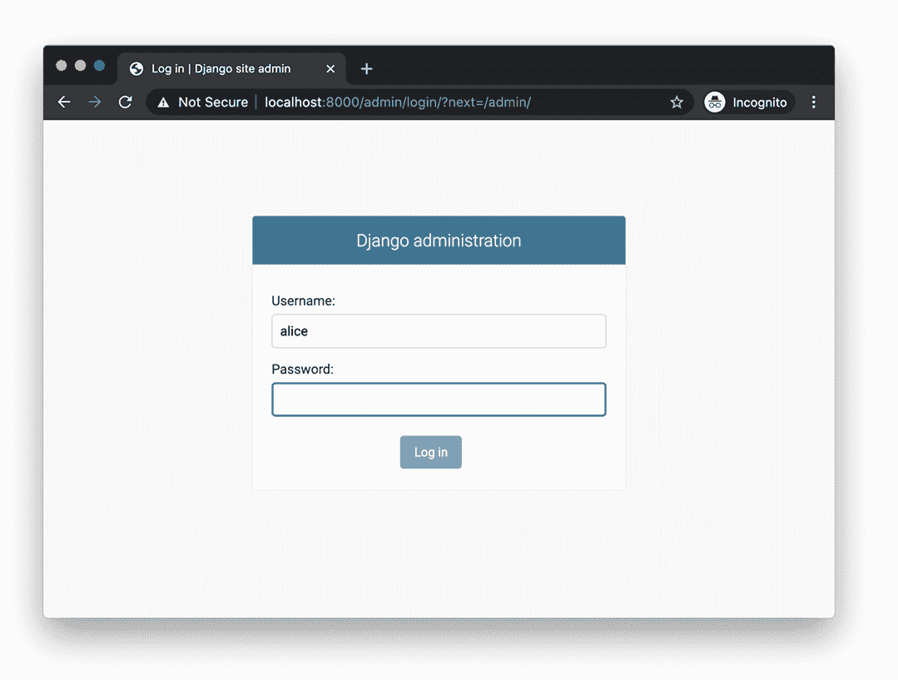

# 10 授权

本章涵盖

*   创建超级用户和权限
*   管理群组成员
*   使用Django实施应用级授权
*   测试授权逻辑

认证和授权有相互混淆的趋势。*认证* 关系到用户是谁；*授权*与用户可以做什么有关。认证和授权通常分别被称为 *authn* 和 *authz* 。身份验证是授权的前提。在本章中，我将介绍授权，也称为*访问控制*，因为它与应用程序开发相关。在下一章中，我将继续介绍OAuth 2，一种标准化的授权协议。

注在撰写本文时，*被破解的授权* 在OWASP十大关键安全风险列表中排名第五([【https://owasp.org/www-project-前十/](https://owasp.org/www-project-top-ten/) )。

本章一开始，你将深入探讨应用程序级的权限授权。许可是最基本的授权形式。它授权一个人或一群人做一件事，而且只能做一件事。接下来，您将为Alice创建一个超级用户帐户。然后，您将以Alice的身份登录Django管理控制台，在这里您将管理用户和组权限。之后，我将向您展示几种应用权限和组来控制谁可以访问受保护的资源的方法。

## 10.1应用级授权

在 这一节中，您将创建一个名为 *messaging* 的新Django应用程序。这个应用程序向您展示了Django授权的最基本元素，权限。要创建新的消息传递应用程序，请在项目根目录下运行以下命令。这个命令在名为messaging的新目录中生成一个Django应用程序:

```
$ python manage.py startapp messaging
```

生成的app的目录结构如图10.1所示。在本练习中，您将向 `models` 模块添加一个类，并通过向 `migrations` 包添加一些内容来修改数据库几次。



图10.1新Django应用程序的目录结构，消息

现在你需要用你的Django项目注册你的Django应用。打开 `settings` 模块，定位 `INSTALLED_APPS` 列表。添加您在这里看到的粗体行。请确保所有其他先前安装的应用程序保持不变:

```
INSTALLED_APPS = [
    ...
 'messaging',
]
```

接下来，打开models.py，把下面的模型类定义放进去。 `AuthenticatedMessage` 代表一条消息和一个哈希值具有两种属性。在第14章中，Alice和Bob将使用这个类进行安全通信:

```
from django.db.models import Model, CharField

class AuthenticatedMessage(Model):
    message = CharField(max_length=100)
    hash_value = CharField(max_length=64)
```

和所有模型一样， `AuthenticatedMessage` 必须映射到一个数据库表中。该表是通过Django迁移创建的。(您在上一章中学习了迁移。)映射由Django内置的ORM框架在运行时处理。

运行下面的命令，为您的模型类生成一个迁移脚本。该命令将自动检测新的模型类，并在迁移目录下创建新的迁移脚本，以粗体显示:

```
$ python manage.py makemigrations messaging
Migrations for 'messaging':
 messaging/migrations/0001_initial.py      ❶
    - Create model AuthenticatedMessage
```

❶ 新迁移脚本

最后，通过运行以下粗体显示的命令来执行您的迁移脚本:

```
$ python manage.py migrate
Running migrations:
  Applying messaging.0001_initial... OK
```

运行您的迁移脚本不仅仅是创建一个新的数据库表；它还在幕后创建了四个新的权限。下一节将解释这些权限存在的方式和原因。

### 10.1.1权限

Django 用一个称为权限的内置模型来表示权限。权限模型是Django授权中最基本的元素。每个用户可以与零到多个权限相关联。权限分为两类:

*   默认权限，由Django自动创建

*   自定义权限，由您创建

Django自动为每个新模型创建四个默认权限。这些权限是在运行迁移时在后台创建的。这些权限允许用户创建、读取、更新和删除模型。在Django shell中执行下面的代码，观察 `AuthenticatedMessage` 模型的所有四个默认权限，以粗体显示:

```
$ python manage.py shell
>>> from django.contrib.auth.models import Permission
>>> 
>>> permissions = Permission.objects.filter(
...     content_type__app_label='messaging',
...     content_type__model='authenticatedmessage')
>>> [p.codename for p in permissions]
['add_authenticatedmessage', 'change_authenticatedmessage', 
'delete_authenticatedmessage', 'view_authenticatedmessage']
```

随着项目的发展，通常需要自定义权限。您通过向您的模型添加一个内部 `Meta` 类来声明这些权限。打开你的 `models` 模块，添加下面的 `Meta` 类，以粗体显示，到 `AuthenticatedMessage` 。 `Meta` 类的属性定义了两个自定义权限。这些权限指定哪些用户可以发送和接收邮件:

```
class AuthenticatedMessage(Model):       ❶
    message = CharField(max_length=100)
    mac = CharField(max_length=64)

 class Meta:                          ❷
 permissions = [
 ('send_authenticatedmessage', 'Can send msgs'),
 ('receive_authenticatedmessage', 'Can receive msgs'),
 ]
```

❶ 你的模特班

❷ 你的模型元类

与默认权限一样，自定义权限也是在迁移过程中自动创建的。使用以下命令生成新的迁移脚本。如粗体输出所示，该命令在迁移目录下生成一个新脚本:

```
$ python manage.py makemigrations messaging --name=add_permissions
Migrations for 'messaging':
 messaging/migrations/0002_add_permissions.py      ❶
    - Change Meta options on authenticatedmessage
```

❶ 新迁移脚本

接下来，使用以下命令执行您的迁移脚本:

```
$ python manage.py migrate
Running migrations:
  Applying messaging.0002_add_permissions... OK
```

现在，您已经向项目添加了一个应用程序、一个模型、一个数据库表和六个权限。在下一节中，您将为爱丽丝创建一个帐户，以她的身份登录，并将这些新权限授予 鲍勃。

### 10.1.2用户和组管理

在 这一节，你将创建一个超级用户，爱丽丝。一个*超级用户*是一个特殊的管理用户，拥有做任何事情的权限；这些用户拥有所有权限。作为Alice，您将访问Django的内置管理控制台。默认情况下，这个控制台在每个生成的Django项目中都是启用的。对管理控制台的简要介绍将向您介绍Django如何实现应用程序级授权。

如果您的Django项目可以提供静态内容，管理控制台会更容易使用，看起来也更好。Django可以通过HTTP自己做到这一点，但是Gunicorn不是为通过HTTPS做到这一点而设计的。这个问题可以通过WhiteNoise轻松解决，这是一个旨在有效提供静态内容的包，同时最大限度地降低了设置的复杂性(图10.2)。管理控制台(以及项目的其余部分)将使用WhiteNoise为您的浏览器正确地提供JavaScript、样式表和图像。



图10.2 Django应用服务器使用WhiteNoise交付静态资源。

从您的虚拟环境中运行下面的 `pipenv` 命令来安装WhiteNoise:

```
$ pipenv install whitenoise
```

现在你需要通过中间件在Django中激活WhiteNoise。什么是中间件？*中间件* 是Django中的一个轻量级子系统，位于每个入站请求和视图的*中间*，以及视图和每个出站响应的*中间*。从这个角度出发，中间件应用预处理和后处理逻辑。

中间件逻辑是由一组中间件组件实现的。每个组件都是一个独特的小处理钩子，负责特定的任务。例如，内置的 `AuthenticationMiddleware` 类负责将入站HTTP会话id映射到用户。我在后面章节中介绍的一些中间件组件负责管理与安全相关的响应头。您在本节中添加的组件 `WhiteNoiseMiddleware` 负责为静态资源提供服务。

像所有其他Django子系统一样，中间件配置在 `settings` 模块中。打开 `settings` 模块，找到 `MIDDLEWARE` 设置。该设置是中间件组件类名的列表。如下面代码中粗体字所示，将 `WhiteNoiseMiddleware` 添加到 `MIDDLEWARE` 。确保这个组件出现在 `SecurityMiddleware` 之后，其他所有组件之前。不要删除任何预先存在的中间件组件:

```
MIDDLEWARE = [
    'django.middleware.security.SecurityMiddleware',   ❶
    'whitenoise.middleware.WhiteNoiseMiddleware',      ❷
    ...
]
```

❶ 确保安全中间件保持第一。

❷ 给你的项目添加whitenoise

警告每个生成的Django项目都以 `SecurityMiddleware` 作为第一个 `MIDDLEWARE` 组件进行初始化。 `SecurityMiddleware` 实现了一些之前提到的安全特性，比如 `Strict-Transport-Security` 响应头和HTTPS重定向。如果将其他中间件组件放在 `SecurityMiddleware` 之前，这些安全特性就会受到影响。

重启服务器，将浏览器指向位于https:/的管理控制台登录页面。/localhost:8000/admin/。登录页面应该如图10.3所示。如果您的浏览器在没有样式的情况下呈现相同的表单，则没有安装WhiteNoise。如果 `MIDDLEWARE` 配置错误或者服务器没有重启，就会出现这种情况。没有WhiteNoise，管理控制台仍然可以工作；只是看起来不好看。



图10.3 Django的管理登录页面

管理控制台登录页面需要具有超级用户或职员身份的用户的认证凭证；Django不允许普通终端用户登录管理控制台。

从您的项目根目录，运行以下命令创建一个超级用户。此命令在您的数据库中创建一个超级用户；它会提示您输入新超级用户的密码:

```
$ python manage.py createsuperuser \
         --username=alice --email=alice@alice.com
```

以Alice的身份登录管理控制台。作为超级用户，您可以从管理登录页面管理组和用户。通过单击组旁边的添加，导航到新的组条目表单。

组

*组* 提供了一种将一组权限与一组用户相关联的方式。一个组可以与零到多个权限相关联，也可以与零到多个用户相关联。与组相关联的每个权限都被隐式授予该组的每个用户。

如图10.4所示，新的组条目表单需要一个组名和可选权限。花一分钟时间观察可用的权限。请注意，它们分成四组。每个批处理代表数据库表的默认权限，控制谁可以创建、读取、更新和删除行。


图10.4新的组条目表单接受一个组名和多个组权限。

滚动浏览可用的权限选择器，找到您为消息应用程序创建的权限。与其他批处理不同，这个批处理有六个元素:四个默认权限和两个自定义权限。

在名称字段中输入 `observers` 。 `observers` 组旨在对每个表进行只读访问。选择包含文本“可以查看”的每个可用权限单击保存提交表单。

提交表单后，您将被带到一个列出所有群组的页面。通过单击左侧边栏中的用户，导航到列出所有用户的类似页面。目前，该页面仅列出了Alice和Bob。通过单击Bob的姓名导航到他的用户详细信息页面。向下滚动用户详细信息页面，直到找到组和权限的两个相邻部分。在这一部分中，如图10.5所示，将Bob分配到 `observers` 组，并授予他消息应用程序的全部六个权限。滚动到底部，然后单击保存。


图10.5作为管理员分配组和权限

群组成员和权限不必手动管理；或者，您可以通过编程来实现这一点。清单10.1演示了如何通过 `User` 模型上的两个属性来授予和撤销权限。通过 `groups` 属性授予和撤销组成员资格。 `user_permissions` 属性允许添加或删除用户的权限。

清单10.1以编程方式管理组和权限

```
from django.contrib.auth.models import User
from django.contrib.auth.models import Group, Permission

bob = User.objects.get(username='bob')                                  ❶
observers = Group.objects.get(name='observers')                         ❶
can_send = Permission.objects.get(codename='send_authenticatedmessage') ❶

bob.groups.add(observers)                                               ❷
bob.user_permissions.add(can_send)                                      ❸

bob.groups.remove(observers)                                            ❹
bob.user_permissions.remove(can_send)                                   ❺
```

❶检索模型实体

❷ 将鲍勃加入群组

❸ 给鲍勃增加了一个权限

❹ 将鲍勃从群组中移除

❺ 取消了鲍勃的一项许可

至此，你已经知道了组和权限是如何工作的。你知道它们是什么，如何创建它们，以及如何将它们应用于用户。但是它们实际上是什么样的呢？在下一节中，您将开始使用 组 和 权限解决问题。

## 10.2强制授权

授权的全部目的是防止用户做他们不应该做的事情。这适用于系统内的行动，如读取敏感信息，以及系统外的行动，如指挥飞行交通。在Django中有两种实施授权的方法:低级的硬方法和高级的简单方法。在这一节中，我将首先向您展示困难的方法。之后，我将向您展示如何测试您的系统是否正确地执行授权。

### 10.2.1低级玩命方式

`User`模型提供了几个为编程权限检查设计的底层方法。下面代码中显示的 `has_perm` 方法允许您访问默认权限和自定义权限。在本例中，Bob不允许创建其他用户，但允许接收消息:

```
>>> from django.contrib.auth.models import User
>>> bob = User.objects.get(username='bob')
>>> bob.has_perm('auth.add_user')                            ❶
False                                                        ❶
>>> bob.has_perm('messaging.receive_authenticatedmessage')   ❷
True                                                         ❷
```

❶ 鲍勃不能添加用户。

❷ 鲍勃能收到消息。

`has_perm`方法将始终为超级用户返回 `True` :

```
>>> alice = User.objects.get(username='alice')
>>> alice.is_superuser                         ❶
True                                           ❶
>>> alice.has_perm('auth.add_user')
True
```

❶ 爱丽丝无所不能。

`has_perms`方法提供了一种一次检查多个权限的便捷方式:

```
>>> bob.has_perms(['auth.add_user',                              ❶
...                'messaging.receive_authenticatedmessage'])    ❶
False                                                            ❶
>>> 
>>> bob.has_perms(['messaging.send_authenticatedmessage',        ❷
...                'messaging.receive_authenticatedmessage'])    ❷
True                                                             ❷
```

❶ 鲍勃不能添加用户和接收消息。

❷ 鲍勃能收发信息。

低级API没有任何问题，但是您应该尽量避免它，原因有二:

*   与我在本节后面介绍的方法相比，低级权限检查需要更多的代码行。

*   更重要的是，以这种方式检查权限容易出错。例如，如果您向这个API查询一个不存在的权限，它将简单地返回 `False` :

```
>>> bob.has_perm('banana')
False
```

这里还有一个陷阱。权限是从数据库中批量获取并缓存的。这是一种危险的交易。一方面， `has_perm` 和 `has_perms` 不会在每次调用时触发数据库跳闸。另一方面，在将权限应用于用户之后，立即检查权限时必须小心。下面的代码片段演示了原因。在这个例子中，Bob被剥夺了一个权限。很遗憾，本地权限状态没有更新:

```
>>> perm = 'messaging.send_authenticatedmessage'    ❶
>>> bob.has_perm(perm)                              ❶
True                                                ❶
>>> 
>>> can_send = Permission.objects.get(              ❷
...     codename='send_authenticatedmessage')       ❷
>>> bob.user_permissions.remove(can_send)           ❷
>>> 
>>> bob.has_perm(perm)                              ❸
True                                                ❸
```

❶得到允许后开始。

❷失去许可。

❸本地复制无效。

继续同一个例子，在 `User` 对象上调用 `refresh_from_db` 方法时会发生什么？本地权限状态仍未更新。要获得最新状态的副本，必须从数据库中重新加载一个新的 `User` 模型:

```
>>> bob.refresh_from_db()                     ❶
>>> bob.has_perm(perm)                        ❶
True                                          ❶
>>> 
>>> reloaded = User.objects.get(id=bob.id)    ❷
>>> reloaded.has_perm(perm)                   ❷
False                                         ❷
```

❶本地复制仍然无效。

❷ 重新加载的模型对象有效。

这是第三个陷阱。清单10.2定义了一个视图。该视图在呈现敏感信息之前执行授权检查。它有两个bug。你能认出他们吗？

清单10.2如何不强制授权

```
from django.shortcuts import render
from django.views import View

class UserView(View):

    def get(self, request):
        assert request.user.has_perm('auth.view_user')   ❶
        ...
        return render(request, 'sensitive_info.html')    ❷
```

❶ 检查权限

❷ 渲染敏感信息

第一个bug在哪？和很多编程语言一样，Python有一个 `assert` 语句。该语句评估一个条件，如果条件为 `False` ，则引发一个 `AssertionError` 。在本例中，条件是权限检查。Assert语句在开发和测试环境中很有用，但是当使用 `-O` 选项调用Python时，它们就变成了一种虚假的安全感。(该选项代表*优化* 。)作为优化，Python解释器删除了所有的 `assert` 语句。在控制台中键入以下两个命令，亲自查看:

```
$ python -c 'assert 1 == 2'               ❶
Traceback (most recent call last):        ❶
  File "<string>", line 1, in <module>    ❶
AssertionError                            ❶
$ python -Oc 'assert 1 == 2'              ❷
```

❶ 引发断言错误

❷ 什么都没引出

警告断言语句是调试程序的好方法，但是它们不应该用于执行权限检查。除了权限检查之外， `assert` 语句一般不应该用于应用程序逻辑。这包括所有的安全检查。 `-O` 标志很少在开发或测试环境中使用；生产中经常用到。

第二个bug呢？让我们假设断言实际上正在您的生产环境中执行。与任何错误一样，服务器将 `AssertionError` 转换为状态代码500。按照HTTP规范的定义，这个代码表示一个内部服务器错误(【https://tools.ietf.org/html/rfc7231】)。您的服务器现在会阻止未经授权的请求，但不会产生有意义的HTTP状态代码。一个善意的客户端现在收到了这段代码，并错误地认为根本问题出在服务器端。

未授权请求的正确状态代码是403。服务器发送状态代码403，将资源指定为禁止。该状态代码在本章中出现两次，从下一个部分开始。

### 10.2.2高级简易方式

现在我要告诉你一个简单的方法。这种方法更干净，您不必担心前面提到的任何陷阱。Django附带了几个为授权而设计的内置mixins和decorators。使用以下高级工具比使用一堆 `if` 语句要干净得多:

*   `PermissionRequiredMixin`

*   `@permission_required`

`PermissionRequiredMixin` 对个人视图实施授权。该类自动检查与每个入站请求相关联的用户的权限。您可以使用 `permission_required` 属性指定要检查的权限。该属性可以是表示一个权限的字符串，也可以是表示多个权限的字符串的iterable。

清单10.3中的视图继承了 `PermissionRequiredMixin` ，以粗体显示。同样以粗体显示的 `permission_required` 属性确保了在请求被处理之前，用户必须拥有查看经过身份验证的消息的权限。

清单10.3授权与权限要求最小

```
from django.contrib.auth.mixins import PermissionRequiredMixin
from django.http import JsonResponse

class AuthenticatedMessageView(PermissionRequiredMixin, View):     ❶
 permission_required = 'messaging.view_authenticatedmessage'    ❷

    def get(self, request):
         ...
         return JsonResponse(data)
```

❶ 确保检查权限

❷ 声明要检查哪些权限

`PermissionRequiredMixin` 通过将浏览器重定向到登录页面来响应匿名请求。正如所料，它用状态码403响应未授权的请求。

`@permission_required`装饰器在功能上相当于 `PermissionRequiredMixin` 。清单10.4展示了粗体显示的 `@permission_ required` 装饰器如何对基于函数的视图实施授权。与前面的示例一样，这段代码确保用户在处理请求之前必须拥有查看经过身份验证的消息的权限。

清单10.4授权与 @permission_required

```
from django.contrib.auth.decorators import permission_required
from django.http import JsonResponse

@permission_required('messaging.view_authenticatedmessage', raise_exception=True)                      ❶
def authenticated_message_view(request):        ❷
    ...                                         ❷
    return JsonResponse(data)                   ❷
```

❶ 在处理请求前检查权限

❷ 基于功能的视图

有时你需要用比简单的权限检查更复杂的逻辑来保护资源。以下一对内置实用程序旨在使用任意Python强制授权；除此之外，他们的行为类似于 `PermissionRequiredMixin` 和 `@permission_required` 装饰者:

*   `UserPassesTestMixin`

*   `@user_passes_test`

`UserPassesTestMixin`，如清单10.5中粗体所示，用Python守护一个具有任意逻辑的视图。这个实用程序为每个请求调用 `test_func` 方法。此方法的返回值确定请求是否被允许。在本例中，用户必须有一个新帐户或者是Alice。

清单10.5使用userpassestmaximixin进行授权

```
from django.contrib.auth.mixins import UserPassesTestMixin
from django.http import JsonResponse

class UserPassesTestView(UserPassesTestMixin, View):

    def test_func(self):                                                ❶
        user = self.request.user                                        ❶
        return user.date_joined.year > 2020 or user.username == 'alice' ❶

    def get(self, request):
        ...
        return JsonResponse(data)
```

❶ 任意授权逻辑

清单10.6中粗体显示的 `@user_passes_test` 装饰器是 `UserPassesTestMixin` 的功能等价物。与 `UserPassesTestMixin` 不同， `@user _passes_test` 装饰器通过重定向到登录页面来响应未授权的请求。在本例中，用户必须有一个来自alice.com的电子邮件地址或名字为 `bob` 。

清单10.6授权用 @user_passes_test

```
from django.contrib.auth.decorators import user_passes_test
from django.http import JsonResponse

def test_func(user):                                                     ❶
    return user.email.endswith('@alice.com') or user.first_name == 'bob' ❶

@user_passes_test(test_func)
def user_passes_test_view(request):                                      ❷
    ...                                                                  ❷
    return JsonResponse(data)                                            ❷
```

❶ 任意授权逻辑

❷ 基于功能的视图

### 10.2.3条件渲染

向用户展示他们不被允许做的事情通常是不可取的。例如，如果Bob没有删除其他用户的权限，您希望避免用“删除用户”链接或按钮误导他。解决方案是有条件地呈现控件:您对用户隐藏它，或者以禁用状态向他们显示它。

基于授权的条件呈现内置在默认的Django模板引擎中。您通过 `perms` 变量访问当前用户的权限。下面的模板代码演示了如果允许当前用户发送消息，如何有条件地呈现链接。 `perms` 变量以粗体显示:

```

    <a href='/authenticated_message_form/'>Send Message</a>

```

或者，你也可以使用这种技术来禁用控件。以下控件对任何人都是可见的；只有那些被允许创建新用户的用户才可以使用它:

```
<input type='submit'
        disabled 
       value='Add User'/>
```

警告永远不要让条件渲染成为一种虚假的安全感。它永远不能替代服务器端的授权检查。这适用于服务器端和客户端条件渲染。

不要被这个功能误导。条件呈现是改善用户体验的好方法，但不是强制授权的有效方法。控件是否隐藏或禁用并不重要；这两种情况都无法阻止用户向服务器发送恶意请求。授权必须在服务器端实施；其他的 无关紧要。

### 10.2.4 测试授权

在第8章中，你学到了认证对测试来说没有障碍；这同样适用于授权。清单10.7演示了如何验证您的系统是否正确地保护了受保护的资源。

`TestAuthorization`的设置方法创建并认证新用户查理。测试方法从断言Charlie被禁止查看消息开始，以粗体显示。(您在前面已经了解到，服务器用状态代码403来传达这一信息。)然后，测试方法验证Charlie在授予他权限后可以查看消息；web服务器用状态码200来表示这一点，也用粗体显示。

清单10.7测试授权

```
from django.contrib.auth.models import User, Permission

class TestAuthorization(TestCase):

    def setUp(self):
        passphrase = 'fraying unwary division crevice'     ❶
        self.charlie = User.objects.create_user(           ❶
            'charlie', password=passphrase)                ❶
        self.client.login(
            username=self.charlie.username, password=passphrase)

    def test_authorize_by_permission(self):
        url = '/messaging/authenticated_message/'
        response = self.client.get(url, secure=True)       ❷
 self.assertEqual(403, response.status_code)        ❷

        permission = Permission.objects.get(               ❸
            codename='view_authenticatedmessage')          ❸
        self.charlie.user_permissions.add(permission)      ❸

        response = self.client.get(url, secure=True)       ❹
 self.assertEqual(200, response.status_code)        ❹
```

❶为查理创建了一个账户

❷ 断言无访问

❸ 授予权限

❹ 断言访问

在上一节中，您学习了如何授权；在本节中，您学习了如何实施它。我认为可以肯定地说，这个主题不像本书中的其他一些材料那样复杂。例如，TLS握手和密钥派生功能要复杂得多。尽管授权非常简单，但令人惊讶的是，有很高比例的组织会弄错。在下一部分，我将向您展示避免这种情况的经验法则。

## T1】10.3反模式和最佳实践

2020年7月的 年，一小群攻击者进入了Twitter的一个内部管理系统。攻击者通过这个系统重置了130个著名Twitter账户的密码。埃隆·马斯克、乔·拜登、比尔·盖茨和许多其他公众人物的账户都受到了影响。其中一些被劫持的账户随后被用来针对数百万Twitter用户实施比特币骗局，净赚约12万美元。

据两名前Twitter员工称，超过1000名员工和承包商进入了被入侵的内部行政系统(【http://mng.bz/9NDr】)。虽然Twitter拒绝对这个数字发表评论，但我可以说这不会让他们比大多数组织更糟糕。大多数组织至少有一个劣质的内部工具，允许太多的权限被授予太多的用户。

这种每个人都可以做任何事情的反模式源于组织未能应用最小特权原则。正如第1章所提到的，PLP规定用户或系统只应被授予履行其职责所需的最低权限。少即是多；稳妥起见。

反过来，有的组织权限太多，组太多。这些系统更加安全，但是管理和技术维护成本过高。一个组织如何取得平衡？一般来说，您希望支持以下两条经验法则:

*   *授予*组成员权限。

*   *以个人独立权限强制执行*授权。

这种方法最小化了技术成本，因为你的代码不需要在每次团队获得或失去一个用户或责任时都改变。管理成本仍然很低，但前提是每个群体都以有意义的方式定义。根据经验，创建模拟真实世界组织角色的小组。如果你的用户属于像“销售代表”或“后端运营经理”这样的类别，你的系统可能只需要把他们分成一组。起团名的时候不要有创意；随便他们怎么称呼自己。

授权是任何安全系统的重要组成部分。你知道如何批准、执行和测试它。在本章中，您了解了这个应用于应用程序开发的主题。在下一章中，我将继续这个主题，因为我将介绍OAuth 2，一种授权协议。该协议允许用户授权第三方访问受保护的 资源。

## 总结

*   认证关系到你是谁；授权关系到你能做什么。

*   用户、组和权限是授权的组成部分。

*   WhiteNoise是一种简单高效的静态资源服务方式。

*   Django的管理控制台允许超级用户管理用户。

*   比起低级API，更喜欢高级授权API。

*   一般来说，通过独立权限实施授权；通过群组成员资格授予授权。