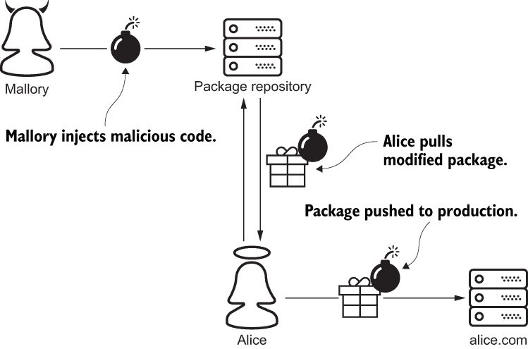
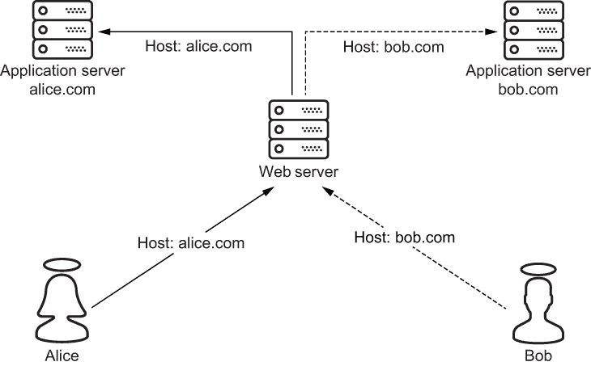

# 13 永远不要相信输入

本章涵盖

*   使用 Pipenv 验证 Python 依赖关系
*   用 PyYAML 安全解析 YAML
*   用 `defusedxml` 安全解析 XML
*   防止 DoS 攻击、 `Host` 报头攻击、打开重定向和 SQL 注入

在这一章中，马洛里用六次攻击对爱丽丝、鲍勃和查理造成了严重破坏。这些攻击以及它们的对策并不像我后面讨论的攻击那样复杂。本章中的每一次攻击都遵循一个模式:Mallory 通过恶意输入来滥用系统或用户。这些攻击以多种不同的输入形式出现:包依赖、YAML、XML、HTTP 和 SQL。这些攻击的目标包括数据损坏、权限提升和未经授权的数据访问。*输入验证*是所有这些攻击的解药。

我在本章介绍的许多攻击都是注入攻击。(您在上一章中学习了注入攻击。)在典型的注入攻击中，恶意输入被注入到正在运行的系统中，并被该系统立即执行。由于这个原因，程序员倾向于忽略我在本章开始的非典型场景。在这个场景中，注入发生在构建时的上游；执行发生在运行时的下游。

## 13.1 用 Pipenv 进行包管理

在 这一节，我将向你展示如何用 Pipenv 来防止注入攻击。哈希和数据完整性，这两个你之前学过的主题，将会再次出现。像任何 Python 包管理器一样，Pipenv 从包存储库(如 PyPI)中检索并安装第三方包。不幸的是，程序员没有意识到包存储库是他们攻击面的一个重要部分。

假设爱丽丝想定期将新版本的 Alice 部署到生产环境中。她编写了一个脚本来获取最新版本的代码，以及最新版本的包依赖项。Alice 不会通过将依赖项签入版本控制来增加代码库的大小。相反，她用包管理器从包存储库中取出这些工件。

马洛里已经泄露了爱丽丝依赖的包裹库。从这个位置，Mallory 用恶意代码修改了 Alice 的一个依赖项。最后，恶意代码被 Alice 的包管理器取出，并被推送到 alice.com，在那里执行。图 13.1 说明了马洛里的攻击。



图 13.1 Mallory 通过包依赖将恶意代码注入 alice.com。

与其他软件包管理器不同，Pipenv 通过在从软件包存储库中取出每个软件包时验证其完整性来自动阻止 Mallory 执行此攻击。正如预期的那样，Pipenv 通过比较哈希值来验证包的完整性。

当 Pipenv 第一次检索一个包时，它会在您的锁文件 Pipfile.lock 中记录每个包工件的哈希值，打开您的锁文件，花一分钟时间观察您的一些依赖项的哈希值。比如下面这段我的锁文件，说明 Pipenv 拉了 `requests` 包的 2.24 版本。两个工件的 SHA-256 哈希值以粗体显示:

```py
...
"requests": {
 "hashes": [
 "Sha256:b3559a131db72c33ee969480840fff4bb6dd1117c8...", ❶
 "Sha256:fe75cc94a9443b9246fc7049224f756046acb93f87..." ❶
 ],
    "version": "==2.24.0"                                          ❷
},
...
```

❶ 包工件的哈希值

软件包版本

当 Pipenv 检索一个熟悉的包时，它会对每个入站包工件进行散列，并将散列值与您的锁文件中的散列值进行比较。如果哈希值匹配，Pipenv 可以认为软件包未被修改，因此可以安全安装。如果哈希值不匹配，如图 13.2 所示，Pipenv 将拒绝该包。


图 13.2 包管理器通过比较恶意修改的 Python 包的哈希值和锁文件的哈希值来抵御注入攻击。

以下命令输出演示了当软件包验证失败时 Pipenv 的行为。本地哈希值和警告以粗体显示:

```py
$ pipenv install
Installing dependencies from Pipfile.lock
An error occurred while installing requests==2.24.0 
➥ --hash=sha256:b3559a131db72c33ee969480840fff4bb6dd1117c8...   ❶
➥ --hash=sha256:fe75cc94a9443b9246fc7049224f756046acb93f87...   ❶
...
[pipenv.exceptions.InstallError]: ['ERROR: THESE PACKAGES DO NOT
➥ MATCH THE HASHES FROM THE REQUIREMENTS FILE. If you have updated
➥ the package versions, please update the hashes. Otherwise,
➥ examine the package contents carefully; someone may have      ❷
➥ tampered with them.                                           ❷
...
```

❶ 包工件的本地哈希值

❷发出数据完整性警告

除了防止恶意修改软件包之外，该检查还可以检测意外的软件包损坏。这确保了本地开发、测试和生产部署的确定性构建——这是使用散列法进行真实世界数据完整性验证的一个很好的例子。在接下来的两节中，我继续用注射攻击。

## 13.2 YAML 远程代码执行

在第七章 中，你看到了 Mallory 执行了一次远程代码执行攻击。首先，她将恶意代码嵌入到一个*腌制的*或序列化的 Python 对象中。接下来，她将这段代码伪装成基于 cookie 的 HTTP 会话状态，并发送给服务器。然后服务器在无意中用`PickleSerializer`(Python 的 `pickle` 模块的包装器)执行恶意代码时杀死了自己。在这一节中，我将展示如何使用 YAML 而不是 `pickle` 进行类似的攻击——相同的攻击，不同的数据格式。

注在本文撰写之时，*不安全反序列化* 在 OWASP 前十名([https://owasp.org/www-project-top-ten/](https://owasp.org/www-project-top-ten/))中排名第八。

与 JSON、CSV 和 XML 一样，YAML 是以人类可读格式表示数据的一种常见方式。每种主要的编程语言都有工具来解析、序列化和反序列化这些格式的数据。Python 程序员经常用*PyYAML*T3】解析 YAML。从您的虚拟环境中，运行以下命令来安装 PyYAML:

```py
$ pipenv install pyyaml
```

打开一个交互式 Python shell，运行下面的代码。这个例子向 PyYAML 提供了一个小的内联 YAML 文档。如粗体所示，PyYAML 加载带有 `BaseLoader` 的文档，并将其转换为 Python dict:

```py
>>> import yaml
>>> 
>>> document = """                             ❶
...   title: Full Stack Python Security        ❶
...   characters:                              ❶
...     - Alice                                ❶
...     - Bob                                  ❶
...     - Charlie                              ❶
...     - Eve                                  ❶
...     - Mallory                              ❶
... """                                        ❶
>>> 
>>> book = yaml.load(document, Loader=yaml.BaseLoader)
>>> book['title']                              ❷
'Full Stack Python Security'                   ❷
>>> book['characters']                         ❷
['Alice', 'Bob', 'Charlie', 'Eve', 'Mallory']  ❷
```

来自 YAML 的 ❶ 。。。

❷ 。。。到 Python

在第一章中，你学习了最小特权原则。PLP 规定，用户或系统只应被授予履行其职责所需的最低权限。我向您展示了如何将这一原则应用于用户授权；在这里，我将向您展示如何应用它来解析 YAML。

警告当你把 YAML 装入内存时，限制你给 PyYAML 的功率量是非常重要的。

您通过 `Loader` 关键字参数将 PLP 应用于 PyYAML。例如，前面的例子用功能最弱的加载程序 `BaseLoader` 加载 YAML。PyYAML 支持另外三种 `Loaders` 。这里列出了所有四种功能，从最弱到最强。每一个 `Loader` 都比前一个支持更多的功能，承担更多的风险:

*   `BaseLoader`—支持字符串和列表等原始 Python 对象

*   `SafeLoader`—支持原始 Python 对象和标准 YAML 标签

*   `FullLoader`—全 YAML 语言支持(默认)

*   `UnsafeLoader`—全 YAML 语言支持和任意函数调用

如果您的系统接受 YAML 作为输入，未能应用 PLP 可能是致命的。下面的代码演示了当使用 `UnsafeLoader` 从不可信的来源加载 YAML 时，这是多么的危险。此示例创建内嵌的 YAML，并嵌入了对 `sys.exit` 的函数调用。如粗体字所示，YAML 然后被馈送给 PyYAML。然后，当 PyYAML 调用 `sys.exit` ，退出代码为 42 时，该流程自行终止。最后， `echo` 命令结合 `$?` 变量确认 Python 进程确实以值 42 退出:

```py
$ python                                           ❶
>>> import yaml
>>> 
>>> input = '!!python/object/new:sys.exit [42]'    ❷
>>> yaml.load(input, Loader=yaml.UnsafeLoader)     ❸
$ echo $?                                          ❹
42                                                 ❹
```

❶ 创造过程

内嵌 YAML

❸ 命案过程

❹ 确认死亡

出于商业目的，你不太可能需要以这种方式调用一个函数。你不需要这个功能，为什么要冒这个险呢？ `BaseLoader` 和 `SafeLoader` 是从不可信来源加载 YAML 的推荐方法。或者，调用 `yaml.safe_load` 相当于用 `SafeLoader` 调用 `yaml.load` 。

警告不同版本的 PyYAML 默认为不同的 `Loaders` ，所以你要始终明确指定你需要的 `Loader` 。不使用 `Loader` 关键字参数调用 `yaml.load` 已被弃用。

在调用 `load` 方法时，总是指定 `Loader` 。如果您的系统运行的是旧版本的 PyYAML，不这样做可能会导致系统易受攻击。直到 5.1 版本，默认的 `Loader` 才是 `UnsafeLoader` (相当于)； `Loader` 当前默认为 `FullLoader` 。我建议两者都避免。

保持简单

截至本文写作时，即使是 PyYAML 网站([https://github . com/YAML/PyYAML/wiki/PyYAML-YAML . load(输入)-弃用](https://github.com/yaml/pyyaml/wiki/PyYAML-yaml.load(input)-Deprecation) )也不建议使用 `FullLoader` :

`FullLoader`装载机类。。。现在应该避免。2020 年 7 月发现 5.3.1 新漏洞。这些漏洞将在下一个版本中解决，但是如果发现更多的漏洞，那么 `FullLoader` 可能会消失。

在下一节中，我将继续讨论使用不同数据格式 XML 的注入攻击。XML 不仅难看；我想你会对 的危险程度感到惊讶。

## 13.3 XML 实体扩展

在 这一节中，我讨论了几种旨在使系统内存不足的攻击。这些攻击利用了一个鲜为人知的 XML 特性，称为*实体扩展*。什么是 XML 实体？一个*实体* *声明* 允许您定义和命名 XML 文档中的任意数据。一个*实体引用* 是一个占位符，允许您在 XML 文档中嵌入一个实体。XML 解析器的工作是将实体引用扩展成实体。

在交互式 Python shell 中键入以下代码，作为具体练习。这段代码以一个小的内联 XML 文档开始，用粗体显示。在这个文档中有一个单独的实体声明，代表文本 `Alice` 。根元素引用此实体两次。解析文档时，每个引用都会扩展，嵌入实体两次:

```py
>>> from xml.etree.ElementTree import fromstring
>>> 
>>> xml = """                 ❶
... <!DOCTYPE example [
...   <!ENTITY a "Alice">     ❷
... ]>
... <root>&a;&a;</root>       ❸
... """
>>> 
>>> example = fromstring(xml)
>>> example.text              ❹
'AliceAlice'                  ❹
```

❶ 定义了一个内嵌的 XML 文档

❷ 定义了一个 XML 实体

❸根元素包含三个实体引用。

❹ 实体展开演示

在这个例子中，一对三个字符的实体引用充当五个字符的 XML 实体的占位符。这并没有以有意义的方式减少文档的整体大小，但是想象一下如果实体有 5000 个字符长。因此，内存节省是 XML 实体扩展的一个应用；在接下来的两节中，您将了解如何滥用这个特性来达到相反的效果。

### 13.3.1 二次爆破攻击

一个 攻击者通过武器化 XML 实体扩展进行*二次爆破攻击*。考虑下面的代码。此文档包含一个只有 42 个字符的实体；该实体仅被提及 10 次。二次放大攻击利用这样一个文档，它的实体和引用计数要大几个数量级。数学并不难；例如，如果实体是 1 MB，并且该实体被引用了 1024 次，则文档的重量大约为 1 GB:

```py
<!DOCTYPE bomb [
  <!ENTITY e "a loooooooooooooooooooooooooong entity ...">   ❶
]>
<bomb>&e;&e;&e;&e;&e;&e;&e;&e;&e;&e;</bomb>                  ❷
```

❶单一实体申报

❷ 10 实体引用

输入验证不充分的系统很容易成为二次爆破攻击的目标。攻击者注入少量数据；然后，系统会超出其内存容量，尝试扩展数据。为此，恶意输入被称为*记忆炸弹* *。在下一节，我将向你展示一个更大的记忆炸弹，你将学会如何拆除它。*

### 13.3.2 亿笑出击

这种 的攻击令人捧腹。*十亿次大笑攻击*，也被称为*指数爆炸式扩展攻击* ，类似于二次爆炸式攻击，但更加有效。这种攻击利用了 XML 实体可能包含对其他实体的引用这一事实。很难想象这个特性在现实世界中的商业用例。

下面的代码说明了十亿次笑声攻击是如何进行的。这个文档的根元素只包含一个实体引用，以粗体显示。此引用是嵌套实体层次结构的占位符:

```py
<!DOCTYPE bomb [
  <!ENTITY a "lol">                               ❶
  <!ENTITY b "&a;&a;&a;&a;&a;&a;&a;&a;&a;&a;">    ❶
  <!ENTITY c "&b;&b;&b;&b;&b;&b;&b;&b;&b;&b;">    ❶
  <!ENTITY d "&c;&c;&c;&c;&c;&c;&c;&c;&c;&c;">    ❶
]>
<bomb>&d;</bomb>
```

❶四个嵌套层次的实体

处理这个文档将迫使 XML 解析器将这个引用扩展成文本 `lol` 的 1000 个重复。十亿次大笑攻击利用了这样一个 XML 文档，其中包含更多层次的嵌套实体。每增加一级，内存消耗就会增加一个数量级。这种技术通过使用一个不比本书中一页纸大的 XML 文档，将超过任何计算机的内存容量。

像大多数编程语言一样，Python 有许多 API 来解析 XML。`minidom``pulldom``sax``etree`包都容易被二次吹爆，十亿笑。为了保护 Python，这些 API 只是遵循了 XML 规范。

给系统增加内存显然不是解决这个问题的办法；添加输入验证是。Python 程序员用一个被称为 `defusedxml` 的库来抵御内存炸弹。在您的虚拟环境中，运行以下命令来安装 `defusedxml` :

```py
$ pipenv install defusedxml
```

`defusedxml`库旨在替代 Python 的原生 XML APIs。例如，让我们比较两个代码块。当系统试图解析恶意 XML 时，下面几行代码会导致系统崩溃:

```py
from xml.etree.ElementTree import parse

parse('/path/to/billion_laughs.xml')    ❶
```

❶ 开启记忆炸弹

相反，下面几行代码在试图解析同一个文件时会引发一个 `EntitiesForbidden` 异常。 `import` 语句是唯一的区别:

```py
from xml.etree.ElementTree import parse
from defusedxml.ElementTree import parse

parse('/path/to/billion_laughs.xml')    ❶
```

❶ 引发了一个禁止实体的异常

在引擎盖下， `defusedxml` 为 Python 的每个原生 XML APIs 包装了 `parse` 函数。 `defusedxml` 定义的 `parse` 函数默认不支持实体扩展。如果在解析来自可信来源的 XML 时需要这个功能，您可以用 `forbid_ entities` 关键字参数来覆盖这个行为。表 13.1 列出了 Python 的每个原生 XML APIs 及其各自的 `defusedxml` 替代。

表 13.1 Python XML APIs 和 defusedxml 替代品

| 

本地 Python API

 | 

defusedxml API

 |
| 从 xml.dom.minidom 导入解析 | 从 defusedxml.minidom 导入解析 |
| 从 xml.dom.pulldom 导入解析 | 从 defusedxml.pulldom 导入解析 |
| 从 xml.sax 导入解析 | 从 defusedxml.sax 导入解析 |
| 从 xml.etree.ElementTree 导入解析 | 来自 defusedxml。元素树导入解析 |

本章我介绍的记忆炸弹，既有注入攻击，也有*拒绝服务* ( *DoS* ) *攻击*。在下一节中，您将学习如何识别和抵御一些其他的 DoS 攻击。

## 13.4 拒绝服务

各位 可能已经熟悉了 *DoS* 攻击。这些攻击旨在通过过度消耗资源来淹没系统。DoS 攻击的目标资源包括内存、存储空间、网络带宽和 CPU。DoS 攻击的目标是通过损害系统的可用性来拒绝用户访问服务。DoS 攻击有无数种方式。最常见的 DoS 攻击形式是针对具有大量恶意网络流量的系统进行的。

DoS 攻击计划通常比仅仅向系统发送大量网络流量更复杂。最有效的攻击操纵流量的特定属性，以便对目标施加更大的压力。这些攻击中有许多利用了畸形的网络流量，以便利用低层网络协议实现。NGINX 之类的 web 服务器，或者 AWS Elastic Load Balancing 之类的负载平衡解决方案，是抵御这类攻击的合适场所。另一方面，像 Django 这样的应用服务器，或者像 Gunicorn 这样的 web 服务器网关接口，都不是合适的工具。换句话说，这些问题是 Python 无法解决的。

在这一节中，我主要关注基于 HTTP 的高级 DoS 攻击。相反，您的负载平衡器和 web 服务器不适合抵御这类攻击；您的应用服务器和 web 服务器网关接口是合适的位置。表 13.2 展示了一些 Django 设置，您可以使用它们来配置这些属性的限制。

表 13.2 抗 DoS 攻击的 Django 设置

| 

设置

 | 

描述

 |
| 数据 _ 上传 _ 最大数量 _ 字段 | 配置允许的请求参数的最大数量。如果检查失败，Django 会引发一个可疑操作异常。该设置默认为 1000，但是合法的 HTTP 请求很少有这么多字段。 |
| 数据 _ 上传 _ 最大 _ 内存 _ 大小 | 以字节为单位限制最大请求正文大小。该检查忽略文件上传数据。如果一个请求体超过了这个限制，Django 就会抛出一个可疑操作异常。 |
| 文件 _ 上传 _ 最大 _ 内存 _ 大小 | 表示上传文件从内存写入磁盘之前的最大大小(以字节为单位)。该设置旨在限制内存消耗；它不限制上传文件的大小。 |

警告你上一次看到有 1000 个字段的表单是什么时候？将 `DATA_UPLOAD_MAX_NUMBER_FIELDS` 从 1000 减少到 50 大概是值得你花时间的。

`DATA_UPLOAD_MAX_MEMORY_SIZE``FILE_UPLOAD_MAX_MEMORY_SIZE`合理默认为 2621440 字节(2.5 MB)。将这些设置分配给 `None` 会禁用检查。

表 13.3 显示了抵御其他几种基于 HTTP 的 DoS 攻击的一些 Gunicorn 参数。

表 13.3 抵御 DoS 攻击的 Gunicorn 参数

| 

论证

 | 

描述

 |
| 限额请求行 | 代表请求行的大小限制，以字节为单位。请求行包括 HTTP 方法、协议版本和 URL。URL 是明显的限制因素。该设置默认为 4094；最大值是 8190。将此项设置为 0 将禁用检查。 |
| 限额请求字段 | 限制一个请求允许拥有的 HTTP 头的数量。受此设置限制的“字段”不是表单字段。默认值被合理地设置为 100。限额请求字段的最大值为 32768。 |
| 限制-请求-字段 _ 大小 | 表示 HTTP 头的最大允许大小。下划线不是错别字。默认值为 8190。将此值设置为 0 允许标头的大小不受限制。这种检查通常也由 web 服务器执行。 |

本节的要点是 HTTP 请求的任何属性都可以被武器化；这包括大小、URL 长度、字段计数、字段大小、文件上传大小、标题计数和 标题大小。在下一节中，您将了解由单个请求头驱动的攻击。

## 13.5 主机报头攻击

在 之前我们潜入 `Host` 报头攻击，我要解释为什么浏览器和 web 服务器使用 `Host` 报头。web 服务器在网站及其用户之间中继 HTTP 流量。Web 服务器经常为多个网站这样做。在这种情况下，web 服务器将每个请求转发给浏览器设置了 `Host` 头的任何网站。这会阻止 alice.com 的流量发送到 bob.com，反之亦然。图 13.3 显示了一个 web 服务器在两个用户和两个网站之间路由 HTTP 请求。



图 13.3 一个 web 服务器使用主机报头在 Alice 和 Bob 之间路由 web 流量。

Web 服务器通常被配置为将带有缺失或无效 `Host` 报头的请求转发到默认网站。如果这个网站盲目信任 `Host` 头值，就容易受到 `Host` 头攻击。

假设马洛里向 alice.com 发送密码重置请求。她通过将标题值设置为 `mallory.com` 而不是 `alice.com` 来伪造 `Host` 。她还将电子邮件地址字段设置为 `bob@bob.com` 而不是 `mallory@mallory.com` 。

爱丽丝的网络服务器收到马洛里的恶意请求。不幸的是，Alice 的 web 服务器被配置为将包含无效的 `Host` 报头的请求转发到她的应用服务器。应用服务器收到密码重置请求，并向 Bob 发送一封密码重置电子邮件。就像你在第 9 章中学到的如何发送密码重置邮件一样，发送给 Bob 的邮件包含一个密码重置链接。

【Alice 的应用服务器如何生成 Bob 的密码重置链接？遗憾的是，它使用了入站 `Host` 报头。这意味着鲍勃收到的 URL 是 mallory.com 的，而不是 alice.com 的；该链接还包含密码重置令牌作为查询参数。鲍勃打开他的电子邮件，点击链接，无意中将密码重置令牌发送给了 mallory.com。然后，Mallory 使用密码重置令牌来重置 Bob 帐户的密码，并控制 Bob 的帐户。图 13.4 说明了这种攻击。


图 13.4 马洛里用主持人的头球攻门接管了鲍勃的账户。

您的应用程序服务器不应该从客户端获得它的身份。因此，直接访问 `Host` 标题是不安全的，如下所示:

```py
bad_practice = request.META['HTTP_HOST']    ❶
```

❶ 绕过输入验证

如果需要访问主机名，总是在请求上使用 `get_host` 方法。该方法验证并检索 `Host` 标题:

```py
good_practice = request.get_host()    ❶
```

❶ 验证主机报头

`get_host`方法如何验证 `Host` 表头？通过对照 `ALLOWED_HOSTS` 设置进行验证。此设置是允许应用程序从其中提供资源的主机和域的列表。默认值是一个空列表。Django 通过允许`Host``localhost``127.0.0.1``[::1]`的头，如果 `DEBUG` 设置为 `True` 的话，有利于地方发展。表 13.4 说明了如何为生产配置 `ALLOWED_ HOSTS` 。

表 13.4 允许 _ 主机配置示例

| 

举例

 | 

描述

 | 

匹配

 | 

不匹配

 |
| 爱丽丝. com | 完全限定名 | 爱丽丝. com | sub.alice.com |
| sub.alice.com | 完全限定名 | sub.alice.com | 爱丽丝. com |
| 爱丽丝. com | 子域通配符 | 爱丽丝. com，亚爱丽丝. com |  |
| * | 通配符 | 爱丽丝. com，亚爱丽丝. com，鲍勃. com |  |

警告请勿将 `*` 添加到 `ALLOWED_HOSTS` 。许多程序员这样做是为了方便，没有意识到他们实际上禁用了 `Host` 头验证。

配置 `ALLOWED_HOSTS` 的一种便捷方式是在应用程序启动时从其公钥证书中动态提取主机名。这对于使用不同主机名部署到不同环境的系统非常有用。清单 13.1 演示了如何使用 `cryptography` 包来完成这项工作。这段代码打开公钥证书文件，解析它，并将其作为对象存储在内存中。然后主机名属性从对象复制到 `ALLOWED_HOSTS` 设置。

清单 13.1 从公钥证书中提取主机

```py
from cryptography.hazmat.backends import default_backend
from cryptography.x509.oid import NameOID

with open(CERTIFICATE_PATH, 'rb') as f:                            ❶
    cert = default_backend().load_pem_x509_certificate(f.read())   ❶
atts = cert.subject.get_attributes_for_oid(NameOID.COMMON_NAME)    ❶

ALLOWED_HOSTS = [a.value for a in atts]                            ❷
```

❶ 启动时从证书中提取常用名

❷ 将通用名称添加到允许的主机

注 `ALLOWED_HOSTS` 与 TLS 无关。像任何其他应用服务器一样，Django 在很大程度上不知道 TLS。Django 使用 `ALLOWED_HOSTS` 设置只是为了防止 `Host` 报头攻击。

同样，如果可能，攻击者会将 HTTP 请求的任何属性武器化。在下一节中，我将介绍攻击者用来在请求 URL 中嵌入恶意输入的另一种技术。

## 13.6 开放重定向攻击

作为 开放重定向攻击话题的介绍，让我们假设马洛里想偷鲍勃的钱。首先，她和 bank.mallory.com 一起模仿 bank.alice.com。马洛里的网站看起来和感觉就像爱丽丝的网上银行网站。接下来，马洛里准备了一封看起来像是来自 bank.alice.com 的电子邮件。这封电子邮件的正文包含一个 bank.mallory.com 登录页面的链接。马洛里给鲍勃发了这封邮件。Bob 点击链接，导航到 Mallory 的站点，并输入他的登录凭证。马洛里的网站然后使用鲍勃的凭证来访问他在 bank.alice.com 的账户。鲍勃的钱随后转给了马洛里。

点击链接，鲍勃被说成是*被*钓鱼了，因为他上钩了。马洛里成功实施了一个*网络钓鱼*骗局。这种骗局有多种形式:

*   *网络钓鱼* 攻击通过电子邮件到达。

*   *攻击通过短消息服务(SMS)到达。*

**   *攻击通过语音邮件到达。** 

 **马洛里的骗局直接以鲍勃为目标，而爱丽丝对此无能为力。不过，如果爱丽丝不小心的话，她实际上可以让马洛里的事情变得容易些。让我们假设爱丽丝给 bank.alice.com 增加了一个功能。该功能动态地将用户重定向到网站的另一部分。bank.alice.com 如何知道将用户重定向到哪里？重定向的地址由请求参数的值决定。(在第 8 章中，您通过相同的机制实现了支持相同功能的认证工作流。)

不幸的是，bank.alice.com 在将用户重定向到地址之前不会验证每个地址。这就是所谓的*开放重定向*，它让 bank.alice.com 向开放重定向攻击敞开大门。开放重定向使 Mallory 更容易发起更有效的网络钓鱼骗局。Mallory 利用这个机会给 Charlie 发了一封电子邮件，里面有一个开放重定向的链接。如图 13.5 所示，这个 URL 指向 bank.alice.com 的域名。


图 13.5 开放重定向攻击的 URL 剖析

在这种情况下，Charlie 更有可能上钩，因为他收到了一个银行主机的 URL。不幸的是，查理的银行将他重定向到马洛里的网站，在那里他输入了自己的凭据和个人信息。图 13.6 描述了这种攻击。


图 13.6 Mallory 利用开放重定向攻击对 Bob 进行网络钓鱼。

清单 13.2 展示了一个简单的开放重定向漏洞。 `OpenRedirectView` 执行一个任务然后读取一个查询参数的值。然后，用户被盲目地重定向到下一个参数值。

清单 13.2 没有输入验证的开放重定向

```py
from django.views import View
from django.shortcuts import redirect

class OpenRedirectView(View):
    def get(self, request):
        ...
        next = request.GET.get('next')    ❶
        return redirect(next)             ❷
```

❶ 读取下一个请求参数

❷ 发送重定向响应

相反，清单 13.3 中的 `ValidatedRedirectView` 通过输入验证抵御开放重定向攻击。这个视图将工作委托给 `url_has_allowed_host _and_scheme` ，Django 的内置实用函数之一。这个以粗体显示的函数接受一个 URL 和主机。当且仅当 URL 的域与主机匹配时，它返回 `True` 。

清单 13.3 通过输入验证抵御开放重定向攻击

```py
from django.http import HttpResponseBadRequest
from django.utils.http import url_has_allowed_host_and_scheme

class ValidatedRedirectView(View):
    def get(self, request):
        ...
        next = request.GET.get('next')                                     ❶
        host = request.get_host()                                          ❷
        if url_has_allowed_host_and_scheme(next, host, require_https=True):❸
            return redirect(next)

        return HttpResponseBadRequest()                                    ❹
```

❶ 读取下一个请求参数

❷ 安全地确定宿主

❸ 验证重定向的主机和协议

❹ 阻止攻击

注意， `ValidatedRedirectView` 用 `get_host` 方法确定主机名，而不是直接访问 `Host` 头。在上一节中，您学习了如何避免 `Host` 报头攻击。

在极少数情况下，您的系统实际上可能需要将用户动态重定向到多个主机。 `url_has_allowed_host_and_scheme` 函数通过接受单个主机名或多个主机名的集合来适应这种用例。

如果 `require_https` 关键字参数设置为 `True` ，则 `url_has_allowed_host_and_scheme` 函数拒绝任何使用 HTTP 的 URL。不幸的是，这个关键字参数默认为 `False` ，这为另一种开放重定向攻击创造了机会。

让我们假设马洛里和夏娃合作进行一次袭击。Mallory 以另一个网络钓鱼骗局为目标，开始了这次攻击。Charlie 收到一封包含另一个链接的电子邮件，该链接具有以下 URL。请注意，源主机和目的主机是相同的；粗体显示的协议是不同的:

```py
https:/./alice.com/open_redirect/?next=http:/./alice.com/resource/
```

查理点击了链接，将他带到了爱丽丝在 HTTPS 的网站。不幸的是，Alice 的 open redirect 通过 HTTP 将他发送到网站的另一部分。网络窃听者 Eve 通过实施中间人攻击，从 Mallory 停止的地方获得信息。

警告`require_https`的默认值为 `False` 。你应该把它设置成 `True` 。

在下一节中，我用可以说是最著名的注入攻击来结束这一章。这无需 介绍。

## 13.7 SQL 注入

当 阅读本书时，您已经实现了支持用户注册、认证和密码管理等功能的工作流。像大多数系统一样，您的项目通过在用户和关系数据库之间来回传递数据来实现这些工作流。当像这样的工作流无法验证用户输入时，它们就会成为 *SQL 注入*的媒介。

攻击者通过向易受攻击的系统提交恶意的 SQL 代码作为输入来执行 SQL 注入。在试图处理输入时，系统无意中执行了它。这种攻击用于修改现有的 SQL 语句或将任意 SQL 语句注入系统。这使得攻击者能够破坏、修改或未经授权访问数据。

一些安全书籍有整整一章专门介绍 SQL 注入。很少有本书的读者会读完关于这个主题的一整章，因为你们中的许多人，像 Python 社区的其他人一样，已经接受了 ORM 框架。ORM 框架不只是为你读写数据；它们是对 SQL 注入的一层防御。每个主要的 Python ORM 框架，如 Django ORM 或 SQLAlchemy，都通过自动查询参数化有效地抵抗了 SQL 注入。

警告 ORM 框架比编写原始 SQL 更好。原始 SQL 容易出错，更加耗费人力，而且很难看。

有时，对象关系映射并不是这项工作的合适工具。例如，为了提高性能，您的应用程序可能需要执行复杂的 SQL 查询。在这些必须编写原始 SQL 的罕见场景中，Django ORM 支持两种选择:原始 SQL 查询和数据库连接查询。

### 13.7.1 原始 SQL 查询

每一个 Django 模型类都是通过一个名为 `objects` 的属性来引用一个查询接口。除此之外，这个接口通过一个名为 `raw` 的方法容纳原始 SQL 查询。该方法接受原始 SQL 并返回一组模型实例。下面的代码演示了一个可能会返回大量行的查询。为了节省资源，只选择了表中的两列:

```py
from django.contrib.auth.models import User

sql = 'SELECT id, username FROM auth_user'      ❶
users_with_username = User.objects.raw(sql)
```

❶ 为所有行选择两列

假设以下查询旨在控制允许哪些用户访问敏感信息。正如预期的那样，当 `first_name` 等于 `Alice` 时， `raw` 方法返回单用户模型。不幸的是，马洛里可以通过将 `first_name` 变为 `"Alice' OR first_name = 'Mallory"` 来提升她的权限:

```py
sql = "SELECT * FROM auth_user WHERE first_name = '%s' " % first_name
users = User.objects.raw(sql)
```

警告原始 SQL 和字符串插值是一个可怕的组合。

注意，在占位符周围加上引号， `%s` ，提供了一种虚假的安全感。引用占位符并不安全，因为 Mallory 可以简单地准备包含附加引用的恶意输入。

警告引用占位符不能净化原始 SQL。

通过调用 `raw` 方法，您必须负责参数化查询。这通过转义所有特殊字符(如引号)为您的查询注入了活力。下面的代码演示了如何通过向 `raw` 方法传递一组粗体显示的参数值来实现这一点。Django 遍历这些值，并安全地将它们插入到原始 SQL 语句中，避开所有特殊字符。以这种方式准备的 SQL 语句不受 SQL 注入的影响。请注意，占位符没有用引号括起来:

```py
sql = "SELECT * FROM auth_user WHERE first_name = %s"
users = User.objects.raw(sql, [first_name])
```

或者， `raw` 方法接受字典而不是列表。在这个场景中， `raw` 方法安全地将 `%(dict_key)` 替换为 `dict_key` 在 字典中的映射。

### 13.7.2 数据库连接查询

Django 允许您直接通过数据库连接执行任意原始 SQL 查询。如果您的查询不属于单个模型类，或者如果您想要执行一个 `UPDATE` 、 `INSERT` 或 `DELETE` 语句，这将非常有用。

连接查询和原始方法查询一样有风险。例如，假设以下查询旨在删除一条经过身份验证的消息。当 `msg_id` 等于 `42` 时，该代码按预期运行。不幸的是，如果马洛里能操纵 `msg_id` 成为 `42 OR 1 = 1` ，她会用核弹摧毁表中的每一条信息:

```py
from django.db import connection

sql = """DELETE FROM messaging_authenticatedmessage    ❶
         WHERE id = %s """ % msg_id                    ❶
with connection.cursor() as cursor:                    ❷
    cursor.execute(sql)                                ❷
```

❶ 带一个占位符的 SQL 语句

❷ 执行 SQL 语句

与 `raw` 方法查询一样，安全执行连接查询的唯一方式是查询参数化。连接查询的参数化方式与 `raw` 方法查询相同。以下示例演示了如何使用粗体显示的 `params` 关键字参数安全删除已验证的消息:

```py
sql = """DELETE FROM messaging_authenticatedmessage
         WHERE id = %s """                 ❶
with connection.cursor() as cursor:
    cursor.execute(sql, params=[msg_id])   ❷
```

❶ 未引用的占位符

❷ 转义特殊字符，执行 SQL 语句

我在本章中介绍的攻击和对策没有我在其余章节中介绍的那么复杂。比如跨站请求伪造、点击劫持都有专门的章节。下一章完全致力于一类被称为*跨站脚本*的攻击。这些攻击比我在 这一章 中介绍的所有攻击都更加复杂和常见。

## 总结

*   哈希和数据完整性有效抵御包注入攻击。

*   解析 YAML 可能和解析 `pickle` 一样危险。

*   XML 不仅难看；从不可信的来源解析它会导致系统瘫痪。

*   使用您的 web 服务器和负载均衡器，您可以抵御低级 DoS 攻击。

*   使用您的 WSGI 或应用服务器，您可以抵御高级别的 DoS 攻击。

*   开放重定向攻击支持网络钓鱼诈骗和中间人攻击。

*   对象关系映射有效抵抗 SQL 注入。**