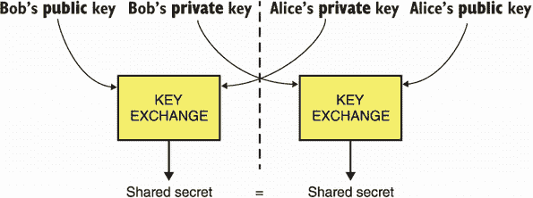
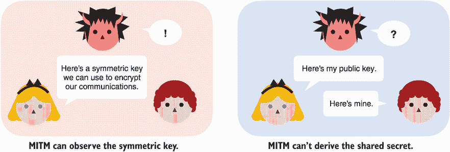
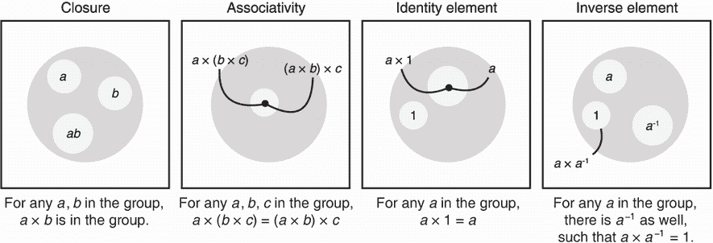
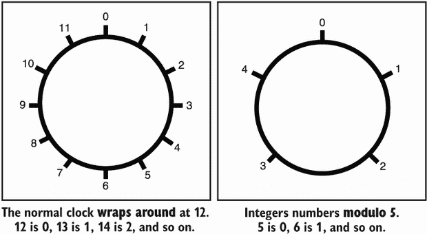
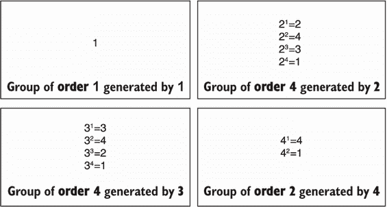
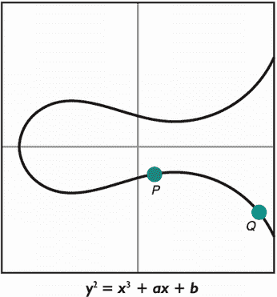
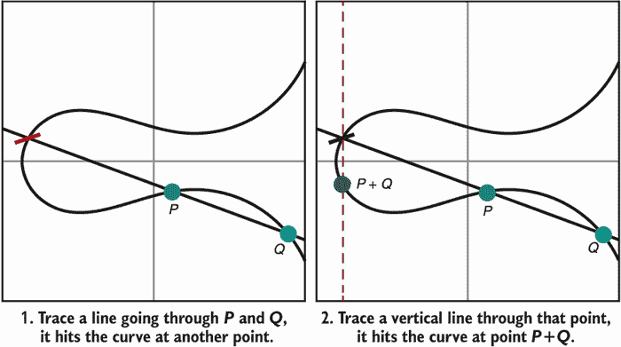
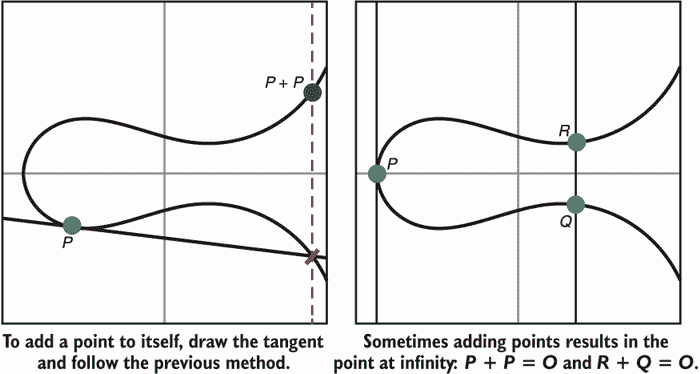
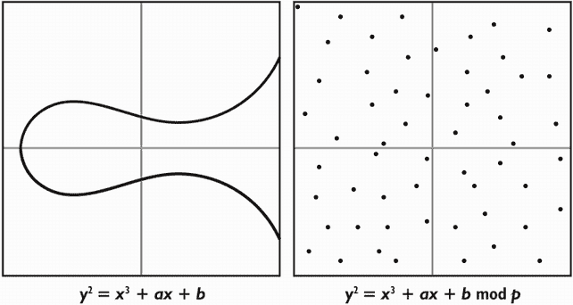
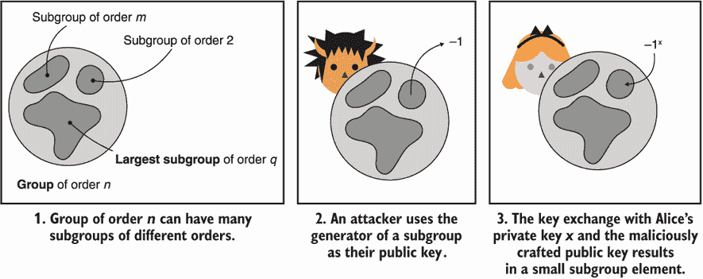

# 5键交流

本章涵盖了

*   什么是关键交换，以及它们如何发挥作用
*   Diffie-Hellman和椭圆曲线Diffie-Hellman密钥交换
*   使用密钥交换时的安全考虑

随着我们的第一个非对称加密原语*密钥交换*，我们现在进入了*非对称加密*(也称为*公钥加密*)的领域。顾名思义，密钥交换就是密钥的交换。例如，Alice发送一把钥匙给Bob，Bob发送一把钥匙给Alice。这允许两个对等体就共享的秘密达成一致，然后可以使用认证的加密算法对通信进行加密。

警告 正如我在这本书的介绍中所暗示的，非对称密码学涉及的数学要多得多；因此，接下来的几章对一些读者来说会有点难。不要气馁！你在这一章学到的东西将有助于理解许多其他基于相同基础的原语。

注 对于本章，你需要阅读第三章关于消息认证码和第四章关于认证加密。

## 5.1什么是密钥交换？

让我们先来看一个场景，爱丽丝和鲍勃都想私下交流，但之前从未交谈过。这将激发在最简单的情况下密钥交换可以解锁什么。

为了加密通信，Alice可以使用你在第4章中学到的认证加密原语。为此，Bob需要知道相同的对称密钥，这样Alice就可以生成一个对称密钥并发送给Bob。之后，他们可以简单地使用密钥来加密他们的通信。但是如果对手在被动地窥探他们的谈话呢？现在对手有了对称密钥，可以解密Alice和Bob发送给对方的所有加密内容！这就是Alice和Bob(以及未来的我们自己)对使用密钥交换感兴趣的地方。通过使用密钥交换，他们可以获得一个被动观察者无法复制的对称密钥。

一个*密钥交换*开始于爱丽丝和鲍勃生成一些密钥。为此，他们都使用密钥生成算法，生成一个*密钥对*:一个私钥(或秘密密钥)和一个公钥。Alice和Bob然后互相发送他们各自的公钥。 *Public* 这里的意思是对手可以观察那些没有后果的人。然后，Alice使用Bob的公钥和她自己的私钥来计算共享密钥。类似地，Bob可以使用他的私钥和Alice的公钥来获得相同的共享秘密。我在图5.1中对此进行了说明。



图5.1密钥交换提供了以下接口:它采用你的对等方的公钥和你的私钥来产生一个共享秘密。您的对等方可以通过使用您的公钥和他们的私钥来获得相同的共享秘密。

从高层次上了解了密钥交换是如何工作的，我们现在可以回到最初的场景，看看这是如何帮助我们的。通过以密钥交换开始他们的通信，Alice和Bob产生了一个共享秘密，用作经过认证的加密原语的密钥。因为任何观察交换的中间人(MITM)对手都无法得到相同的共享秘密，他们将无法解密通信。我在图5.2中对此进行了说明。



图5.2两个参与者之间的密钥交换允许他们就秘密密钥达成一致，而中间人(MITM)对手不能通过被动观察密钥交换来导出相同的秘密密钥。

注意这里的MITM是被动的；一个活跃的T2 MITM可以毫无问题地截获密钥交换并冒充双方。在这次攻击中，Alice和Bob将有效地执行与MITM的密钥交换，两人都认为他们彼此同意一个密钥。这是可能的，因为我们的角色都没有办法验证他们收到的公钥真正属于谁。密钥交换是*未经认证的*！我在图5.3中说明了攻击。


图5.3未经认证的密钥交换容易受到主动MITM攻击者的攻击。事实上，攻击者可以简单地模拟连接的两端，并执行两次单独的密钥交换。

让我们看一个不同的场景来激励*认证密钥交换*。想象一下您想要运行一项服务，为您提供一天中的时间。然而，您不希望这些信息被MITM的对手修改。你最好的办法是使用你在第三章中了解到的消息验证码来验证你的回复。由于MAC需要一个密钥，你可以简单地生成一个，并手动与所有用户共享。但是，任何用户现在都拥有你与其他人一起使用的MAC密钥，并且有一天可能利用它对其他人进行前面讨论的MITM攻击。您可以为每个用户设置不同的密钥，但这也不理想。对于每个想要连接到您的服务的新用户，您需要手动为您的服务和用户提供新的MAC密钥。如果你在服务器端无事可做，那就好得多了，不是吗？

关键交流可以在这里有所帮助！您可以做的是让您的服务生成一个密钥交换密钥对，并向任何新用户提供服务的公钥。这就是所谓的*认证密钥交换*；您的用户知道服务器的公钥，因此，一个活跃的MITM对手无法模拟密钥交换的这一方。但是，恶意用户可以做的是执行他们自己的密钥交换(因为连接的客户端没有经过身份验证)。顺便说一下，当双方都被认证时，我们称之为一个*相互认证的密钥交换*。

这种情况非常普遍，密钥交换原语允许它随着用户的增加而很好地扩展。但是如果服务数量也增加，这个场景就不能很好地扩展！互联网就是一个很好的例子。我们有许多浏览器试图与许多网站安全通信。想象一下，如果你不得不在你的浏览器中硬编码你有一天可能访问的所有网站的公钥，当更多的网站上线时会发生什么？

虽然密钥交换很有用，但如果没有它们的姐妹原语*数字签名*，它们就无法在所有场景中很好地扩展。尽管这只是一个试探。在第七章中，你将了解到新的加密原语，以及它如何帮助扩展系统中的信任。然而，密钥交换在实践中很少被直接使用。它们通常只是更复杂协议的组成部分。也就是说，在某些情况下，它们本身仍然是有用的(例如，正如我们之前看到的对付被动的对手)。

现在让我们看看你*如何*在实践中使用密钥交换密码原语。lib钠是最著名和最广泛使用的C/C++库之一。下面的清单展示了如何在实践中使用lib sona来执行密钥交换。

清单5.1 C中的密钥交换

```
unsigned char client_pk[crypto_kx_PUBLICKEYBYTES];                ❶
unsigned char client_sk[crypto_kx_SECRETKEYBYTES];                ❶
crypto_kx_keypair(client_pk, client_sk);                          ❶

unsigned char server_pk[crypto_kx_PUBLICKEYBYTES];                ❷
obtain(server_pk);                                                ❷

unsigned char decrypt_key[crypto_kx_SESSIONKEYBYTES];             ❸
unsigned char encrypt_key[crypto_kx_SESSIONKEYBYTES];             ❸

if (crypto_kx_client_session_keys(decrypt_key, encrypt_key,
    client_pk, client_sk, server_pk) != 0) {                      ❹
    abort_session();                                              ❺
}
```

❶ 生成客户端的密钥对

❷ 我们假设我们有某种方法可以获得服务器的公钥。

❸lib钠导出两个对称密钥，而不是每个最佳实践一个；每个密钥用于加密一个方向。

❹ 我们用我们的秘密密钥和服务器的公开密钥进行密钥交换。

❺ 如果公钥格式错误，函数返回错误。

libna向开发人员隐藏了许多细节，同时也公开了可安全使用的接口。在这种情况下，lib钠利用了 *X25519密钥交换算法*，你将在本章后面了解更多。在本章的其余部分，您将了解用于密钥交换的不同标准，以及它们是如何工作的。

## 5.2 Diffie-Hellman(DH)密钥交换

1976年，Whitfield Diffie和Martin E. Hellman撰写了他们关于Diffie-Hellman (DH)密钥交换算法的开创性论文，题为《密码学的新方向》多好的标题！DH是第一个发明的密钥交换算法，也是第一个公开密钥加密算法的形式化之一。在这一节中，我将介绍这种算法的数学基础，解释它的工作原理，最后，讨论如何在加密应用程序中使用它的标准。

### 5.2.1群论

DH密钥交换建立在一个叫做*群论*的数学领域之上，它是当今大多数公钥加密的基础。为此，我将在这一章花些时间给你讲群论的基础。我会尽我所能提供关于这些算法如何工作的很好的见解，但没有办法绕过它，将会有一些数学。

让我们从一个显而易见的问题开始:什么是*集团*？这是两件事:

*   一组元素

*   在这些元素上定义的特殊二元运算(如+或×)

如果集合和运算设法满足某些性质，那么我们有一个群。如果我们有一个团队，我们就可以做神奇的事情。。。(稍后将详细介绍)。注意DH在一个*乘法组*中工作:在这个组中乘法被用作定义的二进制运算。由于这个原因，其余的解释使用乘法群作为例子。我也会经常省略×符号(比如我会把 *a* × *b* 写成 *ab* 来代替)。

我需要在这里说得更具体一点。要使集合及其操作成为一个组，它们需要以下属性。(像往常一样，我在图5.4中以更直观的方式说明了这些属性，以便为您掌握这个新概念提供更多的材料。)

*   *闭包*—对两个元素进行操作会产生同一集合中的另一个元素。例如，对于组中的两个元素 *a* 和 *b* , *a* × *b* 产生另一个组元素。

*   *结合性*—一次对几个元素的操作可以以任何顺序进行。例如，对于组中的三个元素 *a* 、 *b* 和 *c* ，那么 *a* ( *bc* )和( *ab* ) *c* 产生相同的组元素。

*   *恒等元素*—与一起运算该元素不改变另一个操作数的结果。例如，我们可以在乘法群中将单位元定义为1。对于任意群元素 *a* ，我们有 *a* × 1 = *a* 。

*   *逆元素*—作为所有组元素的逆元素存在。例如，对于任何一个组元素 *a* ，都有一个逆元素*a*<sup class="fm-superscript1">–1</sup>(也写成1/ *a* )使得*a*×*a*<sup class="fm-superscript1">–1</sup>= 1(也写成 *a* × 1/ *a* = 1)。



图5.4一个群的四个性质:闭包、结合律、单位元、逆元。

可以想象我对一个团体的解释可能有点抽象，那么我们来看看DH在实践中用什么来作为一个团体。首先，DH使用一个由严格正整数集合组成的组:1，2，3，4，，*p*–1，其中 *p* 是一个质数，1是单位元。不同的标准为 *p* 指定了不同的数字，但是直觉上，它必须是一个大的质数才能保证群组的安全。

质数

一个*质数*是一个只能被1或它本身整除的数。第一个质数是2、3、5、7、11等等。素数在非对称密码中无处不在！幸运的是，我们有有效的算法来寻找大的。为了加快速度，大多数密码库会转而在中寻找*伪素数*(很有可能是素数的数字)。有趣的是，这样的优化在过去被打破过几次；最臭名昭著的事件发生在2017年，当时ROCA漏洞发现了超过100万台设备为其加密应用程序生成不正确的素数。

其次，DH使用*模乘*作为特殊的运算。在我解释什么是模乘之前，我需要解释一下什么是*模运算*。直观地说，模运算是关于“环绕”超过某个数的数，该数被称为*模数*。例如，如果我们设置模数为5，我们说超过5的数字回到1；比如6变成1，7变成2，以此类推。(我们也把5记为0，但是因为它不在我们的乘法群中，所以我们并没有太在意它。)

表示模运算的数学方式是用模数取一个数的*余数*和它的*欧几里德除法*。让我们以数字7为例，把它与5的欧几里德除法写成7 = 5 × 1 + 2。注意余数是2。然后我们说7 = 2 mod 5(有时写成7 ≡ 2 (mod 5))。这个等式可以理解为7等于2的模5。类似地

*   8 = 1 对 7

*   54 = 2 对 13

*   170 = 0 对 17

*   以此类推

描绘这样一个概念的经典方式是用时钟。图5.5说明了这个概念。



图5.5以质数5为模的整数群可以被形象化为一个在数字4之后重置为0的时钟。因此，5表示为0，6表示为1，7表示为2，8表示为3，9表示为4，10表示为0，依此类推。

在这样一组数上定义模乘是很自然的。让我们以下面的乘法为例:

3 × 2 = 6

根据您之前所学，您知道6等于1的模5，因此等式可以改写为:

3 × 2 = 1 对 5

很简单，不是吗？注意，前面的等式告诉我们，3是2的倒数，反之亦然。我们也可以这样写:

3<sup class="fm-superscript1">–1</sup>= 2修改 5

当上下文清楚时，模数部分(此处为mod 5)通常从等式中省略。因此，如果我在本书中有时省略了它，请不要感到惊讶。

注 恰好当我们用正数对一个质数取模时，只有*零*元素缺少一个逆。(的确，你能找到一个元素 *b* 使得0 × *b* = 1 mod 5吗？)这就是为什么我们不把零作为组中的一个元素。

好了，我们现在有了一个组，它包括一组严格正整数1，2，，*p*–1代表一个质数 *p* ，以及模乘。我们组成的团体也恰好是两件事:

*   *可交换的*—运算的顺序无关紧要。比如给定两个组元素 *a* 和 *b* ，那么 *ab* = *ba* 。具有这种性质的群通常称为*伽罗瓦群*。

*   *一个有限域*—一个伽罗瓦群有更多的性质，以及一个额外的运算(在我们的例子中，我们也可以把数加在一起)。

由于最后一点，定义在这类群上的DH有时被称为*有限域Diffie-Hellman* (FFDH)。如果你理解了什么是组(并确保你在进一步阅读之前理解了)，那么*子组*就是包含在你的原始组中的组。也就是说，它是组元素的子集。对子群的元素进行运算会产生另一个子群元素，并且每个子群元素在该子群中都有一个逆元素，依此类推。

一个*循环子群*是一个可以从单个*生成器*(或*基*)生成的子群。生成器通过一次又一次地自我相乘来生成循环子群。例如，生成器4定义了由数字1和4组成的子组:

*   4 对 5 = 4

*   4 × 4 对 5 = 1

*   4 × 4 × 4 mod 5 = 4(我们再从头开始)

*   4×4×4对 5 = 1

*   以此类推

注我们也可以把4 × 4 × 4写成43。

碰巧当我们的模是质数时，我们群的每个元素都是一个子群的生成元。这些不同的子群可以有不同的大小，我们称之为*级*。我在图5.6中说明了这个。



图5.6模5乘法群的不同子群。这些都包括数字1(称为*标识元素*)并且具有不同的顺序(元素数量)。

好吧，你现在明白了

*   一个组是一组具有二元运算的数字，它遵循一些属性(闭包、结合律、单位元素、逆元素)。

*   DH在伽罗瓦群(一个具有交换性的群)中工作，伽罗瓦群是由一组直到一个素数(不包括)的严格正数和模乘形成的。

*   在一个DH群中，每个元素都是一个子群的生成元。

组是大量不同密码原语的中心。如果你想了解其他密码原语是如何工作的，对群论有良好的直觉是很重要的。

### 5.2.2离散对数问题:Diffie-Hellman的基础

DH密钥交换的安全性依赖于一组中的*离散对数问题*，这个问题相信很难解决。在这一节，我简单介绍一下这个问题。

想象一下，我拿一个生成器，比方说3，给你一个它能生成的元素中的随机元素，比方说2 = 3<sup class="fm-superscript2">x</sup>T3】mod5对于一些你不知道的 *x* 。问你“什么是 *x* ？”和让你求以3为底的2的离散对数是一样的。因此，我们组中的离散对数问题是关于找出为了产生给定的组元素，我们将发生器与自身相乘多少次。这是一个重要的概念！在继续之前，花几分钟时间思考一下。

在我们的例子组中，你可以很快发现3就是答案(确实，3 <sup class="fm-superscript1">3</sup> = 2 mod 5)。但是如果我们选择一个比5大得多的质数，事情就会变得复杂得多:它变得很难解决。这是Diffie-Hellman背后的秘制酱料。现在，您已经了解了如何在DH中生成密钥对:

1.  所有参与者必须就一个大素数 *p* 和一个生成元 *g* 达成一致。

2.  每个参与者产生一个随机数 *x* ，这个随机数成为他们的私钥。

3.  每个参与者得到他们的公钥为*g*T3】xT5】modT7】p。

离散对数问题是*难*的事实意味着没有人能够从公钥中恢复出私钥。我在图5.7中对此进行了说明。


图5.7在Diffie-Hellman中选择私钥就像在生成器 *g* 产生的数字列表中选择一个索引。离散对数问题就是单从数上求指数。

虽然我们有计算离散对数的算法，但它们在实践中效率不高。另一方面，如果我给你这个问题的解 *x* ，你有非常有效的算法来检查，确实，我给你提供了正确的解:*g*<sup class="fm-superscript2">x</sup>mod*p*。如果你感兴趣的话，计算模幂运算的最新技术叫做*平方乘*。这通过逐位遍历 *x* 来有效地计算结果。

注 就像密码学中的一切一样，*不是不可能*通过简单的尝试猜测找到解决方案。然而，通过选择足够大的参数(这里是一个大的质数)，有可能将这种寻找解的效率降低到可以忽略的几率。这意味着，即使经过数百年的随机尝试，你找到解决方案的几率在统计学上仍应接近于零。

很好。我们如何将所有这些数学知识用于我们的DH密钥交换算法？想象一下

*   爱丽丝有一个私钥 *a* 和一个公钥*A*=*g*<sup class="fm-superscript2">A</sup>mod*p*。

*   鲍勃有一个私钥 *b* 和一个公钥*B*=*g*<sup class="fm-superscript2">B</sup>mod*p*。

知道了鲍勃的公钥，爱丽丝可以计算出共享秘密为*B*T3】aT5】modT7】p。Bob可以用Alice的公钥和自己的私钥做类似的计算:*A*T11】bT13】modT15】p。自然，我们可以看到这两个计算最终计算出相同的数字:

*b*<sup class="fm-superscript2">a</sup>=*g*<sup class="fm-superscript2">b</sup>)<sup class="fm-superscript2">a</sup>=

 *这就是DH的神奇之处。从局外人的角度来看，仅仅观察公钥 *A* 和 *B* 对计算密钥交换的结果*g*T7】abT9】modT11】p没有任何帮助。接下来，您将了解现实世界的应用程序如何利用这种算法以及现有的不同标准。

计算和决策迪菲-海尔曼

顺便说一下，在理论密码学中，观察*g*<sup class="fm-superscript3">a</sup>mod*p*和*g*<sup class="fm-superscript3">b</sup>mod*p*并不能帮助你计算*g*<sup class="fm-superscript3">ab</sup>mod*p*的想法被称为*计算Diffie-Hellman它经常与更强的*决策性迪菲-赫尔曼假设* (DDH)相混淆，后者直观地陈述了给定*g*<sup class="fm-superscript3">a</sup>mod*p*、*g*<sup class="fm-superscript3">b</sup>mod*p*和*z*mod*p*，没人两者都是有用的理论假设，已经被用来建立许多不同的加密算法。*

### Diffie-Hellman标准

现在你已经看到了DH是如何工作的，你可以理解参与者需要就一组参数达成一致，具体来说就是一个质数 *p* 和一个生成器 *g* 。在这一节中，您将了解实际应用程序如何选择这些参数以及现有的不同标准。

第一件事首先是质数 *p* 。正如我之前所说的，越大越好。因为DH是基于离散对数问题的，所以它的安全性与已知的对该问题的最佳攻击直接相关。这方面的任何进展都可能削弱算法。随着时间的推移，我们对这些进步有多快(或多慢)以及多少才算足够安全有了一个相当好的认识。目前已知的最佳实践是使用2048位的素数。

注 一般情况下，总结了常用密码算法的参数长度建议。这些结果取自研究小组或政府机构如ANSSI(法国)、NIST(美国)和BSI(德国)的权威文件。虽然他们并不总是一致，但他们往往会接近类似的数量级。

过去很多库和软件经常会生成并硬编码自己的参数。不幸的是，有时发现它们要么很脆弱，要么更糟，完全坏掉了。2016年，有人发现一个流行的命令行工具Socat在一年前用一个损坏的DH组修改了他们的默认DH组，这提出了一个问题，这是一个错误还是一个故意的后门。使用标准化的DH群体似乎是一个更好的主意，但是DH是一个不幸的反例。Socat发布后仅几个月，Antonio Sanso在阅读RFC 5114时，发现该标准也指定了断裂的DH组。

由于所有这些问题，较新的协议和库已经趋向于放弃DH而支持椭圆曲线Diffie-Hellman (ECDH)，或者使用在更好的标准RFC 7919()中定义的组。因此，现在的最佳实践是使用RFC 7919，它定义了几个不同大小和安全性的组。例如，ffdhe2048是由2，048位质数模定义的组:

*p*= 323170060713110073001535134778251334890751745843139269806834136210002792053626264016468

54585563579353308169288290230805734726252735547424612457410262025279165729728627063003252634282131457669 jin

31414223654220941111348629991657478268034230553086349050635557712219187890332729569696129743856241741236 jin

23722519734640269185579776797682301462539793305801522685873076119753243646747585546071504389684494036613 jin

04976978128542959586595975670512838521327844685229255045682728791137200989318739591433741758378260002780 jin

34973198552060607533234122603254684088120031105907484281003994966956119696956248629032338072839127039 jin

与发电机 *g* = 2

注意通常选择数字2作为生成器，因为计算机使用简单的左移(`<<`)指令与2相乘非常有效。

组大小(或*顺序*)也被指定为*q*=(*p*–1)/2。这意味着私钥和公钥的大小都在2048位左右。实际上，这些对于密钥来说是非常大的(例如，与通常128位长的对称密钥相比)。您将在下一节中看到，在椭圆曲线上定义一个群允许我们获得小得多的密钥来获得相同的安全性。

## 5.3椭圆曲线Diffie-Hellman (ECDH)密钥交换

原来我们刚才讨论的DH算法，可以在不同类型的群中实现，而不仅仅是模一个素数的乘法群。事实证明，一个群可以由椭圆曲线组成，椭圆曲线是数学中研究的一种曲线。这个想法是由Neal Koblitz和Victor S. Miller在1985年独立提出的，后来在2000年，当基于椭圆曲线的加密算法开始标准化时，它被采用。

应用密码学领域很快采用了椭圆曲线加密，因为它提供的密钥比上一代公钥加密小得多。与DH中推荐的2，048位参数相比，使用算法的椭圆曲线变体，256位的参数是可能的。

### 什么是椭圆曲线？

我们现在来解释椭圆曲线是如何工作的。首先，明白椭圆曲线只是曲线就好！这意味着它们由所有解方程的坐标 *x* 和 *y* 定义。具体来说，这个等式

*和*<sup class="fm-superscript1">【2】</sup>+*【a】*<sub class="fm-subscript">**【xy】*+*</sub>

对于某些*a*T3】1，*a*T7】2，*a*T11】3，*a*T15】4，以及*a*T19】6。注意，对于今天大多数实际的曲线，这个方程可以简化为*短Weierstrass方程*:

*和**=*<sup class="fm-superscript1"><sup class="fm-superscript1">*【ax】*+*【b】*(其中4)】</sup></sup>**

 *虽然两种类型的曲线(称为*二元曲线*和*特性3* 的曲线)无法简化，但这些曲线很少使用，因此我们将在本章的剩余部分使用Weierstrass形式。图5.8给出了一个随机取两点的椭圆曲线的例子。



图5.8由方程定义的椭圆曲线的一个例子。

在椭圆曲线历史的某个时刻，人们发现可以在椭圆曲线上构造一个*群*。从那以后，在这些组上实现DH就变得简单了。我将用这一节来解释椭圆曲线加密背后的直觉。

椭圆曲线上的群通常被定义为*加群*。与上一节定义的乘法组不同，这里使用的是+号。

注 使用加法还是乘法在实践中并没有太大关系，只是偏好问题。虽然大多数密码学都使用乘法符号，但围绕椭圆曲线的文献都倾向于加法符号，因此，这就是我在本书中提到椭圆曲线群时将使用的符号。

这次，我将在定义组的元素之前定义操作。我们的*加法运算*定义如下。图5.9说明了这一过程。

1.  穿过你想要添加的两点画一条线。这条线与曲线相交于另一点。

2.  从这个新发现的点画一条垂直线。垂直线与曲线相交于另一点。

3.  这个点是把原来的两点加在一起的结果。



图5.9可以使用几何学在椭圆曲线的点上定义加法运算。

这条规则在两种特殊情况下不适用。让我们也来定义这些:

*   *我们如何给自己加一个点？*答案是画该点的切线(而不是在两点之间画一条线)。

*   *如果我们在第一步(或第二步)画的线没有碰到曲线的任何其他点会怎么样？*嗯，这很尴尬，我们需要这个特例来工作并产生一个结果。解决方法是将结果定义为一个虚构点(我们虚构的东西)。这个新发明的点叫做无穷远处的*点*(我们通常用大写字母 *O* 来写)。图5.10说明了这些特殊情况。



图5.10在图5.9的基础上，当向自身增加一个点或当两个点相互抵消产生无穷远点时，椭圆曲线上的加法也被定义( *O* )。

我知道无穷远处的这个点有些古怪，但是不要太担心。这实际上只是我们为了使加法运算有效而想出来的东西。哦，顺便说一下，它的行为就像一个零，它是我们的身份元素:

*O*+*O*=*O*

和曲线上任意一点 *P*

*P*+*O*=*P*

一切都好。到目前为止，我们看到要在椭圆曲线上创建一个组，我们需要

*   定义一组有效点的椭圆曲线方程。

*   本集合中加法含义的定义。

*   被称为无穷远点的假想点。

我知道要解开的信息很多，但我们遗漏了最后一件事。椭圆曲线加密利用了前面讨论过的在有限域*上定义的群的类型*。实际上，这意味着我们的坐标是数字1，2，，*p*–1，代表某个大质数 *p* 。这听起来应该很耳熟吧！因此，当考虑椭圆曲线加密时，你应该想到一个更像图5.11右边的图。



图5.11椭圆曲线密码(ECC)实际上大多是用坐标中的椭圆曲线指定模一个大素数 *p* 。这意味着我们在密码学中使用的东西看起来更像右图，而不是左图。

就这样！我们现在有了一个可以进行加密的群，就像我们有了一个用数字(不包括0)模素数和Diffie-Hellman乘法运算组成的群一样。用这个定义在椭圆曲线上的群怎么做Diffie-Hellman？让我们看看*离散对数*现在在这个组中是如何工作的。

让我们用一个点 *G* 加上它自身的 *x* 倍，通过我们定义的加法运算产生另一个点 *P* 。我们可以把它写成*P*=*G*++*G*(*x*倍)或者用一些数学语法糖把它写成*P*=[*x*]*G*，结果是 *x* 乘以 *G* 。*椭圆曲线离散对数问题* (ECDLP)就是只知道 *P* 和 *G* 就能求出数 *x* 。

注我们称[*x**G*标量乘为 *x* 在这样的群中通常称为标量。

### 椭圆曲线Diffie-Hellman (ECDH)密钥交换是如何工作的？

现在我们在椭圆曲线上建立了一个群，我们可以在上面实例化同样的Diffie-Hellman密钥交换算法。要在ECDH中生成密钥对:

1.  所有参与者同意一个椭圆曲线方程、一个有限域(很可能是一个素数)和一个生成器 *G* (通常在椭圆曲线密码中称为*基点*)。

2.  每个参与者产生一个随机数 *x* ，这个随机数成为他们的私钥。

3.  每个参与者得到他们的公钥为[*x*]*G*。

因为椭圆曲线离散对数问题比较难，你猜对了，应该没有人仅仅通过看你的公钥就能恢复你的私钥。我在图5.12中对此进行了说明。


图5.12在ECDH选择私钥就像在生成器(或基点)产生的数字列表中选择一个索引 *G* 。椭圆曲线离散对数问题(ECDLP)是仅从数中求指数。

所有这些可能有点令人困惑，因为我们为DH组定义的运算是乘法，而对于椭圆曲线，我们现在使用加法。同样，这些区别根本无关紧要，因为它们是等价的。你可以在图5.13中看到一个比较。


图5.13 Diffie-Hellman中使用的群和椭圆曲线Diffie-Hellman (ECDH)中使用的群之间的一些比较。

现在你应该相信，对密码学来说，唯一重要的事情是我们有一个用它的运算定义的群，并且这个群的离散对数是很难的。作为补充，图5.14显示了我们所看到的两类群体中的离散对数问题的区别。


图5.14模大素数的离散对数问题和椭圆曲线密码(ECC)中的离散对数问题的比较。它们都与DH密钥交换有关，因为问题是从公钥中找到私钥。

关于理论的最后一点，我们在椭圆曲线上形成的群不同于我们用模素数的严格正整数形成的群。由于这些差异中的一些，已知的针对DH的最强攻击(称为*指数演算*或*数域筛选*攻击)在椭圆曲线群上不能很好地工作。这就是在相同安全级别下，ECDH的参数可以比DH的参数低得多的主要原因。

好了，我们已经完成了这个理论。让我们回头来定义ECDH。想象一下

*   爱丽丝有一个私钥 *a* 和一个公钥*A*=【*A*】*G*。

*   鲍勃有一个私钥 *b* 和一个公钥 *B* = [ *b* ] *G* 。

知道了Bob的公钥，Alice可以计算出共享秘密为[ *a* ] *B* 。Bob可以用Alice的公钥和他自己的私钥进行类似的计算:[ *b* ] *A* 。自然，我们可以看到这两个计算最终计算出相同的数字:

*A**B*=*A**B**G*=*ab**G*=*B*]*A**G*=*B**A*

任何被动的对手都不能仅仅通过观察公钥来获得共享点。看起来很眼熟，对吧？接下来说标准。

### 5.3.3椭圆曲线的标准Diffie-HellmanT2】

*自1985年首次提出以来，椭圆曲线加密一直保持着它的全部实力。[.。。美国、英国、加拿大和某些其他北约国家都已经为未来的系统采用了某种形式的椭圆曲线加密技术，以保护政府内部和政府之间的机密信息*。

—美国国家安全局(“椭圆曲线加密的案例”，2005年)

ECDH的标准化相当混乱。许多标准化团体已经致力于指定大量不同的曲线，随后是许多关于哪条曲线更安全或更有效的激烈争论。主要由丹尼尔·j·伯恩斯坦(Daniel J. Bernstein)领导的大量研究指出，NIST标准化的许多曲线可能是只有美国国家安全局知道的较弱曲线类别的一部分。

*我不再信任常数。我相信国家安全局通过他们与工业界的关系操纵了他们*。

—布鲁斯·施奈尔(“美国国家安全局正在破解互联网上的大多数加密技术”，2013年)

如今，大多数使用中的曲线来自两个标准，大多数应用都集中在两条曲线上:P-256和Curve25519。在本节的其余部分，我将检查这些曲线。

NIST·FIPS 186-4，“数字签名标准”，最初于2000年作为签名标准发布，包含一个附录，规定了在ECDH使用的15种曲线。其中一条曲线P-256是互联网上使用最广泛的曲线。在2010年以不同的名称secp256r1发布的高效加密标准(SEC) 2，v2“推荐的椭圆曲线域参数”中也规定了该曲线。P-256由简短的Weierstrass方程定义:

*和*<sup class="fm-superscript1">【2】</sup>=*<sup class="fm-superscript1"><sup class="fm-superscript1">*【ax】*+*【b】*</sup></sup>*

 *其中*a*=–3和

*b*= 410583637251521421293261297800472684091144410159372555483525314039467401291

和

*p*= 2<sup class="fm-superscript1">256</sup>–2<sup class="fm-superscript1">224</sup>+2<sup class="fm-superscript1">192</sup>+2<sup class="fm-superscript1">96</sup>–1

这定义了素数阶曲线:

*n*= 1157920892103562487626974469494075352413576034242259061068512044369

表示曲线上正好有 *n* 个点(包括无穷远点)。基点被指定为

*G*=(484395612939064517590525852527979142027629495260417082404635286，361342509567497957951279195858857887878788788878888878887888888888887888888888888888788888888888888888

该曲线提供了128位的安全性。对于使用提供256位安全而非128位安全的其他加密算法的应用(例如，具有256位密钥的AES)，P-521可用于相同的标准以匹配安全级别。

我们能相信P-256吗？

有趣的是，P-256和FIPS 186-4中定义的其他曲线据说是从一个*种子*中生成的。对于P-256，种子是字节串

0xc 49d 360886 e 704936 a 6678 e 1139d 26 b 7819 f7e 90

我之前谈到过“无中生有”数字的概念——旨在证明算法设计没有后门的常数。不幸的是，P-256种子背后没有太多的解释，除了它是沿着曲线的参数指定的这一事实。

2016年发布的RFC 7748“安全椭圆曲线”规定了两条曲线:Curve25519和Curve448。Curve25519提供大约128位的安全性，而Curve448提供大约224位的安全性，用于想要对冲针对椭圆曲线的攻击状态的潜在进展的协议。这里我只讲曲线25519，它是一条蒙哥马利曲线，由下式定义:

*和**=*<sup class="fm-superscript1"><sup class="fm-superscript1">+48662</sup>+</sup>**

 *Curve25519有订单

*n*= 2<sup class="fm-superscript1">252</sup>+27742317777372353535819377908364433

所用的基点是

*G* = (9，1478161944758954479102059356840986887264606134616475288964881837755586237401)。

ECDH和Curve25519的组合通常被称为 *X25519* 。T6】

## 5.4小型子群攻击和其他安全注意事项

今天，*我会建议你使用ECDH而不是DH* ，因为密钥的大小，缺乏已知的强攻击，可用实现的质量，以及椭圆曲线是固定的和很好标准化的事实(与到处都是DH组相反)。后一点相当重要！使用DH意味着潜在地使用不完整的标准(如前面提到的RFC 5114)、过于宽松的协议(许多协议，如旧版本的TLS，不强制要求使用什么DH组)、使用不完整的自定义DH组的软件(前面提到的socat问题)等等。

如果你不得不使用Diffie-Hellman，确保遵守标准。我之前提到的标准使用安全素数作为模数:形式为 *p* = 2 *q* + 1的素数，其中 *q* 是另一个素数。关键是这种形式的组只有两个子组:一个大小为2的小组(由–1生成)和一个大小为 *q* 的大组。(顺便说一句，这是你能得到的最好的了；DH中不存在素数阶群。)小子群的稀少防止了一种被称为*小子群攻击*的攻击(稍后将详细介绍)。安全素数创建安全组有两个原因:

*   模素数的乘法群的阶 *p* 计算为p–1。

*   群的子群的阶是群的阶的因子(这就是拉格朗日定理)。

因此，我们的乘法群模一个安全素数的阶是*p*–1 =(2*q*+1)–1 = 2*q*有因子2和 *q* ，这意味着它的子群只能是阶2或 *q* 。在这样的群体中，小的子群体攻击是不可能的，因为没有足够的小的子群体。*小组攻击*是一种对密钥交换的攻击，攻击者发送几个无效的公钥来逐渐泄露您的私钥位，其中无效的公钥是小组的生成器。

例如，攻击者可以选择–1(规模为2的子组的生成器)作为公钥，并将其发送给您。通过完成您的部分密钥交换，产生的共享秘密是小组的一个元素(–1或1)。这是因为您刚刚将小的子组生成器(攻击者的公钥)提升到了您的私钥的幂。根据您对该共享秘密的处理，攻击者可能会猜出它是什么，并泄露一些关于您的私钥的信息。

在我们恶意公钥的例子中，如果您的私钥是偶数，那么共享密钥就是1，如果您的私钥是奇数，那么共享密钥就是–1。结果，攻击者获得了一点信息:您的私钥的最低有效位。许多不同大小的子组会导致攻击者有更多的机会了解您的私钥，直到整个密钥被恢复。我在图5.15中说明了这个问题。



图5.15小型子群攻击会影响拥有许多子群的DH群。通过选择小组的生成器作为公钥，攻击者可以一点一点地泄露某人的私钥。

虽然验证您收到的公钥是否在正确的子组中总是一个好主意，但并不是所有的实现都这样做。2016年，一组研究人员分析了20种不同的DH实现，发现没有一种实现是验证公钥的(参见Valenta等人的“测量针对Diffie-Hellman的小型子组攻击”),请确保您正在使用的DH实现做到了！您可以通过将公钥提升到子组的顺序来做到这一点，如果identity元素是该子组的一个元素，那么它应该会返回给您。

另一方面，椭圆曲线允许素数阶的群。也就是说，它们没有小的子群(除了由identity元素生成的大小为1的子群之外)，因此，它们对于小的子群攻击是安全的。嗯，没那么快。。。在2000年，Biehl、Meyer和Muller发现，由于被称为*无效曲线攻击*的攻击，即使在这样的素数阶椭圆曲线群中，小子群攻击也是可能的。

无效曲线攻击背后的想法如下。首先，对于使用短维尔斯特拉斯方程*y*T3】2=*x*T7】3+*ax*+*b*(像NIST的P-256)的椭圆曲线，实现标量乘法的公式与变量 *b* 无关。这意味着攻击者可以找到除了值 *b* 之外的具有相同方程的不同曲线，并且这些曲线中的一些会有许多小的子群。您可能知道这是怎么回事:攻击者在另一条曲线上选择一个展示小组的点，并将其发送到目标服务器。服务器通过对给定点执行标量乘法来继续密钥交换，实际上是在不同的曲线上进行密钥交换。这个技巧最终重新启用了小组攻击，即使是在素数阶曲线上。

解决这个问题的显而易见的方法是再次验证公钥。这可以通过检查公共密钥是否不是无穷远处的点，以及通过将接收到的坐标插入曲线方程以查看它是否描述了定义的曲线上的点来容易地完成。不幸的是，2015年，Jager、Schwenk和Somorovsky在“对TLS-ECDH的实际无效曲线攻击”中表明，几个流行的实现没有执行这些检查。如果使用ECDH，我会建议您使用X25519密钥交换，这是由于设计的质量(它考虑了无效曲线攻击)、可用实现的质量以及设计对定时攻击的抵抗力。

虽然Curve25519有一个警告——它不是一个素数阶群。该曲线有两个子组:一个大小为8的小组和一个用于ECDH的大小组。最重要的是，最初的设计没有规定验证收到的点，反过来，库也没有实现这些检查。这导致在不同类型的协议中发现问题，这些协议以更奇特的方式使用原语。(其中一个是我在矩阵消息协议中发现的，我将在第11章中讨论。)

不验证公钥可能会导致X25519出现意外行为。原因是密钥交换算法没有*贡献行为*:它不允许双方对密钥交换的最终结果做出贡献。具体来说，参与者之一可以通过发送小组中的一个点作为公钥来强制密钥交换的结果为全零。RFC 7748确实提到了这个问题，并建议检查产生的共享秘密是否是全零输出，但让实现者决定是否进行检查！我建议确保您的实现执行检查，尽管您不太可能遇到任何问题，除非您以非标准的方式使用X25519。

由于许多协议依赖于Curve25519，这已经不仅仅是密钥交换的问题。 *Ristretto* ，即将成为RFC的互联网草案，是一种在Curve25519上增加额外一层编码的构造，有效地模拟了素数阶的曲线(参见[https://tools . IETF . org/html/draft-hdevalence-cfrg-Ristretto-01](https://tools.ietf.org/html/draft-hdevalence-cfrg-ristretto-01))。这种构造越来越受欢迎，因为它简化了其他类型的加密原语所做的安全假设，这些原语希望从Curve25519中受益，但需要素数阶字段。

## 总结

*   未经认证的密钥交换允许双方就共享秘密达成一致，同时防止任何被动的中间人(MITM)攻击者也能够得到它。

*   一个认证的密钥交换防止一个活动的MITM冒充连接的一端，而一个相互认证的密钥交换防止一个活动的MITM冒充连接的两端。

*   一方可以通过知道另一方的公钥来执行认证密钥交换，但这并不总是可扩展的，签名将解锁更复杂的场景(见第7章)。

*   Diffie-Hellman (DH)是第一个被发明的密钥交换算法，至今仍被广泛使用。

*   DH使用的推荐标准是RFC 7919，其中包括几个可供选择的参数。最小的选项是推荐的2，048位prime参数。

*   椭圆曲线Diffie-Hellman (ECDH)的密钥长度比DH小得多。对于128位安全性，DH需要2048位参数，而ECDH需要256位参数。

*   ECDH最广泛使用的曲线是P-256和Curve25519。两者都提供128位的安全性。对于256位安全性，P-521和Curve448采用相同的标准。

*   确保实现验证您收到的公钥的有效性，因为无效密钥是许多错误的根源。****