# 6 不对称加密和混合加密

本章涵盖了

*   非对称加密将秘密加密成公钥
*   混合加密将数据加密为公钥
*   非对称和混合加密的标准

在第 4 章中，你学习了认证加密，这是一种用于加密数据的加密原语，但受限于它的对称性(连接的两端必须共享相同的密钥)。在这一章中，我将通过引入非对称加密来解除这一限制，这是一种在不知道密钥的情况下对他人的密钥进行加密的原语。毫无疑问，非对称加密使用密钥对，加密将使用公钥而不是对称密钥。

本章进行到一半时，您将看到非对称加密受到它可以加密的数据大小和加密速率的限制。为了消除这个障碍，我将向您展示如何将非对称加密与认证加密混合起来，形成我们所说的*混合加密*。我们开始吧！

注意 对于这一章，你需要阅读第四章关于认证加密和第五章关于密钥交换。

## 6.1 什么是非对称加密？

了解如何加密消息的第一步是了解*非对称加密*(也叫*公钥加密*)。在本节中，您将了解这个加密原语及其属性。我们来看看下面的现实场景:*加密邮件*。

你可能知道你发送的所有邮件都是“明文”发送的，任何人都可以在你和收件人的邮件提供商之间阅读。这可不好。你怎么解决这个问题？你可以使用像 AES-GCM 这样的加密原语，你会在第 4 章学到。为此，您需要为每个想要给您发送消息的人设置不同的共享对称秘密。

运动

对每个人使用相同的共享秘密是非常糟糕的；你能看出为什么吗？

但是你不能指望提前知道谁会想要给你发信息，而且随着越来越多的人想要给你的信息加密，生成和交换新的对称密钥将变得单调乏味。这就是非对称加密的作用，它允许任何拥有你的公钥的人给你的消息加密。此外，您是唯一能够使用只有您拥有的相关私钥解密这些消息的人。请参见图 6.1，了解不对称加密的图示。

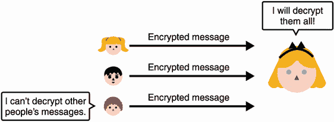

图 6.1 有了非对称加密，任何人都可以用爱丽丝的公钥给她发送加密的消息。只有拥有相关私钥的 Alice 才能解密这些消息。

要设置非对称加密，首先需要通过某种算法生成一个密钥对。与加密算法的任何设置函数一样，密钥生成算法接受安全参数。这个安全参数通常解释为“您希望您的密钥有多大？”越大意味着越安全。图 6.2 说明了这一步。

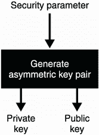

图 6.2 要使用非对称加密，首先需要生成一个密钥对。根据您提供的安全参数，您可以生成不同安全强度的密钥。

*密钥生成算法*生成一个由两个不同部分组成的密钥对:公钥部分(顾名思义)可以发布和共享，而私钥必须保密。类似于其他密码原语的密钥生成算法，需要一个安全参数来决定算法的位安全性。然后，任何人都可以使用公钥部分来加密消息，而您可以使用私钥部分来解密，如图 6.3 所示。与认证解密类似，如果出现不一致的密文，解密可能会失败。

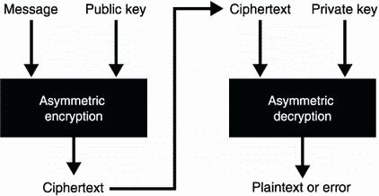

图 6.3 非对称加密允许使用接收方的公钥对消息(*明文*)进行加密。然后，接收者可以使用不同的算法，使用与之前使用的公钥相关的私钥来解密加密的消息(*密文*)。

请注意，到目前为止，我们还没有谈到认证。考虑电线的两端:

*   你正在加密一个你认为属于爱丽丝的公钥。

*   爱丽丝不确定是谁发了这条信息。

现在，我们将想象我们以一种真正安全的方式获得了 Alice 的公钥。在涵盖数字签名的第 7 章中，您将了解现实世界的协议如何在实践中解决这个引导问题。你还将在第七章中学习如何用加密的方式向爱丽丝传达你的真实身份。剧透:你会在你的信息上签名。

让我们继续下一节，您将了解不对称加密在实践中是如何使用的(以及为什么在实践中很少按原样使用)。

## 6.2 实践中的非对称加密和混合加密

你可能会想，不对称加密可能足以开始加密你的电子邮件了。实际上，非对称加密非常有限，因为它可以加密的消息长度有限。与对称加密相比，非对称加密和解密的速度也很慢。这是由于实现数学运算的非对称结构，与通常只处理位的对称原语相反。

在本节中，您将了解这些限制，非对称加密在实践中的实际用途，以及加密如何克服这些障碍。对于不对称加密的两种主要使用情形，本节分为两部分:

*   *密钥交换*—您将看到使用非对称加密原语执行密钥交换(或密钥协商)是非常自然的。

*   *混合加密*—您将看到，由于您可以加密的最大容量，非对称加密的使用案例非常有限。为了加密更大的消息，您将了解一个更有用的原语，叫做*混合加密*。

### 6.2.1 密钥交换和密钥封装

事实证明，非对称加密可以用来进行密钥交换——就像我们在第五章中看到的那种！为了做到这一点，你可以从生成一个对称密钥开始，并用 Alice 的公钥加密它——我们也称之为*封装一个密钥*——如图 6.4 所示。

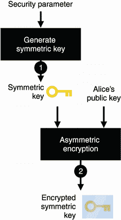

图 6.4 要使用非对称加密作为密钥交换原语，您需要(1)生成一个对称密钥，然后(2)使用 Alice 的公钥对其进行加密。

然后，你可以将密文发送给爱丽丝，她将能够解密并获知对称密钥。随后，你们将拥有一个共享的秘密！图 6.5 说明了完整的流程。

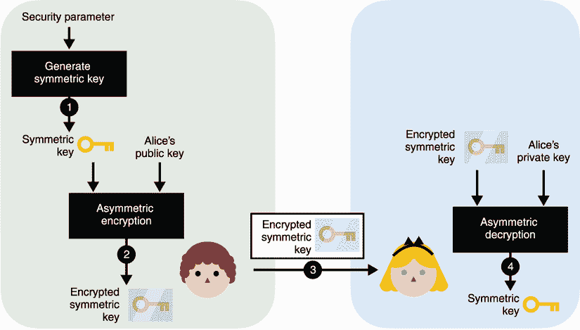

图 6.5 要使用非对称加密作为密钥交换原语，您可以(1)生成一个对称密钥，(2)使用 Alice 的公钥对其进行加密。在(3)将它发送给 Alice 之后，她可以(4)用她相关的私钥解密它。在协议的最后，你们双方都有共享的秘密，而其他任何人都不能通过单独观察加密的对称密钥得到它。

使用非对称加密来执行密钥交换通常是通过一种叫做 *RSA* (以其发明者 Rivest、Shamir 和 Adleman 的名字命名)的算法来完成的，并在许多互联网协议中使用。今天，RSA 通常是*而不是*进行密钥交换的首选方式，并且它在协议中越来越少地被用于支持椭圆曲线 Diffie-Hellman (ECDH)的协议中。这主要是由于历史原因(RSA 实施和标准中发现了许多漏洞)和 ECDH 提供的较小参数的吸引力。

### 6.2.2 混合加密

在实践中，非对称加密只能加密一定长度以内的消息。例如，RSA 可以加密的明文消息的大小受限于密钥对生成期间使用的安全参数(更具体地说，受限于模数的大小)。现在，使用安全参数(4，096 位模数)，限制大约是 500 个 ASCII 字符—非常小。因此，大多数应用程序使用混合加密，其局限性取决于所使用的认证加密算法的加密限制。

混合加密在实践中具有与非对称加密相同的接口(见图 6.6)。人们可以用公钥加密消息，拥有相关私钥的人可以解密加密的消息。真正的区别在于可以加密的消息的大小限制。


图 6.6 混合加密与非对称加密的接口相同，只是可以加密的消息大小要大得多。

在表面上，混合加密只是一个*非对称*密码原语和一个*对称*密码原语的组合(因此得名)。具体来说，它是与接收方的非交互式密钥交换，然后使用经过验证的加密算法对消息进行加密。

警告 你也可以使用简单的对称加密原语来代替认证加密原语，但是对称加密不能防止有人篡改你的加密消息。这就是为什么我们在实践中从不单独使用对称加密(如第 4 章所见)。

让我们了解一下混合加密的工作原理！如果你想加密给 Alice 的消息，你首先生成一个对称密钥并用它加密你的消息，然后使用一个认证的加密算法，如图 6.7 所示。

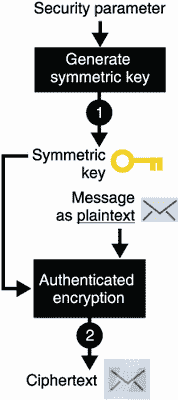

图 6.7 要使用混合加密和非对称加密对发送给 Alice 的消息进行加密，您(1)为认证加密算法生成对称密钥，然后您(2)使用对称密钥对发送给 Alice 的消息进行加密。

一旦你加密了你的信息，如果不知道对称密钥，Alice 仍然不能解密它。我们如何向 Alice 提供对称密钥？如图 6.8 所示，用 Alice 的公钥对对称密钥进行非对称加密。

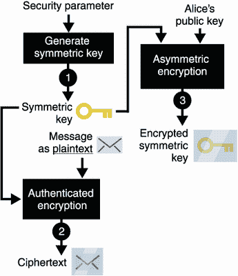

图 6.8 在图 6.7 的基础上，您(3)使用 Alice 的公钥和非对称加密算法加密对称密钥本身。

最后，你可以将两个结果都发送给爱丽丝。这些包括

*   非对称加密的对称密钥

*   对称加密的消息

这些信息足够爱丽丝解密这条信息了。我在图 6.9 中展示了完整的流程。

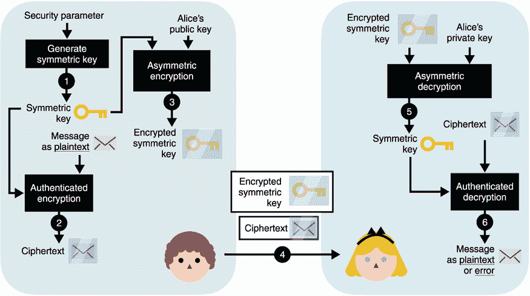

图 6.9 在图 6.8 的基础上，(4)在您将加密的对称密钥和加密的消息发送给 Alice 之后，(5) Alice 使用她的私钥解密对称密钥。(6)然后，她使用对称密钥对加密的消息进行解密。(注意，如果通信在第 4 步被 MITM 攻击者篡改，第 5 步和第 6 步都可能失败并返回错误。)

这就是我们如何能够两全其美:混合非对称加密和对称加密，用一个公钥加密大量数据。我们通常称算法的第一个非对称部分为*密钥封装机制* (KEM)，第二个对称部分为*数据封装机制* (DEM)。

在我们进入下一部分并了解非对称加密和混合加密的不同算法和标准之前，让我们看看(在实践中)如何使用加密库来执行混合加密。为此，我选择了 Tink 加密库。Tink 是由谷歌的一个密码专家团队开发的，用于支持公司内外的大型团队。由于项目的规模，为了防止开发人员滥用加密原语，进行了有意识的设计选择并公开了合理的功能。此外，Tink 还支持多种编程语言(Java、C++、Obj-C 和 Golang)。

清单 6.1 Java 混合加密

```
import com.google.crypto.tink.HybridDecrypt;
import com.google.crypto.tink.HybridEncrypt;
import com.google.crypto.tink.hybrid.HybridKeyTemplates
➥ .ECIES_P256_HKDF_HMAC_SHA256_AES128_GCM;
import com.google.crypto.tink.KeysetHandle;

KeysetHandle privkey = KeysetHandle.generateNew(          ❶
   ECIES_P256_HKDF_HMAC_SHA256_AES128_GCM);               ❶

KeysetHandle publicKeysetHandle =                         ❷
   privkey.getPublicKeysetHandle();                       ❷

HybridEncrypt hybridEncrypt =                             ❸
   publicKeysetHandle.getPrimitive(                       ❸
      HybridEncrypt.class);                               ❸
byte[] ciphertext = hybridEncrypt.encrypt(                ❸
   plaintext, associatedData);                            ❸

HybridDecrypt hybridDecrypt =                             ❹
   privkey.getPrimitive(HybridDecrypt.class);             ❹
byte[] plaintext = hybridDecrypt.decrypt(                 ❹
   ciphertext, associatedData);                           ❹
```

❶ 为特定的混合加密方案生成密钥

❷ 获得我们可以发布或共享的公钥部分

❸ 任何知道这个公钥的人都可以用它来加密明文，还可以认证一些关联数据。

❹ 使用相同的关联数据解密加密的消息。如果解密失败，它会抛出异常。

有一点可以帮助你理解`ECIES_P256_HKDF_HMAC_SHA256_AES128_GCM`字符串:ECIES(椭圆曲线集成加密方案)是使用的混合加密标准。你将在本章的后面了解到这一点。字符串的其余部分列出了用于实例化 ECIES 的算法:

*   P256 是你在第五章学到的 NIST 标准化椭圆曲线。

*   HKDF 是一个关键的衍生函数，你将在第八章中学习。

*   HMAC 是您在第 3 章中了解到的消息认证码。

*   SHA-256 是你在第二章中学到的散列函数。

*   AES-128-GCM 是 AES-GCM 认证加密算法，使用您在第 4 章中了解到的 128 位密钥。

看到一切是如何开始结合在一起的了吗？在下一节中，您将了解 RSA 和 ECIES，这两个广泛采用的非对称加密和混合加密标准。

## 6.3 RSA 非对称加密:坏的和不太坏的

我们该看看实践中定义非对称加密和混合加密的标准了。历史上，这两种原语都没有被密码分析者放过，在标准和实现中都发现了许多漏洞和弱点。这就是为什么我将从介绍 RSA 非对称加密算法和如何不使用它开始这一部分。本章的其余部分将介绍使用非对称和混合加密时可以遵循的实际标准:

*   *RSA-OAEP*—使用 RSA 执行非对称加密的主要标准

*   *种类*——使用椭圆曲线进行混合加密的主要标准 Diffie-Hellman (ECDH)

### 6.3.1 教材 RSA

在本节中，您将了解 RSA 公钥加密算法，以及这些年来它是如何被标准化的。这有助于理解其他基于 RSA 的安全方案。

不幸的是，自从 RSA 在 1977 年首次发布以来，它已经受到了相当多的指责。一个流行的理论是 RSA 太容易理解和实现，因此，许多人自己做，这导致了许多易受攻击的实现。这是一个有趣的想法，但它错过了整个故事。虽然 RSA 的概念(通常被称为*教科书 RSA* )如果天真地实现是不安全的，甚至标准也被发现被破坏了！但是没有这么快，要理解这些问题，你首先需要了解 RSA 是如何工作的。

还记得模素数的乘法群 *p* 吗？(我们在第 5 章中讨论过。)它是严格正整数的集合:

1，2，3，4，，*p*–1

让我们想象这些数字中的一个就是我们的信息。对于足够大的 *p* ，比如说 4096 位，我们的消息最多可以包含大约 500 个字符。

注 对于计算机来说，一条消息只是一系列字节，也可以解释为一个数字。

我们已经看到，通过对一个数字(比如我们的消息)求幂，我们可以生成其他数字，形成一个*子群*。我在图 6.10 中说明了这个。

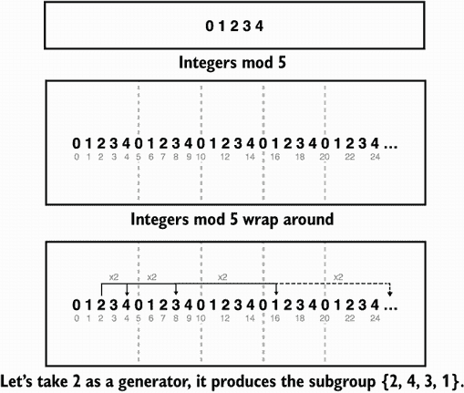

图 6.10 模一个素数的整数(这里是 5)被分成不同的子群。通过选择一个元素作为生成元(比如数字 2)并对其求幂，我们可以生成一个子群。对于 RSA，生成器就是消息。

在定义如何使用 RSA 加密时，这对我们很有用。为此，我们发布了一个公共指数 *e* (用于*加密*)和一个素数 *p* 。(实际上 p*不能是质数，但我们暂且忽略它。)要加密消息 *m* ，需要计算*

塞浦路斯文= *m* <sup class="fm-superscript2">e</sup> 修改 *p*

例如，用 *e* = 2 和 *p* = 5 加密消息 *m* = 2，我们计算

塞浦路斯文字= 2<sup class="fm-superscript">【2】</sup>修改【5 = 4

这就是 RSA 加密背后的理念！

注 通常选择一个较小的数作为公开指数 *e* 以便加密快速。从历史上看，标准和实现似乎已经确定了公共指数的质数 65，537。

这太棒了！你现在有一种方法让人们加密给你的信息。但是你如何解密这些呢？记住，如果你继续对一个生成器求幂，你实际上又回到了原始数(见图 6.11)。


图 6.11 假设我们的信息是数字 2。通过对它求幂，我们可以得到本组中的其他数。如果我们对它进行足够的指数运算，我们会回到最初的消息 2。我们说这个群是循环的 T2。该属性可用于在消息被提升到某个级别后恢复消息。

这应该给你一个如何实现解密的想法:找出为了恢复原始生成器(也就是消息)你需要对一个密文取多少幂。假设你知道这样一个数，我们称之为*私指数 d* ( *d* 代表*解密*)。如果你收到

塞浦路斯文字=讯息 <sup class="fm-superscript2">e</sup> 修改 *p*

你应该能够将它提升到 *d* 的幂来恢复消息:

塞浦路斯文 <sup class="fm-superscript2">d</sup> =(讯息 <sup class="fm-superscript2">e</sup> ) <sup class="fm-superscript2">d</sup> =讯息

 *寻找这个私人指数 *d* 背后的实际数学有点复杂。简而言之，您计算公共指数的倒数模组的顺序(元素的数量):

*d*=*e*<sup class="fm-superscript">–1</sup>修改顺序

我们有一个有效的算法来计算模逆(像扩展的欧几里德算法)，所以这不是一个问题。不过，我们还有另一个问题！对于一个素数 *p* ，顺序就是*p*–1，因此，*任何人都很容易计算出私有指数*。这是因为这个等式中除了 *d* 之外的每个元素都是公共的。

欧拉定理

我们如何获得之前的等式来计算私有指数 *d* ？欧拉定理指出，对于与 *p* 互质的 *m* (意味着它们没有公因数):

*m* <sup class="fm-superscript1">命令</sup> = 1 修改 *p*

对于*阶*，整数模 *p* 产生的乘法群中的元素个数。反过来，这意味着对于任何整数*乘以*

*m* <sup class="fm-superscript">1+</sup> <sup class="fm-superscript1">*倍数* × *顺序*</sup>=*m*×(*m*T15】顺序 ) <sup class="fm-superscript1">倍数</sup>mod*p*=*m*modT27】p

这告诉我们，我们试图解决的方程

*m*<sup class="fm-superscript1">e×d</sup>=*m*mod*p*

可以简化为

*e* × *d* = 1 + *倍数* × *顺序*

可以改写为

*e* × *d* = 1 修改 *命令*

根据定义，这意味着 *d* 是 *e* 模*阶*的逆。

我们可以防止其他人从公共指数计算私有指数的一种方法是隐藏我们组的顺序。这就是 RSA 背后的高明之处:如果我们的模数不再是一个素数，而是一个素数 *N* = *p* × *q* (其中 *p* 和 *q* 是只有你知道的大素数)，那么只要我们不知道 *p* 和 *q* ，我们的乘法群的阶就不容易计算！

RSA 组的顺序

你可以用欧拉函数 ϕ ( *N* )计算一个数 *N* 的乘法群的阶，它返回与 *N* 互质*的数的计数。例如，5 和 6 是互质的，因为除这两者的唯一正整数是 1。另一方面，10 和 15 不是因为 1 和 5 把它们每个都分了。模 RSA 模数的乘法群的阶*N*=*p*×*q*为*

(*n*=(*p*–1)×(T7】q–1)

这太难计算了，除非你知道 *N* 的因子分解。

我们都很好！概括来说，RSA 是这样工作的:

*   用于密钥生成

    1)生成两个大素数 *p* 和 *q* 。

    2)选择一个随机的公共指数 *e* 或者一个固定的，比如 *e* = 65537。

    3)你的公钥是公开指数 *e* 和公开模数 *N* = *p* × *q* 。

    4)导出你的私有指数*d*=*e*<sup class="fm-superscript">–1</sup>mod(*p*–1)(*q*–1)。

    你的私钥是私钥指数 *d* 。

*   进行加密，计算消息 T3】eT5】modT7】N。

*   解密密文，计算密文<sup class="fm-superscript2">d</sup>mod*N*。

图 6.12 回顾了 RSA 在实践中的工作方式。


图 6.12 RSA 加密的工作原理是用公开指数 *e* 对公开模数 *N* = *p* × *q* 对一个数(我们的消息)求幂。RSA 解密通过用私有指数 *d* 对公共模数 *N* 取幂来工作。

我们说 RSA 依赖于*因式分解问题*。没有 *p* 和 *q* 的知识，谁也计算不出顺序；因此，除了您之外，没有人可以从公共指数计算私有指数。这类似于 Diffie-Hellman 如何基于离散对数问题(见图 6.13)。


图 6.13 Diffie-Hellman (DH)、椭圆曲线 Diffie-Hellman (ECDH)和 RSA 是不对称算法，它们依赖于我们认为很难的三个不同的数学问题。*难*意味着我们不知道用大数实例化时解决它们的有效算法。

因此，教科书 RSA 对一个合数 *N* = *p* × *q* 进行模运算，其中 *p* 和 *q* 是两个需要保密的大素数。现在您已经了解了 RSA 的工作原理，让我们看看它在实践中有多不安全，以及有哪些标准可以确保它的安全。

### 6.3.2 为什么不使用 RSA PKCS # 1 1.5 版

你了解了“教科书式的 RSA”，它默认是不安全的，原因有很多。在您了解 RSA 的安全版本之前，让我们看看您需要避免什么。

不能直接使用课本 RSA 的原因有很多。一个例子是，如果你加密小消息(例如 *m* = 2)，那么一些恶意行为者可以加密 0 到 100 之间的所有小数字，并快速观察他们的加密数字是否与你的密文匹配。如果是的话，他们会知道你加密了什么。

标准解决了这个问题，它让你的消息变得太大而无法以这种方式强行发送。具体来说，他们使用*不确定的*填充来最大化消息的大小(加密前)。例如，RSA PKCS#1 v1.5 标准定义了一个填充符，它向消息中添加了一些随机字节。我在图 6.14 中说明了这一点。

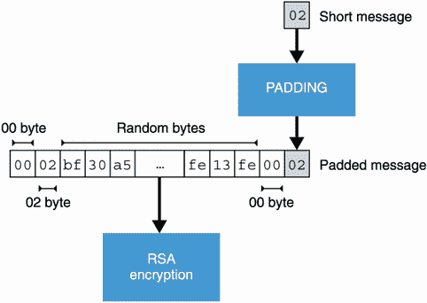

图 6.14 RSA PKCS # 1v 1.5 标准规定了加密前应用于消息的填充。填充必须是可逆的(以便解密可以消除它)，并且必须向消息添加足够的随机字节，以避免暴力攻击。

PKCS#1 标准实际上是第一个基于 RSA 的标准，作为 RSA 公司在 90 年代初编写的一系列公钥加密标准(PKCS)文档的一部分发布。虽然 PKCS#1 标准修复了一些已知的问题，但在 1998 年，Bleichenbacher 发现了对 PKCS#1 v1.5 的实际攻击，该攻击允许攻击者解密用该标准指定的填充符加密的消息。因为它需要 100 万条消息，它被臭名昭著地称为*百万条消息攻击*。后来发现了缓解措施，但有趣的是，这些年来，随着研究人员发现缓解措施太难安全实现(如果有的话)，攻击被一次又一次地重新发现。

自适应选择密文攻击

Bleichenbacher 的百万消息攻击是理论密码学中称为*自适应选择密文攻击* (CCA2)的一种攻击。CCA2 意味着，为了执行这种攻击，攻击者可以提交任意 RSA 加密的消息(*选择的密文*)，观察它如何影响解密，并基于之前的观察继续攻击(*自适应*部分)。CCA2 通常用于在加密安全证明中模拟攻击者。

要理解为什么攻击是可能的，你需要理解 RSA 密文是*可延展的*:你可以篡改 RSA 密文而不使其解密无效。如果我观察密文*c*=*m*<sup class="fm-superscript2">e</sup>mod*N*，那么我可以提交如下密文:

3<sup class="fm-superscript2">e</sup>×*m*<sup class="fm-superscript2">e</sup>=(3*m*)<sup class="fm-superscript2">e 修改</sup>

将解密为

(3*m*)<sup class="fm-superscript2">e</sup>)<sup class="fm-superscript2">d</sup>=(3*m*)<sup class="fm-superscript1">e</sup>

 *我在这里使用数字 3 作为例子，但是我可以用我想要的任何数字乘以原始消息。实际上，消息必须是格式良好的(由于填充)，因此，篡改密文将会破坏解密。然而，有时，即使在恶意修改之后，填充在解密之后也被接受。

Bleichenbacher 在他对 RSA PKCS#1 v1.5 的百万条消息攻击中利用了这一特性。他的攻击通过截取加密的消息、修改它并将其发送给负责解密的人来进行。通过观察那个人是否能够解密它(填充仍然有效)，我们获得了关于消息范围的一些信息。因为前两个字节是 0x0002，所以我们知道解密小于某个值。通过反复这样做，我们可以将范围缩小到原始消息本身。

尽管 Bleichenbacher 攻击众所周知，但今天仍有许多系统在使用 RSA PKCS # 1 1.5 版进行加密。作为安全顾问，我发现许多应用程序容易受到这种攻击，所以要小心！

### 6.3.3 使用 RSA-OAEP 的非对称加密

1998 年，同一个 PKCS#1 标准的 2.0 版本发布了一个新的 RSA 填充方案，称为*最优非对称加密填充* (OAEP)。与它的前身 PKCS#1 v1.5 不同，OAEP 不容易受到 Bleichenbacher 的攻击，因此是当今 RSA 加密使用的强大标准。让我们看看 OAEP 是如何工作的，并防止前面讨论的攻击。

首先，让我们提一下，像大多数加密算法一样，OAEP 附带了一个密钥生成算法。这需要一个安全参数，如图 6.15 所示。

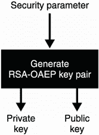

图 6.15 RSA-OAEP 和很多公钥算法一样，首先需要生成一个密钥对，这个密钥对以后可以在密码原语提供的其他算法中使用。

这个算法采用一个安全参数，它是若干比特。与 Diffie-Hellman 一样，运算发生在以一个大数为模的数集中。当我们谈论 RSA 实例化的安全性时，我们通常指的是那个大模数的大小。如果你记得的话，这和 Diffie-Hellman 很相似。

目前，大多数准则(见 https://keylength.com[)估计模数在 2048 到 4096 位之间，以提供 128 位安全性。由于这些估计差异很大，大多数应用似乎保守地选择了 4，096 位参数。](https://keylength.com)

注 我们看到 RSA 的大模数不是素数而是两个大素数 *p* 和 *q* 的乘积 *N* = *p* × *q* 。对于 4096 位的模数，密钥生成算法通常在中间进行分割，生成大小约为 2048 位的 *p* 和 *q* 。

为了加密，算法首先填充消息，并将其与每次加密生成的随机数混合。然后用 RSA 对结果进行加密。为了解密密文，过程是相反的，如图 6.16 所示。

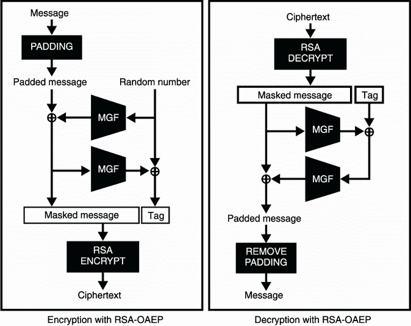

图 6.16 RSA-OAEP 的工作原理是在加密之前将消息与一个随机数混合。解密后可以恢复混合。该算法的核心是一个掩码生成函数(MGF ),用于随机化和放大或缩小输入。

RSA-OAEP 使用这种混合来确保如果用 RSA 加密的数据有几个比特泄露，就无法获得明文信息。事实上，要反转 OAEP 填充，您需要获得(接近)OAEP 填充明文的所有字节！此外，Bleichenbacher 的攻击应该不再有效，因为该方案使得不可能通过修改密文来获得格式良好的明文。

注意 *明文感知*是一种属性使得攻击者很难创建一个能够成功解密的密文(当然没有加密的帮助)。由于 OAEP 提供的明文感知，Bleichenbacher 的攻击对该方案不起作用。

在 OAEP 内部， *MGF* 代表*遮罩生成功能*。实际上，MGF 是一个可扩展的输出功能(XOF)；你在第 2 章学习了 XOFs。由于 MGFs 是在 XOFs 之前发明的，所以它们是使用一个散列函数构建的，该函数使用一个计数器反复散列输入(参见图 6.17)。这就是 OAEP 的工作方式！

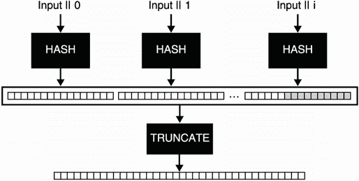

图 6.17 掩模生成函数(MGF)是一个简单的函数，它接受任意长度的输入，并产生一个看起来随机的任意长度的输出。它的工作原理是对输入和计数器进行哈希运算，将摘要连接在一起，并截断结果以获得所需的长度。

马槽的填充神谕攻击

在 OAEP 标准发布仅三年后，James Manger 发现了一种类似于 Bleichenbacher 对 OAEP 的百万条消息攻击的定时攻击(但实际得多),如果没有正确实施的话。幸运的是，与 PKCS#1 v1.5 相比，安全地实现 OAEP 要简单得多，并且该方案实现中的漏洞也少得多。

此外，OAEP 的设计并不完美；多年来，更好的结构已经被提出和标准化。RSA-KEM 就是一个例子，它具有更强的安全性证明，并且安全实现起来简单得多。你可以在图 6.18 中观察到这个设计有多优雅。


图 6.18 RSA-KEM 是一种加密方案，其工作原理是在 RSA 下简单地加密一个随机数。不需要填充。我们可以将随机数通过一个密钥派生函数(KDF)来获得一个对称密钥。然后，我们使用对称密钥通过经过验证的加密算法对消息进行加密。

注意这里使用的密钥派生函数(KDF)。它是另一种可以用 MGF 或 XOF 代替的密码原语。我会在第八章《随机性和秘密》中更多地讨论什么是 KDF。

如今，大多数使用 RSA 的协议和应用程序要么仍然实现不安全的 PKCS#1 v1.5，要么实现 OAEP。另一方面，对于密钥交换和混合加密，越来越多的协议正在从 RSA 加密转向椭圆曲线 Diffie-Hellman (ECDH)。这是可以理解的，因为 ECDH 提供了更短的公钥和好处，一般来说，来自更好的标准和更安全的实现。T3T5】

## 6.4 使用 ECIES 的混合加密

虽然存在许多混合加密方案，但最广泛采用的标准是*椭圆曲线综合加密方案* (ECIES)。该方案已被指定用于 ECDH，并包含在许多标准中，如 ANSI X9.63、ISO/IEC 18033-2、IEEE 1363a 和 SECG SEC 1。不幸的是，每个标准似乎都实现了不同的变体，不同的密码库实现混合加密的方式也不同，部分原因就在于此。

由于这个原因，我很少在野外看到两种类似的混合加密实现。重要的是要理解，虽然这很烦人，但是如果协议的所有参与者使用相同的实现或者记录他们已经实现的混合加密方案的细节，那么就不会有问题。

ECIES 的工作方式类似于第 6.2 节中解释的混合加密方案。不同之处在于，我们用 ECDH 密钥交换来实现 KEM 部分，而不是用非对称加密原语。让我们一步一步来解释这个。

首先，如果你想加密给爱丽丝的消息，你使用一个基于(EC)DH 的密钥交换，用爱丽丝的公钥和你为此生成的密钥对(这叫做*临时密钥对*)。然后，您可以使用获得的共享秘密和经过验证的对称加密算法(如 AES-GCM)来加密发送给她的更长的消息。图 6.19 说明了这一点。

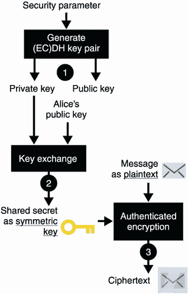

图 6.19 使用(EC)DH 混合加密对发送给 Alice 的消息进行加密，您(1)生成一个临时(椭圆曲线)DH 密钥对。然后(2)用你的临时私钥和 Alice 的公钥进行密钥交换。(3)使用由此产生的共享秘密作为认证加密算法的对称密钥来加密您的消息。

在此之后，您可以将临时公钥和密文发送给 Alice。Alice 可以使用您的临时公钥与她自己的密钥对进行密钥交换。然后，她可以使用结果来解密密文，并检索原始消息。如果公钥或加密消息在传输过程中被篡改，结果要么是原始消息，要么是错误消息。图 6.20 显示了完整的流程。


图 6.20 在图 6.19 的基础上，(4)在你把你的临时公钥和你的加密消息发送给爱丽丝之后，(5)爱丽丝可以用她的私钥和你的临时公钥进行密钥交换。(6)她最后使用得到的共享秘密作为对称密钥，用相同的认证加密算法解密加密的消息。

这就是 ECIES 的工作方式。还存在一种使用 Diffie-Hellman 的 ECIES 变体，称为 IES，其工作方式非常相似，但似乎没有多少人使用它。

消除密钥交换输出中的偏差

注意，我简化了图 6.20。大多数经过认证的加密原语都期望一个均匀随机的对称密钥。因为密钥交换的输出通常是*而不是*均匀随机的，我们需要事先通过 KDF 或 XOF(如第二章所见)传递共享秘密。你会在第八章学到更多。

*非均匀随机*这里指的是统计上，密钥交换结果的某些位可能是 0 多于 1，或者相反。例如，第一位可能总是被设置为 0。

运动

你明白为什么不能马上使用密钥交换输出了吗？

这就是你可以使用的不同标准。在下一章中，您将学习签名，这将是第 1 部分的最后，也可能是最重要的公钥加密算法。

## 总结

*   我们很少使用非对称加密来直接加密消息。这是因为不对称加密可以加密的数据的大小限制相对较低。

*   混合加密通过将非对称加密(或密钥交换)与对称认证加密算法相结合，可以加密更大的消息。

*   用于非对称加密的 RSA PKCS#1 版本 1.5 标准在大多数设置中被破坏。首选 RSA PKCS#1 版本 2.2 中标准化的 RSA-OAEP 算法。

*   ECIES 是使用最广泛的混合加密方案。由于其参数大小和对可靠标准的依赖，它优于基于 RSA 的方案。

*   不同的加密库可能会以不同的方式实现混合加密。如果可互操作的应用程序使用相同的实现，这在实践中不是问题。**