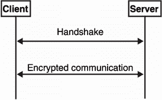
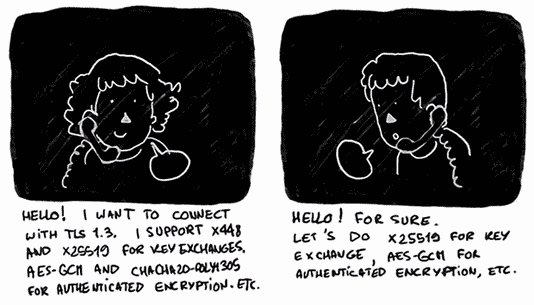
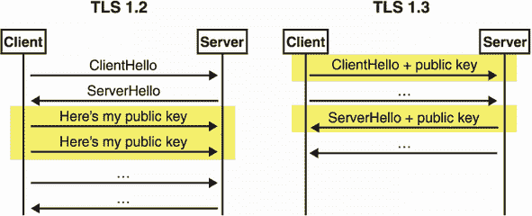
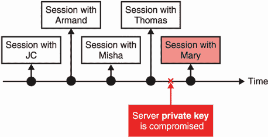
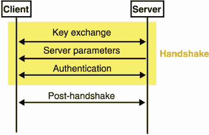
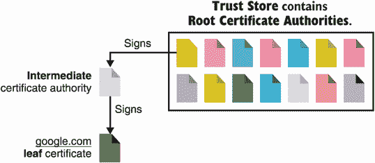
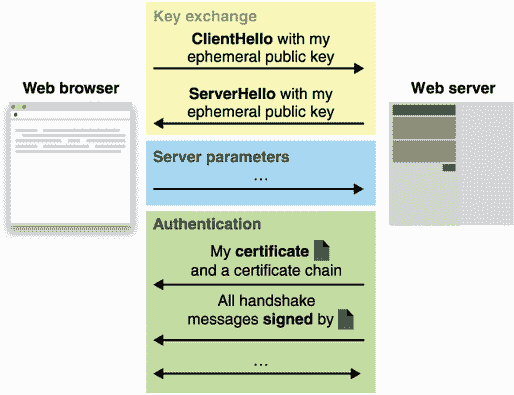
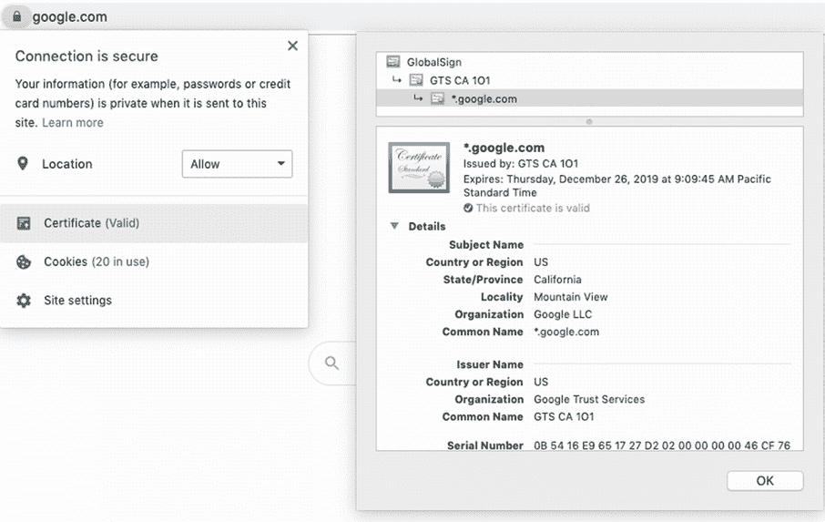
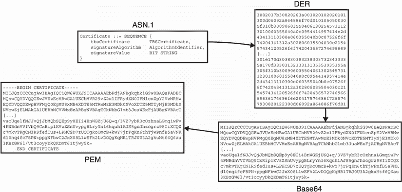
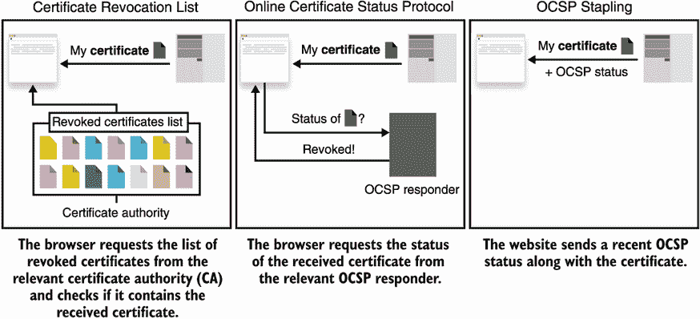

# 9安全运输

本章涵盖了

*   安全传输协议
*   传输层安全(TLS)协议
*   噪声协议框架

今天，加密技术最重要的用途很可能是加密通信。毕竟，密码学就是为此而发明的。为了做到这一点，应用程序通常不直接使用像认证加密这样的密码原语，而是使用抽象密码原语使用的更复杂的协议。由于没有更好的称呼，我把这些协议称为安全传输协议(T1)T2。

在本章中，您将了解使用最广泛的安全传输协议:传输层安全(TLS)协议。我还将简要介绍其他安全传输协议，以及它们与TLS的不同之处。

## 9.1 SSL和TLS安全传输协议

为了理解为什么*传输协议*(用于加密机器间通信的协议)是一个东西，让我们来看一个激励性的场景。当你在网络浏览器中输入`http://example.com`时，你的浏览器使用许多协议连接到网络服务器并检索你请求的页面。其中之一是*超文本传输协议* (HTTP)，你的浏览器用它来告诉另一端的网络服务器它对哪个页面感兴趣。HTTP使用人类可读的格式。这意味着您可以查看通过网络发送和接收的HTTP消息，并在没有任何其他工具帮助的情况下阅读它们。但是这还不足以让您的浏览器与web服务器通信。

HTTP消息封装成其他类型的消息，称为 *TCP帧*，在传输控制协议(TCP)中定义。TCP是一个二进制协议，因此，它不是人类可读的:你需要一个工具来理解TCP帧的字段。TCP消息使用互联网协议(IP)进一步封装，IP消息使用其他东西进一步封装。这就是所谓的*互联网协议套件*，由于是许多书籍的主题，我就不再深入探讨了。

回到我们的场景，因为我们需要讨论一个保密问题。任何坐在你的浏览器和example.com的网络服务器之间的人都有一个有趣的位置:他们可以被动地观察和阅读你的请求以及服务器的响应。更糟糕的是，MITM攻击者还可以主动篡改和重新排序消息。这不太好。

想象一下，每当你在网上购物时，你的信用卡信息就会泄露；当你登录网站时，你的密码会被窃取；当你把照片和私人信息发送给朋友时，它们会被窃取，等等。这吓到了足够多的人，以至于在20世纪90年代，TLS的前身—*安全套接字层* (SSL) *协议*诞生了。虽然SSL可以在不同的情况下使用，但它最初是由web浏览器构建的，并且是为web浏览器而构建的。因此，它开始与HTTP结合使用，将其扩展为安全的*超文本传输协议* (HTTPS)。HTTPS现在允许浏览器保护他们访问的不同网站的通信。

### 9.1.1从SSL到TLS

尽管SSL并不是试图保护某些网络的唯一协议，但它确实吸引了大部分注意力，并且随着时间的推移，它已经成为事实上的标准。但这并不是故事的全部。从SSL的第一个版本到我们现在使用的版本，发生了很多变化。由于糟糕的设计和糟糕的加密算法的结合，SSL的所有版本(最新版本是SSL v3.0)都被破坏了。(RFC 7457中总结了许多攻击。)

SSL 3.0之后，该协议正式转移到互联网工程任务部队(IETF)，负责发布*征求意见* (RFCs)标准的组织。SSL这个名字被去掉了，取而代之的是TLS，TLS 1.0于1999年作为RFC 2246发布。TLS的最新版本是TLS 1.3，在RFC 8446中指定，于2018年发布。TLS 1.3不同于它的前身，它源于工业界和学术界之间的紧密合作。然而，今天，由于服务器更新缓慢，互联网仍然存在许多不同版本的SSL和TLS。

注意 围绕SSL和TLS这两个名称有很多混淆之处。该协议现在被称为 *TLS* ，但是许多文章甚至图书馆仍然选择使用术语 *SSL* 。

TLS已经不仅仅是保护网络安全的协议；现在，它被用在许多不同的场景和许多不同类型的应用程序和设备中，作为保护通信的协议。因此，你将在本章学到的关于TLS的知识不仅对web有用，而且对任何两个应用程序之间的通信需要安全的场景都有用。

### 9.1.2在实践中使用TLS

人们如何使用TLS？首先让我们定义一些术语。在TLS中，想要保护其通信的两个参与者是被称为*客户端*和*服务器*的。它的工作方式与TCP或IP等其他网络协议相同:客户端是发起连接的一方，服务器是等待连接被发起的一方。TLS客户端通常是从

*   *一些配置*—客户端配置有它想要支持的SSL和TLS版本、它想要用来保护连接的加密算法、它可以认证服务器的方式等等。

*   *它想要连接到的服务器的一些信息*—它至少包括一个IP地址和一个端口，但对于web，它通常包括一个完全合格的域名(如example.com)。

给定这两个参数，客户端可以启动与服务器的连接，以产生安全的*会话*，客户端和服务器都可以使用这个通道来相互共享加密的消息。在某些情况下，安全会话无法成功创建，并且会中途失败。例如，如果攻击者试图篡改连接，或者如果服务器的配置与客户机的配置不兼容(稍后将详细介绍)，客户机将无法建立安全会话。

TLS服务器通常要简单得多，因为它只需要一个配置，类似于客户端的配置。然后，服务器等待客户端连接到它，以便产生安全会话。实际上，在客户端使用TLS可以像下面的清单所示的那样简单(也就是说，如果您使用像Golang这样的编程语言)。

清单9.1 Golang中的TLS客户端

```
import "crypto/tls"

func main() {
    destination := "google.com:443"                           ❶
     TLSconfig := &tls.Config{}                               ❷
     conn, err := tls.Dial("tcp", destination, TLSconfig)
    if err != nil {
        panic("failed to connect: " + err.Error())
    }
    conn.Close()
}
```

❶ 全限定域名和服务器的端口(443是HTTPS的默认端口)。

❷ 空配置作为默认配置。

客户端如何知道它建立的连接是真的与google.com的 [而不是某个冒充者？默认情况下，Golang的TLS实现使用您的操作系统的配置来确定如何认证TLS服务器。(在本章的后面，您将确切了解TLS中的身份验证是如何工作的。)在服务器端使用TLS也很容易。下面的清单显示了这有多简单。](http://google.com)

清单9.2 Golang中的TLS服务器

```
import (
    "crypto/tls"
    "net/http"
)

func hello(rw http.ResponseWriter, req *http.Request) {
    rw.Write([]byte("Hello, world\n"))
}

func main() {
    config := &tls.Config{                                 ❶
         MinVersion: tls.VersionTLS13,                     ❶
     }                                                     ❶

    http.HandleFunc("/", hello)                            ❷

    server := &http.Server{                                ❸
         Addr:      ":8080",                               ❸
         TLSConfig: config,                                ❸
     }

    cert := "cert.pem"
    key := "key.pem"
    err := server.ListenAndServeTLS(cert, key)             ❹
     if err != nil {
        panic(err)
    }
}
```

❶TLS 1.3服务器的可靠最低配置

❷提供一个显示“你好，世界”的简单页面。

❸https服务器从8080端口启动。

❹ 有的。包含证书和密钥的pem文件(稍后将详细介绍)

Golang和它的标准库为我们做了很多。不幸的是，不是所有语言的标准库都提供易于使用的TLS实现，如果它们提供TLS实现的话，也不是所有的TLS库都提供默认安全的实现！因此，根据库的不同，配置TLS服务器并不总是那么简单。在下一节中，您将了解TLS的内部工作方式及其不同的微妙之处。

注意 TLS是一种工作在TCP之上的协议。为了保护UDP连接，我们可以使用DTLS ( *D* 表示*数据报*，UDP消息的术语)，这与TLS非常相似。由于这个原因，我在本章中忽略了DTLS。T9】

## 9.2 TLS协议是如何工作的？

正如我前面说过的，如今TLS是保护应用程序间通信的事实上的标准。在这一节中，您将了解更多关于TLS在表面之下是如何工作的，以及它在实践中是如何使用的。您会发现本节对于学习如何正确使用TLS以及理解大多数(如果不是全部)安全传输协议的工作原理非常有用。您还将发现为什么重新设计或重新实现这样的协议是困难的(并且强烈反对)。

在高层次上，TLS分为两个阶段，如下表所示。图9.1说明了这个想法。

*   *握手阶段*—在两个参与者之间协商并创建安全通信。

*   *握手后阶段*—两个参与者之间的通信被加密。



图9.1在高层次上，安全传输协议首先在握手阶段创建安全连接。之后，安全连接两端的应用程序可以安全地进行通信。

至此，因为您已经在第6章中学习了混合加密，所以您应该对这两个步骤的工作原理有以下(正确的)直觉:

*   握手本质上是一个简单的密钥交换。握手以两个参与者就一组对称密钥达成一致而结束。

*   *握手后阶段纯粹是对参与者之间的消息进行加密。*这个阶段使用认证加密算法和握手结束时产生的密钥集。

大多数传输安全协议都是这样工作的，这些协议有趣的部分总是在握手阶段。接下来，我们来看看握手阶段。

### 9 . 2 . 1 TLS握手

如你所见，TLS(以及大多数传输安全协议)分为两个部分:一个*握手*和一个*握手后*阶段。在本节中，您将首先学习握手。握手本身有四个方面我想告诉你:

*   *协商* —TLS高度可配置。客户端和服务器都可以配置为协商一系列SSL和TLS版本以及一系列可接受的加密算法。握手的协商阶段旨在找到客户端和服务器配置之间的共同点，以便安全地连接两个对等方。

*   *密钥交换*—握手的整个点是在两个参与者之间执行密钥交换。使用哪种密钥交换算法？这是客户机/服务器协商过程中决定的事情之一。

*   *认证*—正如您在第5章密钥交换中所了解到的，MITM攻击者假冒密钥交换的任何一方都是轻而易举的事情。因此，密钥交换必须经过认证。举例来说，你的浏览器必须有办法确保它是在与google.com对话，而不是与你的互联网服务提供商(ISP)对话。

*   *会话恢复*—由于浏览器经常一次又一次地连接到相同的网站，密钥交换可能成本高昂，并会降低用户体验。因此，TLS中集成了快速跟踪安全会话而无需重新进行密钥交换的机制。

这是一个全面的列表！快如闪电，让我们从第一项开始。

TLS中的协商:什么版本，什么算法？

TLS中的大部分复杂性来自于协议不同移动部分的协商。众所周知，这一谈判也是TLS历史上许多问题的根源。像FREAK、LOGJAM、DROWN等攻击利用了旧版本中存在的弱点来破坏新版本的协议(有时甚至当服务器不支持旧版本时！).虽然并非所有协议都有版本控制或允许协商不同的算法，但SSL/TLS是为web设计的。因此，SSL/TLS需要一种方法来保持与更新缓慢的旧客户机和服务器的向后兼容性。

这就是今天网络上发生的事情:你的浏览器可能是最新的，支持TLS版本1.3，但当访问一些旧的网页时，它背后的服务器可能只支持TLS版本1.2或1.1(或更差)。反之亦然，很多网站必须支持老版本的浏览器，这就转化为支持老版本的TLS(因为有些用户还停留在过去)。

旧版本的SSL和TLS安全吗？

大多数版本的SSL和TLS都存在安全问题，TLS版本1.2和1.3除外。为什么不直接支持最新版本(1.3)就收工了？原因是一些公司支持不容易更新的旧客户端。由于这些需求，为了安全地支持旧版本，实现对已知攻击的缓解的库并不少见。不幸的是，这些缓解措施通常过于复杂，无法正确实现。

例如，像Lucky13和Bleichenbacher98这样众所周知的攻击被安全研究人员在各种TLS实施中一次又一次地重新发现，他们以前曾试图解决这些问题。虽然有可能减轻对旧TLS版本的攻击，但我建议不要这样做，而且我不是唯一告诉你这一点的人。2021年3月，IETF发布了RFC 8996:“反对TLS 1.0和TLS 1.1”，有效地将反对意见正式化。

协商从客户端向服务器发送第一个请求(称为 *ClientHello* )开始。ClientHello包含一系列受支持的SSL和TLS版本、一套客户端愿意使用的加密算法，以及一些可能与握手的其余部分或应用程序相关的更多信息。这套加密算法包括

*   *一个或多个密钥交换算法* —TLS 1.3定义了以下允许协商的算法:ECDH与P-256、P-384、P-521、X25519、X448，FFDH与RFC 7919中定义的组。我在第五章谈到了所有这些。TLS以前的版本也提供RSA密钥交换(在第6章中讨论)，但在最新版本中被删除了。

*   *两种(针对握手的不同部分)或更多数字签名算法* —TLS 1.3规定了RSA PKCS#1版本1.5和更新的RSA-PSS，以及更近的椭圆曲线算法，如ECDSA和EdDSA。这些我在第7章讲过。请注意，数字签名是用哈希函数指定的，这允许您与SHA-256或SHA-512协商RSA-PSS。

*   *与HMAC和HKDF* 一起使用的一个或多个哈希函数——TLS 1.3指定了SHA-256和SHA-384，SHA-2哈希函数的两个实例。(你在第二章了解了SHA-2。)散列函数的这种选择与数字签名算法使用的散列函数无关。提醒一下，HMAC是你在第3章中学到的消息认证码，HKDF是我们在第8章讨论的密钥派生函数。

*   *一种或多种认证加密算法*—这些算法可以包括密钥为128或256位的AES-GCM、ChaCha20-Poly1305和AES-CCM。我在第四章谈到了所有这些。

然后，服务器用一个 *ServerHello* 消息来响应，该消息包含每种类型的加密算法，这些算法是从客户端的选择中精选出来的。下图描述了这种响应。



如果服务器找不到它支持的算法，它会中止连接。尽管在某些情况下，服务器不必中止连接，而是可以要求客户端提供更多信息。为此，服务器回复一条名为 *HelloRetryRequest* 的消息，要求提供缺失的信息。然后，客户端可以重新发送它的ClientHello，这次使用添加的请求信息。

TLS和前向安全密钥交换

密钥交换是TLS握手中最重要的部分！没有它，很明显就没有正在协商的对称密钥。但是要进行密钥交换，客户机和服务器必须首先交换它们各自的公钥。

在TLS 1.2和以前的版本中，只有在双方同意使用哪个密钥交换算法后，客户端和服务器才开始密钥交换。这发生在谈判阶段。TLS 1.3通过尝试同时进行协商和密钥交换来优化这个流程:客户端推测性地选择一个密钥交换算法，并在第一条消息中发送一个公钥(ClientHello)。如果客户端无法预测服务器对密钥交换算法的选择，则客户端会退回到协商的结果，并发送一个包含正确公钥的新ClientHello。以下步骤描述了这可能是什么样子。我在图9.2中说明了不同之处。

1.  客户端发送TLS 1.3 ClientHello消息，宣布它可以进行X25519或X448密钥交换。它还发送X25519公钥。

2.  服务器不支持X25519，但支持X448。它向客户端发送一个HelloRetryRequest，宣布它只支持X448。

3.  客户端发送相同的ClientHello，但使用X448公钥。

4.  握手还在继续。



图9.2在TLS 1.2中，客户端在发送公钥之前等待服务器选择使用哪种密钥交换算法。在TLS 1.3中，客户端推测服务器将采用哪种密钥交换算法，并在第一条消息中抢先发送一个(或几个)公钥，从而可能避免额外的往返。

TLS 1.3充满了这样的优化，这对web很重要。事实上，世界上许多人的连接都不稳定或很慢，因此将非应用程序通信保持在最低要求非常重要。此外，在TLS 1.3中(不像以前的TLS版本)，所有的密钥交换都是短暂的T2。这意味着对于每个新的会话，客户机和服务器都生成新的密钥对，然后在密钥交换完成后立即删除它们。这为密钥交换提供了*前向保密性*:这是对客户端或服务器的长期密钥的一种妥协，只要暂时的私有密钥被安全删除，攻击者就无法解密这个会话。

想象一下，如果TLS服务器在与客户进行每次密钥交换时都使用一个私钥，会发生什么。通过执行短暂的密钥交换，并在握手结束时立即删除私钥，服务器可以防范此类攻击者。我在图9.3中说明了这一点。



图9.3在TLS 1.3中，每个会话都以短暂的密钥交换开始。如果服务器在某个时间点遭到破坏，先前的会话将不会受到影响。

运动

在某个时间点泄露服务器的私钥将是毁灭性的，因为MITM攻击者将能够解密所有先前记录的对话。你知道这是怎么发生的吗？

一旦交易了短暂的公钥，就执行密钥交换，并且可以导出密钥。TLS 1.3在不同的时间点导出不同的密钥，用独立的密钥加密不同的阶段。

前两条消息ClientHello和ServerHello无法加密，因为此时没有交易公钥。但是在那之后，一旦密钥交换发生，TLS 1.3就加密握手的其余部分。(这不同于以前版本的TLS，它不加密任何握手消息。)

为了获得不同的密钥，TLS 1.3使用HKDF和协商的散列函数。HKDF提取用于密钥交换的输出，以消除任何偏差，而HKDF扩展与不同的`info`参数一起使用，以导出加密密钥。例如，`tls13` `c` `hs` `traffic`(用于“客户端握手流量”)用于导出对称密钥，供客户端在握手过程中向服务器加密，`tls13` `s` `ap` `traffic`(用于“服务器应用流量”)用于导出对称密钥，供服务器在握手后向客户端加密。但是请记住，*未经认证的*密钥交换是不安全的！接下来，您将看到TLS如何解决这个问题。

TLS认证和网络公钥基础设施

在一些协商和密钥交换发生之后，握手必须继续。接下来发生的是TLS的另一个最重要的部分— *认证*。您在第5章密钥交换中看到，截取密钥交换并模拟密钥交换的一方或双方是微不足道的。在这一节中，我将解释你的浏览器如何用密码验证它是在与正确的网站对话，而不是与一个模仿者对话。但是，首先，让我们后退一步。有件事我还没告诉你。TLS 1.3握手实际上分为三个不同的阶段(如图9.4所示):

1.  *密钥交换*—这个阶段包含 *ClientHello* 和 *ServerHello* 消息，它们提供一些协商并执行密钥交换。在此阶段之后，包括握手消息在内的所有消息都被加密。

2.  *服务器参数*—此阶段的消息包含来自服务器的附加协商数据。这是不必包含在服务器的第一条消息中的协商数据，并且可以从加密中受益。

3.  *认证*—此阶段包括来自服务器和客户端的认证信息。



图9.4 TLS 1.3握手分为三个阶段:密钥交换阶段、服务器参数阶段和(最后)认证阶段。

在网络上，TLS中的认证通常是单方面的。例如，只有浏览器验证google.com确实是google.com，但是google.com不验证你是谁(或者至少不作为TLS的一部分)。

相互认证的TLS

客户端认证通常委托给web的应用层，最常见的是通过一个要求您提供凭证的表单。也就是说，如果服务器在服务器参数阶段请求，客户端身份验证也可以在TLS中进行。当连接的两端都被认证后，我们就把称为*相互认证的TLS* (有时缩写为mTLS)。

客户端认证的方式与服务器认证相同。这可能发生在服务器认证之后的任何时候(例如，在握手期间或握手后阶段)。

现在让我们来回答这个问题，“当连接到google.com时，你的浏览器如何验证你确实在和Google . com握手？”答案是由使用*网络公钥基础设施(web PKI)* 。

你在关于数字签名的第7章中学习了公钥基础设施的概念，但让我简单地重新介绍一下这个概念，因为它对理解网络如何工作非常重要。web PKI有两个方面。首先，浏览器必须信任一组根公钥，我们称之为*认证机构* (CAs)。通常，浏览器要么使用一组硬编码的可信公钥，要么依赖操作系统来提供它们。

web PKI

对于网络来说，有数百个这样的ca，它们由世界各地不同的公司和组织独立运营。这是一个非常复杂的系统，需要进行分析，这些ca有时还可以签署中间ca的公钥，而中间ca也有权签署网站的公钥。由于这个原因，像*认证机构浏览器论坛*(CA/浏览器论坛)这样的组织执行规则并决定何时新组织可以加入可信公钥集，或者何时CA不再可信并必须从该集中删除。

其次，想要使用HTTPS的网站必须有办法从这些ca获得认证(它们的签名公钥的签名)。为了做到这一点，网站所有者(或者我们常说的网站管理员)必须向CA证明他们拥有一个特定的域。

注 为自己的网站获取证书以前是要收费的。这不再是像让我们加密这样的ca免费提供证书的情况。

例如，为了证明你拥有example.com，一个CA可能会要求你在example.com/some_path/file.txt托管一个文件，其中包含为你的请求生成的一些随机数。下面的漫画展示了这种交流。


此后，CA可以通过网站的公钥提供签名。因为CA的签名通常在几年内有效，所以我们说它在长期签名公钥之上(相对于短暂的公钥)。更具体地说，ca实际上并不签署公钥，而是由它们签署*证书*(稍后将详细介绍)。证书包含长期公钥，以及一些额外的重要元数据，如网页的域名。

为了向你的浏览器证明与之对话的服务器确实是google.com，服务器发送一个*证书链*作为TLS握手的一部分。该链条包括

*   自己的叶证书，包含(除其他外)域名( [)谷歌。例如，com](http://google.com) )、Google的长期签名公钥，以及CA的签名

*   从签署Google证书的CA到签署最后一个中间CA的根CA的中间CA证书链

这有点罗嗦，所以我在图9.5中说明了这一点。



图9.5 Web浏览器只需信任相对较小的一组根ca，就可以信任整个Web。这些ca存储在所谓的*信任存储库*中。为了让浏览器信任某个网站，该网站必须具有由这些ca之一签名的叶证书。有时根ca只签署中间ca，而中间ca又签署其他中间ca或叶证书。这就是所谓的网络PKI。

证书链由服务器和客户端在证书TLS消息中发送，就像要求客户端进行身份验证一样。在此之后，服务器可以使用其认证的长期密钥对对所有已经接收到的握手消息进行签名，并且之前在被称为的 *CertificateVerify* 消息中发送。图9.6回顾了这个流程，其中只有服务器验证自己。

certificate verify消息中的签名向客户端证明了服务器到目前为止所看到的内容。如果没有这个签名，MITM攻击者可以截获服务器的握手消息，并替换ServerHello消息中包含的服务器的临时公钥，从而使攻击者能够成功地模拟服务器。请花一些时间来理解为什么在有CertificateVerify签名的情况下，攻击者不能替换服务器的临时公钥。



图9.6握手的认证部分从服务器向客户端发送证书链开始。证书链以叶证书(包含网站公钥和域名等附加元数据的证书)开始，以浏览器信任的根证书结束。每个证书都包含来自证书链中它上面的证书的签名。

故事时间

几年前，我受雇审查一家大公司制定的定制TLS协议。原来他们的协议让服务器提供一个不包含临时密钥的签名。当我告诉他们这个问题时，整个房间沉默了整整一分钟。当然，这是一个严重的错误:攻击者如果能够截获自定义握手并用自己的密钥替换临时密钥，就可以成功地模拟服务器。

这里的教训是，重要的是不要重新发明轮子。安全传输协议很难做好，如果历史已经表明了什么，它们可能会以许多意想不到的方式失败。相反，你应该依赖于成熟的协议，如TLS，并确保你使用一个流行的实现，已经收到了大量的公众关注。

最后，为了正式结束握手，连接双方必须发送一条*完成*消息，作为认证阶段的部分。完成的消息包含由HMAC产生的认证标签，该认证标签用会话的协商散列函数来实例化。这使得客户端和服务器都可以告诉对方，“这些是我在这次握手中按顺序发送和接收的所有消息。”如果握手被MITM攻击者截获和篡改，这种完整性检查允许参与者检测和中止连接。这是特别有用的，因为一些握手模式是*而不是*签名的(稍后会详细介绍)。

在讨论握手的另一个方面之前，我们先来看看X.509证书。它们是许多密码协议的重要细节。

通过X.509证书进行认证

虽然在TLS 1.3中证书是可选的(您总是可以使用普通密钥)，但许多应用程序和协议(不仅仅是web)都大量使用它们来证明额外的元数据。具体来说，使用X.509证书标准版本3。

X.509是一个相当老的标准，它应该足够灵活，可以用于多种场景:从电子邮件到网页。X.509标准使用称为*抽象语法符号一* (ASN.1)的描述语言来指定证书中包含的信息。ASN.1中描述的数据结构如下所示:

```
Certificate  ::=  SEQUENCE  {
    tbsCertificate       TBSCertificate,
    signatureAlgorithm   AlgorithmIdentifier,
    signatureValue       BIT STRING  }
```

你可以从字面上理解为一个包含三个字段的结构:

*   `tbsCertificate`—待签名的证书。这包含了想要认证的所有信息。对于web，这可以包含域名(例如google.com)、公钥、截止日期等等。

*   `signatureAlgorithm`—用于签署证书的算法。

*   `signatureValue`—来自CA的签名。

运动

值`signatureAlgorithm`和`signatureValue`不包含在实际证书`tbsCertificate`中。你知道为什么吗？

通过使用HTTPS连接到任何网站，然后使用浏览器功能观察服务器发送的证书链，您可以轻松检查X.509证书中的内容。示例见图9.7。



图9.7使用Chrome的证书查看器，我们可以观察Google的服务器发送的证书链。根CA是您的浏览器信任的全球标志。在链的下游，称为GTS CA 101的中间CA是可信的，因为它的证书包含来自全局签名的签名。反过来，谷歌的叶证书，对*.google.com(谷歌. com，mail.google.com，等等)有效，包含来自GTS CA 101的签名。

您可能会遇到X.509证书。pem文件，它是一些base64编码的内容，周围是一些base64编码的数据所包含的人类可读的提示(这里是一个证书)。以下代码片段代表. pem格式的证书内容:

```
-----BEGIN CERTIFICATE-----
MIIJQzCCCCugAwIBAgIQC1QW6WUXJ9ICAAAAAEbPdjANBgkqhkiG9w0BAQsFADBC
MQswCQYDVQQGEwJVUzEeMBwGA1UEChMVR29vZ2xlIFRydXN0IFNlcnZpY2VzMRMw
EQYDVQQDEwpHVFMgQ0EgMU8xMB4XDTE5MTAwMzE3MDk0NVoXDTE5MTIyNjE3MDk0
NVowZjELMAkGA1UEBhMCVVMxEzARBgNVBAgTCkNhbGlmb3JuaWExFjAUBgNVBAcT
[...]
vaoUqelfNJJvQjJbMQbSQEp9y8EIi4BnWGZjU6Q+q/3VZ7ybR3cOzhnaLGmqiwFv
4PNBdnVVfVbQ9CxRiplKVzZSnUvypgBLryYnl6kquh1AJS5gnJhzogrz98IiXCQZ
c7mkvTKgCNIR9fedIus+LPHCSD7zUQTgRoOmcB+kwY7jrFqKn6thTjwPnfB5aVNK
dl0nq4fcF8PN+ppgNFbwC2JxX08L1wEFk2LvDOQgKqHR1TRJ0U3A2gkuMtf6Q6au
3KBzGW6l/vt3coyyDkQKDmT61tjwy5k=
-----END CERTIFICATE-----
```

如果您解码由`BEGIN` `CERTIFICATE`和`END` `CERTIFICATE`包围的base64内容，您最终会得到和一个*区分编码规则* (DER)编码的证书。DER是一种*确定性*(只有一种编码方式)二进制编码，用于将X.509证书翻译成字节。所有这些编码对于新手来说往往是相当混乱的！我在图9.8中概括了所有这些。



图9.8在左上角，使用ASN.1符号书写了X.509证书。然后，它被转换成可以通过DER编码进行签名的字节。由于这是不容易被复制或被人类识别的文本，它是base64编码的。最后一点是使用PEM格式将base64数据与一些方便的上下文信息包装在一起。

DER只将信息编码为“这里是一个整数”或“这是一个bytearray。”ASN.1中描述的字段名(如`tbsCertificate`)在编码后会丢失。因此，在不知道每个字段真正含义的原始ASN.1描述的情况下解码DER是没有意义的。OpenSSL等方便的命令行工具允许您用通俗易懂的语言解码和翻译DER编码证书的内容。例如，如果您下载google.com的证书，您可以使用下面的代码片段在您的终端中显示其内容。

```
$ openssl x509 -in google.pem -text
Certificate:
    Data:
        Version: 3 (0x2)
        Serial Number:
            0b:54:16:e9:65:17:27:d2:02:00:00:00:00:46:cf:76
        Signature Algorithm: sha256WithRSAEncryption
        Issuer: C = US, O = Google Trust Services, CN = GTS CA 1O1
        Validity
            Not Before: Oct  3 17:09:45 2019 GMT
            Not After : Dec 26 17:09:45 2019 GMT
        Subject: C = US, ST = California, L = Mountain View, O = Google LLC,
CN = *.google.com
        Subject Public Key Info:
            Public Key Algorithm: id-ecPublicKey
                Public-Key: (256 bit)
                pub:
                    04:74:25:79:7d:6f:77:e4:7e:af:fb:1a:eb:4d:41:
                    b5:27:10:4a:9e:b8:a2:8c:83:ee:d2:0f:12:7f:d1:
                    77:a7:0f:79:fe:4b:cb:b7:ed:c6:94:4a:b2:6d:40:
                    5c:31:68:18:b6:df:ba:35:e7:f3:7e:af:39:2d:5b:
                    43:2d:48:0a:54
                ASN1 OID: prime256v1
                NIST CURVE: P-256
[...]
```

说了这么多，X.509证书还是挺有争议的。2012年，一组研究人员将验证X.509证书滑稽地称为“世界上最危险的代码”。这是因为DER编码是一种很难正确解析的协议，X.509证书的复杂性使得许多错误具有潜在的破坏性。出于这个原因，我不建议任何现代应用程序使用X.509证书，除非迫不得已。

TLS中预共享密钥和会话恢复或如何避免密钥交换

密钥交换成本很高，有时并不需要。例如，您可能有两台仅相互连接的机器，并且您可能不想为了保护它们的通信而必须处理公钥基础结构。TLS 1.3通过*预共享密钥* (PSKs)提供了一种避免这种开销的方法。PSK仅仅是客户端和服务器都知道的秘密，可以用来为会话导出对称密钥。

在TLS 1.3中，PSK握手的工作原理是让客户端在其ClientHello消息中通告它支持PSK标识符列表。如果服务器识别出其中一个PSK id，它可以在响应中这样说(ServerHello消息)，然后双方都可以避免进行密钥交换(如果他们想这样做的话)。这样就跳过了身份验证阶段，使得握手结束时完成的消息对于防止MITM攻击非常重要。

客户端随机和服务器随机

热心的读者可能已经注意到，短暂的公钥给会话带来了随机性，如果没有它们，握手结束时的对称会话密钥可能最终总是相同的。对不同的会话使用不同的对称密钥非常重要，因为您不希望这些会话被链接。更糟糕的是，由于加密的消息在不同的会话之间可能是不同的，这可能导致nonce重用及其灾难性的影响(参见第4章)。

为了减轻这种情况，ClientHello和ServerHello消息都有一个`random`字段，它是为每个新会话随机生成的(通常称为*客户端随机*和*服务器随机*)。由于在TLS中导出对称密钥时使用了这些随机值，因此它有效地随机化了每个新连接的会话对称密钥。

PSK的另一个用例是*会话恢复*。会话恢复是指重用从以前的会话或连接中创建的机密。如果您已经连接到google.com，并且已经验证了他们的证书链，执行了密钥交换，同意了共享秘密，等等。，为什么几分钟或几小时后你重访时，这支舞又跳了一次？TLS 1.3提供了一种在成功执行握手后生成PSK的方法，该方法可用于后续连接，以避免必须重新进行完整的握手。

如果服务器想要提供这个特性，它可以在握手后的任何时候发送一个新的会话票证消息。服务器可以用几种方式创建所谓的*会话票证*。例如，服务器可以发送与数据库中的相关信息相关联的标识符。这不是唯一的方法，但是由于这种机制相当复杂，而且大多数时候没有必要，所以我不会在这一章中涉及更多。接下来，让我们看看TLS最简单的部分——通信最终是如何加密的。

### 9 . 2 . 2 TLS 1.3如何加密应用数据

一旦握手发生并导出对称密钥，客户端和服务器就可以互相发送加密的应用数据。这还不是全部:TLS还确保此类消息不能被重放或重新排序！为此，身份验证加密算法使用的随机数从一个固定值开始，并随着每条新消息的增加而增加。如果消息被重放或重新排序，nonce将与预期的不同，解密将失败。当这种情况发生时，连接被终止。

隐藏明文的长度

正如您在第4章中了解到的，加密并不总是隐藏被加密内容的长度。TLS 1.3附带了*记录填充*，您可以配置它在加密应用程序数据之前用一个随机数零字节填充它，有效地隐藏了消息的真实长度。尽管如此，消除附加噪声的统计攻击可能存在，并且减轻它们并不简单。如果您真的需要这个安全属性，您应该参考TLS 1.3规范。

从TLS 1.3开始，如果服务器决定允许，客户端可以在ClientHello消息之后发送加密数据，作为其第一系列消息的一部分。这意味着浏览器不必等到握手结束才开始向服务器发送应用程序数据。这个机制就是称为*早期数据*或 *0-RTT* (用于零往返时间)。它只能与PSK组合使用，因为它允许在ClientHello消息期间导出对称密钥。

注意 这个特性在TLS 1.3标准的开发过程中颇具争议，因为被动攻击者可以重放一个被观察到的ClientHello，然后是加密的0-RTT数据。这就是为什么0-RTT必须只用于可以安全重放的应用程序数据。

对于web，浏览器将每个GET查询视为*等幂*，这意味着 GET查询不应该改变服务器端的状态，而只是检索数据(例如，与POST查询不同)。当然，情况并非总是如此，众所周知，应用程序可以随心所欲。因此，如果你面临是否使用0-RTT的决定，不使用它会更简单。

## 9.3加密网络的现状

如今，各种标准都在极力反对除TLS 1.3和TLS 1.3版本之外的所有SSL和TLS版本。然而，由于遗留的客户端和服务器，许多库和应用程序继续支持该协议的旧版本(有时支持SSL版本3！).这并不简单，而且由于您需要防御的漏洞的数量，必须维护许多难以实现的缓解措施。

警告 使用TLS 1.3(和TLS 1.2)被认为是安全的最佳实践。使用任何较低的版本意味着您将需要咨询专家，并且必须找出如何避免已知的漏洞。

默认情况下，浏览器仍然使用HTTP连接到web服务器，网站仍然需要手动请求CA来获取证书。这意味着，在当前的协议下，网络永远不会被完全加密，尽管一些估计显示，截至2019年，全球网络流量将被加密90%。

默认情况下，你的浏览器总是使用不安全的连接，这也是一个问题。现在的网络服务器通常将使用HTTP访问网页的用户重定向到HTTPS。Web服务器也可以(并且经常)告诉浏览器使用HTTPS进行后续连接。这是通过一个名为 *HTTP严格传输安全* (HSTS)的HTTPS响应头完成的。然而，到一个网站的第一次连接仍然是不受保护的(除非用户想在地址栏中键入`https`),并且可以被拦截以移除到HTTPS的重定向。

此外，其他网络协议，如 *NTP* (获取当前时间)和 *DNS* (获取域名背后的IP)目前大多未加密，容易受到MITM攻击。虽然有改善现状的研究工作，但这些都是需要注意的攻击媒介。

TLS用户面临的另一个威胁是行为不端的ca。如果今天，一个CA决定为您的域签署一个证书和一个它控制的公钥，那该怎么办？如果它可以获得MITM的位置，它可以开始模仿你的网站给你的用户。如果你控制连接的客户端，显而易见的解决方案是要么不使用web PKI(依赖你自己的PKI ),要么 *pin* 一个特定的证书或公钥。

证书或公钥锁定是一种技术，其中服务器的证书(通常是它的散列)或公钥直接硬编码在客户端代码中。如果服务器没有提供预期的证书，或者证书不包含预期的长期公钥，客户端将在握手的身份验证阶段中止连接。这种做法经常在移动应用程序中使用，因为它们确切地知道服务器的公钥或证书应该是什么样子(不像浏览器必须连接到无限多的服务器)。但是，硬编码证书和公钥并不总是可行的，另外两种机制共存来处理坏证书:

*   *证书撤销*—顾名思义，这允许CA撤销证书并警告浏览器。

*   *证书监控*—这是一个相对较新的系统，它强制CAs公开记录每个签名的证书。

从历史上看，证书撤销的故事是坎坷不平的。提出的第一个解决方案是*证书撤销列表*(CRL)，它允许ca维护一个被撤销的证书列表，这些证书不再被认为是有效的。CRL的问题是它们会变得很大，需要经常检查。

CRL被弃用，取而代之的是*在线证书状态协议* (OCSP)，这是简单的web界面，您可以通过查询来查看证书是否被吊销。OCSP也有自己的问题:它要求CAs有一个高度可用的服务来响应OCSP的请求，它向CAs泄露网络流量信息，浏览器经常决定忽略超时的OCSP请求(为了不中断用户的体验)。当前的解决方案是用 *OCSP钉住*来增强OCSP:网站负责向CA查询其证书的签名状态，并在TLS握手期间将响应附加(钉住)到其证书上。我回顾了图9.9中的三个解决方案。



图9.9网络上的证书撤销有三种流行的解决方案:证书撤销列表(CRL)、在线证书状态协议(OCSP)和OCSP装订。

在证书遭到破坏之前，证书撤销似乎不是一个主要的支持特性(特别是对于与万维网相比较小的系统)。像汽车安全带一样，证书撤销是一种安全功能，在大多数情况下是无用的，但在极少数情况下却是救命稻草。这就是我们在安全领域所说的“深度防御”

注 对于web来说，证书撤销在很大程度上被证明是一个好的决定。2014年，Heartbleed错误被证明是SSL和TLS历史上最具破坏性的错误之一。最广泛使用的SSL/TLS实现(OpenSSL)被发现有一个*缓冲区过度读取*错误(读取超过数组的限制)，允许任何人向任何OpenSSL服务器发送特制的消息，并接收其内存的转储，通常会泄露其长期私钥。

然而，如果CA确实行为不当，它可以决定不撤销恶意证书或不报告它们。问题在于，我们盲目地相信数量不可忽视的行动者(CAs)会做正确的事情。为了大规模解决这个问题，*证书透明*于2012年由Google提出。证书透明背后的想法是迫使CAs将每个颁发的证书添加到一个巨大的证书日志中，让每个人都能看到。为了做到这一点，像Chrome这样的浏览器现在拒绝证书，如果它们没有包含在公共日志中的证明。这种透明性允许您检查是否为您拥有的域错误地颁发了证书(除了您过去请求的证书之外，应该没有其他证书)。

注意，证书透明性依赖于人们在事后监控他们自己域的日志来捕捉坏证书*。ca还必须快速反应，一旦检测到错误颁发的证书，就将其撤销。在极端情况下，浏览器有时会从信任库中删除行为不端的ca。因此，证书透明性不如证书或公钥锁定那样强大，后者减少了CA的不当行为。*

## 9.4其他安全传输协议

您现在已经了解了TLS，这是最流行的通信加密协议。不过，你还没完成。TLS不是安全传输协议类中的唯一一个。存在许多其他协议，您可能已经在使用它们了。然而，它们中的大多数都是类似TLS的协议，被定制来支持特定的用例。例如，以下情况就是如此:

*   *【SSH】*—最广泛使用的协议和应用程序，用于安全地连接到不同机器上的远程终端。

*   *【保护无线电脑网络安全系统(WPA)】*—将设备连接到私有网络接入点或互联网的最常用协议。

*   *IPSec*—最流行的虚拟网络协议之一，用于将不同的专用网络连接在一起。它主要被公司用来连接不同的办公网络。顾名思义，它作用于IP层，通常出现在路由器、防火墙和其他网络设备中。另一个流行的VPN是OpenVPN，它直接使用TLS。

所有这些协议通常都重新实现了握手/握手后范例，并加入了一些自己的特色。重新发明轮子并不是没有问题，例如，几个Wi-Fi协议已经被破坏。在结束本章之前，我想向您介绍一下*噪声协议框架*。噪音是TLS的一个更现代的替代品。

## 9.5噪音协议框架:TLS的现代替代方案

由于受到关注，TLS现在已经相当成熟，在大多数情况下被认为是一个可靠的解决方案。然而，由于历史原因、向后兼容性限制和整体复杂性，TLS给使用它的应用程序增加了很多开销。事实上，在许多控制所有端点的场景中，您可能不需要TLS必须提供的所有功能。下一个最好的解决方案叫做*噪声协议框架*。

噪声协议框架通过避免握手中的所有协商来消除TLS的运行时复杂性。运行Noise的客户机和服务器遵循不分支的线性协议。相比之下，TLS可以采用许多不同的路径，这取决于不同握手消息中包含的信息。噪声的作用是将所有的复杂性推到设计阶段。

想要使用Noise protocol框架的开发人员必须决定他们的应用程序要使用什么样的框架实例。(这就是为什么它被称为协议框架*而不是协议*。)因此，他们必须首先决定将使用什么加密算法、连接的哪一方被认证、是否使用任何预共享密钥等等。此后，协议被实现并变成一系列严格的消息，如果需要在以后更新协议的同时保持与不能更新的设备的向后兼容性，这可能是一个问题。

### 9.5.1许多握手的噪音

噪声协议框架提供了不同的*握手模式*供你选择。握手模式通常有一个名称来表示正在发生的事情。例如， *IK* 握手模式表示客户端的公钥是作为握手的一部分发送的(第一个 *I* 代表*立即*，服务器的公钥是客户端预先知道的( *K* 代表*已知*)。一旦选择了握手模式，使用它的应用程序将永远不会尝试执行任何其他可能的握手模式。与TLS相反，这使得Noise在实践中成为一种简单的线性协议。

在本节的剩余部分，我将使用一种称为 *NN* 的握手模式来解释噪声是如何工作的。解释起来很简单，但是不安全，因为两个 *N* 表示双方都不进行认证。在Noise的行话中，模式是这样写的:

```
NN:
  -> e
  <- e, ee
```

每一行代表一种信息模式，箭头指示信息的方向。每个消息模式都是一连串的标记(这里只有两个:`e`和`ee`)，指示连接双方需要做什么:

*   `->``e`—表示客户端必须生成一个临时密钥对，并将公钥发送给服务器。服务器对此消息有不同的解释:它必须接收一个临时公钥并存储它。

*   `<-``e,``ee`—表示服务器必须生成一个临时密钥对并将公钥发送给客户端，然后必须与客户端的临时密钥(第一个`e`)和自己的临时密钥(第二个`e`)进行Diffie-Hellman (DH)密钥交换。另一方面，客户端必须从服务器接收一个临时公钥，并使用它来进行DH密钥交换。

注 Noise使用定义好的令牌组合来指定不同类型的握手。例如，`s`令牌意味着一个*静态密钥*(另一个词代表*长期密钥*)而不是一个临时密钥，令牌`es`意味着两个参与者必须使用客户端的临时密钥和服务器的静态密钥来执行DH密钥交换。

还有更多:在每个消息模式(`->` `e`和`<-` `e,` `ee`)的结尾，发送者还可以传输一个有效载荷。如果之前已经发生了DH密钥交换，这不是第一消息模式`->` `e`中的情况，则有效载荷被加密和认证。握手结束时，双方都导出一组对称密钥，并开始加密通信，类似于TLS。

### 9.5.2有噪音的握手

Noise的一个特点是它会不断验证其握手副本。为此，双方都维护两个变量:一个散列(`h`)和一个链接密钥(`ck`)。发送或接收的每个握手消息都使用先前的`h`值进行哈希运算。我在图9.10中对此进行了说明。


图9.10在Noise协议框架中，连接的每一端都会跟踪握手期间发送和接收的所有消息的摘要`h`。当消息被发送并使用关联数据认证加密(AEAD)算法加密时，当前的`h`值被用作关联数据，以便认证到此为止的握手。

在每个消息模式的结尾，一个(可能为空的)有效载荷用一个认证的关联数据加密(AEAD)算法加密(在第4章中讨论)。当这种情况发生时，`h`值由AEAD的相关数据字段验证。这允许Noise不断地验证连接的两端看到的是完全相同的消息序列，并且顺序相同。

此外，每次发生DH密钥交换时(握手期间可能会发生几次)，其输出会与之前的链接密钥(`ck`)一起传送给HKDF，后者会导出一个新的链接密钥和一组新的对称密钥，用于验证和加密后续消息。我在图9.11中说明了这一点。


图9.11在Noise协议框架中，连接的每一端都跟踪一个*链接密钥*、`ck`。每次执行DH密钥交换时，该值用于导出协议中使用的新链接密钥和新加密密钥。

这使得Noise成为运行时的一个简单协议；没有分支，连接的两端只是做他们需要做的事情。实现Noise的库也非常简单，与TLS库的成百上千行代码相比，它们最终只有几百行代码。虽然Noise使用起来更复杂，并且需要了解Noise工作原理的开发人员将其集成到应用程序中，但它是TLS的一个强有力的替代方案。

## 总结

*   传输层安全性(TLS)是一种安全的传输协议，用于加密机器之间的通信。它以前被称为安全套接字层(SSL ),有时仍被称为SSL。

*   TLS工作在TCP之上，日常用于保护浏览器、web服务器、移动应用程序等之间的连接。

*   为了保护用户数据报协议(UDP)之上的会话，TLS有一个称为数据报传输层安全(DTLS)的变体，它与UDP一起工作。

*   TLS和大多数其他传输安全协议都有一个握手阶段(在此阶段创建安全协商)和一个握手后阶段(在此阶段使用从第一阶段获得的密钥对通信进行加密)。

*   为了避免对web公钥基础设施的过度信任，使用TLS的应用程序可以使用证书和公钥锁定，只允许与特定证书或公钥进行安全通信。

*   作为一种深度防御措施，系统可以实施证书撤销(删除受损证书)和监控(检测受损证书或ca)。

*   为了避免TLS的复杂性和大小以及您是否控制连接的两端，您可以使用Noise协议框架。

*   要使用Noise，必须在设计协议时决定要使用哪种握手方式。因此，它比TLS简单和安全得多，但灵活性较差。