# 10 端到端加密

本章涵盖了

*   端到端加密及其重要性
*   解决电子邮件加密的不同尝试
*   端到端加密如何改变信息传递的格局

第 9 章解释了通过 TLS 和 Noise 等协议的传输安全性。与此同时，我花了相当多的时间来解释网络上信任的根源:你的浏览器和操作系统信任的数百个证书颁发机构(ca)。尽管这个系统并不完美，但迄今为止它在网络上运行良好。网络是一个复杂的网络，参与者之间互不了解。

寻找信任他人(和他们的公钥)的方法并使其规模化的问题是现实世界密码学的核心。曾经听到一位著名的密码学家说，“对称加密被解决了”，来描述一个已经不受欢迎的研究领域。而且，在很大程度上，这种说法是正确的。我们很少在加密通信方面遇到问题，并且我们对当前使用的加密算法非常有信心。当谈到加密时，大多数工程挑战不再是算法本身，而是爱丽丝和鲍勃是谁以及如何证明这一点。

密码术并不提供一种信任解决方案，而是根据上下文提供许多不同的或多或少实用的解决方案。在这一章中，我将调查人们和应用程序用来在用户之间建立信任的一些不同的技术。

## 10.1 为什么要端到端加密？

本章以“为什么”而不是“什么”开始这是因为端到端加密不仅仅是一个加密协议的概念；这是一个保护两个(或更多)参与者通过敌对路径进行通信的概念。我用一个简单的例子开始了这本书:爱丽丝王后想给鲍勃勋爵发一条信息，中间的任何人都不能看到。如今，许多像电子邮件和消息传递这样的应用程序是为了连接用户而存在的，其中大多数很少对一应俱全的消息进行加密。

你可能会问，TLS 还不够吗？理论上，有可能。您在第 9 章中了解到，TLS 在许多地方用于保护通信。但是端到端加密是一个涉及实际人类的概念。相比之下，TLS 最常被设计成“中间人”的系统使用(见图 10.1)。在这些系统中，TLS 仅用于保护中央服务器与其用户之间的通信，允许服务器看到一切。实际上，这些 MITM 服务器位于用户之间，是应用程序运行所必需的，并且是协议的可信第三方。也就是说，为了使协议被认为是安全的，我们必须信任系统的这些部分(剧透:这不是一个很好的协议)。

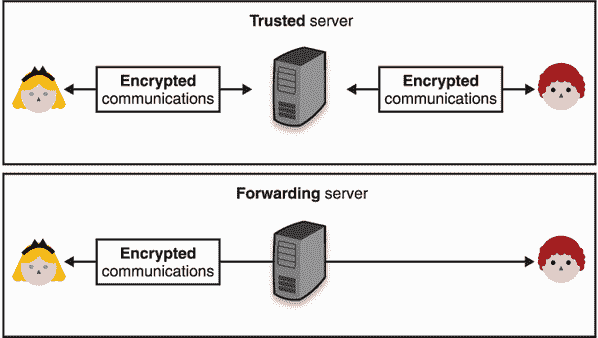

图 10.1 在大多数系统中，中央服务器(上图)在用户之间传递消息。通常在用户和中央服务器之间建立安全连接，因此中央服务器可以看到所有用户消息。一种提供端到端加密的协议(下图)对从一个用户到其预定接收者的通信进行加密，防止中间的任何服务器以明文形式观察消息。

实际上，还有更糟糕的拓扑结构。用户和服务器之间的通信可以通过许多网络中继，其中一些中继可能是查看流量的机器(通常被称为*中间盒*)。即使流量被加密，一些中间体被设置来结束 TLS 连接(我们说它们*终止 TLS* )，并从该点开始清晰地转发流量，或者开始与下一跳的另一个 TLS 连接。TLS 终止有时是出于“好的”原因:为了更好地过滤流量，平衡地理上或数据中心内的连接，等等。这增加了攻击面，因为现在更多地方的交通畅通无阻。有时，TLS 终止是出于“不好的”原因:拦截、记录和监视流量。

2015 年，联想被发现销售预装定制 CAs(见第 9 章)和软件的笔记本电脑。该软件是 MITM 使用联想的 CAs 连接 HTTPS，并将广告注入网页。更令人担忧的是，像中国和俄罗斯这样的大国已经被发现在互联网上重定向流量，让它通过他们的网络，以拦截和观察连接。2013 年，爱德华·斯诺登(Edward Snowden)泄露了美国国家安全局的大量文件，这些文件显示了许多政府(不仅仅是美国)通过拦截连接世界的互联网电缆来监视人们的通信。

拥有和查看用户数据也是公司的责任。正如我在本书中多次提到的，违规和黑客行为发生得太频繁了，可能会对公司的信誉造成毁灭性的影响。从法律的角度来看，像《通用数据保护条例》( GDPR)这样的法律最终会让组织花费很多钱。像臭名昭著的国家安全信件(NSLs)这样的政府要求有时会阻止公司和相关人员提及他们收到了信件(所谓的禁言令)，这也可以被视为一个组织的额外成本和压力，除非你没有什么可分享的。

底线是，如果你正在使用一个流行的在线应用程序，有可能一个或多个政府已经获得或有能力获得你在那里写的或上传的任何东西。根据应用程序的*威胁模型*(应用程序想要防范的内容)或应用程序最易受攻击的用户的威胁模型，端到端加密在确保最终用户的机密性和隐私方面发挥着重要作用。

这一章涵盖了人们为了在人与人之间建立信任而发明的不同技术和协议。特别是，您将了解电子邮件加密目前是如何工作的，以及安全消息传递如何改变端到端加密通信的格局。

## 无处可寻的信任之根

端到端加密的一个最简单的场景如下:Alice 想通过互联网向 Bob 发送一个加密的文件。根据你在本书前几章学到的所有加密算法，你可能会想到一种方法来做到这一点。例如

1.  鲍勃把他的公钥发送给爱丽丝。

2.  爱丽丝用鲍勃的公钥加密文件并发送给鲍勃。

也许 Alice 和 Bob 可以在现实生活中见面，或者使用他们已经共享的另一个安全通道来交换第一条消息中的公钥。如果这是可能的，我们说他们有一种*带外*的方式来创建信任。然而，情况并非总是如此。你可以想象我在这本书里包含了我自己的公钥，并要求你用它在某个电子邮件地址给我发送一条加密的消息。谁说我的文字编辑没有用她的公钥替换公钥？

Alice 也一样:她如何判断她收到的公钥是否真的是 Bob 的公钥呢？有可能中间有人篡改了第一条信息。正如您将在本章中看到的，对于信任这个问题，密码学并没有真正的答案。相反，它提供了不同的解决方案来帮助不同的场景。之所以没有真正的解决方案，是因为我们试图用一个理论上的密码协议来桥接现实(真实的人类)。

保护公钥不被篡改是实际公钥应用中最困难的问题。这是公钥加密的“阿喀琉斯之踵”,很多软件的复杂性都被捆绑在解决这个问题上。

—Zimmermann 等人(“PGP 用户指南第一卷:基本主题”，1992 年)

回到我们的简单设置，Alice 想给 Bob 发送一个文件，假设他们只有一个不可信的连接，他们手头有一个不可思议的信任问题。Alice 没有好的方法来确定 Bob 的公钥到底是什么。这是一种先有鸡还是先有蛋的情况。然而，让我指出，如果没有恶意的活跃的 T2 MITM 攻击者在第一条消息中替换鲍勃的公钥，那么该协议是安全的。即使消息是被动记录的，对于攻击者来说，在事后解密第二条消息也为时已晚。

当然，依靠你成为活跃的 MITM 的几率*不会太高*这一事实并不是从事密码学的最佳方式。不幸的是，我们常常没有办法避免这种情况。例如，Google Chrome 附带了一组它选择信任的证书颁发机构(ca ),但是您最初是如何获得 Chrome 的呢？也许您使用了操作系统的默认浏览器，它依赖于自己的一组 ca。但是这是从哪里来的呢？从你买的笔记本电脑上。但是这台笔记本电脑是哪里来的呢？你可以很快看到，这是“海龟一路下跌”在某种程度上，你将不得不相信一些事情是正确的。

一个威胁模型通常选择在一个特定的海龟之后停止解决问题，并认为任何更低的海龟都超出了范围。这就是为什么这一章的其余部分将假设你有一个安全的方法来获得一些*信任根*。所有基于加密技术的系统都依靠信任根来工作，协议可以在信任根上建立安全性。信任根可以是我们用来启动协议的秘密或公共值，也可以是我们用来获取它们的带外通道。

## 10.3 加密邮件的故障

电子邮件是作为一种*未加密的*协议创建的(至今仍然如此)。我们只能责怪那个安全第二的时代。在 1991 年发布了一款名为 *Pretty Good Privacy* (PGP)的工具之后，电子邮件加密开始变得不仅仅是一个想法。当时，PGP 的创始人 Phil Zimmermann 决定发布 PGP，以回应同年早些时候几乎成为法律的一项法案。该法案将允许美国政府获得任何电子通信公司和制造商的所有语音和文本通信。在他 1994 年的文章“你为什么需要 PGP？”Philip Zimmermann 以“PGP 使人们能够将自己的隐私掌握在自己手中。对它的社会需求越来越大。这就是我写它的原因。”

1998 年，该协议最终在 RFC 2440 中被标准化为 *OpenPGP* ，并在大约同一时间，随着开源实现 *GNU Privacy Guard* (GPG)的发布而受到的关注。今天，GPG 仍然是主要的实现，人们交替使用术语 GPG 和 PGP 来表示相同的意思。

### 10.3.1 PGP 还是 GPG？它是如何工作的？

PGP，或 OpenPGP，通过简单地利用混合加密来工作(在第 6 章中讨论)。详细信息在 RFC 4880(open PGP 的最新版本)中，可以简化为以下步骤:

1.  发件人创建了一封电子邮件。此时，电子邮件的内容在加密之前会被压缩。

2.  OpenPGP 实现生成一个随机对称密钥，并使用该对称密钥对电子邮件进行对称加密。

3.  对称密钥被不对称地加密成每个接收者的公共密钥(使用你在第 6 章中学到的技术)。

4.  所有预期接收者的对称密钥的加密版本与加密消息连接在一起。电子邮件正文被替换为该数据块，并发送给所有收件人。

5.  为了解密电子邮件，收件人使用他们的私钥来解密对称密钥，然后使用解密的对称密钥来解密电子邮件的内容。

请注意，OpenPGP 还定义了如何对电子邮件进行签名，以验证发件人的身份。为此，明文电子邮件的正文被哈希，然后使用发件人的私钥签名。然后，在步骤 2 中加密之前，将签名添加到消息中。最后，为了让收件人能够知道使用什么公钥来验证签名，在步骤 4 中，发件人的公钥将随加密的电子邮件一起发送。我在图 10.2 中展示了 PGP 流程。

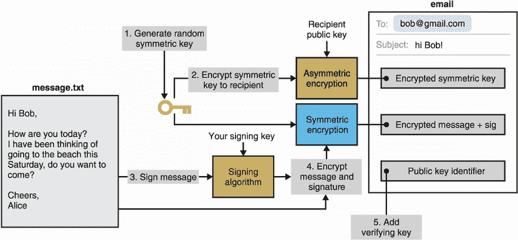

图 10.2 PGP 的目标是对消息进行加密和签名。当与电子邮件客户端集成时，它不关心隐藏主题或其他元数据。

运动

你知道为什么电子邮件的内容在加密前被压缩，而在加密后没有被压缩吗？

乍看之下，这个设计本身并没有什么问题。它似乎可以防止 MITM 攻击者看到您的电子邮件的内容，尽管主题和其他电子邮件标题没有加密。

注意 需要注意的是，密码学并不能总是隐藏所有的元数据。在注重隐私的应用程序中，元数据是一个大问题，在最糟糕的情况下，可能会使您匿名！例如，在端到端加密协议中，您可能无法解密用户之间的消息，但您可能知道他们的 IP 地址是什么，他们发送和接收的消息的长度是多少，他们通常与谁交谈(他们的社交图)，等等。隐藏这种类型的元数据需要大量的工程工作。

然而，在细节上，PGP 其实是相当糟糕的。OpenPGP 标准及其主要实现 GPG 利用了旧的算法，向后兼容性阻止了它们改善这种情况。最关键的问题是加密未经认证，这意味着任何拦截未经签名的电子邮件的人都可能在某种程度上篡改加密的内容，这取决于所使用的确切加密算法。仅仅因为这个原因，我今天不会推荐任何人使用 PGP。

PGP 的一个令人惊讶的缺陷来自于签名和加密操作被随意组合的事实。2001 年，唐·戴维斯指出，由于这种简单的加密算法，人们可以重新加密他们收到的签名邮件，并将其发送给另一个收件人。这有效地允许 Bob 将 Alice 发送给他的电子邮件发送给你，就好像你是预定的收件人一样！

如果你想知道，签署密文而不是明文仍然是有缺陷的，因为人们可以简单地删除密文附带的签名，然后添加他们自己的签名。实际上，鲍勃可以假装他给你发了一封实际上来自爱丽丝的电子邮件。我在图 10.3 中概括了这两个签名问题。

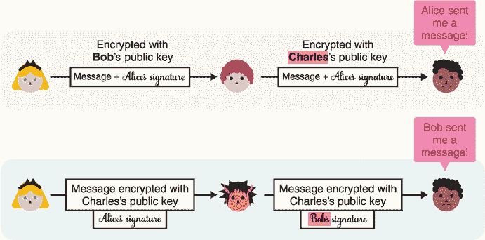

图 10.3 在上图中，Alice 用 Bob 的公钥加密一条消息并在消息上签名。Bob 可以重新加密发送给 Charles 的消息，Charles 可能会认为该消息一开始就是发送给他的。这是 PGP 流程。在下图中，这次 Alice 给 Charles 加密了一条消息。她还对加密的消息而不是明文内容进行签名。Bob 截获了加密的消息，他可以用自己的签名替换签名，欺骗 Charles，使其认为消息的内容是他写的。

运动

你能想出一种明确的方式来签署一条消息吗？

锦上添花的是，算法默认不提供*前向保密*。提醒一下，在没有转发保密的情况下，泄露您的私钥意味着之前发送给您的所有使用该密钥加密的电子邮件现在都可以被解密。您仍然可以通过更改您的 PGP 密钥来强制执行前向保密，但是这个过程并不简单(例如，您可以用您的旧密钥来签署您的新密钥),而且大多数用户根本不在乎。概括一下，记住

*   PGP 使用旧的加密算法。

*   PGP 没有认证加密，因此，如果在没有签名的情况下使用，是不安全的。

*   由于糟糕的设计，收到签名邮件并不一定意味着我们就是预期的收件人。

*   默认情况下没有前向保密性。T2T4T6】

### 10.3.2 用信任网扩展用户之间的信任

那么为什么我在这里真正谈论的是 PGP 呢？关于 PGP，有一些有趣的事情我还没有谈到:你如何获得和信任别人的公钥？答案是，在 PGP 中，你自己建立信任！

好的，这是什么意思？想象一下，你安装了 GPG，并决定你要加密一些信息给你的朋友。首先，您必须找到一种安全的方法来获得您朋友的 PGP 公钥。在现实生活中遇到他们是一种确定的方式。你们见面，你把他们的公钥抄在一张纸上，然后把这些密钥输回你家里的笔记本电脑。现在，您可以使用 OpenPGP 向您的朋友发送签名和加密的消息。但这很乏味。你必须为每一个你想发邮件的人做这些吗？当然不是。让我们来看下面的场景:

*   在现实生活中，你已经获得了 Bob 的公钥，因此你信任它。

*   你没有马克的公钥，但鲍勃有，而且他信任它。

在这里花点时间想一想，你可以做些什么来信任 Mark 的公钥。Bob 可以简单地签署 Mark 的密钥，向您表明他信任公钥和 Mark 的电子邮件之间的关联。如果您信任 Bob，那么您现在可以信任 Mark 的公钥，并将其添加到您的清单中。这是 PGP 的*分散化*信托概念背后的主要思想。如图 10.4 所示，这个被称为*信任网* (WOT)。

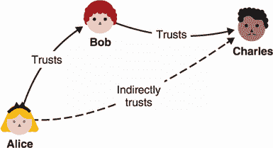

图 10.4 信任网(WOT)是用户可以依靠签名来传递信任其他用户的概念。在这个图中，我们可以看到爱丽丝信任鲍勃，而鲍勃信任查尔斯。Alice 可以在 Charles 的身份和公钥上使用 Bob 的签名来信任 Charles。

你有时会在会议上看到“密钥聚会”,人们在现实生活中见面并签署各自的公钥。但大多数都是角色扮演，而且在实践中，很少有人依靠 WOT 来扩大他们的 PGP 圈子。

### 10.3.3 密钥发现是一个现实问题

PGP 确实尝试了另一种方法来解决发现公钥的问题——*密钥注册中心*。这个概念非常简单:在某个公共列表上发布你的 PGP 公钥和来自其他人的证明你身份的相关签名，这样人们就可以找到它。实际上，这并不可行，因为任何人都可以发布一个据称与您的电子邮件匹配的密钥和相关签名。事实上，一些攻击者故意欺骗关键服务器上的密钥，尽管可能比窥探电子邮件更容易造成破坏。在某些情况下，我们可以放松我们的威胁模型，并允许可信机构来证明身份和公钥。例如，想象一家公司管理他们员工的电子邮件。

1995 年，RSA 公司提出了*安全/多用途互联网邮件扩展* (S/MIME)作为 MIME 格式的扩展(它本身是电子邮件标准的扩展)和 PGP 的替代方案。在 RFC 5751 中标准化的 S/MIME 通过使用公钥基础设施来建立信任，与 WOT 进行了有趣的背离。这几乎是 S/MIME 与 PGP 唯一的概念差异。由于各公司都有针对内部和外部员工的流程，因此他们开始使用 S/MIME 等协议来增强内部电子邮件生态系统的信任度是有意义的。

需要注意的是，PGP 和 S/MIME 通常都在*简单邮件传输协议* (SMTP)之上使用，后者是当今用于发送和接收电子邮件的协议。PGP 和 S/MIME 也是后来发明的，由于这个原因，它们与 SMTP 和电子邮件客户端的集成还远非完美。例如，只加密电子邮件的正文，而不加密主题或任何其他电子邮件标题。与 PGP 一样，S/MIME 也是一个相当老的协议，使用过时的加密技术和实践。像 PGP 一样，它不提供认证加密。

最近关于在电子邮件客户端中集成这两种协议的研究(Efail:“使用渗透通道破解 S/MIME 和 OpenPGP 电子邮件加密”)表明，它们中的大多数容易受到*渗透攻击*，观察加密电子邮件的攻击者可以通过向收件人发送篡改版本来检索内容。

最终，这些缺点可能并不重要，因为世界上大多数收发的电子邮件都是在不加密的情况下通过全球网络传送的。事实证明，PGP 对于非技术用户和高级用户来说都很难使用，他们需要理解 PGP 的许多微妙之处和流程，以便加密他们的电子邮件。例如，我们经常看到用户在没有加密的情况下回复一封加密邮件，并引用明文中的整个线程。最重要的是，流行的电子邮件客户端对 PGP 的支持很差(或者不存在)也没有帮助。

20 世纪 90 年代，我对未来感到兴奋，我梦想有一个人人都安装了 GPG 的世界。现在我仍然对未来感到兴奋，但我梦想有一个我可以卸载它的世界。

莫邪·马林斯派克(《GPG 和我》，2015)

由于这些原因，PGP 已经慢慢失去支持(例如，Golang 在 2019 年从其标准库中移除了对 PGP 的支持)，而越来越多的现实世界密码学应用正致力于取代 PGP 并解决其可用性问题。如今，很难说电子邮件加密会像 HTTPS 那样获得成功并被广泛采用。

*消息能明文发送就明文发送。默认情况下，电子邮件是端到端不加密的。电子邮件的基础是明文。所有主流电子邮件软件都要求明文。有意义的是，互联网电子邮件系统只是被设计成不加密的*。

—托马斯·普塔切克(《2020 年停止使用加密邮件)

### 10.3.4 如果不是 PGP，那是什么？

我花了几页的篇幅谈论像 PGP 这样简单的设计在实践中是如何以各种不同的令人惊讶的方式失败的。是的，我建议不要使用 PGP。虽然电子邮件加密仍然是一个未解决的问题，但替代方案正在开发中，以取代不同的 PGP 用例。

*saltpack* 是类似于 PGP 的协议和消息格式。它试图修复我已经谈到的一些 PGP 缺陷。2021 年 saltpack 的主要实现有 keybase([https://keybase . io](https://keybase.io))和 keys . pub([https://keys . pub](https://keys.pub))。图 10.5 展示了 keys.pub 工具。

图 10.5 keys.pub 是实现 saltpack 协议的原生桌面应用。您可以使用它来导入其他人的公钥，并对发给他们的消息进行加密和签名。

这些实现都脱离了 WOT，并允许用户在不同的社交网络上广播他们的公钥，以便将他们的身份灌输到他们的公钥中(如图 10.6 所示)。PGP 显然没有预料到这个关键的发现机制，因为它早于社交网络的繁荣。

图 10.6 key base 用户在 Twitter 社交网络上广播他们的公钥。这允许其他用户获得其身份与特定公钥相关联的额外证明。

另一方面，如今大多数安全通信远非一次性信息，这些工具的使用也越来越少。在下一节中，我将讨论*安全消息传递*，它是旨在取代 PGP 通信方面的领域之一。

## 10.4 安全消息传递:用信号实现端到端加密的现代视角

2004 年，*非公开* (OTR *)* 在一份名为《非公开沟通，或者，为什么不使用 PGP》的白皮书中被引入与 PGP 或 S/MIME 不同，OTR 不用于加密电子邮件，而是用于加密聊天信息；具体来说，它扩展了一个名为的聊天协议*可扩展消息和在线协议* (XMPP)。

OTR 的一个显著特征是*可否认性*——声称你的信息的接收者和被动的观察者不能在法庭上使用你发送给他们的信息。因为您发送的消息是用您的收件人与您共享的密钥对称地认证和加密的，所以他们可以很容易地自己伪造这些消息。相比之下，使用 PGP，消息是签名的，因此是可否认的相反——消息是*不可否认的*。据我所知，这些属性实际上都没有在法庭上测试过。

2010 年，Signal 移动电话应用程序(当时称为 TextSecure)发布，使用了一种新创建的协议，称为*信号协议*。当时，大多数安全通信协议，如 PGP、S/MIME 和 OTR，都是基于*联邦协议*，网络工作不需要中央实体。Signal mobile 应用程序很大程度上背离了传统，它运行一个中央服务并提供一个单一的官方 Signal 客户端应用程序。

虽然 Signal 阻止了与其他服务器的互操作性，但 Signal 协议是开放的标准，已被许多其他消息应用程序采用，包括 Google Allo(现已解散)、WhatsApp、Facebook Messenger、Skype 和许多其他应用程序。信号协议确实是一个成功的故事，被数十亿人透明地使用，包括记者、政府监控的目标，甚至我 92 岁的祖母(我发誓我没有让她安装它)。

了解 Signal 的工作原理很有趣，因为它试图修复我之前提到的 PGP 的许多缺陷。在本节中，我将逐一介绍 Signal 的以下有趣特性:

*   我们怎样才能做得比 WOT 更好？有没有办法用端到端加密来升级现有的社交图谱？Signal 的回答是在首次使用时使用*信任*(豆腐)方法。豆腐让用户在第一次交流的时候盲目信任其他用户，依靠这种第一次的、不安全的交流，建立起持久的安全交流渠道。然后，用户可以在将来的任何时候，通过带外匹配他们的会话秘密，自由检查第一次交换是否是 MITM 的。

*   我们如何在每次开始与某人对话时升级 PGP 以获得前向保密？信号协议的第一部分就像大多数安全传输协议一样:它是一个密钥交换，但是一个特殊的协议叫做*扩展三重 Diffie-Hellman* (X3DH)。稍后会有更多关于的内容。

*   我们如何升级 PGP 来获得每个消息的前向保密性？这一点很重要，因为用户之间的对话可能会持续数年，某个时间点的妥协不应该暴露多年的交流。Signal 用一种叫做*对称棘轮*的东西来解决这个问题。

*   如果两个用户的会话秘密在某个时间点被泄露了怎么办？游戏结束了吗？我们还能从中恢复吗？Signal 引入了一种新的安全属性，称为*妥协后安全* (PCS)，并使用被称为 *Diffie-Hellman* (DH) *棘轮*的来解决这个问题。

我们开始吧！首先，我们将看看信号的豆腐味道是如何工作的。

### 10.4.1 比 WOT 更方便用户:信任但核实

电子邮件加密最大的失败之一是它依赖 PGP 和 WOT 模型将社交图转换为*安全的*社交图。PGP 的原始设计旨在让人们亲自见面进行*密钥签署仪式*(也称为*密钥签署聚会*)以确认彼此的密钥，但这在许多方面都很麻烦和不方便。今天真的很少看到人们互相签署 PGP 密钥。

大多数人使用 PGP、OTR、Signal 等应用程序的方式是，第一次看到密钥时盲目信任它，拒绝任何未来的更改(如图 10.7 所示)。这样，只有第一个连接会受到攻击(而且只有活跃的 MITM 攻击者才能攻击)。

图 10.7 首次使用时的信任(豆腐)允许 Alice 信任她的第一个连接，但如果后续连接没有展示相同的公钥，则不信任它们。当第一次联系被主动 MITM 的几率很低时，豆腐是一种建立信任的简单机制。公钥和身份(这里是 Bob)之间的关联也可以在事后在不同的信道中被验证。

虽然豆腐不是最好的安全模型，但它通常是我们拥有的最好的安全模型，并且被证明非常有用。例如，安全的 Shell (SSH)协议通常通过在初始连接期间信任服务器的公钥(见图 10.8)并拒绝任何未来的更改来使用。

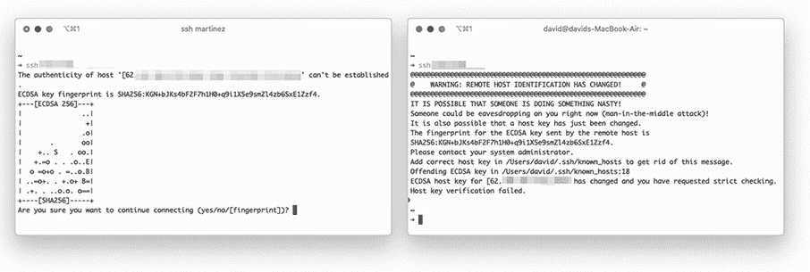

图 10.8 SSH 客户端首次使用信任。第一次连接到 SSH 服务器时(左图)，您可以选择盲目信任 SSH 服务器和显示的公钥之间的关联。如果 SSH 服务器的公钥后来改变了(右图)，您的 SSH 客户机将阻止您连接到它。

虽然豆腐系统信任它们看到的第一个密钥，但它们仍然允许用户稍后验证该密钥确实是正确的，并捕捉任何假冒尝试。在现实世界的应用中，用户通常会比较*指纹*，指纹通常是公钥或公钥哈希的十六进制表示。当然，这种验证是在带外完成的。(如果 SSH 连接受损，那么验证也会受损。)

注 当然，如果用户不验证指纹，那么他们可能会在不知情的情况下被 MITM。但这是现实世界的应用程序在大规模实现端到端加密时必须处理的一种权衡。事实上，WOT 的失败表明，关注安全性的应用程序必须牢记可用性才能被广泛采用。

在 Signal mobile 应用程序中，Alice 和 Bob 之间的指纹计算如下:

1.  哈希 Alice 的以她的用户名(信号中的电话号码)为前缀的身份密钥，并将该摘要的截断解释为一系列数字

2.  为鲍勃做同样的事情

3.  向用户显示两个数列的串联

像 Signal 这样的应用利用*二维码*让用户更容易验证指纹，因为这些码可能很长。图 10.9 展示了这个用例。

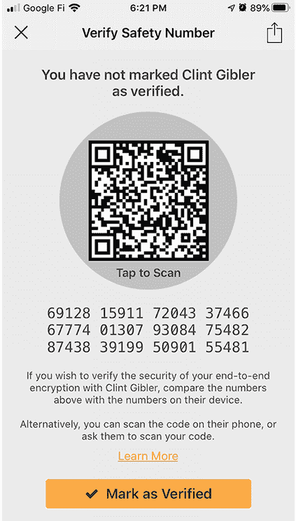

图 10.9 使用 Signal，您可以通过使用不同的渠道(就像在现实生活中一样)来验证您与朋友之间连接的真实性和保密性，以确保您和您朋友的两个指纹(Signal 称之为*安全号码*)匹配。通过使用 QR 码可以更容易地做到这一点，QR 码以可扫描的格式对信息进行编码。Signal 还哈希会话秘密而不是两个用户的公钥，允许他们验证一个大字符串而不是两个。

接下来，让我们看看 Signal 协议是如何工作的——特别是 Signal 如何实现前向安全。

### 10.4.2 X3DH:信号协议的握手

信号之前最安全的短信应用有*同步*。这意味着，例如，如果 Bob 不在线，Alice 无法开始(或继续)与 Bob 的端到端加密对话。另一方面，信号协议是*异步*(就像电子邮件一样)，这意味着爱丽丝可以与离线的人开始(并继续)对话。

记住*前向保密*(在第 9 章中介绍)意味着密钥的泄露不会泄露之前的会话，前向保密通常意味着密钥交换是交互式的，因为双方都必须生成短暂的 Diffie-Hellman (DH)密钥对。在这一节中，您将看到信号如何使用*非交互式*密钥交换(其中一方可能离线的密钥交换)仍然是前向安全的。好了，我们走吧。

为了与 Bob 开始对话，Alice 主动与他交换了密钥。Signal 的密钥交换 X3DH 将三个(或更多)DH 密钥交换合并为一个。但是在您了解其工作原理之前，您需要了解 Signal 使用的三种不同类型的 DH 键:

*   *身份密钥*—这些是代表用户的长期密钥。你可以想象，如果 Signal 只使用身份密钥，那么该方案将相当类似于 PGP，并且没有前向保密性。

*   *一次性预密钥*——为了增加密钥交换的前向保密性，即使新对话的接收者不在线，Signal 也让用户上传多个*一次性*公钥。它们只是提前上传并在使用后删除的临时密钥。

*   *签名的预密钥*—我们可以到此为止，但是缺少一个边缘情况。因为用户上传的一次性预密钥在某个时候会被耗尽，所以用户还必须上传一个他们签名的*中期*公钥:一个已签名的预密钥。这样，如果服务器上您的用户名下不再有一次性预密钥，其他人仍然可以使用您的签名预密钥来添加前向保密，直到您最后一次更改您的签名预密钥。这也意味着您必须定期轮换您的签名预密钥(例如，每周一次)。

这足以预览 Signal 中的对话创建流程。图 10.10 给出了一个概述。

图 10.10 信号的流程始于用户注册多个公钥。如果 Alice 想和 Bob 说话，她首先检索 Bob 的公钥(称为*预密钥包*)，然后用这些密钥执行 X3DH 密钥交换，并使用密钥交换的输出创建初始消息。在收到消息后，Bob 可以在他那端执行相同的操作来初始化并继续会话。

让我们更深入地回顾一下这些步骤。首先，用户通过发送以下内容进行注册:

*   一个身份密钥

*   一个签名的预密钥及其签名

*   规定数量的一次性预密钥

此时，用户有责任定期轮换已签名的预密钥并上传新的一次性预密钥。我在图 10.11 中重述了这个流程。

注 Signal 利用身份密钥在 X3DH 密钥交换期间对已签名的预密钥和密钥交换进行签名。虽然我已经警告过不要将同一个密钥用于不同的目的，但 Signal 已经仔细分析过，在他们的情况下，应该没有问题。这并不意味着这将在*你的*情况下和*你的*密钥交换算法下工作。一般来说，我建议不要将一把钥匙用于不同的目的。

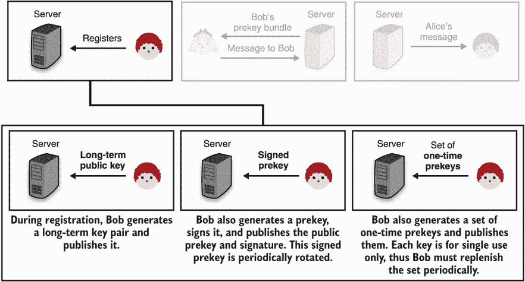

图 10.11 在图 10.10 的基础上，第一步是用户通过生成多个 DH 密钥对并向中央服务器发送公共部分来进行注册。

在图 10.11 中介绍的步骤之后，Alice(回到我们的例子)将通过检索以下内容与 Bob 开始对话:

*   鲍勃的身份钥匙。

*   Bob 的当前签名预密钥及其相关签名。

*   如果还有一些，Bob 的一次性预密钥之一(然后服务器删除发送给 Alice 的一次性预密钥)。

爱丽丝可以验证签名预密钥上的签名是正确的。然后，她执行 X3DH 握手:

*   来自 Bob 的所有公钥

*   她为这一场合生成的临时密钥对，以增加前向保密性

*   她自己的身份钥匙

然后，X3DH 的输出被用于后 X3DH 协议，该协议用于加密她给 Bob 的消息(下一节将详细介绍)。X3DH 由三个(可选地，四个)DH 密钥交换组成，组合成一个。DH 密钥交换发生在:

1.  爱丽丝的身份密钥和鲍勃的签名预密钥

2.  爱丽丝的临时密钥和鲍勃的身份密钥

3.  爱丽丝的临时密钥和鲍勃的签名预密钥

4.  如果 Bob 仍然有可用的一次性预密钥，他的一次性预密钥和 Alice 的临时密钥

X3DH 的输出是所有 DH 密钥交换的串联，传递给一个密钥派生函数(KDF)，我们在第 8 章中讨论过。不同的密钥交换提供不同的属性。第一个和第二个是为了相互认证，而最后两个是为了前向保密。所有这些都在 X3DH 规范([【https://signal.org/docs/specifications/x3dh/】](https://signal.org/docs/specifications/x3dh/))中有更深入的分析，如果你想了解更多，我鼓励你去读一读，因为它写得很好。图 10.12 概括了这一流程。

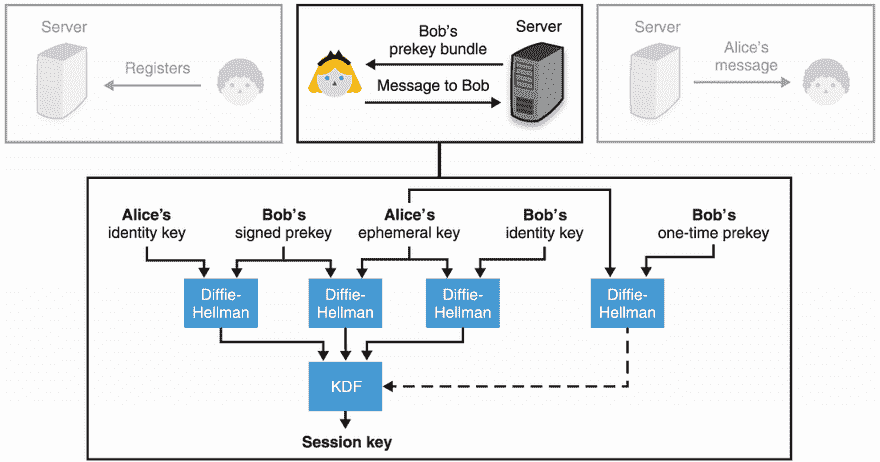

图 10.12 在图 10.10 的基础上，为了向 Bob 发送消息，Alice 获取包含 Bob 的长期密钥、Bob 的签名预密钥以及可选的 Bob 的一个一次性预密钥的预密钥包。在使用不同的密钥执行不同的密钥交换之后，所有的输出被连接并传递到一个 KDF 中，以产生一个在随后的后 X3DH 协议中使用的输出来加密发送给 Bob 的消息。

Alice 现在可以向 Bob 发送她的身份公钥、她为开始对话而生成的临时公钥以及其他相关信息(比如她使用了 Bob 的哪个一次性预密钥)。Bob 接收到该消息，并且可以使用其中包含的公钥执行完全相同的 X3DH 密钥交换。(由于这个原因，我跳过说明这个流程的最后一步。)如果 Alice 使用了 Bob 的一个一次性预密钥，Bob 会丢弃它。X3DH 做好之后会怎么样？接下来让我们来看看。

### 10.4.3 双棘轮:信号的握手后协议

只要两个用户没有删除他们的对话或者丢失他们的任何密钥，后 X3DH 阶段就存在。出于这个原因，也因为 Signal 在设计时就考虑到了 SMS 对话，两条消息之间的时间可能以月计算，Signal 在消息级别引入了*转发保密*。在本节中，您将了解这种握手后协议(称为*双棘轮*)是如何工作的。

但是首先，想象一个简单的后 X3DH 协议。Alice 和 Bob 可以将 X3DH 的输出作为会话密钥，并用它来加密他们之间的消息，如图 10.13 所示。

图 10.13 天真地，后 X3DH 协议可以简单地使用 X3DH 的输出作为会话密钥来加密 Alice 和 Bob 之间的消息。

尽管如此，我们通常希望将用于不同目的的键分开。我们能做的是使用 X3DH 的输出作为一个 KDF 的*种子*(或*根密钥*，根据双棘轮规范)来导出另外两个密钥。Alice 可以使用一个密钥加密发送给 Bob 的消息，Bob 可以使用另一个密钥加密发送给 Alice 的消息。我在图 10.14 中说明了这一点。

图 10.14 在图 10.13 的基础上，一个更好的后 X3DH 协议将利用 KDF 和密钥交换的输出来区分用于加密 Bob 和 Alice 的消息的密钥。这里 Alice 的发送密钥与 Bob 的接收密钥相同，Bob 的发送密钥与 Alice 的接收密钥相同。

这种方法可能足够了，但 Signal 指出，发短信的时间可能会持续数年。这与第 9 章的 TLS 会话不同，后者通常被认为是短命的。因此，如果在任何时间点会话密钥被盗，所有以前记录的消息都可以被解密！

为了解决这个问题，Signal 引入了被称为的*对称棘轮*(如图 10.15 所示)。*发送密钥*现在被重命名为*发送链密钥*，并且不直接用于加密消息。当发送消息时，Alice 不断地将发送链密钥传递给一个单向函数，该函数产生下一个发送链密钥以及实际的发送密钥来加密她的消息。另一方面，Bob 必须做同样的事情，但是使用接收链密钥。因此，通过泄露一个发送密钥或发送链密钥，攻击者不能恢复先前的密钥。(而接收消息时也是如此。)

图 10.15 在图 10.14 的基础上，可以在后 X3DH 协议中引入前向保密，方法是*每次需要发送消息时棘轮*(传入 KDF)一个链密钥，每次接收消息时棘轮另一个链密钥。因此，发送或接收链密钥的泄露不允许攻击者恢复以前的密钥。

很好。现在，我们已经将前向保密融入了我们的协议和消息级别。发送和接收的每封邮件都会保护所有以前发送和接收的邮件。请注意，这是有争议的，因为破坏密钥的攻击者很可能通过破坏用户的手机来实现这一点，手机很可能在密钥旁边包含所有以前的明文消息。然而，如果对话中的两个用户都决定删除之前的消息(例如，通过使用 Signal 的“消失消息”功能)，则实现了前向保密属性。

信号协议还有最后一件我想说的有趣的事情:PCS ( *后妥协安全*，也叫*后向保密*，正如你在第八章中所学的)。PCS 的理念是，如果您的密钥在某个时候被泄露，您仍然可以设法恢复，因为协议会自我修复。当然，如果攻击者在妥协后仍然可以访问您的设备，那么这是徒劳的。

只有重新引入新的熵，电脑才能工作，而新的熵是一个非持久性的妥协所无法获得的。新的熵对于两个对等体必须是相同的。Signal 寻找这种熵的方法是进行短暂的密钥交换。为此，信号协议在所谓的 *DH 棘轮*中持续执行密钥交换。协议发送的每条消息都带有当前的棘轮公钥，如图 10.16 所示。

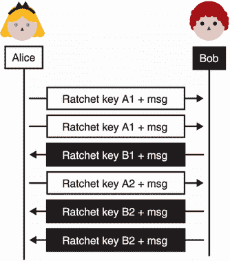

图 10.16 Diffie-Hellman(DH)棘轮的工作原理是在发送的每条消息中公布一个棘轮公钥。这个棘轮公钥可以与前一个相同，或者如果参与者决定刷新他们的公钥，它可以通告新的棘轮公钥。

当 Bob 注意到来自 Alice 的新棘轮密钥时，他必须使用 Alice 的新棘轮密钥和 Bob 自己的棘轮密钥执行新的 DH 密钥交换。然后，该输出可以与对称棘轮一起用于解密接收到的消息。我在图 10.17 中说明了这一点。

图 10.17 当从 Alice 处收到新的棘轮公钥时，Bob 必须用它和自己的棘轮密钥进行密钥交换，以导出解密密钥。这是通过对称棘轮实现的。爱丽丝的信息可以被解密。

Bob 在收到新的棘轮密钥时必须做的另一件事是为自己生成一个新的随机棘轮密钥。有了新的棘轮密钥，他可以与 Alice 的新棘轮密钥进行另一次密钥交换，然后用它来加密发送给 Alice 的消息。这应该如图 10.18 所示。

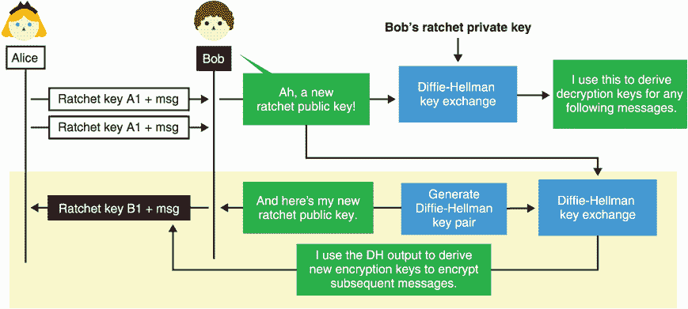

图 10.18 在图 10.17 的基础上，收到新的棘轮密钥后，Bob 还必须为自己生成一个新的棘轮密钥。这个新的棘轮密钥用于导出加密密钥，并在 Alice 的下一系列消息中向 Alice 通告(直到他从 Alice 接收到新的棘轮密钥)。

在双棘轮规范中，这种来回的密钥交换被称为“乒乓”:

*这导致“乒乓”行为，因为各方轮流更换棘轮密钥对。短暂地危及其中一方安全的窃听者可能知道当前棘轮私钥的值，但是该私钥最终将被未被危及安全的私钥所取代。此时，棘轮密钥对之间的 Diffie-Hellman 计算将定义一个攻击者未知的 DH 输出*。

—双棘轮算法

最后，DH 棘轮和对称棘轮的组合称为*双棘轮*。把它想象成一个图表有点密集，但是图 10.19 试图做到这一点。

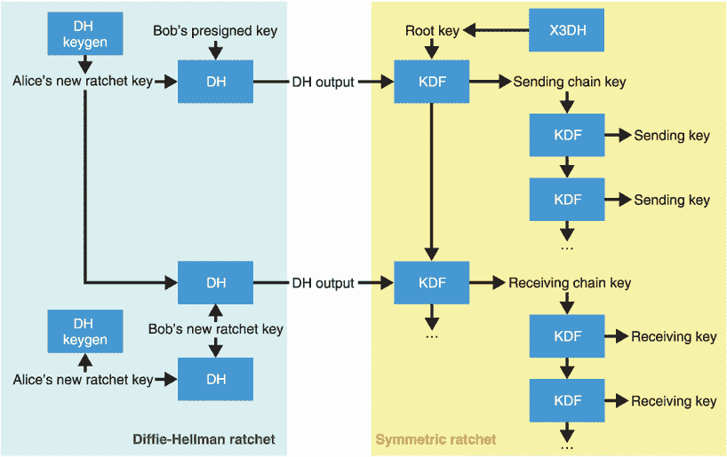

图 10.19 双棘轮(从爱丽丝的角度看)结合了 DH 棘轮(左边)和对称棘轮(右边)。这为后 X3DH 协议提供了 PCS 和前向保密性。在第一条消息中，Alice 还不知道 Bob 的棘轮密钥，所以她使用了他的预签名密钥。

我知道这最后一张图相当密集，所以我鼓励你看一下 Signal 的规格，它发表在 https://signal.org/docs 的 [上。它们为该协议提供了另一个很好的解释。](https://signal.org/docs)

## 10.5 端到端加密的状态

如今，用户之间的大多数安全通信都是通过安全消息应用程序而不是加密电子邮件进行的。Signal 协议在同类协议中是明显的赢家，被许多专有应用程序采用，也被 XMPP(通过 OMEMO 扩展)和 Matrix(IRC 的现代替代品)等开源和联邦协议采用。另一方面，PGP 和 S/MIME 正在被放弃，因为公开的攻击已经导致信任的丧失。

如果你想编写自己的端到端加密消息应用程序，该怎么办？不幸的是，这个领域中使用的很多东西都是临时的，为了获得一个全功能、安全的系统，您必须自己填写许多细节。Signal 已经开源了很多代码，但是它缺乏文档，很难正确使用。另一方面，您可能会更幸运地使用像 Matrix 这样的分散式开源解决方案，它可能更容易集成。这就是法国政府所做的。

在我们结束这一章之前，我还想谈谈一些未解决的问题和正在研究的问题。例如

*   群发消息

*   支持多种设备

*   比豆腐更安全的保证

让我们从第一项开始:*群发信息*。此时，虽然不同的应用程序以不同的方式实现了群组消息，但群组消息仍在积极研究中。例如，Signal 应用程序让客户理解群聊。服务器只能看到成对的用户在交谈——不多也不少。这意味着客户端必须对群聊消息进行加密，然后发送给所有群聊参与者。这被称为*客户端扇出*，并且的伸缩性不是很好。对于服务器来说，当它看到 Alice 时，它也不难判断出哪些是组成员，例如，向 Bob 和 Charles 发送几条相同长度的消息(图 10.20)。

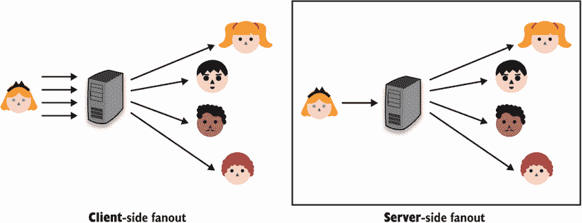

图 10.20 有两种方法可以实现群组聊天的端到端加密。客户端扇出方法意味着客户端必须使用已经存在的加密通道单独地向每个接收者发送消息。这是向服务器隐藏组成员的好方法。服务器端扇出方法允许服务器向每个群聊参与者转发消息。从客户端的角度来看，这是减少发送消息数量的好方法。

另一方面，WhatsApp 使用一种信号协议的变体，在这种协议中，服务器知道群聊成员。这一改变允许参与者向服务器发送单个加密的消息，而服务器将负责将其转发给群组成员。这个叫做*服务器端扇出*。

群聊的另一个问题是大型成员集的*缩放*到群组。为此，该行业的许多参与者最近聚集在一个*消息层安全* (MLS)标准周围，以大规模处理安全的群组消息。但似乎有很多工作要做，人们会想，在一个超过 100 名参与者的群聊中真的有任何保密性吗？

注意 这仍然是一个活跃的研究领域，不同的方法在安全性和可用性方面有不同的权衡。例如，在 2021 年，似乎没有群聊协议提供*抄本一致性*，这是一种加密属性，确保群聊的所有参与者以相同的顺序看到相同的消息。

对多种设备的支持要么不是一件事，要么以各种方式实现，最常见的方式是假装您的不同设备是群聊的不同参与者。豆腐模型会使处理多个设备变得非常复杂，因为每个设备拥有不同的身份密钥会成为一个真正的密钥管理问题。想象一下，您必须验证您和您朋友的每台设备的指纹。例如，Matrix 让用户在自己的设备上签名。然后，其他用户可以通过验证他们的相关签名，将您的所有设备作为一个实体来信任。

最后，我提到豆腐模型也不是最好的，因为它是基于我们第一次看到公钥时的信任，并且大多数用户不会在以后验证指纹是否匹配。对此能做些什么吗？如果服务器决定只将 Bob 模拟成 Alice 会怎样？这是一个*关键透明*正在努力解决的问题。密钥透明(Key Transparency)是 Google 提出的一个协议，类似于我在第九章中谈到的证书透明协议。还有一些利用区块链技术的研究，我将在关于加密货币的第 12 章中谈到。

## 总结

*   端到端加密是为了保护真实人类之间的通信安全。实现端到端加密的协议对位于用户之间的服务器中可能发生的漏洞更具弹性，并且可以大大简化公司的法律要求。

*   端到端加密系统需要一种方法来引导用户之间的信任。这种信任可以来自我们已知的公钥或我们信任的带外通道。

*   PGP 和 S/MIME 是目前用于加密电子邮件的主要协议，但是它们都没有被认为是安全的，因为它们使用了旧的加密算法和实践。它们与电子邮件客户端的集成也很差，实践证明，这些客户端容易受到不同的攻击。

    *   PGP 使用信任网(WOT)模型，在这种模型中，用户相互签署公钥，以便让其他人信任他们。
    *   S/MIME 使用公钥基础设施在参与者之间建立信任。它最常用于公司和大学。
*   PGP 的替代产品是 saltpack，它修复了许多问题，同时依靠社交网络来发现其他人的公钥。

*   电子邮件总是会有加密问题，因为该协议在设计时并没有考虑加密。另一方面，现代消息协议和应用程序被认为是加密电子邮件的更好替代方案，因为它们是在考虑端到端加密的情况下构建的。

    *   大多数消息应用程序都使用 Signal 协议来保护用户之间的端到端通信。Signal messenger、WhatsApp、Facebook Messenger 和 Skype 都宣传他们使用 Signal 协议来保护信息。
    *   其他协议，如 Matrix，试图标准化用于端到端加密消息传递的联合协议。联邦协议是开放的协议，任何人都可以与之互操作(与局限于单个应用程序的集中式协议相反)。