# 11 用户认证

本章涵盖了

*   验证人和数据的区别
*   用户认证根据密码或密钥对用户进行认证
*   用户辅助认证，保护用户设备之间的连接

在本书的导言中，我将密码学归结为两个概念:保密性和认证。在现实世界的应用程序中，保密性(通常)是最不重要的问题；身份验证是最复杂的地方。我知道我已经在本书中谈了很多关于认证的内容，但是它可能是一个令人困惑的概念，因为它在密码学中有不同的含义。出于这个原因，本章从介绍身份验证的真正含义开始。和通常的加密技术一样，没有一种协议是万能的，本章的其余部分将教你大量的在现实应用中使用的认证协议。

## 11.1 认证概述

到目前为止，您已经多次听说过身份验证，所以让我们回顾一下。你了解到了

*   加密原语中的认证，如消息认证码(在第 3 章中介绍)和认证加密(在第 4 章中介绍)

*   加密协议中的认证，如 TLS(在第 9 章中介绍)和 Signal(在第 10 章中介绍)，其中可以对协议的一个或多个参与者进行认证

在第一种情况下，认证是指消息的*真实性*(或*完整性*)。在后一种情况下，认证指的是*向其他人证明你是谁*。这些是同一个词涵盖的不同概念，可能会相当混乱！但是这两种用法都是正确的，正如牛津英语词典([http://www.oed.com/](http://www.oed.com/))所指出的:

*认证。证明或显示某事真实、真实或有效的过程或行为*。

由于这个原因，您应该将认证视为密码学中的一个术语，根据上下文来传达两个不同的概念:

*   *消息/有效载荷认证*—您要证明消息是真实的，并且自创建以来未被修改过。(例如，这些消息是否经过身份验证，或者是否有人可以篡改它们？)

*   *来源/实体/身份认证*—你在证明一个实体确实是他们所说的那个人。(比如，我真的在和【google.com】交流吗？)

底线:认证是关于证明某样东西是它应该是的，并且某样东西可以是一个人、一条消息或其他东西。在本章中，我将使用术语*认证*来指代识别人或机器。换句话说，*身份*认证。顺便说一句，您已经看到了很多关于这种身份验证的内容:

*   在第 9 章“安全传输”中，您了解了机器可以通过使用公钥基础设施(PKI)来大规模认证其他机器。

*   在第 10 章中，关于端到端加密，你学习了人类如何通过第一次使用使用*信任*(豆腐)(稍后验证)或通过使用信任(WOT)技术的网络来大规模认证彼此。

在本章中，你将学习以下两个之前没有提到的案例。(我在图 11.1 中重述了这些。)

*   *用户认证*，或者机器如何认证人类——哔哔

*   *用户辅助认证*，或者说人类如何帮助机器相互认证

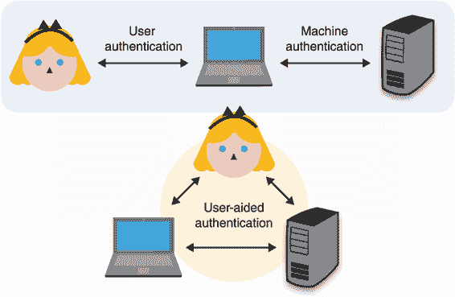

图 11.1 在这本书里，我讲了三类场景下的起源认证。当设备对人进行身份验证时，就会发生用户身份验证。当一台机器对另一台机器进行身份验证时，就会发生机器身份验证。当一台机器对另一台机器进行身份验证时，就会发生用户辅助身份验证。

身份认证的另一个方面是身份部分。事实上，我们如何在密码协议中定义像爱丽丝这样的人呢？机器如何认证你和我？不幸的是(或者说幸运的是)，血肉之间存在着固有的鸿沟。为了连接现实和数字世界，我们总是假设 Alice 是唯一知道一些秘密数据的人，为了证明她的身份，她必须证明她知道那些秘密数据。例如，她可能正在发送她的密码，或者她可能正在使用与她的公钥相关联的私钥签署随机质询。

好了，介绍到此为止。如果这一节没有太多意义，接下来的大量例子将会有意义。现在，让我们先来看看机器已经找到的认证我们人类的许多方法！

## 11.2 用户认证，或寻求摆脱密码

本章第一部分是关于机器如何认证人类，或者换句话说，*用户认证*。有很多方法可以做到这一点，没有一个解决方案是万能的。但是在大多数用户认证场景中，我们假设

*   服务器已经通过认证。

*   用户与其共享安全连接。

例如，你可以想象服务器通过 web 公钥基础设施(PKI)向用户认证，连接通过 TLS 保护(两者都在第 9 章讨论)。从某种意义上说，本节的大部分内容是关于将单向认证连接升级为相互认证连接，如图 11.2 所示。

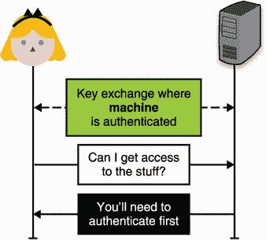

图 11.2 用户认证通常发生在一个已经安全的通道上，但是只有服务器被认证。一个典型的例子是，当您使用 HTTPS 浏览网页，并使用您的凭证登录到网页。

我必须警告你:用户身份验证是一个巨大的失信之地。您一定多次使用密码来验证不同的网页，您自己的经历可能类似于以下内容:

1.  你在网站上用用户名和密码注册。

2.  您使用新凭据登录网站。

3.  您在恢复帐户后或因为网站强制您更改密码。

4.  如果你运气不好，你的密码(或它的哈希值)会在一系列的数据库漏洞中泄露。

听起来熟悉吗？

注 本章我将忽略*密码/账户恢复*，因为它们与密码学关系不大。只要知道他们经常与你第一次注册的方式联系在一起。例如，如果您在工作场所的 IT 部门注册，那么如果您丢失了密码，您可能必须去找他们，如果您不小心，他们可能是您系统中最薄弱的环节。事实上，如果我可以通过拨打一个号码并告诉某人你的出生日期来恢复你的帐户，那么在登录时再酷的加密技术也无济于事。

实现前面的用户认证流程的一个简单方法是在注册时存储用户密码，然后在登录时要求用户输入密码。正如在第 3 章中提到的，一旦成功认证，用户通常会得到一个 cookie，它可以在每个后续请求中发送，而不是用户名和密码。但是等等；如果服务器以明文形式存储您的密码，那么对其数据库的任何破坏都会将您的密码泄露给攻击者。然后，这些攻击者将能够使用它登录到您使用相同密码注册的任何网站。

存储密码的一个更好的方法是使用*密码哈希*算法，就像你在第二章中学习的标准化的 Argon2。这将有效地防止对数据库的破坏和抓取类型的攻击泄漏您的密码，尽管不受欢迎的入侵者仍然能够在您每次登录时看到您的密码。然而，许多网站和公司仍然以明文形式存储密码。

运动

有时，应用程序试图解决服务器在注册时获知用户密码的问题，方法是在将密码发送给服务器之前，让客户端对密码进行哈希处理(可能使用密码哈希)。你能确定这是否真的有效吗？

此外，人类天生不擅长密码。我们通常最喜欢小而易记的密码。而且，如果可能的话，我们希望在任何地方都重复使用同一个密码。

*81%的黑客入侵都利用了被盗或弱密码*。

—威瑞森数据泄露报告(2017)

弱密码和密码重复使用的问题导致了许多愚蠢而恼人的设计模式，试图迫使用户更认真地对待密码。例如，一些网站要求您在密码中使用特殊字符或强制您每 6 个月更改一次密码，等等。此外，许多协议试图“修复”密码或完全删除密码。每年，新的安全专家似乎都认为“密码”的概念已经死亡。然而，它仍然是最广泛使用的用户认证机制。

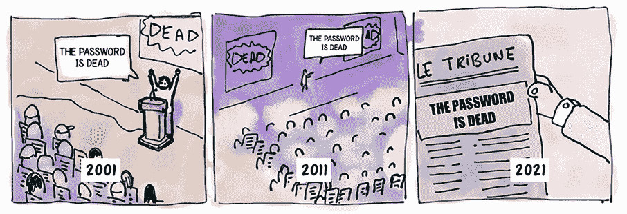

现在你知道了，密码可能会一直存在。然而，存在许多改进或替代密码的协议。让我们看看那些。

### 11.2.1 一个密码管理所有人:单点登录(SSO)和密码管理员

好吧，密码复用不好，那我们该怎么办？天真地，用户可以为不同的网站使用不同的密码，但是这种方法有两个问题:

*   用户不擅长创建许多不同的密码。

*   记住多个密码所需的脑力负荷是不切实际的。

为了缓解这些担忧，两种解决方案被广泛采用:

*   *单点登录*(SSO)——SSO 的思想是允许用户通过证明他们拥有单个服务的帐户来连接到许多不同的服务。这样，用户只需记住与该服务相关联的密码，就能够连接到许多服务。想象一下如图 11.3 所示的“与脸书连接”类型的按钮。

*   *密码管理器*—如果您使用的不同服务都支持它，那么之前的 SSO 方法很方便，但这显然不适合 web 这样的场景。在这些极端情况下，更好的方法是改进客户端，而不是试图在服务器端解决问题。如今，现代浏览器内置了密码管理器，可以在你注册新网站时建议复杂的密码，只要你记住一个主密码，它们就能记住你所有的密码。

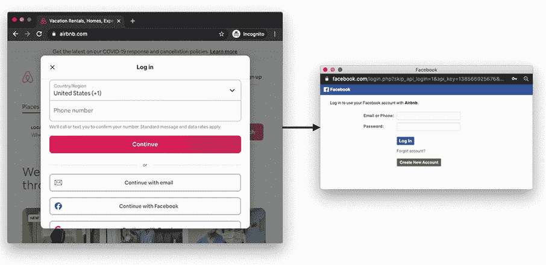

图 11.3 网络单点登录示例。通过在脸书或谷歌上拥有一个帐户，用户可以连接到新的服务(在这个例子中，Airbnb)，而不必考虑新的密码。

SSO 的概念在企业中并不新鲜，但它在普通最终用户中的成功却是最近的事。如今，在设置 SSO 时，有两种协议是主要的竞争对手:

*   *安全断言标记语言 2.0*(SAML)——一种使用可扩展标记语言编码的协议。

*   *OpenID Connect*(OIDC)——使用 JavaScript 对象符号(JSON)编码对 OAuth 2.0 (RFC 6749)授权协议的扩展。

SAML 仍然被广泛使用，主要是在企业环境中，但它(在这一点上)是一个遗留协议。另一方面，OIDC 在网络和移动应用程序中随处可见。你很可能已经用过了！

认证协议通常被认为很难做好。OIDC 所依赖的协议 OAuth2 因容易被滥用而臭名昭著。另一方面，OIDC 被很好地指定了(参见 https://openid.net)。确保您遵循标准并查看最佳实践，因为这可以为您省去许多麻烦。

注意 这是另一个相当大的公司决定*不*采纳这个建议的例子。2020 年 5 月，从 OIDC 出发的苹果单点登录流程被发现存在漏洞。任何人都可以通过查询苹果的服务器获得任何苹果账户的有效 id 令牌。

SSO 对用户来说很棒，因为它减少了他们必须管理的密码数量，但它并没有完全删除密码。用户仍然需要使用密码来连接 OIDC 提供商。接下来，让我们看看密码学是如何帮助隐藏密码的。

### 11.2.2 不想看到自己的密码？使用非对称密码验证密钥交换

上一节调查了试图简化用户身份管理的解决方案，允许用户仅使用与单个服务关联的一个帐户来认证多个服务。虽然像 OIDC 这样的协议很棒，因为它们有效地减少了用户必须管理的密码数量，但它们并没有改变这样一个事实，即一些服务仍然需要以明文形式查看用户的密码。即使在密码哈希之后存储密码，每次用户注册、更改密码或登录时，密码仍然会以明文形式发送。

被称为*非对称(或增强)密码认证密钥交换* (PAKEs)的加密协议试图在用户不直接与服务器交流密码的情况下提供用户认证。这与对称或平衡 PAKEs 协议形成对比，在这种协议中，双方都知道密码。

目前最流行的非对称 PAKE 是*安全远程密码* (SRP)协议，它于 2000 年在 RFC 2944(“Telnet authentic ation:SRP”)中首次标准化，后来通过 RFC 5054(“使用安全远程密码(SRP)协议进行 TLS 身份验证”)集成到 TLS 中。这是一个相当老的协议，有许多缺陷。例如，如果注册流被 MITM 攻击者截获，攻击者就可以冒充受害者登录。它也不适合现代协议，因为它不能在椭圆曲线上实例化，更糟糕的是，它与 TLS 1.3 不兼容。

自从 SRP 发明以来，许多不对称 PAKEs 已经被提出和标准化。2019 年夏天，IETF 的加密论坛研究小组(CFRG)启动了 PAKE 选择流程，目标是为每一类 PAKE 选择一种算法进行标准化:对称/平衡和非对称/增强。2020 年 3 月，CFRG 宣布结束帕克选拔程序，选拔

*   *CPace*—推荐的对称/平衡派糕，由哈斯和贝诺特·拉布里克发明

在这一节，我说的是不透明，它(在 2021 年初)还在被标准化的过程中。在本章的第二节，你将会学到更多关于对称包和 CPace 的知识。

OPAQUE 得名于谐音 *O-PAKE* ，其中 *O* 指的是术语*oblized*。这是因为 OPAQUE 依赖于一个我在本书中还没有提到的密码原语:一个*不经意伪随机函数* (OPRF)。

不经意伪随机函数

OPRFs 是一个两个参与者的协议，它模拟了您在第 3 章中了解到的 PRF。提醒一下，PRF 在某种程度上相当于人们对 MAC 的期望:它接受一个键和一个输入，并给你一个固定长度的完全随机的输出。

注 密码学中的术语*不经意*一般指一方在不知道另一方提供的输入的情况下计算密码运算的协议。

以下是 OPRF 在高层次上的工作方式:

1.  Alice 想要计算输入的 PRF，但是希望输入保持秘密。她用一个随机值(称为*盲因子*)来“盲”她的输入，并将它发送给鲍勃。

2.  Bob 用他的秘密密钥对这个盲值运行 OPRFs，但是输出仍然是盲的，所以对 Bob 来说是无用的。鲍勃然后把这个发回给爱丽丝。

3.  Alice 最终使用她之前用于获得真实输出的相同盲因子来“解开”结果。

需要注意的是，每次 Alice 想要检查该协议时，她都必须创建一个不同的致盲因子。但是无论她使用什么盲因子，只要她使用相同的输入，她总是会获得相同的结果。我在图 11.4 中对此进行了说明。

图 11.4 不经意 PRF (OPRF)是一种允许一方根据另一方的输入计算 PRF 而无需学习该输入的构造。为此，Alice 首先生成一个随机盲化因子，然后在将其发送给 Bob 之前用该因子盲化她的输入。Bob 使用他的秘密密钥计算盲值上的 PRF，然后将盲输出发送给 Alice，Alice 可以解除盲。结果不取决于盲因子的值。

下面是一个 OPRF 协议在一个难以解决离散对数问题的小组中实施的例子:

1.  爱丽丝将她的输入转换成一个组元素 *x* 。

2.  爱丽丝产生一个随机致盲因子 *r* 。

3.  爱丽丝通过计算*blinded _ input*=*x*r来隐藏她的输入。

4.  爱丽丝将*盲输入*发送给鲍勃。

5.  鲍勃计算*blinded _ output*=*blinded _ input*T5】k，其中 *k* 为密钥。

6.  鲍勃将结果发回给爱丽丝。

7.  Alice 然后可以通过计算*输出*=*blinded _ output*1/*r*=*x*k来对产生的结果进行去盲，其中 1/ *r* 是 *r* 的逆。

不透明如何使用这种有趣的结构是不对称派糕背后的全部技巧。

不透明的不对称派糕，它是如何工作的？

我们的想法是，我们想要一个客户端，比如说 Alice，能够与某个服务器进行经过认证的密钥交换。我们还假设 Alice 已经知道服务器的公钥，或者已经有了验证它的方法(服务器可以是 HTTPS 网站，因此 Alice 可以使用 web PKI)。让我们看看如何构建它来逐步理解不透明是如何工作的。

*第一个想法:*使用公钥加密来认证爱丽丝这边的连接。如果 Alice 拥有一个长期密钥对，并且服务器知道公钥，她可以简单地使用她的私钥与服务器执行相互认证的密钥交换，或者她可以签署服务器给出的挑战。不幸的是，一个非对称私钥太长，爱丽丝只能记住她的密码。她可以在当前设备上存储一个密钥对，但她还希望以后能够从另一个设备登录。

*第二个想法:*爱丽丝可以从她的密码中推导出非对称私钥，使用类似 Argon2 的基于密码的密钥推导函数(KDF)，这一点你在第二章和第八章已经了解过了。Alice 的公钥可以存储在服务器上。如果我们希望避免有人在数据库遭到破坏的情况下对整个数据库测试密码，我们可以让服务器为每个用户提供不同的 salt，让他们在基于密码的 KDF 中使用。

这已经很不错了，但是有一种攻击 OPAQUE 想要放弃:一种*预计算攻击*。我可以尝试以您的身份登录，接收您的 salt，然后离线预计算大量的非对称私钥及其相关的公钥*。当数据库遭到破坏的那一天，我可以很快地在我庞大的预先计算的非对称公钥列表中找到您的公钥和相关的密码。*

*第三个想法:*这就是不透明的主要诀窍所在！我们可以使用带有 Alice 密码的 OPRF 协议来导出非对称私钥。如果服务器对每个用户使用不同的密钥，那就相当于使用 salts(攻击一次只能针对一个用户)。这样，想要根据对我们密码的猜测来预先计算非对称私钥的攻击者必须执行*在线*查询(防止离线暴力攻击)。在线查询是好的，因为它们可以限制速率(例如，防止每小时超过 10 次的登录尝试)，以防止这种在线暴力攻击。

请注意，这实际上不是 OPAQUE 的工作方式:OPAQUE 不是让用户导出一个非对称私钥，而是让用户导出一个对称密钥。然后，对称密钥用于加密非对称密钥对的备份和一些附加数据(例如，可以包括服务器的公钥)。我在图 11.5 中说明了这个算法。

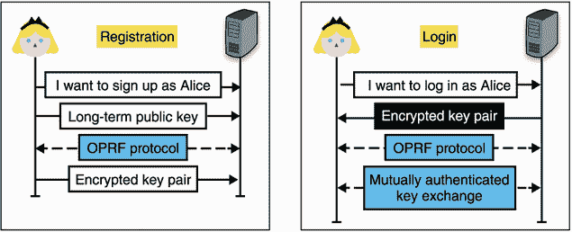

图 11.5 为了使用 OPAQUE 向服务器注册，Alice 生成一个长期密钥对，并将她的公钥发送到服务器，服务器存储该公钥并将其与 Alice 的身份相关联。然后，她使用 OPRF 协议从她的密码中获得一个强对称密钥，并将她的密钥对的加密备份发送到服务器。为了登录，她从服务器获得她的加密密钥对，然后用她的密码执行 OPRF 协议，以获得能够解密她的密钥对的对称密钥。剩下的就是用这个密钥执行相互认证的密钥交换(或者可能签署一个挑战)。

在进入下一部分之前，让我们回顾一下你在这里学到了什么。图 11.6 说明了这一点。T2T4T6】

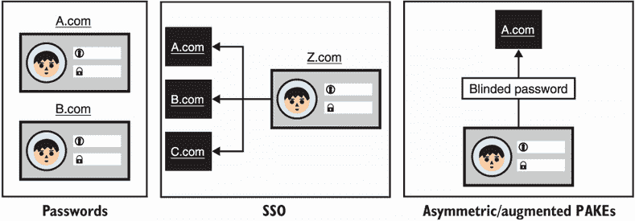

图 11.6 密码是验证用户身份的便捷方式，因为它们存在于某人的大脑中，可以在任何设备上使用。另一方面，用户很难创建强密码，而且由于用户倾向于跨网站重复使用密码，密码泄露可能会造成损害。SSO 允许您使用一个(或几个)服务连接到许多服务，而非对称(或增强)密码认证密钥交换允许您在服务器不知道您的真实密码的情况下进行认证。

### 11.2.3 一次性密码并不是真正的密码:使用对称密钥将不再需要密码

还好，到目前为止还不错。您已经了解了应用程序可以利用哪些不同的协议来验证用户的密码。但是，如你所知，密码也没那么好。它们容易受到暴力攻击，容易被重用、被盗等等。如果我们能够避免使用密码，我们还能得到什么？

答案是——钥匙！众所周知，在密码学中有两种类型的密钥，这两种类型都很有用:

*   对称密钥

*   非对称密钥

本节介绍基于对称密钥的解决方案，下一节介绍基于非对称密钥的解决方案。让我们想象一下，Alice 使用对称密钥(通常由服务器生成并通过 QR 码传达给您)注册了一个服务。稍后认证 Alice 的一个简单方法是简单地要求她发送对称密钥。这当然不好，因为泄露她的秘密会让攻击者无限制地访问她的帐户。相反，Alice 可以从对称密钥中导出所谓的*一次性密码* (OTPs ),并发送它们来代替长期对称密钥。尽管 OTP 不是密码，但其名称表明 OTP 可以代替密码使用，并警告不要重复使用。

基于 OTP 的用户认证背后的思想很简单:您的安全性来自于(通常)16 到 32 字节的均匀随机对称密钥，而不是低熵密码。这个对称密钥允许您按需生成 OTP，如图 11.7 所示。

图 11.7 一次性密码(OTP)算法允许您根据对称密钥和一些附加数据创建任意数量的一次性密码。附加数据是不同的，取决于 OTP 算法。

基于 OTP 的认证通常在移动应用程序中实现(参见图 11.8 中的一个流行示例)，或者在安全密钥中实现(一个可以插入计算机 USB 端口的小设备)。有两种主要的方案可以用来产生 OTP:

*   基于 HMAC 的一次性密码(HOTP)算法，在 RFC 4226 中标准化，这是一种 OTP 算法，其中附加数据是一个计数器。

*   基于时间的一次性密码(TOTP)算法，在 RFC 6238 中标准化，这是一种 OTP 算法，其中附加数据是时间。

如今大多数应用程序都使用 TOTP，因为 HOTP 要求客户端和服务器都存储一个状态(一个计数器)。如果一方失去同步，并且不能再产生(或验证)合法的 OTP，存储状态可能会导致问题。

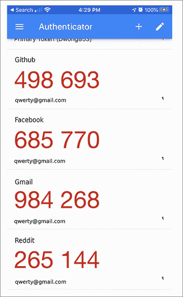

图 11.8 Google Authenticator 移动应用截图。该应用程序允许您存储唯一的每个应用程序的对称密钥，然后可以与 TOTP 方案一起使用，以生成 6 位数的一次性密码(OTP)，有效期仅为 30 秒。

在大多数情况下，TOTP 是这样工作的:

*   *注册时，服务向用户传递一个对称密钥(可能使用 QR 码)。*用户然后将这个密钥添加到 TOTP 应用程序中。

*   *登录时，用户可以使用 TOTP 应用程序计算一次性密码。*这是通过计算*HMAC*(*symmetric _ key*， *time* )来完成的，其中 *time* 表示当前时间(四舍五入到分钟，以便使一次性密码有效 60 秒)。然后

    a)TOTP 应用程序向用户显示导出的一次性密码，该密码被截断并以人类可读的方式存储(例如，以 10 为基数减少到 6 个字符，使其全部为数字)。

    b)用户将一次性密码复制或键入相关应用程序。

    c)应用程序检索用户的相关对称密钥，并以与用户相同的方式计算一次性密码。如果结果与收到的一次性密码匹配，则用户被成功认证。

当然，用户的动态口令和服务器上计算的动态口令之间的比较必须在恒定时间内完成。这类似于 MAC 认证标签检查。我在图 11.9 中演示了这个流程。

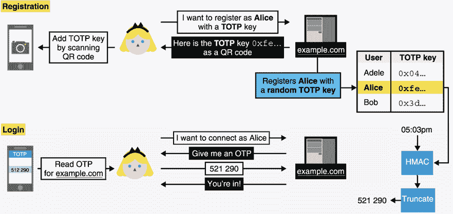

图 11.9 爱丽丝使用 TOTP 作为认证向 example.com 注册。她将网站上的对称密钥导入到她的 TOTP 应用程序中。稍后，她可以要求应用程序为 example.com 计算一个一次性密码，并使用它来验证网站。example.com 网站获取与爱丽丝相关联的对称密钥，并使用 HMAC 和当前时间计算一次性密码。网站接下来会将固定时间内的一次性密码与爱丽丝发送的密码进行比较。

然而，这种基于 TOTP 的认证流程并不理想。有许多方面可以改进，例如:

*   服务器可以伪造认证，因为它也拥有对称密钥。

*   你可以通过社交工程摆脱一次性密码。

由于这个原因，对称密钥仍然是密码的另一个*不完美的替代品*。接下来，让我们看看使用非对称密钥如何解决这些缺点。

网络钓鱼

网络钓鱼(或称*社交工程*)是一种攻击，它不针对软件中的漏洞，而是针对人类的漏洞。假设某个应用程序要求您输入一次性密码进行身份验证。在这种情况下，攻击者可能会尝试以您的身份登录应用程序，当提示您一次性输入密码时，会给您打电话要求您输入有效的密码(假装他们为应用程序工作)。

你告诉我你不会上当！优秀的社会工程师擅长编造可信的故事和制造一种紧迫感，这种紧迫感会让我们中最好的人泄露秘密。仔细想想，我们之前讨论过的所有协议都容易受到这种类型的攻击。

### 11.2.4 用非对称密钥替换密码

既然我们正在处理公钥加密，我们可以使用多种方式使用非对称密钥向服务器进行认证。我们能

*   在密钥交换中使用我们的非对称密钥来认证我们的连接端

*   在与经过身份验证的服务器的安全连接中使用我们的非对称密钥

让我们来看看每种方法。

密钥交换中的相互认证

你已经听说过第一种方法:在密钥交换中使用非对称密钥。在第 9 章中，我提到 TLS 服务器可以请求客户端使用一个*证书*作为握手的一部分。通常，公司会为员工的设备提供一个唯一的每位员工证书，允许他们向内部服务部门进行身份验证。图 11.10 提供了一个从用户角度来看的概念。

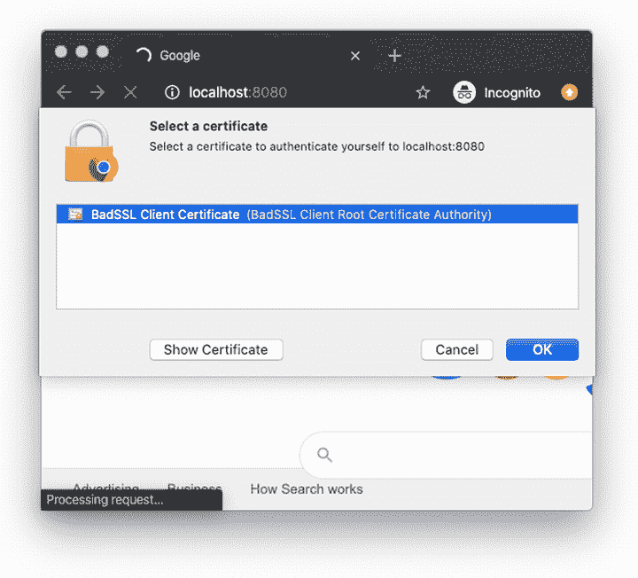

图 11.10 提示用户浏览器提供客户端证书的页面。然后，用户可以从本地安装的证书列表中选择要使用的证书。在 TLS 握手中，客户端证书的密钥随后用于签署握手副本，包括客户端的临时公钥，该公钥用作握手的一部分。

客户端证书非常简单。例如，在 TLS 1.3 中，服务器可以通过发送`CertificateRequest`消息来请求客户端在握手期间进行身份验证。客户端然后通过在`Certificate`消息中发送其证书做出响应，随后是在`CertificateVerify`消息中发送和接收的所有消息的签名(包括在密钥交换中使用的临时公钥)。如果服务器能够识别证书并成功验证客户端的签名，则客户端通过了身份验证。另一个例子是 Secure Shell (SSH)协议，它也让客户机使用服务器已知的公钥对部分握手进行签名。

请注意，签名并不是握手阶段使用公钥加密进行身份验证的唯一方式。Noise 协议框架(也在第 9 章中介绍)有几个握手模式，这些模式仅使用 DH 密钥交换来实现客户端认证。

使用 FIDO2 进行握手后用户认证

使用非对称密钥的第二种类型的认证使用已经*安全的*连接，其中只有服务器被认证。为此，服务器可以简单地要求客户端签署一个随机的挑战。通过这种方式，可以防止重放攻击。

这个领域一个有趣的标准是*快速身份在线 2* (FIDO2)。FIDO2 是一种开放标准，它定义了如何使用非对称密钥对用户进行身份验证。该标准专门针对网络钓鱼攻击，因此 FIDO2 只能与*硬件认证器*一起使用。硬件认证器是简单的物理组件，可以生成和存储签名密钥，并可以对任意挑战进行签名。FIDO2 分为两种规格(图 11.11):

*   *客户端到认证者协议*(CTAP)——CTAP 指定一个协议，*漫游认证者*和*客户端*可以使用该协议相互通信。漫游授权码是主设备外部的硬件授权码。在 CTAP 规范中，客户端被定义为作为认证协议的一部分想要查询这些认证器的软件。因此，客户端可以是操作系统、像浏览器这样的本地应用程序等等。

*   *Web 认证* (WebAuthn)—WebAuthn 是 Web 浏览器和 Web 应用程序可以使用硬件认证器对用户进行认证的协议。因此，它必须由浏览器实现以支持授权码。如果您正在构建一个 web 应用程序，并且希望通过硬件认证器支持用户认证，那么您需要使用 WebAuthn。

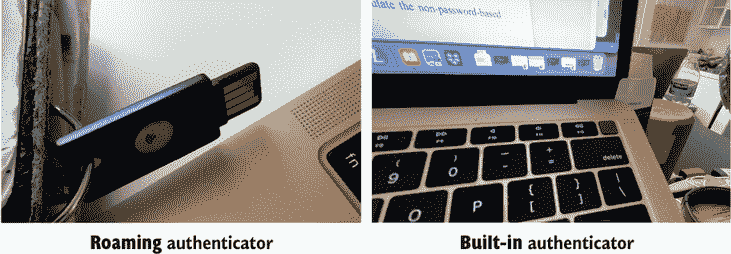

图 11.11 可与 FIDO2 配合使用的两种硬件授权码:(左边)漫游授权码 Yubikey 和内置授权码 TouchID。

WebAuthn 允许网站不仅使用漫游授权码，还可以使用*平台*授权码。平台授权码是由设备提供的内置授权码。它们由不同的平台以不同的方式实现，并且通常受到生物特征的保护(例如，指纹读取器、面部识别等)。

我们现在要结束本章的第一部分。但是在我这样做之前，图 11.12 概括了我已经谈到的基于非密码的认证协议。

图 11.12 为了在不使用密码的情况下进行身份验证，应用程序可以允许用户通过基于 OTP 的协议使用对称密钥，或者通过 FIDO2 标准使用非对称密钥。FIDO2 支持不同类型的授权码、漫游授权码(通过 CTAP 标准)或内置授权码。

现在，您已经了解了许多不同的技术和协议，这些技术和协议既可以改进密码，也可以用更强大的加密解决方案来取代它们，您可能会想知道，您应该使用哪一种？每种解决方案都有自己的注意事项，没有一种解决方案可以做到这一点。如果没有，合并多个！这个想法就是所谓的*多因素认证* (MFA)。实际上，您可能已经使用 OTPs 或 FIDO2 作为除密码之外的第二个身份验证因素(而不是取代密码)。

本章关于用户认证的前半部分到此结束。接下来，我们来看看人类如何帮助设备相互认证。T8】

## 11.3 用户辅助认证:在人工帮助下配对设备

人类每天都在帮助机器相互认证——每天都是如此！你已经通过将你的无线耳机与你的手机配对，或者将你的手机与你的汽车配对，或者将一些设备连接到你的家庭 WiFi，等等。和任何配对一样，其背后很可能是密钥交换。

上一节中的认证协议发生在已经安全的通道中(可能使用 TLS)，在那里服务器被认证。相反，本节的大部分内容试图为两个不知道如何相互认证的设备提供安全通道。从这个意义上说，你将在这一节学到人类如何帮助*将*不安全的连接升级为*相互认证的连接*。出于这个原因，接下来您将学习的技术应该会让人想起第 10 章的端到端协议中的一些信任建立技术，除了在那里，两个人试图相互验证自己。

如今，您最常遇到的不安全连接，即不通过互联网的连接，是基于蓝牙、WiFi 和近场通信(NFC)等短程无线电频率的协议。NFC 就是你用手机支付，或者用银行卡的“非接触式”支付。使用这些通信协议的设备范围从低功率电子设备到全功能计算机。这已经给我们设置了一些约束:

*   *您尝试连接的设备可能不提供显示密钥的屏幕或手动输入密钥的方式。*我们称之为*供应*设备。例如，今天大多数无线音频耳机只有几个按钮，仅此而已。

*   由于人是验证过程的一部分，必须键入或比较长字符串通常被认为是不切实际和不友好的。由于这个原因，许多协议试图将安全相关的字符串缩短为 4 位或 6 位 pin。

运动

想象一下，在一个协议中，您必须输入正确的 4 位 PIN 码才能安全地连接到设备。仅通过猜测选择正确 PIN 的几率有多大？

你可能正在回想你的一些设备配对经历，现在意识到其中很多*刚刚成功*。例如

1.  你按了一个设备上的按钮。

2.  设备进入配对模式。

3.  然后，您尝试在手机的蓝牙列表中查找该设备。

4.  点击设备图标后，它成功将设备与您的手机配对。

如果你读了第 10 章，这应该会让你想起第一次使用时的*信任*(豆腐)。只不过，这次我们手里还有几张牌:

*   *接近度*—两个设备必须彼此靠近，尤其是在使用 NFC 协议的情况下。

*   *时间*—设备配对通常受时间限制。例如，如果在 30 秒的窗口中配对不成功，则必须手动重启该过程，这是很常见的。

与豆腐不同的是，这些真实场景通常不允许你在连接到正确的设备后进行验证。这并不理想，如果可能的话，应该争取更好的安全性。

注 顺便说一下，这就是蓝牙核心规范实际上所说的豆腐渣协议:“刚刚工作。”我要提到的是，目前所有内置的蓝牙安全协议都因多次攻击而被打破，包括 2019 年发布的最新 KNOB 攻击(【https://knobattack.com】)。尽管如此，如果设计和实现正确，本章中介绍的技术是安全的。

我们的工具包中的下一个是什么？这就是我们将在本节中看到的:人类帮助设备进行自我认证的方法。剧透警告:

*   你会发现加密密钥总是最安全的方法，但不一定是最用户友好的。

*   您将了解对称密码包，以及如何在两台设备上输入相同的密码来安全连接它们。

*   您将了解基于短认证字符串(SAS)的协议，该协议通过让您比较和匹配两个设备显示的两个短字符串来对密钥交换进行事后认证。

我们开始吧！

### 11.3.1 预共享密钥

天真地说，将用户连接到设备的第一种方法是重用您在第 9 章或第 10 章中了解到的协议(例如，TLS 或 Noise ),并为两个设备提供对称共享密钥，或者更好的是，提供长期公钥，以便为将来的会话提供前向保密性。这意味着每台设备需要两件事情来学习另一台设备的公钥:

*   你需要一种方法从设备中导出公钥给 T2。

*   你需要一种方法让设备*导入*公钥。

正如我们将看到的，这并不总是简单明了或用户友好的。但是请记住，我们有一个人可以观察和(可能)玩这两个设备。这与我们以前见过的其他场景不同，我们可以利用这一点！

*认证问题——密码学中的主要问题之一是在不安全的信道上建立安全的点对点(或群组)通信。在没有任何假设的情况下，例如额外安全通道的可用性，这个任务是不可能的。然而，给定一些假设，存在许多建立安全通信的方法*。

—Sylvain Pasini(“使用认证通道的安全通信”，2009 年)

下面所有的协议都是基于你(负责人)有一个额外的*带外*通道的事实。这允许您安全地传递一些信息。添加此带外信道可以被建模为两个设备可以访问两种类型的信道(如图 11.13 所示):

*   *不安全的信道*—想想蓝牙或与设备的 WiFi 连接。默认情况下，用户无法验证设备，因此可能会被 MITM。

*   *认证通道*——想想设备上的屏幕。该渠道提供了所传达信息的完整性/真实性，但保密性较差(有人可能会监视你)。

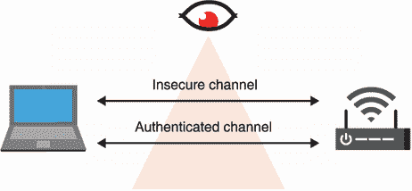

图 11.13 允许人们将两个设备配对的用户辅助认证协议由设备之间的两种类型的信道建模:不安全信道(例如，NFC、蓝牙、WiFi 等)，我们假设它是对手控制的，以及认证信道(例如，真实生活)，它不提供保密性，但可用于交换相对少量的信息。

由于这种带外通道的保密性很差，我们通常不想用它来导出机密数据，而是导出公共数据。例如，公共密钥或一些摘要可以由设备的屏幕显示。但是一旦您导出了一个公钥，您仍然需要另一个设备来导入它。例如，如果密钥是 QR 码，那么其他设备可能能够扫描它，或者如果密钥以人类可读的格式编码，那么用户可以使用键盘在其他设备中手动键入它。一旦两台设备都被提供了彼此的公钥，你就可以使用我在第 9 章提到的任何协议来执行两台设备之间的相互认证的密钥交换。

我想让你从这一节中得到的是，在你的协议中使用加密密钥总是实现某些目标的最安全的方式，但它并不总是最用户友好的方式。然而，现实世界的加密充满了妥协和权衡，这就是为什么接下来的两个方案不仅存在，而且是最流行的设备认证方式。

让我们看看，在无法导出和导入长公钥的情况下，如何使用*密码*来引导相互认证的密钥交换。然后，我们将看看在无法将数据导入一个或两个设备的情况下，短的*认证字符串*如何帮助。

### 11.3.2 与 CPace 的对称密码认证密钥交换

如果可能的话，前面的解决方案是您应该做的，因为它依赖强非对称密钥作为信任的根。然而，事实证明，在实践中，用一些笨重的键盘手动键入代表一个键的长字符串是乏味的。这些亲爱的密码怎么办？它们要短得多，因此也更容易处理。我们喜欢密码，对吗？也许我们没有，但是用户有，而且现实世界的密码学充满了妥协。就这样吧。

在关于非对称密码认证密钥交换的章节中，我提到了对称(或平衡)版本，其中知道共同密码的两个对等体可以执行相互认证的密钥交换。这正是我们所需要的。

*可组合密码认证连接建立* (CPace)由 bjrn Haase 和 benot Labrique 于 2008 年提出，并于 2020 年初被选为 CFRG(Crypto Forum Research Group)的官方推荐标准。该算法目前正被标准化为 RFC。简化后的协议如下所示(图 11.14 说明了算法):

*   两个设备基于共同的密码导出一个生成器(用于某个预定的循环组)。

*   然后，这两个设备使用这个生成器在其基础上执行短暂的 DH 密钥交换。

图 11.14 CPace PAKE 的工作原理是让两个设备根据密码创建一个生成器，然后使用它作为通常的短暂 DH 密钥交换的基础。

当然，魔鬼在细节中，作为一种现代规范，CPace 以椭圆曲线“gotchas”为目标，并定义何时必须验证接收的点在正确的组中(由于流行的 Curve25519，不幸的是，它不跨越素数组)。它还指定了在椭圆曲线组中如何基于密码导出生成器(使用所谓的哈希到曲线算法)以及如何做到这一点(不仅使用公共密码，还使用唯一的会话 ID 和一些附加的上下文元数据，如对等 IP 地址等)。

这些步骤很重要，因为双方都必须以某种方式导出一个生成器 *h* ，以防止他们知道它的离散对数 *x* ，使得 gx=*h*。最后，会话密钥从 DH 密钥交换输出、抄本(临时公钥)和唯一会话 ID 中导出。

直观地说，您可以看到，冒充一个对等体并发送一个组元素作为握手的一部分意味着您正在发送一个公钥，它与一个您不知道的私钥相关联。这意味着，如果您不知道密码，就永远无法执行 DH 密钥交换。这个副本看起来就像一个普通的 DH 密钥交换，所以，运气不好(只要 DH 是安全的)。

### 我的钥匙交换被 MITM 偷了吗？只需检查一个短的认证字符串(SAS)

在本章的第二部分，您看到了允许两个设备在人工帮助下配对的不同协议。然而，我提到过一些设备是如此的受限，以至于它们不能使用那些协议。让我们来看一个方案，当两个设备不能导入密钥，但可以向用户显示一些有限的数据时(可能通过屏幕，或通过打开一些 led，或通过发出一些声音，等等)。

首先，记得在第 10 章中，你学习了使用*指纹*(抄本的哈希)认证一个会话*握手后*(在密钥交换之后)。我们可以使用类似这样的东西，因为我们有带外通道来传递这些指纹。如果用户能够成功地比较和匹配从两个设备获得的指纹，则用户知道密钥交换没有被 MITM 篡改。

指纹的问题在于它们是长字节字符串(通常为 32 字节长)，可能很难向用户显示。它们比较起来也很麻烦。但是对于设备配对，我们可以使用更短的字节串，因为我们是在实时进行比较！我们称这些*短认证字符串为* (SAS)。情景应用程序被大量使用，特别是通过蓝牙，因为它们非常用户友好(见图 11.15 中的例子)。

图 11.15 要通过蓝牙将手机与汽车配对，数字比较模式可用于生成两个设备之间协商的安全连接的短认证字符串(SAS)。不幸的是，正如我在本章早些时候所说的，由于 KNOB 攻击，蓝牙的安全协议目前被打破(截至 2021 年)。如果您控制这两个设备，您需要实现自己的 SAS 协议。

基于 SAS 的方案没有任何标准，但是大多数协议(包括蓝牙的数字比较)都实现了手动认证的 Diffie-Hellman T2(MA-DH)的变体。MA-DH 是一个简单的密钥交换，带有一个额外的技巧，使得攻击者很难主动地在协议中插入人。您可能会问，为什么不通过截断指纹来创建 sa 呢？为什么需要诡计？

SAS 通常是一个 6 位数的数字，它可以通过将抄本的哈希截断为少于 20 位并将其转换为基数为 10 的数字来获得。因此，SAS 非常小，这使得攻击者更容易获得截断哈希的第二个前映像。在图 11.16 中，我们举了两个设备(尽管我们使用 Alice 和 Bob)执行未认证密钥交换的例子。一个活跃的 MITM 攻击者可以在第一条消息中用他们自己的公钥替换 Alice 的公钥。一旦攻击者收到 Bob 的公钥，他们就会知道 Bob 将计算什么 SAS(基于攻击者的公钥和 Bob 的公钥的截断哈希)。攻击者只需生成许多公钥，以便找到一个(*public _ key*T5】E2)来使爱丽丝的 sa 与鲍勃的 sa 匹配。

图 11.16 一个典型的未经认证的密钥交换(左边)可以被一个活跃的 MITM 攻击者(右边)截获，然后他可以替换 Alice 和 Bob 的公钥。如果 Alice 和 Bob 生成相同的短认证字符串，MITM 攻击就成功了。即如果 *哈希* ( *公钥*A|*公钥* E2 ) 和 *哈希* ( *公钥*E2|*公钥*)匹配。

生成一个公钥来使两个 sa 匹配实际上相当容易。假设 SAS 是 20 位，那么在仅仅 2 个 20 个计算之后，你应该找到第二个前映像，它将使 Alice 和 Bob 生成相同的 SAS。即使在便宜的手机上，计算起来也应该很快。

基于 sa 的密钥交换背后的技巧是防止攻击者能够选择他们的第二个公钥，迫使两个 sa 匹配。为此，在看到鲍勃的公钥之前，爱丽丝简单地发送了她的公钥的*承诺*(如图 11.17 所示)。

图 11.17 左图显示了一个基于 SAS 的安全协议，其中 Alice 首先发送她的公钥承诺。然后，她只在收到 Bob 的公钥后才公开她的公钥。由于她致力于此，她不能根据 Bob 的密钥自由选择她的密钥对。如果交换是主动 MITM 的(右图)，攻击者不能选择任何一个密钥对来强制 Alice 和 Bob 的 sa 匹配。

和之前的不安全方案一样，攻击者选择*公钥* *E* 1 并不能给他们任何优势。但是现在，他们也不能选择一个有帮助的*public _ key**E*2，因为他们不知道 Bob 在协议中的 sa。他们被迫“在黑暗中射击”，并希望爱丽丝和鲍勃的 SAS 匹配。

如果一个 SAS 是 20 位，那就是 1，048，576 的概率为 1。攻击者可以通过多次运行协议获得更多的机会，但是请记住，协议的每个实例都必须让用户手动匹配一个 SAS。实际上，这种摩擦自然会阻止攻击者获得太多的彩票。

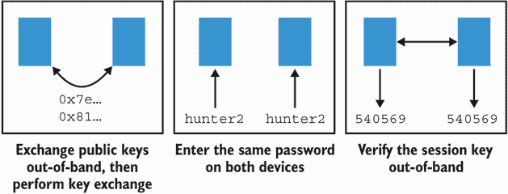

图 11.18 你已经学习了三种配对两个设备的技术:(1)用户可以帮助设备获得彼此的公钥，这样它们就可以进行密钥交换；(2)用户可以在两个设备上输入相同的密码，以便它们可以执行对称的密码认证的密钥交换；或者(3)用户可以在事后验证密钥交换的指纹，以确认没有 MITM 攻击者拦截配对。

故事时间

有趣的是，当我在写关于端到端加密的第 10 章时，我开始研究 Matrix 端到端加密聊天协议的用户如何认证他们的通信。为了使验证更加用户友好，Matrix 创建了他们自己的基于 SAS 的协议变体。不幸的是，它哈希了 X25519 密钥交换的共享秘密，并且在哈希中不包括正在交换的公钥。

在第 5 章中，我提到了验证 X25519 公钥的重要性。Matrix 没有，这使得 MITM 攻击者能够向用户发送不正确的公钥，迫使他们最终获得相同的可预测共享秘密，进而获得相同的 sa。这彻底打破了协议的端到端加密主张，最终被 Matrix 迅速修复。

就是它了！图 11.18 回顾了你在本章第二部分学到的不同技术。我们在第 12 章见。

## 总结

*   用户认证协议(机器认证人类的协议)通常发生在安全连接上，其中只有机器(服务器)被认证。从这个意义上说，它将单向身份验证连接升级为相互身份验证连接。

*   用户认证协议大量使用密码。密码已经被证明是一种比较实用的解决方案，并且被用户广泛接受。但是，由于糟糕的密码卫生、低熵和密码数据库泄露，它们也导致了许多问题。

*   有两种方法可以避免用户携带多个密码(并可能重复使用密码):

    *   *密码管理器*—用户可以用来为他们使用的每个应用程序生成和管理强密码的工具。
    *   *单点登录*(SSO)——一种联合协议，允许用户使用一个帐户注册并登录其他服务。
*   服务器避免了解和存储用户密码的一个解决方案是使用非对称密码认证密钥交换(非对称 PAKE)。非对称 PAKE(类似 OPAQUE)允许用户使用密码向一个已知的服务器进行身份验证，而不必实际向服务器透露他们的密码。

*   完全避免密码的解决方案是让用户通过一次性密码(OTP)算法使用对称密钥，或者通过 FIDO2 等标准使用非对称密钥。

*   用户辅助认证协议通常在不安全的连接(WiFi、蓝牙、NFC)上进行，帮助两个设备相互认证。为了保护这些场景中的连接，用户辅助协议假设两个参与者拥有他们可以使用的额外的经过身份验证(但不是机密)的通道(例如，设备上的屏幕)。

*   将一台设备的公钥导出到另一台设备可能会允许进行强相互认证的密钥交换。不幸的是，这些流程不是用户友好的，并且由于设备限制(例如，无法导出或导入密钥)，有时是不可能的。

*   像 CPace 这样的对称密码认证密钥交换(对称密钥包)可以减少用户导入长公钥的负担，只需在设备中手动输入密码。例如，对称的 PAKEs 已经被大多数人用来连接他们家里的 WiFi。

*   基于短认证字符串(SAS)的协议可以为不能输入密钥或密码但能够在密钥交换发生后显示短字符串的设备提供安全性。为了确保未经身份验证的密钥交换不会被主动 MITM，这两个设备上的短字符串必须相同。