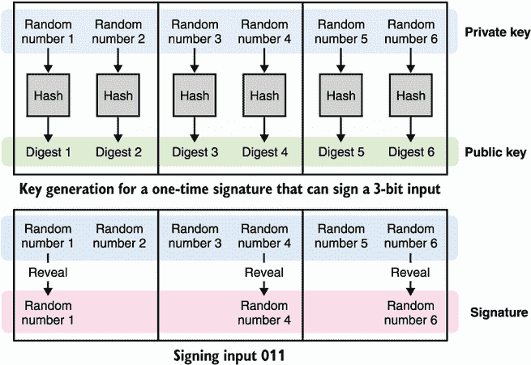
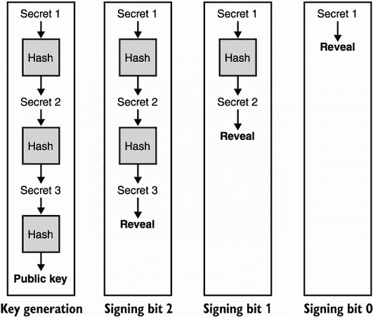
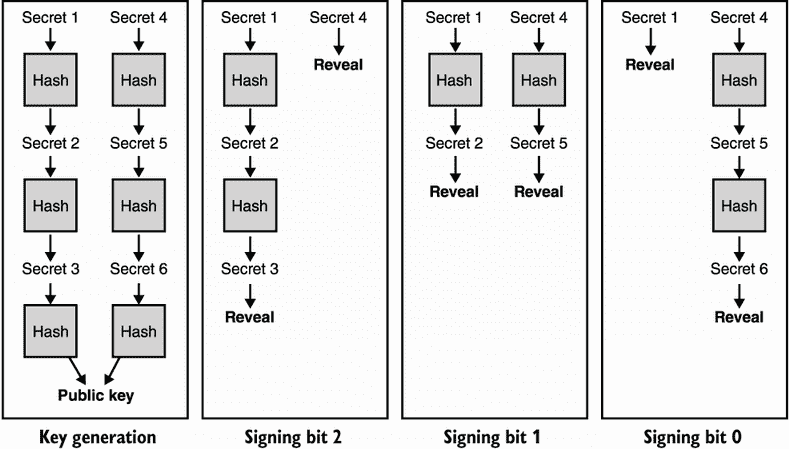
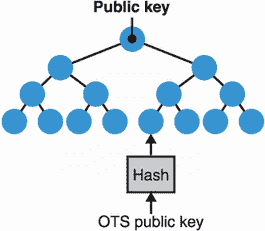
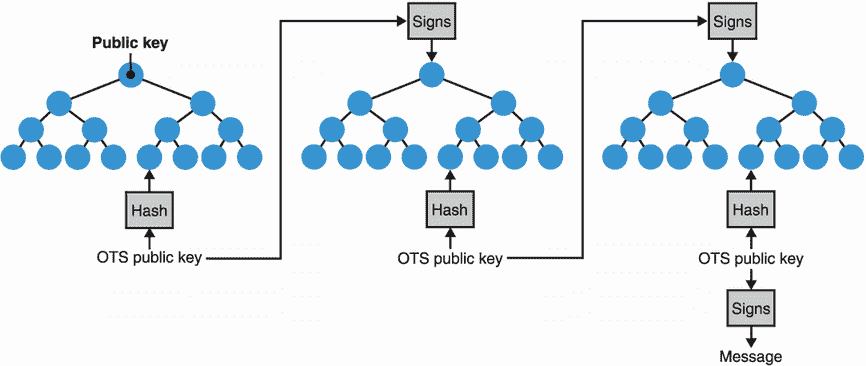
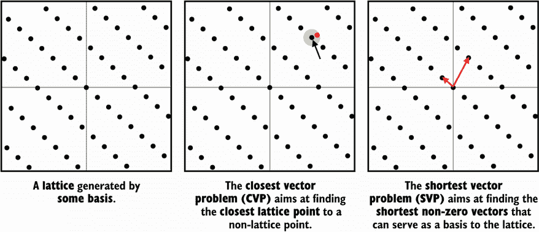
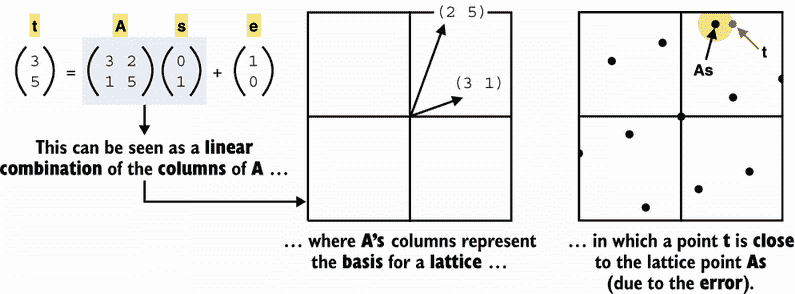
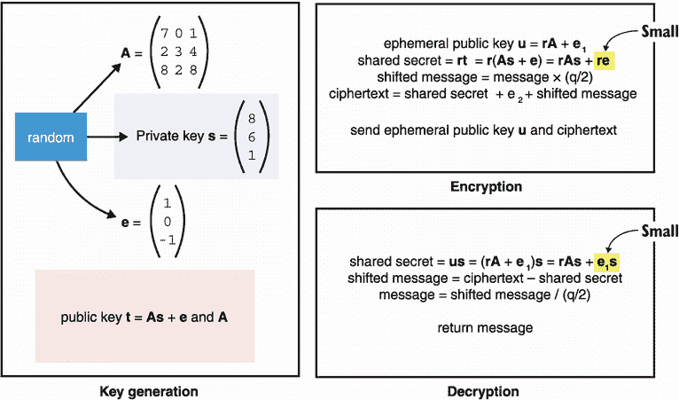
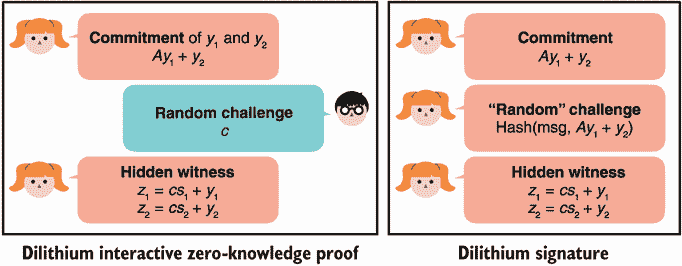

# 14 后量子密码术

本章涵盖了

*   量子计算机及其对密码学的影响
*   抵御量子计算机的后量子密码术
*   今天和明天的后量子算法

麻省理工学院的数学教授彼得·肖暗示道:“量子计算机可以破解密码术。”。那是 1994 年，肖尔刚刚提出了一种新的算法。他的发现开启了有效的整数分解，如果量子计算机成为现实，摧毁了 RSA 等密码算法。当时，量子计算机只是一种理论，一种基于量子物理的新型计算机的概念。这个想法还有待证实。2015 年年中，美国国家安全局(NSA)在宣布他们计划过渡到*量子抵抗算法*(量子计算机不易攻击的加密算法)后，让所有人大吃一惊。

*对于那些尚未过渡到 Suite B 椭圆曲线算法的合作伙伴和供应商，我们建议此时不要投入大量资金，而是为即将到来的抗量子算法过渡做好准备。[.。。不幸的是，椭圆曲线使用的增长遇到了量子计算研究持续进展的事实，这表明椭圆曲线加密不是许多人曾经希望的长期解决方案。因此，我们有义务更新我们的战略*。

—美国国家安全局(“今日密码学”，2015 年)

虽然*量子计算*(基于量子力学领域研究的物理现象建造一台计算机)的想法并不新鲜，但它见证了近年来研究资助和实验突破的巨大增长。尽管如此，没有人能够用量子计算机证明密码学的突破。国安局知道我们不知道的事吗？量子计算机真的会打破密码学吗？什么是抗量子密码术？在这一章中，我将尝试回答你所有的问题！

## 14.1 什么是量子计算机，为什么会吓到密码学家？

自从美国国家安全局宣布以来，量子计算机一再成为新闻，因为许多大公司，如 IBM、谷歌、阿里巴巴、微软、英特尔等都投入了大量资源进行研究。但是这些量子计算机是什么，为什么这么吓人？这一切都始于的*量子力学*(也称为*量子物理学*)，这是一个研究小东西(想想原子和更小的东西)行为的物理学领域。因为这是量子计算机的基础，所以我们的研究从这里开始。

曾经有一段时间，报纸上说只有十二个人理解相对论。我不相信曾经有过这样的时刻。可能曾经有一段时间只有一个人理解，因为他是唯一一个在他写论文之前就理解的人。但是在人们读了这篇论文之后，很多人以这样或那样的方式理解了相对论，当然不止 12 个人。另一方面，我想我可以有把握地说，没有人理解量子力学。

—理查德·费曼(*《自然法的特性》*，麻省理工学院出版社，1965 年)

### 14.1.1 量子力学，小的研究

物理学家长期以来一直认为整个世界都是确定的，就像我们的密码伪随机数发生器一样:如果你知道宇宙是如何工作的，如果你有一台足够大的计算机来计算“宇宙函数”，你只需要一个*种子*(大爆炸中包含的信息)，你就可以从那里预测一切。是的*一切*，甚至事实上在宇宙开始仅仅 137 亿年后你会读到这一行。在这样的世界里，没有随机的余地。你所做的每一个决定都是由过去的事件预先决定的，甚至是那些发生在你出生之前的事件。

虽然这种世界观让许多哲学家困惑不解——“那么，我们真的有自由意志吗？”他们问——一个有趣的物理学领域在 20 世纪 90 年代开始发展，从那时起就困扰了许多科学家，我们称之为*量子物理学*(也称为*量子力学*)领域。事实证明，非常小的物体(比如原子和更小的物体)的行为往往与我们迄今为止使用经典物理学观察和理论化的结果截然不同。在这个(亚)原子尺度上，粒子有时似乎表现得像波一样，在某种意义上，不同的波可以叠加合并成一个更大的波，或者在短暂的时刻相互抵消。

我们可以对像电子这样的粒子进行的一项测量是它们的自旋 T2。例如，我们可以测量电子是向上旋转还是向下旋转。到目前为止，没什么奇怪的。奇怪的是，量子力学说一个粒子可以同时处于这两种状态*，向上旋转*和向下旋转*。我们说粒子处于*量子叠加态*。*

 *根据粒子的类型，可以使用不同的技术来手动诱导这种特殊状态。一个粒子可以保持在叠加态，直到我们测量它；在这种情况下，粒子*将*坍缩成这些可能状态中的一种(自旋向上或向下)。这种量子叠加就是量子计算机最终使用的:一个*量子位*或*量子位*可以同时为 0 和 1，而不是一个位可以为 1 或 0。

更奇怪的是，量子理论说，只有当测量发生时，而不是在此之前，叠加态中的粒子才会随机决定它将处于哪个状态(每个状态都有 50%的机会被观察到)。如果这看起来很奇怪，你并不孤单。许多物理学家无法想象这在他们描绘的决定论世界中会如何运作。爱因斯坦确信这个新理论有问题，曾说“上帝不掷骰子”然而密码学家对此很感兴趣，因为这是一种最终获得真正的 T2 随机数的方法！这就是*量子随机数发生器* (QRNGs)通过连续设置光子等粒子处于叠加状态，然后测量它们的作用。

物理学家也已经理论化了我们这个尺度的物体的量子力学会是什么样子。这导致了著名的*薛定谔的猫*实验:一只猫在一个盒子里既死又活，直到一个观察者看到里面(这导致了许多关于究竟什么构成了一个观察者的辩论)。

一只猫被关在一个钢制的房间里，旁边还有下面的装置(必须防止猫的直接干扰):在一个盖革计数器中，有一点点放射性物质，如此之小，以至于在一个小时的时间里，一个原子可能会衰变，但也有同样的概率，可能一个也没有；如果发生这种情况，计数管放电，并通过继电器释放一个锤子，打碎一小瓶氢氰酸。如果一个人把整个系统留给自己一个小时，他会说，如果在此期间没有原子衰变，猫仍然活着。第一次原子衰变会使它中毒。整个系统的超心理学功能将通过把活猫和死猫(原谅这种表达)混合或涂抹成等份来表达这一点。

—埃尔温·薛定谔(《量子力学的现状》，1935 年)

所有这些对我们来说都很不直观，因为我们在日常生活中从未遇到过量子行为。现在，让我们添加更多的怪异！

有时粒子会相互作用(例如，通过相互碰撞)并最终进入强*关联*状态，在这种状态下不可能在没有其他粒子的情况下描述一个粒子。这种现象被称为*量子纠缠*，它是量子计算机性能提升背后的秘密酱汁之一。比方说，如果两个粒子纠缠在一起，那么当其中一个被测量时，两个粒子都坍缩，已知一个粒子的状态与另一个粒子的状态完全相关。好吧，我有点困惑。让我们举一个例子:如果两个电子纠缠在一起，然后测量其中一个电子，发现它在向上旋转，我们知道另一个电子在向下旋转(但不是在测量第一个电子之前)。此外，任何这样的实验结果总是一样的。

这很难相信，但更令人兴奋的是，有证据表明纠缠甚至可以跨越很远的距离。爱因斯坦、波多尔斯基和罗森的著名观点是，量子力学的描述是不完整的，很可能缺少解释纠缠的*隐变量*(T3)。

爱因斯坦、波多尔斯基和罗森还描述了一个思想实验(即 *EPR 佯谬*，以他们姓氏的第一个字母命名)，在这个实验中，两个纠缠的粒子被分开一个很大的距离(想想光年远)，然后在大约相同的时间进行测量。根据量子力学，对其中一个粒子的测量会立即影响另一个粒子，这是不可能的，因为根据相对论，没有任何信息可以传播得比光速更快(因此出现了悖论)。这个奇怪的思想实验就是爱因斯坦著名的“幽灵般的超距作用”

约翰·贝尔后来陈述了一个概率不等式被称为*贝尔定理*；这个定理，如果被证明是真的，将证明 EPR 悖论的作者提到的隐藏变量的存在。这个不等式后来在实验中被违反了(很多很多次)，足以让我们相信纠缠是真实存在的，抛弃了任何隐藏变量的存在。

今天，我们说，对纠缠粒子的一种测量导致粒子相互协调，这绕过了相对论的预测，即通信不能超过光速。事实上，试着想一个方法，你可以用纠缠来设计一个通讯频道，你会发现这是不可能的。然而，对密码学家来说，这种远距离的怪异行为意味着我们可以开发出新的方法来进行密钥交换；这个想法被称为*量子密钥分发* (QKD)。

想象一下，将两个纠缠的粒子分配给两个对等体:然后谁来测量他们各自的粒子，以便开始形成相同的密钥(因为测量一个粒子会给你关于另一个粒子的测量信息)？QKD 的概念因*不可克隆定理*而变得更加性感，该定理指出你不能被动地观察这种交换，并创建在该通道上发送的一个粒子的精确副本。然而，这些协议很容易受到微不足道的中间人(MITM)攻击，而且如果没有认证数据的方法，是没有用的。这一缺陷导致一些密码学家如 Bruce Schneier 声称“QKD 作为一个产品是没有未来的。”

关于量子物理学，这就是我要说的全部，因为对于一本密码学的书来说，这已经太多了。如果你不相信你刚刚读到的任何奇怪的事情，你并不孤单。在他的书*工程师的量子力学*中，莱昂·范·多姆伦写道:“物理学最终以量子力学告终，不是因为它似乎是最合乎逻辑的解释，而是因为无数的观察使它不可避免。”

### 14.1.2 从量子计算机的诞生到量子霸权

1980 年，*量子计算*的想法诞生了。保罗·贝尼奥夫首先描述了量子计算机可能是什么:一种基于过去几十年量子力学的观察而建造的计算机。同年晚些时候，保罗·贝尼奥夫和理查德·费曼认为，这是模拟和分析量子系统的唯一方法，摆脱了经典计算机的限制。

仅在 18 年后，IBM 首次展示了运行在实际量子计算机上的量子算法。快进到 2011 年，量子计算机公司 D-Wave Systems 宣布推出第一台商用量子计算机，整个行业都在寻求制造第一台可扩展的量子计算机。

还有很长的路要走，有用的量子计算机还没有实现。在撰写本文时(2021 年)，最新的显著成果是谷歌，它在 2019 年声称凭借 53 量子位量子计算机达到了*量子霸权*。量子优势意味着，有史以来第一次，量子计算机实现了经典计算机无法实现的东西。在 3 分 20 秒内，它完成了一些经典计算机需要 10，000 年才能完成的分析。也就是说，在你太兴奋之前，它在一个没用的任务上胜过了经典计算机。然而，这是一个不可思议的里程碑，人们不禁要问这将把我们引向何方。

量子计算机使用量子物理现象(如叠加和纠缠)，就像经典计算机使用电来执行计算一样。量子计算机使用*量子比特*或*量子比特*而不是比特，它们可以通过*量子门*转换，以将设置为特定值，或者将它们置于叠加状态，甚至纠缠状态。这有点类似于经典计算机电路中门的使用方式。一旦计算完成，量子位就可以被测量，以便以经典的方式被解释为 0 和 1。此时，人们可以用经典计算机进一步解释结果，以完成有用的计算。

一般来说， *N 个*纠缠量子比特包含相当于 2 个 N 个经典比特的信息。但是在计算结束时测量量子位只能给你 *N* 个 0 或 1。因此，量子计算机如何能有所帮助并不总是清楚的，量子计算机只被发现对有限的应用有用。随着人们找到巧妙的方式来利用他们的权力，他们可能会变得越来越有用。

今天，你已经可以在家里舒适地使用量子计算机了。像 IBM Quantum ( [、https://quantum-computing.ibm.com](https://quantum-computing.ibm.com))这样的服务允许你构建量子电路，并在云中托管的真实量子计算机上执行这些电路。当然，目前(2021 年初)这样的服务相当有限，只有几个量子比特可用。尽管如此，创建自己的电路并等待它在真正的量子计算机上运行仍然是一种令人兴奋的体验，而且这一切都是免费的。

### 14 . 1 . 3 Grover 和 Shor 算法对密码术的影响

不幸的是，正如我前面所说的，量子计算机并不适用于每种类型的计算，因此，它并不是经典计算机的更强大的替代品。但是，它们有什么用呢？

1994 年，当量子计算机的概念还只是一个思想实验时，Peter Shor 提出了一个量子算法来解决离散对数和因式分解问题。肖尔发现，量子计算机可以用来快速计算与密码学中的难题相关的问题的解决方案。原来，存在一种有效的量子算法，它有助于找到一个*周期*，使得对于任何给定的 *x* ，都有 *f* ( *x* + *周期【T8)=*f*(*x*)。比如求值*周期*使得 gT19】x+周期=gT23】xT25】modT27】N*。这反过来又导致了能够有效解决因式分解和离散对数问题的算法，有效地影响了 RSA(在第 6 章中介绍)和 Diffie-Hellman(在第 5 章中介绍)等算法。

Shor 的算法对*非对称加密*来说是毁灭性的，因为今天使用的大多数非对称算法依赖于离散对数或因式分解问题——实际上你在本书中看到的大部分。你可能会认为离散对数和因式分解仍然是困难的数学问题，我们可以(也许)增加算法参数的大小，以便升级它们对量子计算机的防御。不幸的是，伯恩斯坦和其他人在 2017 年指出，尽管提高参数可行，但这非常不切实际。该研究估计，RSA 可以通过将其参数增加到 1tb 来抵抗量子。退一步说，不现实。

Shor 的算法打破了已部署的公钥密码学的基础:RSA 和有限域和椭圆曲线中的离散对数问题。诸如病人医疗记录和国家机密等长期机密文件必须保证多年的安全，但是今天使用 RSA 或椭圆曲线加密并存储到量子计算机问世的信息将会像今天用英格玛加密的信息一样容易破译。

—PQCRYPTO:长期安全后量子系统的初步建议(2015)

对于*对称加密*，事情就不那么令人担忧了。Grover 算法是 Lov Grover 在 1996 年提出的，作为一种优化无序列表中搜索的方法。在一个无序列表中搜索 *N* 个条目平均需要经典计算机进行 *N* /2 次运算；量子计算机需要√ *N* 次运算。速度相当快！

Grover 的算法是一种非常通用的工具，可以在密码学中以多种方式应用，例如，提取密码的对称密钥或在哈希函数中寻找冲突。为了搜索一个 128 位的密钥，格罗弗的算法在量子计算机上将运行 2 次 64 T2 运算，而在经典计算机上将运行 2 次 T3 127 T4 运算。对于我们所有的对称加密算法来说，这是一个相当可怕的声明，然而我们可以简单地将安全参数从 128 位提高到 256 位，这足以对抗 Grover 的攻击。因此，如果你想保护你的对称密码不受量子计算机的攻击，你可以简单地使用 SHA-3-512 代替 SHA-3-256，AES-256-GCM 代替 AES-128-GCM，等等。

总而言之，对称加密技术基本上没问题，非对称加密技术则不然。这比你乍一看可能想到的还要糟糕:对称加密通常是在密钥交换之后进行的，这对于量子计算机来说很容易受到攻击。那么，这是我们所知的密码学的终结吗？

### 14.1.4 后量子密码术，对量子计算机的防御

幸运的是，这并不是密码学的末日。社区迅速对量子威胁做出反应，组织起来，研究新旧算法，使 T2 不会受到肖尔和格罗弗的攻击。*抗量子密码术*，也被称为后量子密码术的领域诞生了。互联网上的不同地方都有标准化工作，但最受关注的是 NIST，该组织在 2016 年启动了后量子密码标准化进程。

*似乎向后量子密码学的过渡并不简单，因为不太可能有简单的“插入式”替代我们当前的公钥密码算法。为了开发、标准化和部署新的后量子密码系统，需要付出巨大的努力。此外，这种转变需要在任何大规模量子计算机建立之前发生，以便任何后来被量子密码分析泄露的信息在泄露发生时不再敏感。因此，尽早为这种转变做好计划是可取的*。

—NIST 标准化进程后量子密码页面(2016)

自 NIST 启动这一流程以来，已有 82 名候选人提出申请，三轮通过，候选人名单缩小至 7 名决赛入围者和 8 名候补决赛入围者(不太可能被视为标准化，但如果决赛入围者使用的范例之一最终被打破，这一独特性足以成为一个不错的选择)。NIST 标准化工作旨在取代最常见的非对称加密原语，包括签名方案和非对称加密。后者也可以很容易地作为一个密钥交换原语，正如你在第 6 章中所学到的。

在这一章的剩余部分，我将回顾正在考虑标准化的不同类型的后量子密码算法，并指出哪些是你今天可以利用的。

## 14.2 基于散列的签名:除了散列函数，不需要任何东西

虽然所有实际的签名方案似乎都使用哈希函数，但是存在仅使用哈希函数而不使用其他函数来构建签名方案的方法。更好的是，这些方案倾向于只依赖散列函数的前像阻力，而不是它们的碰撞阻力。这是一个相当有吸引力的提议，因为应用密码学的很大一部分已经基于可靠的和充分理解的散列函数。

现代的哈希函数也是抗量子计算机的，这使得这些基于哈希的签名方案天然具有抗量子性。让我们来看看这些基于散列的签名是什么以及它们是如何工作的。

### 14.2.1 带有 Lamport 签名的一次性签名(OTS)

1979 年 10 月 18 日，Leslie Lamport 发表了他的*一次性签名* (OTS)的概念:只能用来签名一次的密钥对。大多数签名方案(部分)依靠单向函数(通常是散列函数)来进行安全证明。Lamport 方案的美妙之处在于，他的签名完全依赖于这种单向函数的安全性。

假设您想要签署一个单独的位。首先，通过以下方式生成密钥对

1.  生成两个随机数， *x* 和 *y* ，作为私钥

2.  哈希 *x* 和 *y* 得到两个摘要 *h* ( *x* )和 *h* ( *y* )，可以作为公钥发布

将标志位设为 0，揭示你的私钥的 *x* 部分；将标志位设为 1，显示出 *y* 部分。要验证签名，只需散列它以检查它是否与公钥的正确部分匹配。我在图 14.1 中对此进行了说明。

图 14.1 Lamport 签名是仅基于哈希函数的一次性签名(OTS)。要生成一个可以对一位进行签名的密钥对，需要生成两个随机数，这两个随机数将成为您的私钥，然后分别对这两个随机数进行哈希运算，生成您的公钥的两个摘要。将标志位设为 0，显示第一个随机数；要将某个位设置为 1，请显示第二个随机数。

你会说，签署 bit 并没有那么有用。没问题；Lamport 签名只需通过创建更多的秘密对(一位一个)来签名，就可以处理更大的输入(见图 14.2)。显然，如果您的输入大于 256 位，您应该首先散列它，然后签名。

图 14.2 要生成一个 Lamport 签名密钥对，它可以签署一个 *n* 位的消息，生成 2 个 *n* 随机数，这将是您的私钥，并分别散列这些数字以生成您的公钥的 2 个 *n* 摘要。要签名，遍历成对的秘密和 *n* 位，显示第一个元素以签名设置为 0 的位，或第二个元素以签名设置为 1 的位。

这个方案的一个主要限制是你只能用它来签名一次；如果您使用它来签名两次，您最终会授权其他人混合这两个签名来伪造其他有效的签名。我们可以通过生成大量的一次性密钥对而不是单个密钥对来天真地改善这种情况，然后确保在使用后丢弃一个密钥对。这不仅使您的公钥与您认为最终可能使用的签名数量一样大，而且还意味着您必须跟踪您使用过哪些密钥对(或者更好的是，去掉您使用过的私钥)。例如，如果您知道要用输出大小为 256 位的哈希函数对最多 1，000 条 256 位的消息进行签名，那么您的私钥和公钥都必须是 1000 × (256 × 2 × 256)位，大约是 16 兆字节。对于只有 1000 个签名的人来说，这已经很多了。

今天提出的大多数基于散列的签名方案建立在 Lamport 创建的基础之上，以允许更多的签名(有时实际上是无限数量的签名)、无状态私钥(尽管一些提出的方案仍然是有状态的)和更实用的参数大小。

### 14.2.2 带有 Winternitz 一次性签名的小号钥匙(WOTS)

兰波特的论文发表几个月后，斯坦福大学数学系的罗伯特·温特尼茨提议发表一个秘密的哈希表 *h* ( *h* (...*h*(*x*))=*hw这个方案被称为*winter nitz(WOTS)作者的一次性签名*。*

例如，选择 *w* = 16 允许您对 16 个不同的值进行标记，换句话说，就是 4 位输入。您首先生成一个随机值 *x* 作为您的私钥，并将其哈希 16 次以获得您的公钥*h*T7】16(*x*)。现在假设你要给 1001 位(10 进制的 9)签名；你发布 hash 的第九次迭代，*h*9(*x*)。我在图 14.3 中对此进行了说明。

图 14.3 winter nitz 一次性签名(WOTS)方案通过仅使用一个秘密来优化 Lamport 签名，该秘密被反复散列以获得许多其他秘密，并最终获得一个公钥。透露一个不同的秘密允许一个人签署一个不同的数字。

花几分钟时间来理解这个方案是如何运作的。你觉得有问题吗？一个主要的问题是这个方案允许伪造*签名*。想象一下你看到了别人对 1001 位的签名，根据我们之前的例子，这将是 *h* 9 ( *x* )。您可以简单地散列它来检索任何其他迭代，如*h*10(*x*)或*h*11(*x*)，这将为位 1010 或 1011 提供有效的签名。这可以通过在消息后添加一个简短的身份验证标记来规避，您也必须对该标记进行签名。我在图 14.4 中对此进行了说明。为了让自己相信这解决了伪造问题，尝试从另一个签名伪造一个签名。

图 14.4 WOTS 使用额外的签名密钥来认证签名，以防止篡改。它是这样工作的:签名时，第一个私钥用于对消息进行签名，第二个私钥用于对消息的补码进行签名。应该清楚的是，在所示的任何情况下，篡改签名都不会导致新的有效签名。

### 14.2.3 使用 XMSS 和 SPHINCS+的多次签名

到目前为止，您已经看到了仅使用哈希函数来签名的方法。虽然 Lamport 签名可以工作，但是它们的密钥很大，所以 WOTS 通过减小密钥大小对其进行了改进。然而，这两种方案仍然不能很好地扩展，因为它们都是一次性签名(重复使用一个密钥对，您就破坏了该方案)，因此，它们的参数大小根据您认为需要的签名数量而线性增加。

确实存在一些允许对几个签名(而不是单个签名)重复使用密钥对的方案。这些方案被称为*少次签名* (FTS)，将打破，允许签名伪造，如果重复使用太多次。FTS 依赖于从秘密池中重用相同秘密组合的低概率。这是对一次性签名的一个小小的改进，降低了密钥重用的风险。但是我们可以做得更好。

你在这本书中学到的将许多东西压缩成一件东西的技巧是什么？答案是默克尔树。你可能还记得第 12 章，一个 *Merkle 树*是一个数据结构，它为诸如我的数据在这个集合中吗？在 20 世纪 90 年代，提出 Merkle 树的同一 Merkle 还发明了一种基于散列函数的签名方案，该方案将多个一次性签名压缩成一棵 Merkle 树。

这个想法非常简单:你的树的每一片叶子都是一次性签名的散列，根散列可以用作公钥，将其大小减少到你的散列函数的输出大小。要签名，您需要选择一个以前没有使用过的一次性签名，然后按照第 14.2.2 节中的说明应用它。该签名是一次性签名，以及证明它属于您的 Merkle 树(所有邻居)的 Merkle 证明。这个方案显然是有状态的，因为人们应该小心不要重用树中的一次性签名之一。我在图 14.5 中对此进行了说明。

图 14.5 Merkle 签名方案是一种基于有状态散列的算法，它利用 Merkle 树将许多 OTS 公钥压缩成一个较小的公钥(根散列)。树越大，它能产生的签名就越多。请注意，签名现在有一个*成员证明*的开销，这是一些邻居节点，允许人们验证签名的关联 OTS 是树的一部分。

在 RFC 8391 中标准化的*扩展的 Merkle 签名方案* (XMSS)试图通过对 Merkle 的方案添加一些优化来生产 Merkle 签名。例如，要生成能够签署 *N* 条消息的密钥对，必须生成 *N* 个 OTS 私钥。虽然公钥现在只是一个根散列，但您仍然需要存储 N 个 OTS 私钥。XMSS 通过使用种子和树中的叶子位置确定性地生成树中的每个 OTS，减少了您拥有的私钥的大小。这样，您只需要将种子存储为私钥，而不是所有的 OTS 私钥，并且可以根据它在树和种子中的位置快速重新生成任何 OTS 密钥对。为了跟踪哪个叶/OTS 是最后使用的，私钥还包含一个计数器，该计数器在每次用于签名时递增。

话虽如此，你在一棵 Merkle 树上只能容纳这么多 OTS。树越大，重新生成树以签署消息所需的时间就越长(因为您需要重新生成所有树叶以生成 Merkle 校样)。树越小，签名时需要重新生成的 OTS 私钥就越少，但这显然违背了目的:我们现在又回到了有限量签名的问题上。解决方案是使用较小的树，其中树叶中的 OTS 不用于签署消息，而是用于签署 OTS 的其他 Merkle 树的根散列。这将我们最初的树转换为*超树*——树的树——并且是被称为 XMSS MT 的 XMSS 的变体之一。使用 XMSS MT ，基于相同的技术，只有 OTS 路径中的树需要重新生成。我在图 14.6 中对此进行了说明。

图 14.6 XMSSMT基于有状态哈希的签名方案使用多棵树来增加方案支持的签名数量，同时减少密钥生成和签名时间的工作。每棵树都是确定性地生成的，仅当它们被用于到包含用于签署消息的 OTS 的最后一片叶子的路径中时。

注意，XMSS 和 XMSS MT 的有状态性在某些情况下可能不是问题，但一般来说，这不是一个理想的属性。必须跟踪计数器是违反直觉的，因为主流签名方案的用户并不期望这样做。在误用的情况下，这种实践的改变可能导致 OTS 重用(并因此导致签名伪造)。例如，回滚到文件系统的前一状态或在多个服务器上使用相同的签名密钥可能会导致超级树中的相同路径被使用两次来对消息进行签名。

为了解决 XMSS 的一个最大缺点(它的有状态性)并公开一个类似于我们习惯的签名方案的接口，作为 NIST 后量子密码竞赛的一部分，提出了 *SPHINCS+签名方案*。无状态签名方案增加了 XMSS MT 三大变化:

*   *同一个消息签名两次，得到的是同一个签名。*与 EdDSA(在第 7 章中介绍)类似，超树中使用的路径是基于私钥和消息确定性地导出的。这确保了对同一消息签名两次导致相同的 OTS，从而导致相同的签名；因为使用了私钥，攻击者也无法预测如果您以某种方式签署了其他人的消息，您将采取哪种方式来签署他们的消息。

*   *利用更多的树木。* XMSS MT 通过跟踪哪个 OTS 最后被使用，避免重复使用同一个 OTS 两次。因为 SPHINCS+的全部目的是避免跟踪状态，所以当它伪随机地选择路径时需要避免冲突。为此，SPHINCS+简单地使用了大量的 OTS，减少了重复使用同一个文件两次的可能性。因为 SPHINCS+也使用超树，这转化为更多的树。

*   *使用一次性签名* (FTS)。由于该方案的安全性是基于重复使用相同路径两次的概率，SPHINCS+还将用于签署消息的最终 OTS 替换为我前面提到的 FTS。这样，重用相同的路径来签署两个不同的消息仍然不会直接破坏签名方案。

虽然 SPHINCS+被认为是 NIST 后量子密码竞赛的标准，但它不是主要竞争者。SPHINCS+不仅速度慢，而且与推荐的替代方案相比，它的签名也很大(比如基于网格的方案，你将在本章后面了解到)。像 XMSS 这样的基于散列的有状态签名方案提供了更快的速度和更好的签名大小(小于 3 KB，而 SPHINCS+的最小值为 8 KB)。(就公钥大小而言，两种方案都提供了类似于前量子签名方案(如 ECDSA 和 Ed25519)的大小。)由于更现实的参数大小和众所周知的安全性，NIST 在 SP 800-208“基于有状态散列的签名方案的建议”中推荐 XMSS 作为早期标准

接下来，让我们看看另外两种构建抗量子密码原语的方法。一个温和的警告:他们更重数学！T7】

## 14.3 使用基于格的密码术的更短的密钥和签名

大量的后量子密码方案都是基于晶格的，这是一种数学结构，你将在本节中了解到。NIST 后量子密码术竞赛本身已经为其一半的决赛选手选择了基于晶格的方案。这使得基于格的密码学成为最有可能赢得并获得 NIST 标准的范例。在这一节中，我将告诉您两种基于格的算法:签名方案 Dilithium 和公钥加密原语 Kyber。但是在这之前，让我们看看什么是晶格。

### 14.3.1 什么是格子？

第一，格基大概不是你想的那个意思。以 RSA 为例(在第 6 章中讨论)，我们说它是基于因式分解问题的。这并不意味着我们在 RSA 中使用因式分解，而是意味着因式分解是攻击 RSA 的方式，因为因式分解很难，所以我们说 RSA 是安全的。基于格的密码系统也是一样:*格*是存在硬问题的结构，只要这些问题保持硬，这些密码系统就是安全的。

话虽如此，什么是格子？嗯，这就像一个*向量空间*，但是有个整数。如果你不记得什么是向量空间，它是所有向量的集合，可以使用:

*   *一个基*—一组向量；例如，(0，1)和(1，0)。

*   *向量之间的一种运算*—向量可以加在一起；例如，(0，1) + (1，0) = (1，1)。

*   *标量运算*—一个向量可以乘以我们所说的标量；比如 3 × (1，2) = (3，6)。

在我们的例子中，向量空间包含了所有可以表示为基的线性组合的向量，对于任意标量 *a* 和 *b* 来说，这些向量可以转化为任意可以写成 *a* × (0，1) + *b* × (1，0)的向量。比如 0.5 × (0，1) + 3.87 × (1，0) = (3.87，0.5)在我们的向量空间里，那么 99 × (0，1) + 0 × (1，0) = (0，99)，以此类推。

格是一个向量空间，其中所有涉及的数字都是整数。是的，在密码学中，我们喜欢整数。我在图 14.7 中对此进行了说明。

图 14.7 左边，一个图形上画了两个向量的基。取这两个向量所有可能的整数线性组合，就可以形成一个格子(中间的图)。由此产生的晶格可以解释为在空间中永远重复的点的模式(右图)。

在格空间中有几个众所周知的难题，对于这些问题中的每一个，我们都有算法来解决它们。这些算法通常是我们能想到的最好的，但这并不意味着它们是有效的，甚至是实用的。因此，至少在找到更有效的解决方案之前，这些问题被认为是困难的。两个最著名的难题如下。(我在图 14.8 中说明了这两个问题。)

*   *最短向量问题*(SVP)—回答问题，你的格中最短的非零向量是什么？

*   *最近向量问题*(CVP)——给定一个不在网格上的坐标，在网格上找到离该坐标最近的点。

图 14.8 密码学中使用的两个主要点阵问题的图解:最短向量问题(SVP)和最近向量问题(CVP)

一般来说，我们使用像 LLL(伦斯特拉-伦斯特拉-洛瓦兹算法)或 BKZ(布洛克-科尔金-佐罗塔列夫算法)这样的算法来解决这两个问题(CVP 可以简化为 SVP)。这些算法减少了格的基础，这意味着它们试图找到一组比给定的向量更短的向量，并设法产生完全相同的格。

### 14.3.2 带误差的学习(LWE)，密码学的基础？

2005 年，Oded Regev 引入了*带错误学习* (LWE)问题，该问题成为了包括本章部分算法在内的许多密码方案的基础。在继续之前，让我们看看 LWE 问题是怎么回事。先说下面这些方程，它们是同一个整数*s*T8】0 和*s*T12】1 的线性组合:

*   5*s*T3】0+2*s*T7】1= 27

*   2*s*T3】0+0*s*T7】1= 6

我们知道，通过使用*高斯消去*算法，我们可以快速高效地学习到*s*T6】0 和*s*T10】1 是什么，只要我们有足够多的这些方程。现在有趣的是，如果我们在这些方程中加入一些噪声，问题会变得更加困难:

*   5*s*T3】0+2*s*T7】1= 28

*   2*s*T3】0+0*s*T7】1= 5

虽然给定更多嘈杂的方程，找出答案可能并不太难，但一旦你增加所涉及的数字的大小和*s*T3】I 的数量，这就成了一个难题。

这本质上就是 LWE 问题，尽管经常用向量来代替。想象一下，你有一个秘密向量 **s** ，它的坐标以某个大数为模。给定任意数量的相同大小的随机向量**a**T5】I 和计算**a**T9】IT11】s+*e*I，其中 *e* i 为随机小误差，你能求出值 **s** 吗？

注 对于两个矢量 **v** 和 **w** ，可以用一个*点积*计算出乘积 **vw** ，也就是每对坐标的乘积之和。我们来看一个例子:如果**v**=(*v*0， *v* 1 )和**w**=(*w*0， *w* 1 ，那么 **vw** = *v*

例如，如果我使用秘密 **s** = (3，6)，并且我给你随机向量**a**T5】0=(5，2)和 **a** 1 = (2，0)，我就可以得到我开始这个例子时所用的方程。正如我前面所说，基于格的方案实际上不使用任何格；相反，如果 SVP 保持坚硬(对于坚硬的某些定义)，它们被证明是安全的。只有当我们把前面的方程写成矩阵形式时，才能看到这种减少，如图 14.9 所示。

图 14.9 有错误的学习问题(LWE)被认为是一个基于格的结构，因为存在一个格问题的简化:CVP。换句话说，如果我们能找到解决 CVP 的方法，那么我们就能找到解决 LWE 问题的方法。

这种矩阵形式很重要，因为大多数基于 LWE 的方案都是以这种形式表达的，也更容易解释。花几分钟时间复习矩阵乘法。此外，如果你没有注意到，我使用了一些常见的符号技巧，这对阅读涉及矩阵和向量的方程非常有帮助:两者都用粗体书写，矩阵总是大写字母。比如 **A** 是矩阵， **a** 是向量， *b* 只是一个数。

注 LWE 问题存在几个变种(例如环-LWE 或模-LWE 问题)，基本上是同一个问题但坐标在不同类型的群中。由于紧凑性和它们所带来的优化，这些变体通常是首选的。LWE 的变体之间的差异不影响下面的解释。

现在你知道了什么是 LWE 问题，让我们学习一些基于它的后量子密码术:代数晶格的密码套件。方便的是，CRYSTALS 包含了两个密码原语:一个名为 *Kyber* 的密钥交换和一个名为 *Dilithium* 的签名方案。

### 14.3.3 Kyber，一种基于格的密钥交换

两个 NIST 入围方案密切相关:CRYSTALS-Kyber 和 CRYSTALS-Dilithium，它们是来自同一个研究团队的候选方案，都是基于 LWE 问题。 *Kyber* 是一个公钥加密原语，可以用作密钥交换原语，我将在本节中解释。Dilithium 是一个签名方案，我将在下一节解释。还要注意，由于这些算法仍在不断变化，我将只写这两种方案背后的想法和直觉。

首先，让我们假设所有的运算都发生在一组整数模一个大数 *q* 中。我们还可以说，错误和私有密钥是从以 0 为中心的小范围内*采样的*(均匀随机选择)，我们称之为错误范围*。具体来说，误差范围是范围[–*B*， *B* ，其中 *B* 远小于 *q* 。这一点很重要，因为有些项需要小于某个值才能被视为错误。*

 *要生成私钥，只需生成一个随机向量 **s** ，其中每个系数都在误差范围内。公钥的第一部分是一列大小相同的随机向量**a**T5】I，第二部分是关联的噪声点积列表**t**T9】I=**a**T13】IT15】s+**e**T19】IT21T23】q。这正是我们之前学过的 LWE 问题。重要的是，我们可以用矩阵来重写:

**t**=**As**+**e**

其中矩阵 **A** 包含随机向量**A**T5】I 作为行，误差向量 **e** 包含个体误差**e**T11】I。

为了执行与 Kyber 的密钥交换，我们加密一个 1 位的对称密钥(是的，单个位！)与方案。这类似于你在第 6 章看到的 RSA 密钥封装机制。以下四个步骤展示了加密的工作原理:

1.  生成临时私钥向量 **r** (其中系数在误差范围内)及其相关联的临时公钥 **rA** + **e** 1 以及某个随机误差向量 **e** 1 ，使用另一个对等体的 **A** 矩阵作为公共参数。注意，矩阵乘法是在右边完成的，它包括将向量 **r** 乘以 **A** 的列，而不是计算 **Ar** (向量 **r** 乘以 **A** 的行)。这是一个细节，但它是解密步骤工作的必要条件。

2.  为了避免小错误影响我们的信息，我们通过将它乘以 *q* /2 来将我们的信息向左移动。注意， *q* /2 模 *q* 通常是指 *q* 乘以 2 模 *q* 的倒数，但这里只是指最接近 *q* /2 的整数。

3.  用我们的临时私钥和对等体的公钥的点积计算一个共享秘密。

4.  通过将你的(移位的)消息添加到共享秘密和随机错误中来加密它**e**T3】2。这产生了一个密文。

执行完这些步骤后，我们可以将临时公钥和密文发送给对方。收到临时公钥和密文后，我们可以按照以下步骤解密消息:

1.  通过计算您的秘密与收到的临时公钥的点积来获得共享秘密。

2.  从密文中减去共享秘密(结果包含移位的消息和一些错误)。

3.  将你的信息除以 *q* /2，将它移回原来的位置，有效地消除错误。

4.  如果比 0 更接近于 *q* /2，则消息为 1，否则为 0。

当然，1 比特是不够的，因此当前的方案采用不同的技术来克服这种限制。我在图 14.10 中概括了所有三种算法。

图 14.10 Kyber 公钥加密方案。注意，在加密和解密期间，共享秘密大致相同，因为 **re** 和**e**T5】1T7】s 都是小值，因为 **r** ， **s** ，并且误差比 *q* /2】小得多。因此，解密的最后一步(除以 *q* /2，这可以被视为向右的逐位移位)消除了两个共享秘密之间的任何差异。注意，所有操作都是以 *q* 为模完成的。

在实践中，对于一个密钥交换来说，你用你的对等方的公钥加密的消息是一个随机秘密。然后，从密钥交换的秘密和副本中确定性地得出结果，其中包括对等方的公钥、您的临时密钥和密文。

Kyber 的推荐参数产生大约 1 千字节的公钥和密文，这比我们使用的前量子方案要大得多，但对于大多数用例来说仍处于实用领域。虽然时间会告诉我们是否可以进一步减少这些方案的通信开销，但到目前为止，后量子似乎与更大的尺寸押韵。

### 14.3.4 Dilithium，一种基于格的签名方案

下一个方案我来解释， *Dilithium* ，也是基于 LWE，是 Kyber 的姐妹候选人。与我们见过的其他类型的签名一样(比如第七章中 Schnorr 的签名)，Dilithium 基于零知识证明，通过 Fiat-Shamir 技巧使其不可交互。

对于密钥生成，Dilithium 与前面的方案类似，只是我们将错误作为私钥的一部分。我们首先生成两个随机向量作为私钥， **s** 1 和 **s** 2 ，然后计算公钥为**t**=**As**1+**s**2，其中 **A** 是一个以类似 Kyber 的方式获得的矩阵。公钥是 **t** 和 **A** 。请注意，我们将错误 **s** 2 视为私钥的一部分，因为我们需要在每次签署消息时重用它(不像在 Kyber 中，在密钥生成步骤后错误可能会被丢弃)。

为了签名，我们创建一个 sigma 协议，然后通过 Fiat-Shamir 变换将其转换为非交互式的零知识证明，这类似于第 7 章中 Schnorr 识别协议如何转换为 Schnorr 签名。交互协议看起来像这样:

1.  证明者通过发送**Ay**1+**y**2提交两个随机向量**y**1 和 **y** 2 。

2.  在接收到这个提交后，验证者用一个随机挑战 *c* 来响应。

3.  证明者然后计算两个向量**z**1=*c***s**1+**y**1和**z**2=*c***s**2+**y**2

4.  验证器检查**Az**1+**z**2–*c***t**和**Ay**1+**y**2是否为相同值。

Fiat-sha mir 诡计通过让证明者从要签名的消息的散列和提交的**Ay**1+**y**2值中生成一个挑战来代替步骤 2 中的验证者的角色。我在图 14.11 中重述了这个转换，使用了第 7 章中的一个相似的图表。

图 14.11 双锂签名是通过菲亚特-沙米尔变换实现非交互的秘密载体 **s** 的知识证明。左边的图显示了交互式证明协议，而右边的图显示了非交互式版本，其中挑战被计算为 **y** 和要签名的消息的承诺。

再一次，这是签名方案的粗略简化。在实践中使用了更多的优化来减小密钥和签名的大小。通常，这些优化着眼于通过确定性地从较小的随机值生成随机数据来减少随机数据，并通过自定义方法压缩非随机数据来减少非随机数据，而不一定是通过已知的压缩算法。由于 LWE 的独特结构，还有许多额外的优化是可能的。

在推荐的安全级别，Dilithium 提供大约 3 KB 的签名和小于 2 KB 的公钥。这显然比前量子方案的 32 字节公钥和 64 字节签名多得多，但也比无状态的基于哈希的签名好得多。最好记住，这些方案仍然是相当新的，并且有可能找到更好的算法来解决 LWE 问题，这可能会增加公钥和签名的大小。我们也有可能找到更好的技术来减少这些参数的大小。总的来说，量子电阻很可能总是以尺寸为代价的。

这并不是后量子密码术的全部；NIST 后量子密码竞赛有许多基于不同范例的其他构造。NIST 已经宣布将在 2022 年发布初始标准，但我预计该领域将继续快速发展，至少只要后量子计算机继续被视为合法威胁。虽然还有很多未知，但这也意味着还有很多令人兴奋的研究空间。如果你对此感兴趣，我推荐你看看 https://nist.gov/pqcrypto 的 NIST 报道()。

## 我需要恐慌吗？

综上所述，量子计算机如果实现，对密码学来说是一笔巨大的交易。这里有什么值得一提的？你需要放弃你正在做的一切，过渡到后量子算法吗？嗯，没那么简单。

问任何一位专家，你都会得到不同的答案。对一些人来说，这需要 5 到 50 年的时间；对其他人来说，这永远不会发生。量子计算研究所所长米歇尔·莫斯卡(Michele Mosca)估计，“到 2026 年破解 RSA-2048 的可能性为 1/7，到 2031 年为 1/2”，而法国 CNRS 的研究员米哈伊尔·迪亚科诺夫(Mikhail Dyakonov)公开表示，“我们有没有可能学会控制 10 多个 300 个连续可变的参数，这些参数定义了这样一个系统的量子状态？我的答案很简单。没有，从来没有。”虽然物理学家，而不是密码学家，知道得更多，但他们仍然可以被激励去炒作自己的研究以获得资助。由于我不是物理学家，我将简单地说，我们应该对异乎寻常的说法保持怀疑，同时做好最坏的打算。问题不是“这行得通吗？”；而是“它能扩展吗？”

可扩展的量子计算机(可以破坏加密技术)要成为现实还存在许多挑战；最大的问题似乎是难以减少或纠正的噪音和错误。德克萨斯大学的计算机科学家斯科特·阿伦森(Scott Aaronson)说:“你试图建造一艘仍然是同一艘船的船，即使它的每块木板都腐烂了，必须更换。”

但是美国国家安全局所说的呢？人们需要记住，政府对保密的需要往往超过个人和私营公司的需要。认为政府可能希望将一些绝密数据保密 50 多年，这并不疯狂。然而，这让许多密码学家感到困惑(例如，尼尔·科布利茨(Neal Koblitz)和阿尔弗雷德·j·梅内塞斯(Alfred J. Menezes)的“包裹在谜中的谜语”)，他们一直想知道为什么我们会保护自己免受尚不存在或可能永远不存在的东西的攻击。

在任何情况下，如果你真的担心，并且你的资产需要长期保密，增加你正在使用的每个对称加密算法的参数并不疯狂，而且相对容易。也就是说，如果你为了获得 AES-256-GCM 密钥而进行密钥交换，那么非对称加密部分仍然容易受到量子计算机的攻击，仅仅保护对称加密是不够的。

对于非对称加密来说，真正知道什么是安全使用的还为时过早。最好等待 NIST 竞赛的结束，以便获得更多的密码分析，从而对这些新颖的算法更有信心。

*目前已经提出了几种后量子密码体制，包括基于格的密码体制、基于码的密码体制、多元密码体制、基于哈希的签名等。然而，对于大多数这些建议，需要进一步的研究，以获得更多的安全信心(特别是对量子计算机的对手)，并提高他们的性能*。

—NIST 后量子密码术方案征集(2017)

如果你太不耐烦，等不及 NIST 竞赛的结果，你可以做的一件事是在你的协议中同时使用当前方案和后量子方案。例如，您可以使用 Ed25519 和 Dilithium 对消息进行交叉签名，或者换句话说，使用来自两个不同签名方案的两个签名来附加消息。如果证明二锂被破解，攻击者仍然需要破解 Ed25519，如果证明量子计算机是真实的，那么攻击者仍然拥有他们无法伪造的二锂签名。

注意 这是谷歌在 2018 年所做的，然后在 2019 年再次使用 Cloudflare，在一小部分谷歌 Chrome 用户和来自谷歌和 Cloudflare 的服务器之间的 TLS 连接中试验混合密钥交换方案。混合方案是 X25519 和一个后量子密钥交换的混合(2018 年的新希望，2019 年的 HRSS 和赛克)，其中当前密钥交换和后量子密钥交换的输出都混合在一起进入 HKDF，以产生单个共享秘密。

最后，我要再次强调，基于哈希的签名已经被很好地研究和理解了。尽管 XMSS 和 SPHINCS+这样的方案会带来一些开销，但是现在已经可以使用了，而且 XMSS 有现成的标准(RFC 8391 和 NIST SP 800-208)。

## 总结

*   量子计算机基于量子物理学，可以为特定计算提供不可忽略的加速。

*   不是所有的算法都能在量子计算机上运行，也不是所有的算法都能和经典计算机抗衡。令密码学家担忧的两个著名算法是

    *   Shor 算法，可以高效解决离散对数问题和因式分解问题。它打破了当今大多数的非对称加密技术。
    *   Grover 的算法可以在 2 个 128 个值的空间中有效地搜索密钥或值，影响了大多数具有 128 位安全性的对称算法。提升对称算法的参数以提供 256 位的安全性，足以挫败量子攻击。
*   后量子密码术领域旨在寻找新的密码算法来取代今天的非对称密码原语(例如，非对称加密、密钥交换和数字签名)。

*   NIST 在 2016 年开始了后量子密码标准化工作。目前有七个决赛选手，这项工作现在进入最后一轮的选择。

*   基于散列的签名是仅基于散列函数的签名方案。两个主要的标准是 XMSS(有状态签名方案)和 SPHINCS+(无状态签名方案)。

*   基于格的密码术很有前途，因为它提供更短的密钥和签名。两个最有希望的候选方案基于 LWE 问题:Kyber 是一种非对称加密和密钥交换原语，Dilithium 是一种签名方案。

*   存在其他后量子方案，并作为 NIST 后量子密码竞赛的一部分被提出。这些包括基于代码理论、同源、对称密钥加密和多元多项式的方案。NIST 的比赛定于 2022 年结束，这仍然为新的攻击或优化留下了很大的空间。

*   目前还不清楚量子计算机何时会有足够的效率来摧毁密码学，或者它们是否有可能实现。

*   如果您需要长期保护数据，您应该考虑过渡到后量子加密:

    *   升级对称加密算法的所有用法，以使用提供 256 位安全性的参数(例如，从 AES-128-GCM 迁移到 AES-256-GCM，以及从 SHA-3-256 迁移到 SHA-3-512)。
    *   使用混合后量子算法和前量子算法的混合方案。例如，始终使用 Ed25519 和 Dilithium 对消息进行签名，或者始终使用 X25519 和 Kyber 进行密钥交换(从获得的两个密钥交换输出中导出共享秘密)。
    *   使用像 XMSS 和 SPHINCS+这样的基于散列的签名，它们已经被很好地研究和理解了。XMSS 的优势在于已经被 NIST 标准化和认可。**