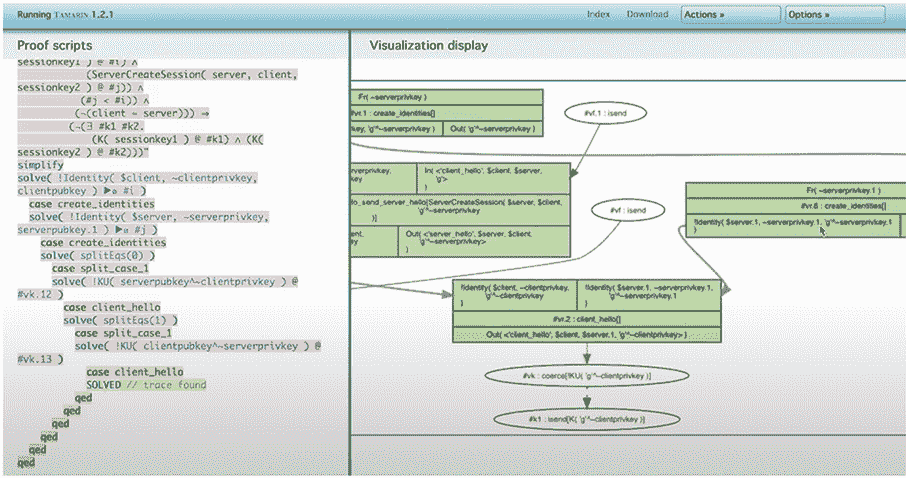
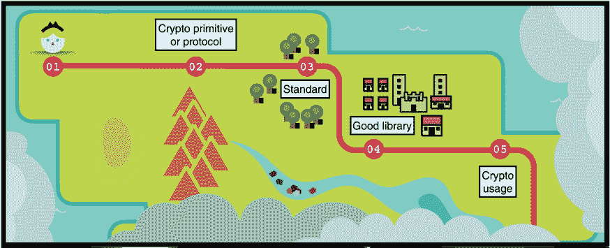
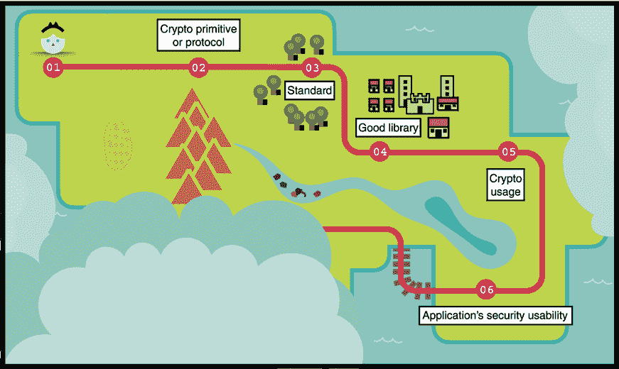
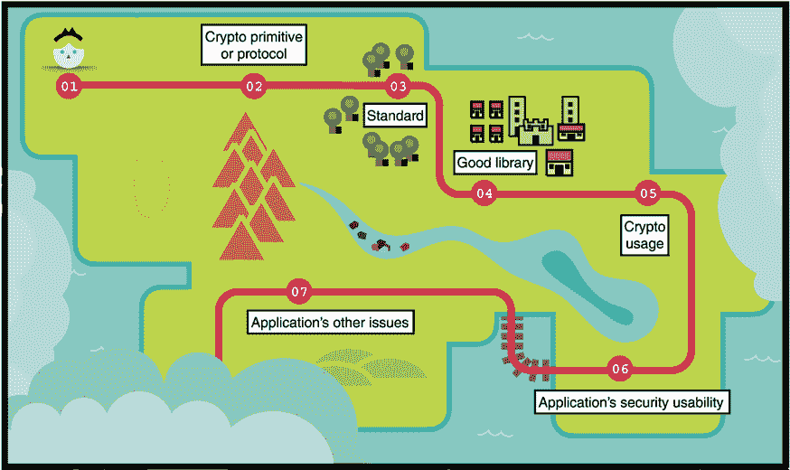

# 十六、密码学何时何地失效

本章涵盖了

*   使用加密技术时可能遇到的一般问题
*   遵循烘焙好的密码术的咒文
*   加密从业者的危险和责任

问候，旅人；你已经走了很长的路。虽然这是最后一章，但这是旅程，而不是终点。现在，您已经具备了步入真正的密码学世界所需的装备和技能。剩下的就是让你学以致用了。

在分手之前，我想给你一些提示和工具，对接下来的事情会有用。你将面临的任务通常遵循相同的模式:它以一个挑战开始，启动你对现有密码原语或协议的追求。从那里，你将寻找一个标准和一个好的实现，然后你将尽你所能利用它。前提是一切按计划进行。。。。

在我们分手之前

试图弥合理论与实践之间差距的人将不得不斩杀许多条龙。这是你的剑，拿去吧。

## 寻找正确的密码原语或协议是一项枯燥的工作

您面临着未加密的流量，或者需要相互验证身份的大量服务器，或者需要存储一些机密信息而不会成为单点故障。你是做什么的？

你可以使用 TLS 或 Noise(在第 9 章中提到)来加密你的流量。您可以建立一个公钥基础设施(在第 9 章中提到)通过某个认证机构的签名来认证服务器，并且您可以使用一个门限方案(在第 8 章中讨论)来分发一个机密，以避免一个机密的泄露导致整个系统的泄露。这些都是很好的答案。

如果你面临的问题是一个常见的问题，那么你很有可能可以找到一个现有的加密原语或协议来直接解决你的用例。这本书让您很好地了解了什么是标准原语和公共协议，因此在这一点上，您应该很好地了解了在面临加密问题时可以做些什么。

密码学是一个非常有趣的领域，随着新的发现和原语的发明和提出，它将无处不在。虽然您可能会尝试使用奇异的加密技术来解决问题，但您的责任是保持保守。原因是复杂性是安全性的敌人。每当你做某事时，越简单越容易。太多的漏洞是由于试图奢侈而引入的。这个概念在 2015 年被 Bernstein 称为*无聊密码学*，也是谷歌 TLS 库 BoringSSL 命名背后的灵感。

密码方案需要经受住多年的仔细审查，才能成为可信的候选方案供实地使用。尤其是当提案是基于新奇的数学问题时。

—Rivest 等人(“对 NIST 建议的回应”，1992 年)

如果您找不到解决问题的加密原语或协议，该怎么办？这是你必须进入*理论*密码术世界的地方，这显然不是本书的主题。我只能给你一些建议。

我给你的第一个推荐是免费书籍*应用密码学*研究生课程，作者丹·博纳和维克多·舒普，可在[https://crypto book . us](https://cryptobook.us)获得。这本书提供了很好的支持，涵盖了我在这本书里提到的所有内容，而且更深入。丹·博纳也有一门令人惊叹的在线课程，“密码学 I”，也可以在[https://www.coursera.org/learn/密码](https://www.coursera.org/learn/crypto) 免费获得。这是对理论密码学更温和的介绍。如果你想读一些介于这本书和理论密码学世界之间的东西，我怎么推荐这本书都不为过，*严肃密码学:现代加密实用介绍* (No Starch Press，2017)作者 Jean-Philippe Aumasson。

现在，让我们假设你*有*现有的密码原语或协议来解决你的问题。密码原语或协议在很大程度上仍然是理论上的东西。如果它有一个你可以马上使用的实用标准，那不是很棒吗？

## 16.2 如何使用密码原语或协议？礼貌标准和正式验证

你意识到满足你需求的解决方案存在，现在它有标准了吗？在没有标准的情况下，通常会在不考虑其实际用途的情况下提出原语。密码学家通常不会考虑使用他们的原语或协议的不同陷阱，以及实现它们的的细节。*礼貌加密*是 Riad S. Wahby 曾经称之为标准的东西，它关心它们的实现，不给实现者留下搬起石头砸自己脚的空间。

可怜的用户得到了足够的绳子来上吊——这是一个标准不应该做的事情。

—Rivest 等人(“对 NIST 建议的回应”，1992 年)

礼貌标准是一种规范，旨在通过提供安全且易于使用的接口来实现所有边缘情况和潜在的安全问题，并就如何使用原语或协议提供良好的指导。此外，好的标准有附带的测试向量:匹配输入和输出的列表，您可以将其提供给实现来测试其正确性。

不幸的是，并不是所有的标准都是“礼貌的”，它们造成的加密陷阱正是我在本书中谈到的大多数漏洞。有时候标准太模糊，缺少测试向量，或者试图同时做太多事情。例如，*加密灵活性*是术语，用于根据协议支持的加密算法来指定协议的灵活性。支持不同的加密算法可以给标准带来优势，因为有时一种算法会被破坏和废弃，而其他算法则不会。在这种情况下，不灵活的协议会阻止客户端和服务轻松地继续运行。另一方面，太多的灵活性也会强烈影响标准的复杂性，有时甚至会导致漏洞，许多针对 TLS 的降级攻击可以证明这一点。

不幸的是，当你的问题遇到主流原语或协议不能解决的边缘情况，或者当你的问题不符合标准解决方案时，你会遇到麻烦，这种情况比密码学家愿意承认的要多。出于这个原因，开发人员创建自己的小型协议或小型标准是非常常见的。这就是麻烦开始的时候。

当对原语的威胁模型(它保护什么)或其可组合性(它如何在协议中使用)做出错误的假设时，就会发生破坏。这些特定于上下文的问题由于以下事实而被放大，即加密原语通常被构建在竖井中，其中设计者不一定考虑一旦原语以多种不同方式使用或在另一原语或协议中使用时可能出现的所有问题。我举了很多这样的例子:X25519 突破边缘情况协议(第 11 章)，假设签名是唯一的(第 7 章)，以及谁与谁通信的模糊性(第 10 章)。不一定是你的错！开发者比密码破译者更聪明，揭示了没人知道存在的陷阱。事情就是这样。

如果你发现自己处于这种情况，密码学家的首选工具就是纸和笔。这对我们这些从业者来说不是很有帮助，因为我们要么没有时间去做这项工作(这真的需要很多时间)，要么甚至没有专业知识。然而，我们并不是无助的。我们可以使用计算机来简化分析微型协议的任务。这叫做*形式验证*，它可以很好的利用你的时间。

形式验证允许你用某种中间语言编写你的协议，并在其上测试一些特性。例如， *Tamarin 协议证明者*(见图 16.1)是一个正式的验证工具，已经(并且正在)用于发现许多不同协议中的微妙攻击。要了解这方面的更多信息，请参阅文件“总理，请订购！使用 Diffie-Hellman(2019)和“看起来合法:对使用签名的协议的微妙攻击的自动分析”(2019)，重新审视对协议的小子群和无效曲线攻击。

图 16.1 Tamarin 协议证明者是一个免费的正式验证工具，您可以使用它来建模一个加密协议并发现对它的攻击。

硬币的另一面是，通常很难使用正式的验证工具。第一步是理解如何将协议翻译成工具所使用的语言和概念，这通常并不简单。在用正式语言描述了一个协议之后，您仍然需要弄清楚您想要证明什么以及如何用正式语言表达它。

看到一个证明实际上证明了错误的东西并不罕见，所以人们甚至可以问谁验证了形式验证？该领域一些有前途的研究旨在使开发者更容易正式验证他们的协议。例如，工具 Verifpal(【https://verifpal.com】)为了易用性而牺牲了可靠性(能够发现所有攻击)。

克拉克的攻击

当编写一个协议的正式描述时，与正在实现的实际协议相比，确实会出现关键的差异，这将导致漏洞和现实世界的攻击。这是 2017 年发生的事情，当时 KRACK 攻击()破坏了 WPA2 的 Wi-Fi 协议，尽管此前已得到正式验证。

您还可以使用正式验证工具(如 Coq、CryptoVerif 和 ProVerif)来验证加密原语的安全性证明，甚至可以用不同的语言生成“正式验证”的实现(参见 HACL*、Vale 和菲亚特-crypto 等项目，它们实现了具有验证属性(如正确性、内存安全等)的主流加密原语)。也就是说，形式验证不是一种万无一失的技术；纸上协议和它的正式描述之间，或者正式描述和实现之间的差距总是存在的，并且看起来无关紧要，直到发现是致命的。

研究其他协议是如何失败的是避免同样错误的一个很好的方法。cryptopals.com 的或 cryptohack.org 的挑战赛是了解在使用和编写密码原语和协议时会出现什么问题的好方法。底线——你需要彻底了解你在使用什么！如果你正在建立一个迷你协议，那么你需要小心，要么正式验证该协议，要么寻求专家的帮助。好了，我们有了一个标准，或者类似的东西，现在谁负责实施呢？

## 好的图书馆在哪里？

你离解决问题又近了一步。您知道想要使用的原语或协议，并且有一个标准。同时，你也离规范更远了一步，这意味着你可能会产生错误。但首先，代码在哪里？

你环顾四周，发现有许多库或框架可供你使用。这是一个好问题。但是，你选择哪个库呢？哪个最安全？这是一个很难回答的问题。有些库是很受尊敬的，我在这本书里列举了一些:Google 的 Tink，libna，cryptography.io 等。

然而，有时候很难找到一个好的库来使用。也许您正在使用的编程语言对加密技术没有太多的支持，或者您想要使用的原语或协议没有太多的实现。在这些情况下，最好保持谨慎，向密码学社区寻求建议，看看库背后的作者，甚至可能请专家进行代码审查。例如，Reddit 上的 r/crypto 社区非常有用，非常受欢迎；直接给作者发电子邮件有时会奏效；在会议的开放式麦克风会议上询问听众也有效果。

如果你处于绝望的境地，你甚至可能不得不自己实现加密原语或协议。在这一点上可能会出现许多问题，检查加密实现中出现的常见问题是一个好主意。幸运的是，如果你遵循一个好的标准，那么就不太容易犯错误。但是，实现加密是一门艺术，如果可以避免的话，这不是你应该做的事情。

测试加密实现的一个有趣方法是使用*工具*。虽然没有一个工具可以满足所有的加密算法，但是 Google 的 Wycheproof 值得一提。Wycheproof 是一套测试向量，可以用来查找常见加密算法(如 ECDSA、AES-GCM 等)中的棘手错误。这个框架已经被用来在不同的加密实现中发现大量的错误。接下来，我们假设你自己没有实现密码学，找到了一个密码学库。

## 16.4 滥用加密技术:开发者是敌人

你找到了一些你可以使用的代码，你又前进了一步，然而你发现有更多的机会制造错误。这是应用密码学中大多数错误发生的地方。我们已经在本书中一次又一次地看到了误用密码术的例子:在像 ECDSA(第 7 章)和 AES-GCM(第 4 章)这样的算法中重用随机数是不好的，当误用哈希函数时可能会发生冲突(第 2 章)，由于缺乏源认证，各方可能会被冒充(第 9 章)，等等。

*结果显示，只有 17%的 bug 在密码库中(这往往会产生毁灭性的后果)，其余 83%是个别应用程序对密码库的误用*。

大卫·耶戈、陈浩刚、·王和尼古拉·泽尔多维奇(“为什么加密软件会失败？案例研究和未决问题”，2014 年)

一般来说，原语或协议越抽象，使用起来就越安全。例如，AWS 提供一个密钥管理服务(KMS ),在 HSMs 中托管您的密钥，并按需执行加密计算。这样，加密在应用程序级别被抽象。另一个例子是编程语言在其标准库中提供了加密技术，这些标准库通常比第三方库更可信。比如 Golang 的标准库就很优秀。

对加密库可用性的关注通常可以总结为“把开发者当成敌人”这是许多加密库采用的方法。例如，Google 的 Tink 不允许您选择 AES-GCM 中的 nonce/IV 值(参见第 4 章),以避免意外的 nonce 重用。libna 库为了避免复杂性，只提供了一组固定的原语，没有给你任何自由。一些签名库将消息包装在签名中，迫使您在发布消息之前验证签名，这样的例子不胜枚举。从这个意义上说，加密协议和库有责任使它们的接口尽可能地防止误用。

我以前说过，现在我再说一遍——确保你理解你所使用的东西的细则(全部)。正如您在本书中看到的，误用密码原语或协议可能会导致灾难性的失败。阅读标准，阅读安全注意事项，阅读密码库的手册和文档。是这个吗？不完全是。。。。你不是这里唯一的用户。

## 你做错了:可用的安全性

使用加密技术以透明的方式解决应用程序中存在的问题，但并不总是如此！有时，加密技术的使用会泄露给应用程序的用户。

通常，教育只能帮到这么多。因此，当不好的事情发生时，责怪用户从来都不是一个好主意。相关的研究领域被称为*可用安全*，其中寻求的解决方案是使安全和加密相关功能对用户尽可能透明，尽可能消除误用的机会。一个很好的例子是浏览器如何逐渐从 SSL/TLS 证书无效时的简单警告转变为让用户更难接受风险。

*我们观察到的行为与警告疲劳的理论相一致。在谷歌浏览器中，用户点击最常见的 SSL 错误比其他错误更快、更频繁。[.。。]我们还发现谷歌 Chrome SSL 警告的点击率高达 70.2%，这表明用户对警告的体验会对用户行为产生巨大影响*。

—Devdatta Akhawe 和 Adrienne Porter Felt(“警告世界中的爱丽丝:浏览器安全警告有效性的大规模现场研究”，2013 年)

另一个很好的例子是安全敏感服务如何从密码转移到支持第二因素认证(在第 11 章中讨论)。因为很难强制用户使用每个服务的强密码，所以找到了另一种解决方案来消除密码泄露的风险。端到端加密也是一个很好的例子，因为用户总是很难理解对他们的对话进行端到端加密意味着什么，以及有多少安全性来自他们主动验证指纹(在第 10 章中讨论)。每当将加密技术推给用户时，都必须付出巨大的努力来降低用户出错的风险。

故事时间

几年前，我被要求审查一个广泛使用的消息应用程序的端到端加密提案。该提案包括通常的最先进的协议，即信号协议(在第 10 章中介绍)，但它没有为用户提供验证其他用户的公钥(或会话密钥)的功能。这意味着，虽然您的通信在被动对手面前是端到端加密的，但恶意员工可以轻松更新用户的公钥(或一些用户的会话密钥)，而您无法检测到中间人攻击。

## 16.6 加密不是一个孤岛

密码术通常被用作更复杂的系统的一部分，该系统也可能有缺陷。实际上，大多数 bug 都存在于那些与密码学本身无关的部分。攻击者通常会寻找链条中最薄弱的一环，也就是挂得最低的果实，而碰巧的是，加密技术通常在提高门槛方面做得很好。包含系统可能会更大、更复杂，最终往往会产生更容易被利用的攻击媒介。阿迪·萨莫尔有句名言，“密码学通常被绕过，而不是渗透。”

虽然努力确保您系统中的加密技术是保守的、实施良好的和测试良好的是好的，但是确保对系统的其余部分进行相同级别的审查也是有益的。否则，你所做的一切可能都是徒劳的。

## 16.7 作为一名加密从业者，你的责任是不要开发自己的加密软件

就是这样，这是本书的结尾，你现在可以自由驰骋在旷野中。但我必须警告你，读过这本书并不会给你任何超能力；它应该只会给你一种脆弱感。人们意识到加密技术很容易被滥用，最简单的错误也会导致灾难性的后果。小心行事！

现在，您已经有了一个庞大的加密工具集。你应该能够识别出你周围使用的是什么类型的加密技术，甚至可能识别出什么是可疑的。您应该能够做出一些设计决策，知道如何在您的应用程序中使用加密技术，并了解您或某人何时开始做一些可能需要更多关注的危险事情。不要犹豫，询问专家的观点。

“不要滚自己的 crypto”一定是软件工程中用得最多的密码学台词。然而，这些人多少是对的。虽然您应该感到能够实现甚至创建自己的加密原语和协议，但是您不应该在生产环境中使用它。生产密码学需要几年的时间:不仅从设计的角度，而且从密码分析的角度，需要几年的时间来了解这个领域的来龙去脉。即使是研究了一辈子密码学的专家，也构建出了破解的密码系统。布鲁斯·施奈尔曾经说过一句名言:“任何人，从最无知的业余爱好者到最好的密码学家，都可以创造一个他自己都无法破解的算法。”至此，就看你继续学习密码学了。这最后几页并不是旅程的终点。

我想让你意识到你处于一个特权地位。密码学最初是一个闭门造车的领域，只限于政府成员或保密的学者，它慢慢变成了今天的样子:一门全世界公开研究的科学。但是对一些人来说，我们仍然处于冷战时期。

2015 年，罗加威对密码学和物理学的研究领域做了一个有趣的对比。他指出，在第二次世界大战末期日本遭受原子弹轰炸后不久，物理学就变成了一个高度政治化的领域。研究人员开始感到一种深深的责任，因为物理学开始与许多人的死亡以及潜在的更多人的死亡明确而直接地相关联。不久之后，切尔诺贝利灾难将这种感觉放大。

另一方面，密码学是一个经常谈论隐私的领域，就好像它是一个不同的主题，这使得密码学研究与政治无关。然而，你我做出的决定会对我们的社会产生持久的影响。下次您设计或实现使用加密技术的系统时，请考虑您将使用的威胁模型。您是否将自己视为值得信任的一方，或者您是否正在设计一种即使您也无法访问用户数据或影响其安全性的方式？你如何通过密码术来授权用户？你加密什么？“我们根据元数据杀人，”前国家安全局局长迈克尔·海登( [http://mng。bz/PX19](http://mng.bz/PX19) )。

2012 年，在圣巴巴拉海岸附近，数百名密码学家聚集在乔纳森·齐特林(Jonathan Zittrain)周围，在一个黑暗的演讲厅里参加他的演讲，“密码的终结”()。这是在 Crypto 上，世界上最受尊敬的密码学会议。乔纳森在房间里播放了电视剧《权力的游戏》中的一个片段。视频中，太监瓦里斯向国王提利昂的手出了一个谜语。这是一个谜:

三个大人物坐在一个房间里:一个国王、一个牧师和一个富人。他们之间站着一把普通的长剑。每个伟人都要求佣兵杀死另外两个人。谁生，谁死？提利昂马上回答，“取决于佣兵，”太监回答，“如果是剑客掌权，我们为什么要假装国王掌握所有权力？”。

乔纳森随后停止了剪辑，指着观众，对他们吼道:“你们知道你们是佣兵，对吗？”

## 总结

*   现实世界的密码术往往在应用方式上失败。我们已经知道在大多数用例中使用好的原语和好的协议，这使得它们的误用成为大多数 bug 的来源。

*   密码原语和协议已经解决了许多典型的用例。大多数情况下，您需要做的就是找到一个可以解决您的问题的受尊重的实现。请务必阅读手册，并了解在什么情况下可以使用原语或协议。

*   真实世界的协议是通过像乐高积木一样组合密码原语来构建的。当没有公认的协议解决您的问题时，您必须自己组装这些部件。这是非常危险的，因为当在特定情况下使用或与其他原语或协议结合使用时，加密原语有时会中断。在这些情况下，形式验证是发现问题的极好工具，尽管它可能很难使用。

*   实现加密不仅仅是困难；您还必须考虑难以误用的接口(从某种意义上说，好的加密代码不会给用户留下搬起石头砸自己脚的空间)。

*   保持保守并使用久经考验的加密技术是避免问题的好方法。源于复杂性的问题(例如，支持太多的加密算法)是社区中的一个大话题，远离过度工程化的系统被称为“无聊的加密”尽可能的无聊。

*   密码原语和标准都可能对实现中的错误负责，因为它们实现起来太复杂，或者对实现者应该警惕什么模糊不清。礼貌的加密是一种加密原语或标准的思想，很难被错误地实现。要有礼貌。

*   在应用程序中使用加密技术有时会泄露给用户。可用的安全性是关于确保用户理解如何处理加密，并且不能滥用它。

*   密码学不是一个孤岛。如果你遵循这本书给你的所有建议，你的大部分错误可能会发生在系统的非加密部分。不要忽视这些！

*   用你在这本书里学到的东西，一定要负责任，好好想想你工作的后果。