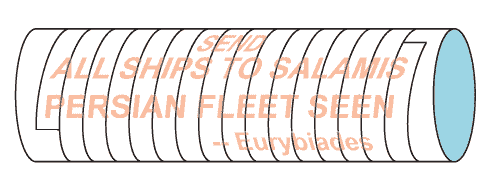
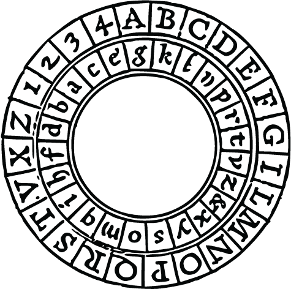

# 2 什么是密码学？

本章 涵盖

*   密码学中使用的基本术语
*   什么是无法破解的密码？
*   有哪些不同类型的加密技术？

密码学通常被称为“机密写作的艺术”不仅仅是这样。它涵盖了从隐形墨水到通过光子的量子纠缠传输信息的一切。特别是，密码学包括代码和密码的生成和破解。

不同的作者以不一致的方式使用加密术语，所以让我们先就一些基本术语达成一致。

*明文* 或*明文* 是您希望保密的消息或文件。在传统的密码术中，消息是以发送者和接收者都知道的某种语言编写的文本。在计算机设置中，这可以是任何类型的文件，如 PDF(文本)、JPG(图像)、MP3(音频)或 AVI(多媒体)。

*密码*是一种方法，或者说*算法*，用于篡改信息，使其不可读:例如，通过改变字符的顺序，或者用不同的字符替换某些字符。通常，密码对文本中的单个字符或字符组进行操作，而不考虑它们的含义。

一个*密钥* 是一条只有发送者和合法接收者知道的机密信息，合法接收者选择每条消息使用哪种转换。例如，如果密码(方法)是改变消息中字母的顺序，密钥可能指定当天的消息使用哪个顺序。密钥可以是一个字母、一个单词或短语、一个数字，或者是一系列字母、单词和数字。密码的强度很大程度上取决于它所使用的密钥的总长度。

关键词*或*关键词* 是用作关键词的单词或短语。*

 **加密* 或*加密* 是知道密钥的合法发送者将明文变成不可读的乱码的过程。

*密文* 是由此产生的乱码不可读的消息或文件，将被传输或存储。

*解密* 或*解密* 是知道方法和密钥的合法接收者将乱码密文还原成原始明文消息的过程。

一个*代码* 也是一种篡改信息使其不可读的方法。与密码相反，代码通常作用于信息中的单词或短语。典型的代码用一组数字或字母代替单词或短语。(令人困惑的是，单词 *code* 也用来表示字母的标准化表示，例如莫尔斯电码。希望上下文中的意思会很清楚。)

*密码学* 是密码学的正式研究，是用于构造和求解密码的数学和方法论。学者研究密码学；密码破译者研究密码分析。

*密码分析是对代码和密码的研究，其特定目的是识别弱点并找到破解它们的方法，或者相反，找到加强它们的方法。*

 **密码破译* 是没有密钥，甚至可能不知道方法的第三方(敌人或对手)破解加密消息的过程。这可以通过数学方法或者通过耐心收集和整理截获的信息来完成，但实际上通常归结为三个 B:贿赂、勒索 和非法闯入。

## 2.1 无法破解的密码

现在我们有了一些与 T4 的共同语言，让我来谈谈主要问题。我说的“牢不可破”到底是什么意思？首先，我的意思是密码不能被加密手段破解。这不包括非法闯入、贿赂、胁迫、叛逃、勒索、美人计和类似手段。那些不在我们的范围之内。第二，我的意思是密码在实际意义上是无法破解的。任何对手都有有限的资源和有限的时间来完成破译密码的任务。当选择一个密码时，你需要知道你的潜在对手会花费多少人力和电脑来破解你的密码。保守估计，考虑到计算机的改进，加上安全系数，然后选择一个数字。然后，当你选择一个密码时，你就有了一个瞄准的目标。到达那个目标，你的密码实际上是无法破解的。

请记住，许多消息的生命周期都是有限的。如果你的信息在黎明时被攻击，而你的敌人在中午时读到你的信息，那就太晚了。你已经攻击了。一个可以在 12 小时内破解的密码，在你的对手没有 12 小时的时候，实际上是无法破解的。

只是为了让这个概念更加清楚，当我说一个密码已经被*破解，我的意思是对手可以读取使用那个密码发送的信息。即使对手只能读取 1%或 0.01%的消息，密码也是被破解的。但是在某处有一个截止点。如果对手只有在截取了许多用相同密钥加密的相同长度的消息后才能读取消息，或者 64 个密钥位中有 63 个是零，那么密码仍然是未被破解的。对手没有先验的方法来判断哪个消息使用了哪个密钥，或者哪个密钥几乎全是零。您可能永远不会用相同的长度和相同的密钥发送两条消息，或者 64 个密钥位中有 63 个是零。*

 *如果您的密码使用 256 位密钥，而敌方密码分析人员找到了一种数学或计算方法将其减少到 200 位甚至 150 位，那么该密码可能会被削弱，但如果您选择的安全级别是 128 位，它仍然不会被破坏。使用 256 位密钥实现 128 位的安全级别提供了巨大的安全裕度。

当政府认为旧的数据加密标准不再安全时，它举办了一场新密码的国际竞赛。向全世界征集提案。提交了几十个密码。数百名密码学家评估了这些候选密码的安全性、速度和易实现性。从 1997 年到 2000 年 4 月，共进行了三轮筛选，最终选出了获胜者。当你的密码成为政府、银行、工业和军队的全球标准时，这就是你需要做的。如果你决定参加下一次比赛，这本书将帮助你做好准备。

然而，大多数读者不会尝试这样做。他们的密码将有更有限的范围。他们可能相信自己的判断，或者他们设计的任何验证过程，来评估他们的密码。第 12 章中的原则将有助于引导他们做出合理而自信的 决定。

## 2.2 密码术的类型

还有 有许多不同类型的密码术。过去使用的一些类型有

*   *:例如，信使可以吞下信息，或者把它藏在他们的鞋跟或马鞍里，或者简单地记住它。在古代，让信差用他们听不懂的语言来记忆信息是很常见的。*

**   *秘法* ，如*凯撒密码* ，其中字母表中的每个字母都被替换为后面 3 位的字母。也就是说，A 变成了 D，B 变成了 E，C 变成了 F，依此类推。

    *   *伪装的消息，在这里消息被做成看起来像别的东西，比如使者服装上的图案。*

    **   *不可见* *消息* ，比如微粒，或者加热或遇酸变得可见的不可见墨水。

    *   *误导:例如，签名或纸张的形状和颜色是真实的信息，其他一切都是干扰或虚假信息。*** 

 ***所有隐藏信息的方法统称为*隐写术* ，最早描述于 1499 年本笃会修道院院长约翰尼斯·特里特米乌斯*隐写术* 一书中，本名约翰内斯·海登伯格。Trithemius 的书本身就是一种隐写术，因为它被伪装成一本魔法书。

这些隐写方法中的一些有现代的对应方法。例如，通过仅使用每个像素的低阶位，可以在 JPEG 图像文件中隐藏消息。另一个例子是使用随机数生成器在文件的每个字节中挑选特定的位。选择的比特包含信息，剩余的比特可以是随机的乱码。

在描述现代密码之前，让我先介绍一种有用的速记法。消息从发送者发送到接收者，加密的目的是防止一些敌人读取消息。为了简单起见，我把发送者称为桑德拉，把预期接收者称为丽娃，把敌人称为艾米丽。那比爱丽丝，鲍勃，卡罗尔自然多了，不是吗？

通常，珊卓拉在把讯息传送到丽娃之前，会在她所在地对讯息进行加密。信息可以通过任何方式发送:信件、电话、互联网、短波收音机、Aldis 灯、微爆、电报、光缆、旗语、量子纠缠，甚至烟雾信号，如果有直接的视线。为了使这个画面更完整，密码可能需要一个密钥以及明文，并且可能有一个敌人在监听。这是一个更完整的图像。

现代密码一般分为三大类:密钥、公钥和个人密钥。它们的主要区别特征如下。

秘钥:桑德拉有一把秘钥，她用它来加密信息。丽娃有一个相应的密钥，她用它来破译这些信息。这可能是同一个键或一个*反*键 。通常桑德拉控制着钥匙。当桑德拉更改密钥时，她必须将新密钥或其逆密钥发送给丽娃。这是经典密码学的标准范例。

*公钥* :丽娃有一个公开的加密密钥，她把它公之于众。每当桑德拉想给丽娃发信息时，她就用丽娃的公钥加密。丽娃还有一个只有她自己知道的机密解密密钥，她可以用它来解密她收到的信息。为了使这个方案有效，重要的是没有人能够从公开信息中计算出这个密钥。占主导地位的公钥方法是 RSA 算法，该算法由罗纳德·里维斯、阿迪·萨莫尔和莱恩·阿德尔曼在大约 1975 年发明。

*个人密钥* :桑德拉和丽娃每人都有一个私人密钥，他们不与任何人共享，甚至彼此也不共享。由于没有密钥被传输或共享，个人密钥加密有时被称为*无密钥*加密 。它是这样工作的:(传递 1)桑德拉用她的个人密钥对消息进行加密，并将加密的消息发送给丽娃。(传递 2)丽娃用她的个人密钥对该消息进行加密，并将该双重加密的消息发送回桑德拉。(传递 3)桑德拉用她的个人密钥破译了这条信息，并将它发回给丽娃。这条信息现在只能用丽娃的密钥加密，她用这个密钥来阅读这条信息。

这里棘手的部分是桑德拉的加密和丽娃的加密需要*交换*。也就是说，不管是桑德拉先加密还是丽娃先加密，它们都必须产生相同的结果。象征性地，我们将其表示为 SRM=RSM，其中 M 是消息，S 和 R 是桑德拉和丽娃的加密。个人密钥加密的优点是，任何人都可以与其他任何人安全地通信，而不必预先安排任何密钥或传输任何密钥，因此密钥不可能被截获。

个人密钥密码术也称为*三重通过协议* 。一个*协议* 只是一系列用于某种目的的步骤，比如传输一条消息。换句话说，协议就是一种算法。三遍协议的基本思想是由阿迪·萨莫尔 在大约 1975 年发明的，我在本书中介绍的具体方法是我自己的 。

## 2.3 对称与非对称加密

很多 的书都写明密码学可以分为两种:*对称* 和*非对称*密码。这个想法是，在机密密钥加密中，桑德拉和丽娃使用相同的密钥来加密和解密信息，而在公开密钥加密中，桑德拉使用一个密钥，而丽娃使用它的逆密钥。这种二分法忽略了个人密钥加密，它既不是对称的也不是非对称的，以及在 2.2 节开始时描述的各种经典方法。此外，对称/不对称分类并不总是准确的。在第 15.1 节中，我描述了*希尔密码* ，这是一种机密密钥方法，其中加密包括将消息乘以密钥，解密包括乘以逆密钥——就像公钥加密一样。

将密码分类为对称或非对称并不是特别有用。它没有抓住机密钥匙和公开钥匙加密术之间的本质区别，即在机密钥匙加密术中，所有的钥匙都是保密的，而在公开钥匙加密术中，每一方保留一个机密钥匙，并公开一个钥匙，供所有人使用。

公钥密码和个人密钥密码都是在 1975 年左右问世的。公钥加密激发了人们的想象力，因此从那时起，私钥和个人密钥方法就很少受到关注。许多书籍都全面介绍了公钥加密。本书主要关注密钥密码术，它是 密码术的支柱和基石。

## 2.4 分组密码与流密码

另一种 分类是将密码分为分组密码和流密码。块密码对消息中的字符块进行操作，比如 5 个字符的块。通常所有的块都是相同的大小，并且每个块使用相同的密钥。

流密码 一次对消息的一个字符进行操作。每个角色都有自己的键，称为*角色键* ，通常取自一个更大的键，称为*消息键* 。在旧的流密码 中，消息密钥是重复的。例如，如果消息密钥大小是 10 个字符，那么第一个密钥字符将用于加密消息字符 1、11、21、31，...在消息中，第二个密钥字符将加密消息字符 2、12、22、32，...等等。使用定期重复密钥的密码被称为*周期性*。在较新的流密码中，消息密钥通常与消息本身一样长，称为*密钥流* 。这种*非周期性* 或非周期性的加密方式被称为*一次性密码本* 。在第 13 章中，讨论了密钥流是如何生成的。

块/流分类不是唯一的。有混合的密码 ，其中信息被分解成块，但是不同的块用不同的密钥加密，所以密码操作的是一串块而不是一串 字符。

## 2.5 机械与数字

密码 也可以根据产生它们的手段来分类。最早的密码完全是手工完成的。不用铅笔和纸，而是用铁笔和羊皮纸，或者铁笔和泥板。

最早的机械加密手段是古希腊人和斯巴达人使用的*天书* 或*天书* (发音为 SKIT-a-lee)，可能早在公元前 700 年。它由一根杆组成，杆上缠绕着一条狭窄的皮革或羊皮纸，这样每一圈的边缘都与相邻圈的边缘相吻合。换句话说，既没有空白也没有重叠。信息的字母写在纸条的两圈或更多圈上。当纸条被解开时，只有不相连的字母片段可见，这样敌人就不会认出它包含了信息。可以添加额外的曲线或颜色补丁，使其看起来像一种装饰。

发送者保留了用于阅读和书写未来信息的五线谱。信使们可以把这种带子当作腰带，或者用来扎头发或者系马鞍。收件人需要一根直径相同的棒来重组信息。当然，信使们没有被告知丝带或丁字裤的用途。它甚至可能在他们不知情的情况下被缝进他们的衣服里。

依诺增爵八世·波塔 1593 年版的*T2 中有一个神话故事的图像。它展示了每个希腊字母是如何跨越几圈皮革带的。这是一个现代版本。*

希腊人将这个神话的机密保守了大约 700 年。然而，罗马人并不那么成功。最终他们在北欧的敌人学会了这些棍子的意义和用途。因此，罗马人发明了一种特殊的测量工具，由中空的黄铜或青铜十二面体组成，这是一种有 12 个相同五边形面的固体形状，每个面上都有一个圆孔。这些孔使他们能够制造精确直径的木棒。当一个总督(太守)、大使或间谍被派往一个需要穿越敌对领土的岗位时，携带这个工具比携带一个可以被捕捉到的真实故事更安全。12 个洞有不同的直径，以便与其他总督、大使和间谍进行安全通信:例如，小的用于 Londinium(现在的伦敦)，中等的用于 Lugdunum(现在的里昂)，大的用于 Tarraco(现在的加泰罗尼亚的 Tarragona)。

就目前所知，北欧人或现代考古学家从未发现过这些十二面体的用途。考古学家为这些文物提出了太多荒谬的用途，比如儿童玩具、马鞍饰品、铁匠练习用的零件、烛台、火炮测距仪，或者，最后的答案，宗教物品。

这是在比利时最古老的城镇 Tongeren 附近发现的青铜罗马十二面体，陈列在 Gallo-Romeins 博物馆。

这里有一个有趣的旁注:如果你在维基百科和其他网站上查找*童话* ，它说这个童话被用来产生一个换位密码 ，通过在纸条的一圈内写下每个字母。这是不对的。这样的纸条很容易被识别为密码信息。无论敌人是否能读懂这封信，他们肯定不会让信使去传递它。在[cryptiana.web.fc2.com/code/scytale.htm](http://cryptiana.web.fc2.com/code/scytale.htm)可以找到对整封信与断信问题的彻底检查。1841 年，天才的密码学家埃德加·爱伦·坡写了一篇文章“关于机密写作的几句话”，很好地描述了这个童话故事以及他通过匹配破碎的信件片段来解密这些信息的方法。

更糟糕的是，如果你在维基百科上查找“换位密码 ，它说这个童话被用来产生一个“围栏 密码”，也被称为“之字形 密码。”围栏密码有上下交替的列。沿着或绕着一根杆写信息不涉及任何方向的改变。因此，如果用一个童话来产生一个换位 密码，结果可能是一个柱状换位，而不是围栏。(我在维基百科上更正了这些错误，但是我的更正被删除了。我已经放弃了成为维基百科警察的努力。)

一个 20 世纪 60 年代版本的童话是将一副电脑穿孔卡片分类，用铅笔在卡片的外表面写下信息，然后彻底洗牌，只留下分散的点。当这副牌通过卡片分类机时，卡片会恢复到原来的顺序，信息就可以被阅读了。这个想法被程序员广泛讨论，但我不知道它是否被付诸实践。另一个现代的对等物是将信息写在拼图玩具的空白背面，然后将碎片打乱。接收者需要解开谜题，然后翻转它来阅读信息。

另一个机械密码是托马斯·杰斐逊在 1790 年到 1793 年间发明的杰斐逊转轮密码 。它由 36 个同样大小的木制圆盘穿在一根铁棒上形成一个木制圆筒。在每个圆盘暴露的边缘，字母表的 26 个字母以某种混乱的顺序书写。圆盘可以独立旋转,拼出任何信息。杰斐逊 使用圆盘或纸条的密码版本在 20 世纪 60 年代还在使用。

从 15 世纪到 19 世纪，发展了许多类型的圆盘密码。最常见的类型使用几个薄而平的同心圆盘，它们可以围绕一个中心枢轴旋转。每个圆盘都有字母或一些数字或符号以某种顺序写在它上面的边缘。圆盘变得越来越小，这样就可以同时看到所有的字母。磁盘排列在某个位置，加密包括在其中一个磁盘上找到明文字母，然后使用另一个磁盘上相应的字母或符号作为密文字母。后来的磁盘密码在每个字母被加密后，或者手动，或者通过时钟机构推进内部磁盘。

这是奥古斯托·布纳法尔塞 绘制的莱昂·巴蒂斯塔阿尔贝提密码盘 的图片，出自他 1467 年的著作 *De compendis cifri* 。(图片由维基媒体共享分发。)

从 1915 年开始，一长串机电 转子密码被发明出来。最著名的是 20 世纪 20 年代由德国工程师亚瑟·谢尔比乌斯研发的英格玛机。计算机时代开始时，市场上出现了几十种型号。都产生了流密码 。基本的想法是，一个字母的替代品是由电流通过一系列转动的转子的路径决定的。每个字母被加密后，一些转子转动，由各种凸轮、齿轮、凸耳和棘爪控制，以无数种方式改变替换。所以，如果单词步兵出来是 **PMRNQGFW** ，那可能几十亿次都不会再发生。

自 20 世纪 60 年代以来，密码学变得越来越计算机化和数字化。数据加密标准(DES ) 由 IBM 于 1975 年开发，并于 1977 年通过美国国家标准局 认证。这引发了一系列名为 Serpent 和 Twofish 的分组密码，最终形成了高级加密标准(AES),由国家标准与技术研究院 (NIST)于 2001 年采用。这类密码将在第 11 章中介绍。

级数一直从 手动 ➔ 机械 ➔ 机电 ➔ 数字。

## 2.6 为什么选择秘钥？

在 这个公钥密码的时代，问题自然产生了，为什么会有人选择私钥密码？有几个原因。

秘钥加密要快得多。即使是最强、最复杂的机密密钥方法也往往比主要的公开密钥方法快几百倍甚至几千倍。实际上，公钥密码的主要用途是为私钥密码加密密钥。密钥使用公钥方法发送，但消息本身使用私钥方法发送。

公钥加密(PKC )需要一个公钥基础设施 。必须有公钥服务器来将公钥分发给潜在的通信者。PKC 受到各种各样的中间人和欺骗攻击，其中对手冒充发送者和/或接收者和/或密钥服务器，因此 PKC 需要大量的认证和验证。请求公钥的人必须证明与接收方属于同一个网络。必须验证包含公钥的消息，以确保它来自服务器。当公钥第一次发布到服务器上时以及每次更改时，必须对接收者进行身份验证。当新的一方加入网络时，授权该新一方的人必须被认证。当一个新的网络被添加到服务器时，参与的每一方都必须被认证。接收方必须验证接收到的消息没有被某个第三方更改或替换。这一切造就了大量的信息。

机密密钥加密可以在没有任何管理过载情况下运行。两个人可以在不涉及任何人或任何中介系统的情况下交换密钥消息。当几个人在交换机密密钥消息时，唯一需要的授权是每一方都有当前的密钥。未经授权的人没有钥匙，也不能阅读信息。

交换信息并不是加密技术的唯一用途。一个同样重要的角色是确保存储在计算机、外部设备(如闪存驱动器)或云存储中的数据文件的保密性，这些文件通常会存储很长时间。PKC 不能用于这一目的。只有密钥方法适合于保持数据文件的机密。

当一条消息需要同时广播给许多接收者时，使用密钥方法可以很容易地做到。所有需要的是每一方都有密钥。他们可以使用与其个人密钥分开的特殊广播密钥。或者，可以通过使用单独的密钥传输密钥向每一方发送消息密钥。使用公钥方法，您将需要获得所有接收者的个人公钥，以及所有附带的授权和验证。这不能预先安排，因为参与者可以在任何时候自由地改变他们的公钥。

最常见的公钥方法是 RSA 方法。这种方法的优势在于，目前很难对大数进行因式分解(见 3.4 节)。给定一个没有小质因数的 200 位十进制数，目前没有可行的方法分解它。然而，当量子计算机可用时，这一切都将改变。麻省理工学院教授彼得·肖尔开发了一种量子算法，可以很容易地分解这么大的数字。当这种情况发生时，所有存储在计算机上的 RSA 信息都可以被读取。

到目前为止，还没有已知的方法使用量子计算机来破解密钥密码。如果量子计算机是一个问题，密钥加密是唯一的选择 。

## 2.7 为什么要自建？

如果 你是一个密码爱好者，那么很明显你为什么要打造自己的密码。你建立自己的密码，因为这是你的爱好。模型火车爱好者设计、建造和运行模型火车。模型飞机爱好者设计、制作和放飞模型飞机。密码爱好者设计，建立和解决密码。

如果你是学密码学的学生，构建自己的密码是很好的训练。这是学习如何构建和评估密码的最好方法。当前的标准密码 AES(第 11.5 节)，不会永远持续下去，需要有人设计它的替代品。如果你想成为这一努力的一部分，这本书可能是你最好的起点。

如果你是一名负责保护高价值数据和通信的严肃的密码学家，你可能会出于对政府批准的密码是否像你的政府声称的那样安全的合理怀疑，来构建你自己的密码。让我给你一个故事来支持你的怀疑。

大约在 1975 年，IBM 提出了现在称为 DES 的密码，数据加密标准 。它成为了机密密钥加密的全球标准。正如 IBM 最初设计的那样，DES 有 64 位密钥。美国国家安全局 (NSA)要求密钥从 64 位减少到 56 位，其余 8 位用作校验和。

这毫无意义。如果真的需要校验和，那么密钥可以从 64 位增加到 72 位。人们普遍认为，美国国家安全局提出这一要求的真正原因是，它知道如何破解使用 56 位密钥的信息，但不知道如何破解使用 64 位密钥的信息。事实证明这是真的。

你可以合理地得出结论，美国国家安全局永远不会批准任何它无法破解的加密标准。在这种情况下，你可以推断 NSA 可以破解所有不同形式的 AES。如果美国国家安全局能够破解 AES，那么它的俄罗斯和中国同行很可能也能破解 AES。

只有少数专家构建候选密码，从这些候选密码中选择全球标准密码。众所周知，这些专家在马里兰州米德堡的国家安全局总部接受简报。在这些会议中，NSA 人员向他们建议可能增强或削弱密码的技术。推荐的方法中可能隐藏着某种后门，让美国国家安全局，也只有美国国家安全局，能够轻松破解这些密码。还有一种可能是，NSA 可以提供工作、合同和研究资助，诱使专家们采用那些易受攻击的方法。

这里有很多猜测，但是密码学家往往非常保守。如果你能想象出一个似是而非的弱点或漏洞，不管你的对手是否能真实地利用它，最好是尽可能地防范它。

最后，您可能只是追求速度、更简单的实现或更便宜的硬件。您可能希望构建自己的密码来实现这些目标，而不牺牲安全性。你会在本书中找到可以帮助你做到这一点的方法。

也就是说，记住有很多陷阱。不要只是创建一个密码，并假设它“足够强大”。很多密码都有意想不到的弱点。即使是最强的密码也可能被操作者的错误所破解，例如，以标准标题开始每条消息，频繁地重复使用密钥，或者使用不同的密钥发送相同的消息。例如，许多德国信息在二战期间被破解，因为它们都是以“希特勒万岁”开始的

这本书包含了你构建一个牢不可破的密码所需的所有信息，但是记住只阅读一本关于密码学的书不会让你一夜之间成为专家。务必使用第 12 章 中详述的 的原理检查你的密码强度。******