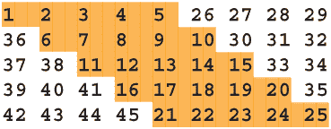
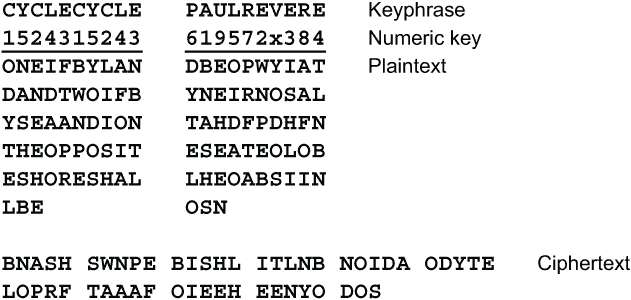
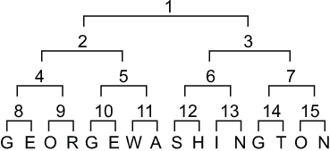

# 7 换位

本章涵盖

*   路线和柱状换位
*   随机数换位
*   按键换位
*   多重编程

在第五章和第六章中，我们研究了替代密码。第二大类密钥加密方法是换位。换位意味着改变消息中元素的顺序。这些元素可以是单词、音节、字母或代表字母的单个数字或比特。在本章中，我们将主要讨论字母换位，但是请记住，您可以对其他元素使用相同的方法，例如 7.2.2 节中的单词换位。本章将涵盖许多不同类型的换位密码。你可以只用铅笔和纸来完成大部分的换位密码。

## 7.1 路线换位

*路线* *换位*是最简单，也是最古老的换位密码形式。不涉及任何密钥。机密来自于路线或路径的选择。

路线变换是让孩子们对密码学感兴趣的好方法。这对教室、童子军或其他俱乐部来说是一个很好的活动。主要的警告是，孩子们必须将字母整齐划一地写在直栏中，否则信息会变得混乱。这可以通过使用宽间距的绘图纸来避免。

基本思想是使用一条路线将消息写入矩形，并使用另一条路线读出。例如，如果消息有 30 个字符，那么 5×6 的矩形是最好的。如果消息有 29 个字符，只需添加一个空值。用空值填充消息，直到它适合合适大小的矩形。在开始填充之前，先画出矩形的轮廓是很有帮助的。如果消息很长，将它分成大小合适的块。例如，一个 1000 个字符的消息可能被分成 20 个 5×10 的块。

我们已经在第 4.3 节看到了一个路线变换的例子。该信息从左到右水平写入 5×5 的网格中，并从上到下垂直读出。水平和垂直是两种类型的路由。这里有一个更完整的列表。

*   水平、从左到右、从右到左或左右交替

*   垂直、从上到下、从下到上或上下交替

*   对角地，从左上到右下，从左下到右上，等等，或者交替

*   螺旋形，从任何角落向内或从中心向外，顺时针或逆时针

你可以从矩形的任何一个角开始，用任何一条路线写入信息，用任何一条路线读出信息。这是一条奇特路线的例子:

消息将按照数字指示的顺序写入网格，并按列读出，即 1、36、37、39、42、2、6、38、...

对于路线换位，Emily 只需要猜出你用来读出信息的路线。艾米丽将信息填入矩形后，可以通过检查来阅读。请注意，对于 Emily 来说，是将消息水平写入 5×6 的矩形还是垂直写入 6×5 的矩形并不重要。无论你是从第一行开始，然后往下做，还是从第二行开始，然后往上做，都没有关系。艾米丽看不出区别。

航线换位被评为 之一。

## 7.2 柱状转位

*柱状* *换位* 是换位密码的主力。自 17 世纪以来，它一直被军队、外交官和间谍使用。该方法首先在 1685 年由 John Falconer 、 *Cryptomenysis Patefacta* 、(机密通信泄露)的书中描述。1688 年光荣革命后，约翰·福尔克纳跟随詹姆斯二世流亡法国，在 1692 年这本书的第二版以新标题出版前，他死在了法国。

分栏换位使用一个键，它可能是一串混合顺序的连续数字，或者是一个关键字或关键短语，它通过按字母顺序对字母进行编号而变成一个数字串。考虑关键字样本。字母 A 在字母顺序中出现得最早，所以它的编号是 1。按字母顺序，下一个是 E，编号为 2。然后是 L，M，P 和 s，所以 SAMPLE 被转换成字符串 6，1，4，5，3，2。如果同一个字母出现不止一次，出现的字母会从左到右编号。例如，ANACONDA 变成 1，6，2，4，8，7，5，3。

将信息从左到右水平地写在一个格子里。列数是键的大小。如果关键字是 SAMPLE，则有 6 列。如果键是 ANACONDA，则有 8 列。将数字键写在网格上方，像这样:

按照数字键从上到下垂直读出消息，从编号为 1 的列 EKFHE 开始，然后是列 2，ESRAT，列 3，NROW，直到列 8，YCYI，如图所示。

丽娃，合法接收者，需要做一点算术来读取这条消息。密钥长度为 8 个字母，消息长度为 35 个字母。35 除以 8 等于 4，余数是 3。这意味着该数组将包含 4 个完整的 8 个字母的行，加上一个 3 个字母的短行。丽娃应该在开始填充列之前画出这个数组的轮廓，这样她就可以在每个列中放置正确数量的字符。

对于敌人艾米莉来说，这个任务有点难。该技术是将每列中的字母垂直写在一张纸条上，然后将这些纸条匹配起来以确定各列的顺序。她寻找成对的纸条，在那里匹配的字母形成共同的二元组。当她得到一个好的匹配时，她试图在这两个条带之前或之后添加第三个条带。一旦 3 或 4 条正确匹配，短词开始出现，任务变得容易。

Emily 不知道关键字的长度，所以她需要猜测。她可能从 5 点开始工作。让我们假设她已经到了 8，正确的长度。像丽娃一样，她用 35 除以 8。她知道有 5 个各有 4 个字母的短列和 3 个各有 5 个字母的长列。Emily 的问题是每个条带从哪里开始和结束，以便它至少包含一个完整的列。

第一条从密文的第一个字符开始，长度必须为 5 个字母，以防从数组中读出的第一列很长。如果第一列很短，第二条从密文的第五个字母开始，如果第一列和第二列都很短，则在第十个字母结束。第三和第四条带也是如此。然后，Emily 将对其他 4 条进行相反的操作，从密文的最后一个字母开始，向中间反向操作。

然后，Emily 会将这些条匹配起来，将它们相互滑动以确定正确的排列。所有这些都是通过眼睛完成的，所以艾米丽必须记住最常见的二元和三元模型的频率。这也可以由计算机以简单直接的方式来完成。

对于这种类型的匹配过程，最常见的对策是发送者 Sandra 从上到下读出一些列，以及从下到上读出一些列。这意味着艾米丽将需要第二组向后读的纸条。然后，她将有两倍多的条来尝试匹配。

当所有列都向下读取时，如果数组是矩形，列转置被评定为 2，否则被评定为 3。对于以交替方向读取的列，如果网格是矩形，或者如果列很长，则列换位被评定为三级，否则为四级。

列转置是一种屡试不爽的方法，可以增强任何类型的替代密码。与混合良好的键控简单替换相结合的列变调被评为五级。当与混合良好的通用多字母密码结合时，它的等级为 7。如果两个键的长度互质，则组合最强。

加强柱状换位最常用的技术是使一些行具有不同的长度。这使得 Emily 更难知道这些条应该在哪里开始和结束。显示了四个这样的想法。其中，数字(4)是最强的，因为它在中间的不可预测的点处而不是在末端破坏条带。更复杂的空白图案在一些列中可以有两个或更多的空白。

如果艾米丽不知道这种模式，有这些变化的柱状移位被定为 4 级。如果关键字很长，并且列中有可变数量的空格，则变量(4)的评级上升到 5。第一次世界大战快结束时，法国人使用了类似的系统。据信，德国人至少能够阅读其中一些信息，主要是因为法国人多次重复使用他们的钥匙。

数字(3)的两个进一步的变化，楼梯，是(5)当你到达右边缘时从第一列开始，形成一个歪斜的图案，和(6)当你到达右边缘时反向，形成一个人字形或之字形图案。这些模式的优点是，除了最后一行之外，每一行的字符数都是相同的，这使得丽娃很容易计算行数。以下是这两种变化的例子。

您也可以拥有两个或多个不同宽度的独立楼梯，或者拥有对角和反对角方向的楼梯 **\** 和 **/** 。

当你破译用这些列转置变体发送的信息时，如果你在计算需要多少行或者最后一行有多长时有任何困难，这里有一个技巧。数一数邮件中的字母，按照 Sandra 在信中使用的相同模式，从左到右用这些小点填充数组。然后在圆点上填上字母。

例如，在变体(2)中，假设你已经同意你将总是从第一行的 7 个字母开始。密文(2)有 38 个字母，所以你把 7 个点放在第一行，8 个点放在第二行，...直到你总共放置了 38 个点。然后你开始在相应的列中填入字母，像这样替换点:

使用涂黑方块的另一种方法是用空值填充它们。应该选择空值，以便它们在两边形成不常见的字母对，使 Emily 更难匹配列。最好使用常见的字母，而不是罕见的字母，因为它们很容易被识别为空。这里有一个例子。

带空值的列换位被评为三级。由于涂黑空间的固定模式，评级为四。

### 7.2.1 Cysquare

历史 花絮:二战期间，英国人使用了这种想法的一种变体，叫做 *Cysquare* ，由准将·约翰·蒂尔特曼于 1941 年发明。Cysquare 是一种列转置密码，有许多中断。英国发行了 26×26 网格的便笺簿，其中大约 60%的正方形以随机模式涂黑。每一页都有不同的图案。信息被写在横排的白色方块中，然后以某种顺序垂直读出。网格是方形的，所以可以在任何方向使用。

关键是 pad 中的页码、方向以及网格中的开始和结束位置。密码员会在纸上画线来标记信息区域。使用不同的区域允许页面用于多个消息。

缺点是需要分发如此多的护垫。为了尽量减少拍纸簿的数量，英国人用了一整天的时间来处理每一页，可能多达 50 条信息。这意味着要写得模糊不清，还要擦掉很多次。这些书页变得无法阅读，最终密码职员拒绝使用它们。Cysquare 于 1944 年被废弃。

从 1944 年到战争结束，德国人缴获了一些这样的垫子和说明书后，他们自己开始使用这个系统。他们称之为 *Rasterschlüssel* ，意为*网格键*。然而，德国人在选择黑白方块方面做得很差。他们使用了太多相邻的白色方块，所以英国人在匹配这些条带时可以识别出二元和三元模型。这些信息成为英国人宝贵的情报来源。Cysquare 被评为七级。Rasterschlüssel 被评为四级。

需要注意的是，在计算机时代，黑白方块可以以位的形式传输，网格可以是任意大小，并且网格可以根据每条消息而改变。我建议 65%到 75%的黑方块。通过这种方式，cysquare 将被评为八级。

有一个简化版的 cysquare 供手动使用，它不需要打印网格，并允许您使用数字键来指定哪些方块被涂黑。这里有两种*停电*T3】换位 T5】密码的变体，左右交替版本和阶梯版本。两者都使用数字键 3174255 进行封锁。封锁密钥可以是重复密钥，或者可以由伪随机数发生器生成。您可以使用一个单独的键来指定读取列 的顺序。

另一种加强分栏换位的方法是将文本分割成不规则大小的块。例如，如果消息长度为 150，您可以将其分成 37、71 和 42 个字母的块。这个方法被评为四级。如果您对每个区块使用不同的密钥，则评级会增加到五级。

将列转置与任何类型的替代密码相结合大大增强了其安全性。即使结合简单的替换，评级也会增加到 5 级，因为匹配条带要困难得多。哪个先做没什么区别。将一般的多字母密码与至少 12 列的列转置相结合，将等级提高到 7，即使多字母密码的周期只有 3。这是因为你从本质上消除了匹配 条带的可能性。

### 7.2.2 单词换位

*字* *换位* 是历史上重要的基于字而非字母的柱状换位。这是美国内战期间联邦军使用的主要方法。这个想法来自联合电报公司的 Anson Stager，他后来创建了西部联合电报公司。联邦军的通讯因高传输错误率而受阻。在许多情况下，指挥官会放弃电报，只派一名信差步行或骑马前往。Stager 意识到发送单词而不是单个字母会降低出错率，并减少重新发送消息的需要。

Union cipher clerkers 将消息从左到右一个字一个字地写在一个矩形阵列中，然后使用多种路线将它们读出，例如交替地上下移动列，或者交替地从阵列的左半部分和右半部分取出列。虚词被大量使用。这里有一个例子。注意，第三行是 nulls 值。按照 1，3，5，2，4 的顺序读出各列。

## 7.3 双柱状转位

如 顾名思义，*双柱转位* 就是连续做两个柱转位，最好是用两个不同的调。这消除了匹配条带的可能性。值得注意的是，1934 年 Solomon Kullback 发现了一个通用解决方案，并由信号情报服务发布。这本 31 页的书于 1980 年解密，由爱琴海公园出版社出版。爱琴海公园出版社多年来一直是密码学书籍的无价资源。2001 年，当创始人韦恩·g .巴克去世后，该公司停业了一段时间，这些书也就没有了。我很高兴地说，[www.openlibrary.org](http://www.openlibrary.org/)现在有这些书了(2019 年 7 月访问)。

我在这里不再重复 Kullback 的分析，除了说它是基于确定每个明文字母在密文中的出现位置。相反，我将讨论 3 种方法来击败 Kullback 的解决方案。(顺便说一句，库尔巴克和我父亲上同一所高中，但早了 6 年。)

一个简单的方法是通过涂黑几个方块来改变网格的形状。这些正方形可以在一个角上，甚至在网格的中间形成一个矩形或其他形状。以下是一些例子:

对于两个换位步骤中的每一个，涂黑部分可以具有不同的尺寸、形状或位置。涂黑部分的大小、形状和位置可以附加到密钥上，以便对每个消息使用不同的涂黑。双柱换位被评为四级。带停电的双柱换位被评为五级。

相反的方法，叫做 *NullBlock* ，也是有效的。您可以在中间密文或最终密文或两者中插入一组空字符。将空块添加到明文是没有帮助的。块的大小和位置可以由数字键指定。这些应该因消息而异。

将任何转置密码与任何替代密码结合起来都可以加强两者。双柱状转位结合简单替换被评为六级。双列换位结合一般多字母替换被评为 八位。

## 7.4 循环柱状转位

另一种 变列换位是*变列换位* 。它有两种风格，水平循环和垂直循环 。水平循环需要两个键，一个用于循环行，一个用于确定列顺序。首先将信息从左到右横着写在一个矩形块上。接下来，将循环键垂直写在行的左侧。如果行数超过了该键的长度，请根据需要多次重复该键。如果循环键是一个单词或短语，使用 字母顺序以通常的方式将其转换为数字。

一旦循环键变成数字形式，就按照指示的位置数向左循环每一行。然后按照列键指定的顺序垂直读出字母。下面是一个使用循环键 CYCLES 和列键 PAULREVERE 的示例。

用于解决列换位的匹配纸条的相同方法仍然适用于循环列换位。这只是稍微困难一点，因为每行的最后一个字母与第一个字母相邻，潜在地形成了一个低频二元组。这对艾米丽来说最多是个小障碍。水平循环的柱状换位被评定为三级。

垂直循环也类似。不是向左循环块的行，而是向上循环块的列。下面是一个使用关键字 CYCLE 循环列和关键字 PAULREVERE 选择列读出顺序的例子。

这个密码仍然可以通过匹配纸条来解决，就像常规的柱状换位一样，但是艾米丽每列需要两条纸条，一条用于顶部，一条用于底部。当每列循环时，该列顶部的一些字符被移动到底部，并成为新的底部部分。剩余的字母向上移动，成为新的顶部。在示例中，左列 **ODYTEL** 上移 1 位，因此 **DYTEL** 成为新的顶部，而 **O** 成为新的底部。这些部分需要放在不同的纸条上，因为艾米丽不知道这些字母是来自一个长列还是一个短列。这使得匹配过程变得相当困难。带垂直循环的列换位被评为四级。

在组块上进行垂直和水平循环是可行的。这在强度上堪比双柱换位。但是，请记住，你的密码越复杂，花费的时间就越长，加密和解密就越困难。*双循环柱状换位* 被评为 五种。

## 7.5 随机数换位

让我们来看一种完全不同类型的换位。这种换位不涉及任何类型的阵列或网格。相反，它只是对邮件中的字母进行随机编号。

你可以使用任何随机数发生器。第 13 章介绍了几个例子。到目前为止，我描述的唯一的随机数生成器是 4.5.1 节中的链式数字生成器，所以让我们用那个生成器来说明。为消息的每个字母生成一个随机数字，如下所示:

首先从左到右取出所有编号为 1 的字母。这些是 C，V 和 I。

接下来拿起所有编号为 2 的字母。这是 A，O 和 l。

然后取所有编号为 3 的字母，即 N、E、E 和 m。

继续这样，直到所有的字母都被取走。

为了破译这一信息，丽娃将首先生成随机数。有三个 1，所以她会把密文的前三个字母，**【CVI】**，写在三个 1 的下面，就像这样:

丽娃会写出密文的下 3 个字母，**【AOL】**，在 2 的下面，像这样:

以此类推。

随机数换位额定四。它可以通过尝试随机数生成器的所有可能的种子来破解。

可以通过使用更长的种子，或者通过使用 10 位数字以不同于 1、2、3、...这相当于对随机数发生器的输出进行简单的替换。例如，如果您想从标记为 4 的字母开始，那么您可以将所有的 4 改为 1。如果您接下来想将所有标记为 7 的字母都改为 2，依此类推。然后，您按照描述进行操作。这增加了 10 倍 的可能键数！，即 362.88 万。

有了这个改进，连锁数字换位被评为五级。对于计算机版本，随机数发生器产生随机字节，这种方法被评为 7，因为重新排列 256 个不同的 字节有如此多的可能顺序。

## 7.6 选择器换位

既然 我们看的是随机数，那么让我们来看一个基于随机数的不同换位密码，即一个*选择器换位* 。想法是将消息分成大致相等的片段，然后使用随机数序列合并这些片段。

假设明文有 100 个字符，你想把它拆分成 3 部分。假设您有一个随机数生成器，它以相等的概率生成数字 0、1 和 2，并且您选择了一个种子，它充当转置的密钥。你需要知道信息的每个部分有多大。这很容易做到。只需生成前 100 个随机数字，并计算每个数字产生了多少个。假设有 36 个 0，25 个 1 和 39 个 2。你将把信息分成 3 段，P0 有 36 个字母，P1 有 25 个字母，P2 有 39 个字母。

加密很容易。每当发生器产生 0 时，从 P0 中取出下一个字母。每当发生器产生一个 1 时，就取 P1 的下一个字母。每当发电机产生一个 2，从 P2 拿下一个字母。破译更加容易，因为丽娃不需要知道每件作品有多大。每次她得到 0，她就把下一个字母放入 P0。每次她得到 1，她把下一个字母放进 P1。每次她得到一个 2，她把下一个字母放进 P2。然后，她将这三个片段连接起来，或者她只是简单地阅读消息，忽略换行。

当只用两个片段完成时，Emily 重构消息是微不足道的。评分是一。三件套有点难，等级是二级。拥有 20 件以上的，评级为 五级。

## 7.7 按键换位

有时最好一次转置一个信息块。转座的最佳选择是*键转座* 。将数字键写在消息字符的上方，然后将每个字符移动到其键号所指示的位置。在本例中，块大小为 8，数字键为 41278563。第一个字母 **R** 的键号是 4，因此将 **R** 移动到块中的第四个位置。第二个字母 **U** 的关键数字是 1，因此将 **U** 移动到块中的第一个位置，依此类推。

密钥转置可用于明文、密文或两者。一个变调本身是弱的。根据块的大小，变调分为一到三级。

***** 让我们更深入地了解一下换位。在数学上，换位被称为*排列*T5。这里有一个例子。我用十六进制的数字 A、B 和 C 来表示数字 10、11 和 12。在密码中，这些数字将代表被置换的位、字母或其他单位。

顶线是标准的。它代表原始顺序，在排列之前。第二行是排列顺序。在本节的后面，第二行将用于描述排列。

在这个排列中，1 位的数移到 4 位，4 位的数移到 7 位，7 位的数移到 12 位，12 位的数移到 3 位，3 位的数移到 1 位， 完成循环**1****➔****4****➔****7****➔** 循环可以表示为(1，4，7，12，3)。

不在这个循环中的第一个数字是 2。从位置 2 开始我们找到了循环**2****➔****a****➔****6** ****➔******8**t80】➔**5****➔** 然后整个排列可以表示为(1，4，7，12，3) (2，10，6，9，11，8，5)。

这两个循环的周期分别是 5 和 7，所以这个排列的周期是 35。也就是说，如果您继续将这种换位应用于一组 12 个字母，将会产生 35 种不同的字母排列，第 36 种排列将与原始明文相同。

假设你想生成一个强大的分组换位密码，其中每个分组都有不同的换位。对每个块应用不同次数的先前变换是不够的，因为它每 35 个周期重复一次。这个问题可以通过使用两种不同的排列和交替来解决。

设两个转座子为 A 和 B，如果 A 和 B 选择得当，那么你可以生成数量巨大的转座子 A，B，AA，AB，BA，BB，AAA，AAB，ABA，...这些都是不同的。

这就是理解排列的循环结构变得重要的地方。假设你选择了排列(1，4，7，12，3) (2，10，6，9，11，8，5)和(1，4，3，12，7) (2，10，9，6，5，11，8)。这两种排列以相同的方式划分 12 个单元的块，即[1，3，4，7，12]和[2，5，6，8，9，10，11]。当您重复交替这两种排列时，[1，3，4，7，12]分区将与[2，5，6，8，9，10，11]分区分开排列。也就是说，两组数字之间没有相互作用。为了得到一个长周期，第二次排列的每个周期应该尽可能地与第一次排列的每个周期重叠。这是一组合适的排列。

(1，4，7，12，3) (2，10，6，9，11，8，5)

(1，10，8) (4，6，5，12) (2，11，9，7，3)

这个换位密码被评为三级。这可以简单地通过尝试所有的 12 个 来解决！第一块的可能排列。这才 4.79×10 8 。对于为第一块产生合理文本的每种排列，Emily 可以尝试 12 个中的每一个！第二块的排列。实际上，这比(12！) 2 = 2.29×10 17 尝试，因为只看块的前 3 或 4 个字符就可以排除很多不可信的组合。事实上，用手工方法解这个密码是可行的。块越大，难度越大。 ******

有几种方法可以提高密钥变换的安全性。一种方法是重叠这些块。例如，如果块大小是 16，不是在位置 1、17、33 开始块，...在消息中，从位置 1、9、17、25、33，...。这样，每个块与前一个块重叠 8 个单位，与后一个块重叠 8 个单位。消息的最后 8 个单元可以与前 8 个单元组合以形成环绕块。这个密码被定为四级。

重叠的数量是可变的。如果当前块从位置 P 开始，并且块长度为 L，则下一个块可以从位置 P+1 到位置 P+1 的任何位置开始，该密码的等级为 5。如果使用两种不同的换位，并随机选择，则等级增加到 7。

***** 加强分组转置密码的第二种方式是通过组合排列。如果 T 和 U 是转置，则 T 和 U 的组合由 TU 表示，通过首先执行转置 U 然后执行 T 来形成。所得到的转置与使用 T 来转置 U 然后使用所得到的转置来转置文本是相同的。让我们试一个例子。假设 T 是**419628573**，U 是**385917462**。因为 U 是由 10 个字符组成的块，所以可以用 T 来转置 U，就像用 T 来转置一个 10 个字母的单词一样。在第一行写 T 作为换位键，在第二行写 U 作为被换位的文本。结果的第一个数字是密钥中数字 1 下面的数字，即 **8** (见底纹)。结果的第二位是 key 中 2 以下的数字，即 **1** ，以此类推。用 T 来置换 U 给出**812349675**。

这种方式让你产生一系列的转调，U，TU，TTU，TTTU，...。该序列的周期与 t 的周期相同。对于大小为 12 的块，最长的可能周期出现在周期长度为 3、4 和 5 时，即 3×4×5 = 60。如果您的消息超过 60 个块，您可能需要更长的时间段。这可以通过以某种重复或随机的模式置换 U 或 T 的换位来完成，比如 U、TU、TTU、UTTU、UUTTU，...如果 T 和 U 分别有很长的周期，并且 T 的循环与 U 的循环重叠，这就可以产生很大一组不同的转置，如前所述。

你可以通过使用*吸积测试* 来测试周期是否充分重叠。从 T 或 u 的任意一个循环开始，这样就形成了一个集合，只包含这一个循环。在这个集合上加上 T 或 U 的任何其他循环，它们有共同的元素。现在，在这个更大的集合中加入 T 或 U 的任何其他循环，这些循环与你已经选择的循环有共同的元素。继续这种方式，直到没有更多的共同元素。如果圈的集合现在包含了 T 和 U 的所有圈，那么你有很好的重叠。如果你决定使用两个以上的换位，比如说 T，U，V，那么 T 和 U 应该重叠，T 和 V 应该重叠，U 和 V 也应该重叠。

这里有一个例子，使用了本节前面的一些换位，T = (1，4，7，12，3) (2，10，6，9，11，8，5)和 U = (1，10，8) (4，6，5，12) (2，11，9，7，3)。从循环开始(1，4，7，12，3)。

(1，4，7，12，3)

这与 U 的循环(1，10，8)有共同的元素 1，所以将该循环添加到集合中。

(1，4，7，12，3) (1，10，8)

这与 U 的循环(4，6，5，12)有共同的元素 4，所以将该循环添加到集合中。

(1，4，7，12，3) (1，10，8) (4，6，5，12)

以此类推。因为这将包括 T 和 U 的所有循环，所以它们是一对很好的重叠的转置，并且当它们组成 时，将产生一个非常大的转置家族。 ******

## 7.8 减半换位

*减半*T5】换位是我发明的一种计算机技术，它使用一个二进制密钥来交换单元，这些单元可能是位或字节，也可能是十六进制数字。IBM 在公司的发明披露公告中发表了这一点，并被认为有可能被纳入数据加密标准(DES )中。减半变调对大小为 2 的某个幂的块进行操作，通常为 32 或 64 个单位。对于 n 个单元的块，密钥将有 n-1 个比特。

让我们以 16 个字符的块大小为例。明文是乔治·华盛顿。变调将使用 15 位密钥。密钥的第一位确定是否交换块的左半部分和右半部分。0 表示不交换，1 表示交换一半。接下来的 2 个关键位决定了这两半的 4 个单元是否交换。如果密钥的位 2 为 1，则块的第一个四分之一与第二个四分之一交换。如果密钥的第 3 位为 1，则块的第三个四分之一与第四个四分之一交换。密钥接下来的 4 位决定了这两个 25 美分硬币是否被交换。例如，如果密钥的第四位是 1，则块的第一个八分之一与第二个八分之一交换。最后 8 位控制是否交换 16 分之 1 的块。例如，如果密钥的最后一位是 1，则最后 2 个单元，即块的第 15 和第 16 个单元，字母 O 和 N，被交换。

为了破译这种换位，这些步骤必须以相反的顺序进行。也就是说，单个的单元应该首先被交换，然后是成对的，四个一组的，等等 等等。

## 7.9 多重编程

一种解决转置密码的 通用技术是*多重变位*，这种技术适用于多种类型的转置，即使类型未知。要使用这种技术，您需要截取几条相同长度的消息。如果这些消息已经用相同的密钥调换，那么每个消息的第一个字母将在所有密文中的相同位置结束，第二个字母将在所有密文中的相同位置结束，等等。

我们可以利用这个事实。用密文中的所有第一个字母制作纸条 1。用密文中的所有第二个字母制作纸条 2，依此类推。根据每个密文的长度制作尽可能多的条带。这些条带可以按照我们解决列转置时的方式进行匹配。可用的消息越多，测试条就越长，成功的机会就越大。一般认为至少需要 3 条消息。

让我们来看一个例子。假设我们有三条密码信息:

消息长度为 12。12 个条带显示在右侧。

消息(1)包含一个 K。K 前面的一些可能的字母是 C 和 n。消息(1)包含每一个。消息(2)包含一个 D。D 前面可能有一个字母是 n。消息(2)包含一个 n。让我们检查一下这些选项是否合理。我们有

在消息(2)中最有可能先于**的字母是 **A** 或 **E** 。这给出了 3 种可能性:**

 **

将这 3 个选项中的每一个与剩余的 9 个条匹配，最佳匹配是条 4。

这与我们之前已经合并的第 5 列和第 10 列非常匹配。

这 3 条信息现在很容易完成，(1)黎明时攻击，(2)多送些弹药，(3)在见我 一次。**