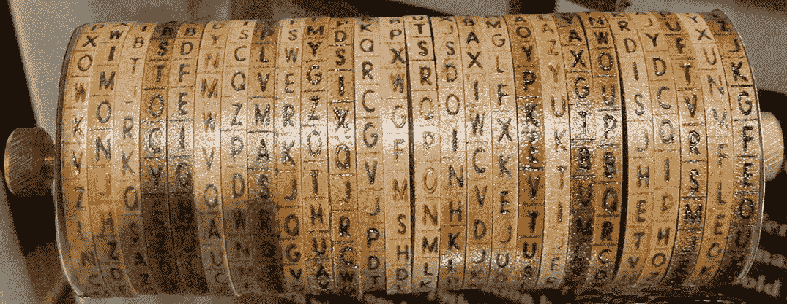

# 8 杰弗逊轮塞弗

本章涵盖

*   托马斯·杰斐逊的转轮密码
*   用已知单词解车轮密码
*   在不认识字的情况下解车轮密码

托马斯·杰弗逊在 1790 年到 1793 年间的某个时候发明了杰弗逊转轮密码 T2，当时他是乔治·华盛顿的国务卿。该装置由一根直径 1/8 至 1/4 英寸、长 6 至 8 英寸的铁棒或心轴组成，带有 36 个直径约 2 英寸、厚 1/6 英寸的木制圆盘。每个圆盘的中心都钻有一个与杆一样大小的孔，这样所有的圆盘都可以紧贴在杆上，形成一个木制的圆柱体。圆盘的平面相互接触，外部圆形边缘可见。杆的一端有一个头，像一个钉子头。另一端有螺纹，这样螺母就可以拧到杆上，牢牢地固定住圆盘。

圆盘平面上的数字是从 1 到 36。圆形外边缘被分成 26 个相等的部分。字母表的 26 个字母以某种混乱的顺序被写入或切割成这 26 个部分，这对于每个盘来说是不同的。磁盘在主轴上的顺序是密码的关键，现在称为*多路密码* 。

马里兰州米德堡的国家密码博物馆展示了一个 26 盘杰弗逊赛弗轮盘的复制品。(图片由 Daderot 根据 Creative Commons CC0 1.0 许可提供。)

首先将磁盘按密钥指定的顺序放在主轴上，用该设备对信息进行加密。螺母拧得很松，这样就可以转动各个圆盘。在第一个圆盘上找到信息的第一个字母，然后转动第二个圆盘，使信息的第二个字母紧挨着第一个字母。然后转动第三个圆盘，使信息的第三个字母紧挨着第二个字母，依此类推，直到信息的前 36 个字母排成偶数行。然后拧紧螺母，将它们固定到位。

转动圆柱体，还有另外 25 排字母，都是无意义的乱码。桑德拉可以选择其中任何一个作为密文。丽娃重复这个过程，在圆柱体的一行上建立密文。其他 25 行中的哪一行是想要的消息是显而易见的。

杰斐逊显然从未将这种密码投入使用。这个概念一直处于休眠状态，直到 19 世纪 90 年代初被 tienne Bazeries 重新发明。它于 1901 年被法国人采用。Bazeries 的版本有两处改进。它有一个支架或支架，因此该设备可以放在桌子上进行双手操作，它有一个指南，可以帮助用户均匀地排列字母，并选择读取密文的行。这种使用 25 个铝盘的密码版本由帕克·希特上校于 1914 年发明，1922 年被美国陆军采用为 M-94 ，1926 年被美国海军采用为 CSP-488 。Hitt 的版本只有 4.25 英寸长，小到足以放在口袋里，并且在磁盘的平面上有凹槽和尖头，防止它们在对齐后滑动。

这是一张来自国家密码博物馆的 CSP-488 的照片。

Hitt 于 1916 年发明了一种平面型密码，并于 1935 年被军队采用为 M-138。这个版本是一个有 25 个通道的扁平铝板，上面有纸条，可以前后滑动来模拟磁盘的转动。每张纸条都有两份混乱的字母表。这种装置更安全，因为纸条可以很容易地更换，如果需要，甚至可以在现场手写。这很快被海军的 M138A 或 CSP-845 取代，它有 30 个纸条的插槽。该设备提供了 100 条试纸，由两位数字指定，因此任何信息都会使用 100 条试纸中的 30 条。这允许 100 个！/70!= 7.79×10 57 可能的按键。

M-138A 的中间有一个铰链，可以折叠起来，便于携带。每一半都有一个单独的导向装置，用来排列纸条，读出密码的 15 个字母。这些改进大大加强了密码。

这些条形密码在 1942 年或 1943 年左右被陆军丢弃，但它们仍然被海军用作备用，以防断电导致无法使用任何电子或机电密码装置。

如果艾米丽没有该装置的副本并且不知道字母表，则破解多重密码 T2 是不可行的。如果艾米丽拥有这个装置，如果她知道一些可能的单词，这个密码相对容易破解。当 Emily 拥有该设备的副本并知道一些可能的单词时，Jefferson Cypher Wheel 被评为 4 到 5 级。当没有已知的可能单词时，等级是 6 到 7。艾米莉的密文越多，等级越低。相反，如果设备有很多额外的磁盘，则评级会上升。例如，如果用户从 100 个盘的供应中选择 30 个盘，则评级可以达到 8。对于非常短的消息，少于两倍的磁盘数量，解决方案可能是不可能的，除非 Emily 使用相同的密钥拦截多个消息。如果发送方每天只更改一次磁盘顺序，就可能会发生这种情况。

## 8.1 已知单词解决方案

当你有足够的文本，并且你知道至少一部分信息时，你可以解开一条用杰弗逊密码轮加密的信息。通常，只要一个已知单词就足够了。假设你知道桑德拉正在使用有 25 个磁盘的 M-94 设备，你截获了一条消息:

假设你也知道明文信息开始是紧急的。这已经转化为密文 **CLPOXF** 。由于 URGENT 在一行而 **CLPOXF** 在另一行，相应字母对之间的距离必须相同。我们先把急行 1 的行叫做急行，假设急行 **CLPOXF** 的行是急行 8。明文的第一个字母 U 和密文的第一个字母 C 取自第一个磁盘的第 1 行和第 8 行。所以，在第一个圆盘上，从 U 到 C 的距离一定是 7。在第二个圆盘上，从 R 到 L 的距离一定是 7。在第三个圆盘上，G 到 P 的距离一定是 7，E 到 O，N 到 X，T 到 f 的距离也是 7。

最简单的搜索方法是从 1 到 25 依次尝试每个可能的距离。从距离 1 开始。找出从 U 到 C 的距离为 1 的所有圆盘。换句话说，U 后面的下一个字母是 c，如果没有这样的圆盘，那么你知道距离不是 1。然后找出从 R 到 L 的距离为 1 的所有圆盘。同样，如果没有，距离不能是 1。

让我们假设你已经找到了 12 组字母对的距离都是 1 的圆盘。您现在需要测试这 12 组数据，看看是否有正确的。假设第一组圆盘是 18-4-21-9-13-11。从密文的第二块开始测试，字母 26 到 50。这个街区从 T2T4【ESI wvi】开始。将磁盘 18 设置为字母 **E** ，磁盘 4 设置为字母 **S** ，磁盘 21 设置为字母 **I** ，以此类推。现在看看其他 25 行。如果都是胡言乱语，像 **HNSAEI** 或者 **TFPGUW** ，那么你就知道 18-4-21-9-13-11 不是正确的盘面顺序。另一方面，如果您看到一些看似合理的文本，如 NCONDI，它可能是单词 UNCONDITIONAL 的一部分，那么 18-4-21-9-13-11 可能是正确的磁盘顺序。再次使用从 **GAFOEM** 开始的密文的第三个块进行测试。如果第三和第四个块都导致合理的文本段，那么 18-4-21-9-13-11 可能是正确的...但是继续搜索，因为您可能会找到更好的磁盘序列。

如果你看不到任何可能的文本片段，那么试试其他 11 个磁盘序列。如果这些都不起作用，尝试距离 2，然后距离 3，...通过距离 25。可能会有数百种磁盘顺序和距离的组合需要测试。这很繁琐，但手工操作仍然可行。如果没有效果，返回去寻找 3 次测试中有 2 次给出可信文本的磁盘序列。

一旦你确定了前 6 个圆盘最可能的顺序，以及相应的距离，然后你试着把它扩展到第 7 个圆盘。对于每一个选择的磁盘，你已经知道从明文到密文的距离，所以扩展过程相当快。

## *8.2 纯密文解决方案

在没有已知单词的情况下，也可以解开多重密码。这被称为纯密文解决方案。我是第一个找到这种解决方案的人(“解密多重密码的计算机方法”) *Cryptologia* 2 期(1978 年 4 月)，第 152-160 页)。在 1978 年的原始论文中，我使用了二元模型频率，并逐步发展为三元模型。今天的计算机速度更快，存储容量更大，所以我们可以跳过 bigram 这一步。该方法假设您有一个表格，用英语给出了每个可能三元模型的概率。你可以自己编一个这样的表，或者从网上下载一个三元模型表。这是这个方法的要点。

让我们像以前一样假设 Emily 正在使用具有 25 个密码字母的 M-94 设备，并且我们已经截获了至少 3 个块或 75 个字母的消息。我们所知道的信息是用英语写的。例如，假设我们截获了

从尝试前 3 个磁盘的所有可能选项开始。这样的选择有 25×24×23 = 13800 个。对于每个选项，将磁盘设置为密文每个块的前 3 个字母，即 **CLP** 、 **ESI** 和 **GAF** 。对于这些三元模型中的每一个，查看其他 25 行。这些行包含对应于密文三元组的可能的明文三元组。由于 3 行中的每一行有 25 个选择，所以可能性的总数是 13800×25 3 = 215，625，000。这可以由台式计算机，甚至笔记本电脑轻松处理。

对于 3 个磁盘和 3 行的每个组合，该组合的概率是 3 个明文三元模型的概率的乘积。等价地，概率的对数是 3 个三元组概率的对数之和。这个想法是只保留最有可能的组合，丢弃其余的。例如，您可以只保留前 1%，或者您可以保留固定数量的好组合，也许是 100 万个最佳组合。假设你选择保留前 200 万。

一种方法是生成所有的 215，625，000 个组合，然后根据概率对它们进行排序，并扔掉最差的 99%。那会占用很多存储空间。有更好的方法来做到这一点。首先分配一个比您想要的组合数大 10%到 25%的表，比如说 2500000 个组合。开始生成组合并将它们放入表中。当表变满时，它需要被削减大约 20% 。

这可以通过对表格进行排序并删除底部的 20%来完成。也就是说，您按照递减概率排序，然后将表条目的数量设置为 2，000，000。对 2，500，000 项进行排序比对 215，625，000 项进行排序要快得多，但还有更快的方法。从表中随机选择 10 个项目。(如果你不知道如何随机选择，那么选择 1/11，2/11，...，10/11 的路程。)从可能性最小到可能性最大对这 10 项进行排序。称这些排序后的项为 a，b，c，d，e，f，g，h，I，j 设 P 为项 b 的概率，删除表中概率小于 P 的每一项。

继续生成组合，但不要向表中添加任何概率为 P 或更小的项目。每次表填满时，重复采样、对样本进行排序和重置截止概率 p 的过程。

最后，你将会有大约 2，000，000 个 3 个圆盘和 3 行的组合。下一步是将其扩展到 4 个磁盘。为第四张磁盘尝试所有 22 种可能的选择。这将给你大约 44，000，000 个组合。现在看看由圆盘 2、3 和 4 形成的三元模型。对于每个组合，将盘 1、2、3 上三元模型的概率乘以盘 2、3、4 上三元模型的概率，以获得所有 4 个盘上四元模型的近似概率。将三个密文四边形****ESIW****【GAFO】**对应的明文四边形的概率相乘。**

 **这将给出 4 个圆盘和 3 行的 44，000，000 种组合的概率。还是那句话，你可以保留最好的 1%给你 44 万套四方图。使用与三元模型相同的方法。

继续这样做，得到五角星形、六边形、七边形等等。每次添加磁盘时，您可以保留的组合数量会比前一次少。当你降到 100 以下时，你可以通过视觉挑出正确的组合，然后手工完成解决方案。

可能导致此过程失败的一个问题是:即使在普通文本中，三元模型也可能出现在您的三元模型表中，其概率为 0。如果 Emily 使用空值，这可能会经常发生。这可能会导致合法的明文被拒绝。

一个解决方案是改变三元模型的概率，这样 0 概率永远不会发生。让我们用 P(x)来表示一个字符串 X 的概率。如果一个三元组，比如说 XYZ 的概率是零，你可以用 P(X)P(YZ)和 P(XY)P(Z)中的较大者。我建议将这个除以 3，比如说，因为 XYZ 从未出现在你的三元组计数中。如果 XYZ 的概率仍然是 0，那么使用单个字母。比如设置 P(XYZ)为 P(X)P(Y)P(Z)/10 。

另一个不同的解决方案不是将概率相乘，而是使用一些其他函数来组合它们。例如，您可以将概率的平方和相加。这将强烈奖励常见的三元模型，而在很大程度上忽略罕见的三元模型。

如果所有这些都失败了，那么只需从密文中的不同起点再次尝试该过程。例如，从第五个盘开始。 ********