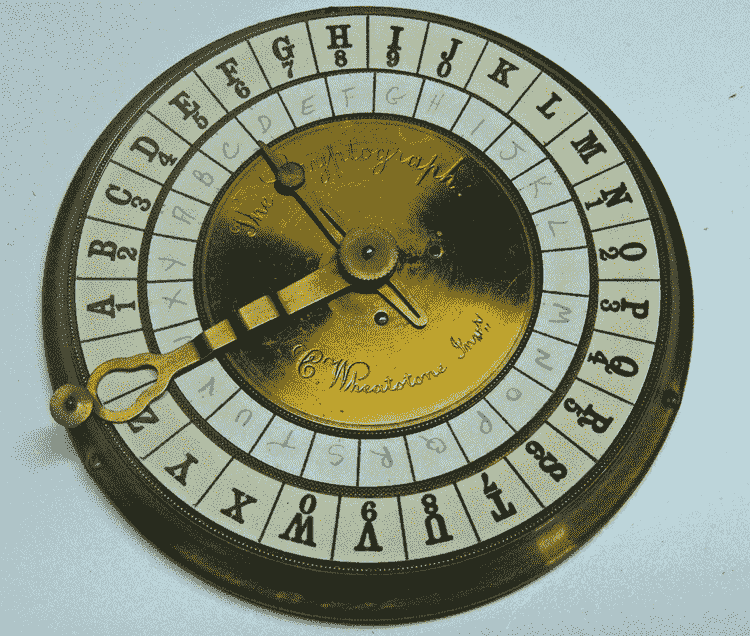
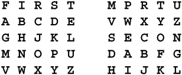

# 九、分段

本章涵盖

*   波利比乌斯广场
*   将一个字母拆分成更小的部分，如位或十六进制数字
*   混合和重组那些部分

密码学的前两个基本工具是替换和换位，这将在第 5 章到第 8 章中讨论。密码学的第三个基本要素是分段。这意味着将语言、字母、音节和单词的正常单位分解成更小的单位，并在这些单位上进行操作。较小的单位通常是位、十进制数字、十六进制数字或其他基数的数字。这一章包括使用基数为 2、3、5、6 和 16 的数字的小数部分，以及一些其他形式的小数部分。

## 9.1 波利比乌斯广场

可能是 将字母表示为更小单位的最古老的方法是*波利比乌斯方块*，我们在第 4.4 节看到过。在这里，每个字母由两个以 5 为基数的数字表示，有 25 种可能的 2 位数组合。(希腊人没有 0 的表示法，所以他们的数字从 1 开始。)

这是第 4.4 节中的波利比乌斯广场。每个字母用它在正方形中的*坐标*T3 表示，也就是用它的行号和列号表示。例如，字母 P 位于第 2 行第 5 列，因此表示为 25。为了清楚起见，这也可以写成 2，5。

一个波利比乌斯方块本身可以产生许多不同的密码。例如，它可以通过将消息中的每个字母替换为方块右侧的字母(U 变为 **V** )、下方的字母(U 变为 **Z** )、下方和右侧的字母(U 变为 **S** )或左侧的字母(U 变为 **P** )等等，来产生简单的替换。通过改变方向，例如右、左、下、右、左、下等，这种思想可以扩展到多字母密码。你也可以走两个字母远，或者像在国际象棋中一样使用骑士步。

一个波利比乌斯方块也可以用来产生一个*波利比乌斯波纹*密码 。从用坐标代替信息的每个字母开始，简单地写在一行中。从列表中的第二个数字开始，将前一个数字加到当前数字上。如果总和大于 5，则减去 5，使数字保持在 1 到 5 的范围内。然后再用波利比乌斯方块把这些数字变回字母。

波利比乌斯波纹密码被评为三级。可以通过使用不同的波利比乌斯方块将坐标转换回字母来增强密码。

让我们在第 9.2 节到第 9.7 节中看看 19 世纪基于波利比乌斯广场的几个手密码。我在 9.8 到 9.11 节中介绍了一些额外的手工方法。然后我在 一章的剩余部分讨论一些计算机方法。

## 9.2 游乐场

*游乐场*密码是查尔斯·惠斯通(读作 WHIT-stun)在 1854 年发明的。惠斯通是电气工程师中众所周知的惠斯通电桥的发明者，该电桥用于测量电阻。惠斯通和威廉·库克发明了针式电报机比塞缪尔·莫尔斯发明按键电报机早几年。在莫尔斯在美国开办电报公司的几年前，库克就在英国将针式电报商业化了。

惠斯通的密码被称为公平密码,因为是惠斯通的长相酷似的朋友莱昂·普莱费尔男爵(两人都有鲜红色的头发，身高约 5 英尺 2 英寸)倡导使用这种密码，并说服英国外交部使用这种密码进行外交通信。

抛开历史不谈

因为这种密码不叫惠斯通密码，所以惠斯通的名字可用于第二种密码，惠斯通大约在 1860 年发明，并在 1867 年的巴黎世界博览会上展出。惠斯通密码器 T3，看起来像一个大怀表，由两个由硬纸板制成的固定同心环和两个由简单发条装置连接的可移动时钟指针组成。内环是可擦除的，可以根据每条消息进行更改。这一环有 26 个字母的排列顺序，而外环有标准的 26 个字母的字母加上一个空格，有 27 个位置。你移动时钟长指针指示外环上的明文字母，短指针移动指示内环上的密文字母。当长时钟指针完成 27 个位置的一次旋转时，短指针也移动 27 个位置，这是 1 次完整的旋转加上 1 个额外的字母位置。所以短指针从每圈的不同点开始。1817 年，军械长德西乌斯沃兹沃斯上校根据托马斯·杰斐逊 1790 年制定的计划制造出了一种带有可移动环且没有指针的等效装置，但惠斯通的名字永远与这一概念联系在一起。

照片由拉尔夫·辛普森提供。碑文写着

“密码本。惠斯通 Inv r

play fair 密码以波利比乌斯方为基础，一次加密两个字母。也就是说，它加密二元模型。正方形可以通过使用第 5.2 节中的任何方法混合字母表来制备。省略了字母表中的一个低频字母，例如 J、Q 或 Z，以使字母表适合 5×5 的正方形。(在法语中，J、Q 和 Z 是常见的，所以省略 w。在德语中，省略 Q、X 或 y。)当被省略的字母出现在消息中时，会选择一些其他字母来替换它。在我们的例子中，每个 J 由一个 **I** 代替。

下一步是将信息分成二元模型，例如 ME ET ME TO MO RR OW。如果一个二元模型是一个双字母，那么它应该被分开，通常是在中间插入一个 X。(这是一个不把 X 从方块中省略的很好的理由。)此外，如果消息包含奇数个字母，则会在末尾添加一个 X。这条信息变成了“让我去 WX”。现在我们准备加密它。

Playfair 有 3 个规则:(1)如果两个字母在同一行，每个字母都被它右边的字母代替；(2)如果字母在同一列中，则每个字母由它下面的字母代替；(3)对于所有其他字母，每个字母都由同一行中的字母替换，但在二元组的另一个字母的列中。据了解，正方形是环绕的，所以在 9.1 节的正方形中，Y 右边的字母是 U，Q 下面的字母是 w。

这些规则可以用坐标来重述。假设我们要加密的二元模型是 r1c1 r2c2，这样第一个字母在 c1 列的 r1 行，第二个字母在 c2 列的 r2 行。现在这三条规则变成了

1.  如果 r1 = r2，则替换 r1，c1+1 r2，c2+1。

2.  如果 c1 = c2，则替换 r1+1，c1 r2+1，c2。

3.  否则代入 r1，c2 r2，c1。

让我们对发送到 WX 的示例消息 ME ME ME 进行加密，看看这些规则是如何工作的。第一个二元模型是我。m 和 E 在不同的行和不同的列，所以规则 3 适用。m 在第 2 行第 4 列，E 在第 3 行第 2 列。所以 M 被同一行的字母代替，即第 2 行，与字母 E 在同一列，即第 2 列。第 2 行第 2 列的字母是 S，所以 M 被替换为 **S** 。同样，E 被第 3 行第 4 列的字母代替，即 **C** 。

同理 ET 换成 **DO** ，第二 me 换成 **SC** 。字母 T 和 O 在同一行，所以规则 1 适用。它们被右边的字母所取代。t 被替换为**N**O 被替换为 **Q** 。所以到是用 **代替了** 。

莫遵循规则 3。取而代之的是 T2SR。r 和 X 在同一列，所以规则 2 适用。RX 换成 **XM** 。RO 和 WX 都使用规则 1，被替换为 **TQ** 和 **XY** 。整个消息就这样变成了**SC DO SC NQ SR XM TQ XY**，也就是重组后的**SCDOS CNQSR xmt qx Y**。

这里有一些图表可以帮助你想象二元模型 LY、to 和 RX 是如何被加密的。

至少在 1960 年之前，公平竞赛密码一直在军事和外交上使用。接下来，让我们简单看看一个公平游戏密码是如何被破解的。

### 9.2.1 求解一个公平密码

注意 每个字母只能由 5 个可能的替代字母加密，即该行的其他 4 个字母和紧接在它下面的字母。对于每个字母，网格中还有 24 个其他字母。其中，只有其自身列中的 4 个字母会导致该字母被其下方的字母替换。所以一个字母被下面这个字母代替的几率是 4/24，或者 1/6。因此，它被该行中的另一个字母替换的可能性是 5/6。

由于正方形中有 5 行和 9 个出现频率超过 5%的英文字母，因此一定有几行包含至少 2 个高频字母。如果这样的行少于 4 行，那么必须至少有一行有 3 个高频字母。这些行中的其他字母将比任何其他字母更频繁地出现在密文中。如果你有足够的密文，那么密文中 3 到 5 个最频繁出现的字母很有可能出现在正方形的同一行中。

如果我们移除包含这些字母的所有二元模型，剩余二元模型中最频繁出现的 3 到 5 个字母很可能在正方形的同一行上。知道 5 排中 2 排上的高频字母，就足以开始方块的重建了。下一步是尝试放置一些可能的单词。

公平竞赛密码被定为三级。有几种方法可以增强 Playfair 密码的强度。让我只提一个 几个。

### 9.2.2 强化公平密码

这里的 是公平竞赛密码的几种更强的变体。

NullfairT2 或者 no fairT4】

空值可以以重复的间隔添加到密文中，如下所示:

Nullfair 被评为五级。

游乐场+1

这种超级简单的增强将重复的二进制密钥添加到 Playfair 密文中。只要有 1 位，就使用字母表的下一个字母。如果二进制密钥的长度为奇数，则 Playfair+1 更强。

Playfair+1 被评为五级。Playfair+1 也可以用三进制数来完成。加法键中的数字很小，所以加法可以在头脑中完成，而不需要表格。

双重公平竞争

play fair 密码应用两次可以加强。在第二轮中，两人应该跨在第一轮中创建的二元模型上。(1)用公平密码对信息进行加密。(2)要么把第一个字母移到末尾，要么把最后一个字母移到开头，要么在两端加一个 null。(3)应用另一轮公平竞争。如果不同的混合字母表用于第二公平密码，这是最强的。双公平被定为 6 级。

游乐场的涟漪

这是 double Playfair 的一个变种，它只需要传递一次信息，并且只需要一个波利比乌斯广场。设明文为 P1P2P3P4...从左端开始，使用 Playfair 加密明文二元模型 P 1 P 2 ，产生密文二元模型 C 1 C 2 。然后加密 C 2 P 3 为第二二元组，得到 D 2 C 3 。注意 D 2 已经加密了两次。接下来你加密 C 3 P 4 ，得到 D 3 C 4 等等，每一步向右移动一个字符。Playfair ripple 被评为六级。

由于密文的第一个字母 C 1 和最后一个字母 C n 只加密过一次，你不妨把它们加密成一个二元模型来完成这个循环。

息肉会

使用两个不同的波利比乌斯方块，并使用重复键在它们之间交替。例如，11212 的密钥意味着在 5 个二元模型的每个周期中，第一、第二和第四个二元模型用平方 1 加密，而第三和第五个二元模型用平方 2 加密。这可以扩展到三个或更多方块，相应地需要更长的设置时间。使用两个方块和一个不超过 10 个数字的钥匙的多玩家被评为五级。如果密钥是由链式数字算法生成的，当数字为 0 到 4 时使用第一个方块，当数字为 5 到 9 时使用第二个方块，则等级增加到 6。(注:使用链式数字序列的奇偶性，周期短得多，所以弱得多。)

换位

明文用 Playfair 密码加密后，得到的密文可以被转置。转置可以像 7.2 节的列转置一样精细，也可以像 4.6.1 节的 Bazeries 型密码 的分段反转一样简单。有了柱状换位，游乐场被 评为七级。随着分段逆转，公平竞赛被分为五个等级 。

## 9.3 两个正方形

*两方*密码 ，有时也称为*双公平* ，是公平密码的改进版本。它是由法国业余密码学家 Félix-Marie Delastelle 发明的，并在他 1902 年的著作*traitélémentaire de cryptogie*中有所描述。顾名思义，它使用两个波利比乌斯方块而不是一个，这样就有两个混合字母而不是一个。这两个方块可以水平并排放置，也可以垂直自下而上放置。图示为横版。在本例中，使用关键字 FIRST 和 SECOND 混合了两个正方形，并省略了字母 Q 以适应 5×5 网格。

像游乐场 一样，信息一次加密两个字母。也就是两方加密二元模型。对二元模型进行加密，这样我们可以在左边的方块中找到 S，在右边的方块中找到 O。代替 S 的是与 S 同行、同列的右边方框中的字母，即 T5】TT7】。代替 O 的是与 O 同行同列的左方格中的字母，即 **K** 。这样二元组就变成了 **TK** 。

不像游乐场，没有必要拆散双字母。这两个字母可以在两个方块的不同行上。比如 SS 变成了 **MK** 。在大多数情况下，密文中的双字母不会对应于明文中的双字母。

下面是直观的替换过程。

两个正方形密码的一个重要弱点是，当一个二元模型的两个字母落在网格的同一行时，替代物只是那些颠倒的字母。比如，ST 会变成 **TS** 。这一弱点被称为*透明* ，有时会让整个单词泄露出去。例如，周日将变成 **US DN YA** 。

为了防止这种情况，我提出了这个*同行规则*:当两个字母在同一行时，它们被紧接在它们下面的字母替换，必要时绕到最上面一行。比如 ST 现在会变成 **DY** ，VI 会变成 **FP** 。

同排法则，两个正方形被评为四。把这种变异叫做*二方块 B*T5】。

德国人从字面上理解“双公平竞赛”这个名字。他们用两个正方形 密码加密每个二元模型，然后再用两个正方形加密那个二元模型。结果基本上是一个一般的二元模型替换(6.5 节)。

用于增强公平游戏密码的相同方法也可以用于增强两方密码，例如具有相同等级的*两方+1* 和*两方波纹* 。这里有一个额外的变体。

Playfair TwoSquare

两个正方形密码使用两个波利比乌斯正方形。这些方块中的任何一个都可以用作公平竞赛密码。这暗示了一种混合的方法，混合了公平竞赛和两方。同样，我们将使用一个数字键来控制每个连续的二元模型是如何加密的。1 表示使用左边方块中的 Playfair 加密二元模型，2 表示使用右边方块中的 Playfair 加密二元模型，3 表示使用两个方块或两个方块 B 加密二元模型。如果数字键包含每个数字中的至少一个，这是最好的。因为二方块比公平游戏更强大，所以 3 应该比 1 或 2 更经常出现。大约 50%是合适的。 *Playfair TwoSquare* 被评为 六。

## 9.4 三个 广场

*三方形* 是我自己的想法。否则，它没有什么特别的优点。我把它放在这里只是因为我在为这本书做研究时读过的一本书说，两个正方形不能扩展到两个以上的正方形。我喜欢挑战。

顾名思义，三个正方形采用三个波利比乌斯正方形。这些方块应该用独立的键很好地混合。三格一次加密 3 个字母，即加密八卦。这使得它比两个正方形更强。

基本的想法是每个字母都被它右边的方块中的一个字母代替。替换字母在同一行，但是在包含三元模型的下一个字母的列中。

假设我们希望加密三元模型。第一个字母是 T，第二个字母是 H，第三个字母是 E。我们使用第一个方块中的 T，第二个方块中的 H 和第三个方块中的 E 进行加密，就像这样。

T 的替代在包含 T 的那一行，在包含 H 的第二个方块的那一列，所以 T 被替换为 **V** 。H 的替代与第三个方块中的 E 在同一列的 H 在同一行，所以 H 被替换为 **R** 。E 的替代与包含 T 的第一个正方形的列中的 E 在同一行，因此 E 被替换为 **Z** 。这样一来，VRZ 的 **就变成了** 。

这可以形象地看如下:

解读的方向相反。由于密文三元组**的第一个字母来自第二个方块，我们从第二个方块开始解密，如下所示:**

 **

三个方块 比字母落在同一行的两个方块 问题更严重。在诸如 XYZ 的三元模型中，X 和 Y 可能落在同一行，Y 和 Z 可能落在同一行，或者 Z 和 X 可能落在同一行。这需要两条额外的规则来防止字母代表自身的透明。

*规则 1:* 如果三元组中的两个连续字母落在同一行，这两个字母中的第一个被加密为第二个字母右侧的字母，如果需要，则绕到左列。例如，在三元组子图中，S 在第一个方块的顶行，U 在第二个方块的顶行。因此 S 由 **V** 代替 **U** 。类似地，在三元组 LET 中，T 在第三个正方形的第三行，L 在第一个正方形的第三行。所以 T 换成了 **G** 而不是 **L** 。

这张图展示了规则 1。如果没有规则 1，三元组 SUB 中的 S 将被替换为**。取而代之的是中间方块中 U 右边的字母，即 **V** 。如果没有规则 1，三元模型中的 T 将由 **L** 代替。取而代之的是左边方块中 L 右边的字母。这从第 5 列绕到第 1 列，第 1 列有字母 **G** 。**

 **

*规则 2:* 如果三元模型中的三个字母都落在同一行，每个字母将被其下一个字母替换，如果需要的话，可以换行到最上面一行。于是，乐趣将被**取代，WRE 将被**取代。****

 ****用这些规则三个正方形 被评为五格。

【play fair threw】

三方块密码使用三个波利比乌斯方块。这些方块中的任何一个都可以用作公平竞赛密码。这暗示了一种混合的方法，混合了公平游戏和三个正方形密码。您可以使用一个数字键，如 1，4，1，3，4，2，4 来控制每个连续的二元或三元组是如何加密的。1 表示在第一个方块中使用 Playfair 将接下来的两个字母加密为二元模型。2 表示在第二个方块中使用公平游戏将接下来的两个字母加密为二元字符。3 表示在第三个方块中使用 Playfair 将接下来的两个字母加密为一个二元模型。4 表示使用三个正方形将接下来的 3 个字母加密为三元组。如果数字键包含每个数字中的至少一个，这是最好的。由于三方块比公平游戏强得多，数字 4 在数字键中应该比 1、2 或 3 出现得更频繁。大约 50%是合适的。也就是说，4 的出现频率应该与 1、2 和 3 的总和一样多。等价地，生成 1 到 6 的随机数，用 4、5 或 6 的三个平方。

由于 Playfair ThreeSquare 混合了二元模型和三元模型，大约一半的二元模型和三分之二的三元模型不会落在偶数边界上。这意味着力量的增加要大于公平竞赛广场 T3 的增加。公平竞赛三方形被评为七。

将 Playfair、两个正方形 和三个正方形组合成一个更复杂的密码是可能的，毫无疑问会更强大，但 Playfair 的三个正方形已经超越了人类编码员所能做到的极限。速度和准确性都会受到影响。

有一种相反的方法，我称之为横跨三个正方形的*。将明文分组为包含四个块的行，每个块包含 3 个字符。使用三方密码加密每个区块。现在取第一组的最后一个字母和第二组的第一个字母，用第一个波利比乌斯方的 Playfair 密码对二元模型加密。取块 2 的最后一个字母和块 3 的第一个字母，用 Playfair 密码和第二个波利比乌斯方对二元模型加密。取第三组的最后一个字母和第四组的第一个字母，用第三个波利比乌斯方对二元模型加密。这提高了三平方密码的强度，而没有增加太多的复杂性或时间。通篇使用同一行规则 。*

## 9.5 四方形

*四方形* 密码是由费利克斯-玛丽·德拉斯特勒大约在 1890 年发明的，并在他于 1902 年去世 3 个月后出版的著作*中有所描述。在四方密码之后，Delastelle 发明了两方 密码，作为一个简化的稍不安全的版本。然而，使用第 9.3 节中描述的相同行规则，两个密码可以被认为强度相等。*

顾名思义，四方 T3】密码利用了四个波利比乌斯方。其中两个方块包含标准字母表，另外两个方块包含使用独立键混合的字母表。消息一次加密两个字母，即四个正方形 加密二元模型。

这里是一个示例安排。

加密使用大家熟悉的 矩形方案。您在标准字母表中找到两个明文字母，并用矩形对角的字母替换它们，如下所示:

由于两个明文字母永远不会出现在 10×10 网格的同一行或同一列，因此不需要特殊的规则，也不需要分隔双字母。唯一需要空字符的地方是完成最后一个二元模型。四方形被评为五。

循环法

为了获得更多的力量，你可以使用一个简单的换位，类似于第 4.6.1 节中的分段反转。这种移调使用重复的数字键，如 1，3，1，4，2，6。将密文分成 7 个字符或任何其他奇数长度的块。在每个方块上写下连续的关键数字。然后循环每个块，向左移动关键数字指示的位置数。例如，如果关键数字是 4，您可以将最左边的 4 个数字移动到块的右端。这里有一个例子:

四格 采用循环法被评为六格。

减半法

加强四方 的另一种方法是事先调换信息。假设消息是威尔金斯大使今天暗杀了喀布尔。这有 39 个字母。39 除以 2，再向上取整得 20。将信息写为两行，每行 20 个字母，并读出垂直读取的二元模型。用四个正方形加密这些二元模型。

这些二元模型不再具有英语二元模型的正常二元模型频率或正常接触频率。四个正方形 用减半的方法被评为 七个。

## 9.6 双歧

让我们 再来看一个基于 5×5 波利比乌斯正方形的历史手密码。这是*双歧*密码，也是由费利克斯-玛丽·德拉斯特勒在 19 世纪 90 年代发明的。Bifid 是一种 3 步密码，其中(1)将字母转换成它们的波利比乌斯坐标，(2)重新排列这些坐标，以及(3)然后将坐标转换回字母。最初，Delastelle 在每个字母下面垂直写下整个信息，然后他组合成对的水平坐标，首先穿过顶行，然后穿过底行。

现代的方法是将信息分成固定大小的块。块大小应该是奇数，例如 5、7 或 9。如果块大小是偶数，那么 Emily 可以将块分成二元模型。

第一步是将字母转换成它们在波利比乌斯广场的坐标。假设块长度是 5。这 5 个明文字母可以表示为 X1、X2、X3、X4 和 X5。它们的行列坐标可以表示为 R1C1、R2C2、R3C3、R4C4 和 R5C5。这些 R 和 C 符号中的每一个都是从 1 到 5 的数字，首先是行坐标，其次是列坐标。这些坐标对垂直写在方块中每个字母的下面，就像这样:

然后按照 R1R2、R3R4、R5C1、C2C3、C4C5 的顺序读取它们。这里有一个例子。单词 MAJOR 是用一个波利比乌斯方块加密的，这个方块是用关键字 SAMPLE 混合而成的。

注意，密文中的第三组字母坐标， **R5C1** ，是行/列对。这意味着第三个密文字母将来自同一行， **R5** ，在波利比乌斯广场作为第五个明文字母，而来自同一列，**【C1】**，作为第一个明文字母。这种行坐标和列坐标的同时出现称为*自然* 。

由于正方形中每行有 5 个字母，每列有 5 个字母，因此第三个密文字母与第五个明文字母相同的概率为 1/5，第三个密文字母与第一个明文字母相同的概率为 1/5。即有 20%的几率 **R5C1** 与 **R5C5** 相同，有 20%的几率 **R5C1** 与 **R1C1** 相同。在这个例子中，这正是所发生的事情。第五个明文字母是 R，第三个密文字母也是 **R** 。

现在看第一封密文信， **R1R2** 。这是行/行对，不是行/列对。这里只有第一个坐标 **R1** 处于行/列对的正确位置。另一个坐标， **R2** ，是列位置的行坐标。这样的单个放置被称为*半自然*T15】。这意味着第一个密文字母与第一个明文字母来自波利比乌斯广场的同一行。所以第一个密文字母和第一个明文字母有 20%的几率相同。

第二、第四和第五个密文字母也会出现这种情况。它们中的每一个都与一个明文字母处于同一行或同一列。因此，它们中的每一个都有 20%的机会与那个明文字母相同。在这个例子中，第二个密文字母 **J** 与第三个明文字母相同。

这是 bifid 密码中的一个严重弱点，这使得 Emily 很容易猜测和放置可能的单词。另一方面，如果明文和密文字母不同，那么你知道它们在同一行或同一列。示例中，第一个明文字母 **R1C1** 为 M，第一个密文字母 **R1R2** 为 **S** 。这意味着 M 和 S 必须在波利比乌斯广场的同一行。当艾米丽推断或猜测一个单词时，它提供了几个这样的等价。这反过来使得放置附加单词变得更加容易。当积累了足够多的字母对时，艾米丽可以重建正方形。

由于这些弱点，双歧密码被评为三级。

### 9.6.1 共轭基质双歧

这些 的问题可以通过使用不同的波利比乌斯方块将坐标转换回字母来解决。例如，平方 2 产生密文 **VBJEF** 。

具有两个独立波利比乌斯正方形的双歧管被戏称为*共轭矩阵双歧管* 。在这种情况下，矩阵仅仅意味着字母或字符的矩形阵列。共轭矩阵双歧密码被评为五级。

有几种方法可以增强 bifid 密码的强度。一种方法是使用重复的数字键如 5、11、7 来改变块长度。块长度将是这个密钥的循环重复，即 5，11，7，5，11，7，5，...如果您愿意，可以通过使用链式数字生成器并将数字转换为奇数块长度来生成块长度。一种可能性是

所以，如果发生器产生了数字 3、6、2、7、...，那么块长度将是 11，7，9，9，...

使用一个短的重复密钥和共轭矩阵，该密码被评定为 6 级。使用长的重复密钥或使用随机数生成器生成块长度，密码的等级为 7。

类似的想法是从每个块中的不同点开始读出坐标。您可以使用数字键来指定起始点的顺序。如果块长度是 L，密钥中的每个数字可以是从 1 到 2L 的任何数字。从 1 到 L 的数字表示顶行坐标的起始位置，而从 L+1 到 2L 的数字表示底行坐标的起始位置，如下所示:

从左到右成对读取坐标。以下是使用数字键 4，9 读出坐标的顺序。起始位置 4 和 9 带有阴影。

这种方法将等级提高到 6 级。

加强双歧密码的另一种方法是使用更强的转置来混合坐标。使用长度为 L 的块的标准 bifid 获取 2L 坐标，并将其写入 2×L 块。坐标垂直写入块中，水平读出。我们认为这是一个非常简单的路线变换，如 7.1 节所述。在第七章中有几个更强的转位，特别是柱状转位。这种类型的密码的一个例子是由情报官员 Fritz Nebel 中尉发明并在第一次世界大战中被德国人使用的 *ADFGVX* 密码。在 ADFGVX 密码中，由字母 A、D、F、G、V、X 表示的坐标使用列转置混合，然后作为这些字母的字符串传输。这个密码被定为五级。

如果你使用更长的块，比如说 20 个字符，那么你将得到 40 个坐标。(使用这种方法，blo ck 长度可以是偶数也可以是奇数。)这足以用柱状换位有效地混合坐标。或者，你可以回到 Delastelle 最初的概念，将整个信息的坐标作为一个单独的块。无论哪种方式，使用共轭矩阵这个密码是八级。使用双柱换位 的密码是十级。假设四个长的独立密钥和混合良好的字母，这是一个不可破解的纸笔密码。称之为*双柱状双歧*。

## 9.7 对角分叉

一个 双歧密码的变体是把波利比乌斯坐标垂直写在每个字母下面，和往常一样，但要对角读出，从左下到右上(或西南到东北)。这被称为*左对角线* 或*对角线* 。(在纹章上，它被称为*条不祥的* ，表示非婚生育。)对于最后一个字母，您换行到第一列(阴影数字 1)。这样做的好处是，没有自然人或半自然人帮助艾米丽猜词。这里有一个例子。

对角分叉被评为四。对于共轭矩阵，它被评定为 5。对于共轭矩阵和周期性变化的嵌段大小，它被评定为 6。与传统的双歧不同，奇数和偶数块大小都可以使用对角线 双歧。

## 9.8 个 6×6 的正方形

如果您的信息包含大量数字，使用 6×6 的波利比乌斯正方形而不是 5×5 的正方形可能更有利。一个 6×6 的正方形允许你拥有完整的 26 个字母加上从 0 到 9 的数字。没有必要从字母表中省略 J 或 Q。如果你是手工加密，这需要特别注意区分字母 O、I、Z、S 和 G 与数字 0、1、2、5 和 6。有些人采用特殊的约定，比如在所有数字下面划线。我发现这既麻烦又容易出错。我通常只是夸大了区分这些字符的特征，比如用超宽的衬线写字母 I。

前 5 节中的所有方法，即公平竞赛、两个正方形 、三个正方形、四个正方形和两叉，都可以与 6×6 个正方形一起使用，以及它们的所有 变体。

## 9.9 三裂

如果你喜欢正方形，那么立方体怎么样？19 世纪 90 年代，费利克斯-玛丽·德拉斯泰勒发明了另一种分割方法，即*三裂*密码。不是字母表的每个字母都用 5 进制的两位数来表示(五进制数)，而是每个字母都用 3 进制的三位数来表示(三进制数)。这给出了 3×3×3，或 3 3 ，不同的 3 位数组合。这对于字母表的所有 26 个字母加上一个额外的字符来说足够了。Delastelle 对第 27 个字符使用了+加号。

额外的字符+可能被用作一种标点符号 ，或者它可能是一个信号，表示下面的明文字母应该被解释为一个数字。对应关系+A = 1，+B = 2，...，+J = 0。字母表的其余部分也可以用作特殊字符。例如，+K 表示句号，+L 表示逗号，依此类推。

正如 2 位数的组合可以显示为 5×5 个字母的正方形一样，3 位数的组合可以显示为 3×3×3 个字母的立方体。每个三元组中的 3 个数字可以解释为该字母所在的立方体中的坐标。这些坐标通常称为层、行和列。

这里是 27 个三元组合，按顺序排列，字母等价通过使用关键字示例和交替列进行弱混合。例如，字母 N 由三元组 102 表示，因此它将位于 3×3×3 字母立方体的第 1 层、第 0 行和第 2 列。

三裂密码 的工作原理与二裂密码相似。明文是以某种固定大小的块来写的。大小可以是不是 3 的倍数的任何数字。这 3 个数字垂直写在信息的每个字母下面，然后以 3 个为一组水平读出。然后使用相同的等价形式将它们转换回字母。下面是一个明文发送帮助和块大小为 4 的示例。

用于二裂的相同分析和技术也可用于三裂，它们具有相同的评级。您可以使用两个独立的替换表将字母转换为数字，并将数字转换回字母。您可以改变块的大小。你可以从每个区块的不同地方开始读出数字。您可以使用强换位来混合三进制数字。

一个自然的问题是，是否存在类似于对角分裂 的三裂密码 的对角版本。对角分叉相对于原始分叉的优势在于对角版本不会产生削弱原始版本的半自然。在类似的对角线三等分 中，每个组的中间数字将是三分之一自然数，因此优势丧失。然而，如果你使用两种不同的混合字母，一种用来写数字，另一种用来读出数字，自然的问题就消失了。有两个字母的对角线三等分被评为 五等分。

## 9.10 三个立方体

当 我正在键入前一段关于三裂密码的内容时，我意识到 3×3×3 的立方排列有助于 3 维模拟 9.3 节中描述的两个正方形 密码。在二维空间中很容易看到两个正方形的密码，但是在三维空间中很难看到一个立方体，所以我将只从坐标的角度来描述这个新的密码。我们姑且称这个密码*三立方*T11】。

两个方块使用两个替换表一次加密两个字母，因此三个方块使用三个替换表一次加密三个字母。这里有一组三个表格，使用了关键词哥伦比亚大学、斯坦福大学和霍普金斯大学。这三个替换表被指定为 S、T 和 U。S 代表替换，T 代表表格，U 代表字母表中的下一个字母。

替换表将字母表中的 26 个字母和字符+与 27 个三元组相对应。

像三裂体 一样，三立方从垂直写下每个字母的三位数开始。第一个字母的 3 个数字取自替换表 S，第二个字母的 3 个数字取自表 T，第三个字母的 3 个数字取自 u。此处显示了该模式，并通过三字苍蝇进行了说明。

然后数字从左到右读出，这些横排的三联体又转换回字母。使用表 S 来转换顶行，使用表 T 来转换中间行，使用表 U 来转换底行，这似乎是很自然的。然而，这将导致 1/9 的可能性，即顶行与左列相同，因此第一个明文字母将被它自己替换。也就是 9 中有 1 的几率 S1S2S3 和 S1T1U1 相同。中间和底部的行也是如此。姑且称这种情况为，其中一位数相同，一个*部分自然* 。

为此，替换表 S 用于第二行，表 T 用于第三行，表 U 用于顶行。这消除了自然。这是模式。

由于手工加密时很难保持直线，我建议在每个三位数字上写替换选择表。这类似于使用 Belaso 密码(第 5.5 节)时在每个明文字母上写密钥字母。这里有一个例子，三个立方体使用明文消息飞向罗马。

三立方 密码被评为七级。

有一种简单的方法可以增强三立方密码。不要像我们刚才那样使用三个严格轮换的替换表将三元组转换回字母，而是使用一个键来设置读出表的顺序。密钥将由字母 S、T 和 U 以某种混乱的顺序组成，例如 SUTUTTUUSTS。此密钥的长度不应是 3 的倍数。我把这个变种叫做*三个立方体加上* 。下面是如何使用这个读出的密钥对“飞往罗马”进行加密。

使用三个立方体加上大约 1/3 的字母会有部分自然。也就是说，3 个写入数字中的一个将与一个读出数字相同。但是，艾米丽不会知道哪些字母有这种缺陷，也就无法利用它。

三个立方体加上被评为九。

因此，你很可能会说，有没有可能在不使密码过于复杂的情况下将评分提高到 10 分？谢谢你的关心。首先，让我们将替换表的数量从 3 个增加到 6 个。让我们称它们为 S，T，U，V，W 和 x，而不是用严格的旋转来写三元组，斯图，斯图，斯图，...我们将使用另一个字母键，由这 6 个字母以某种混乱的顺序组成。写入键可以是 TWXUSTTVWV，读出键可以是 VWTXXSUSVTU。理想情况下，这些密钥的长度应该互为质数，并且都不能被 3 整除。这里的长度是 10 和 11。姑且称这个密码为*三立方超级*T5】。这是一个三立方超级利用明文飞到纽约 的例子。

三立方超被评为十。这是另一个 无法破解的手密码。

## 9.11 矩形网格

上升 到现在我们只讨论了正方形和立方体的字母数组。密码术中没有要求字母网格的所有维度都相同的限制。英文字母表有 26 个字母，基本上是历史偶然，26 非常接近 5×5。如果我们使用 33 个字母的俄罗斯字母表，我们可能会选择 4×8 或 5×7 的矩形。

如果我们想拥有字母表中所有的 26 个字母，那么一个 3×9 或 4×7 的矩形可能更好。这些给你完整的 26 个字母加上一个或两个额外的字符。我们之前已经讨论过这种额外字符的使用，例如在字母和数字之间切换。假设所有的矩形都朝向同一个方向，大多数基于波利比乌斯正方形的密码对 3×9 或 4×7 的矩形和对 5×5 的矩形一样有效。这些是公平游戏，两个正方形 ，三个正方形，四个正方形 ，以及对角双歧 密码。

事实上，这 5 个密码在与那些矩形一起使用时可能会更强大，因为字母表中的每个字母都有更多可能的替代物。当使用 Playfair 或 Two Square 时，不利的一面是两个字母在同一行的可能性更高，因此会被它们下面或右边的字母替换。

这是一个用 3×9 矩形做的公平密码的例子:

## 9.12 十六进制小数

所以 到目前为止这一章只关注手法。这意味着小数组只使用大写字母。对于计算机应用，你通常需要完整的字母，大写和小写，数字，标点符号，特殊符号，音调符号，也许还有多个字母。简而言之，你可能需要计算机的全文功能。最简单的方法是使用一种标准的计算机代码，如 UTF-8 或 UTF-16 ，用一个 8 位字节来表示每个字符。

分割 8 位字节的一种自然方法是将其分成两个 4 位十六进制数字，或十六进制数字。基于波利比乌斯正方形的所有分割方法也适用于 16×16 正方形，即 Playfair、两个正方形、三个正方形、四个正方形和两叉 。如果 16×16 的正方形使用大的密钥很好地混合，则这些方法比用于 5×5 正方形的相同方法更强。这是因为 256 个字符的排列远远多于 25 个字符，即 8.58×10 506 对 1.55×10 25 。

使用十六进制分段的一个简单方法是(1)通过使用混合良好的键控替换表将消息的字符转换成十六进制数字，(2)使用某种换位密码对这些数字进行加扰，然后(3)使用第二个混合良好的键控替换表将成对的十六进制数字转换回字节。

最简单的变换就是将第一个十六进制数字移动到最后，这样 12 34 56 78 就变成了 23 45 67 81。这或许可以叫做*轮回妖术* 。它本质上是在底座 16 而不是底座 5 中完成的对角分叉(第 9.7 节)。十六进制循环等级为五。您也可以使用第 4.6.1 节中描述的分段反转换位 来打乱字母顺序。这可能叫做*分段十六进制* 。它也被评为五级。一种更强的方法是使用列转置密码对十六进制数字进行加扰。这可以称为*柱状六角形* 。它被评定为七级。使用双柱换位时，额定值增加到 10。

这些方法可以用来加密任何计算机文件。然而，如果文件是纯文本，方法可以进一步增强。纯文本通常使用 256 个可能的字节值中不到 100 个。剩余的字符代码可用于空值、二元模型、三元模型以及第 6.4 节中描述的其他目的。如果做得好，这将提高评级为循环十六进制六，分段十六进制六，柱状十六进制 T3 八。

## 9.13 逐位分段

分割 也可以用代表信息中字符的单个位来完成。N 个字符的块将由 8N 位表示。这些可以以几种方式形成一个矩形，例如 2×4N、4×2N、8×N 和 N×8。例如，5 个字母的块将由 40 位表示，这可以写成 2 行 20 位、4 行 10 位、8 行 5 位或 5 行 8 位。这对于手工操作来说很麻烦，但用计算机很容易做到。

这里有一个例子，说明如何将 5 个字符水平写入一个 5×8 的块中，然后垂直读出。这个例子使用了标准的 UTF-8 字符编码。例如，大写字母 A 表示为 01000001。明文是单词 DELTA。

这些位按列依次读出。由于每列仅包含 5 位，密文的每个字节必须跨越两列或更多列。第一个密文字节的 8 位在第 1 列和第 2 列中找到，中间突出显示。第一列包含 00000，第二列的前 3 位是 111，因此密文的第一个字节是 00000111，即十六进制 07。这是控制字符铃，可追溯到电传时代，当时它用来引起回车铃响。它不再有图形表示了。我会用音符**来代表钟的性格。**

 **第二个密文字节来自跨越第 2、3 和 4 列的较暗的高亮部分。第 2 列的最后 2 位是 11，第 3 列包含 00000，第 4 列的第一位是 0。综合这些，第二个密文字节是 11000000。这代表了人物**à**，是大写的 **A** 带重音符。

密文的第 3、4 字节分别是**和 **x** ，即双引号和小写 x，第 5 字节来自第 7、8 列，即 000 和 01001。字节 00001001 代表**HTAB，或水平制表符，不可见。我用箭头**来表示。这样密文就是**à“x】**。******

 ****这看起来很神秘，但是这种方法很弱，因为它使用标准字母表来将明文转换成比特，以及将比特转换回字符。它被评为一级。如果这些步骤使用两个独立的混合键控字母，那么这个密码就是共轭矩阵双歧 T3 的二进制版本(9.6.1 节)。这种方法可以叫做*六角矩形* 。它与共轭矩阵双歧密码具有相同的评级，即五。

将八个 8 位字节组成一个 8×8 位的正方形是很自然的。使用混合字母表将每个字符的 8 位垂直写入正方形，并使用不同的混合字母表水平读出它们。这只是一个 8×8 正方形版本的六边形矩形，等级为 6。

### 9.13.1 循环 8×N

它 很容易提高这种密码的强度。对于任何 N 个字符的块，将其 8 位表示垂直写入 8×N 矩形。将每一行从 0 到 N-1 位位置循环左移一定量。例如， ab cdefgh 循环移位，或者*旋转* ，左移 2 个位置将得到 cdefgh ab 。然后垂直读出每个 8 位列。这是一个使用 8×8 位正方形的例子。每行向左循环其左侧指示的量。

这种密码是手工所能做到的极限。它需要 3 个键，即用于混合 2 个字母的 2 个键和用于指定偏移量的 8 位键。可以称之为*循环 8×N*T3。当 N 等于或大于 6 时，它被评定为 7。随着块大小 N 的增加，密码变得更强。

当矩形是正方形时，你可以旋转行和列，得到一个*双环 8×8* 密码。你应该为此改变方向。水平写入位，垂直循环位，水平循环位，垂直读出字符。双环 8×8 评级八。

循环 8×N 密码可以重复得到一个*双循环 8×N* 密码。这需要 5 个键，即混合 3 个字母的 3 个键，以及控制 2 轮移位的两个 8 位数的键。有 5 个步骤。(1)用第一个字母表做一个简单的替换。产生的 N 个字节垂直写入 8×N 位矩形。(2)使用第一移位键循环移位行。(3)用第二个字母表对 N 列进行简单的替换。(4)使用第二移位键循环移位行。(5)使用第三个字母对垂直列进行最后的简单替换。注意，所有的移位都是水平的，所有的替换都是垂直的。双循环 8×N 密码被评为九级。

如果需要，这可以延续到*三倍*、*四倍*甚至更高。所有这些变化都可以通过周期性地或使用随机 号 发生器改变块的大小来进一步增强。

## 9.14 其他分段

在第 9.12 和 9.13 节中，我们看到了将一个字节分成两个十六进制数字或八个单独的位。有许多其他划分 8 位的方法，例如 3，2，3。如果每个字符的 3，2，3 位表示垂直书写，然后 3 行循环左移一定数量的位置，则每列仍将具有 3，2，3 位分布，因此 8 位可以转换回字节。这里有一个例子。每行向左循环左边所示的位置数，即分别为 1 个位置、3 个位置和 2 个位置。

这里的明文隐退已经转化成了密文**@ w****θ****k _****【╝**。姑且称此为*位周期替换* 。这个方法被评为五级。像第 9.13.1 节中的循环 8×N 密码一样，这可以是两倍、三倍或更多，并且块大小可以变化。

这一基本理念可以通过两种强有力的方式得到强化。

首先，字节可以有几种不同的划分方式，比如 1，3，2，2 或者 2，4，2。例如，您可以首先使用 3，2，3 分割对块进行加密，然后使用 1，3，2，2 分割对其进行重新加密，然后使用 2，4，2 分割对其进行重新加密。这将涉及 7 个关键和 7 个步骤。(1)使用第一个替换产生消息的 3，2，3 比特表示。(2)使用第一个 Shift 键移动 3 行。(3)使用第二次替换产生字节的 1，3，2，2 位表示。(4)按第二个 Shift 键移动 4 行。(5)使用第三次替换来产生字节的 2，4，2 位表示。(6)按第三个 Shift 键移动 3 行。(7)使用第四次替换产生最终的密文字节。

第二，消息块可以用几种不同的方式划分。假设您使用 32 个字符的长明文块。对于前面技术中的步骤 2，您可以将 32 个字节分成 6、14 和 12 个字节的组。对于步骤 4，您可以将 32 个字节分成 11、8 和 13 个字节的组。对于步骤 6，您可以将 32 个字节分成 8、17 和 7 个字节的组。每一组将被独立转移。对于每个消息，这种划分可能是不同的。

或者，你可以采取更包容的方法。对于步骤 2，将整个消息划分为大小为 X 的块。对于步骤 4，将消息划分为大小为 Y 的块。对于步骤 6，将消息划分为大小为 Z 的块。X、Y 和 Z 可以是从 6 字节到整个消息长度的任何长度。

我不会评价所有的位周期替代 的变化。可以说，评级范围可能在 5 到 10 之间。在第 12 章中，我将描述如何验证一个分组密码真正值得 10 级。

## 9.15 更坚固的积木

本章中描述的几种加密算法都是针对明文块的。你可以对明文块做几件事，让你的密码对 Emily 来说更难一点。以下是一些想法:

*   周期性地或伪随机地改变块长度。

*   周期性地或随机地反转每个方块的前几个字母。

*   周期性地或伪随机地反转每个方块的最后几个字母。

*   周期性地或伪随机地向左或向右循环每个块。

*   将该块的最后 N 个字母与下一块的前 N 个字母交换。

但是有一个警告:如果你是手工加密和解密，请谨慎使用这些方法。如果你让你的密码如此复杂，以至于你不能准确地加密和解密，那么它就变得一文不值。**************