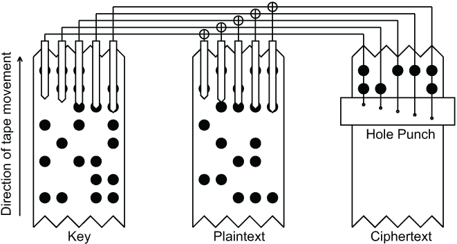

# 14一次性垫

本章涵盖

*   一次性密码本
*   近似一次性密码本的弗南密码
*   Diffie-Hellman密钥交换
*   构建Diffie-Hellman和公钥密码所需的大素数

最著名的流密码 是*一次性密码本*T5。许多作者将此术语限定为仅指明文和密钥流逐字节异或的密码。这是不符合历史的。第一个一次性密码本于1882年由加利福尼亚州萨克拉门托的银行家弗兰克·米勒发表，目的是通过缩短 电报信息来节省资金。米勒的电报代码使用5位数的代码组来表示商业电报中常见的单词和短语。为了保密，米勒提出了一种密码，在每个5位数的组中加入一个3位数。他的代码值足够小，以至于总和永远不会超过99999。也就是说，代码都小于99000。所以一次性pad本来就是十进制，不是二进制。

给一次性密码本命名的系统是由德国信号情报局的密码学家沃纳·昆泽在1922年左右设计的。昆泽的系统是基于一个标准的外交代码的五位数组。像米勒密码一样，昆泽密码在代码组中增加了密钥组。昆泽使用5位数的密钥组，这些密钥组被一位数一位数地添加到代码组中，而不用进位。因此，33333+56789将产生89012，而不是90122。昆泽把钥匙放在50张的垫子上，每张垫子包含8行6个钥匙组。这些便笺簿的页面被用于加密一条消息一次，然后被丢弃。因此得名一次性密码本。后来的发展包括使用水溶性墨水和水溶性纸进行快速处理。

另一个版本的一次性垫是由英国作家兼编剧(*偷窥狂*)利奥(Leopold Samuel)马克斯于1940年左右发明的。它被英国间谍广泛使用。马克斯的版本用字母代替数字。发送者将密钥字母加到模26的明文字母上，得到密文字母。换句话说，马克斯的一次性密码本是一个带有随机密钥的贝拉索密码。麻省理工学院教授Claude Shannon 在1940年至1945年的某个时候发明了同样的密码，苏联信息理论家Vladimir Kotelnikov 在1941年或之前发明了一个版本，但其细节仍然保密。Shannon和Kotelnikov都给出了一次性密码本不能被打破的数学证明。它仍然是唯一被证明无法破解的加密方法。

由于米勒1882年的一次性密码本和昆泽1922年的一次性密码本都使用十进制加法作为它们的组合函数，并且由于马克斯1940年的一次性密码本使用模26加法，任何人断言一次性密码本仅限于使用异或来组合密钥和明文都是不合理的。一次性密码本的定义特征是

1.  密钥至少与消息一样长，

2.  密钥与真正的随机密钥无法区分，

3.  密钥的每个字符或块与明文的一个字符或相等大小的块组合，并且

4.  该密钥只使用一次。

    任何满足这四个标准的密码都是一次性密码本。然而，为了证明一次性密码本不能被破坏，需要另一个更强的条件:

5.  任何给定的明文字符转换成任何给定的密文字符的概率是相等的。

说了这么多，让我们来看看一个历史密码，它基于异或运算，与一次性密码系统密切相关。

## 14.1弗南密码

到1918年 的时候，许多外交使团已经不再需要人工电报员发送和接收需要手写的信息。取而代之的是，1870年法国电报工程师émile Baudot发明的5列Baudot码(T5)或1901年新西兰记者Donald Murray 发明的Baudot-Murray码(T8)。(我不会涵盖这些代码的细节，因为它们在1870年到20世纪50年代之间改变了几次，当时西方联合银行停止使用它们。1963年后，当ASCII码取而代之时，波德风格的代码被完全抛弃。重要的特征是人工打字员将信息键入5列纸带上，由此信息可以直接传送并在接收端打印出来，而无需任何人工干预。

像莫尔斯电码一样，博多电码和博多-默里电码都不提供任何保密性。任何人都可以直接从磁带上读出信息。直到1918年，如果需要保密，信息在输入磁带之前必须由人工密码员手工加密，然后打印出来，由接收端的另一名密码员手工解密。需要一种方法来加速这一过程。进入Vernam 。

1918年，应陆军通信兵约瑟夫·奥·莫伯尼的要求，AT & T贝尔实验室的吉尔贝·桑德福德·维尔南发明了维尔南密码。这个想法简单而巧妙。人类打字员会像以前一样把信息键入磁带，但传输的是字符码与键码的异或运算。键码是由一个单独的纸带提供的，纸带上印有看似随机的字符序列。在接收端，传输的字符将与破译它们的磁带拷贝进行异或运算。每盘磁带有1000个随机字符，因此长消息每1000个字符重复一次密钥。

此图显示了包含明文和密钥的两盘磁带、用于读取磁带的拾音器、用于将密钥与明文进行异或运算的电路，以及位于接收端的打孔机，该打孔机可能位于远处。根据设置，打孔机可以由打印机或发射器代替。

这是我自己的图表，因为我找不到Vernam机器本身的图片，大概是因为它已经被分类了。

我称这些关键磁带为“随机的”,因为它们是由一个人在打字机式键盘上敲出来的，这是Friden Flexowriter的前身。结果是靠近键盘中心的字符比靠近角落的字符使用得更频繁。人类不擅长产生随机数或字符。但对于1918年来说，这是一个非常强大的密码。

许多资料来源错误地把弗南密码称为一次性密码本，可能是因为它是第一个用二进制密钥对二进制信息进行异或运算的密码。然而，弗南密码不是一次性密码本，因为它是重复的。它有1000个字符的固定周期。此外，一次性密码本是米勒在36年前发明的，最初是基于十进制的系统。

对于一个繁忙的大使馆来说，每天可能会有100条或更多的密码信息。如果大使馆与其他几个大使馆通信，就需要多套磁带。用于华盛顿到柏林的磁带将与用于柏林到华盛顿交通的磁带分开。这些带子都标有6位数的序列号。在每条消息发出之前，磁带号会以*明文*T3】传输，即不加密。办事员需要弄清楚哪些磁带是给哪个大使馆的，哪些磁带已经用过，需要销毁。新磁带必须源源不断地提供给每个大使馆。

弗南很快设计了第二个版本，使用了两盘磁带，都与明文进行异或运算。一个磁带有1000个字符，另一个磁带有999个字符，有效周期为999，000个字符。同样的两盘磁带可以使用一整天，只需在每盘磁带的不同点开始每条消息。比方说，如果一个大使馆有100条胶带，那么只要胶带还能用，就可以在不同的日子里使用不同的胶带组合。

很容易看出Vernam的2磁带机器如何扩展到3或4磁带。据我所知，这从未发生过，因为这些基于磁带的机器很快被转子机器 所取代(见第5.10节)。

## 14.2钥匙供应

一次性密码本的最大问题是提供足够的钥匙。纸带方法对于10个电台来说可能是足够的，每个电台每天发送100条信息，但是对于100个电台来说是不可行的，每个电台每天发送1000条信息。

许多关于密码学的书籍和论文描述了以下难题:桑德拉和丽娃决定使用一次性密码本交换信息。他们每个人都有一个长随机密钥的副本。他们一段一段地使用这把钥匙，直到用完为止。现在他们需要另一把随机钥匙。桑德拉可以选择它并发送给丽娃，但是它需要被加密，这样艾米丽就不能得到它。最安全的方法是使用一次一密来加密，所以他们需要另一个相同长度的密钥来加密新密钥。同样，桑德拉可以选择它并将其发送到丽娃，但该密钥也需要加密。所以他们需要另一把钥匙，无止境。

解决这一困境的方法是双管齐下的。首先，随机密钥流可以使用13.15节的技术进行刷新，例如滞后加法。例如，每天一次，或者每当各方决定时，可以从基础密钥中导出新的密钥。其次，这些派生的每日密钥不需要直接用作消息密钥。相反，消息密钥可以从每日密钥中构造。这样，即使Emily恢复了任何消息密钥，她也离恢复基本密钥还差两层。接下来的几节将描述一些产生消息密钥的方法。

每种方法被设计成满足两个目标:( 1a)该方法必须能够每天生成足够的消息密钥材料，使得没有两个消息密钥重叠，或者(1b)Emily检测消息密钥的重叠部分一定是不可行的，以及(2)Emily重建派生密钥或基本密钥的部分一定是不可行的。

### 14.2.1循环密钥

使用第13.14节的技术导出每日密钥。每日密钥的连续部分用于生成消息密钥，例如通过轻度加密。一个简单的键控替换就足够了。我建议在连续的键之间留一个随机宽度的间隙，可能是1到32个字节。当到达每日密钥的末尾时，它使用滞后线性加法的单遍循环(第13.14.1节)来扩展它，以便在消息量大的日子使用。您可以通过想象每次发送一条消息时，它的键加上任何间隙都从每日键的前面移动到每日键的结尾，然后使用滞后线性加法进行刷新来形象化地描述这一点。桑德拉和丽娃必须同步进行。

当桑德拉和丽娃几乎不可能同时向对方发送消息时，这种方法非常适用于低消息量。对于更高的消息量，最好使用两个基本密钥和两个日常密钥，一个用于桑德拉到丽娃的消息，另一个用于 丽娃到桑德拉。

### 14.2.2组合键

对于每条长度为 *L* 的消息，从每日键中取出长度为 *L* 的三段。把这几个段叫做x，y，z，在日调p x ，p y 和p z 中叫它们的起始位置。如果这些位置中的任何一个接近每日键的末尾，则该段可能会折回到开头。消息密钥的每个字节通过取x、y和z中相应字节的线性组合来形成。也就是说，

其中系数a、b和c可以是从1到255的任何奇数。对于每个消息，三个系数a、b和c以及三个起始位置p x ，p y 和p z 的值必须不同。这些可以事先商定，或者加密并随每条消息一起发送。

### 14.2.3选择键

对于长度为L的每个消息，从每日密钥中随机选择的位置中取出两个不重叠的片段。第一段是长度为l的*选择器*，s。第二段是长度为256的*股票* ，x。为了对消息中的第n个字符m n 进行加密，我们首先从选择器中取出相应的字节p = s n 。这个p选择在股票中取关键字节的位置，即k n = x p 。使用任何组合函数如**异或**或**相加**将密钥字节k n 与消息字节m n 组合。

使用密钥字节k n 后，x p 在股票中被替换为(ax p +b) mod 256。系数a和b必须满足赫尔-多贝尔条件(13.4节)，即a≡1(模4)和b≡1(模2)。实际上，股票x的256个位置中的每一个都成为一个独立的线性同余伪随机数发生器(PRNG )。对于股票的所有256个位置，系数a和b可以相同，也可以不同。一种选择是对a和b使用两对不同的值，并根据某种固定模式选择第一对或第二对。不管使用多少对值，它们对于不同的消息应该是不同的。

另一种更新股票的方案是将x p 替换为(axp+bxp-1)mod 256，其中a和b为1到255之间的任意奇数。您也可以选择将x p 替换为(axp+bxp-I)mod 256，其中I是2到255之间的任意整数。

由于a和b只有8192个可能的值，并且由于应该避免值a = 1，所以重复是不可避免的。然而，这不是问题，只要Emily不能辨别每条消息使用了哪一对值。重要的一点是，Emily不能累积她知道具有相同值a和b的多个消息。使用指示符的一个缺点是，对手可能会收集几个具有相同指示符的消息，因此他们知道那些消息具有相同的密钥。

## 14.3指标

在经典密码学中，同一个密钥经常被使用很长时间，有时长达数月或数年。在现代，密钥通常用于单一消息。使用一次性密码本，信息键只能使用一次。否则，Emily可以将一条消息滑动到另一条消息上，并使用重合指数(第5.7节)来检测重叠部分。

对于适度的双向消息流量，桑德拉和丽娃可以使用一个小本子，该本子将根据例如一天中的时间和一周中的日期来列出要使用的密钥。在计算机出现之前，通常的做法是给每条信息编号。消息号可以被加密并与消息一起发送。桑德拉和丽娃会用留言号码在书里查找答案。

当消息流量变得更高时，或者当有多方交换消息时，密钥簿变得不可用。即使这本书被一个计算机文件所取代，这一点仍然成立。解决这个问题的一个办法是使用指标。一个*指示符*是一条与消息一起发送的信息，接收者可以用它来确定密钥。

在早期，指示符只是密钥本身，隐藏在消息内部。例如，消息的第三组是密钥，或者前8组的第一个字符构成密钥。一个稍微复杂一点的版本可能是第二组的中间数字告诉你哪一组是关键。这类指示器的明显问题是，一旦Emily学会了这个系统，她就可以阅读所有的信息。即使Emily不知道该系统，她也可以简单地尝试消息中的所有组，看看其中是否有一个是关键。如果她找到几把这样的钥匙，也许就能推断出模式。

更安全的方法是加密密钥，并将其用作指示器。这就是德国人在第二次世界大战期间用他们的恩尼格玛机所做的。他们有一个特殊的设置，每天都在改变，用来加密消息密钥。他们首先将Enigma设置为每日设置，并用该设置对消息密钥加密两次。然后，他们会将机器重置为信息密钥，由操作员随机选择，并对信息进行加密。波兰人*Bomba*T5】利用这种双重加密的消息密钥来推导出那些密钥。(bomba kryptologiczna 是一种机电装置，由波兰首席密码学家Marian Rejewski 于1938年设计，用于破解德国的恩尼格玛密码信息。)德国人意识到这一点，就停止了这种做法，波兰人被黑了；他们再也看不懂英格玛密码了。艾伦·图灵预见到了这个问题，并设计了他的*炸弹*来处理cribs 或者可能的明文。法国的解谜机也被称为bombe，据说是以 *bombe glacée* 命名的，这是一种类似圆顶形状的冷冻甜点，就像烤阿拉斯加。

第14.2节描述了从每日密钥生成消息密钥的几种方法。这些方法中的每一种都使用一小组参数来生成每个消息关键字，例如滞后线性加法的系数，或者每日关键字中的位置。这些参数集非常适合用作指示器。

## 14.4 Diffie-Hellman密钥交换

所以 多为古典方法。再说一个更现代的方法。Diffie-Hellman密钥交换系统是由斯坦福大学教授Martin Hellman 和他的研究助理Bailey Whitfield Diffie 于1976年发明的，后者后来就职于Sun Microsystems。1974年，当时还是加州大学伯克利分校本科生的Ralph Merkle 发明了公开密钥加密的基本概念。

Diffie-Hellman密钥交换的本质特征是，即使艾米丽截获了他们交换的所有消息，桑德拉和丽娃也能建立安全的加密密钥。为了建立交换，桑德拉和丽娃必须就一个大素数P和该素数的本原根w达成一致。或者，Sandra可以简单地选择P和w，并将它们发送到丽娃。p和w可以明文发送。回想一下13.3节，找到原始根是很容易的。对于大多数素数，2、3、5或7中至少有一个是本原根。

桑德拉选择了一个秘密指数s，并计算出x = w s mod P。她将值x发送给丽娃，但对s的值保密。丽娃选择一个秘密指数r，并计算y = w r mod P。她将值y发送给桑德拉，但对自己保留r的值。现在桑德拉可以计算y s mod P，也就是w rs mod P，丽娃可以计算x r mod P，也就是w sr mod P，由于w rs = w sr ，桑德拉和丽娃已经计算出了相同的值，他们可以用这个值作为一个加密密钥，或者将这个值拆分成几个加密密钥。第13.3节描述了一种执行指数运算的有效方法。

一些作者(和维基百科)将Diffie-Hellman密钥交换描述为一种公钥方法。他们讨论将桑德拉和丽娃的公钥和他们的私钥结合起来。这不是真的。Diffie-Hellman中不涉及公钥。即使你认为指数r和s是密钥，它们都是秘密密钥。

假设艾米丽截获了桑德拉和丽娃之间的所有信息。那么艾米丽知道P，w，x，y，也就是w s mod P和w r mod P，但是不知道s，r或者w rs mod P，确定w rs mod P就叫做*迪菲-赫尔曼问题*。不知道这是否与确定r和s相同，但它们被认为是同样困难的问题。确定s和r，给定P，w，以及x或y中的一个，称为*离散对数问题* 。众所周知，这是一个非常困难的问题。当P、r和s足够大时，该问题被认为在计算上是不可行的。专家们对P必须有多大意见不一，但普遍的建议是300和600个十进制数字。一些实现允许P达到1234个十进制数字，即4096位。指数r和s可以小得多。专家建议的范围从40位小数到150位小数。

一种叫做*西尔弗-波利格-海尔曼*算法的算法，对于罗兰·西尔弗、斯蒂芬·波利格和马丁·海尔曼来说，可以轻松解决P-1只有小因子时的离散对数问题。该算法允许您分别求解每个小因子。因此，桑德拉必须确定P是一个*安全的*素数，这意味着P-1至少有一个大因子，比如q > 10 35 。理想情况下，桑德拉应该选择P为2Q+1形式的素数，其中Q也是素数。相应的质数Q被称为索菲·热尔曼质数，以法国数论家玛丽-索菲·热尔曼的名字命名，她也研究声学和弹性。如果Q-1和Q+1都有大的质因数，那就更强了。在下一节中，我们将显式地构造Q，使得Q-1有一个大的质因数。很有可能Q+1也有一个很大的质因数，仅仅是偶然，只是因为Q太大了。只有小因子的数称为*平滑数* 。随着数量的增加，它们变得非常罕见。

### *14.4.1构造大素数，旧

构造大素数的常规方法，你可以在很多网站上找到，从随机选择所需大小的奇数N开始，然后测试N是否是素数。首先你尝试几百个小质数。如果N能被其中任何一个整除，那么它就不是质数。重新选择。这个初步测试是值得的，因为它是如此之快。接下来，通过应用概率素性测试来测试N是否是素数。最常见的测试是加里·米勒和迈克尔·拉宾发明的*米勒-拉宾*测试。设N-1 = 2 h d，其中d为奇数。也就是2 h 是2的最大幂平均除以N-1。第一步，在2到N-2的范围内选择一个基数b，测试b d ≡1(mod N)。如果这是真的，那么N通过。如果没有，那就看是b2d≦-1(mod N)，还是b4d≦-1(mod N)等等。只要指数2 g d保持小于2 h d，就继续下去。如果你找到这样的值g，那么N通过测试，b被称为N的素性的*见证* 。如果没有找到这样的g，那么你肯定知道N不是素的，所以你必须为N重新开始一个新的值

如果N通过，还是有1/4的概率N是复合的。如果你想把N不是素数的概率降低到1/2128，你将需要64次米勒-拉宾测试，每次都有不同的基数b，不幸的是，这仍然不能保证。米勒-拉宾测试错误地将卡迈克尔数识别为质数。这些数字不是质数，但每个b都是质数的见证。它们是由伊利诺伊大学的罗伯特卡迈克尔在1910年发现的。前几个卡迈克尔数字是561，1105，1729，2465，2821，6601，8911，10585，15841，29341和41041。Carmichael数倾向于具有小的素数因子，因此通过64次Miller-Rabin测试，并且还发现N不能被前几百个素数中的任何一个整除，使得N极有可能是素数。

这是一个寻找特定大小的素数的好方法，但并不能保证N是安全的素数，而且比本节的方法要慢很多。如果S是你需要的素数的大小，你需要寻找一个素数的尝试次数大约是ln(S)。因此，对于一个500位数的素数，你需要大约ln(10个 500个或者大约1151次试验，每次试验需要64次米勒-拉宾测试和数百次试验划分。使用我在这一节介绍的方法可以节省你几个小时甚至几个星期的计算机时间，这取决于你使用的是哪种计算机以及 等于需要多大的素数。

### 14.4.2构造大素数，新

一种 寻找大质数的方法是从任意大整数N开始，然后尝试2N+1、2N+3、2N+5、...测试每一个直到你碰到一个质数。在此基础上的一个小改进是测试6N+1，6N+5，6N+7，6N+11，6N+13，...。这消除了测试中所有的2和3的倍数。也可以试试30N+1，30N+7，30N+11，30N+13，...以消除2、3和5的倍数，类似地，对于2×3×5×7 = 210，以此类推。

有多种方法可以检验一个给定的整数N是否是素数。最简单的方法是试除法。要测试N是否是素数，请尝试将N除以√N以内的每个素数，如果这些素数中的任何一个能整除N，那么N就是合数，否则N就是素数。试除法最多有用到大约N = 10 12 ，可能10 14 ，但是对于更大的N，试除法太费时。大多数其他的质数测试仅仅是概率测试，可以告诉你这个数字是*可能是*一个质数。

有一个测试可以肯定地告诉你一个数是质数:如果一个整数N > 1有一个本原根，它就是质数。回想一下13.3节，如果r N-1 mod N = 1，r(N-1)/pmod N≦1，则r是N的本原根，对于N-1的任意一个素数p。为了测试N的素性，你只需要计算r x mod N的值x = N-1和x = (N-1)/p的N-1的每个不同的素因子p。姑且称这种方法为*本原根素性测试* ，或简称*根测试* 。它是由法国数学家爱德华·卢卡斯在1876年发明的，同样是爱德华·卢卡斯创造了术语*斐波那契数*T19】(第3.4节)。卢卡斯于1891年死于一场悲惨的汤事故。

尝试2，3，5，7，11，13作为可能的原始根就足够了。如果N有任何本原根，很可能这6个值中至少有一个是本原根。如果这些值都不是原始根，就不要浪费时间去尝试其他值了。将注意力转移到下一个质数候选者会更有效率。

卢卡斯的根测试的问题是你需要分解N-1，如果N有300或更多的数字，那么分解N-1实际上是不可能的，至少在没有量子T2计算机的情况下。这也是为什么你在很多讨论素数测试的书或者网站上没有看到提到这个测试的原因。

有一种方法可以绕过这个障碍。请记住，你的目标不是找到一个测试素数的通用方法。您的目标是获得一个大素数作为Diffie-Hellman密钥交换的模数。因此，你可以用*构造*素数，而不是用*寻找*素数。

诀窍是选择N-1个已知因素。例如，您可以选择N-1的形式为2 n ，因此N的形式为2 n +1。N-1的唯一质因数是2。要找到2 n +1形式的素数，你只需要找到一个数b，使得b N-1 mod N = 1，b(N-1)/2mod N≦1。建议你试试b = 2，3，5，7，11，13。如果这些都不是本原根，那就跳过N = 2 n +1，看看N = 2 n+1 +1是不是素数。这一搜索将使你得到素数3，5，17，257和65537。虽然人们已经花费了数千小时的计算机时间来搜索，但还不知道是否还有其他人。这5个素数被称为费马素数以纪念法国数学家皮耶·德·费玛，他因对等式an+bn= cn的旁注而闻名。

概述

在我进入细节之前，让我概述一下构造一个大素数p的一般方法。该方法必须完成三件事:

1.  P-1必须有一个大的质因数，这样P是安全的，

2.  每个候选P都应该有很高的概率是质数，这样你就需要尽可能少地做质数测试，并且

3.  P-1应该有几个不同的素数因子，以便每个素数测试尽可能快。

任何对大素数的搜索都需要测试数百甚至数千个候选者。让我们称期望的测试次数为e。这里的方法是让P-1的每个候选数是两个数的乘积 cK。系数c将逐步通过一系列相对较小的数，通常与e相当。核K将是一个大素数，两个大素数的乘积，或者至多2个素数的幂的乘积，p a q b ，其中p和q中至少有一个是大素数。我们先来看看如何选择系数，然后再来看看如何选择 核。

系数

选择系数最简单的方法是一次一个地遍历素数。因为系数必须是偶数，所以每个素数用两次，2×2，2×3，2×5，2×7，...。姑且称这种方法为 *PickPrimes* 。PickPrimes最小化cK中不同素数因子的数量。c中最多有2个不同的素因子，k中最多有2个不同的素因子。然而，PickPrimes对减少所需的测试次数没有什么作用。

选择系数的第二种方法是使它们具有p a q b 或p a q b r c 或类似的形式。这里p、q和r是小素数，例如2、3和5，或者2、5和7。(在本节的后面，我们将看到必须省略3的情况。)这样，P永远不可能是2、3或5的倍数，这就大大增加了P成为质数的几率。如果使用这种方法，您可能希望预先计算并排序 系数列表。

内核

核K至少要有一个大质因数R，我建议R至少为2 128 ，约为3.4×10 38 。如果你的对手有量子计算机，让R至少2 256 = 1.16×10 77 。那么，你从哪里得到这些质数呢？如果你愿意满足于30位数的素数，你可以从bigprimes.org网上得到一些。

如果你希望生成许多大素数，或者非常大的素数，你可以自己生成。提前准备，建立一个不同大小的质数表。把这个表叫做PrimeTab 。一定要保存好PrimeTab，这样无论何时你需要更多的灌注，你都不必重复这个过程。你可以用100以下的25个素数开始你的素数表。你可能已经记住了，所以只要把它们输入到你的程序中就可以了。接下来，如果你愿意，你可以使用试除法生成一些3到12位数的素数，比如每个位数2到3个素数。我建议你随机地这样做，这样你就不会在每次使用这种方法的时候构造相同的素数(这样每个使用这种方法的读者就不会生成相同的素数)。在这个阶段PrimeTab可能有大约50个 素数。

构造R(小步法)

现在 让我们开始尝试构造Q-1的大质因数R。你可以通过寻找每个都比上一个素数大一点的素数，一小步一小步地增加到R，或者你可以一步到位。如果你希望生成很多大素数，那么就用小步骤构建，这样PrimeTab就会有很多条目供以后使用。为了说明这两种技术，让我们用小步骤构造R，然后用大步骤构造Q。

假设PrimeTab包含k个素数，p1T34】p2T35】p3T36】...< p k 。为了构造下一个素数，首先从表中选择任意两个素数，比如p i 和p j 。设r为乘积 p i p j 。如果r < p k ，你可能想要使用一个更大的I或j，这样你就不会产生太多的小素数。当然你需要一些小素数，所以我建议在pIpjT39】pkT26】2/3的时候选择一个较大的I或者j。首先用Lucas测试看看R = 2r+1是不是素数。这很容易，因为你知道R-1仅有的质因数是2，p i 和p j 。如果2r+1不是素数，试试4r+1，6r+1，10r+1，...使用PickPrimes方法选择系数。当数字开始超过20位数时，寻找一个素数可能需要对每个 素数进行50次或更多次的尝试。

减少测试次数

当 数字变得非常大时，在搜索本原根之前，你可以通过检查每个候选nr+1是否能被许多小素数整除来节省时间。例如，您可以验证nr+1不能被前100个素数中的任何一个整除。你可以通过提前计算前100个素数中的每一个的x i = r mod p i 来加快测试速度。然后，不是计算(nr+1) mod p i ，其中r可能有几百位，而是计算(nx i +1) mod p i ，其中x i 只有1到3位。也就是说，你只做一次试除法(r mod p i )，而不是对n的每个值做一次。让我们把这个方法叫做 *PrimeCheck* 。

素数检查之所以有效，是因为候选素数是按顺序选择的。你不能用寻找大素数的传统方法做到这一点，因为候选素数是随机选择的。对于这种方法来说，这使得用小素数进行试除法要快得多，而且因为它更快，你可以使用更多的小素数，比如说300而不是100，从而减少所需的试凑次数。

如前所述，如果2、3、5、7、11或13中没有一个是nr+1的本原根，则跳过该候选项并尝试n的下一个值，直到找到下一个素数。由于该方法对每个候选人仅使用6次测试，而传统方法使用64次测试，因此该方法快10倍以上。将你找到的每个素数添加到 素数表中。

构造P和Q(巨跃法)

假设 你的目标是找到一个300位数的苏菲·杰曼素数。继续增加素数Tab，直到它至少有一个大素数，比如R > 2 128 。现在你已经准备好用一个巨大的飞跃来产生你的300位数的质数了。首先选择所需尺寸的目标T，比如T = 10 300 。可以使P任意接近目标值，但是Diffie-Hellman密钥交换不需要这样。t将仅仅是期望的最小尺寸。

下一步是求Q，回想一下，Q必须满足三个要求:Q必须是素数，Q-1必须是大素数R的倍数，P = 2Q+1也必须是素数。求Q的策略是从某个种子数t开始，其质因数都是已知的，并尝试2t+1，4t+1，6t+1，10t+1，...使用PickPrimes。

警告如果让t是3的倍数，那么Q的形式就是3x+1。这使得P = 2Q+1 = 6x+3是3的倍数。让t是3的倍数意味着P永远不可能是质数。

既然T是P的最小值，Q约为P/2，那么T应该约为T/2。要构造T，从PrimeTab中最大的素数，即R开始，取R的小于T/2的最大幂，比如说R r 。举个例子，如果T是10 300 ，R大约是10 40 ，那么T/2大约是5×10 299 ，那么R就是7。这意味着R r 约为10 280 。从10 40 直接到10 280 是一个巨大的飞跃。这个R r 远小于5×10 299 ，所以设置t = R 7 S，这里S约为5×10 19 。当S < 10 12 时，可以用试除法求下一个大于S的素数，如果这是S’，那么t就是R7S’。当S > 10 12 时，你可以使S’成为一个来自PrimeTab的素数和一个你必须选择的小于10 12 的素数的乘积，或者你可以使S’成为一个素数的平方或立方。假设是后者。在本例中，S约为5×10 19 。这个的平方根大概是7，071，067，812。下一个更高的素数是U = 7,071,067,851。所以t会是R 7 U 2 。

现在你已经构造了t，并且知道了它的所有质因数，你可以开始搜索Q，测试2t+1，4t+1，6t+1，10t+1，...使用根测试。随机选择的数N有大约1/ln(N)是素数的概率。当N约为10 300 时，ln(N)约为690。这意味着要尝试690次才能找到nt+1形式的素数。P是素数也是必要的，这也有1/690左右的概率。这意味着需要大约690次 2 = 476100次尝试才能找到Q = nt+1和P = 2Q+1，这两个都是质数。那要做很多测试。

这些测试很耗时，所以任何减少测试次数的方法都是有价值的。在这种情况下，我们可以使用PrimeCheck的自然扩展。对于每个素数p i ，像之前一样计算x i = t mod p i 。对于n的每个值，检查nx i +1是否能被p i 整除以验证Q不是p i 的倍数，还要检查2(nx i +1)即2nx i +3是否能被p i 整除以验证P不是p i 的倍数。这样你就从x i 列表中得到double值。

秘密素数

对于 有些密码你可能需要使用一个秘密的质数，只有你自己和你的合法通信者知道。你仍然可以使用本节的方法来构造你的质数，但是，你需要确保任何对手都不能按照同样的步骤来发现你的质数。我推荐两个预防措施。(1)当初始化PrimeTab 时，不是2或3个3到12位数的素数，而是随机选择5到10个3到14位数的素数。在PrimeTab中瞄准至少100个初始素数。(2)使用小步骤方法构造P、Q和R，最好在最初的和素数之外使用至少100个附加步骤。

确切的尺寸

构造素数的大跳跃方法可以很容易地修改，以找到精确大小的素数。这里有一个例子。假设你需要一个10 300 到1.1×10 300 之间的素数。选择r略大于10 300 /2000000，即5×10 294 。使用PickPrimes，但是从1000000开始，即1000003，1000033，1000037，1000039，...。使用PrimeCheck减少测试次数。

在1，000，000到1，100，000之间大约有6700个素数，在10 300 到1.1×10 300 之间的每690个数中大约有1个是素数，所以几乎可以肯定你会找到所需大小的素数。这个概率很容易计算。在期望范围内的任何给定数字不是质数的几率是689/690。所有6700个被选中的数字都不是质数的几率是(689/690) 6700 ，或者. 00006。所以 成功 的几率是 99.994%。 ******