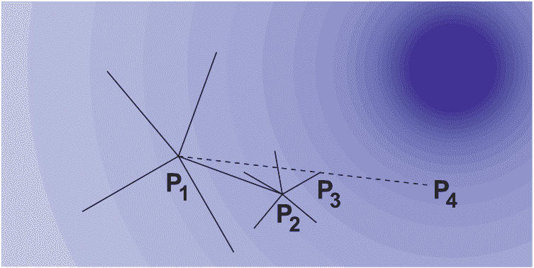
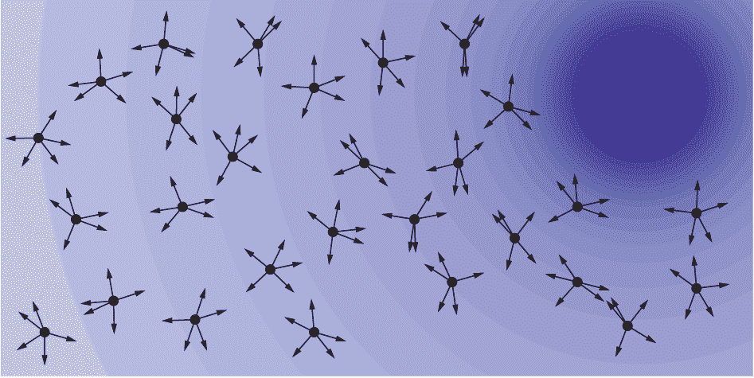

# 18 台量子计算机

本章涵盖

*   量子计算机的特性
*   利用量子计算机进行通信
*   使用量子计算机进行密钥交换
*   利用量子计算机解决最优化问题
*   用量子计算机解密分组密码
*   超级计算机，超越量子计算机的一步

当我写这本书的时候，量子计算机还处于起步阶段。整个世界上不超过 20 台量子计算机，其中没有一台包含超过 50 个量子位。我写这一章的时候就知道，甚至在这本书出版之前，它的大部分或者全部可能已经过时，或者被证明是错误的。量子力学和量子计算中使用的许多数学都超出了本书的范围，所以本章的部分内容将简单地提到量子方法和算法，而没有任何关于它们如何工作的解释。

量子计算的基础是*量子比特* ，或*量子比特*。一个量子比特有两个*基态* ，分别表示为 **|** 0 〉 和 **|** 1 〉 ，对应于传统计算机中一个普通比特的 0 和 1 状态。符号 **|** 1 〉 称为*胸罩*符号。当斜撑在左边时，像 0 |就叫 *bra* ，所以 0 |读作“bra-0。”当斜撑在右边时，称为*ket*T34】，因此 **|** 1 〉 读作“ket-1”这种符号是由诺贝尔奖获得者英国物理学家保罗·阿德里安·莫里斯·狄拉克发明的。

常规计算机中的一个普通位有一个确定的值，可能是 0，也可能是 1。该值只能是 0 或 1，不能是介于两者之间的值，不能同时有多个值，也不能有时是 0，有时是 1。物理设备，例如表面上的磁点，可以通过施加电流或磁场从一个值转换到另一个值。可以有短暂的转换，但是设备不能停留在任何类型的中间或混合状态。

## 18.1 叠加

与 相反，一个量子位在进行测量或观察之前没有值。此时，它的值将为 0 或 1。基态 **|** 0 〉 表示其值为 0 的概率为 1.0，基态 **|** 1 〉 表示其值为 1 的概率为 1.0。一般来说，量子位将处于两个基态αT18】|0〉+βT24】|1〉的*s*叠加*中，其中 α 和 β 是复数使得这个量子位在被测量时产生 0 的概率是| α | 2 ，这个量子位产生 1 的概率是| β | 2 。符号| α |表示 α 的*星等*。一个复数 a+bi 的大小是√(*a*2+*b*2)。因为测量的结果是随机的，所以对处于相同状态的两个量子位的测量可以给出不同的结果。任何数量的状态都可以叠加。*

当一个量子态 x 由几个量子位组成，比如说 x 1 ，x 2 ，x 3 时，态 x |表示为一个行向量 ( *x* ̅ 1 ， *x* ̅ 2 ，*x*̅3 如果复数 *α* 是 a+bi，那么它的复共轭*就是 a-bi。复共轭具有乘积*α**α̅*= a2+b2= |*α*|2的性质。相反，状态|y 〉 由列向量表示*

 *

由于本例中行向量是 1×3 矩阵，列向量是 3×1 矩阵，所以它们可以相乘。表示为 x | y〉的矩阵乘积是一个 1×1 矩阵，它的单个元素是内积*x̅*y，即〉x | y〉是一个标量。(如果对此不熟悉，可以回顾 11.3 节。)

由于任何两个状态可以叠加，而这些状态又可以叠加，因此任何量子位都可能是任意多个状态的叠加。

叠加的状态是脆弱的。微小的扰动，例如温度波动或机械振动，会导致量子位元脱离重叠状态，回到其中一个基本状态。这叫做*去粘着*T3。这种脆弱性是实现大型可靠量子计算机的主要障碍。特别是，当进行测量时，量子位将*去核心*并落入观察到的任何基态。同样地，量子位元也无法复制，因为那需要观察。

如果很难理解一个系数是一个复数的概念，这可能会有所帮助。在笛卡尔坐标中想象点(a，b)。从原点(0，0)到点(a，b)的线段是一个向量。它既有大小又有方向。当两个状态叠加时，这些向量按照坐标几何的规则相加，这正是复数相加的方式。这就是概率用复数表示的原因。向量相加后，系数必须重新缩放，使|α|2+|β|2= 1。如果用角度描述 α 和 β ，使用三角公式计算角度的和与差，则可以消除重新标度。

可以使用一些初等逻辑函数来操纵量子位，以形成量子电路。一个例子是条件非函数，CNOT，它对 2 比特量子位 **|** xy 〉 进行操作。CNOT 定义为:x = 0 时 **|** xy 〉 ，x = 1 时 **|** xy' 〉 。换句话说，第一位保持不变，第二位是两个 位的异或。

## 18.2 纠缠

除了 叠加，粒子还可以表现出第二种量子力学性质，叫做*纠缠* 。如果一个粒子的某些性质与其他粒子的相同性质之间存在关联，那么一组粒子被称为*纠缠*。比如电子有一个属性叫做*自旋* 。围绕特定轴(例如 x 轴)的自旋可以在粒子组中相关。或者，一组光子之间的偏振可能是纠缠的。即使粒子相距很远，这种纠缠也可能存在。这允许纠缠用于通信。

这个过程从制造一对纠缠的粒子开始。一种方法是让激光束穿过一种特殊类型的晶体。这导致一些高能光子分裂成两个低能光子。这些光子对中的一些将会纠缠在一起，尽管产量非常低，大约十亿分之一。下一步是将这些纠缠的光子带到桑德拉和丽娃将要发射和接收的任何地方。对于长距离，通常的方式是通过光纤电缆传输，尽管它们可以通过晶格中的空腔进行物理传输。

当桑德拉准备好发送她的信息时，她将她的光子与一些特别准备的辅助光子相互作用，这些辅助光子被称为*辅助光子* 。这种相互作用导致她的光子采取她希望传输的期望状态。这使得可能在数英里之外的丽娃纠缠光子呈现互补状态。过去人们认为这是瞬间发生的，但这种变化以光速传播。尽管一代又一代的科幻作家都在幻想，但信息不可能瞬间传递。

最后，丽娃测量她的纠缠光子，并确定 1 比特信息——或者不确定，因为这是一个概率过程。这有时被看了太多科幻小说长大的科学家称为*量子隐形传态*T4。这被认为是安全的，不会被窃听，因为如果艾米丽测量光子，它会散射，这可能被桑德拉和丽娃检测到。

这里有两个缺陷。(1)艾米丽可能不在乎她的窃听行为是否被察觉。只要她知道这些信息，桑德拉和丽娃是否知道她知道也没关系。(2)艾米丽的目标可能不是收集信息；她的目标可能是破坏通讯。艾米莉可能不会知道秘密作战计划，但丽娃也不会。事实上，如果桑德拉和丽娃发现艾米丽在偷听，他们可能会减少使用量子链路，这对艾米丽也有好处。

## 18.3 误差修正

由于量子事件是概率性的，量子计算机的错误率比常规计算机高得多。必须有一些检测和纠正错误的方法。在经典计算机中，有检错和纠错的码。这些代码使用额外的位来检测差异，例如通过给每个字节添加一个奇偶校验位来检测错误。奇偶校验位通常是 8 个数据位的异或。这意味着带有错误位的 9 位字节将总是具有偶数奇偶校验。如果奇偶性是奇数，这表明发生了一个错误，但它不告诉错误是什么。

传统计算机纠错码的最简单形式是三取二码。每个位有 3 个副本。如果出现单位错误，其中两个副本仍将具有正确的值。如果一个单位错误的几率是 1/107，那么使用这个公共值将错误的几率降低到 3/1014，这是一个巨大的进步。使用 3 位来表示每个数据位是昂贵的，但有几种类型的代码，如汉明码和卷积码使用较少的额外位，其中一些可以检测和纠正多位错误。在当前的加密技术中，无错通信是绝对必要的，即使改变一个比特也可能导致消息不可读。

这种类型的错误检测和错误纠正在量子计算机中是不可能的。这些代码依赖于复制位值和检查代码奇偶性的能力。这些都不能用量子位来完成，因为测量一个量子位的值会导致它被解码。提供量子纠错的努力通常依赖于使用额外的量子位。误差检测和校正量子位可以与数据量子位一起散布在被称为*表面码* 的平面晶格排列中。

到目前为止，量子纠错只是理论上的。还没有人制造出实用的装置。对额外纠错位的需求增加了实用量子计算机所需的量子位数量。由于量子错误率很高，实用的量子计算机可能还很遥远。当你在下面的章节中阅读各种量子算法的描述时，请记住这一点。

## 18.4 测量

测量光子的偏振是一件棘手的事情。想一想，你将如何测量一束光的偏振。你让光束通过一个极性过滤器，观察亮度。然后慢慢旋转滤镜，直到过滤后的光线达到最大亮度。此时，滤光器与光束的偏振方向一致，您可以测量角度。

然而，丽娃却没有这样的奢侈。她正在处理一个单光子。它通过她的过滤器或晶体，她要么检测到闪光，要么没有。如果她的过滤器没有与桑德拉的发射器对齐，那么她获得与桑德拉相同状态的几率取决于相对角度。例如，如果她的探测器与桑德拉的发射器成 90 度角，那么她有 50%的机会获得相同的量子位值。

这个问题的解决方案是桑德拉发送一个光子脉冲。丽娃可以对这些光子进行采样，让它们通过各种过滤器。她可以通过使用光传感器和电压表来测量每个样本的亮度，并计算出准确的偏振角。然后她在那个角度测量，很有可能得到和桑德拉一样的基态。使用量子计算机进行加密的能力可能最终取决于区分 T2 偏振微小变化的能力。

## 18.5 量子 3 阶段协议

这个 为*三阶段量子协议* 搭建了舞台，该协议由俄克拉荷马大学斯蒂尔沃特分校的 Subhash Kak 于 2006 年发明。Kak 的 3 阶段协议使用与第 16.1、16.2 和 16.4 节中讨论的其他三遍算法相同的 3 消息框架。在量子版本中，加密操作是围绕选定的空间轴以随机角度旋转偏振。桑德拉和丽娃必须在轴上达成一致，否则轮换将无法进行。(1)桑德拉发送旋转了她的随机角度 φ 的光子,( 2)丽娃旋转了她的秘密角度 ψ 并发回旋转了 φ + ψ 的光子，以及(3)桑德拉应用反向旋转- φ 并发回旋转了丽娃角度 ψ 的光子，丽娃移除该角度以读取量子位。如果艾米丽试图测量任何旋转的量子位，她无法知道她的探测器是否有正确的角度，因此也无法知道获得正确值的概率。

用这种方法，桑德拉和丽娃必须经常改变他们的角度，最好是每一点都要改变。否则，Emily 可以随机选择一个角度，尝试阅读每条消息。如果艾米丽的角度接近正确的角度，那么她会得到 80%甚至 90%的比特的正确值。这足以让她读到这条信息。运气好的话，她可以阅读大约 25%的信息。请注意，艾米丽的角度接近 180°也是有用的，因为这将给她 80%到 90%的 位的倒数。

## 18.6 量子密钥交换

量子密钥交换有几种算法，类似于 Diffie-Hellman 密钥交换。这些算法中最著名的是*BB84*T5，以其发明者 IBM 研究所的 Charles H. Bennett 和蒙特利尔大学的 Gilles Brassard 命名。该算法使用 4 个量子位来检测和校正通信信道中的噪声。由 Emily 引起的任何扰动都被简单地视为信道中的附加噪声，因此它们不需要进一步检测或校正。

这项工作的一个推论是，几个松散纠缠的粒子可能结合起来产生更少数量的紧密纠缠的 粒子。

## 18.7 格罗弗算法

*格罗弗的* *密码算法*是利用量子计算机破解 DES 和 AES 等密钥分组密码的算法。它是 1996 年由贝尔实验室的 Lov Kumar Grover 基于他的量子文件搜索算法开发的。它将加密函数的每次评估视为对未排序数据库的一次读取访问。该算法将预期的求值次数从 K 减少到√K，其中 K 是可能的键的数量。实际上，这将密钥大小从 n 比特减少到 n/2 比特。

Grover 的算法以很高的概率找到 E(k，p) = c 的密钥 k，其中 E 是加密函数，p 是明文，c 是密文。对于每个这样的密钥，该算法需要一个已知明文块。一个可能对密码学知之甚少的量子物理学家可能会得出结论，防御格罗弗的算法需要将所有密钥的大小加倍。这将是低效的，因为它需要额外的分组密码。比如 128 位密钥的 AES 使用 10 轮，256 位密钥的 AES 使用 14 轮。

一种更便宜的替代方案是通过在主加密之前和之后使用简单、快速的密码步骤(如简单替换)来增加密钥大小。混合两个简单替换字母的密钥每个可以高达 1684 位(第 5.2 节)，因为每个字母可以有 256 个！可能的安排，这是接近 2 1684 。一个简单的换位也可以帮助扩大密钥大小，但是从 16 开始方式更加有限！只有 2 44 左右。如果你选择使用转置，你可以一次转置 2 块，因为 32！大约是 2 个 118 个，显著增加了总钥匙尺寸。

本书的读者将会意识到 Grover 的算法也可以被一些简单的方法击败，比如使用 nulls 值，为每个块使用不同的密钥，链接块或者压缩消息。这意味着，在块加密之前使用混合霍夫曼 (第 4.2.1 节)这样的压缩密码可以在一个步骤中实现更大的密钥和压缩这两个目标。混合霍夫曼的缺点是它改变了块的大小。在块 密码前后使用霍夫曼替换(10.4 节)或后置替换(10.5 节)可能更明智。

## 18.8 方程式

在之前我们可以讨论下一个话题，量子模拟退火，我们需要讨论方程。许多密码可以表示为方程组。 Belaso 密码可表示为 C = P+K，其中 C 为密文，P 为明文，K 为密钥，均表示为模 26 的整数。希尔密码是一组线性方程组。像 Playfair 和 Two-Square 这样的密码可以表示为基数为 5 的等式。

### 18.8.1 转座

转置很容易表示为等式的集合。例如，柱状换位

可以表示为 c 1 = m 1 ，c 2 = m 4 ，c 3 = m 7 ，c 4 = m 2 ，c 5 = m 5 ，c 6 = m 3

*逻辑函数* 可以转换成这样的数值方程:

**不是** x → 1-x

x **或** y → x+y-xy

x **和** y → xy

x**【xorg】**y→x+y-2xy

### 替换

替换可以通过一个三步过程转换成方程式。首先，使用密钥位和明文位将每个密文位表示为布尔表达式。例如，考虑这种替换，使用 1 位密钥 K 和 2 位明文 AB 来产生 2 位密文 XY。

<colgroup class="calibre15"><col class="calibre16" span="1" width="25%"> <col class="calibre16" span="1" width="25%"> <col class="calibre16" span="1" width="25%"> <col class="calibre16" span="1" width="25%"></colgroup> 
| 

**K**

 | 

**AB**

 | 

**XY**

 | 

**布尔输入**

 |
| 0 | 00 | 01 |  |
| 0 | 01 | 11 |  |
| 0 | 10 | 00 |  |
| 0 | 11 | 01 |  |
| 1 | 00 | 10 |  |
| 1 | 01 | 00 |  |
| 1 | 10 | 10 |  |
| 1 | 11 | 11 |  |

这里***k̅a̅b̅***表示 K = 0，A = 0，B = 0，***【k̅a̅b***表示 K = 0，A = 0，B = 1，以此类推。密文比特 x 现在可以写成 x =***k̅a̅b***+***ka̅b̅***+***kab̅***+***kab；*** 。y 也有类似的表达。

### 18.8.3 卡诺图

*卡诺图* 用于减少或简化这些表达式。这是第二步。这个概念是贝尔实验室的莫里斯·卡诺在 1953 年发明的。这个想法是把所有可能的 n 位输入集合想象成一个 n 维空间，2×2×2×...×2.填充输出位为 1 的每个单元格。这是输出位 x 的空间，y 也有类似的映射。

注意这张地图中的列是如何标注的。当从一个单元格移动到下一个单元格时，从左到右，每一步只有一位发生变化，包括从第 4 列到第 1 列的环绕步骤。这种排列被称为*格雷码*T3。格雷码是贝尔实验室的弗兰克·格雷在 1947 年发明的。通过一次添加一位来构造格雷码是很容易的。例如，要将这种 2 位格雷码扩展为 3 位格雷码，首先您按顺序列出 4 个 a、b 对*****ab̅******ab*** ******C*** 位只改变两次，在第四个代码组之后和第八个代码组之后绕回开始。*****

 **卡诺图允许您通过观察多达 6 位(3 个水平位和 3 个垂直位)来优化逻辑，它使用 8 单元乘 8 单元图。6 位以上最好用程序来做。在每一步，你添加最大的矩形块，该矩形块适合填充区域，并且覆盖至少一个尚未被覆盖的新单元。这个块的每一维都必须是 2 的幂，所以它的体积也是 2 的幂。如果有几个最大尺寸的块，选择覆盖尚未覆盖的大部分单元的块。继续操作，直到覆盖所有填充的单元格。

在 k、a、b 例子中，填充区域中有两个 1×2 的块，分别是***ka***和***【kb̅】***。每个覆盖 2 个细胞。因为它们一起覆盖 3 个小区，所以两者都是需要的。这样就只剩下单元格**被覆盖了。所以，x 的简化表达式为***ka***+***【kb̅】***+***【kab̅***。**

 **将替换表示为一组等式的第三步是按照前面的规则，用算术表达式替换这些表达式中的**和**、**或**和**而不是**函数。

### 18.8.4 中间变量

如果试图将 AES 等复杂分组密码中的每个密文比特表示为单个表达式，则该表达式的大小将随着每一轮呈指数增长。这个问题有时被引用作为不能用方程式破解分组密码的原因。马羽毛。这个问题可以通过使用中间变量来消除。假设每一轮的输出是一组独立的变量。

第一轮的输入，密钥，明文和链向量，是*独立的* 变量。这些位中的任何一位都可以独立于其他位而改变。每一轮的输出，或者一轮中的每一级的输出，是*相关的*变量 。这包括下一个块的链向量。它们的值完全由自变量的值决定。不可能改变这些位中的一个而不改变其他一些变量。

### 18.8.5 已知明文

假设艾米丽有一定数量的已知明文。为简单起见，我们假设这是一个 n 位消息块。她的目标是使用已知的明文和截取的密文来确定密钥。假设 Emily 已经找到了每个密文比特的表达式，包括明文、密钥和可能的链向量。设 I 位的表达式为 E i ，c i 为密文的 I 位。对于任何给定的密钥 K，Emily 可以通过计算来测量使用密钥 K 对已知明文进行加密所产生的密文与截取的密文之间的差异

当找到正确的密钥时，D(K)将为 0。在这里，D(K)被称为*目标函数* ，或者简称为 *得分* 。

## 18.9 最小化

介绍 目标函数将寻找正确钥匙的问题转化为最小化问题。目的是最小化函数 D(K)的值。量子计算机之所以工作，是因为系统的量子态总是趋向于最低能量态。如果量子计算机可以被配置为使得量子位或量子位组代表变量值，并且系统的能量对应于目标函数值，那么最低能量状态将对应于目标函数值。如果这种配置能够实现，那么量子计算机将能够解决广泛的现实世界问题，包括密码破译。

首先，用实数替换密钥中的位。最终，这些数字必须是 0 或 1，但是在搜索过程中允许变量超出 0-1 的范围是有利的。从某个初始值开始，例如将所有位设置为 0.5，或 0-1 范围内的随机值，然后调整它们的值以降低 D(K)的值，尝试将其降低到 0。

传统计算机现在使用许多优化技术，但让我们只看三种。使用这些算法来寻找密钥将需要大量的已知明文。已知的明文至少应该是密钥大小的 3 倍。

### 18.9.1 爬山

**爬山* ，也叫*最速下降* 或*梯度法* ，是最古老的优化方法。想法是从某个点 P 1 开始，在随机方向上查看几个等距点。在这些点中，选择具有最大改善的点 P 2 ，在这种情况下具有最低的 D(K)值。然后通过查看 P 2 附近的随机点来细化方向。从 P 2 到这些点中任何一点的距离都将比从 P 1 到 P 2 的距离小得多。称此点为 P 3 。从 P 1 到 P 3 的直线定义搜索方向。最后，找出这条线上 D(K)最小的点 P 4 。使用 P 4 作为起始点重复搜索。随着搜索的进行，从 P i 到 P i+1 的步长在每次发现改进时增加，如果没有改进则减小。*

 *当搜索空间的形状像 n 维空间中的一座山，或被小得多的丘陵包围的一座大的中心山时，这种形式的搜索很有效。它在具有许多局部最优值的更复杂的地形中会严重失败。在这张图片中，颜色越深， 的分数越好。

### 18 . 9 . 2000 顶点

*Mille**Sommets*，或*千峰* ，是我在 20 世纪 70 年代参加的各种智力竞赛中用来获得获胜分数的一个想法。后来我开始为一些计算机杂志撰写这种搜索方法，但是我陷入了试图描述这种搜索方法比其他搜索方法更好的目标函数类型的困境。该方法在 20 世纪 90 年代被重新发现，命名为*粒子群*优化。

把搜索空间想象成一个有许多山峰、山谷和山脊的山脉。现在想象一下，一队飞机飞过这片地形，用降落伞投下数百名登山者。换句话说，有很多同时发生的起点。这些攀登者会观察附近的点，看看这些点是高了还是低了。有两种变体。(1)你可以只选择这些点中最好的一个，把攀登者移到那里。在这种情况下，如果没有一个点是更好的，你减少步长，再试一次。如果失败了，比如说，连续三次，那么你就让一个新的攀岩者从一个随机的地点开始。(2)你保留了几个表现出进步的点。你可以把这想象成登山队分成几个小组去尝试不同的路径。最好不要采用所有改进的解决方案，因为那会很快将所有的攀登者集中到少数几个区域。

我最初的想法是将所有的解保存在一个堆结构中，这样顶部的条目总是最差的解。你选择最差条目并努力改进它。这被证明是低效的，因为你花费了大量的精力去改进你最终丢弃的糟糕的解决方案。相反，总是选择最佳的解决方案会让所有的登山者集中在一个山峰上。最佳策略是随机选择下一个攀登者。同样，当一个解决方案产生几个改进的解决方案时，选择其中最好的并不总是有益的。有时候最好在几个改进的 方案中随机选择。

### 18.9.3 模拟退火

*模拟* *退火*是一种流行的优化技术，主要是因为它太容易实现了。你从搜索空间中的一个随机点开始，观察附近的一个点。如果那个解更好，那么你以概率 b 移动到那个点，如果那个解更差，那么你以概率 w 移动到那个点。

模拟退火的定义特征是你在搜索时改变概率。最初，你将拒绝一个好的解决方案或接受一个坏的解决方案的可能性设置得相当高。假设你拒绝 40%的较好方案，接受 30%的较差方案，那就是 B = .6，W = .3。然后一段时间后，比如说 1000 步后，你减少了拒绝一个好的解决方案的概率。也许在第二阶段，你拒绝了 20%的较好解决方案，接受了 15%的较差解决方案。再过一段时间，比如说再走 2000 步，你可能会开始只拒绝 10%的好方案，而接受 7%的差方案。

这一过程被称为模拟退火，因为它类似于冶金中的热退火过程，金属首先被加热到发光，然后非常缓慢地冷却。这改变了金属的晶体结构，降低了它的硬度，增加了它的延展性和可锻性，因此它更容易加工。在模拟退火中，拒绝更好的解决方案和接受更差的解决方案的高初始概率类似于金属的初始高温状态，这些概率的逐渐降低类似于金属的缓慢冷却。模拟退火的描述通常指的是几个阶段，其中概率步进为降低温度的*。*

 *让我从自己的模拟退火经验中分享一些技巧:

*   走得太慢不值得。拒绝 40%的改进解决方案，然后是 39%，然后是 38%，等等，都是浪费时间。在每个阶段，接受/拒绝率应该在前面的 1/2 到 2/3 之间。比如第一阶段 40%，然后 20%，10%，5%，3%。或者，从 40%开始，然后是 25%，15%，10%，6%，4%，最后是 2.5%。

*   五个阶段通常就足够了。

*   以 50%的录取率开始是浪费时间。从 60%到 75%之间开始。

*   去 0%是不值得的。如果最后一个阶段接受 2%到 3%的更差方案，你会得到更大的改善。

*   当什么都没发生时退出。你可能在每个阶段计划了 1000 次试验，但是如果你已经做了 100 次试验而没有任何变化，那就停下来。

*   使百分比取决于改进的大小。例如，在第一阶段，您可能接受 60%的将分数提高 1%的变更，75%的将分数提高 2%的变更，以及 90%的将分数提高 3%或更多的变更。

*   实验。每个优化问题都不一样。尝试改变阶段的数量、每个阶段的试验次数、改变概率的速率、步长以及改善程度和接受百分比之间的关系。

爬山、千锤百炼和模拟退火技术可以自由组合产生多种 混合 方法。

## 18.10 量子模拟退火

有 几种提出的使用量子计算机做模拟退火的方法。这些方法使用量子现象如叠加来并行执行许多搜索。然而，每次试验都需要在选定的点上评估目标函数。量子计算机不是用来计算表达式的。到目前为止，还没有通过量子手段并行评估这些函数的方法。量子计算机可以使用常规计算机来评估表达式，但这失去了并行性。到目前为止，量子搜索并没有显示出比传统计算机 搜索有任何速度上的提升。

## 18.11 量子因子分解

RSA 公钥密码系统的 优势在于分解大整数的难度。给定两个大整数 A 和 B，很容易将它们相乘得到 乘积 AB，但是很难反转这个过程并确定一个大整数的因子。因式分解一个大数和计算一个离散对数(16.3 节)有同样的难度，并且使用了许多相同的技巧。

Shor 分解大数的算法可能会破坏这种安全性。这是有史以来开发的第一个量子算法，由麻省理工学院的 Peter Shor 于 1994 年发明。如果该算法可以成功地实现大整数，要么 RSA 必须被放弃，要么模数必须大得多，也许是数百万位。到目前为止，使用 Shor 的算法，2001 年数字 15 被分解为 3 ×5，2012 年数字 21 被分解为 3×7。按照这种速度，我们可以预计 2023 年左右，数字 35 将被分解为 5×7。

撇开幽默不谈，绍尔的算法可能要过几十年才会对 RSA 的安全构成真正的威胁。

## 18.12 超级计算机

今天，计算机不是为评估表达式而制造的。但是让我们假设这仅仅是一个技术问题。假设假以时日，将会出现将超级计算机的计算能力与量子计算机的并行性相结合的混合计算机。让我们称这些*为超级计算机*。

桑德拉今天能做些什么来为艾米丽拥有一台超级电脑做准备呢？我们可以从击败格罗弗算法的方式中得到启示(18.6 节)。我们扩展了密钥的大小，使其超出了算法的能力。这也可以用超级计算机来完成。我们可以增加计算机需要处理的未知数的数量，超过你估计超级计算机可能拥有的任何能力。让我们来看两个方面，替换和随机数生成。

这些算法需要非常大的加密密钥。让我们简单地接受这样一个事实:在超级计算机存在的未来世界里，如此巨大的钥匙将是可管理的。

### 替代

如果 一个替换没有被某个数学规则定义，那么它可以被一个替换表定义。表中的每个条目都是 Sandra 已知的值，但 Emily 未知。在数学意义上，每个表项都可以被视为一个变量。最初，每个变量可以取任何值。如果 Emily 知道了这些值中的一些，其他变量的选择范围就变窄了，但是最初任何字符都可以替代其他任何字符。

桑德拉的目标是压倒超级计算机的能力。一个普通的多字母密码有一个 26×26 的表格供手写使用，但有一个 256×256 的表格供计算机使用。这提供了 2 个 T2 16 个 T3，或者 65，536 个未知值。但是，您没有理由将自己限制在表中的 256 行。如果艾米丽有一台超级计算机，那么桑德拉也应该有一台高速大内存的计算机是合理的。Sandra 可以使用 10 位键的 1024 行表，12 位键的 4096 行表，甚至 16 位键的 65，536 行表。这需要 2 24 = 16，777，216 字节的内存用于替换表，完全在当前个人计算机的能力范围内。另外，用 16 位密钥替换 8 位密钥提供了非常理想的冗余。让我们称 224-元素表 *Tab24* 。Tab24 的每一行都有自己的混合键。如果这个混合密钥有 256 位，那么整个 tableau 有 256×65536 = 16，777，216 个密钥位。

Sandra 使用完整的 bigram 表也是可行的。使用 8 位键选择一行(实际上是一层)的 256×256 bigram 表将需要 2 25 = 33，554，432 字节的内部存储。同样，这在今天也是可行的。如果 tableau 有 65，536 层和 16 位密钥，它将需要更大的计算机。

然而，请记住，这些替换表必须保密，而且必须是完全随机的。即使它们是由某种算法产生的，也绝对超出了艾米丽的超级计算机确定发生器初始状态和参数的能力。一些相关的 方法参见 13.13 节。

### 随机数

第 13.13 节的 方法是一个好的开始，但是为了产生一个经得起超级计算机检验的伪随机数发生器，我们将第 13.11 节的选择发生器的概念与第 13.15 节刷新发生器的技术结合起来。

*ultra generator*UG(发音为 HUGE-ee)使用三个数组，A、B 和 c。数组 A 和 B 各包含 65536 个 24 位整数。数组 C 包含 2 个 24 个，即 16，777，216 个 8 位整数条目。如第 13.14.2 节所述，可以从自然照片中初始化 3 个数组。桑德拉和丽娃必须有相同的数组。发生器在每个周期产生一个 8 位输出。循环 n 由以下步骤组成:

1.  计算 x =(An+An-103+An-1071)mod 16777216，用 x 代替 A n

2.  还原 x = x mod 65536，设置 y = B x 。

    UG 生成器在这个周期的输出是 C y 。

3.  将 B x 替换为(Bx+Bx-573+Bx-2604)mod 16777216。

4.  将 C 和替换为(C 和 +C 和-249 +C 和-16774 修改 256。

下标根据情况以模 65536 或模 16777216 换行。滞后 103、1071 没有什么特别的，..., 16774.我没有测试这些值是否会产生特别长的周期。有了如此庞大的种子阵列，即使是退化周期也会极其漫长。您可以使用第 13.1 节中的任何组合函数，如 **madd** ，或第 13.14.1 节中的滞后线性加法。

当你刷新这些随机数时，13.14 节的两种方法在你的对手有超级计算机的情况下并不充分，但可以组合起来做一个强大的刷新功能。每次刷新都需要一个新的随机数组 R，它包含 65，536 个或更多的 24 位整数。设 A、B、C、R 的长度为 L A ，L B ，L C ，L R 。

这里 a =⌊lc/lr⌋-1。符号⌊lc/lrt15】⌋，读作“lclr的楼层”，表示不超过 L C /L R 的最大整数。比如 ⌊ 8/3 ⌋ 是 2、 ⌊ 9/3 ⌋ 是 3。使用 C an 而不是 C n 的效果是将 R 的字节均匀分布在整个 C 数组中。

这两个步骤应该重复 3 次或更多次。和往常一样，下标换行。

对了，并没有要求 C 数组的大小必须是 2 的幂。例如，L C 可以是 77，777，777，在这种情况下，A、B 和 R 数组将需要包含以 7777777 为模的整数，并且在上面的计算中，模数 16777216 将由 77777777 代替。对 L C 大小的唯一限制是你希望使用的存储量和分发这样一个大密钥的可行性。

这两种技术，替换和随机数生成，可以结合起来制造任何数量的分组密码和流密码 ，可以抵抗超级计算机。接下来的两节说明了每种 类型的一个密码。

### 18.12.3 超替代密码 US-A

一个 编写这一节的最大诱惑是指定一个巨大的块大小，比如 65，536 甚至 16，777，216 字节。然而，仅仅因为在超级计算机时代密码技术必须改变，并不意味着信息的类型也会改变。少于 100 个字符的消息仍然很常见，将这样的消息填充到 65，536 字节或更大的块大小是非常低效的。

让我们称这个样本为超级替代密码 *US-A* 。 US-A 密码 对 32 字节或 256 位的块进行操作。每个块中的 32 个字节交替地被视为 32 个单独的字节，以及 16×16 位数组。US-A 密码有 15 轮，每轮由 3 个步骤组成:替换、行转置和翻转数组。15 轮之后是最后的替换步骤。

16 个替换步骤使用表 24 替换表，每个字符需要 16 个关键位，总共每轮 16×32 = 512 位，或者 15 轮加最终替换需要 8192 位。15 轮中每一轮的第二阶段是转置每一行。这可能只是该行的循环移位，每行仅需要 4 位，因此每轮 64 位或总共 960 位。

位转置的一个更强的选项是有一个转置表，比如 256 个不同的转置，比如密钥转置(第 7.6 节)。16×16 比特矩阵的每一行将被单独转置。每一行转置将由 16 个十六进制的数字指定，比如说 **5A3F1E940B2D68C7** ，这意味着第一位将转到位置 5，第二位转到位置 A，位置 A 是 10，依此类推。每行的转置将通过 8 位密钥从表中选择，每轮需要 8×16 = 128 位，或者 15 轮总共需要 1920 位。

每一轮的第三个阶段是翻转位数组，也就是将(I，j)处的位与(j，I)处的位交换。这将在第 11.7 节中描述，第 11.2.3 节给出了翻转数组的快速方法。这个阶段没有关键字。

让我们一起来完成这三个阶段。US-A 密码需要 8192 比特用于替换密钥，比如说，1920 比特用于密钥置换，或者总共 10，112 个密钥比特。这远远低于抵御超级计算机所需的 65，536 位。不要害怕。不要忘记替换使用了 Tab24 tableau，它使用了 16，777，216 个关键位来混合它的 65，536 行，更不用说混合转置表使用了多少位。

为了增加额外的强度，我推荐使用明文到明文(模式 **PP** )块链接(第 11.10 节)和 US-A 密码。

### 18.12.4 超流密码 US-B

18 . 11 . 1 节的 Tab24 代换和 18.11.2 节的伪随机数发生器可以组合成一个强度巨大的流密码。称之为 *US-B* 密码 。US-B 在加密前使用一个预备步骤，给明文一个随机的外观。设消息为 M，长度为 L M 。预加密步骤是

额外的 16 次循环迭代用于对消息的前 16 个字符进行双重散列。这一步没有增加加密强度，但它使 Emily 很难识别她何时找到了正确的密钥。

每个 16 位字符密钥 K n 是通过从随机数生成器中取出两个连续的输出字节 x 和 y，并将它们组合成 256x+y 而生成的。(或者，你可以使 C 数组成为 16 位整数，代价是所需的存储加倍。)密钥 K n 用于将 Tab24 替换表中的报文字符 M n 加密为 Tab24(K n ，M n )。也就是说，M n 的替代取自 tableau 的第 K n 行。

使用一个大表格和一个随机密钥，你可能会认为这是一个普通的多字母密码。回想一下，法国人称多字母密码*Le Chiffre indéchiffrable*T5】。使用 UG ultragenerator，US-B 多字母密码 最终是无法破译的，即使是在超级计算机时代。我们已经 实现了 无法破解的 密码术。*******