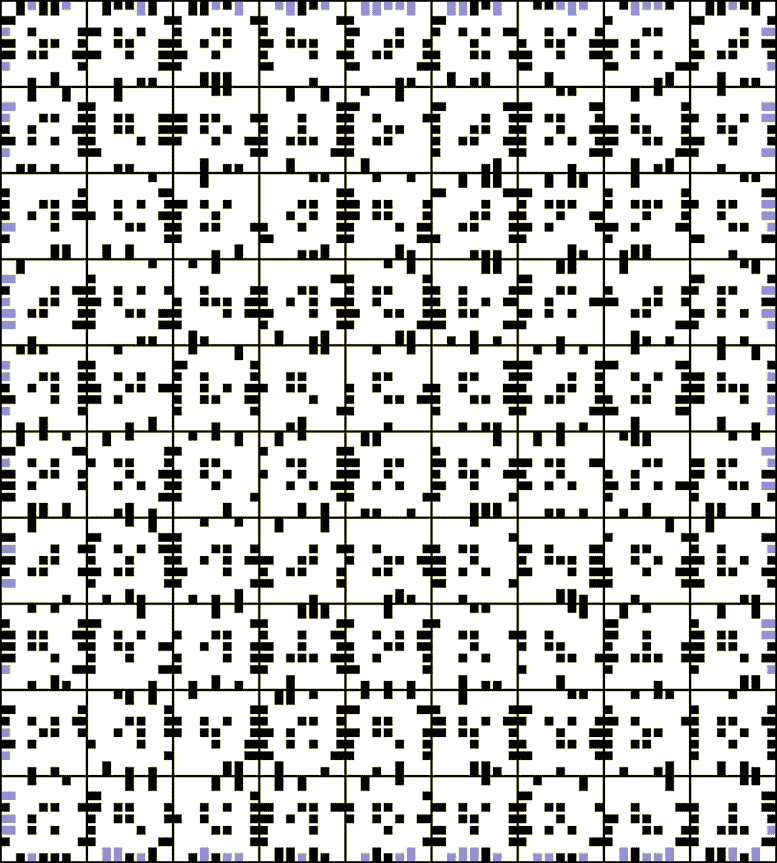

# 十九、附录 a：趣味页面

这张图中有四个独立的密码，从 S1 到 S4。每个密码都是简单的单字母替换 。你的工作就是识别类型，比如莫尔斯码，然后求解。每个密码都是用标准英语写的，使用大写字母，没有空格或标点。每个密码的长度在 75 到 90 个字母之间。所有都从左上角的单元格开始。前 3 个密码从左到右排列。最后一个密码是顺时针绕着边界读的。

这本书里描述了所有的方法。唯一的区别是视觉呈现。您需要确定每个密码中的相关特征，如高度、宽度、位置或颜色。你可以按照本书其他地方的说明提交答案以获得学分。

这里有一些附加的有趣的密码，使用了一些最流行的业余爱好者密码。这些是标准英语，有几个专有名词。按照惯例，字母按五个一组，不考虑时间段。如果你想要更多这样的密码，可以考虑加入 cryptogram.org T2 T3 T4 的美国密码协会。你可以按照本书其他地方隐藏的说明提交答案以获得学分。你可以在 www.contestcen.com/crypt.htm 找到更多密码来解开。

F1: 贝拉索密码 T3(5 . 8 . 1 节)

F2: Vigenère 密码(第 5.8.2 节)

F3:柱状换位(7.2 节)

F4:公平密码 ( 第 9.2 节)

F5:双歧密码(第 9.6 节)

块大小为 7，主题为园艺。

F6:一次性密码本(第 14 章)

对于消息中的每个字母，都会生成一个随机数。如果这个数是偶数，X 以 26 为模加到字母上，否则 Y 以 26 为模加。

一次性密码本当然不是业余爱好者的密码。我把它作为一个有趣的密码来说明一些一次性密码在实践中是可以被破解的。你能看到如何在不尝试所有 676 个组合的情况下找到 X 和 Y 的值吗？

F7:通用多字母符号(第 5.9.3 节)

为了更加有趣，游戏中有来自多种语言的角色，使用了超过 26 个角色。然而，每个字母表只包含 26 个不同的字符，而且信息是用标准英语。

